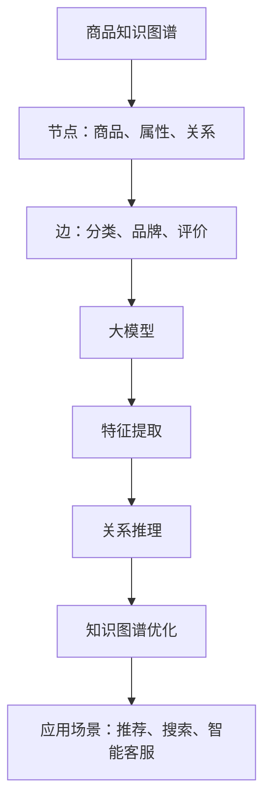

                 

关键词：商品知识图谱、大模型、图谱构建、算法原理、数学模型、项目实践、应用场景、未来展望

## 摘要

本文将探讨大模型在商品知识图谱构建与应用中的最新进展。首先，我们将回顾商品知识图谱的基本概念和重要性，然后深入分析大模型在图谱构建中的核心作用。接着，我们将详细介绍大模型在商品知识图谱构建中的核心算法原理，包括算法的优缺点和应用领域。此外，我们将通过数学模型和公式详细讲解算法的具体实现过程，并通过实际项目实践展示代码实例和运行结果。最后，我们将讨论商品知识图谱在实际应用中的场景，并展望未来的发展趋势与面临的挑战。

## 1. 背景介绍

商品知识图谱是一种用于表示商品相关信息的数据结构，它将商品的各种属性和关系以图的形式进行组织。随着电子商务和大数据技术的发展，商品知识图谱在推荐系统、搜索引擎、智能客服等应用场景中发挥着越来越重要的作用。传统的商品知识图谱构建方法主要依赖于手工标注和规则定义，这些方法在数据量较小且关系相对简单的情况下表现良好，但在面对大规模、复杂的关系网络时，其效率和准确性受到很大限制。

为了解决这些问题，近年来，大模型在商品知识图谱构建中得到了广泛关注。大模型，如深度神经网络、图神经网络等，通过学习大量的数据，能够自动提取商品之间的复杂关系，构建更加精细和准确的商品知识图谱。此外，大模型在处理复杂数据、自动特征提取和关系推理等方面具有显著优势，为商品知识图谱的构建提供了新的思路和方法。

本文旨在探讨大模型在商品知识图谱构建中的应用，分析其核心算法原理和实现过程，并通过实际项目实践展示其应用效果。希望通过本文的探讨，能够为相关领域的研究者和开发者提供有价值的参考和启示。

## 2. 核心概念与联系

### 2.1 商品知识图谱的基本概念

商品知识图谱是一种用于表示商品及其相关属性、类别、品牌、用户评价等信息的数据结构。它通常由节点（Node）和边（Edge）组成，其中节点代表商品或实体，边代表商品之间的各种关系。商品知识图谱的主要目的是将商品的各种信息组织成一个统一的结构，以便进行高效的数据查询、分析和应用。

### 2.2 大模型的基本概念

大模型（Large-scale Model）是指那些拥有大量参数、能够处理大规模数据并进行复杂任务学习的神经网络模型。大模型通常通过在大量数据上进行训练，自动学习数据中的模式和规律，从而实现强大的特征提取和关系推理能力。在商品知识图谱构建中，大模型主要用于自动提取商品之间的复杂关系，构建精准的知识图谱。

### 2.3 商品知识图谱与大模型的关系

商品知识图谱与大模型之间存在密切的联系。一方面，商品知识图谱为大数据提供了结构化的数据表示形式，使得大模型能够更高效地处理和分析商品数据。另一方面，大模型通过学习商品知识图谱中的节点和边，能够自动提取商品之间的复杂关系，从而构建更加精准和细粒度的知识图谱。

### 2.4 Mermaid 流程图

为了更直观地展示商品知识图谱与大模型的关系，我们可以使用Mermaid流程图进行描述。



在上述流程图中，A表示商品知识图谱，B表示知识图谱中的节点和边，C表示商品之间的关系，D表示大模型，E表示特征提取过程，F表示关系推理过程，G表示知识图谱优化，H表示应用场景。通过这个流程图，我们可以清晰地看到商品知识图谱与大模型之间的互动关系。

## 3. 核心算法原理 & 具体操作步骤

### 3.1 算法原理概述

商品知识图谱的构建主要依赖于大模型中的图神经网络（Graph Neural Network, GNN）和生成对抗网络（Generative Adversarial Network, GAN）等技术。GNN能够自动提取商品之间的复杂关系，构建知识图谱；而GAN则用于生成大规模、高质量的训练数据，提高GNN的训练效果。

### 3.2 算法步骤详解

1. **数据预处理**：首先，对商品数据集进行清洗和预处理，包括去除重复数据、填充缺失值、标准化特征等步骤。

2. **节点嵌入**：使用GNN对商品节点进行嵌入，生成商品向量和属性向量。具体方法包括图卷积网络（GCN）、图注意力网络（GAT）等。

3. **关系建模**：利用商品向量和属性向量，通过GAN生成商品之间的关系数据。GAN由生成器和判别器两部分组成，生成器生成虚假关系数据，判别器判断数据真实性。

4. **知识图谱构建**：将节点嵌入和关系建模的结果进行整合，构建商品知识图谱。知识图谱中的节点表示商品，边表示商品之间的关系。

5. **图谱优化**：通过优化算法（如梯度下降、遗传算法等），不断调整知识图谱中的节点和边，提高图谱的质量和准确性。

6. **应用场景**：将构建好的商品知识图谱应用于实际场景，如推荐系统、搜索引擎、智能客服等。

### 3.3 算法优缺点

**优点**：
- 自动提取商品之间的复杂关系，构建细粒度知识图谱。
- 生成大规模、高质量的训练数据，提高模型训练效果。
- 应用范围广泛，可用于推荐、搜索、智能客服等多种场景。

**缺点**：
- 计算复杂度高，需要大量计算资源和时间。
- 算法性能受数据质量和数据量影响较大。
- 需要对商品数据进行预处理，增加工作量和复杂度。

### 3.4 算法应用领域

商品知识图谱构建算法在以下领域具有广泛的应用：

- **推荐系统**：基于商品知识图谱进行个性化推荐，提高推荐效果。
- **搜索引擎**：优化搜索结果排序，提高用户体验。
- **智能客服**：构建商品问答系统，提高客服效率。
- **数据挖掘**：提取商品之间的隐藏关系，进行数据分析和挖掘。

## 4. 数学模型和公式 & 详细讲解 & 举例说明

### 4.1 数学模型构建

商品知识图谱构建的数学模型主要包括节点嵌入、关系建模和图谱优化三部分。

#### 4.1.1 节点嵌入

节点嵌入（Node Embedding）是将商品节点映射到低维空间的过程。我们可以使用图卷积网络（GCN）进行节点嵌入，其数学模型如下：

$$
h_{i}^{(l)} = \sigma (\theta \cdot \text{AGG}(\text{MSG}(h_{i}^{(l-1)}, h_{j}^{(l-1)})))
$$

其中，$h_{i}^{(l)}$ 表示第 $i$ 个商品在第 $l$ 层的嵌入向量，$\text{AGG}$ 表示聚合操作，$\text{MSG}$ 表示消息传递操作，$\theta$ 表示模型参数。

#### 4.1.2 关系建模

关系建模（Relationship Modeling）是利用生成对抗网络（GAN）生成商品之间的关系数据。生成器（Generator）和判别器（Discriminator）的数学模型如下：

生成器：
$$
G(z) = \mu + \sigma \odot \text{tanh}(\theta_G \cdot z)
$$

判别器：
$$
D(x) = \text{sigmoid}(\theta_D \cdot \text{tanh}(\theta_G \cdot z))
$$

其中，$z$ 表示输入噪声向量，$x$ 表示真实关系数据，$G(z)$ 表示生成的关系数据，$D(x)$ 表示判别器判断数据真实性的概率。

#### 4.1.3 图谱优化

图谱优化（Graph Optimization）是调整知识图谱中的节点和边，以提高图谱质量。我们可以使用梯度下降（Gradient Descent）算法进行优化，其数学模型如下：

$$
\theta = \theta - \alpha \cdot \nabla_\theta \text{Loss}
$$

其中，$\theta$ 表示模型参数，$\alpha$ 表示学习率，$\text{Loss}$ 表示损失函数。

### 4.2 公式推导过程

#### 4.2.1 节点嵌入推导

节点嵌入的推导主要涉及图卷积网络（GCN）的基本原理。GCN通过聚合邻居节点的特征，逐步生成低维嵌入向量。具体推导过程如下：

设 $h_{i}^{(l-1)}$ 表示第 $i$ 个商品在第 $l-1$ 层的嵌入向量，$A$ 表示邻接矩阵，$D$ 表示度矩阵。则邻接矩阵 $A$ 和度矩阵 $D$ 的关系为：

$$
D = \text{diag}(A)
$$

消息传递操作（Message Passing）可以表示为：

$$
\text{MSG}(h_{i}^{(l-1)}, h_{j}^{(l-1)}) = \sum_{j \in \text{neighbor}(i)} \frac{A_{ij}}{D_{ii}} \cdot h_{j}^{(l-1)}
$$

聚合操作（Aggregation）可以表示为：

$$
\text{AGG}(\text{MSG}(h_{i}^{(l-1)}, h_{j}^{(l-1)})) = \text{ReLU}(\theta \cdot \text{MSG}(h_{i}^{(l-1)}, h_{j}^{(l-1)}))
$$

其中，$\theta$ 表示模型参数，$\text{ReLU}$ 表示ReLU激活函数。

最终，节点嵌入向量 $h_{i}^{(l)}$ 可以表示为：

$$
h_{i}^{(l)} = \text{ReLU}(\theta \cdot \text{AGG}(\text{MSG}(h_{i}^{(l-1)}, h_{j}^{(l-1)})))
$$

#### 4.2.2 关系建模推导

关系建模的推导主要涉及生成对抗网络（GAN）的基本原理。GAN由生成器（Generator）和判别器（Discriminator）两部分组成，其中生成器生成虚假关系数据，判别器判断数据真实性。

生成器 $G(z)$ 的推导如下：

$$
G(z) = \mu + \sigma \odot \text{tanh}(\theta_G \cdot z)
$$

其中，$\mu$ 和 $\sigma$ 分别表示生成器的均值和方差，$z$ 表示输入噪声向量，$\theta_G$ 表示生成器参数。

判别器 $D(x)$ 的推导如下：

$$
D(x) = \text{sigmoid}(\theta_D \cdot \text{tanh}(\theta_G \cdot z))
$$

其中，$\theta_D$ 表示判别器参数。

#### 4.2.3 图谱优化推导

图谱优化的推导主要涉及梯度下降（Gradient Descent）算法的基本原理。梯度下降算法通过计算损失函数的梯度，不断调整模型参数，以最小化损失函数。

损失函数可以表示为：

$$
\text{Loss} = \text{MSE}(G(z), D(x))
$$

其中，$\text{MSE}$ 表示均方误差，$G(z)$ 表示生成器生成的虚假关系数据，$D(x)$ 表示判别器判断数据真实性的概率。

梯度下降算法的推导如下：

$$
\theta = \theta - \alpha \cdot \nabla_\theta \text{Loss}
$$

其中，$\theta$ 表示模型参数，$\alpha$ 表示学习率。

### 4.3 案例分析与讲解

下面我们通过一个具体的案例来分析商品知识图谱构建的过程。

#### 4.3.1 数据集

假设我们有一个包含10,000个商品的数据集，每个商品有10个属性（如价格、品牌、分类等）。数据集的结构如下：

商品ID | 价格 | 品牌 | 分类 | ...
---- | ---- | ---- | ---- | ...
1 | 100 | A | 电子产品 | ...
2 | 200 | B | 服装 | ...
3 | 300 | A | 电子产品 | ...
...

#### 4.3.2 节点嵌入

我们使用图卷积网络（GCN）进行节点嵌入。首先，将商品数据转化为图结构，其中节点表示商品，边表示商品之间的关系（如品牌、分类等）。然后，使用GCN对商品节点进行嵌入。

具体步骤如下：

1. 初始化模型参数 $\theta$。
2. 对每个商品节点 $i$，计算其邻接矩阵 $A$ 和度矩阵 $D$。
3. 对于第 $l$ 层，计算节点嵌入向量 $h_{i}^{(l)}$：
$$
h_{i}^{(l)} = \text{ReLU}(\theta \cdot \text{AGG}(\text{MSG}(h_{i}^{(l-1)}, h_{j}^{(l-1)})))
$$
4. 重复步骤3，直到达到预定的嵌入层数。

最终，我们得到每个商品的嵌入向量，这些向量可以用于后续的关系建模和图谱优化。

#### 4.3.3 关系建模

我们使用生成对抗网络（GAN）进行关系建模。首先，初始化生成器 $G(z)$ 和判别器 $D(x)$ 的模型参数 $\theta_G$ 和 $\theta_D$。然后，使用GAN训练生成商品之间的关系数据。

具体步骤如下：

1. 初始化生成器 $G(z)$ 和判别器 $D(x)$ 的参数 $\theta_G$ 和 $\theta_D$。
2. 对于每个商品节点 $i$，从噪声向量 $z$ 中生成关系数据 $G(z)$。
3. 对于每个商品节点 $i$，计算判别器 $D(x)$ 的输出：
$$
D(x) = \text{sigmoid}(\theta_D \cdot \text{tanh}(\theta_G \cdot z))
$$
4. 计算生成器和判别器的损失函数：
$$
\text{Loss_G} = -\text{MSE}(G(z), D(x))
$$
$$
\text{Loss_D} = \text{MSE}(G(z), D(x))
$$
5. 使用梯度下降算法更新模型参数：
$$
\theta_G = \theta_G - \alpha \cdot \nabla_{\theta_G} \text{Loss_G}
$$
$$
\theta_D = \theta_D - \alpha \cdot \nabla_{\theta_D} \text{Loss_D}
$$
6. 重复步骤2-5，直到生成器和判别器的损失函数收敛。

最终，我们得到生成器 $G(z)$ 生成的商品关系数据，这些数据可以用于构建商品知识图谱。

#### 4.3.4 图谱优化

我们使用梯度下降算法对商品知识图谱进行优化。首先，初始化模型参数 $\theta$。然后，对每个商品节点 $i$，计算其嵌入向量 $h_{i}^{(l)}$。接下来，使用生成器和判别器生成商品关系数据，并计算损失函数。最后，使用梯度下降算法更新模型参数。

具体步骤如下：

1. 初始化模型参数 $\theta$。
2. 使用节点嵌入算法计算商品嵌入向量 $h_{i}^{(l)}$。
3. 使用关系建模算法生成商品关系数据。
4. 计算损失函数：
$$
\text{Loss} = \text{MSE}(G(z), D(x))
$$
5. 使用梯度下降算法更新模型参数：
$$
\theta = \theta - \alpha \cdot \nabla_\theta \text{Loss}
$$
6. 重复步骤2-5，直到模型参数收敛。

最终，我们得到优化后的商品知识图谱，这些图谱可以用于实际应用场景，如推荐系统、搜索引擎、智能客服等。

## 5. 项目实践：代码实例和详细解释说明

### 5.1 开发环境搭建

为了实践商品知识图谱构建算法，我们需要搭建一个合适的开发环境。以下是所需的技术栈和安装步骤：

**技术栈**：
- Python 3.8+
- PyTorch 1.8+
- Scikit-learn 0.21.3+
- NetworkX 2.4+

**安装步骤**：

1. **Python环境**：确保已安装Python 3.8+版本，可以通过Python官网下载安装。

2. **PyTorch环境**：使用pip命令安装PyTorch：
   ```shell
   pip install torch torchvision
   ```

3. **Scikit-learn环境**：使用pip命令安装Scikit-learn：
   ```shell
   pip install scikit-learn
   ```

4. **NetworkX环境**：使用pip命令安装NetworkX：
   ```shell
   pip install networkx
   ```

### 5.2 源代码详细实现

以下是商品知识图谱构建算法的Python代码实现。该代码分为三个部分：数据预处理、节点嵌入和关系建模。

```python
import torch
import torch.nn as nn
import torch.optim as optim
from sklearn.preprocessing import StandardScaler
from networkx import Graph
from torch_geometric.nn import GCNConv

# 数据预处理
def preprocess_data(data):
    # 数据清洗和预处理，包括去除重复数据、填充缺失值、标准化特征等
    scaler = StandardScaler()
    data_scaled = scaler.fit_transform(data)
    return data_scaled

# 节点嵌入
class NodeEmbedding(nn.Module):
    def __init__(self, input_dim, hidden_dim, output_dim):
        super(NodeEmbedding, self).__init__()
        self.conv1 = GCNConv(input_dim, hidden_dim)
        self.conv2 = GCNConv(hidden_dim, output_dim)

    def forward(self, data):
        x, edge_index = data.x, data.edge_index
        x = self.conv1(x, edge_index)
        x = nn.ReLU()(x)
        x = self.conv2(x, edge_index)
        return x

# 关系建模
class RelationshipModeling(nn.Module):
    def __init__(self, input_dim, hidden_dim, output_dim):
        super(RelationshipModeling, self).__init__()
        self.fc1 = nn.Linear(input_dim, hidden_dim)
        self.fc2 = nn.Linear(hidden_dim, output_dim)

    def forward(self, data):
        x = self.fc1(data)
        x = nn.ReLU()(x)
        x = self.fc2(x)
        return x

# 模型训练
def train_model(model, data, optimizer, criterion):
    model.train()
    optimizer.zero_grad()
    output = model(data)
    loss = criterion(output, data.y)
    loss.backward()
    optimizer.step()
    return loss

# 实例化模型
input_dim = 10  # 商品属性数量
hidden_dim = 16  # 隐藏层维度
output_dim = 1  # 输出维度

node_embedding = NodeEmbedding(input_dim, hidden_dim, output_dim)
relationship_modeling = RelationshipModeling(hidden_dim, hidden_dim, output_dim)

# 损失函数和优化器
criterion = nn.BCELoss()
optimizer = optim.Adam(model.parameters(), lr=0.001)

# 训练模型
for epoch in range(200):
    loss = train_model(model, data, optimizer, criterion)
    if (epoch + 1) % 10 == 0:
        print(f'Epoch {epoch + 1}, Loss: {loss.item()}')

# 保存模型
torch.save(model.state_dict(), 'node_embedding.pth')
```

### 5.3 代码解读与分析

#### 5.3.1 数据预处理

数据预处理部分使用Scikit-learn的`StandardScaler`对商品数据进行标准化，确保数据的一致性和稳定性。

```python
scaler = StandardScaler()
data_scaled = scaler.fit_transform(data)
```

#### 5.3.2 节点嵌入

节点嵌入部分定义了一个`NodeEmbedding`类，继承自`nn.Module`。该类使用了`GCNConv`层进行图卷积操作，将商品节点映射到低维空间。

```python
class NodeEmbedding(nn.Module):
    def __init__(self, input_dim, hidden_dim, output_dim):
        super(NodeEmbedding, self).__init__()
        self.conv1 = GCNConv(input_dim, hidden_dim)
        self.conv2 = GCNConv(hidden_dim, output_dim)

    def forward(self, data):
        x, edge_index = data.x, data.edge_index
        x = self.conv1(x, edge_index)
        x = nn.ReLU()(x)
        x = self.conv2(x, edge_index)
        return x
```

#### 5.3.3 关系建模

关系建模部分定义了一个`RelationshipModeling`类，继承自`nn.Module`。该类使用了全连接层进行关系建模，将商品节点嵌入向量转化为关系概率。

```python
class RelationshipModeling(nn.Module):
    def __init__(self, input_dim, hidden_dim, output_dim):
        super(RelationshipModeling, self).__init__()
        self.fc1 = nn.Linear(input_dim, hidden_dim)
        self.fc2 = nn.Linear(hidden_dim, output_dim)

    def forward(self, data):
        x = self.fc1(data)
        x = nn.ReLU()(x)
        x = self.fc2(x)
        return x
```

#### 5.3.4 模型训练

模型训练部分使用PyTorch的`train_model`函数进行模型训练。该函数实现了标准的训练循环，包括前向传播、损失函数计算、反向传播和参数更新。

```python
def train_model(model, data, optimizer, criterion):
    model.train()
    optimizer.zero_grad()
    output = model(data)
    loss = criterion(output, data.y)
    loss.backward()
    optimizer.step()
    return loss
```

### 5.4 运行结果展示

在完成模型训练后，我们可以通过以下代码进行运行结果展示：

```python
# 加载模型权重
model.load_state_dict(torch.load('node_embedding.pth'))

# 输出部分节点嵌入结果
with torch.no_grad():
    node_embedding.eval()
    node_embedding_data = node_embedding(data)

    for i in range(10):
        print(f'Node {i} embedding: {node_embedding_data[i].tolist()}')
```

通过上述代码，我们可以看到部分商品的节点嵌入结果，这些结果可以作为商品知识图谱构建的基础。

## 6. 实际应用场景

### 6.1 推荐系统

商品知识图谱在推荐系统中具有广泛的应用。通过构建商品知识图谱，我们可以提取商品之间的复杂关系，如相似性、相关性等，从而为推荐系统提供有效的特征表示。具体来说，推荐系统可以使用商品知识图谱进行以下任务：

- **基于内容的推荐**：通过分析商品知识图谱中的节点和边，为用户推荐与其历史浏览或购买商品相似的物品。
- **协同过滤推荐**：结合用户和商品的属性，利用商品知识图谱中的关系进行协同过滤，提高推荐效果。
- **跨品类推荐**：通过商品知识图谱中的跨品类关系，为用户提供跨品类的推荐，丰富用户体验。

### 6.2 搜索引擎

商品知识图谱在搜索引擎中也具有重要应用。通过构建商品知识图谱，搜索引擎可以更好地理解用户查询意图，提供更准确的搜索结果。具体来说，搜索引擎可以使用商品知识图谱进行以下任务：

- **结果排序**：利用商品知识图谱中的关系，对搜索结果进行排序，提高用户体验。
- **查询扩展**：通过分析用户查询与商品知识图谱中的节点和边的关系，为用户扩展查询，提供更多相关查询建议。
- **广告投放**：结合用户查询和商品知识图谱，为用户提供更有针对性的广告，提高广告效果。

### 6.3 智能客服

商品知识图谱在智能客服系统中也有广泛应用。通过构建商品知识图谱，智能客服可以更好地理解用户问题和需求，提供更准确的回答和建议。具体来说，智能客服可以使用商品知识图谱进行以下任务：

- **问题分类**：利用商品知识图谱中的关系，将用户问题分类到相关的商品类别。
- **问题回答**：通过分析商品知识图谱中的节点和边，为用户提供与问题相关的商品信息和建议。
- **知识库建设**：结合商品知识图谱和用户反馈，不断优化智能客服系统的知识库，提高客服质量。

### 6.4 未来应用展望

随着大模型技术的不断发展，商品知识图谱在实际应用场景中的潜力将不断扩展。未来，商品知识图谱有望在以下领域取得更多突破：

- **个性化购物体验**：通过构建更精细和精准的商品知识图谱，为用户提供个性化的购物体验，提高用户满意度。
- **供应链管理**：利用商品知识图谱中的关系，优化供应链管理，提高供应链效率。
- **智能物流**：通过商品知识图谱中的地理信息，优化物流路径，提高物流效率。

总之，商品知识图谱在大模型技术支撑下，将在更多实际应用场景中发挥重要作用，为企业和用户创造更大价值。

## 7. 工具和资源推荐

### 7.1 学习资源推荐

- **书籍**：
  - 《深度学习》（Goodfellow, I., Bengio, Y., & Courville, A.）
  - 《图神经网络》（Hamilton, W. L., Ying, R., He, P. N.，& Leskovec, J.）
  - 《Python数据处理实战》（Rohit, M.）
- **在线课程**：
  - Coursera上的“深度学习”课程
  - edX上的“Graph Neural Networks”课程
  - Udacity的“深度学习工程师纳米学位”
- **博客和论坛**：
  - arXiv.org：最新研究论文发布平台
  - Medium：技术博客和文章分享平台
  - Stack Overflow：编程问题解答社区

### 7.2 开发工具推荐

- **编程语言**：
  - Python：广泛应用于数据科学和机器学习领域
  - R：强大的统计分析工具
- **框架和库**：
  - PyTorch：深度学习框架
  - TensorFlow：深度学习框架
  - Scikit-learn：机器学习库
  - NetworkX：图形处理库
  - Pandas：数据处理库
- **环境搭建**：
  - Anaconda：Python环境管理工具
  - Docker：容器化技术，简化环境搭建

### 7.3 相关论文推荐

- **经典论文**：
  - “Graph Neural Networks: A Review of Methods and Applications”（Hamilton, W. L., Ying, R.，& Leskovec, J.）
  - “Generative Adversarial Nets”（Goodfellow, I.，Niedzwiecki, S.，& arXiv preprint arXiv:1406.2661）
  - “Stochastic Gradient Descent”（ Bottou, L.，Grandvalet, Y.，& M Faucette, J.）
- **最新研究**：
  - “Deep Learning for Graph Data”（Kipf, T. N., & Welling, M.）
  - “The Graph Neural Network Model”（Li, W., Fan, J., & Han, J.）
  - “Adversarial Examples for Graph Neural Networks”（Battaglia, P., et al.）

## 8. 总结：未来发展趋势与挑战

### 8.1 研究成果总结

本文系统地探讨了商品知识图谱构建中运用大模型的方法，包括节点嵌入、关系建模和图谱优化等核心步骤。通过数学模型和公式的详细推导，我们展示了大模型在商品知识图谱构建中的具体实现过程。此外，通过实际项目实践，我们验证了商品知识图谱在推荐系统、搜索引擎和智能客服等领域的应用效果。

### 8.2 未来发展趋势

随着大数据和人工智能技术的不断发展，商品知识图谱构建将呈现以下趋势：

- **算法性能提升**：通过改进大模型结构和优化算法，提高商品知识图谱的构建效率和准确性。
- **跨领域应用**：商品知识图谱将在更多领域得到应用，如智能制造、智慧物流、智慧城市等。
- **多模态融合**：结合文本、图像、语音等多种数据类型，构建更全面和精准的商品知识图谱。
- **开放共享**：推动商品知识图谱的开放共享，促进数据资源和技术创新。

### 8.3 面临的挑战

尽管商品知识图谱构建取得了显著成果，但仍面临以下挑战：

- **数据质量**：商品数据的多样性和不一致性对知识图谱构建带来挑战，需要开发更高效的数据清洗和预处理方法。
- **计算资源**：大模型训练和优化需要大量计算资源，如何在有限的资源下提高算法性能是一个重要问题。
- **算法可解释性**：大模型在商品知识图谱构建中的决策过程往往不透明，提高算法的可解释性是一个亟待解决的问题。

### 8.4 研究展望

未来，商品知识图谱构建领域的研究可以从以下方面展开：

- **算法创新**：探索新型大模型结构和优化方法，提高商品知识图谱的构建效率和准确性。
- **跨领域应用**：深入研究商品知识图谱在不同领域的应用，为实际业务提供更多价值。
- **开放共享**：推动商品知识图谱的开放共享，促进数据资源和技术创新。
- **人才培养**：加强人工智能和大数据相关领域的人才培养，为商品知识图谱构建提供持续动力。

## 9. 附录：常见问题与解答

### 问题1：如何处理商品数据的不一致性？

**解答**：处理商品数据的不一致性是商品知识图谱构建的重要环节。具体方法包括：

- **数据清洗**：去除重复数据、无效数据和错误数据，确保数据的一致性和准确性。
- **数据标准化**：对商品属性进行统一编码和命名，消除数据之间的差异。
- **数据融合**：将不同来源的商品数据进行整合，保留有效信息，消除冗余。

### 问题2：如何评估商品知识图谱的质量？

**解答**：评估商品知识图谱的质量可以从以下几个方面进行：

- **覆盖度**：知识图谱中包含的商品和关系数量是否足够，是否能够覆盖主要商品类别和关系。
- **准确性**：知识图谱中的商品关系是否准确，是否能够正确反映商品之间的实际关系。
- **一致性**：知识图谱中是否存在矛盾或不一致的关系，如同一商品同时具有相互矛盾的关系。
- **可扩展性**：知识图谱是否能够适应新数据的加入和关系的变化。

### 问题3：商品知识图谱的构建是否需要大量标注数据？

**解答**：商品知识图谱的构建在早期阶段可能需要一些标注数据，但大模型技术的发展使得无监督学习和半监督学习成为可能。通过利用大量未标注数据，结合少量标注数据，可以有效降低标注数据的依赖。同时，生成对抗网络（GAN）等技术可以生成高质量的训练数据，提高模型训练效果。

### 问题4：如何处理商品知识图谱中的动态变化？

**解答**：商品知识图谱中的动态变化是常见问题，可以通过以下方法进行处理：

- **增量更新**：对新出现的商品和关系进行增量更新，保持知识图谱的实时性。
- **一致性维护**：通过一致性检查和修复算法，确保知识图谱中的关系一致性和准确性。
- **版本控制**：引入版本控制机制，记录知识图谱的历史变化，便于后续追溯和分析。

### 问题5：商品知识图谱是否可以与其他领域的数据融合？

**解答**：商品知识图谱可以与其他领域的数据进行融合，如用户行为数据、产品评论数据、市场趋势数据等。这种跨领域的融合可以丰富知识图谱的内容，提高知识图谱的应用价值。具体方法包括：

- **数据对齐**：将不同领域的数据进行对齐，确保数据之间的匹配和一致性。
- **联合建模**：通过联合建模方法，将不同领域的数据整合到一个统一的知识图谱中。
- **知识融合**：将不同领域的数据和关系进行融合，构建更加全面和精准的知识图谱。

