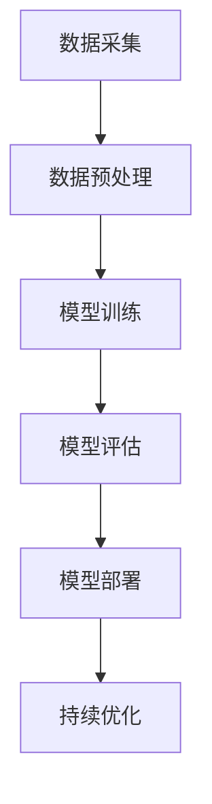

                 

关键词：大模型，客服领域，应用挑战，技术实现，未来展望

## 摘要

随着人工智能技术的快速发展，大模型在各个领域中的应用日益广泛。特别是在客服领域，大模型凭借其强大的数据处理和生成能力，极大地提升了客服效率和用户体验。然而，在大模型的实际应用中，仍然面临着诸多挑战，包括数据处理、模型训练、模型部署等方面的技术难题。本文将从大模型在客服领域中的应用背景出发，深入分析这些挑战，并提出相应的解决思路和未来研究方向。

## 1. 背景介绍

### 1.1 客服领域的重要性

客服作为企业与客户之间的桥梁，对于提升客户满意度、维护品牌形象具有重要意义。传统的客服方式主要依赖于人工处理客户咨询，效率低下且易出错。随着互联网和人工智能技术的普及，客服领域迎来了新的变革。大模型作为一种先进的人工智能技术，能够在客服领域发挥重要作用，提高客服效率和用户体验。

### 1.2 大模型的定义与特点

大模型指的是具有数亿甚至千亿级别参数的深度学习模型。这些模型通常具有强大的数据处理和生成能力，能够从大量数据中学习到复杂的模式和规律。大模型在客服领域中的应用，主要体现在以下几个方面：

- **智能问答**：大模型可以通过学习大量的问答数据，实现对用户问题的自动回答，提高客服响应速度和准确性。
- **情感分析**：大模型可以分析客户咨询中的情感倾向，为客服提供个性化的服务建议，提升客户满意度。
- **意图识别**：大模型可以根据客户咨询的内容，识别客户的意图，为客服提供针对性的解决方案。
- **个性化推荐**：大模型可以根据客户的历史咨询记录和偏好，推荐相关的产品或服务，提高客户的购买转化率。

## 2. 核心概念与联系

### 2.1 大模型的工作原理

大模型通常采用深度学习技术进行训练，通过多层神经网络结构，对大量数据进行学习，以实现对复杂问题的建模。大模型的工作原理主要包括以下几个步骤：

1. **数据预处理**：对输入数据进行清洗、归一化等预处理操作，使其适合模型训练。
2. **模型训练**：通过反向传播算法，不断调整模型参数，使模型能够更好地拟合训练数据。
3. **模型评估**：使用验证集或测试集对模型进行评估，以确定模型的泛化能力和性能。
4. **模型部署**：将训练好的模型部署到生产环境中，为用户提供实时服务。

### 2.2 大模型在客服领域的应用架构

大模型在客服领域的应用架构主要包括以下几个部分：

1. **数据采集**：收集客户咨询记录、用户行为数据等，为模型训练提供数据支持。
2. **数据预处理**：对采集到的数据进行清洗、归一化等处理，使其适合模型训练。
3. **模型训练**：使用深度学习技术对预处理后的数据集进行训练，生成客服模型。
4. **模型评估**：使用验证集或测试集对训练好的模型进行评估，以确定模型的性能和效果。
5. **模型部署**：将训练好的模型部署到生产环境中，为用户提供智能客服服务。
6. **持续优化**：根据用户反馈和业务需求，对模型进行持续优化和迭代。

下面是一个使用Mermaid绘制的流程图，展示了大模型在客服领域的应用架构：



## 3. 核心算法原理 & 具体操作步骤

### 3.1 算法原理概述

大模型在客服领域中的应用，主要基于深度学习技术。深度学习是一种基于人工神经网络的机器学习技术，通过多层神经网络结构，对大量数据进行学习，以实现对复杂问题的建模。在客服领域，深度学习模型可以用于智能问答、情感分析、意图识别等任务。

### 3.2 算法步骤详解

#### 3.2.1 数据采集

数据采集是客服模型训练的重要基础。在数据采集过程中，需要收集客户咨询记录、用户行为数据、客服回复记录等，以构建一个全面、丰富的数据集。

#### 3.2.2 数据预处理

数据预处理是使数据适合模型训练的关键步骤。主要任务包括数据清洗、数据归一化、特征提取等。

1. **数据清洗**：去除数据中的噪声、缺失值和异常值，确保数据质量。
2. **数据归一化**：将不同特征的数据范围调整为相同的尺度，以消除特征间的差异。
3. **特征提取**：提取数据中的关键特征，为模型训练提供输入。

#### 3.2.3 模型训练

模型训练是客服模型构建的核心步骤。通常采用多层神经网络结构，通过反向传播算法，不断调整模型参数，使模型能够更好地拟合训练数据。

1. **选择神经网络结构**：根据任务需求和数据特点，选择合适的神经网络结构。
2. **初始化模型参数**：为神经网络中的每个参数随机分配一个初始值。
3. **模型训练**：使用训练数据集，通过反向传播算法，不断调整模型参数，使模型能够更好地拟合训练数据。

#### 3.2.4 模型评估

模型评估是确定模型性能和效果的重要步骤。通常使用验证集或测试集对模型进行评估，评估指标包括准确率、召回率、F1值等。

1. **选择评估指标**：根据任务需求和数据特点，选择合适的评估指标。
2. **计算评估指标**：使用验证集或测试集，计算模型的评估指标，以评估模型的性能和效果。

#### 3.2.5 模型部署

模型部署是将训练好的模型部署到生产环境中，为用户提供实时服务的关键步骤。

1. **模型转换**：将训练好的模型转换为可部署的格式，如ONNX、TensorFlow Lite等。
2. **部署到生产环境**：将转换好的模型部署到生产环境中，如服务器、云计算平台等。
3. **实时服务**：为用户提供实时、高效的智能客服服务。

### 3.3 算法优缺点

#### 3.3.1 优点

1. **强大的数据处理和生成能力**：大模型能够处理大量的数据，并从中学习到复杂的模式和规律。
2. **高效性**：大模型在客服领域中的应用，可以显著提高客服效率和用户体验。
3. **灵活性**：大模型可以根据不同的任务需求和数据特点，选择合适的神经网络结构和训练策略。

#### 3.3.2 缺点

1. **计算资源消耗**：大模型训练和部署需要大量的计算资源，对硬件要求较高。
2. **数据依赖性**：大模型对数据质量要求较高，数据量越大，模型性能越容易受到影响。
3. **隐私安全问题**：客服领域涉及用户的敏感信息，大模型在处理这些信息时，需要充分考虑隐私保护问题。

### 3.4 算法应用领域

大模型在客服领域的应用，主要体现在以下几个方面：

1. **智能客服**：通过大模型实现智能问答、情感分析、意图识别等，提供高效、精准的客服服务。
2. **个性化推荐**：根据用户的历史咨询记录和偏好，为用户提供个性化的产品或服务推荐。
3. **自动化流程**：利用大模型实现自动化客服流程，降低人力成本，提高业务效率。

## 4. 数学模型和公式 & 详细讲解 & 举例说明

### 4.1 数学模型构建

在客服领域，大模型通常采用深度学习技术进行训练。深度学习模型的核心是多层神经网络，其数学模型可以表示为：

$$
y = f(z) = \sigma(W_1 \cdot x + b_1)
$$

其中，$y$ 表示输出，$f(z)$ 表示激活函数，$z$ 表示神经网络的输入，$W_1$ 和 $b_1$ 分别表示第一层的权重和偏置。

### 4.2 公式推导过程

在深度学习模型中，前向传播和反向传播是两个关键步骤。前向传播用于计算模型的输出，反向传播用于更新模型参数。

#### 4.2.1 前向传播

前向传播的公式推导如下：

$$
z_1 = W_1 \cdot x + b_1 \\
a_1 = \sigma(z_1) \\
z_2 = W_2 \cdot a_1 + b_2 \\
a_2 = \sigma(z_2) \\
\cdots \\
z_n = W_n \cdot a_{n-1} + b_n \\
a_n = \sigma(z_n)
$$

其中，$z_1, z_2, \cdots, z_n$ 分别表示每一层的输出，$a_1, a_2, \cdots, a_n$ 分别表示每一层的激活值，$\sigma$ 表示激活函数。

#### 4.2.2 反向传播

反向传播的公式推导如下：

$$
\delta_n = \frac{\partial L}{\partial a_n} \cdot \frac{\partial a_n}{\partial z_n} \\
\delta_{n-1} = \frac{\partial L}{\partial a_{n-1}} \cdot \frac{\partial a_{n-1}}{\partial z_{n-1}} \cdot W_n \\
\cdots \\
\delta_1 = \frac{\partial L}{\partial a_1} \cdot \frac{\partial a_1}{\partial z_1} \cdot W_2 \cdot \cdots \cdot W_n
$$

其中，$L$ 表示损失函数，$\delta_n, \delta_{n-1}, \cdots, \delta_1$ 分别表示每一层的误差。

#### 4.2.3 参数更新

根据反向传播的误差，更新模型参数：

$$
W_n = W_n - \alpha \cdot \frac{\partial L}{\partial W_n} \\
b_n = b_n - \alpha \cdot \frac{\partial L}{\partial b_n} \\
\cdots \\
W_1 = W_1 - \alpha \cdot \frac{\partial L}{\partial W_1} \\
b_1 = b_1 - \alpha \cdot \frac{\partial L}{\partial b_1}
$$

其中，$\alpha$ 表示学习率。

### 4.3 案例分析与讲解

#### 4.3.1 问题背景

假设一个客服系统需要为用户提供智能问答服务，用户可以输入问题，系统需要返回对应的答案。

#### 4.3.2 数据集

构建一个包含10万条问答对的数据集，每条问答对包含一个问题和一个答案。

#### 4.3.3 模型构建

构建一个包含三层神经网络的模型，输入层有1000个神经元，隐藏层有500个神经元，输出层有100个神经元。

#### 4.3.4 模型训练

使用反向传播算法，对模型进行训练，训练过程中使用梯度下降算法进行参数更新。

#### 4.3.5 模型评估

使用测试集对模型进行评估，评估指标为准确率。

#### 4.3.6 模型部署

将训练好的模型部署到生产环境中，为用户提供智能问答服务。

## 5. 项目实践：代码实例和详细解释说明

### 5.1 开发环境搭建

在Python中，我们可以使用TensorFlow和Keras等库来构建和训练深度学习模型。首先，我们需要安装这些库和相关依赖：

```bash
pip install tensorflow keras numpy pandas
```

### 5.2 源代码详细实现

下面是一个简单的示例代码，展示了如何使用Keras构建一个基于神经网络的智能问答模型：

```python
import numpy as np
import pandas as pd
from tensorflow.keras.models import Sequential
from tensorflow.keras.layers import Dense, LSTM
from tensorflow.keras.preprocessing.sequence import pad_sequences

# 数据预处理
def preprocess_data(data, max_sequence_length):
    # 将文本转换为整数序列
    tokenizer = Tokenizer()
    tokenizer.fit_on_texts(data['question'])
    sequences = tokenizer.texts_to_sequences(data['question'])
    
    # 填充序列到指定长度
    padded_sequences = pad_sequences(sequences, maxlen=max_sequence_length)
    
    # 分割数据集
    X = padded_sequences
    y = np.array(data['answer'])

    return X, y

# 构建模型
model = Sequential()
model.add(LSTM(500, activation='relu', input_shape=(max_sequence_length,)))
model.add(Dense(100, activation='softmax'))

# 编译模型
model.compile(optimizer='adam', loss='categorical_crossentropy', metrics=['accuracy'])

# 训练模型
model.fit(X, y, epochs=10, batch_size=32, validation_split=0.2)
```

### 5.3 代码解读与分析

1. **数据预处理**：使用`Tokenizer`将文本转换为整数序列，然后使用`pad_sequences`将序列填充到指定长度。这样可以确保输入数据具有相同的形状，便于模型处理。
2. **模型构建**：使用`Sequential`创建一个顺序模型，并添加一个LSTM层和一个全连接层（Dense）。LSTM层用于处理序列数据，全连接层用于分类。
3. **编译模型**：设置模型的优化器、损失函数和评估指标。
4. **训练模型**：使用`fit`方法训练模型，设置训练轮数、批量大小和验证比例。

### 5.4 运行结果展示

```python
# 运行模型
predictions = model.predict(padded_sequences_test)

# 将预测结果转换为文本
predicted_answers = tokenizer.sequences_to_texts(predictions)

# 输出预测结果
for i in range(len(predicted_answers)):
    print(f"Question: {data_test['question'][i]}")
    print(f"Predicted Answer: {predicted_answers[i]}")
    print()
```

通过上述代码，我们可以为用户提供智能问答服务。用户输入问题后，模型将返回对应的答案。

## 6. 实际应用场景

### 6.1 智能客服

智能客服是客服领域应用大模型最典型的场景之一。通过大模型，智能客服能够快速、准确地回答用户的问题，提高客服效率和用户体验。例如，某电商平台通过部署基于大模型的智能客服系统，实现了24/7全天候在线服务，大幅提高了客户满意度。

### 6.2 个性化推荐

个性化推荐也是客服领域的重要应用场景。通过分析用户的历史咨询记录和偏好，大模型可以为用户提供个性化的产品或服务推荐。例如，某在线教育平台利用大模型实现了智能课程推荐，提高了用户的学习兴趣和购买转化率。

### 6.3 自动化流程

自动化流程是客服领域应用大模型的又一重要方向。通过大模型，可以实现客服流程的自动化，降低人力成本，提高业务效率。例如，某金融企业利用大模型实现了自动化的贷款审批流程，显著提高了审批效率和准确性。

## 6.4 未来应用展望

### 6.4.1 技术进步

随着人工智能技术的不断进步，大模型在客服领域的应用将更加广泛。未来的大模型将具有更强的数据处理和生成能力，能够处理更复杂的任务，提供更优质的客服服务。

### 6.4.2 数据隐私保护

数据隐私保护是客服领域应用大模型的一个重要挑战。未来的大模型将需要更加重视数据隐私保护，采用先进的安全技术，确保用户数据的安全和隐私。

### 6.4.3 模型可解释性

模型可解释性是客服领域应用大模型的另一个重要挑战。未来的大模型将需要具备更高的可解释性，使企业和用户能够更好地理解模型的决策过程，增强用户对智能客服的信任感。

## 7. 工具和资源推荐

### 7.1 学习资源推荐

- **《深度学习》（Goodfellow, Bengio, Courville著）**：深度学习领域的经典教材，详细介绍了深度学习的理论和方法。
- **[Keras官网](https://keras.io/)**：Keras是一个高级神经网络API，提供了简洁、易用的接口，适合初学者快速上手。

### 7.2 开发工具推荐

- **[TensorFlow](https://www.tensorflow.org/)**：TensorFlow是Google开源的深度学习框架，支持多种深度学习模型的构建和训练。
- **[PyTorch](https://pytorch.org/)**：PyTorch是Facebook开源的深度学习框架，具有强大的灵活性和扩展性。

### 7.3 相关论文推荐

- **“Deep Learning for Natural Language Processing”**：综述了深度学习在自然语言处理领域的最新进展。
- **“BERT: Pre-training of Deep Neural Networks for Language Understanding”**：介绍了BERT模型，一种用于自然语言处理的预训练模型。

## 8. 总结：未来发展趋势与挑战

### 8.1 研究成果总结

本文介绍了大模型在客服领域中的应用背景、核心概念、算法原理和实际应用案例。通过分析，我们得出了以下结论：

- 大模型在客服领域具有广泛的应用前景，能够显著提高客服效率和用户体验。
- 大模型在客服领域应用面临诸多挑战，包括数据处理、模型训练、模型部署等方面。

### 8.2 未来发展趋势

- 技术进步将使大模型在客服领域具备更强的数据处理和生成能力，提供更优质的客服服务。
- 数据隐私保护和模型可解释性将成为未来研究的重要方向。

### 8.3 面临的挑战

- 数据质量和数据量的提升将对大模型的性能产生重要影响。
- 如何优化大模型的训练和部署，提高效率和可扩展性，是当前研究的重点。

### 8.4 研究展望

- 未来研究应重点关注大模型在客服领域的应用，探索更加高效、安全的解决方案。
- 结合其他人工智能技术，如知识图谱、自然语言处理等，进一步提升客服系统的智能化水平。

## 9. 附录：常见问题与解答

### 9.1 大模型在客服领域有哪些应用？

大模型在客服领域的应用主要包括智能问答、情感分析、意图识别和个性化推荐等。通过大模型，可以实现高效、精准的客服服务，提升客户满意度。

### 9.2 大模型在客服领域面临哪些挑战？

大模型在客服领域面临的主要挑战包括数据处理、模型训练、模型部署等方面。此外，数据隐私保护和模型可解释性也是重要的研究问题。

### 9.3 如何优化大模型的训练和部署？

优化大模型的训练和部署可以从以下几个方面入手：

- 选择适合的数据集和模型结构。
- 采用高效的训练算法，如迁移学习、增量学习等。
- 利用分布式计算和云计算技术，提高训练和部署的效率。
- 实施模型压缩和量化技术，降低模型对硬件资源的需求。  
----------------------------------------------------------------

### 作者署名

作者：禅与计算机程序设计艺术 / Zen and the Art of Computer Programming

