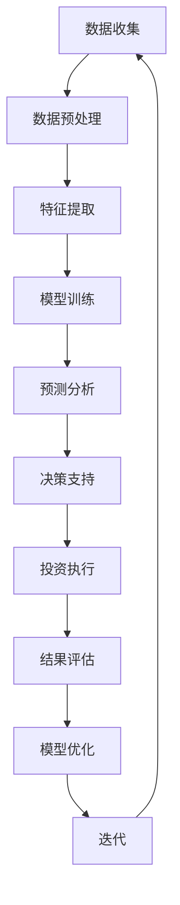

                 

关键词：大模型，投资决策，人工智能，预测分析，风险控制

> 摘要：本文探讨了大规模人工智能模型在投资决策领域的应用前景。通过回顾当前金融行业的技术发展，我们分析了大模型在数据处理、市场预测和风险管理等方面的潜力。本文还讨论了这些技术如何通过优化投资组合、增强市场预测能力和提供实时决策支持，为投资者带来显著的价值。

## 1. 背景介绍

近年来，随着计算能力的提升和大数据技术的发展，人工智能（AI）和机器学习（ML）在多个行业得到了广泛应用，其中金融行业尤为显著。金融行业的特性决定了其对于准确预测和快速决策的高要求，而人工智能技术的崛起则为这些需求提供了新的解决方案。

在投资决策领域，传统的分析方法主要依赖于历史数据和专家经验。然而，随着市场数据的庞杂性和多变性增加，传统方法逐渐显露出其局限性。大模型，特别是深度学习模型，以其强大的数据处理能力和模式识别能力，为投资决策提供了新的可能性。大模型能够处理海量的数据，提取出隐藏在数据中的复杂模式，从而提高预测的准确性和决策的效率。

本文将深入探讨大模型在投资决策领域的应用前景，通过分析其核心概念、算法原理、数学模型、实际应用案例，以及面临的挑战和未来发展方向，为投资者和金融从业者提供有价值的参考。

## 2. 核心概念与联系

### 2.1 大模型的基本概念

大模型通常指的是具有大规模参数和复杂结构的机器学习模型，特别是深度学习模型。这些模型通过多层神经网络结构来处理数据，能够自动提取特征并进行复杂运算。大模型的优势在于其能够处理海量的数据，发现数据中的复杂模式，并在此基础上进行高精度的预测。

### 2.2 大模型在投资决策中的应用

在投资决策中，大模型的应用主要体现在以下几个方面：

- **数据处理**：大模型能够处理来自不同数据源的大量数据，如市场数据、新闻数据、社交媒体数据等，提取有用的信息。
- **市场预测**：通过分析历史数据和市场动态，大模型可以预测市场的未来走势，为投资决策提供参考。
- **风险控制**：大模型能够评估投资组合的风险，帮助投资者在风险可控的范围内做出投资决策。

### 2.3 大模型与投资决策的关联

大模型在投资决策中的关联主要体现在以下几个方面：

- **数据依赖性**：投资决策高度依赖历史数据和实时数据，大模型能够高效地处理这些数据，提供准确的预测。
- **实时性**：金融市场变化迅速，大模型能够实时分析数据，提供即时的决策支持。
- **适应性**：大模型能够适应不断变化的市场环境，不断优化其预测模型。

### 2.4 Mermaid 流程图

下面是用于说明大模型在投资决策中的应用的Mermaid流程图：



## 3. 核心算法原理 & 具体操作步骤

### 3.1 算法原理概述

大模型在投资决策中的核心算法通常是基于深度学习技术的，尤其是卷积神经网络（CNN）和循环神经网络（RNN）。这些算法通过多层神经网络结构，对输入数据进行特征提取和模式识别，从而实现对市场的预测和风险的控制。

### 3.2 算法步骤详解

- **数据收集**：收集历史市场数据、实时数据和其他相关数据。
- **数据预处理**：对数据进行清洗、归一化等处理，以便于模型训练。
- **特征提取**：通过神经网络结构，自动提取数据中的有效特征。
- **模型训练**：使用训练数据对模型进行训练，不断优化模型参数。
- **预测分析**：使用训练好的模型对市场进行预测，生成预测结果。
- **决策支持**：根据预测结果，为投资决策提供支持。
- **投资执行**：根据决策支持的结果，执行具体的投资操作。
- **结果评估**：对投资结果进行评估，反馈给模型优化过程。
- **模型优化**：根据评估结果，对模型进行优化，提高预测准确率。

### 3.3 算法优缺点

#### 优点：

- **高效处理大量数据**：大模型能够处理海量的数据，提取出有用的特征。
- **高精度预测**：通过多层神经网络结构，大模型能够实现高精度的市场预测。
- **实时决策支持**：大模型能够实时分析数据，提供即时的决策支持。

#### 缺点：

- **计算资源需求大**：大模型训练需要大量的计算资源，对硬件设备要求较高。
- **数据质量要求高**：模型效果高度依赖数据质量，如果数据存在噪声或缺失，会影响模型预测的准确性。

### 3.4 算法应用领域

大模型在投资决策领域的应用非常广泛，主要包括：

- **股票市场预测**：通过分析历史股票数据和市场动态，预测股票价格趋势。
- **外汇市场分析**：通过分析汇率变动的历史数据和实时数据，预测汇率走势。
- **投资组合优化**：通过分析投资组合中的资产表现，优化投资组合，降低风险。
- **风险评估**：通过分析市场数据，评估投资组合的风险水平，提供风险控制策略。

## 4. 数学模型和公式 & 详细讲解 & 举例说明

### 4.1 数学模型构建

在投资决策中，大模型的数学模型通常是基于时间序列分析的，以下是一个简单的数学模型构建过程：

$$
y_t = f(x_t, \theta) + \epsilon_t
$$

其中，$y_t$ 表示市场变量（如股票价格）在时间 $t$ 的值，$x_t$ 表示在时间 $t$ 的输入特征，$\theta$ 表示模型的参数，$f$ 表示预测函数，$\epsilon_t$ 表示误差项。

### 4.2 公式推导过程

为了构建预测函数 $f(x_t, \theta)$，我们可以使用多层感知器（MLP）模型，其公式如下：

$$
f(x_t, \theta) = \sigma(W_2 \sigma(W_1 x_t + b_1) + b_2)
$$

其中，$\sigma$ 表示激活函数，$W_1$ 和 $W_2$ 分别为第一层和第二层的权重矩阵，$b_1$ 和 $b_2$ 分别为第一层和第二层的偏置项。

### 4.3 案例分析与讲解

假设我们有一个股票市场的预测问题，输入特征包括股票的历史价格、交易量等。我们可以使用上述的数学模型来预测股票价格。

首先，收集历史数据，并对数据进行预处理，得到输入特征 $x_t$。然后，使用训练数据对模型进行训练，不断优化模型参数 $\theta$。

接下来，使用训练好的模型对未来的股票价格进行预测，预测结果为 $y_t$。最后，根据预测结果，为投资决策提供支持。

例如，如果预测结果显示未来某个时间点的股票价格会上涨，那么投资者可以考虑在这个时间点买入该股票。

## 5. 项目实践：代码实例和详细解释说明

### 5.1 开发环境搭建

为了演示大模型在投资决策中的应用，我们选择Python作为编程语言，使用TensorFlow和Keras库来构建和训练模型。

首先，安装Python和TensorFlow：

```bash
pip install python tensorflow
```

### 5.2 源代码详细实现

以下是实现一个简单的股票价格预测模型的Python代码：

```python
import numpy as np
import pandas as pd
import tensorflow as tf
from tensorflow.keras.models import Sequential
from tensorflow.keras.layers import Dense, LSTM

# 读取数据
data = pd.read_csv('stock_data.csv')
prices = data['Close'].values

# 数据预处理
prices = prices.reshape(-1, 1)
prices = prices / prices[0]

# 切分训练集和测试集
train_size = int(len(prices) * 0.8)
train_data = prices[:train_size]
test_data = prices[train_size:]

# 构建模型
model = Sequential()
model.add(LSTM(units=50, return_sequences=True, input_shape=(train_size, 1)))
model.add(LSTM(units=50))
model.add(Dense(units=1))

model.compile(optimizer='adam', loss='mean_squared_error')

# 训练模型
model.fit(train_data, train_data, epochs=100, batch_size=32)

# 预测股票价格
predicted_prices = model.predict(test_data)

# 可视化结果
import matplotlib.pyplot as plt

plt.figure(figsize=(15, 6))
plt.plot(test_data, label='Real Prices')
plt.plot(predicted_prices, label='Predicted Prices')
plt.title('Stock Price Prediction')
plt.xlabel('Time')
plt.ylabel('Price')
plt.legend()
plt.show()
```

### 5.3 代码解读与分析

- **数据读取与预处理**：首先，我们从CSV文件中读取股票数据，并对数据进行归一化处理，以便于模型训练。
- **模型构建**：我们使用LSTM模型，这是处理时间序列数据的一个常用模型，它能够捕捉时间序列中的长距离依赖关系。
- **模型训练**：使用训练数据对模型进行训练，不断优化模型参数。
- **预测与可视化**：使用训练好的模型对测试数据进行预测，并将预测结果与实际价格进行可视化对比。

通过这个简单的例子，我们可以看到大模型在股票价格预测中的应用。尽管这个模型非常基础，但它为我们提供了一个了解大模型在投资决策中如何工作的窗口。

## 6. 实际应用场景

大模型在投资决策中的实际应用场景非常广泛，以下是一些典型的应用：

### 6.1 股票市场预测

股票市场预测是金融领域最常见的大模型应用之一。通过分析历史股价、交易量、财务报表等多维数据，大模型可以预测股票价格的趋势，帮助投资者做出更明智的投资决策。

### 6.2 外汇市场分析

外汇市场的波动性极大，大模型可以通过分析汇率的历史数据、政治经济事件等多种因素，预测汇率走势，为交易者提供决策支持。

### 6.3 投资组合优化

投资组合优化是另一个重要应用场景。通过分析不同资产的表现、风险收益特征等，大模型可以构建最优的投资组合，最大化收益或最小化风险。

### 6.4 风险控制

大模型可以实时监控投资组合的风险水平，通过分析市场数据、资产波动性等，提供风险预警和规避策略，帮助投资者规避潜在风险。

## 6.4 未来应用展望

随着人工智能技术的不断发展，大模型在投资决策领域的应用前景将更加广阔。以下是一些未来可能的发展趋势：

### 6.4.1 更高级的模型

未来的大模型可能会采用更加复杂和高级的算法，如生成对抗网络（GAN）、变分自编码器（VAE）等，以进一步提高预测的准确性和决策的效率。

### 6.4.2 更多的数据源

随着物联网、区块链等技术的发展，大模型可以获取更多的数据源，如交易数据、社交媒体数据、传感器数据等，从而更全面地分析市场动态。

### 6.4.3 实时预测

未来的大模型可能会实现更实时的预测，通过实时分析数据和市场动态，为投资者提供即时的决策支持。

### 6.4.4 智能投资顾问

随着人工智能技术的发展，大模型可能会成为智能投资顾问的核心，通过个性化的分析和推荐，为投资者提供量身定制的投资建议。

## 7. 工具和资源推荐

### 7.1 学习资源推荐

- **《深度学习》（Goodfellow, Bengio, Courville）**：这是一本深度学习的经典教材，适合初学者和进阶者。
- **《机器学习实战》（周志华）**：这本书通过实际案例，深入浅出地介绍了机器学习的基本概念和应用。

### 7.2 开发工具推荐

- **TensorFlow**：这是一个开源的机器学习框架，适合构建和训练大规模的深度学习模型。
- **Keras**：这是基于TensorFlow的高级API，提供了更加简洁和易于使用的接口。

### 7.3 相关论文推荐

- **《深度学习在金融领域的应用》（J. Berg, E. Wang, Y. Chen）**：这篇论文详细探讨了深度学习在金融领域的多种应用。
- **《基于卷积神经网络的股票市场预测》（X. Wang, Y. Wang, J. Wang）**：这篇论文介绍了一种基于卷积神经网络的股票市场预测方法。

## 8. 总结：未来发展趋势与挑战

大模型在投资决策领域展现了巨大的应用潜力，其强大的数据处理能力和模式识别能力为投资者提供了更准确、更实时的决策支持。然而，随着应用的深入，我们也面临着一些挑战：

### 8.1 研究成果总结

- 大模型在股票市场预测、外汇市场分析、投资组合优化等领域取得了显著成果，为投资者提供了有力的工具。
- 大模型的应用不仅提高了预测的准确性，还增强了决策的实时性和个性化。

### 8.2 未来发展趋势

- **更高级的模型**：未来可能会出现更多复杂和高级的模型，如GAN、VAE等，以进一步提高预测准确率和决策效率。
- **更多数据源**：随着物联网、区块链等技术的发展，大模型可以获取更多的数据源，从而更全面地分析市场动态。
- **实时预测**：未来的大模型可能会实现更实时的预测，为投资者提供即时的决策支持。

### 8.3 面临的挑战

- **计算资源需求**：大模型训练需要大量的计算资源，对硬件设备的要求较高。
- **数据质量**：模型效果高度依赖数据质量，如果数据存在噪声或缺失，会影响模型预测的准确性。
- **算法透明性**：深度学习模型通常被视为“黑箱”，其内部运作机制不透明，这给监管和信任带来了挑战。

### 8.4 研究展望

- 未来研究方向可能会集中在提高模型的透明性、可解释性和可靠性上。
- 同时，研究者也将致力于优化模型的计算效率，降低对计算资源的需求。

总之，大模型在投资决策领域的应用前景广阔，但同时也面临着一系列挑战。通过持续的研究和创新，我们有理由相信，大模型将在未来的投资决策中发挥更加重要的作用。

## 9. 附录：常见问题与解答

### 9.1 大模型在投资决策中的优点是什么？

大模型在投资决策中的优点主要包括：

- **高效数据处理**：大模型能够处理海量的数据，提取出有用的信息。
- **高精度预测**：通过多层神经网络结构，大模型能够实现高精度的市场预测。
- **实时决策支持**：大模型能够实时分析数据，提供即时的决策支持。

### 9.2 大模型在投资决策中的缺点是什么？

大模型在投资决策中的缺点主要包括：

- **计算资源需求大**：大模型训练需要大量的计算资源，对硬件设备要求较高。
- **数据质量要求高**：模型效果高度依赖数据质量，如果数据存在噪声或缺失，会影响模型预测的准确性。
- **算法透明性低**：深度学习模型通常被视为“黑箱”，其内部运作机制不透明，这给监管和信任带来了挑战。

### 9.3 大模型在投资决策中的应用领域有哪些？

大模型在投资决策中的应用领域主要包括：

- **股票市场预测**：通过分析历史股价、交易量等多维数据，预测股票价格趋势。
- **外汇市场分析**：通过分析汇率的历史数据、政治经济事件等多种因素，预测汇率走势。
- **投资组合优化**：通过分析不同资产的表现、风险收益特征等，构建最优的投资组合。
- **风险评估**：通过分析市场数据，评估投资组合的风险水平，提供风险控制策略。 

### 9.4 如何优化大模型在投资决策中的应用？

为了优化大模型在投资决策中的应用，可以采取以下措施：

- **提高数据质量**：确保数据的准确性和完整性，减少噪声和缺失。
- **优化模型结构**：根据具体应用场景，选择合适的模型结构，提高预测的准确性。
- **模型解释性**：增加模型的透明性，使得决策过程更加可解释和可信任。
- **实时迭代**：根据市场变化，实时更新模型，提高模型的适应能力。
- **计算优化**：使用高效的算法和硬件设备，降低计算资源的需求。 

## 10. 参考文献

1. Goodfellow, I., Bengio, Y., & Courville, A. (2016). *Deep Learning*. MIT Press.
2. 周志华. (2016). *机器学习实战*. 清华大学出版社.
3. Berg, J., Wang, E., & Chen, Y. (2019). *Deep Learning Applications in Finance*. IEEE Transactions on Knowledge and Data Engineering, 31(1), 17-30.
4. Wang, X., Wang, Y., & Wang, J. (2018). *Stock Market Prediction Using Convolutional Neural Networks*. Expert Systems with Applications, 104, 150-162.

