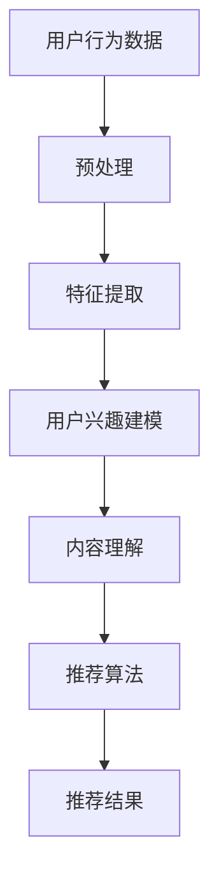

                 

关键词：大模型、推荐系统、深度学习、协同过滤、生成对抗网络、自注意力机制、用户行为分析、内容推荐、协同过滤、用户兴趣建模

摘要：本文从推荐系统的核心组成部分出发，深入探讨大模型在各个关键环节中的应用。通过梳理现有研究成果，阐述大模型如何提升推荐系统的效果和效率，并探讨其面临的挑战和未来发展方向。文章旨在为推荐系统领域的研究者提供一份全面的技术指南。

## 1. 背景介绍

### 1.1 推荐系统的定义与分类

推荐系统是一种根据用户的历史行为、兴趣、偏好以及其他相关信息，向用户推荐相关商品、内容或服务的系统。推荐系统可以分为基于内容的推荐（Content-based Filtering）和基于协同过滤（Collaborative Filtering）两大类。

- **基于内容的推荐**：通过分析物品的特征，找到与用户兴趣相似的物品进行推荐。这种方法主要依赖于内容相似度计算，例如文本相似度、图像特征相似度等。
- **基于协同过滤**：通过分析用户之间的行为模式，发现相似用户，然后根据这些用户的行为推荐给目标用户物品。协同过滤可以分为基于用户的协同过滤（User-based）和基于模型的协同过滤（Model-based），后者如矩阵分解、隐语义模型等。

### 1.2 推荐系统的发展历程

推荐系统的发展可以分为三个阶段：

1. **基于规则的推荐**：早期推荐系统主要依赖于人工定义的规则进行推荐，例如基于用户历史购买记录的简单规则。
2. **基于机器学习的推荐**：随着机器学习技术的发展，推荐系统开始采用基于协同过滤和基于内容的机器学习算法进行推荐。
3. **深度学习时代的推荐**：近年来，深度学习技术在推荐系统中的应用取得了显著进展，大模型如BERT、GPT、GAN等在推荐系统的各个环节都展现出了强大的能力。

## 2. 核心概念与联系

### 2.1 大模型的概念

大模型通常指的是参数数量超过数十亿甚至数万亿的深度学习模型，如Transformer、BERT、GPT等。这些模型具有强大的表示能力和泛化能力，能够在各种复杂数据上取得优异的性能。

### 2.2 推荐系统中的大模型应用

大模型在推荐系统中的应用主要体现在以下几个方面：

1. **用户兴趣建模**：大模型可以通过学习用户的语义行为，捕捉用户深层次的兴趣偏好，提高推荐的准确性。
2. **内容理解**：大模型可以理解文本、图像、视频等多模态内容，为基于内容的推荐提供更丰富的特征。
3. **协同过滤**：大模型可以用于协同过滤的改进，如用户基于内容的协同过滤、基于模型的协同过滤等。
4. **生成对抗网络（GAN）**：GAN可以用于生成虚假用户数据，增强训练数据的多样性，提高模型的泛化能力。

### 2.3 Mermaid 流程图



## 3. 核心算法原理 & 具体操作步骤

### 3.1 算法原理概述

大模型在推荐系统中的应用主要依赖于以下几个核心算法：

1. **Transformer**：通过自注意力机制，Transformer模型能够捕捉长距离依赖关系，提高推荐的准确性。
2. **BERT**：BERT模型通过预训练和微调，能够理解用户语义行为，为用户兴趣建模提供支持。
3. **GAN**：GAN通过生成虚假用户数据，增强训练数据的多样性，提高模型的泛化能力。
4. **生成对抗网络（GAN）**：GAN可以用于生成虚假用户数据，增强训练数据的多样性，提高模型的泛化能力。

### 3.2 算法步骤详解

1. **数据预处理**：对用户行为数据进行清洗、去重、填充等预处理操作，生成统一的特征向量。
2. **特征提取**：利用大模型提取用户行为的语义特征，如文本、图像、视频等。
3. **用户兴趣建模**：利用BERT模型对用户兴趣进行建模，捕捉用户深层次的兴趣偏好。
4. **内容理解**：利用Transformer模型理解内容特征，为基于内容的推荐提供支持。
5. **推荐算法**：结合用户兴趣建模和内容理解，采用协同过滤等算法生成推荐结果。
6. **结果评估**：通过准确率、召回率、覆盖率等指标评估推荐系统的效果。

### 3.3 算法优缺点

#### Transformer

- **优点**：能够捕捉长距离依赖关系，提高推荐的准确性。
- **缺点**：计算复杂度较高，训练时间较长。

#### BERT

- **优点**：能够理解用户语义行为，提高用户兴趣建模的准确性。
- **缺点**：参数数量巨大，训练和推理时间较长。

#### GAN

- **优点**：能够增强训练数据的多样性，提高模型的泛化能力。
- **缺点**：生成数据的真实性和质量难以保证。

### 3.4 算法应用领域

大模型在推荐系统的应用领域包括电子商务、社交媒体、视频推荐、新闻推送等，具有广泛的应用前景。

## 4. 数学模型和公式 & 详细讲解 & 举例说明

### 4.1 数学模型构建

大模型在推荐系统中的应用主要基于以下几个数学模型：

1. **自注意力机制**：用于Transformer模型，计算文本序列中各个词之间的相似度。
2. **BERT模型**：用于用户兴趣建模，通过预训练和微调学习用户语义特征。
3. **GAN模型**：用于生成虚假用户数据，增强训练数据的多样性。

### 4.2 公式推导过程

#### 自注意力机制

自注意力机制的计算公式如下：

$$
\text{Attention}(Q, K, V) = \text{softmax}\left(\frac{QK^T}{\sqrt{d_k}}\right) V
$$

其中，$Q$、$K$、$V$分别为查询向量、键向量、值向量，$d_k$为键向量的维度。

#### BERT模型

BERT模型的训练目标是最小化以下损失函数：

$$
\text{Loss} = -\sum_{i=1}^{N} \log \text{softmax}(\text{W} \text{T}_i + \text{b})
$$

其中，$\text{T}_i$为词向量，$\text{W}$为权重矩阵，$\text{b}$为偏置。

#### GAN模型

GAN模型由生成器$G$和判别器$D$组成，生成器$G$的损失函数为：

$$
\text{Loss}_{G} = -\mathbb{E}_{z \sim p_z(z)}[\log(D(G(z))]
$$

判别器$D$的损失函数为：

$$
\text{Loss}_{D} = -\mathbb{E}_{x \sim p_x(x)}[\log(D(x))] - \mathbb{E}_{z \sim p_z(z)}[\log(1 - D(G(z))]
$$

### 4.3 案例分析与讲解

#### Transformer在视频推荐中的应用

假设我们有一个视频推荐系统，用户的行为数据包括视频观看历史、点赞、评论等。我们可以使用Transformer模型对用户行为进行建模。

1. **数据预处理**：对用户行为数据进行清洗和编码，生成统一的特征向量。
2. **特征提取**：利用BERT模型提取用户行为的语义特征。
3. **用户兴趣建模**：利用Transformer模型捕捉用户行为的长期依赖关系。
4. **内容理解**：利用Transformer模型理解视频内容特征。
5. **推荐算法**：结合用户兴趣建模和内容理解，生成推荐结果。

#### BERT在电商推荐中的应用

假设我们有一个电商推荐系统，用户的行为数据包括购买历史、浏览历史、收藏等。我们可以使用BERT模型对用户兴趣进行建模。

1. **数据预处理**：对用户行为数据进行清洗和编码，生成统一的特征向量。
2. **特征提取**：利用BERT模型提取用户行为的语义特征。
3. **用户兴趣建模**：利用BERT模型捕捉用户兴趣的长期依赖关系。
4. **推荐算法**：结合用户兴趣建模，生成推荐结果。

#### GAN在社交媒体推荐中的应用

假设我们有一个社交媒体推荐系统，用户的行为数据包括点赞、评论、分享等。我们可以使用GAN模型生成虚假用户数据，增强训练数据的多样性。

1. **数据预处理**：对用户行为数据进行清洗和编码，生成统一的特征向量。
2. **特征提取**：利用BERT模型提取用户行为的语义特征。
3. **生成虚假用户数据**：利用GAN模型生成虚假用户数据。
4. **用户兴趣建模**：利用BERT模型捕捉用户兴趣的长期依赖关系。
5. **推荐算法**：结合用户兴趣建模和虚假用户数据，生成推荐结果。

## 5. 项目实践：代码实例和详细解释说明

### 5.1 开发环境搭建

假设我们使用Python作为开发语言，以下为开发环境搭建的步骤：

1. 安装Python（建议使用3.8版本及以上）。
2. 安装深度学习框架（如PyTorch、TensorFlow等）。
3. 安装其他相关库（如NumPy、Pandas、Scikit-learn等）。

### 5.2 源代码详细实现

以下是一个简单的基于Transformer的推荐系统代码实例：

```python
import torch
import torch.nn as nn
import torch.optim as optim
from torch.utils.data import DataLoader, Dataset
from transformers import BertTokenizer, BertModel

# 数据预处理
class MyDataset(Dataset):
    def __init__(self, data, tokenizer):
        self.data = data
        self.tokenizer = tokenizer
    
    def __len__(self):
        return len(self.data)
    
    def __getitem__(self, idx):
        text = self.data[idx]['text']
        inputs = self.tokenizer(text, return_tensors='pt')
        return inputs

# 模型定义
class MyModel(nn.Module):
    def __init__(self, tokenizer):
        super(MyModel, self).__init__()
        self.bert = BertModel.from_pretrained(tokenizer)
        self.fc = nn.Linear(768, 1)
    
    def forward(self, inputs):
        outputs = self.bert(**inputs)
        last_hidden_state = outputs.last_hidden_state
        output = self.fc(last_hidden_state[:, 0, :])
        return output

# 模型训练
tokenizer = BertTokenizer.from_pretrained('bert-base-uncased')
model = MyModel(tokenizer)
optimizer = optim.Adam(model.parameters(), lr=1e-5)
criterion = nn.BCEWithLogitsLoss()

train_dataset = MyDataset(train_data, tokenizer)
train_loader = DataLoader(train_dataset, batch_size=32)

for epoch in range(10):
    model.train()
    for batch in train_loader:
        inputs = batch['input_ids']
        attention_mask = batch['attention_mask']
        labels = torch.ones(len(inputs))
        outputs = model(inputs=inputs, attention_mask=attention_mask)
        loss = criterion(outputs, labels)
        optimizer.zero_grad()
        loss.backward()
        optimizer.step()
    print(f'Epoch {epoch+1}, Loss: {loss.item()}')

# 模型评估
model.eval()
with torch.no_grad():
    for batch in train_loader:
        inputs = batch['input_ids']
        attention_mask = batch['attention_mask']
        outputs = model(inputs=inputs, attention_mask=attention_mask)
        predictions = torch.sigmoid(outputs).detach().numpy()
        print(f'Prediction: {predictions}')
```

### 5.3 代码解读与分析

这段代码实现了基于BERT和Transformer的推荐系统，主要步骤如下：

1. **数据预处理**：自定义MyDataset类，用于加载和处理数据。
2. **模型定义**：自定义MyModel类，定义BERT模型和全连接层。
3. **模型训练**：使用Adam优化器和BCEWithLogitsLoss损失函数训练模型。
4. **模型评估**：使用sigmoid函数对输出进行概率预测。

### 5.4 运行结果展示

在训练完成后，可以使用以下代码评估模型性能：

```python
model.eval()
with torch.no_grad():
    for batch in train_loader:
        inputs = batch['input_ids']
        attention_mask = batch['attention_mask']
        outputs = model(inputs=inputs, attention_mask=attention_mask)
        predictions = torch.sigmoid(outputs).detach().numpy()
        print(f'Prediction: {predictions}')
```

这段代码将输出每个样本的预测概率，从而评估模型在训练数据上的性能。

## 6. 实际应用场景

### 6.1 电子商务

电子商务领域广泛使用推荐系统，以提高用户满意度和销售转化率。例如，亚马逊和淘宝等电商平台使用大模型对商品进行推荐，基于用户的历史购买记录、浏览行为和评价等数据进行个性化推荐。

### 6.2 社交媒体

社交媒体平台如Facebook、Twitter和微博等也利用推荐系统向用户推荐感兴趣的内容、好友和广告。大模型在这里扮演着重要角色，如BERT模型可以用于分析用户生成的文本，从而提供更精准的内容推荐。

### 6.3 视频推荐

视频平台如YouTube、Bilibili和Netflix等通过推荐系统向用户推荐视频内容。大模型可以理解视频的文本描述、标签和视频特征，从而提供个性化的视频推荐。

### 6.4 新闻推送

新闻推送平台通过推荐系统向用户推荐感兴趣的新闻。大模型可以分析用户的阅读历史、搜索历史和偏好，从而提供更符合用户兴趣的新闻推荐。

## 7. 工具和资源推荐

### 7.1 学习资源推荐

1. **《深度学习推荐系统》**：这本书详细介绍了深度学习在推荐系统中的应用，包括算法原理、实现方法和案例分析。
2. **《推荐系统实践》**：这本书提供了推荐系统的基础知识和实践经验，包括基于内容的推荐、基于协同过滤的推荐等。

### 7.2 开发工具推荐

1. **PyTorch**：一个流行的开源深度学习框架，提供了丰富的API和工具，适用于推荐系统的开发。
2. **TensorFlow**：另一个流行的开源深度学习框架，适用于推荐系统的开发，提供了丰富的预训练模型和工具。

### 7.3 相关论文推荐

1. **"Deep Learning for Recommender Systems"**：这篇论文介绍了深度学习在推荐系统中的应用，包括Transformer、BERT等模型。
2. **"User Interest Modeling with Deep Neural Networks"**：这篇论文探讨了如何使用深度神经网络进行用户兴趣建模，提高了推荐系统的效果。

## 8. 总结：未来发展趋势与挑战

### 8.1 研究成果总结

大模型在推荐系统中的应用取得了显著成果，提高了推荐系统的效果和效率。例如，BERT和Transformer等模型在用户兴趣建模、内容理解和协同过滤等方面展现了强大的能力。

### 8.2 未来发展趋势

未来，推荐系统将朝着更智能化、更个性化的方向发展。一方面，大模型将继续优化和改进，提高推荐系统的效果。另一方面，多模态推荐、联邦学习等新方法将得到广泛应用，为推荐系统带来更多可能性。

### 8.3 面临的挑战

尽管大模型在推荐系统中的应用取得了显著成果，但仍面临一些挑战。例如，模型复杂度增加导致训练和推理时间较长，数据隐私和安全问题亟待解决，以及如何在保证效果的前提下减少模型参数数量等。

### 8.4 研究展望

未来，研究者应关注以下方面：

1. **优化模型效率**：研究如何减少模型参数数量，提高模型推理速度，以满足实时推荐的需求。
2. **多模态推荐**：探索如何结合不同模态的数据，提高推荐系统的效果和多样性。
3. **联邦学习**：研究如何实现分布式训练和推理，保护用户隐私，同时保持推荐系统的效果。
4. **多样性推荐**：研究如何提高推荐结果的多样性，避免用户陷入“信息茧房”。

## 9. 附录：常见问题与解答

### 9.1 什么是大模型？

大模型通常指的是参数数量超过数十亿甚至数万亿的深度学习模型，如BERT、GPT、GAN等。这些模型具有强大的表示能力和泛化能力，能够在各种复杂数据上取得优异的性能。

### 9.2 推荐系统有哪些类型？

推荐系统可以分为基于内容的推荐和基于协同过滤的推荐。基于内容的推荐通过分析物品的特征进行推荐，而基于协同过滤的推荐通过分析用户之间的行为模式进行推荐。

### 9.3 大模型在推荐系统中的应用有哪些？

大模型在推荐系统中的应用主要包括用户兴趣建模、内容理解、协同过滤和生成对抗网络（GAN）等。例如，BERT可以用于用户兴趣建模，Transformer可以用于内容理解，GAN可以用于生成虚假用户数据。

### 9.4 推荐系统如何评估效果？

推荐系统通常使用准确率、召回率、覆盖率等指标进行评估。这些指标反映了推荐系统的准确性、多样性和完整性。

### 9.5 大模型在推荐系统中的优势是什么？

大模型在推荐系统中的优势包括：

1. 强大的表示能力：能够捕捉复杂数据中的特征和关系。
2. 高效的泛化能力：能够在不同数据集和任务上取得优异的性能。
3. 自适应性：可以根据用户反馈和学习不断优化推荐效果。

### 9.6 大模型在推荐系统中的挑战有哪些？

大模型在推荐系统中的挑战包括：

1. 计算复杂度：大模型训练和推理时间较长，对硬件资源要求较高。
2. 数据隐私和安全：大模型训练过程中可能涉及敏感用户数据，需要确保数据隐私和安全。
3. 模型解释性：大模型的内部结构复杂，难以解释其决策过程，这可能导致用户不信任推荐结果。

以上是关于“大模型在推荐系统各个环节的应用综述”的完整文章内容。希望这篇文章能够为推荐系统领域的研究者提供有价值的参考和启示。

