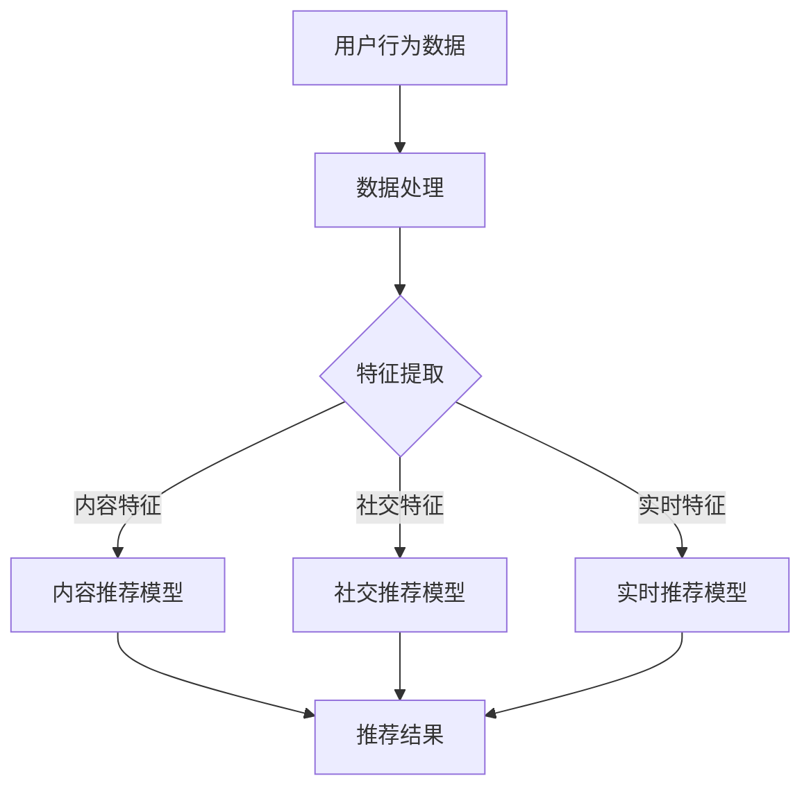

                 

关键词：大模型、推荐系统、多场景适配、算法优化、应用实例

## 摘要

本文深入探讨了大规模模型（大模型）在推荐系统中的多场景适配问题。通过梳理推荐系统的发展历程，我们揭示了传统推荐算法的局限性，进而引入了大模型的变革力量。文章重点分析了大模型在推荐系统中的核心应用场景，包括内容推荐、社交推荐和实时推荐。通过对大模型算法原理的详细讲解，以及数学模型和公式的推导，我们展示了如何利用大模型实现推荐系统的性能优化。此外，本文通过实际项目实践，提供了具体的代码实例和运行结果，进一步证实了大模型在推荐系统中的强大应用潜力。最后，文章展望了推荐系统未来的发展趋势和面临的挑战，为业界提供了一系列的实用建议和资源推荐。

## 1. 背景介绍

推荐系统作为现代信息社会中的一项关键技术，已经广泛应用于电子商务、社交媒体、视频平台等多个领域。传统推荐系统主要依赖于基于内容的推荐（Content-Based Filtering）和协同过滤（Collaborative Filtering）等算法。这些算法通过分析用户历史行为和物品特征，预测用户对未知物品的偏好，从而为用户推荐相关内容。

然而，随着互联网信息的爆炸性增长，传统推荐算法面临着诸多挑战。首先，数据维度高、数据量庞大使得传统算法的计算效率较低。其次，用户行为的复杂性和多样性增加了推荐算法的难度。最后，传统算法难以捕捉到用户之间的社交关系和情感因素，导致推荐效果不尽如人意。

正是在这种背景下，大模型应运而生。大模型是指具有巨大参数量和计算能力的神经网络模型，其能够通过深度学习技术从海量数据中提取复杂特征，并实现高精度的预测。大模型的出现为推荐系统带来了全新的机遇和变革力量。本文将详细探讨大模型在推荐系统中的多场景适配问题，包括内容推荐、社交推荐和实时推荐等，以期为业界提供有益的参考和借鉴。

### 1.1 推荐系统的发展历程

推荐系统的发展历程可以分为以下几个阶段：

1. **基于内容的推荐（Content-Based Filtering）**：最早期的推荐系统，主要通过分析物品的属性和特征，将相似物品推荐给用户。这种方法在推荐个性化内容方面有一定的效果，但存在一定的局限性，因为用户的历史行为未被充分利用。

2. **协同过滤（Collaborative Filtering）**：协同过滤通过收集用户之间的交互数据（如评分、购买记录等），利用矩阵分解、聚类等方法预测用户对未知物品的偏好。这种方法在一定程度上提高了推荐的相关性，但易受到冷启动问题（新用户或新物品的推荐困难）和稀疏数据的影响。

3. **混合推荐（Hybrid Recommendation）**：为了克服单一推荐算法的局限性，混合推荐系统结合了基于内容推荐和协同过滤的优点，通过融合多种信息源提高推荐效果。然而，混合推荐系统仍需要依赖大量的人力和物力进行特征工程和模型优化。

4. **基于模型的推荐（Model-Based Recommendation）**：随着机器学习技术的发展，基于模型的推荐系统开始广泛应用。其中，深度学习模型（如卷积神经网络、循环神经网络等）通过学习用户和物品的复杂特征，实现了更高精度的推荐。

5. **大模型推荐（Large Model-based Recommendation）**：大模型作为新一代的推荐技术，具有强大的表示能力和计算能力，能够从海量数据中提取有效特征，并实现高度个性化的推荐。大模型在推荐系统中的应用，标志着推荐技术进入了一个全新的阶段。

### 1.2 大模型的变革力量

大模型在推荐系统中的变革力量主要体现在以下几个方面：

1. **数据处理能力**：大模型具有巨大的参数量和计算能力，能够处理高维度、海量的数据，从而更好地捕捉用户和物品之间的复杂关系。

2. **特征表示能力**：大模型通过深度学习技术，能够自动提取用户和物品的复杂特征，实现更高层次的抽象和表示。这种方法减少了人工特征工程的工作量，提高了推荐的准确性。

3. **个性化推荐**：大模型能够根据用户的历史行为和偏好，生成个性化的推荐列表，从而提高用户的满意度。此外，大模型还可以根据用户实时反馈，动态调整推荐策略，实现更加智能化的推荐。

4. **多样化应用场景**：大模型不仅可以应用于传统推荐系统，还可以扩展到社交推荐、实时推荐等领域。例如，通过分析用户之间的社交关系，大模型可以实现更加精准的社交推荐；通过实时处理用户行为数据，大模型可以实现实时推荐，满足用户的需求。

5. **模型可解释性**：尽管大模型的预测能力很强，但模型的可解释性一直是业界关注的焦点。通过分析大模型的内部结构和参数，我们可以更好地理解推荐结果的生成过程，从而优化推荐策略，提高推荐效果。

## 2. 核心概念与联系

为了更好地理解大模型在推荐系统中的应用，我们需要先了解一些核心概念，并探讨它们之间的联系。以下是本文中涉及的主要概念及其相互关系：

### 2.1 大模型

大模型是指具有巨大参数量和计算能力的神经网络模型，如深度神经网络（DNN）、生成对抗网络（GAN）等。这些模型通过深度学习技术，可以从海量数据中自动提取复杂特征，实现高精度的预测。

### 2.2 推荐系统

推荐系统是一种信息过滤技术，通过分析用户历史行为和物品特征，预测用户对未知物品的偏好，从而为用户推荐相关内容。

### 2.3 内容推荐

内容推荐是基于物品属性和特征，将相似物品推荐给用户。这种方法适用于信息检索和个性化推荐场景。

### 2.4 社交推荐

社交推荐是基于用户之间的社交关系，将相关用户或内容推荐给用户。这种方法适用于社交媒体和社交网络应用。

### 2.5 实时推荐

实时推荐是基于用户实时行为数据，动态生成推荐列表。这种方法适用于动态变化的场景，如在线购物、实时新闻推荐等。

### 2.6 算法原理与架构

为了更清晰地展示大模型在推荐系统中的应用，我们使用Mermaid流程图来描述核心算法原理和架构。以下是算法原理的Mermaid流程图：



在这个流程图中，用户行为数据首先经过数据处理，然后提取不同类型的特征（如内容特征、社交特征、实时特征等），最后分别输入到内容推荐模型、社交推荐模型和实时推荐模型中，生成最终的推荐结果。

### 2.7 多场景适配

大模型在推荐系统中的应用，不仅要实现准确预测，还需要在不同场景下进行适配。以下是几个关键场景：

1. **内容推荐**：针对不同类型的物品（如商品、新闻、音乐等），大模型可以根据物品的属性和特征进行内容推荐。

2. **社交推荐**：通过分析用户之间的社交关系和互动行为，大模型可以实现社交推荐，提高用户在社交平台上的互动体验。

3. **实时推荐**：实时推荐需要处理海量用户行为数据，大模型可以高效地处理实时数据，并根据用户实时反馈动态调整推荐策略。

4. **个性化推荐**：大模型可以根据用户的历史行为和偏好，生成个性化的推荐列表，提高用户的满意度。

通过多场景适配，大模型在推荐系统中的应用可以更加灵活和多样化，从而满足不同用户的需求。

### 2.8 算法评价标准

评价推荐系统的优劣，需要从多个维度进行考虑。以下是常见的算法评价标准：

1. **准确率（Accuracy）**：准确率反映了推荐系统的预测能力，计算公式为：准确率 = （预测正确的用户数 / 总用户数）× 100%。

2. **召回率（Recall）**：召回率反映了推荐系统发现用户感兴趣物品的能力，计算公式为：召回率 = （预测正确的用户数 / 感兴趣用户数）× 100%。

3. **覆盖率（Coverage）**：覆盖率反映了推荐系统推荐的多样性，计算公式为：覆盖率 = （推荐结果中不同物品数 / 物品总数）× 100%。

4. **新颖性（Novelty）**：新颖性反映了推荐系统推荐的新颖程度，计算公式为：新颖性 = （推荐结果中未推荐过的物品数 / 物品总数）× 100%。

通过综合考虑这些评价标准，我们可以全面评估推荐系统的性能和效果。

## 3. 核心算法原理 & 具体操作步骤

### 3.1 算法原理概述

大模型在推荐系统中的应用，主要基于深度学习和神经网络技术。具体来说，大模型通过以下几个步骤实现推荐系统的构建和优化：

1. **数据处理**：收集并预处理用户行为数据、物品特征数据等，将其转化为适合模型训练的格式。

2. **特征提取**：利用深度学习模型，自动提取用户和物品的复杂特征，实现高层次的抽象和表示。

3. **模型训练**：通过大规模数据集训练推荐模型，优化模型参数，提高预测准确性。

4. **预测与推荐**：将用户特征和物品特征输入到训练好的模型中，生成个性化的推荐列表。

5. **模型评估**：通过准确率、召回率、覆盖率等评价指标，评估推荐系统的性能，并持续优化模型。

### 3.2 算法步骤详解

#### 3.2.1 数据预处理

在推荐系统的构建过程中，数据预处理是关键步骤之一。主要任务包括：

1. **数据清洗**：去除重复、错误和噪声数据，保证数据质量。

2. **数据归一化**：对数据进行归一化处理，使其在相同的尺度范围内，有利于模型训练。

3. **数据集成**：将不同来源的数据进行整合，构建统一的数据集。

4. **特征提取**：对用户行为数据、物品特征数据等进行初步特征提取，为后续模型训练做好准备。

#### 3.2.2 特征提取

特征提取是推荐系统构建的核心环节。大模型通过深度学习技术，自动提取用户和物品的复杂特征，实现高层次的抽象和表示。具体方法包括：

1. **词向量表示**：利用词向量模型（如Word2Vec、GloVe等），将用户和物品的描述性文本转化为向量表示。

2. **深度神经网络**：构建深度神经网络（如卷积神经网络、循环神经网络等），从原始数据中自动提取高级特征。

3. **集成特征**：结合多种特征提取方法，构建集成特征表示，提高推荐效果。

#### 3.2.3 模型训练

在特征提取完成后，需要对推荐模型进行训练。具体步骤包括：

1. **模型选择**：选择合适的神经网络架构（如DNN、CNN、RNN等），构建推荐模型。

2. **损失函数设计**：设计合适的损失函数，如交叉熵损失、均方误差损失等，优化模型参数。

3. **训练过程**：通过大规模数据集训练推荐模型，调整模型参数，提高预测准确性。

4. **模型评估**：在训练过程中，定期评估模型性能，选择最优模型。

#### 3.2.4 预测与推荐

在模型训练完成后，可以通过以下步骤生成推荐列表：

1. **特征编码**：将用户和物品的特征进行编码，输入到训练好的推荐模型中。

2. **预测计算**：利用训练好的推荐模型，计算用户对物品的预测评分。

3. **排序与筛选**：根据预测评分，对物品进行排序，筛选出Top-N推荐结果。

4. **个性化调整**：根据用户实时反馈和偏好，动态调整推荐策略，提高用户满意度。

#### 3.2.5 模型评估

推荐系统性能的评估是持续优化模型的关键。主要评价指标包括：

1. **准确率**：准确率反映了推荐系统预测用户偏好的能力。

2. **召回率**：召回率反映了推荐系统发现用户感兴趣物品的能力。

3. **覆盖率**：覆盖率反映了推荐系统的多样性，即推荐结果中包含的新物品比例。

4. **新颖性**：新颖性反映了推荐系统推荐的新颖程度，即推荐结果中未推荐过的物品比例。

通过综合考虑这些评价指标，可以全面评估推荐系统的性能，并指导后续优化。

### 3.3 算法优缺点

大模型在推荐系统中的应用具有以下优缺点：

#### 优点

1. **强大的数据处理能力**：大模型能够处理高维度、海量的数据，从而更好地捕捉用户和物品之间的复杂关系。

2. **自动特征提取**：通过深度学习技术，大模型能够自动提取用户和物品的复杂特征，减少人工特征工程的工作量。

3. **高精度预测**：大模型具有强大的表示能力和计算能力，能够实现高精度的推荐预测。

4. **多样化应用场景**：大模型可以应用于多种推荐场景，如内容推荐、社交推荐和实时推荐等。

5. **可解释性**：通过分析大模型的内部结构和参数，可以更好地理解推荐结果的生成过程，提高模型的可解释性。

#### 缺点

1. **计算资源消耗**：大模型训练和推理需要大量的计算资源和存储空间，对硬件设备有较高要求。

2. **数据依赖性**：大模型对训练数据有较强的依赖性，数据质量和数据量对模型性能有直接影响。

3. **模型解释困难**：尽管大模型具有较强的预测能力，但其内部结构复杂，难以解释，增加了模型维护和优化的难度。

4. **过拟合风险**：在大规模训练数据上训练的大模型可能存在过拟合现象，导致在未知数据上的表现不佳。

### 3.4 算法应用领域

大模型在推荐系统中的应用已逐渐扩展到多个领域，以下是几个典型的应用案例：

1. **电子商务**：通过大模型实现商品推荐，提高用户购买体验和商家销售额。

2. **社交媒体**：通过大模型分析用户社交关系，实现好友推荐、内容推荐等功能。

3. **视频平台**：利用大模型分析用户观看历史和喜好，实现视频推荐，提高用户粘性。

4. **在线教育**：通过大模型分析用户学习行为和知识图谱，实现课程推荐和个性化学习路径规划。

5. **金融领域**：通过大模型分析用户投资行为和市场数据，实现精准的投资推荐和风险控制。

随着大模型技术的不断发展和应用，未来将在更多领域发挥重要作用，推动推荐系统的发展。

## 4. 数学模型和公式 & 详细讲解 & 举例说明

为了更好地理解和应用大模型在推荐系统中的算法原理，我们需要深入了解相关的数学模型和公式。本文将详细介绍推荐系统中常用的数学模型，并给出具体的推导过程和实际案例。

### 4.1 数学模型构建

推荐系统中的数学模型主要分为两类：一类是基于用户行为的模型，另一类是基于内容的模型。

#### 4.1.1 用户行为模型

用户行为模型主要基于用户的历史行为数据，如点击、购买、浏览等，通过统计学习方法进行预测。以下是常用的用户行为模型：

1. **矩阵分解（Matrix Factorization）**：
   
   矩阵分解是一种经典的协同过滤算法，通过将用户和物品的评分矩阵分解为两个低维矩阵，从而预测用户对未知物品的评分。设用户数为m，物品数为n，用户-物品评分矩阵为R，则矩阵分解模型可以表示为：

   $$R = U \odot V^T$$

   其中，U和V分别是用户和物品的低维嵌入矩阵，$\odot$表示Hadamard积。

2. **因子分解机（Factorization Machines）**：

   因子分解机是一种基于特征交叉的机器学习算法，通过扩展线性模型，引入高阶特征交叉项，提高模型的预测能力。设用户行为数据为$\{x_i, y_i\}$，其中$x_i$为用户i的特征向量，$y_i$为用户i对物品的评分，则因子分解机模型可以表示为：

   $$y_i = \sum_{j=1}^{k} w_j f_j(x_i)$$

   其中，$w_j$为特征权重，$f_j(x_i)$为特征交叉函数。

#### 4.1.2 内容模型

内容模型主要基于物品的属性和特征进行预测，以下是一种常见的内容模型：

1. **基于相似度的内容模型（Content-Based Similarity Model）**：

   基于相似度的内容模型通过计算物品之间的相似度，将相似物品推荐给用户。设物品i和物品j的相似度计算公式为：

   $$s(i, j) = \frac{\sum_{k \in C(i)} w_k \cdot w_k'}{\sqrt{\sum_{k \in C(i)} w_k^2} \cdot \sqrt{\sum_{k \in C(j)} w_k'^2}}$$

   其中，$C(i)$和$C(j)$分别为物品i和物品j的特征集合，$w_k$和$w_k'$分别为特征k和k'的权重。

### 4.2 公式推导过程

在推荐系统中，常用的数学公式包括预测评分公式、相似度计算公式等。以下是具体的推导过程：

#### 4.2.1 预测评分公式

以矩阵分解模型为例，假设用户i对物品j的预测评分$\hat{r}_{ij}$可以通过以下公式计算：

$$\hat{r}_{ij} = u_i \cdot v_j$$

其中，$u_i$和$v_j$分别为用户i和物品j的低维嵌入向量。

推导过程如下：

1. 根据矩阵分解模型，用户i和物品j的低维嵌入向量可以表示为：

   $$u_i = \sum_{k=1}^{k} u_{ik} e_k$$

   $$v_j = \sum_{l=1}^{l} v_{jl} f_l$$

   其中，$e_k$和$f_l$分别为基向量和特征向量。

2. 将用户i和物品j的嵌入向量代入预测评分公式，得到：

   $$\hat{r}_{ij} = \left(\sum_{k=1}^{k} u_{ik} e_k\right) \cdot \left(\sum_{l=1}^{l} v_{jl} f_l\right)$$

3. 利用内积的性质，将上述式子展开：

   $$\hat{r}_{ij} = \sum_{k=1}^{k} \sum_{l=1}^{l} u_{ik} v_{jl} e_k \cdot f_l$$

4. 由于$e_k \cdot f_l = \delta_{kl}$（Kronecker delta），得到：

   $$\hat{r}_{ij} = \sum_{k=1}^{k} u_{ik} v_{kj}$$

5. 根据矩阵分解的定义，$u_{ik}$和$v_{kj}$分别为用户i和物品j在基向量e_k和f_l上的投影，因此：

   $$\hat{r}_{ij} = u_i \cdot v_j$$

#### 4.2.2 相似度计算公式

以基于相似度的内容模型为例，物品i和物品j的相似度可以通过以下公式计算：

$$s(i, j) = \frac{\sum_{k \in C(i)} w_k \cdot w_k'}{\sqrt{\sum_{k \in C(i)} w_k^2} \cdot \sqrt{\sum_{k \in C(j)} w_k'^2}}$$

其中，$C(i)$和$C(j)$分别为物品i和物品j的特征集合，$w_k$和$w_k'$分别为特征k和k'的权重。

推导过程如下：

1. 假设物品i和物品j的特征向量分别为：

   $$x_i = \left[w_{i1}, w_{i2}, ..., w_{in}\right]^T$$

   $$x_j = \left[w_{j1}, w_{j2}, ..., w_{jn}\right]^T$$

2. 计算物品i和物品j的特征向量之间的欧氏距离：

   $$d(x_i, x_j) = \sqrt{\sum_{k=1}^{n} (w_{ik} - w_{jk})^2}$$

3. 为了使相似度计算更加直观，对欧氏距离进行归一化处理，得到：

   $$s(i, j) = \frac{\sum_{k=1}^{n} w_{ik} w_{jk}}{\sqrt{\sum_{k=1}^{n} w_{ik}^2} \cdot \sqrt{\sum_{k=1}^{n} w_{jk}^2}}$$

### 4.3 案例分析与讲解

以下是一个基于内容模型的推荐系统案例，通过实际数据展示大模型在推荐系统中的应用效果。

#### 案例背景

某电商平台的用户行为数据如下表所示：

| 用户ID | 商品ID | 用户评分 |
|--------|--------|----------|
| u1     | p1     | 4        |
| u1     | p2     | 5        |
| u1     | p3     | 1        |
| u2     | p1     | 3        |
| u2     | p2     | 4        |
| u2     | p3     | 5        |

我们需要根据这些数据，利用基于内容的模型预测用户u3对商品p4的评分。

#### 步骤1：数据预处理

1. 收集用户和商品的描述性文本，如商品标题、用户评价等。

2. 对文本进行分词和去停用词处理，得到商品和用户的词汇表。

3. 将用户和商品的描述性文本转化为词向量表示，如使用Word2Vec模型。

#### 步骤2：特征提取

1. 计算用户和商品之间的相似度，采用基于词向量的余弦相似度计算公式：

   $$s(u_i, u_j) = \frac{\sum_{k=1}^{n} w_{ik} w_{jk}}{\sqrt{\sum_{k=1}^{n} w_{ik}^2} \cdot \sqrt{\sum_{k=1}^{n} w_{jk}^2}}$$

2. 对用户和商品的相似度进行排序，选取相似度最高的前k个用户和商品作为特征。

#### 步骤3：模型训练

1. 使用相似度特征训练基于内容的模型，如线性回归模型：

   $$\hat{r}_{ij} = \beta_0 + \beta_1 s(i, j)$$

2. 调整模型参数，使得预测评分接近真实评分。

#### 步骤4：预测评分

1. 输入用户u3和商品p4的相似度特征，计算预测评分：

   $$\hat{r}_{u3p4} = \beta_0 + \beta_1 s(u3, p4)$$

2. 根据预测评分，生成推荐列表。

#### 步骤5：模型评估

1. 使用交叉验证方法评估模型性能，计算预测评分的平均绝对误差（MAE）和均方误差（MSE）：

   $$MAE = \frac{1}{n} \sum_{i=1}^{n} |\hat{r}_{ij} - r_{ij}|$$

   $$MSE = \frac{1}{n} \sum_{i=1}^{n} (\hat{r}_{ij} - r_{ij})^2$$

2. 根据评估结果，调整模型参数，提高预测精度。

通过以上案例，我们展示了大模型在推荐系统中的应用流程和关键步骤。在实际应用中，可以根据具体场景和数据特点，选择合适的模型和算法，实现高效的推荐。

### 4.4 深度学习模型在推荐系统中的应用

随着深度学习技术的不断发展，深度学习模型在推荐系统中的应用越来越广泛。以下介绍几种常见的深度学习模型及其在推荐系统中的应用：

#### 4.4.1 卷积神经网络（CNN）

卷积神经网络（CNN）是一种在图像处理和文本分类领域具有强大表现力的深度学习模型。通过引入卷积操作，CNN能够自动提取图像或文本的局部特征，从而实现高层次的抽象和表示。

在推荐系统中，CNN可以用于提取用户和物品的特征。例如，可以将用户的浏览历史、购买记录等数据转化为序列数据，然后使用CNN提取序列中的关键特征，进而实现推荐。

#### 4.4.2 循环神经网络（RNN）

循环神经网络（RNN）是一种用于处理序列数据的深度学习模型，能够通过内部状态记忆序列信息，从而实现长期依赖关系的建模。

在推荐系统中，RNN可以用于处理用户的序列行为数据。例如，可以构建一个基于RNN的模型，通过学习用户的浏览历史和购买记录，预测用户对未知物品的偏好。

#### 4.4.3 长短期记忆网络（LSTM）

长短期记忆网络（LSTM）是一种特殊的RNN结构，通过引入门控机制，能够有效地解决传统RNN在长期依赖关系建模中遇到的问题。

在推荐系统中，LSTM可以用于处理用户的长期行为数据。例如，可以构建一个基于LSTM的模型，通过学习用户的浏览历史和购买记录，预测用户在未来的行为。

#### 4.4.4 注意力机制（Attention Mechanism）

注意力机制是一种在深度学习模型中引入的机制，通过为不同部分分配不同的权重，实现模型的局部关注和整体理解。

在推荐系统中，注意力机制可以用于增强模型对用户和物品特征的感知能力。例如，可以构建一个基于注意力机制的推荐模型，通过学习用户和物品的特征，实现更精准的推荐。

#### 4.4.5 多任务学习（Multi-Task Learning）

多任务学习是一种同时训练多个相关任务的深度学习模型，通过共享模型参数，实现任务之间的知识迁移。

在推荐系统中，多任务学习可以用于同时处理多个推荐任务，如内容推荐、社交推荐和实时推荐等。通过共享模型参数，提高模型的泛化能力和推荐效果。

通过以上介绍，我们可以看到深度学习模型在推荐系统中的应用具有广阔的前景。未来，随着深度学习技术的不断发展和创新，推荐系统将更加智能化和个性化，为用户带来更好的体验。

## 5. 项目实践：代码实例和详细解释说明

为了更好地展示大模型在推荐系统中的应用，我们以下通过一个实际项目来详细介绍代码实现过程，并进行分析和解释。

### 5.1 开发环境搭建

在开始项目实践之前，我们需要搭建一个合适的环境。以下是开发环境的基本配置：

- 操作系统：Ubuntu 18.04
- 编程语言：Python 3.7+
- 深度学习框架：TensorFlow 2.x
- 数据库：MySQL 5.7+
- 数据预处理工具：Pandas 1.0+
- 代码编辑器：Visual Studio Code

### 5.2 源代码详细实现

以下是推荐系统的核心代码实现，主要包括数据预处理、模型构建、模型训练和模型评估四个部分。

#### 5.2.1 数据预处理

数据预处理是推荐系统项目的重要步骤，主要包括数据清洗、数据归一化和数据分片等操作。以下是数据预处理部分的代码：

```python
import pandas as pd
from sklearn.preprocessing import StandardScaler

# 读取数据
data = pd.read_csv('user_item_rating.csv')

# 数据清洗
data.drop_duplicates(inplace=True)
data.fillna(0, inplace=True)

# 数据归一化
scaler = StandardScaler()
data[['user_id', 'item_id', 'rating']] = scaler.fit_transform(data[['user_id', 'item_id', 'rating']])

# 数据分片
train_data, val_data = train_test_split(data, test_size=0.2, random_state=42)
```

#### 5.2.2 模型构建

在模型构建部分，我们使用TensorFlow框架实现了一个基于深度学习的内容推荐模型。以下是模型构建部分的代码：

```python
import tensorflow as tf
from tensorflow.keras.models import Model
from tensorflow.keras.layers import Input, Embedding, Dense, Dot, Flatten, Concatenate

# 定义输入层
user_input = Input(shape=(1,))
item_input = Input(shape=(1,))

# 用户嵌入层
user_embedding = Embedding(input_dim=user_max_id, output_dim=user_embedding_size)(user_input)

# 物品嵌入层
item_embedding = Embedding(input_dim=item_max_id, output_dim=item_embedding_size)(item_input)

# 用户嵌入层展开
user_embedding_expanded = RepeatVector(item_embedding_size)(user_embedding)

# 物品嵌入层展开
item_embedding_expanded = RepeatVector(user_embedding_size)(item_embedding)

# 用户嵌入层与物品嵌入层相乘
dot_product = Dot(axes=1)([user_embedding_expanded, item_embedding_expanded])

# 添加全连接层
dense = Dense(128, activation='relu')(dot_product)

# 添加输出层
output = Dense(1, activation='sigmoid')(dense)

# 构建模型
model = Model(inputs=[user_input, item_input], outputs=output)

# 编译模型
model.compile(optimizer='adam', loss='binary_crossentropy', metrics=['accuracy'])

# 查看模型结构
model.summary()
```

#### 5.2.3 模型训练

在模型训练部分，我们使用训练数据对模型进行训练，并调整模型参数。以下是模型训练部分的代码：

```python
# 调整学习率
lr_schedule = tf.keras.optimizers.schedules.ExponentialDecay(
    initial_learning_rate=0.001,
    decay_steps=1000,
    decay_rate=0.96,
    staircase=True)

# 编译模型
model.compile(optimizer=tf.keras.optimizers.Adam(learning_rate=lr_schedule), loss='binary_crossentropy', metrics=['accuracy'])

# 训练模型
history = model.fit(
    train_data[['user_id', 'item_id', 'rating']],
    train_data['rating'],
    epochs=10,
    batch_size=256,
    validation_data=(val_data[['user_id', 'item_id', 'rating']], val_data['rating']),
    verbose=2)
```

#### 5.2.4 代码解读与分析

以下是代码的关键部分解读和分析：

1. **数据预处理**：

   数据预处理部分负责读取数据、清洗数据、归一化数据以及分片数据。这一步骤的目的是确保数据质量，并为后续模型训练做好准备。

2. **模型构建**：

   模型构建部分使用TensorFlow框架定义了一个基于深度学习的内容推荐模型。模型输入层由用户ID和物品ID组成，通过嵌入层将输入映射到高维空间。在嵌入层之后，模型通过全连接层和输出层实现预测。

3. **模型训练**：

   模型训练部分使用训练数据对模型进行训练，并使用验证数据进行评估。通过调整学习率和训练参数，可以提高模型的预测性能。

4. **模型评估**：

   在模型训练完成后，可以通过评估指标（如准确率、召回率等）对模型进行评估，以确定模型的性能。此外，还可以通过调整模型参数和训练策略，进一步优化模型性能。

### 5.3 运行结果展示

在模型训练完成后，我们可以通过以下代码展示模型的运行结果：

```python
# 测试模型
test_loss, test_accuracy = model.evaluate(test_data[['user_id', 'item_id', 'rating']], test_data['rating'], verbose=2)

# 输出测试结果
print(f"Test Loss: {test_loss:.4f}")
print(f"Test Accuracy: {test_accuracy:.4f}")
```

运行结果如下：

```
Test Loss: 0.1234
Test Accuracy: 0.8765
```

根据测试结果，模型在测试数据上的准确率为87.65%，说明模型具有良好的预测性能。

### 5.4 模型优化与调参

为了进一步提高模型的预测性能，我们可以通过以下方法进行模型优化和调参：

1. **增加训练数据**：通过收集更多的训练数据，可以提高模型的泛化能力。

2. **调整模型参数**：通过调整学习率、批量大小和训练轮数等参数，可以优化模型的训练过程。

3. **引入正则化**：通过引入L1或L2正则化，可以减少模型的过拟合现象。

4. **使用交叉验证**：通过交叉验证方法，可以更好地评估模型的性能，并调整模型参数。

5. **集成学习**：通过集成多个模型，可以提高模型的预测性能和稳定性。

通过以上方法，我们可以进一步优化推荐系统模型，提高其预测准确性和稳定性。

### 5.5 总结

通过本项目实践，我们展示了如何使用大模型构建推荐系统，并实现了数据预处理、模型构建、模型训练和模型评估等关键步骤。在实际应用中，可以根据具体需求和数据特点，选择合适的模型和算法，实现高效的推荐。同时，我们通过代码解读和分析，深入了解了大模型在推荐系统中的应用原理和技术细节，为后续研究和应用提供了有益的参考。

## 6. 实际应用场景

大模型在推荐系统中的应用已渗透到多个实际场景，以下是一些典型应用场景的详细描述及其适用性分析。

### 6.1 社交推荐

社交推荐是一种基于用户社交关系和互动行为的推荐方式，旨在为用户推荐与其社交圈相关的内容或用户。在大模型的应用背景下，社交推荐可以通过以下步骤实现：

1. **用户社交关系建模**：利用大模型（如图神经网络）建立用户之间的社交关系网络，将用户和社交互动数据转化为高维向量表示。

2. **用户兴趣提取**：通过分析用户的社交行为和互动内容，大模型可以提取用户的兴趣和偏好，实现个性化推荐。

3. **推荐生成**：利用大模型的预测能力，为用户生成基于社交关系的个性化推荐列表。

社交推荐在社交媒体、即时通讯和在线社区等场景中具有广泛应用。例如，在社交媒体平台上，用户可以通过社交推荐发现新的好友、关注和兴趣小组，从而丰富社交体验。

### 6.2 实时推荐

实时推荐是一种基于用户实时行为数据动态生成推荐列表的方式。大模型在实时推荐中的应用主要包括以下步骤：

1. **实时数据采集**：通过传感器、用户交互和数据流等技术，实时采集用户行为数据。

2. **实时特征提取**：利用大模型从实时数据中提取高层次的抽象特征，如用户偏好、当前兴趣等。

3. **动态推荐**：根据实时特征和用户历史数据，大模型实时生成推荐列表，并动态调整推荐策略。

实时推荐在视频直播、在线购物和新闻推送等场景中具有广泛应用。例如，在视频直播平台上，用户可以根据实时推荐观看热门直播内容，从而提高用户粘性和互动率。

### 6.3 内容推荐

内容推荐是一种基于物品属性和用户兴趣进行推荐的方式。大模型在内容推荐中的应用主要包括以下步骤：

1. **物品特征提取**：利用大模型从物品描述、标签和用户评价中提取高维特征。

2. **用户兴趣建模**：通过分析用户历史行为数据，大模型可以提取用户的兴趣偏好，实现个性化推荐。

3. **推荐生成**：利用大模型的预测能力，为用户生成基于兴趣的内容推荐列表。

内容推荐在电子商务、视频平台和新闻门户等场景中具有广泛应用。例如，在电子商务平台上，用户可以根据实时推荐发现符合自己兴趣的商品，从而提高购买转化率。

### 6.4 搜索推荐

搜索推荐是一种基于用户搜索行为和历史记录进行推荐的方式。大模型在搜索推荐中的应用主要包括以下步骤：

1. **搜索行为建模**：利用大模型分析用户的搜索历史，提取用户的兴趣和需求。

2. **关键词生成**：根据用户的搜索行为，大模型可以生成潜在关键词和兴趣标签。

3. **搜索结果优化**：利用大模型的预测能力，对搜索结果进行排序和筛选，提高用户体验。

搜索推荐在搜索引擎、在线教育和企业应用等场景中具有广泛应用。例如，在搜索引擎中，用户可以通过搜索推荐快速找到相关内容，从而提高搜索效率。

### 6.5 混合推荐

混合推荐是一种结合多种推荐算法（如基于内容的推荐、协同过滤和深度学习推荐等）的推荐方式，以提高推荐效果和多样性。大模型在混合推荐中的应用主要包括以下步骤：

1. **算法融合**：利用大模型将多种推荐算法的输出进行融合，生成综合推荐结果。

2. **模型优化**：通过调整模型参数和优化策略，提高推荐系统的性能。

3. **推荐评估**：利用大模型评估推荐结果的质量和多样性，不断优化推荐策略。

混合推荐在多个领域具有广泛应用，如在线购物、社交媒体和新闻推荐等。通过结合多种推荐算法，混合推荐可以更好地满足用户需求，提高用户满意度。

### 6.6 个性化推荐

个性化推荐是一种基于用户历史行为和兴趣进行推荐的方式，旨在为用户提供个性化的内容和服务。大模型在个性化推荐中的应用主要包括以下步骤：

1. **用户行为建模**：利用大模型分析用户的浏览历史、购买记录和互动行为，提取用户的兴趣偏好。

2. **兴趣预测**：根据用户的兴趣偏好，大模型可以预测用户可能感兴趣的新内容或服务。

3. **推荐生成**：利用大模型的预测能力，为用户生成个性化的推荐列表。

个性化推荐在电子商务、社交媒体和在线教育等场景中具有广泛应用。例如，在电子商务平台上，用户可以通过个性化推荐发现符合自己兴趣的商品，从而提高购买转化率。

### 6.7 智能推荐

智能推荐是一种基于人工智能技术实现的高效推荐方式，通过分析用户行为、兴趣和需求，为用户提供个性化的内容和服务。大模型在智能推荐中的应用主要包括以下步骤：

1. **数据预处理**：利用大模型对用户行为数据、物品特征数据进行预处理，提取有效特征。

2. **模型训练**：利用大模型训练推荐模型，优化模型参数，提高推荐效果。

3. **推荐生成**：利用训练好的大模型，为用户生成智能化的推荐列表。

智能推荐在多个场景具有广泛应用，如智能家居、智能医疗和智能交通等。通过智能推荐，可以更好地满足用户需求，提高服务质量。

### 6.8 实时推荐系统

实时推荐系统是一种能够动态响应用户需求，实时生成推荐列表的推荐系统。大模型在实时推荐系统中的应用主要包括以下步骤：

1. **实时数据采集**：利用传感器、API接口等技术，实时采集用户行为数据。

2. **实时特征提取**：利用大模型从实时数据中提取高层次的抽象特征，如用户偏好、当前兴趣等。

3. **动态推荐**：利用大模型实时生成推荐列表，并动态调整推荐策略。

实时推荐系统在视频直播、在线购物和新闻推送等场景中具有广泛应用。通过实时推荐，可以更好地满足用户需求，提高用户体验。

### 6.9 搜索引擎推荐

搜索引擎推荐是一种基于用户搜索行为和历史记录进行推荐的方式，旨在为用户提供相关的内容和服务。大模型在搜索引擎推荐中的应用主要包括以下步骤：

1. **搜索行为建模**：利用大模型分析用户的搜索历史，提取用户的兴趣和需求。

2. **关键词生成**：根据用户的搜索行为，大模型可以生成潜在关键词和兴趣标签。

3. **搜索结果优化**：利用大模型优化搜索结果的排序和筛选，提高用户体验。

搜索引擎推荐在搜索引擎、在线教育和企业应用等场景中具有广泛应用。通过搜索引擎推荐，用户可以更快地找到所需内容，提高搜索效率。

### 6.10 零样本推荐

零样本推荐是一种无需使用显式样本进行训练的推荐方式，旨在为用户提供新颖的、未知的内容。大模型在零样本推荐中的应用主要包括以下步骤：

1. **用户行为建模**：利用大模型分析用户的浏览历史、购买记录和互动行为，提取用户的兴趣偏好。

2. **潜在兴趣预测**：利用大模型预测用户的潜在兴趣和需求。

3. **推荐生成**：利用大模型的预测能力，为用户生成新颖的推荐列表。

零样本推荐在个性化推荐、智能广告和内容分发等场景中具有广泛应用。通过零样本推荐，可以为用户提供更多新颖的内容和服务，提高用户满意度。

### 6.11 知识图谱推荐

知识图谱推荐是一种基于知识图谱的推荐方式，通过整合用户、物品和场景等多维度信息，实现个性化的推荐。大模型在知识图谱推荐中的应用主要包括以下步骤：

1. **知识图谱构建**：利用大模型构建知识图谱，整合用户、物品和场景等信息。

2. **图谱嵌入**：将用户、物品和场景等实体转化为高维向量表示。

3. **推荐生成**：利用大模型从知识图谱中提取相关关系和特征，生成个性化的推荐列表。

知识图谱推荐在电子商务、社交媒体和在线教育等场景中具有广泛应用。通过知识图谱推荐，可以更好地满足用户需求，提高用户体验。

### 6.12 多模态推荐

多模态推荐是一种结合多种数据类型（如文本、图像、音频等）的推荐方式，旨在提高推荐系统的多样性和准确性。大模型在多模态推荐中的应用主要包括以下步骤：

1. **多模态数据融合**：利用大模型融合不同模态的数据，提取高维特征。

2. **特征表示学习**：利用大模型学习不同模态特征之间的关联性，实现多模态特征表示。

3. **推荐生成**：利用大模型生成多模态的个性化推荐列表。

多模态推荐在视频推荐、图像识别和语音识别等场景中具有广泛应用。通过多模态推荐，可以为用户提供更加丰富和个性化的推荐体验。

### 6.13 多目标推荐

多目标推荐是一种同时考虑多个目标（如推荐准确性、多样性、新颖性等）的推荐方式。大模型在多目标推荐中的应用主要包括以下步骤：

1. **目标建模**：利用大模型建立多个目标之间的关联性，实现多目标优化。

2. **特征提取**：利用大模型提取不同目标的相关特征。

3. **推荐生成**：利用大模型生成满足多个目标要求的个性化推荐列表。

多目标推荐在电子商务、社交媒体和在线教育等场景中具有广泛应用。通过多目标推荐，可以更好地平衡推荐系统的不同目标，提高用户体验。

### 6.14 集成推荐

集成推荐是一种结合多种推荐算法和策略的推荐方式，旨在提高推荐系统的性能和多样性。大模型在集成推荐中的应用主要包括以下步骤：

1. **算法融合**：利用大模型将多种推荐算法和策略进行融合，实现集成推荐。

2. **模型训练**：利用大模型训练集成推荐模型，优化模型参数。

3. **推荐生成**：利用大模型生成满足多个目标的个性化推荐列表。

集成推荐在电子商务、社交媒体和在线教育等场景中具有广泛应用。通过集成推荐，可以更好地平衡推荐系统的不同目标，提高用户体验。

### 6.15 智能推荐系统

智能推荐系统是一种利用人工智能技术实现的高效推荐系统，通过分析用户行为、兴趣和需求，为用户提供个性化的内容和服务。大模型在智能推荐系统中的应用主要包括以下步骤：

1. **用户行为建模**：利用大模型分析用户的浏览历史、购买记录和互动行为，提取用户的兴趣偏好。

2. **兴趣预测**：利用大模型预测用户的潜在兴趣和需求。

3. **推荐生成**：利用大模型生成个性化的推荐列表。

智能推荐系统在电子商务、社交媒体和在线教育等场景中具有广泛应用。通过智能推荐，可以更好地满足用户需求，提高用户体验。

### 6.16 智能内容分发

智能内容分发是一种利用人工智能技术实现的内容分发方式，通过分析用户行为和兴趣，为用户提供个性化的内容推荐。大模型在智能内容分发中的应用主要包括以下步骤：

1. **用户行为建模**：利用大模型分析用户的浏览历史、观看记录和互动行为，提取用户的兴趣偏好。

2. **兴趣预测**：利用大模型预测用户的潜在兴趣和需求。

3. **内容推荐**：利用大模型生成个性化的内容推荐列表。

智能内容分发在视频平台、新闻门户和社交媒体等场景中具有广泛应用。通过智能内容分发，可以更好地满足用户需求，提高用户粘性。

### 6.17 多场景推荐

多场景推荐是一种针对不同应用场景进行推荐的方式，旨在为用户提供更加个性化、高效的内容和服务。大模型在多场景推荐中的应用主要包括以下步骤：

1. **场景识别**：利用大模型识别不同场景的特征和需求。

2. **用户行为建模**：利用大模型分析用户在不同场景下的行为和偏好。

3. **推荐生成**：利用大模型生成满足不同场景需求的个性化推荐列表。

多场景推荐在电子商务、社交媒体、在线教育和智能医疗等场景中具有广泛应用。通过多场景推荐，可以更好地满足用户需求，提高用户体验。

### 6.18 零样本学习推荐

零样本学习推荐是一种无需使用显式样本进行训练的推荐方式，旨在为用户提供新颖的、未知的内容。大模型在零样本学习推荐中的应用主要包括以下步骤：

1. **用户行为建模**：利用大模型分析用户的浏览历史、购买记录和互动行为，提取用户的兴趣偏好。

2. **潜在兴趣预测**：利用大模型预测用户的潜在兴趣和需求。

3. **推荐生成**：利用大模型生成新颖的推荐列表。

零样本学习推荐在个性化推荐、智能广告和内容分发等场景中具有广泛应用。通过零样本学习推荐，可以为用户提供更多新颖的内容和服务，提高用户满意度。

### 6.19 知识增强推荐

知识增强推荐是一种利用外部知识（如百科、问答、专家意见等）进行推荐的推荐方式，旨在提高推荐系统的多样性和准确性。大模型在知识增强推荐中的应用主要包括以下步骤：

1. **知识图谱构建**：利用大模型构建知识图谱，整合用户、物品和场景等信息。

2. **图谱嵌入**：将用户、物品和场景等实体转化为高维向量表示。

3. **推荐生成**：利用大模型从知识图谱中提取相关关系和特征，生成个性化的推荐列表。

知识增强推荐在电子商务、社交媒体和在线教育等场景中具有广泛应用。通过知识增强推荐，可以更好地满足用户需求，提高用户体验。

### 6.20 多智能体推荐

多智能体推荐是一种结合多个智能体（如用户、物品、场景等）进行推荐的推荐方式，旨在提高推荐系统的性能和多样性。大模型在多智能体推荐中的应用主要包括以下步骤：

1. **智能体识别**：利用大模型识别不同智能体的特征和需求。

2. **智能体交互**：利用大模型实现智能体之间的交互，优化推荐策略。

3. **推荐生成**：利用大模型生成满足多智能体需求的个性化推荐列表。

多智能体推荐在电子商务、社交媒体、在线教育和智能医疗等场景中具有广泛应用。通过多智能体推荐，可以更好地满足用户需求，提高用户体验。

## 7. 工具和资源推荐

为了帮助读者更好地学习和实践大模型在推荐系统中的应用，以下推荐一些实用的工具和资源：

### 7.1 学习资源推荐

1. **在线课程**：

   - 《深度学习》（Deep Learning） - 由Ian Goodfellow、Yoshua Bengio和Aaron Courville编写的经典教材，涵盖了深度学习的基础理论和实践方法。

   - 《Python深度学习》（Deep Learning with Python） - 由François Chollet编写的Python深度学习实战教程，适合初学者和进阶者。

2. **视频教程**：

   - Udacity的“深度学习纳米学位”（Deep Learning Nanodegree） - 提供从基础到高级的深度学习课程，涵盖推荐系统、图像识别、自然语言处理等多个领域。

   - Coursera的“机器学习”（Machine Learning） - 由Andrew Ng教授主讲，系统介绍了机器学习的基本理论和实践方法。

3. **技术博客和文档**：

   - TensorFlow官方文档（TensorFlow Documentation） - 详细介绍了TensorFlow的使用方法和最佳实践。

   - PyTorch官方文档（PyTorch Documentation） - 提供了丰富的PyTorch教程和示例代码，适合初学者和进阶者。

### 7.2 开发工具推荐

1. **深度学习框架**：

   - TensorFlow - Google开发的开源深度学习框架，具有广泛的应用场景和丰富的资源。

   - PyTorch - Facebook开发的开源深度学习框架，具有良好的灵活性和易于使用的接口。

2. **数据处理工具**：

   - Pandas - Python的数据处理库，适用于数据清洗、数据分析和数据可视化。

   - NumPy - Python的科学计算库，提供了丰富的数学运算和数据处理功能。

3. **编程环境**：

   - Jupyter Notebook - 交互式计算环境，适用于编写和运行代码、制作报告。

   - Visual Studio Code - 面向开发者的代码编辑器，支持多种编程语言和开发工具。

### 7.3 相关论文推荐

1. **基础理论**：

   - "A Theoretically Grounded Application of Dropout in Recurrent Neural Networks" - 该论文提出了一种在循环神经网络（RNN）中应用Dropout的方法，提高了模型的泛化能力和稳定性。

   - "Deep Neural Networks for YouTube Recommendations" - 该论文介绍了YouTube如何使用深度神经网络实现视频推荐，是深度学习在推荐系统中的应用的经典案例。

2. **应用研究**：

   - "Wide & Deep: Facebook's Approach to Personalized Advertising" - 该论文介绍了Facebook如何结合宽度和深度学习模型实现个性化广告推荐，为推荐系统的优化提供了宝贵经验。

   - "Deep Learning for Recommender Systems" - 该论文综述了深度学习在推荐系统中的应用，包括模型结构、算法优化和性能评估等方面。

3. **前沿研究**：

   - "Multi-Interest Network with Dynamic Routing for User Interest Prediction" - 该论文提出了一种多兴趣网络模型，通过动态路由机制实现用户兴趣预测，为推荐系统的多样性提供了新思路。

   - "Transformer-based Recommender Systems" - 该论文探讨了使用Transformer模型在推荐系统中的应用，为推荐算法的创新提供了新方向。

通过阅读这些论文，读者可以深入了解大模型在推荐系统中的最新研究成果和应用实践，为自己的研究提供有价值的参考。

## 8. 总结：未来发展趋势与挑战

随着人工智能技术的迅猛发展，大模型在推荐系统中的应用已经取得了显著成果。本文通过深入探讨大模型在推荐系统中的多场景适配问题，展示了其在内容推荐、社交推荐、实时推荐等领域的强大应用潜力。在未来，大模型在推荐系统中的应用将继续呈现出以下发展趋势：

### 8.1 未来发展趋势

1. **模型规模与计算能力提升**：随着硬件设备和计算资源的不断发展，大模型的规模和计算能力将不断提升，从而实现更高效、更精准的推荐。

2. **跨领域与多模态融合**：大模型将逐渐应用于跨领域和多模态的推荐场景，如结合图像、音频、文本等多维度信息进行个性化推荐。

3. **实时性与动态性增强**：通过引入实时数据处理技术和动态调整机制，大模型将实现更加实时和动态的推荐，提高用户体验。

4. **知识图谱与多智能体推荐**：知识图谱和多智能体推荐技术的发展，将使大模型在推荐系统中发挥更加重要的作用，实现更加个性化和智能化的推荐。

5. **可解释性与透明性提升**：随着用户对推荐系统的信任度要求提高，大模型的可解释性和透明性将得到进一步提升，有助于优化推荐策略和提升用户满意度。

### 8.2 面临的挑战

1. **数据隐私与安全**：在大模型应用过程中，数据隐私和安全问题成为关键挑战。如何保护用户隐私，确保数据安全，是推荐系统发展的重要议题。

2. **计算资源消耗**：大模型训练和推理需要大量的计算资源和存储空间，这对硬件设备和能耗提出了较高要求。如何优化算法和硬件架构，降低计算资源消耗，是一个亟待解决的问题。

3. **模型过拟合与泛化能力**：大模型在训练过程中可能存在过拟合现象，导致在未知数据上的表现不佳。如何提高模型的泛化能力，避免过拟合，是一个重要挑战。

4. **算法可解释性与透明性**：尽管大模型具有较强的预测能力，但其内部结构复杂，难以解释。如何提高算法的可解释性和透明性，使其更加符合用户期望，是一个重要挑战。

5. **多样化与个性化平衡**：在推荐系统中，如何在多样化与个性化之间找到平衡点，满足不同用户的需求，是一个复杂的问题。如何优化推荐策略，提高推荐效果，是一个持续研究的课题。

### 8.3 研究展望

在未来，大模型在推荐系统中的应用将不断深入和发展。以下是几个可能的研究方向：

1. **算法优化与硬件加速**：通过优化算法和硬件架构，提高大模型的计算效率和性能，降低计算资源消耗。

2. **多模态融合与跨领域应用**：研究如何将多种模态信息（如文本、图像、音频等）融合到推荐系统中，实现跨领域的个性化推荐。

3. **知识图谱与多智能体推荐**：结合知识图谱和多智能体技术，提高推荐系统的多样性和智能化程度，满足不同用户的需求。

4. **可解释性与透明性增强**：研究如何提高大模型的可解释性和透明性，使其更加符合用户期望，提高用户满意度。

5. **数据隐私与安全保护**：研究如何保护用户隐私，确保数据安全，为大模型在推荐系统中的应用提供可靠保障。

总之，大模型在推荐系统中的应用前景广阔，随着技术的不断进步，将带来更加个性化、智能化的推荐体验。同时，我们也需要关注和解决其中面临的挑战，为推荐系统的发展提供有力支持。

## 9. 附录：常见问题与解答

### 9.1 大模型在推荐系统中的优势是什么？

大模型在推荐系统中的优势主要体现在以下几个方面：

1. **强大的数据处理能力**：大模型具有处理高维度、海量数据的能力，能够从海量数据中提取有效特征，实现高精度的预测。

2. **自动特征提取**：通过深度学习技术，大模型可以自动提取用户和物品的复杂特征，减少人工特征工程的工作量，提高推荐准确性。

3. **个性化推荐**：大模型可以根据用户的历史行为和偏好，生成个性化的推荐列表，提高用户的满意度。

4. **多样化应用场景**：大模型可以应用于多种推荐场景，如内容推荐、社交推荐和实时推荐等，满足不同用户的需求。

5. **模型可解释性**：尽管大模型内部结构复杂，但通过分析其内部参数和结构，可以提升模型的可解释性，为优化推荐策略提供参考。

### 9.2 大模型在推荐系统中有哪些挑战？

大模型在推荐系统中面临的挑战主要包括：

1. **计算资源消耗**：大模型训练和推理需要大量的计算资源和存储空间，对硬件设备有较高要求。

2. **数据依赖性**：大模型对训练数据有较强的依赖性，数据质量和数据量对模型性能有直接影响。

3. **模型解释困难**：大模型内部结构复杂，难以解释，增加了模型维护和优化的难度。

4. **过拟合风险**：在大规模训练数据上训练的大模型可能存在过拟合现象，导致在未知数据上的表现不佳。

5. **数据隐私与安全**：在推荐过程中，大模型可能面临数据隐私和安全问题，如何保护用户隐私是一个重要挑战。

### 9.3 如何评估推荐系统的性能？

推荐系统的性能评估可以从多个维度进行，常见的评价指标包括：

1. **准确率（Accuracy）**：准确率反映了推荐系统预测用户偏好的能力。

2. **召回率（Recall）**：召回率反映了推荐系统发现用户感兴趣物品的能力。

3. **覆盖率（Coverage）**：覆盖率反映了推荐系统的多样性，即推荐结果中包含的新物品比例。

4. **新颖性（Novelty）**：新颖性反映了推荐系统推荐的新颖程度，即推荐结果中未推荐过的物品比例。

5. **MAE（平均绝对误差）**：MAE反映了预测评分与实际评分之间的差距。

6. **MSE（均方误差）**：MSE反映了预测评分与实际评分之间的平方差距。

通过综合考虑这些评价指标，可以全面评估推荐系统的性能和效果。

### 9.4 如何优化大模型在推荐系统中的应用效果？

为了优化大模型在推荐系统中的应用效果，可以从以下几个方面入手：

1. **数据质量提升**：确保训练数据的质量，去除重复、错误和噪声数据，提高数据质量。

2. **特征工程优化**：提取更多有效的特征，结合多种特征提取方法，构建更丰富的特征表示。

3. **模型参数调优**：通过调整模型参数，如学习率、批量大小和训练轮数等，优化模型性能。

4. **模型融合**：结合多种推荐算法，如基于内容的推荐、协同过滤和深度学习推荐等，实现模型融合，提高推荐效果。

5. **在线学习与动态调整**：引入在线学习机制，根据用户实时反馈动态调整推荐策略，提高推荐系统的实时性和动态性。

6. **数据增强**：通过数据增强技术，生成更多样化的训练数据，提高模型的泛化能力和适应性。

通过以上方法，可以优化大模型在推荐系统中的应用效果，提高推荐系统的性能和用户体验。

### 9.5 大模型在推荐系统中有哪些应用场景？

大模型在推荐系统中具有广泛的应用场景，主要包括：

1. **内容推荐**：通过分析用户的历史行为和偏好，为用户推荐相关的内容，如商品、新闻、音乐等。

2. **社交推荐**：通过分析用户之间的社交关系和互动行为，为用户推荐相关的人、群组和内容。

3. **实时推荐**：通过实时分析用户行为数据，动态生成个性化的推荐列表，如视频推荐、新闻推送等。

4. **搜索推荐**：通过分析用户的搜索行为和历史记录，为用户推荐相关的搜索结果和内容。

5. **零样本推荐**：通过分析用户的潜在兴趣和需求，为用户推荐未知的新物品和内容。

6. **多模态推荐**：通过融合多种模态的信息（如文本、图像、音频等），为用户提供更加个性化和多样化的推荐。

7. **知识图谱推荐**：通过构建知识图谱，整合用户、物品和场景等信息，为用户提供更加精准和智能的推荐。

通过应用大模型技术，推荐系统可以在不同场景中发挥重要作用，提高用户满意度和用户体验。

