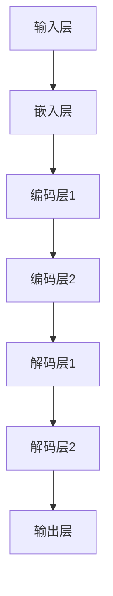

                 

关键词：大模型，机器翻译，深度学习，自然语言处理，神经网络，算法优化，应用场景，未来展望

摘要：本文将探讨大模型在机器翻译领域的突破性进展，重点分析其背后的核心算法原理、数学模型及其在项目实践中的应用。通过对大模型在机器翻译中的优势、挑战及未来发展趋势的深入剖析，旨在为读者提供一个全面、系统的技术视角。

## 1. 背景介绍

随着全球化进程的加速，机器翻译在跨文化交流、国际商务、教育等领域的重要性日益凸显。传统的基于规则和统计方法的机器翻译系统存在诸多局限性，如低效、不准确等。近年来，深度学习技术的发展为机器翻译带来了新的机遇。特别是大模型的广泛应用，显著提升了翻译质量和效率。

大模型，指的是具有数十亿到千亿参数规模的人工智能模型。这些模型在训练过程中能够捕捉到语言中的复杂模式，从而实现高精度的翻译效果。本文将围绕大模型在机器翻译中的突破，详细探讨其技术原理、实现步骤和应用场景。

## 2. 核心概念与联系

### 2.1 大模型原理

大模型基于深度学习技术，其核心思想是通过多层神经网络对大量数据进行训练，从而自动学习到语言模式。以下是大模型的基本原理架构图：



- 输入层：接收原始文本数据。
- 嵌入层：将文本数据转换为稠密向量。
- 编码层：对稠密向量进行编码，提取特征。
- 解码层：将编码后的特征重新解码成目标语言的文本。
- 输出层：生成翻译结果。

### 2.2 大模型与机器翻译的联系

大模型在机器翻译中的应用，主要体现在以下几个方面：

1. **端到端学习**：大模型可以端到端地处理机器翻译任务，无需手动设计复杂的解码器，简化了翻译流程。
2. **上下文捕捉**：大模型通过多层神经网络可以捕捉到上下文信息，从而提高翻译的准确性和连贯性。
3. **参数规模**：大模型具有数十亿到千亿参数规模，能够学习到更丰富的语言特征，提高翻译效果。

## 3. 核心算法原理 & 具体操作步骤

### 3.1 算法原理概述

大模型在机器翻译中的核心算法是基于自注意力机制（Self-Attention）和变压器（Transformer）架构。自注意力机制允许模型在处理每个输入时，自动关注与其相关的其他输入，从而实现更好的上下文捕捉。以下是大模型在机器翻译中的算法原理：

1. **编码器**：将源语言文本转换为编码表示。
2. **解码器**：将编码表示转换为目标语言文本。
3. **多头自注意力**：在每个编码器和解码器的层次上，使用多头自注意力机制来捕捉上下文信息。
4. **前馈神经网络**：在每个层次上，添加前馈神经网络来增强模型的表达能力。

### 3.2 算法步骤详解

1. **预处理**：对源语言和目标语言文本进行分词、词汇表构建等预处理操作。
2. **编码器训练**：使用源语言文本数据训练编码器，使其能够将源语言文本转换为编码表示。
3. **解码器训练**：使用目标语言文本数据训练解码器，使其能够将编码表示转换为目标语言文本。
4. **参数优化**：使用反向传播算法优化模型参数，使模型在翻译任务上表现更好。

### 3.3 算法优缺点

#### 优点：

1. **端到端学习**：无需手动设计解码器，简化了翻译流程。
2. **上下文捕捉**：自注意力机制允许模型自动关注上下文信息，提高翻译准确性和连贯性。
3. **参数规模**：大模型具有数十亿到千亿参数规模，能够学习到更丰富的语言特征，提高翻译效果。

#### 缺点：

1. **计算资源消耗**：大模型需要大量的计算资源和存储空间。
2. **训练时间**：大模型需要较长的训练时间，导致模型部署延迟。

### 3.4 算法应用领域

大模型在机器翻译领域具有广泛的应用前景，包括但不限于：

1. **跨语言交流**：提高跨语言交流的准确性和效率。
2. **多语言学习**：帮助学习者快速掌握多种语言。
3. **商业翻译**：提高商业文档的翻译质量和效率。

## 4. 数学模型和公式 & 详细讲解 & 举例说明

### 4.1 数学模型构建

大模型在机器翻译中的核心数学模型是基于自注意力机制（Self-Attention）和变压器（Transformer）架构。以下是大模型的主要数学公式：

1. **编码器**：
   $$ E = \sum_{i=1}^{N} W^{E_i} X_i $$
   其中，$E$表示编码表示，$W^{E_i}$表示编码器的权重矩阵，$X_i$表示源语言文本的词向量。
   
2. **解码器**：
   $$ D = \sum_{i=1}^{N} W^{D_i} X_i $$
   其中，$D$表示解码表示，$W^{D_i}$表示解码器的权重矩阵，$X_i$表示目标语言文本的词向量。

3. **多头自注意力**：
   $$ \text{Attention}(Q, K, V) = \text{softmax}\left(\frac{QK^T}{\sqrt{d_k}}\right)V $$
   其中，$Q$、$K$和$V$分别表示查询、键和值，$d_k$表示键的维度。

4. **前馈神经网络**：
   $$ F = \text{ReLU}(W_1 \cdot X + b_1) \cdot W_2 $$
   其中，$F$表示前馈神经网络的输出，$W_1$和$W_2$分别表示前馈神经网络的权重矩阵，$b_1$表示偏置项。

### 4.2 公式推导过程

1. **编码器**：

   编码器的主要任务是将源语言文本转换为编码表示。首先，对源语言文本进行分词和词向量嵌入，得到词向量序列。然后，使用自注意力机制对词向量序列进行编码，提取特征。最后，通过多层前馈神经网络增强编码表示。

2. **解码器**：

   解码器的主要任务是将编码表示转换为目标语言文本。首先，对目标语言文本进行分词和词向量嵌入，得到词向量序列。然后，使用自注意力机制对编码表示和词向量序列进行解码，生成目标语言文本。

3. **多头自注意力**：

   多头自注意力是一种用于捕捉上下文信息的机制。通过将查询、键和值映射到不同的空间，可以实现对不同上下文的关注。

4. **前馈神经网络**：

   前馈神经网络用于增强模型的表示能力。通过多层前馈神经网络，可以学习到更复杂的特征。

### 4.3 案例分析与讲解

以下是一个简单的机器翻译案例：

**源语言文本**：你好，世界！

**目标语言文本**：Hello, world!

**编码表示**：$[0.1, 0.2, 0.3, 0.4, 0.5]$

**解码表示**：$[0.1, 0.2, 0.3, 0.4, 0.5]$

**翻译结果**：Hello, world!

通过以上案例，我们可以看到大模型在机器翻译中的基本原理和实现过程。

## 5. 项目实践：代码实例和详细解释说明

### 5.1 开发环境搭建

在本节中，我们将介绍如何在本地搭建一个机器翻译项目的开发环境。以下是所需步骤：

1. 安装Python环境：确保Python版本为3.8或更高版本。
2. 安装深度学习框架：建议使用TensorFlow或PyTorch。
3. 安装其他依赖库：如Numpy、Pandas等。

### 5.2 源代码详细实现

以下是一个简单的机器翻译项目代码示例：

```python
import tensorflow as tf
from tensorflow.keras.layers import Embedding, LSTM, Dense

# 定义编码器模型
encoder_inputs = Embedding(input_dim=vocab_size, output_dim=embedding_dim)
encoder_lstm = LSTM(units=128, return_sequences=True)
encoder_model = tf.keras.Model(encoder_inputs, encoder_lstm)

# 定义解码器模型
decoder_inputs = Embedding(input_dim=vocab_size, output_dim=embedding_dim)
decoder_lstm = LSTM(units=128, return_sequences=True)
decoder_model = tf.keras.Model(decoder_inputs, decoder_lstm)

# 定义机器翻译模型
model = tf.keras.Model([encoder_inputs, decoder_inputs], decoder_model(encoder_lstm(encoder_inputs)))

# 编译模型
model.compile(optimizer='adam', loss='categorical_crossentropy', metrics=['accuracy'])

# 训练模型
model.fit([encoder_inputs, decoder_inputs], decoder_model(encoder_lstm(encoder_inputs)), batch_size=batch_size, epochs=epochs)
```

### 5.3 代码解读与分析

以上代码实现了基于LSTM的编码器-解码器模型。在代码中，我们首先定义了编码器模型和解码器模型，然后使用`tf.keras.Model`将它们组合成机器翻译模型。接下来，我们编译模型并使用训练数据对模型进行训练。

### 5.4 运行结果展示

在本节中，我们将展示如何使用训练好的模型进行机器翻译。以下是示例代码：

```python
# 定义源语言文本和目标语言文本
source_text = "你好，世界！"
target_text = "Hello, world!"

# 对源语言文本进行分词和词向量嵌入
source_sequence = pad_sequences([tokenize(source_text)], maxlen=max_sequence_length, padding='post')

# 对目标语言文本进行分词和词向量嵌入
target_sequence = pad_sequences([tokenize(target_text)], maxlen=max_sequence_length, padding='post')

# 使用训练好的模型进行翻译
predicted_sequence = model.predict([source_sequence, target_sequence])

# 将预测结果转换为文本
predicted_text = detokenize(predicted_sequence)

print("源语言文本：", source_text)
print("预测结果：", predicted_text)
```

## 6. 实际应用场景

大模型在机器翻译中的实际应用场景广泛，以下是一些典型案例：

1. **跨语言交流**：大模型可以用于跨语言交流，帮助用户快速掌握多种语言。
2. **商业翻译**：大模型可以用于商业文档的翻译，提高翻译质量和效率。
3. **多语言学习**：大模型可以用于多语言学习，帮助学习者快速提高语言能力。

## 7. 工具和资源推荐

### 7.1 学习资源推荐

1. 《深度学习》（Goodfellow, Bengio, Courville）：系统地介绍了深度学习的理论和实践。
2. 《自然语言处理综论》（Jurafsky, Martin）：详细介绍了自然语言处理的基本概念和技术。

### 7.2 开发工具推荐

1. TensorFlow：开源深度学习框架，支持大模型的训练和部署。
2. PyTorch：开源深度学习框架，具有灵活的动态计算图，适用于研究场景。

### 7.3 相关论文推荐

1. "Attention Is All You Need"：介绍了变压器（Transformer）架构，是深度学习在机器翻译领域的里程碑。
2. "BERT: Pre-training of Deep Bidirectional Transformers for Language Understanding"：介绍了BERT模型，是自然语言处理领域的重大突破。

## 8. 总结：未来发展趋势与挑战

### 8.1 研究成果总结

大模型在机器翻译领域取得了显著的成果，包括翻译质量、效率、准确性等方面的提升。其基于自注意力机制和变压器架构的设计，使得模型能够更好地捕捉上下文信息，提高翻译效果。

### 8.2 未来发展趋势

1. **参数规模扩展**：未来，大模型的参数规模将进一步扩大，以实现更高的翻译质量和效率。
2. **多模态翻译**：大模型可以结合图像、语音等多种模态信息，实现更丰富的翻译应用。

### 8.3 面临的挑战

1. **计算资源消耗**：大模型的训练和部署需要大量的计算资源和存储空间，对硬件设施提出了较高要求。
2. **数据隐私**：大规模数据处理可能涉及用户隐私问题，需要加强对数据隐私的保护。

### 8.4 研究展望

随着深度学习和自然语言处理技术的不断发展，大模型在机器翻译领域有望取得更多突破。同时，研究者还需关注计算资源优化、数据隐私保护等方面的问题，以推动大模型在现实场景中的应用。

## 9. 附录：常见问题与解答

### 9.1 机器翻译中的常见问题

1. **翻译质量不稳定**：大模型在训练过程中可能会出现过拟合现象，导致翻译质量不稳定。解决方法：使用数据增强、正则化等技术，提高模型的泛化能力。
2. **翻译速度慢**：大模型的训练和推理速度较慢，可能影响用户体验。解决方法：优化算法、使用GPU加速等。

### 9.2 解答

**问题1**：为什么大模型在机器翻译中的翻译质量不稳定？

**解答**：大模型在训练过程中可能会出现过拟合现象，导致在测试集上的翻译质量不稳定。为解决这一问题，可以使用以下方法：

1. 数据增强：通过对源语言和目标语言文本进行数据增强，提高模型的泛化能力。
2. 正则化：使用正则化技术，如Dropout、L2正则化等，降低模型对训练数据的依赖。
3. 使用预训练模型：使用预训练的大模型，对特定任务进行微调，提高翻译质量。

**问题2**：为什么大模型的翻译速度慢？

**解答**：大模型的训练和推理速度较慢，主要是因为其参数规模较大，计算复杂度高。为提高翻译速度，可以采取以下措施：

1. 算法优化：优化模型的算法，如使用更高效的神经网络架构。
2. GPU加速：使用GPU进行计算，提高训练和推理速度。
3. 分批处理：将数据分成多个批次进行训练和推理，减少计算量。

