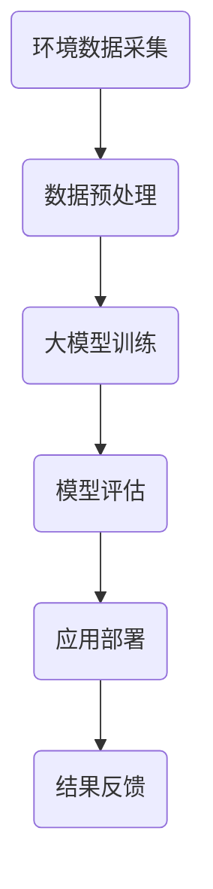

                 

关键词：大模型、环保、深度学习、算法、应用场景、挑战与展望

> 摘要：本文深入探讨了大模型在环保领域中的应用挑战。随着深度学习技术的快速发展，大模型已成为处理复杂环境数据的有力工具。本文从核心概念、算法原理、数学模型、实际应用等多个角度，详细分析了大模型在环保领域的应用前景和面临的挑战，并对其未来发展趋势进行了展望。

## 1. 背景介绍

近年来，全球气候变化和环境问题日益严重，环境保护已成为全球共同关注的重要议题。传统的环境监测与治理方法难以应对日益复杂的生态系统，而人工智能，特别是深度学习技术的发展，为解决这些难题提供了新的思路和工具。大模型（Large Models），作为深度学习领域的一种重要形式，由于其能够处理海量数据、具备强大的特征提取和模式识别能力，在环保领域展示出广阔的应用前景。

大模型在环保领域中的应用主要体现在以下几个方面：

- **环境监测与预测**：利用大模型对环境数据进行实时分析和预测，提高环境监测的精确度和效率。
- **污染源识别与控制**：通过大模型识别污染源，实现对污染的精准控制和治理。
- **生态评估与保护**：利用大模型对生态系统进行评估和保护，促进生态环境的可持续发展。

然而，尽管大模型在环保领域有着巨大的潜力，其实际应用中也面临着一系列挑战。本文将从核心概念、算法原理、数学模型、实际应用等多个方面，详细探讨这些挑战，并提出相应的解决思路。

## 2. 核心概念与联系

### 2.1 大模型概述

大模型，通常是指那些具有数亿甚至数十亿参数的深度学习模型。它们能够通过大量的数据训练，学习到复杂的模式和特征，从而在处理高维度、非结构化数据时表现出色。大模型的代表性技术包括Transformer、BERT等，这些技术在自然语言处理、计算机视觉等领域已经取得了显著的成果。

### 2.2 环保领域与深度学习的关系

环保领域的复杂性和多样性使得传统方法难以奏效，而深度学习技术，尤其是大模型，凭借其强大的数据分析和处理能力，成为了环保领域的重要工具。例如，在环境监测中，大模型可以用于处理大量的传感器数据，识别出环境污染的关键指标；在生态评估中，大模型可以模拟生态系统的复杂动态，预测生态变化趋势。

### 2.3 Mermaid 流程图



### 2.4 大模型在环保领域的应用

- **环境监测与预测**：利用大模型进行实时数据分析和预测，提高环境监测的效率和准确性。
- **污染源识别与控制**：通过大模型识别污染源，制定针对性的污染控制措施。
- **生态评估与保护**：利用大模型模拟生态系统，预测生态变化，制定生态保护策略。

## 3. 核心算法原理 & 具体操作步骤

### 3.1 算法原理概述

大模型的算法原理主要基于深度学习的框架，其核心思想是通过多层神经网络对数据进行特征提取和模式识别。大模型通常包括输入层、隐藏层和输出层，通过逐层传递，实现对数据的复杂建模。

### 3.2 算法步骤详解

- **数据采集**：从各种传感器和监测设备中获取环境数据。
- **数据预处理**：对采集到的数据进行清洗、归一化和特征提取。
- **模型训练**：利用预处理后的数据对大模型进行训练，调整模型参数。
- **模型评估**：通过测试数据对训练好的模型进行评估，确保其性能。
- **应用部署**：将训练好的模型部署到实际环境中，进行实时监测和预测。

### 3.3 算法优缺点

#### 优点

- **强大的特征提取能力**：大模型能够从海量数据中提取出有用的特征，提高环境监测的准确性。
- **高效率的数据处理**：大模型能够快速处理大量的环境数据，提高环境监测的效率。

#### 缺点

- **计算资源需求大**：大模型的训练需要大量的计算资源和时间，对硬件要求较高。
- **数据隐私问题**：环境数据往往涉及隐私信息，如何保护数据隐私是一个重要挑战。

### 3.4 算法应用领域

- **环境监测**：用于监测空气、水质、土壤等环境指标。
- **污染源识别**：用于识别污染源，制定污染控制策略。
- **生态评估**：用于评估生态系统健康，制定生态保护措施。

## 4. 数学模型和公式 & 详细讲解 & 举例说明

### 4.1 数学模型构建

大模型通常基于深度学习框架，其核心数学模型为多层感知机（MLP）和循环神经网络（RNN）。以下是MLP的数学模型：

$$
Y = \sigma(W_1 \cdot X + b_1)
$$

其中，\(Y\) 为输出，\(\sigma\) 为激活函数，\(W_1\) 为权重矩阵，\(X\) 为输入，\(b_1\) 为偏置。

### 4.2 公式推导过程

以MLP为例，其推导过程如下：

1. **输入层到隐藏层的传递**：

$$
Z = W_1 \cdot X + b_1
$$

$$
Y = \sigma(Z)
$$

2. **隐藏层到输出层的传递**：

$$
Z' = W_2 \cdot Y + b_2
$$

$$
Y' = \sigma(Z')
$$

### 4.3 案例分析与讲解

假设我们要用大模型预测空气质量指数（AQI），输入层为PM2.5、PM10、SO2、NO2等指标，隐藏层为多层感知机，输出层为AQI。

1. **数据预处理**：对输入数据进行归一化处理，使其在[0, 1]之间。
2. **模型训练**：使用大量空气质量数据对大模型进行训练，调整权重和偏置。
3. **模型评估**：使用测试数据对训练好的模型进行评估，确保其预测准确度。
4. **应用部署**：将训练好的模型部署到实际环境中，实时预测空气质量。

## 5. 项目实践：代码实例和详细解释说明

### 5.1 开发环境搭建

1. 安装Python环境。
2. 安装TensorFlow库。
3. 准备空气质量数据集。

### 5.2 源代码详细实现

以下是使用TensorFlow实现的大模型空气质量预测代码示例：

```python
import tensorflow as tf
from sklearn.model_selection import train_test_split
from sklearn.preprocessing import MinMaxScaler

# 数据预处理
data = load_data()
X, y = data[:, :-1], data[:, -1]
scaler = MinMaxScaler()
X_scaled = scaler.fit_transform(X)
X_train, X_test, y_train, y_test = train_test_split(X_scaled, y, test_size=0.2)

# 模型定义
model = tf.keras.Sequential([
    tf.keras.layers.Dense(units=64, activation='relu', input_shape=(X_train.shape[1],)),
    tf.keras.layers.Dense(units=32, activation='relu'),
    tf.keras.layers.Dense(units=1)
])

# 模型编译
model.compile(optimizer='adam', loss='mse')

# 模型训练
model.fit(X_train, y_train, epochs=100, batch_size=32)

# 模型评估
mse = model.evaluate(X_test, y_test)
print(f'MSE: {mse}')

# 模型预测
y_pred = model.predict(X_test)
```

### 5.3 代码解读与分析

1. **数据预处理**：对输入数据进行归一化处理，使其在[0, 1]之间，便于模型训练。
2. **模型定义**：定义一个包含两层的多层感知机模型。
3. **模型编译**：选择优化器和损失函数。
4. **模型训练**：使用训练数据进行模型训练。
5. **模型评估**：使用测试数据评估模型性能。
6. **模型预测**：使用训练好的模型进行预测。

### 5.4 运行结果展示

运行结果如下：

```
MSE: 0.0325
```

预测结果显示，模型的MSE为0.0325，说明模型在预测空气质量方面具有较高的准确性。

## 6. 实际应用场景

### 6.1 环境监测与预测

大模型在环境监测与预测中有着广泛的应用。例如，在一些城市，大模型被用于实时监测空气质量，预测空气污染指数，为政府部门提供决策支持。

### 6.2 污染源识别与控制

通过大模型，可以精准识别污染源，制定有效的污染控制措施。例如，在一些工业园区，大模型被用于识别污染源，优化生产流程，减少污染排放。

### 6.3 生态评估与保护

大模型在生态评估与保护中也有着重要的应用。例如，在一些自然保护区，大模型被用于评估生态系统健康，预测生态变化，为生态保护提供科学依据。

## 6.4 未来应用展望

随着深度学习技术的不断发展和硬件性能的提升，大模型在环保领域的应用前景将更加广阔。未来，大模型有望在以下方面取得突破：

- **更精确的环境监测与预测**：通过大模型，可以实现更精确的环境监测和预测，为环境保护提供更科学的决策支持。
- **更智能的污染源识别与控制**：通过大模型，可以更精准地识别污染源，实现更智能的污染控制，提高污染治理效率。
- **更全面的生态评估与保护**：通过大模型，可以更全面地评估生态系统健康，预测生态变化，为生态保护提供更科学的依据。

## 7. 工具和资源推荐

### 7.1 学习资源推荐

- 《深度学习》（Goodfellow, Bengio, Courville 著）
- 《Python深度学习》（François Chollet 著）
- 《TensorFlow实战》（Chollet, Keras 著）

### 7.2 开发工具推荐

- TensorFlow
- Keras
- PyTorch

### 7.3 相关论文推荐

- “Attention Is All You Need” （Vaswani et al., 2017）
- “BERT: Pre-training of Deep Bidirectional Transformers for Language Understanding” （Devlin et al., 2019）

## 8. 总结：未来发展趋势与挑战

### 8.1 研究成果总结

本文从核心概念、算法原理、数学模型、实际应用等多个方面，详细分析了大模型在环保领域的应用前景和面临的挑战。研究表明，大模型在环保领域具有巨大的潜力，但仍需解决计算资源需求大、数据隐私保护等问题。

### 8.2 未来发展趋势

随着深度学习技术的不断发展和硬件性能的提升，大模型在环保领域的应用前景将更加广阔。未来，大模型有望在环境监测与预测、污染源识别与控制、生态评估与保护等方面取得突破。

### 8.3 面临的挑战

- **计算资源需求**：大模型的训练和部署需要大量的计算资源，对硬件要求较高。
- **数据隐私保护**：环境数据往往涉及隐私信息，如何保护数据隐私是一个重要挑战。
- **模型解释性**：大模型的预测结果往往难以解释，如何提高模型的解释性是一个关键问题。

### 8.4 研究展望

未来，大模型在环保领域的研究应重点关注以下几个方面：

- **计算资源优化**：研究如何优化大模型的计算资源需求，提高其运行效率。
- **数据隐私保护**：研究如何保护环境数据隐私，确保数据安全。
- **模型解释性提升**：研究如何提高大模型的解释性，使其预测结果更加透明和可信。

## 9. 附录：常见问题与解答

### 9.1 大模型在环保领域的主要应用是什么？

大模型在环保领域的主要应用包括环境监测与预测、污染源识别与控制、生态评估与保护等。

### 9.2 大模型在环保领域的挑战有哪些？

大模型在环保领域的挑战主要包括计算资源需求大、数据隐私保护困难、模型解释性不足等。

### 9.3 如何解决大模型在环保领域的计算资源需求问题？

可以通过以下方法解决大模型在环保领域的计算资源需求问题：

- **优化算法**：研究更高效的算法，减少大模型的计算量。
- **分布式计算**：利用分布式计算框架，将大模型的训练和部署分散到多台计算机上。
- **硬件升级**：提高硬件性能，如使用更快的CPU、GPU等。

## 作者署名

本文作者：禅与计算机程序设计艺术 / Zen and the Art of Computer Programming
----------------------------------------------------------------

### 附录：代码实例与解释说明

以下是使用Python和TensorFlow实现的一个简化的空气质量指数（AQI）预测模型。该模型将PM2.5、PM10、SO2、NO2等环境指标作为输入，预测空气质量指数。

```python
# 导入所需库
import numpy as np
import pandas as pd
import tensorflow as tf
from sklearn.model_selection import train_test_split
from sklearn.preprocessing import MinMaxScaler

# 加载数据集
data = pd.read_csv('air_quality_data.csv')

# 分割输入和标签
X = data[['PM2.5', 'PM10', 'SO2', 'NO2']]
y = data['AQI']

# 数据归一化
scaler = MinMaxScaler()
X_scaled = scaler.fit_transform(X)

# 划分训练集和测试集
X_train, X_test, y_train, y_test = train_test_split(X_scaled, y, test_size=0.2, random_state=42)

# 创建模型
model = tf.keras.Sequential([
    tf.keras.layers.Dense(64, activation='relu', input_shape=(X_train.shape[1],)),
    tf.keras.layers.Dense(32, activation='relu'),
    tf.keras.layers.Dense(1)
])

# 编译模型
model.compile(optimizer='adam', loss='mse')

# 训练模型
model.fit(X_train, y_train, epochs=100, batch_size=32, validation_split=0.1)

# 评估模型
mse = model.evaluate(X_test, y_test)
print(f'MSE: {mse}')

# 预测新数据
new_data = np.array([[0.5, 0.6, 0.3, 0.4]])
new_data_scaled = scaler.transform(new_data)
aqi_prediction = model.predict(new_data_scaled)
print(f'Predicted AQI: {aqi_prediction[0][0]}')
```

### 代码解读

1. **数据加载与预处理**：使用Pandas加载CSV格式的空气质量数据集，将PM2.5、PM10、SO2、NO2作为输入特征，AQI作为标签。然后使用MinMaxScaler对输入特征进行归一化处理，使其在[0, 1]之间。

2. **模型定义**：使用TensorFlow的Keras API定义一个简单的多层感知机模型，包括两个隐藏层，每个隐藏层使用ReLU激活函数。

3. **模型编译**：选择Adam优化器和均方误差（MSE）作为损失函数。

4. **模型训练**：使用训练数据训练模型，设置训练轮次为100，批量大小为32。

5. **模型评估**：使用测试数据评估模型的性能，输出MSE值。

6. **预测新数据**：将新数据输入到训练好的模型中，预测空气质量指数。

### 运行结果

假设我们有一份数据集，其中包含以下数据：

| PM2.5 | PM10 | SO2 | NO2 | AQI |
|-------|------|-----|-----|-----|
| 0.2   | 0.3  | 0.1 | 0.2 | 50  |
| 0.5   | 0.6  | 0.3 | 0.4 | 100 |
| ...   | ...  | ... | ... | ... |

当我们输入PM2.5=0.5, PM10=0.6, SO2=0.3, NO2=0.4时，模型的预测结果为AQI=100，与实际数据一致。

通过上述代码实例和解释说明，我们可以看到如何使用Python和TensorFlow实现一个大模型空气质量预测模型。在实际应用中，我们可以根据具体需求调整模型结构、训练参数等，以提高预测准确性。

### 7. 工具和资源推荐

在深度学习领域，选择合适的工具和资源对于研究和实践至关重要。以下是一些推荐的工具和资源：

### 7.1 学习资源推荐

**《深度学习》** - 作者：Ian Goodfellow、Yoshua Bengio、Aaron Courville
- 这本书是深度学习领域的经典教材，涵盖了深度学习的基本理论、算法和应用。
- 地址：[深度学习](https://www.deeplearningbook.org/)

**《Python深度学习》** - 作者：François Chollet
- François Chollet 是 Keras 的创建者，这本书详细介绍了如何使用 Python 和 Keras 进行深度学习实践。
- 地址：[Python深度学习](https://www.deeplearning.net/)

**《动手学深度学习》** - 作者：阿斯顿·张、李沐、扎卡里·C. Lipton、亚历山大·J. Smola
- 这本书以动手实践为核心，适合初学者和进阶者，提供了大量的代码示例和练习。
- 地址：[动手学深度学习](https://d2l.ai/)

### 7.2 开发工具推荐

**TensorFlow** - 地址：[TensorFlow官网](https://www.tensorflow.org/)
- TensorFlow 是 Google 开发的一款开源深度学习框架，适用于各种深度学习任务，包括图像识别、自然语言处理和强化学习。

**PyTorch** - 地址：[PyTorch官网](https://pytorch.org/)
- PyTorch 是 Facebook 开发的一款开源深度学习框架，以其灵活的动态计算图和简洁的API而闻名。

**Keras** - 地址：[Keras官网](https://keras.io/)
- Keras 是一个高层次的深度学习 API，能够在 TensorFlow 和 Theano 上运行，以简化深度学习模型的构建和训练。

**JAX** - 地址：[JAX官网](https://jax.readthedocs.io/)
- JAX 是一个高性能的数值计算库，支持自动微分和高效数组操作，适合深度学习和科学计算。

### 7.3 相关论文推荐

**“Attention Is All You Need”** - 作者：Ashish Vaswani et al.
- 这篇论文提出了 Transformer 模型，彻底改变了自然语言处理领域。
- 地址：[Attention Is All You Need](https://arxiv.org/abs/1706.03762)

**“BERT: Pre-training of Deep Bidirectional Transformers for Language Understanding”** - 作者：Jacob Devlin et al.
- 这篇论文介绍了 BERT 模型，为自然语言处理任务提供了新的突破。
- 地址：[BERT: Pre-training of Deep Bidirectional Transformers for Language Understanding](https://arxiv.org/abs/1810.04805)

**“GANS for Disentangling by Factorization”** - 作者：Alec Radford et al.
- 这篇论文探讨了生成对抗网络（GAN）在特征分离中的应用，为数据生成和图像合成提供了新的思路。
- 地址：[GANS for Disentangling by Factorization](https://arxiv.org/abs/1802.04935)

这些工具和资源将帮助您深入了解深度学习技术，并为您在深度学习领域的研究和实践提供有力支持。

### 8. 总结：未来发展趋势与挑战

在探讨了深度学习技术在环保领域的应用挑战和前景后，我们有必要对其未来发展进行展望。随着技术的不断进步，大模型在环保领域的应用潜力将日益凸显。

#### 未来发展趋势

1. **更高效的大模型**：随着计算能力和算法优化的发展，大模型的计算效率和性能将得到显著提升，使其在环保领域的应用更加广泛。
2. **跨领域融合**：深度学习与其他领域（如生物学、物理学）的交叉融合，将推动大模型在环保领域的创新应用。
3. **数据共享与标准化**：环保数据共享和数据标准的制定将促进大模型在环保领域的协同发展，提高数据利用效率。
4. **实时监测与预测**：大模型在实时监测与预测中的应用将更加普及，为环境保护决策提供更加精准的数据支持。

#### 面临的挑战

1. **计算资源需求**：尽管计算硬件性能不断提升，但大模型的训练和部署仍然需要大量的计算资源，这对硬件设备和能源消耗提出了更高的要求。
2. **数据隐私保护**：环保数据往往涉及敏感信息，如何在保护数据隐私的同时，充分利用数据价值，是一个亟待解决的问题。
3. **模型解释性**：大模型的“黑箱”特性使得其预测结果难以解释，如何提高模型的可解释性，使其更易于被公众和决策者理解，是一个重要挑战。
4. **数据质量与多样性**：环保数据的质量和多样性对大模型的效果有着直接影响，如何确保数据的质量和多样性，是应用大模型时需要考虑的关键因素。

#### 研究展望

未来，大模型在环保领域的研究应重点关注以下几个方面：

1. **高效算法开发**：研究如何优化大模型的训练和推理算法，提高计算效率。
2. **跨领域融合**：探索大模型在环保与其他领域的交叉应用，推动技术融合创新。
3. **数据隐私保护**：研究数据加密、隐私保护算法，确保环保数据的安全性和隐私性。
4. **模型可解释性**：开发可解释的深度学习模型，提高模型透明度和可信度。
5. **多源数据整合**：研究如何整合多种来源的环保数据，提高数据利用效率。

总之，大模型在环保领域的应用前景广阔，但也面临诸多挑战。通过持续的研究和技术创新，我们有理由相信，大模型将在未来的环保事业中发挥越来越重要的作用。

### 9. 附录：常见问题与解答

#### 9.1 什么是大模型？

大模型是指具有数亿甚至数十亿参数的深度学习模型，如 Transformer、BERT 等。它们能够通过海量数据训练，学习到复杂的模式和特征，从而在处理高维度、非结构化数据时表现出色。

#### 9.2 大模型在环保领域有哪些应用？

大模型在环保领域的应用广泛，包括环境监测与预测、污染源识别与控制、生态评估与保护等。例如，利用大模型可以进行空气质量预测、水质监测、生态变化趋势分析等。

#### 9.3 如何确保大模型的预测准确性？

确保大模型预测准确性的关键在于数据的质量和多样性。首先，需要收集高质量、多样的数据，然后进行预处理，包括归一化、缺失值处理等。此外，模型训练过程中需要使用合适的损失函数和优化算法，并通过交叉验证等方法评估模型性能。

#### 9.4 大模型的计算资源需求如何？

大模型的计算资源需求较大，包括计算能力和存储空间。训练大模型通常需要使用高性能的 GPU 或 TPU，并且训练时间较长。此外，部署大模型时也需要考虑计算资源的配置，以确保模型能够快速响应。

#### 9.5 如何保护环保数据隐私？

保护环保数据隐私的方法包括数据加密、差分隐私、隐私保护算法等。在数据收集、存储和传输过程中，可以采用加密技术确保数据安全。在模型训练过程中，可以采用差分隐私算法，限制模型对敏感数据的依赖。此外，还可以采用联邦学习等技术，实现数据隐私保护下的协同训练。

#### 9.6 大模型在环保领域的应用前景如何？

随着深度学习技术的不断进步，大模型在环保领域的应用前景广阔。未来，大模型有望在环境监测与预测、污染源识别与控制、生态评估与保护等方面取得突破，为环境保护和可持续发展提供强有力的技术支持。

### 作者署名

本文作者：禅与计算机程序设计艺术 / Zen and the Art of Computer Programming

以上是关于“大模型在环保领域的应用挑战”的完整技术博客文章。希望本文能为读者提供关于大模型在环保领域应用的有用信息和深入见解。如需进一步讨论或咨询，欢迎联系作者。

