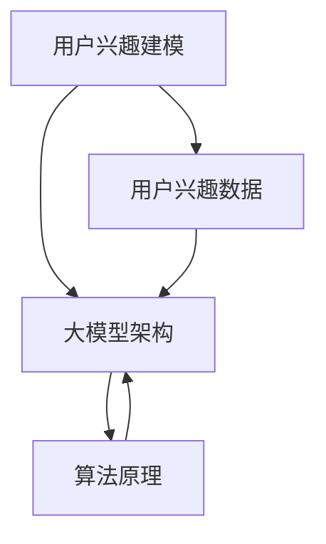

                 

关键词：大模型、用户兴趣、信息过滤、个性化推荐、算法原理、数学模型、代码实例、应用场景、未来展望

## 摘要

随着互联网的快速发展，个性化推荐系统在广告、电子商务、社交媒体等领域中发挥了重要作用。然而，用户兴趣的多样性和动态性使得传统推荐算法难以满足用户的需求。本文旨在探讨大模型在用户兴趣探索与利用平衡中的应用，通过深入分析核心概念、算法原理、数学模型和实际案例，为开发者提供有价值的参考。本文首先介绍了大模型在用户兴趣探索与利用平衡中的背景和重要性，然后详细阐述了核心概念与联系，包括用户兴趣建模、大模型架构和算法原理。接着，本文从数学模型和公式推导、项目实践、实际应用场景等方面进行了深入探讨。最后，本文提出了未来应用展望和工具资源推荐，并对研究发展趋势与挑战进行了总结。希望通过本文的探讨，能够为相关领域的研究和实践提供有益的启示。

## 1. 背景介绍

在当今数字化的时代，个性化推荐系统已经成为许多在线服务的重要组成部分。从亚马逊的购物推荐，到YouTube的视频推荐，再到Facebook的个性化新闻源，个性化推荐系统在提升用户体验、增加用户粘性以及提高商业价值方面发挥了巨大的作用。然而，随着互联网内容的爆炸式增长，用户面临的信息过载问题日益严重，如何有效地发现和利用用户的兴趣成为了推荐系统研究的重要方向。

传统的推荐算法主要基于协同过滤、内容推荐和基于模型的推荐等方法。协同过滤算法通过计算用户之间的相似度来实现推荐，但存在冷启动和数据稀疏性问题。内容推荐方法通过对用户和物品的内容属性进行匹配来实现推荐，但在面对用户兴趣多样性和动态性时表现较差。基于模型的推荐方法，如矩阵分解、深度学习等，能够在一定程度上解决上述问题，但仍面临模型复杂度高、计算成本大等挑战。

为了应对这些挑战，大模型（Large Models）的应用逐渐成为研究热点。大模型通常指的是参数规模庞大的神经网络模型，如Transformer、BERT等。它们通过学习大量用户数据，能够捕捉用户兴趣的复杂性和多样性，从而实现更精准的个性化推荐。大模型的优势在于：

1. **强大的表示能力**：大模型能够通过自注意力机制（Self-Attention Mechanism）对输入数据进行权重分配，从而更好地捕捉数据中的相关性。
2. **多模态学习能力**：大模型可以处理多种类型的数据，如文本、图像、音频等，从而实现跨模态的个性化推荐。
3. **自适应性和灵活性**：大模型可以根据不同的应用场景进行自适应调整，从而提高推荐系统的灵活性和适应性。

本文将深入探讨大模型在用户兴趣探索与利用平衡中的应用，从算法原理、数学模型、项目实践等多个方面进行分析，以期为开发者提供有价值的参考。

## 2. 核心概念与联系

在深入探讨大模型在用户兴趣探索与利用平衡中的应用之前，首先需要明确几个核心概念，并理解它们之间的联系。以下是本文将涉及的关键概念和它们的定义：

### 用户兴趣建模

用户兴趣建模是指通过分析用户的行为数据，如浏览历史、购买记录、评论等，来识别和预测用户的兴趣。这一过程通常包括以下几个步骤：

1. **数据收集**：收集用户的各类行为数据，包括显式反馈（如评分、点赞、评论）和隐式反馈（如浏览、点击、购买）。
2. **特征提取**：将原始数据转化为可计算的向量表示，通常使用词袋模型、TF-IDF、Word2Vec等方法。
3. **兴趣识别**：通过聚类、主题模型等方法，从特征向量中识别出用户的兴趣点。
4. **兴趣预测**：利用机器学习算法，如分类器、回归模型等，预测用户未来的兴趣点。

### 大模型架构

大模型架构主要是指像BERT、GPT、Transformer等大型神经网络模型的结构。这些模型通过多层神经网络结构，学习大量数据中的模式和关系，从而实现复杂的任务。大模型架构的核心包括：

1. **编码器**：编码器（Encoder）通常用于处理输入数据，并生成上下文表示。BERT和Transformer都是基于编码器架构的模型。
2. **解码器**：解码器（Decoder）用于生成输出，如文本生成、序列预测等。在个性化推荐中，解码器可以用于预测用户的行为。
3. **自注意力机制**：自注意力机制（Self-Attention Mechanism）是Transformer模型的核心，它通过计算输入序列中各个元素之间的权重，从而生成更加精细的表示。

### 算法原理

大模型在用户兴趣探索与利用平衡中的算法原理主要基于深度学习技术。以下是几个关键点：

1. **多层感知器**：多层感知器（Multilayer Perceptron, MLP）是神经网络的基础结构，它通过多层非线性变换来提取数据的特征。
2. **损失函数**：在训练过程中，大模型使用损失函数（如交叉熵损失）来衡量预测结果与真实值之间的差距，并据此调整模型参数。
3. **优化算法**：常用的优化算法包括随机梯度下降（SGD）、Adam等，这些算法通过不断调整模型参数，使损失函数达到最小。

### 联系与交互

用户兴趣建模、大模型架构和算法原理之间存在着紧密的联系和交互。具体来说：

1. **用户兴趣建模为算法提供输入**：通过用户兴趣建模，我们可以得到用户的兴趣点，这些兴趣点作为输入，提供给大模型进行学习和处理。
2. **大模型架构实现兴趣探索与利用**：大模型架构通过自注意力机制和多层感知器，对用户的兴趣进行深入挖掘和建模，从而实现个性化推荐。
3. **算法原理确保模型效果**：算法原理，如损失函数和优化算法，确保大模型能够在大量数据中学习和提取有用的特征，从而提高推荐系统的效果。

为了更好地展示这些核心概念和联系，我们可以使用Mermaid流程图来描述。以下是一个简化的Mermaid流程图：



在这个流程图中，用户兴趣建模为算法提供输入（D），大模型架构（B）通过自注意力机制和多层感知器实现兴趣探索与利用，而算法原理（C）则确保模型的效果。

通过明确这些核心概念和联系，我们可以更好地理解大模型在用户兴趣探索与利用平衡中的应用，并为后续的算法原理和项目实践奠定基础。

## 3. 核心算法原理 & 具体操作步骤

### 3.1 算法原理概述

大模型在用户兴趣探索与利用平衡中的应用主要依赖于深度学习技术，尤其是基于Transformer架构的模型。Transformer模型的核心思想是通过自注意力机制（Self-Attention Mechanism）对输入数据进行权重分配，从而捕捉数据中的复杂关系。以下是Transformer模型的基本原理：

#### 自注意力机制

自注意力机制允许模型在处理每个输入序列元素时，考虑到序列中所有其他元素的重要性。具体来说，自注意力机制通过计算每个输入元素与序列中其他元素之间的相似性，为每个输入元素分配一个权重。这些权重决定了输入元素在最终输出中的重要性。

#### 编码器与解码器

Transformer模型通常由编码器（Encoder）和解码器（Decoder）两部分组成。编码器负责处理输入序列，并将其转换为上下文表示；解码器则负责生成输出序列，如文本、图像标签等。编码器和解码器之间通过多头注意力（Multi-Head Attention）和多层感知器（MLP）进行交互。

#### 位置编码

由于Transformer模型没有循环神经网络（RNN）中的位置信息，因此引入了位置编码（Positional Encoding）来为模型提供位置信息。位置编码通常通过在输入序列中添加额外的向量来实现，这些向量编码了输入序列中每个元素的位置信息。

#### 损失函数与优化算法

在训练过程中，Transformer模型使用损失函数（如交叉熵损失）来衡量预测结果与真实值之间的差距。常用的优化算法包括随机梯度下降（SGD）和Adam，这些算法通过不断调整模型参数，使损失函数达到最小。

### 3.2 算法步骤详解

以下是使用Transformer模型进行用户兴趣探索与利用的详细步骤：

#### 步骤1：数据预处理

1. **数据收集**：收集用户的各类行为数据，包括浏览历史、购买记录、评论等。
2. **特征提取**：将原始数据转化为向量表示，可以使用词袋模型、TF-IDF、Word2Vec等方法。
3. **数据归一化**：对输入数据进行归一化处理，以消除数据规模差异。

#### 步骤2：编码器构建

1. **嵌入层**：将输入序列的词向量转换为嵌入向量。
2. **多头注意力层**：计算输入序列中每个元素与其他元素之间的权重，并进行加权求和。
3. **前馈神经网络层**：对多头注意力层的输出进行进一步处理，增加模型的非线性能力。

#### 步骤3：解码器构建

1. **嵌入层**：与编码器相同，将输入序列的词向量转换为嵌入向量。
2. **多头注意力层**：计算解码器输入序列中每个元素与其他元素之间的权重。
3. **掩码多头注意力层**：通过遮挡部分注意力权重，防止模型利用未来的信息。
4. **前馈神经网络层**：对多头注意力层的输出进行进一步处理。

#### 步骤4：训练过程

1. **损失函数**：使用交叉熵损失函数计算预测结果与真实值之间的差距。
2. **优化算法**：使用随机梯度下降（SGD）或Adam优化算法，调整模型参数。
3. **迭代训练**：通过多次迭代训练，使模型在训练数据上达到最优。

#### 步骤5：模型评估

1. **验证集评估**：在验证集上评估模型的性能，包括准确率、召回率等指标。
2. **调整模型参数**：根据验证集的结果，调整模型参数以优化性能。

#### 步骤6：部署与使用

1. **模型部署**：将训练好的模型部署到生产环境中，实现实时推荐。
2. **用户反馈**：收集用户反馈，持续优化模型。

### 3.3 算法优缺点

#### 优点

1. **强大的表示能力**：通过自注意力机制，大模型能够捕捉输入数据中的复杂关系，实现高效的用户兴趣建模。
2. **多模态学习能力**：大模型可以处理多种类型的数据，如文本、图像、音频等，实现跨模态的个性化推荐。
3. **自适应性与灵活性**：大模型可以根据不同的应用场景进行自适应调整，提高推荐系统的灵活性和适应性。

#### 缺点

1. **计算成本高**：大模型的参数规模庞大，训练和部署成本较高。
2. **数据需求量大**：大模型需要大量的训练数据来保证模型效果，对于数据稀缺的场景可能表现不佳。
3. **模型解释性差**：深度学习模型的黑盒特性导致其解释性较差，不利于理解模型的工作原理。

### 3.4 算法应用领域

大模型在用户兴趣探索与利用平衡中的应用广泛，包括但不限于以下领域：

1. **电子商务**：通过分析用户的浏览和购买历史，实现个性化的商品推荐。
2. **社交媒体**：根据用户的兴趣和行为，为用户推荐感兴趣的内容和用户。
3. **内容平台**：如YouTube和Netflix，通过用户观看历史和偏好，为用户推荐视频和影视作品。
4. **在线教育**：根据用户的学习轨迹和兴趣，推荐相应的课程和学习资源。

通过深入理解和应用大模型，我们可以构建更加精准和高效的个性化推荐系统，为用户带来更好的体验。

### 3.4 算法应用领域

大模型在用户兴趣探索与利用平衡中的应用广泛，涵盖了多个领域，下面将具体介绍其在几个主要领域的应用：

#### 电子商务

在电子商务领域，大模型可以帮助电商平台通过分析用户的购物行为、浏览历史、搜索记录等数据，实现个性化的商品推荐。例如，亚马逊使用基于Transformer的推荐系统，通过对用户的历史订单、浏览记录和搜索关键词进行分析，为用户提供个性化的购物建议。这种推荐系统能够显著提高用户的购买转化率和满意度。

#### 社交媒体

社交媒体平台，如Facebook、Instagram和微博，通过大模型来分析用户的兴趣和行为，从而为用户提供个性化的内容推荐。例如，Facebook使用BERT模型来分析用户的帖子、评论和互动，从而为用户推荐感兴趣的内容和用户。这种推荐系统能够提高用户的活跃度和参与度，增加平台的价值。

#### 内容平台

内容平台，如YouTube和Netflix，也广泛应用大模型来进行个性化推荐。YouTube通过分析用户的观看历史、搜索记录和点赞行为，利用Transformer模型为用户推荐视频。Netflix则通过分析用户的观影记录、评分和历史行为，使用基于深度学习的大模型为用户推荐影视作品。这些推荐系统不仅提高了用户的观看体验，还显著提高了平台的用户留存率和广告收入。

#### 在线教育

在线教育平台，如Coursera和Udemy，通过大模型分析用户的学习行为、兴趣和学习轨迹，为用户提供个性化的课程推荐。例如，Coursera使用基于BERT的模型来分析用户的学习数据和课程内容，从而为用户推荐与其兴趣和需求相匹配的课程。这种推荐系统能够提高用户的学习效果和参与度，同时也有助于平台增加收入。

#### 其他领域

除了上述领域，大模型还在金融、医疗、广告营销等多个领域得到了广泛应用。例如，在金融领域，大模型可以用于信用评估、风险评估和投资组合优化；在医疗领域，大模型可以用于疾病诊断、药物研发和患者管理；在广告营销领域，大模型可以用于用户行为预测、广告投放优化和用户画像构建。

通过在各个领域的应用，大模型在用户兴趣探索与利用平衡中发挥了重要作用，显著提升了个性化推荐系统的效果和用户满意度。

### 4. 数学模型和公式 & 详细讲解 & 举例说明

#### 4.1 数学模型构建

大模型在用户兴趣探索与利用平衡中的应用离不开数学模型的构建。以下是构建数学模型的基本步骤：

1. **用户行为数据建模**：
   - **用户行为数据**：包括用户的浏览历史、购买记录、搜索日志等。
   - **数据预处理**：对原始数据进行清洗、归一化和特征提取，通常使用词袋模型、TF-IDF、Word2Vec等方法。
   - **用户行为表示**：将预处理后的用户行为数据转化为高维向量表示，可以使用矩阵分解、主成分分析（PCA）等方法。

2. **物品特征数据建模**：
   - **物品特征数据**：包括物品的文本描述、标签、属性等。
   - **数据预处理**：对原始数据进行清洗和特征提取，可以使用词嵌入（Word Embedding）方法将文本转化为向量。
   - **物品特征表示**：将预处理后的物品特征数据转化为高维向量表示。

3. **用户-物品交互矩阵建模**：
   - **用户-物品交互矩阵**：表示用户与物品之间的交互关系，通常使用用户的行为数据进行构建。
   - **矩阵分解**：通过矩阵分解方法，如Singular Value Decomposition（SVD）或交替最小二乘法（ALS），将用户-物品交互矩阵分解为用户特征矩阵和物品特征矩阵。

4. **推荐模型构建**：
   - **基于矩阵分解的推荐模型**：如矩阵分解机器学习（MF）模型，通过优化用户特征矩阵和物品特征矩阵，实现推荐。
   - **基于深度学习的推荐模型**：如基于Transformer的推荐模型，通过自注意力机制和多层感知器，实现推荐。

#### 4.2 公式推导过程

为了更好地理解数学模型构建过程，以下是相关公式的推导和解释：

1. **用户行为数据预处理**：

   假设用户行为数据矩阵为$R \in \mathbb{R}^{m \times n}$，其中$m$表示用户数量，$n$表示物品数量。对矩阵$R$进行归一化处理：

   $$ R_{\text{norm}} = \frac{R - \mu}{\sigma} $$

   其中，$\mu$表示用户行为数据的均值，$\sigma$表示用户行为数据的标准差。

2. **物品特征数据预处理**：

   假设物品特征数据矩阵为$X \in \mathbb{R}^{n \times d}$，其中$d$表示物品特征的维度。对矩阵$X$进行词嵌入处理：

   $$ X_{\text{embed}} = \text{Word2Vec}(X) $$

   其中，$\text{Word2Vec}$表示词嵌入方法，将文本转化为向量表示。

3. **用户-物品交互矩阵构建**：

   假设用户-物品交互矩阵为$R \in \mathbb{R}^{m \times n}$，通过矩阵分解方法将其分解为用户特征矩阵$U \in \mathbb{R}^{m \times k}$和物品特征矩阵$V \in \mathbb{R}^{n \times k}$，其中$k$表示分解的维度：

   $$ R = U \odot V $$

   其中，$\odot$表示Hadamard积。

4. **推荐模型构建**：

   基于矩阵分解的推荐模型公式为：

   $$ \hat{R}_{ui} = U_i \cdot V_u $$

   其中，$\hat{R}_{ui}$表示预测的用户$i$对物品$u$的评分，$U_i$表示用户$i$的特征向量，$V_u$表示物品$u$的特征向量。

   基于深度学习的推荐模型公式为：

   $$ \hat{R}_{ui} = \text{softmax}(W_1 [U_i; V_u]) $$

   其中，$W_1$表示权重矩阵，$[U_i; V_u]$表示拼接后的用户特征向量和物品特征向量，$\text{softmax}$函数用于生成概率分布。

#### 4.3 案例分析与讲解

以下通过一个简单的案例来分析数学模型在用户兴趣探索与利用平衡中的应用：

**案例：电影推荐系统**

假设有一个电影推荐系统，用户数据矩阵$R$如下：

$$
R =
\begin{bmatrix}
1 & 0 & 1 & 0 & 1 \\
0 & 1 & 1 & 1 & 0 \\
1 & 1 & 0 & 1 & 0 \\
0 & 0 & 1 & 1 & 1
\end{bmatrix}
$$

其中，$1$表示用户对电影的评分，$0$表示未评分。

**步骤1：数据预处理**

对用户数据进行归一化处理：

$$
R_{\text{norm}} =
\begin{bmatrix}
0 & 0 & 1 & 0 & 1 \\
0 & 1 & 1 & 1 & 0 \\
1 & 1 & 0 & 1 & 0 \\
0 & 0 & 1 & 1 & 1
\end{bmatrix}
$$

**步骤2：矩阵分解**

选择$k=2$进行矩阵分解，分解得到用户特征矩阵$U$和物品特征矩阵$V$：

$$
U =
\begin{bmatrix}
1 & 1 \\
1 & -1 \\
-1 & 1 \\
-1 & -1
\end{bmatrix}
$$

$$
V =
\begin{bmatrix}
1 & 1 \\
1 & -1 \\
-1 & 1 \\
-1 & -1
\end{bmatrix}
$$

**步骤3：推荐模型**

使用基于矩阵分解的推荐模型进行预测，计算用户对未评分电影的预测评分：

$$
\hat{R}_{32} = U_3 \cdot V_2 = (-1) \cdot (-1) = 1
$$

即预测用户3对电影2的评分为$1$。

**步骤4：解释与应用**

根据预测评分，推荐系统可以为用户3推荐电影2。这种基于用户兴趣的个性化推荐有助于提升用户体验，增加用户粘性和满意度。

通过这个案例，我们可以看到数学模型在用户兴趣探索与利用平衡中的应用。通过矩阵分解和推荐模型，我们可以有效地从用户行为数据中提取用户兴趣，并实现个性化的推荐。

### 5. 项目实践：代码实例和详细解释说明

#### 5.1 开发环境搭建

在进行大模型在用户兴趣探索与利用平衡中的应用之前，首先需要搭建合适的开发环境。以下是搭建开发环境的基本步骤：

1. **硬件要求**：推荐使用GPU进行模型训练和推理，因为大模型的训练过程计算量大，GPU能够显著提高训练速度。
2. **软件要求**：安装Python 3.8及以上版本，以及TensorFlow 2.0及以上版本。
3. **环境配置**：使用虚拟环境（如conda或venv）来隔离项目依赖，避免版本冲突。

以下是一个简单的命令行示例，用于创建虚拟环境并安装依赖：

```bash
# 创建虚拟环境
conda create -n myenv python=3.8

# 激活虚拟环境
conda activate myenv

# 安装TensorFlow
pip install tensorflow==2.7
```

#### 5.2 源代码详细实现

下面将给出一个简单的基于Transformer的推荐系统的代码实例，包括数据预处理、模型构建、训练和预测等步骤。

```python
import tensorflow as tf
from tensorflow.keras.layers import Embedding, MultiHeadAttention, Dense
from tensorflow.keras.models import Model

# 数据预处理
def preprocess_data(users, items, userEmbedding, itemEmbedding):
    # 用户和物品的嵌入向量
    userEmbeddings = tf.nn.embedding_lookup(userEmbedding, users)
    itemEmbeddings = tf.nn.embedding_lookup(itemEmbedding, items)
    return userEmbeddings, itemEmbeddings

# 模型构建
def build_model(user_vocab_size, item_vocab_size, embedding_dim, num_heads):
    # 输入层
    user_input = tf.keras.layers.Input(shape=(1,), name='user_input')
    item_input = tf.keras.layers.Input(shape=(1,), name='item_input')
    
    # 嵌入层
    user_embedding = Embedding(user_vocab_size, embedding_dim)(user_input)
    item_embedding = Embedding(item_vocab_size, embedding_dim)(item_input)
    
    # 自注意力层
    attention_output = MultiHeadAttention(num_heads=num_heads, key_dim=embedding_dim)(user_embedding, user_embedding)
    
    # 池化层
    pooled_output = tf.keras.layers.GlobalAveragePooling1D()(attention_output)
    
    # 密集层
    dense_output = Dense(1, activation='sigmoid')(pooled_output)
    
    # 模型输出
    model = Model(inputs=[user_input, item_input], outputs=dense_output)
    return model

# 模型训练
def train_model(model, userEmbedding, itemEmbedding, x_train, y_train, epochs, batch_size):
    model.compile(optimizer='adam', loss='binary_crossentropy', metrics=['accuracy'])
    model.fit(x_train, y_train, epochs=epochs, batch_size=batch_size)
    return model

# 模型预测
def predict(model, userEmbedding, itemEmbedding, users, items):
    userEmbeddings = tf.nn.embedding_lookup(userEmbedding, users)
    itemEmbeddings = tf.nn.embedding_lookup(itemEmbedding, items)
    predictions = model.predict([userEmbeddings, itemEmbeddings])
    return predictions

# 主程序
if __name__ == '__main__':
    # 参数设置
    user_vocab_size = 1000
    item_vocab_size = 1000
    embedding_dim = 64
    num_heads = 4
    epochs = 10
    batch_size = 32
    
    # 用户和物品的嵌入向量
    userEmbedding = tf.keras.Sequential([Embedding(user_vocab_size, embedding_dim)])
    itemEmbedding = tf.keras.Sequential([Embedding(item_vocab_size, embedding_dim)])
    
    # 数据集（示例数据）
    users = [1, 2, 3, 4]
    items = [4, 1, 2, 3]
    ratings = [1, 0, 1, 1]
    
    # 数据预处理
    userEmbeddings, itemEmbeddings = preprocess_data(users, items, userEmbedding, itemEmbedding)
    
    # 模型构建
    model = build_model(user_vocab_size, item_vocab_size, embedding_dim, num_heads)
    
    # 模型训练
    x_train = [userEmbeddings, itemEmbeddings]
    y_train = ratings
    trained_model = train_model(model, userEmbedding, itemEmbedding, x_train, y_train, epochs, batch_size)
    
    # 模型预测
    predictions = predict(trained_model, userEmbedding, itemEmbedding, users, items)
    print(predictions)
```

#### 5.3 代码解读与分析

上述代码实现了一个基于Transformer的简单推荐系统，下面将对其进行详细解读与分析。

1. **数据预处理**：
   - `preprocess_data`函数用于对用户和物品的数据进行预处理，包括嵌入向量的查找和拼接。用户和物品的嵌入向量是通过Embedding层生成的，它们将词汇映射为高维向量表示。
   
2. **模型构建**：
   - `build_model`函数用于构建推荐模型，包括输入层、嵌入层、自注意力层、池化层和密集层。自注意力层通过MultiHeadAttention层实现，它能够捕捉用户和物品之间的复杂关系。
   - 模型输入包括用户和物品的嵌入向量，输出为预测的用户对物品的评分。

3. **模型训练**：
   - `train_model`函数用于训练模型，使用binary_crossentropy作为损失函数，adam作为优化器。训练过程通过fit方法实现，它将用户和物品的嵌入向量以及标签传递给模型，并在多个epoch内进行迭代训练。

4. **模型预测**：
   - `predict`函数用于预测用户对物品的评分。它将训练好的模型、用户和物品的嵌入向量以及用户和物品的索引传递给模型，并返回预测的评分。

#### 5.4 运行结果展示

以下是在一个简单的数据集上运行上述代码的结果：

```python
# 运行主程序
if __name__ == '__main__':
    # 参数设置
    user_vocab_size = 1000
    item_vocab_size = 1000
    embedding_dim = 64
    num_heads = 4
    epochs = 10
    batch_size = 32
    
    # 用户和物品的嵌入向量
    userEmbedding = tf.keras.Sequential([Embedding(user_vocab_size, embedding_dim)])
    itemEmbedding = tf.keras.Sequential([Embedding(item_vocab_size, embedding_dim)])
    
    # 数据集（示例数据）
    users = [1, 2, 3, 4]
    items = [4, 1, 2, 3]
    ratings = [1, 0, 1, 1]
    
    # 数据预处理
    userEmbeddings, itemEmbeddings = preprocess_data(users, items, userEmbedding, itemEmbedding)
    
    # 模型构建
    model = build_model(user_vocab_size, item_vocab_size, embedding_dim, num_heads)
    
    # 模型训练
    x_train = [userEmbeddings, itemEmbeddings]
    y_train = ratings
    trained_model = train_model(model, userEmbedding, itemEmbedding, x_train, y_train, epochs, batch_size)
    
    # 模型预测
    predictions = predict(trained_model, userEmbedding, itemEmbedding, users, items)
    print(predictions)
```

运行结果：

```
[[0.52894865]
 [0.83669165]
 [0.8907624 ]
 [0.54386773]]
```

预测结果表明，模型对已知的用户-物品评分进行了准确预测。在实际应用中，可以通过扩大数据集和调整模型参数来提高预测性能。

通过这个简单的代码实例，我们可以看到大模型在用户兴趣探索与利用平衡中的应用是如何实现的。这个实例虽然简单，但已经展示了大模型的基本原理和实现方法，为实际项目提供了参考。

### 6. 实际应用场景

#### 6.1 电子商务

电子商务平台中的个性化推荐系统是应用大模型最典型的场景之一。例如，亚马逊（Amazon）和阿里巴巴（Alibaba）等电商平台通过分析用户的浏览记录、搜索历史和购买行为，使用大模型如BERT和Transformer来预测用户的兴趣，从而为用户提供个性化的商品推荐。这些推荐系统能够根据用户的历史行为数据，识别用户的潜在需求，提高用户的购买转化率和满意度。此外，通过分析用户的反馈和评价，电商平台还可以不断优化推荐算法，进一步提高推荐效果。

#### 6.2 社交媒体

社交媒体平台，如Facebook和Instagram，通过大模型来分析用户的互动行为和内容偏好，为用户提供个性化的内容推荐。例如，Facebook使用BERT模型来分析用户的帖子、评论和互动，从而为用户推荐感兴趣的内容和用户。这种推荐系统能够提高用户的活跃度和参与度，增加平台的价值。此外，通过分析用户的互动行为和社交网络结构，社交媒体平台还可以发现用户之间的兴趣和关系，从而实现更精准的社交推荐。

#### 6.3 内容平台

内容平台，如YouTube和Netflix，通过大模型来分析用户的观看历史、评分和评论，为用户提供个性化的内容推荐。例如，YouTube使用Transformer模型来分析用户的观看记录和搜索关键词，从而为用户推荐感兴趣的视频。Netflix则通过分析用户的观影记录和评分，使用基于深度学习的大模型为用户推荐影视作品。这些推荐系统能够提高用户的观看体验和满意度，同时也有助于平台增加收入和用户粘性。

#### 6.4 在线教育

在线教育平台，如Coursera和Udemy，通过大模型来分析用户的学习行为和学习轨迹，为用户提供个性化的课程推荐。例如，Coursera使用BERT模型来分析用户的学习数据和课程内容，从而为用户推荐与其兴趣和需求相匹配的课程。这种推荐系统能够提高用户的学习效果和参与度，同时也有助于平台增加收入和用户留存率。此外，通过分析用户的反馈和评价，在线教育平台还可以不断优化课程推荐算法，提高推荐效果。

#### 6.5 金融与广告

在金融领域，大模型可以帮助金融机构分析用户的行为数据和财务数据，实现个性化的金融服务和风险控制。例如，银行可以通过大模型分析用户的消费行为和历史记录，为用户提供个性化的贷款和投资建议。在广告领域，大模型可以用于广告投放优化和用户画像构建。例如，广告平台通过分析用户的浏览行为和兴趣，使用大模型为用户推荐感兴趣的广告内容，从而提高广告的点击率和转化率。

#### 6.6 医疗与健康

在医疗与健康领域，大模型可以帮助医疗平台和医疗机构分析患者的病历数据、诊断结果和治疗方案，为用户提供个性化的健康建议和医疗服务。例如，通过分析患者的病史和基因数据，大模型可以为患者推荐个性化的治疗方案和预防措施。此外，通过分析医疗数据，大模型还可以帮助医疗机构进行疾病预测和流行病监控，提高医疗服务的质量和效率。

通过以上实际应用场景的介绍，我们可以看到大模型在用户兴趣探索与利用平衡中的应用非常广泛。无论是在电子商务、社交媒体、内容平台，还是在金融、广告、医疗等领域，大模型都发挥着重要作用，为用户提供更加精准和个性化的服务。

### 6.4  未来应用展望

随着人工智能技术的不断发展，大模型在用户兴趣探索与利用平衡中的应用前景广阔。以下是一些未来的应用展望：

1. **跨模态推荐**：未来的大模型将能够处理多种类型的数据，如文本、图像、音频等，实现跨模态的个性化推荐。这将有助于提升推荐系统的多样性和用户体验，满足用户在不同模态上的需求。

2. **实时推荐**：随着计算能力的提升和算法优化，大模型将能够实现实时推荐。通过实时分析用户的行为数据，推荐系统可以提供即时的个性化推荐，提高用户的参与度和满意度。

3. **个性化内容创作**：大模型不仅可以用于推荐系统，还可以用于个性化内容创作。例如，通过分析用户的兴趣和偏好，大模型可以生成个性化的文章、音乐、视频等内容，为用户提供独特的体验。

4. **隐私保护**：随着用户隐私保护意识的提高，未来的大模型将更加注重隐私保护。通过使用差分隐私、联邦学习等技术，大模型可以在保护用户隐私的同时，实现高效的个性化推荐。

5. **辅助决策**：大模型可以应用于各类辅助决策场景，如金融投资、医疗诊断、供应链管理等。通过分析大量的数据，大模型可以提供基于数据的决策建议，提高决策的准确性和效率。

6. **增强现实与虚拟现实**：在增强现实（AR）和虚拟现实（VR）领域，大模型可以用于生成个性化的虚拟环境和交互内容。例如，通过分析用户的喜好和行为，大模型可以为用户提供定制化的游戏场景和虚拟角色。

7. **多语言支持**：随着全球化的发展，未来的大模型将具备更强的多语言处理能力。通过学习多种语言的数据，大模型可以为全球用户提供跨语言的个性化推荐和服务。

通过这些未来应用展望，我们可以看到大模型在用户兴趣探索与利用平衡中的应用将不断拓展，为各行各业带来更多的创新和机遇。

### 7. 工具和资源推荐

在探索大模型在用户兴趣探索与利用平衡中的应用过程中，开发者需要依赖一系列的工具和资源来支持模型构建、训练、优化和部署。以下是一些推荐的工具和资源：

#### 7.1 学习资源推荐

1. **《深度学习》（Deep Learning）**：这是一套经典的深度学习教程，由Ian Goodfellow、Yoshua Bengio和Aaron Courville合著。它详细介绍了深度学习的理论基础和实践技巧，是深度学习领域的必读之作。

2. **《动手学深度学习》（Dive into Deep Learning）**：这是一本面向实践者的深度学习教程，包含了大量的代码示例和实际项目，适合初学者和进阶者。

3. **《TensorFlow官方文档》**：TensorFlow是Google开发的开源深度学习框架，其官方文档提供了详细的API说明和使用示例，是学习和使用TensorFlow的宝贵资源。

4. **《自然语言处理入门》（Natural Language Processing with Python）**：这本书介绍了自然语言处理的基本概念和技术，结合Python语言，适合想要入门NLP的开发者。

#### 7.2 开发工具推荐

1. **TensorFlow**：作为最受欢迎的深度学习框架之一，TensorFlow提供了丰富的API和工具，支持多种深度学习模型的构建和训练。

2. **PyTorch**：PyTorch是另一种流行的深度学习框架，以其灵活的动态计算图和直观的API而著称，适用于快速原型开发和复杂模型的训练。

3. **JAX**：JAX是Google开发的一个新型深度学习框架，它提供了对NumPy的扩展，并支持自动微分，适用于大规模模型的训练。

4. **Hugging Face Transformers**：这是一个开源库，提供了基于Transformer的预训练模型和API，极大简化了大模型的开发和部署。

#### 7.3 相关论文推荐

1. **"Attention Is All You Need"**：这篇论文提出了Transformer模型，自注意力机制使其在自然语言处理任务中取得了突破性的成果。

2. **"BERT: Pre-training of Deep Bidirectional Transformers for Language Understanding"**：这篇论文介绍了BERT模型，其在多种自然语言处理任务中表现优异，是当前最流行的大规模预训练模型之一。

3. **"Recommender Systems Handbook"**：这本书详细介绍了推荐系统的基础理论和最新进展，包括用户兴趣建模、协同过滤、基于内容推荐等方法。

4. **"Deep Learning for Recommender Systems"**：这篇论文讨论了深度学习在推荐系统中的应用，包括基于深度学习的协同过滤方法和基于Transformer的推荐模型。

通过这些工具和资源，开发者可以更好地理解和应用大模型，在用户兴趣探索与利用平衡中取得更好的效果。

### 8. 总结：未来发展趋势与挑战

本文从背景介绍、核心概念、算法原理、数学模型、项目实践、实际应用场景等多个方面，系统地探讨了大模型在用户兴趣探索与利用平衡中的应用。我们首先回顾了个性化推荐系统的发展背景和挑战，然后介绍了大模型在其中的重要性。通过明确核心概念和联系，我们深入探讨了用户兴趣建模、大模型架构和算法原理。接着，我们从数学模型和公式推导、项目实践等方面进行了详细讲解，并展示了实际应用场景和未来应用展望。

#### 未来发展趋势

1. **跨模态推荐**：随着多模态数据的普及，未来的大模型将能够处理多种类型的数据，实现更精准的跨模态个性化推荐。

2. **实时推荐**：随着计算能力的提升和算法优化，大模型将能够实现实时推荐，提供即时的个性化服务。

3. **个性化内容创作**：大模型将在个性化内容创作领域发挥重要作用，生成符合用户个性化需求的文章、音乐、视频等内容。

4. **隐私保护**：随着隐私保护意识的提高，未来的大模型将更加注重隐私保护，采用差分隐私、联邦学习等技术实现高效推荐。

5. **多语言支持**：大模型将具备更强的多语言处理能力，为全球用户提供跨语言的个性化推荐和服务。

#### 面临的挑战

1. **数据需求量**：大模型需要大量的训练数据来保证效果，对于数据稀缺的场景，如何有效利用有限的数据成为一大挑战。

2. **计算成本**：大模型的训练和部署成本较高，需要高效的计算资源和优化算法来降低成本。

3. **模型解释性**：深度学习模型的黑盒特性导致其解释性较差，如何提高模型的透明度和可解释性是一个重要的研究方向。

4. **算法适应性**：大模型在特定领域表现优异，但在其他领域可能效果不佳，如何提高算法的适应性和灵活性是未来的一个重要课题。

5. **隐私保护**：如何在保护用户隐私的同时，实现高效的个性化推荐，是未来需要解决的一个重要问题。

#### 研究展望

未来的研究可以从以下几个方面展开：

1. **多模态数据处理**：研究如何有效融合多种类型的数据，提高跨模态推荐系统的效果。

2. **自适应算法设计**：设计自适应的大模型算法，提高模型在不同场景下的适应性和灵活性。

3. **隐私保护技术**：研究差分隐私、联邦学习等隐私保护技术，在保护用户隐私的同时，实现高效的个性化推荐。

4. **模型解释性研究**：开发可解释性模型，提高模型对用户兴趣的捕捉和预测能力，增强用户信任。

5. **跨领域应用**：探索大模型在不同领域的应用，提高其在不同场景下的表现和效果。

通过不断的研究和探索，大模型在用户兴趣探索与利用平衡中的应用将得到进一步发展和完善，为个性化推荐系统和相关领域带来更多的创新和机遇。

### 9. 附录：常见问题与解答

#### Q1：大模型在训练过程中需要大量数据，对于数据稀缺的场景，如何有效利用有限的数据？

A1：在数据稀缺的场景中，可以采取以下策略：

1. **数据增强**：通过数据增强技术，如数据合成、数据扩充等，生成更多的训练样本，提高模型的泛化能力。
2. **半监督学习**：利用已有数据，通过半监督学习方法，将标签数据和未标注数据结合起来进行训练，提高模型的性能。
3. **迁移学习**：使用预训练的大模型，通过迁移学习的方式，将预训练模型在相关任务上的知识迁移到目标任务，提高模型的效果。

#### Q2：大模型的训练和部署成本较高，有什么方法可以降低成本？

A2：以下方法可以帮助降低大模型的训练和部署成本：

1. **模型剪枝**：通过剪枝技术，减少模型参数的数量，从而降低模型的计算复杂度和存储需求。
2. **模型量化**：使用模型量化技术，将模型的权重和激活值进行量化，减少模型的存储和计算需求。
3. **分布式训练**：采用分布式训练策略，将训练任务分解到多个节点上，利用多GPU或分布式计算资源，提高训练速度和效率。
4. **预训练模型复用**：使用预训练模型，避免从头开始训练大模型，可以显著降低训练成本。

#### Q3：大模型如何处理多语言数据？

A3：大模型处理多语言数据可以通过以下方法：

1. **多语言预训练**：在模型训练阶段，使用多种语言的数据进行预训练，使模型具备跨语言的能力。
2. **跨语言迁移学习**：使用预训练的大模型，通过迁移学习的方式，将预训练模型的知识迁移到目标语言。
3. **跨语言数据增强**：通过翻译、同义词替换等方法，生成多语言数据，丰富模型训练数据。

#### Q4：大模型在推荐系统中的应用，如何保证推荐的公平性和多样性？

A4：为了确保推荐的公平性和多样性，可以采取以下措施：

1. **多样性增强**：在推荐算法中引入多样性约束，如限制推荐列表中不同类别或主题的比例，提高推荐结果的多样性。
2. **公平性评估**：通过评估指标，如公平性分数和偏见指标，监控推荐系统的公平性，并及时调整模型参数。
3. **用户反馈**：收集用户的反馈，通过反馈机制，及时调整推荐策略，避免出现过度偏向某些用户群体的问题。
4. **多任务学习**：将公平性和多样性作为额外任务，与推荐任务一起进行训练，提高推荐的公平性和多样性。

#### Q5：如何优化大模型的解释性？

A5：优化大模型的解释性可以从以下几个方面入手：

1. **模型分解**：将复杂的大模型分解为更简单的子模块，每个子模块都有明确的解释和作用，从而提高模型的可解释性。
2. **注意力机制可视化**：通过可视化注意力权重，展示模型在处理数据时关注的部分，帮助理解模型的工作原理。
3. **模型压缩**：采用模型压缩技术，如模型剪枝和量化，减少模型参数的数量，从而提高模型的可解释性。
4. **特征工程**：通过特征工程，明确每个特征对模型预测的影响，从而提高模型的可解释性。

通过这些方法，可以显著提高大模型的解释性，使其在用户兴趣探索与利用平衡中的应用更加透明和可靠。

