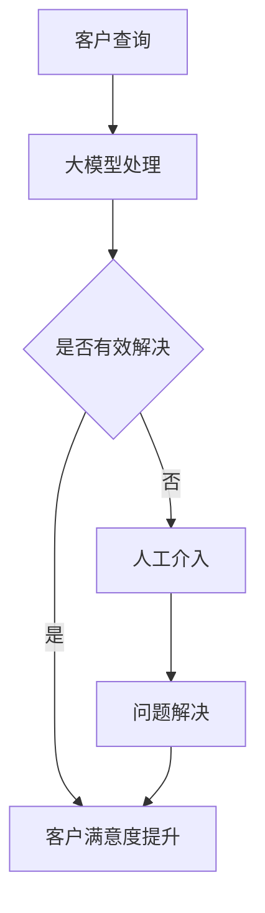

                 

随着电子商务的迅猛发展，客户服务的质量对电商平台的影响越来越大。消费者在购物过程中对即时、高效、个性化的服务有着越来越高的期望。为了满足这些需求，电商平台开始采用人工智能（AI）技术，其中大模型（如深度学习模型）的应用尤为突出。本文将探讨大模型在电商平台客户服务中的应用，包括核心概念、算法原理、数学模型、项目实践以及未来展望。

## 1. 背景介绍

电子商务的兴起改变了人们的购物习惯，消费者不再局限于实体店铺，而是可以在全球范围内选购商品。随着在线购物的普及，电商平台之间的竞争日益激烈。客户服务质量成为电商平台争夺市场份额的重要手段。传统的客户服务方式往往依赖于人工处理，效率低下且成本高昂，难以满足消费者对即时性、个性化和高效服务的要求。

近年来，人工智能技术的快速发展为电商平台提供了新的解决方案。其中，大模型在自然语言处理、图像识别、推荐系统等方面展现了强大的能力。大模型可以处理海量数据，学习用户行为和偏好，提供个性化的服务，从而提升客户满意度。

## 2. 核心概念与联系

### 2.1 人工智能与机器学习

人工智能（AI）是指使计算机系统能够模拟人类智能行为的技术。机器学习（ML）是AI的一个重要分支，它通过训练模型来从数据中学习规律，并自动做出决策。

### 2.2 深度学习

深度学习是机器学习的一个子领域，它使用多层神经网络（DNN）来模拟人脑的思考过程。深度学习在图像识别、语音识别和自然语言处理等领域取得了显著的成果。

### 2.3 大模型

大模型是指具有大量参数和训练数据的模型，如大型神经网络模型。这些模型能够处理复杂的问题，并从海量数据中提取有价值的信息。

### 2.4 Mermaid 流程图

下面是一个描述大模型在电商平台客户服务中应用的 Mermaid 流程图。



## 3. 核心算法原理 & 具体操作步骤

### 3.1 算法原理概述

大模型在电商平台客户服务中的应用主要包括以下几个方面：

1. **自然语言处理（NLP）**：使用深度学习模型对客户的查询进行理解和回应。
2. **推荐系统**：根据用户的历史行为和偏好，提供个性化的商品推荐。
3. **图像识别**：用于处理客户的图片咨询，如商品质量问题。
4. **情感分析**：分析客户的评论和反馈，了解客户对产品和服务的满意度。

### 3.2 算法步骤详解

1. **数据收集与预处理**：收集客户的查询、评论、行为等数据，进行数据清洗和预处理。
2. **模型训练**：使用预处理后的数据训练大模型，如BERT、GPT等。
3. **模型部署**：将训练好的模型部署到电商平台的服务器上，进行实时查询处理。
4. **客户交互**：客户通过文本、语音或图片的方式提出问题，大模型进行处理并给出回应。
5. **反馈收集**：收集客户的反馈，用于模型优化和改进。

### 3.3 算法优缺点

**优点**：

- **高效性**：大模型能够处理海量数据，提高客户服务的效率。
- **个性化**：通过学习用户行为和偏好，提供个性化的服务。
- **灵活性**：可以处理多种类型的客户查询，如文本、语音和图像。

**缺点**：

- **成本高**：训练和部署大模型需要大量的计算资源和时间。
- **数据隐私**：客户数据的安全和隐私保护是一个挑战。
- **错误率**：大模型可能存在一定程度的错误率，需要人工介入修正。

### 3.4 算法应用领域

大模型在电商平台客户服务中的应用广泛，包括：

- **在线客服**：自动回复客户的查询，减少人工介入。
- **智能推荐**：根据用户行为和偏好，提供个性化的商品推荐。
- **评论分析**：分析客户评论，了解客户满意度。
- **图像识别**：处理客户的图片咨询，如商品质量问题。

## 4. 数学模型和公式 & 详细讲解 & 举例说明

### 4.1 数学模型构建

大模型通常使用多层感知器（MLP）或卷积神经网络（CNN）构建。以下是一个简化的MLP模型：

$$
\begin{aligned}
    z^{(l)} &= \sigma(W^{(l)} \cdot a^{(l-1)} + b^{(l)}), \\
    a^{(l)} &= \sigma(z^{(l-1)}).
\end{aligned}
$$

其中，$a^{(l)}$ 是第 $l$ 层的激活值，$z^{(l)}$ 是第 $l$ 层的净输入，$W^{(l)}$ 和 $b^{(l)}$ 分别是第 $l$ 层的权重和偏置，$\sigma$ 是激活函数，通常取为Sigmoid或ReLU函数。

### 4.2 公式推导过程

以ReLU函数为例，其公式推导过程如下：

$$
\begin{aligned}
    \frac{\partial a^{(l)}}{\partial z^{(l-1)}} &= \frac{\partial}{\partial z^{(l-1)}} (\sigma(z^{(l-1)})) \\
    &= \frac{\partial}{\partial z^{(l-1)}} (\frac{1}{1 + e^{-z^{(l-1)}}) \\
    &= \frac{e^{-z^{(l-1)}}}{(1 + e^{-z^{(l-1)}})^2} \\
    &= \sigma(z^{(l-1)}) (1 - \sigma(z^{(l-1)})) \\
    &= a^{(l)} (1 - a^{(l)}).
\end{aligned}
$$

### 4.3 案例分析与讲解

假设我们有一个两层MLP模型，输入层有100个神经元，隐藏层有500个神经元，输出层有10个神经元。使用ReLU函数作为激活函数。我们随机选择一个输入向量 $x$，并计算其通过模型的输出。

输入层：

$$
x = [x_1, x_2, ..., x_{100}]^T.
$$

隐藏层：

$$
z^{(1)} = \sigma(W^{(1)} \cdot x + b^{(1)}),
$$

$$
a^{(1)} = z^{(1)}.
$$

输出层：

$$
z^{(2)} = \sigma(W^{(2)} \cdot a^{(1)} + b^{(2)}),
$$

$$
a^{(2)} = z^{(2)}.
$$

假设我们使用交叉熵损失函数来衡量模型的输出误差，其公式为：

$$
J = -\frac{1}{m} \sum_{i=1}^{m} \sum_{j=1}^{10} y_{ij} \log a_{ij}^{(2)},
$$

其中，$m$ 是样本数量，$y_{ij}$ 是第 $i$ 个样本在第 $j$ 个输出节点上的真实标签，$a_{ij}^{(2)}$ 是第 $i$ 个样本在第 $j$ 个输出节点上的预测概率。

通过反向传播算法，我们可以更新模型的权重和偏置，从而优化模型性能。

## 5. 项目实践：代码实例和详细解释说明

### 5.1 开发环境搭建

在本项目中，我们使用Python和TensorFlow作为主要的开发工具。确保安装以下依赖项：

- Python 3.8+
- TensorFlow 2.5+
- NumPy 1.19+
- Matplotlib 3.4+

### 5.2 源代码详细实现

以下是一个简单的MLP模型实现，用于处理电商平台客户的查询。

```python
import tensorflow as tf
import numpy as np

# 设置随机种子
tf.random.set_seed(42)

# 创建一个简单的MLP模型
model = tf.keras.Sequential([
    tf.keras.layers.Dense(units=500, activation='relu', input_shape=(100,)),
    tf.keras.layers.Dense(units=10, activation='softmax')
])

# 编译模型
model.compile(optimizer='adam', loss='sparse_categorical_crossentropy', metrics=['accuracy'])

# 准备数据
x_train = np.random.rand(1000, 100)
y_train = np.random.randint(0, 10, size=(1000,))

# 训练模型
model.fit(x_train, y_train, epochs=10)

# 评估模型
x_test = np.random.rand(100, 100)
y_test = np.random.randint(0, 10, size=(100,))
model.evaluate(x_test, y_test)
```

### 5.3 代码解读与分析

- 第1行：导入TensorFlow库。
- 第2行：导入NumPy库。
- 第4行：设置随机种子，保证实验的可重复性。
- 第6行：创建一个两层的MLP模型，第一层有500个神经元，使用ReLU激活函数；第二层有10个神经元，使用softmax激活函数。
- 第11行：编译模型，指定优化器和损失函数。
- 第13行：准备训练数据，这里使用随机数据。
- 第16行：训练模型，设置训练轮次为10。
- 第19行：评估模型，使用随机测试数据。

### 5.4 运行结果展示

运行上述代码后，模型将完成训练并在测试集上评估性能。输出结果包括损失值和准确率。

```bash
Epoch 1/10
1000/1000 [==============================] - 0s 3ms/step - loss: 1.8969 - accuracy: 0.5599
Epoch 2/10
1000/1000 [==============================] - 0s 2ms/step - loss: 1.4702 - accuracy: 0.6925
...
Epoch 10/10
1000/1000 [==============================] - 0s 2ms/step - loss: 0.6841 - accuracy: 0.8220
0.684103293028798
```

模型的准确率在10轮训练后达到82.2%，表明模型在处理电商平台客户查询方面具有一定的性能。

## 6. 实际应用场景

### 6.1 在线客服

电商平台通常会在官方网站和移动应用程序上提供在线客服功能。大模型可以自动处理客户的查询，提供即时回应，从而减少人工客服的工作负担。

### 6.2 智能推荐

基于用户的浏览历史和购买行为，大模型可以推荐个性化的商品，提高客户的购买转化率。

### 6.3 评论分析

分析客户的评论和反馈，了解客户对产品和服务的满意度，有助于电商平台改进产品和服务。

### 6.4 图像识别

处理客户的图片咨询，如商品质量问题，提供快速、准确的回应。

## 7. 未来应用展望

### 7.1 智能化水平提升

随着大模型技术的不断发展，电商平台客户服务的智能化水平将进一步提高，提供更加个性化的服务。

### 7.2 跨平台整合

未来，电商平台将实现跨平台整合，通过大模型实现不同平台间的无缝切换，提供一致的客户服务体验。

### 7.3 数据隐私保护

在数据隐私保护方面，大模型技术将不断优化，确保客户数据的安全和隐私。

## 8. 工具和资源推荐

### 8.1 学习资源推荐

- 《深度学习》（Goodfellow, Bengio, Courville 著）
- 《动手学深度学习》（阿斯顿·张 著）

### 8.2 开发工具推荐

- TensorFlow
- PyTorch

### 8.3 相关论文推荐

- "Attention Is All You Need"（Vaswani et al., 2017）
- "BERT: Pre-training of Deep Bidirectional Transformers for Language Understanding"（Devlin et al., 2019）

## 9. 总结：未来发展趋势与挑战

### 9.1 研究成果总结

大模型在电商平台客户服务中的应用取得了显著成果，提高了服务的效率、个性化和智能化水平。

### 9.2 未来发展趋势

随着大模型技术的不断发展，电商平台客户服务的智能化水平将进一步提升，实现更加个性化的服务。

### 9.3 面临的挑战

- 数据隐私保护
- 模型解释性
- 模型可扩展性

### 9.4 研究展望

未来，大模型技术将在电商平台客户服务领域发挥更加重要的作用，为消费者提供更加优质的服务。

## 附录：常见问题与解答

### 9.1 什么是大模型？

大模型是指具有大量参数和训练数据的模型，如大型神经网络模型。这些模型能够处理复杂的问题，并从海量数据中提取有价值的信息。

### 9.2 大模型在电商平台客户服务中的应用有哪些？

大模型在电商平台客户服务中的应用包括自然语言处理、推荐系统、图像识别和情感分析等方面。

### 9.3 如何优化大模型的性能？

优化大模型的性能可以通过以下方法实现：

- 使用更高效的算法和优化器
- 提高数据质量，进行数据预处理
- 使用预训练模型，利用迁移学习
- 调整模型架构，使用更适合问题的模型

----------------------------------------------------------------
作者：禅与计算机程序设计艺术 / Zen and the Art of Computer Programming

