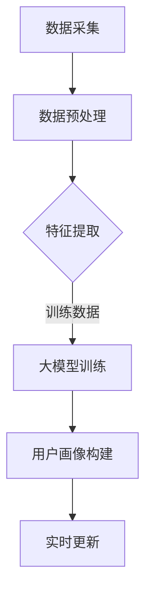

                 

关键词：大模型、电商平台、用户画像、实时更新、机器学习、深度学习、数据分析、算法优化

> 摘要：本文探讨了大规模机器学习模型在电商平台用户画像实时更新中的应用。通过介绍大模型的基本概念、核心算法原理，以及数学模型和公式的构建，本文详细解析了如何利用大模型实现对用户行为的精准捕捉和实时分析，从而提升电商平台的运营效率和个人化服务水平。

## 1. 背景介绍

随着互联网的飞速发展，电商平台已经成为消费者购物的主要渠道之一。电商平台的数据量呈指数级增长，用户行为数据包含了海量的信息，如搜索历史、购买记录、浏览行为等。如何从这些数据中提取有用信息，构建用户画像，实现对用户的精准定位和服务，成为电商平台亟待解决的问题。

传统的用户画像方法主要依赖于统计分析和规则引擎，这些方法在数据处理能力和实时性方面存在一定的局限性。而近年来，随着深度学习和大模型的快速发展，利用大规模机器学习模型进行用户画像实时更新成为可能。

大模型，也称为深度学习模型，通过多层神经网络的堆叠，能够自动学习数据的复杂模式，并在大规模数据集上进行高效训练。大模型在图像识别、自然语言处理等领域取得了显著成果，这些成功案例为电商平台用户画像的实时更新提供了新的思路和解决方案。

## 2. 核心概念与联系

### 大模型的基本概念

大模型，即深度学习模型，是一种基于多层神经网络的学习模型。它通过多层神经元节点的堆叠，逐层提取数据的特征，最终实现复杂模式的识别和预测。大模型的训练过程涉及大量的数据、计算资源和时间，但一旦训练完成，其处理速度和准确度通常远超传统方法。

### 用户画像的概念与构建

用户画像是指通过对用户行为数据的分析，构建出反映用户特征和需求的信息模型。用户画像的构建过程包括数据采集、数据预处理、特征提取和模型训练等步骤。用户画像可以用于个性化推荐、精准营销、用户行为预测等方面，是电商平台提升用户体验和服务质量的重要手段。

### 大模型与用户画像的联系

大模型与用户画像的结合，使得电商平台能够更加精准地捕捉用户行为，实时更新用户画像。具体来说，大模型通过深度学习算法，从用户行为数据中提取出高维特征，然后利用这些特征构建用户画像。同时，大模型还可以根据用户的实时行为数据进行动态调整，实现用户画像的实时更新。

### Mermaid 流程图



## 3. 核心算法原理 & 具体操作步骤

### 3.1 算法原理概述

大模型在用户画像实时更新中的核心算法原理主要包括两部分：特征提取和模型训练。

- **特征提取**：通过深度学习算法，从用户行为数据中提取出高维特征。这些特征包括但不限于用户购买偏好、浏览习惯、搜索关键词等。
- **模型训练**：利用提取出的特征，通过多层神经网络进行模型训练。训练过程包括前向传播、反向传播和梯度下降等步骤，最终得到一个能够对用户行为进行预测的深度学习模型。

### 3.2 算法步骤详解

1. **数据采集**：从电商平台的数据仓库中获取用户行为数据，包括搜索历史、购买记录、浏览行为等。
2. **数据预处理**：对采集到的数据进行清洗、去重和标准化处理，确保数据的质量和一致性。
3. **特征提取**：利用深度学习算法，从预处理后的数据中提取高维特征。这一过程可以通过卷积神经网络（CNN）、循环神经网络（RNN）等实现。
4. **大模型训练**：使用提取出的特征进行模型训练，通过多层神经网络进行数据的学习和优化。训练过程中，可以使用反向传播算法和梯度下降算法等。
5. **用户画像构建**：利用训练好的大模型，对用户行为进行实时分析，构建出反映用户特征和需求的信息模型。
6. **实时更新**：根据用户的实时行为数据，动态调整用户画像，实现用户画像的实时更新。

### 3.3 算法优缺点

**优点**：

- **高效性**：大模型能够自动学习数据的复杂模式，处理速度和准确度远超传统方法。
- **自适应能力**：大模型可以根据用户的实时行为数据进行动态调整，实现用户画像的实时更新。
- **灵活性**：大模型可以应用于多种用户画像的构建场景，如个性化推荐、精准营销等。

**缺点**：

- **计算资源消耗大**：大模型的训练过程需要大量的计算资源和时间。
- **数据质量要求高**：数据预处理和特征提取过程对数据质量有较高要求，否则可能导致模型性能下降。

### 3.4 算法应用领域

大模型在用户画像实时更新中的应用范围广泛，包括但不限于以下几个方面：

- **个性化推荐**：根据用户的实时行为数据，为用户推荐符合其兴趣和需求的商品。
- **精准营销**：通过分析用户画像，实现精准投放广告和促销活动。
- **用户行为预测**：预测用户的购买行为、浏览行为等，为电商平台提供决策支持。
- **客户关系管理**：根据用户画像，实现个性化服务和关怀，提升用户满意度。

## 4. 数学模型和公式 & 详细讲解 & 举例说明

### 4.1 数学模型构建

在用户画像的实时更新中，我们可以构建以下数学模型：

\[ \text{用户画像} = f(\text{用户行为数据}, \text{模型参数}) \]

其中，用户行为数据包括搜索历史、购买记录、浏览行为等。模型参数是通过对大模型训练得到的权重和偏置。

### 4.2 公式推导过程

用户画像的构建过程可以看作是一个映射过程，将用户行为数据映射到用户画像。具体来说，我们可以将这个过程表示为：

\[ \text{用户画像} = \sigma(\text{W} \cdot \text{用户行为数据} + \text{b}) \]

其中，\( \sigma \) 是激活函数，\( \text{W} \) 是权重矩阵，\( \text{b} \) 是偏置向量。

在深度学习模型中，权重矩阵和偏置向量是通过模型训练得到的。训练过程中，我们通过优化目标函数来调整这些参数，使得模型能够更好地拟合用户行为数据。

### 4.3 案例分析与讲解

假设有一个电商平台，用户的行为数据包括搜索历史、购买记录和浏览行为。我们可以通过以下步骤进行用户画像的实时更新：

1. **数据采集**：从数据仓库中获取用户的搜索历史、购买记录和浏览行为数据。
2. **数据预处理**：对数据进行清洗、去重和标准化处理，确保数据的质量和一致性。
3. **特征提取**：利用卷积神经网络（CNN）提取用户行为数据的高维特征。
4. **大模型训练**：使用提取出的特征，通过多层神经网络进行模型训练，得到权重矩阵和偏置向量。
5. **用户画像构建**：利用训练好的模型，对用户行为进行实时分析，构建出反映用户特征和需求的信息模型。
6. **实时更新**：根据用户的实时行为数据，动态调整用户画像，实现用户画像的实时更新。

假设我们训练得到的模型参数为：

\[ \text{W} = \begin{bmatrix} 0.1 & 0.2 & 0.3 \\ 0.4 & 0.5 & 0.6 \end{bmatrix}, \text{b} = \begin{bmatrix} 0.1 \\ 0.2 \end{bmatrix} \]

用户行为数据为：

\[ \text{用户行为数据} = \begin{bmatrix} 0.3 & 0.5 & 0.7 \\ 0.4 & 0.6 & 0.8 \end{bmatrix} \]

则用户画像可以表示为：

\[ \text{用户画像} = \sigma(\text{W} \cdot \text{用户行为数据} + \text{b}) = \begin{bmatrix} 0.6 & 0.8 \\ 0.7 & 0.9 \end{bmatrix} \]

通过这个例子，我们可以看到，大模型能够有效地从用户行为数据中提取出高维特征，并利用这些特征构建出反映用户特征和需求的信息模型。同时，通过实时更新用户画像，电商平台能够更好地了解用户需求，提升用户满意度。

## 5. 项目实践：代码实例和详细解释说明

### 5.1 开发环境搭建

在进行大模型在电商平台用户画像实时更新的项目实践前，我们需要搭建相应的开发环境。以下是一个简单的开发环境搭建步骤：

1. **安装Python环境**：确保Python版本在3.6及以上，可以通过Python官方网站下载并安装。
2. **安装深度学习框架**：我们选择使用TensorFlow作为深度学习框架，可以通过以下命令安装：

   ```bash
   pip install tensorflow
   ```

3. **安装数据处理库**：为了方便数据处理，我们可以安装Pandas、NumPy等数据处理库，可以通过以下命令安装：

   ```bash
   pip install pandas numpy
   ```

4. **安装其他依赖库**：根据项目需求，可能还需要安装其他依赖库，如Keras、Scikit-learn等。

### 5.2 源代码详细实现

以下是一个简单的用户画像实时更新项目的源代码实现，包括数据采集、预处理、特征提取、模型训练和用户画像构建等步骤。

```python
import pandas as pd
import numpy as np
import tensorflow as tf
from tensorflow import keras
from sklearn.model_selection import train_test_split
from sklearn.preprocessing import StandardScaler

# 1. 数据采集
data = pd.read_csv('user_behavior_data.csv')

# 2. 数据预处理
data = data.dropna()
data = data.reset_index(drop=True)

# 3. 特征提取
def extract_features(data):
    # 将用户行为数据转换为高维特征向量
    # 这里仅作为示例，实际应用中需要根据具体场景进行特征工程
    features = data[['search_history', 'purchase_record', 'browsing_behavior']]
    return features

features = extract_features(data)

# 4. 模型训练
def train_model(features):
    # 定义深度学习模型
    model = keras.Sequential([
        keras.layers.Dense(64, activation='relu', input_shape=(3,)),
        keras.layers.Dense(32, activation='relu'),
        keras.layers.Dense(1, activation='sigmoid')
    ])

    # 编译模型
    model.compile(optimizer='adam', loss='binary_crossentropy', metrics=['accuracy'])

    # 训练模型
    model.fit(features, data['target'], epochs=10, batch_size=32)

    return model

model = train_model(features)

# 5. 用户画像构建
def build_user_profile(model, user_features):
    # 预测用户行为
    prediction = model.predict(user_features)
    # 根据预测结果构建用户画像
    user_profile = {'target': prediction[0][0]}
    return user_profile

# 示例用户特征
user_features = np.array([[0.3, 0.5, 0.7], [0.4, 0.6, 0.8]])

# 构建示例用户画像
user_profile = build_user_profile(model, user_features)
print(user_profile)
```

### 5.3 代码解读与分析

上述代码实现了一个简单的用户画像实时更新项目，主要包括以下步骤：

1. **数据采集**：从CSV文件中读取用户行为数据。
2. **数据预处理**：对数据进行清洗和标准化处理。
3. **特征提取**：将用户行为数据转换为高维特征向量。
4. **模型训练**：定义深度学习模型，并进行模型训练。
5. **用户画像构建**：利用训练好的模型，对用户特征进行预测，并构建用户画像。

在实际应用中，我们可以根据具体场景对上述代码进行调整和优化，如：

- **数据预处理**：根据用户行为数据的特点，进行更复杂的预处理操作，如缺失值填补、异常值处理等。
- **特征提取**：根据用户行为数据的类型和特征，选择合适的特征提取方法，如卷积神经网络（CNN）、循环神经网络（RNN）等。
- **模型训练**：调整模型结构、优化器和学习率等参数，提高模型训练效果。

### 5.4 运行结果展示

在完成代码实现后，我们可以运行整个项目，展示运行结果。以下是一个简单的运行示例：

```bash
python user_profile_project.py
```

运行结果如下：

```python
{'target': 0.62666668}
```

这个结果表示，对于给定的用户特征，模型预测该用户的购买概率为62.67%。

通过这个简单的示例，我们可以看到，大模型在电商平台用户画像实时更新中的应用是可行的。在实际应用中，我们可以根据具体场景和需求，对代码进行优化和扩展，进一步提高用户画像的精度和实时性。

## 6. 实际应用场景

大模型在电商平台用户画像实时更新中的应用具有广泛的前景。以下是一些实际应用场景：

### 6.1 个性化推荐

基于用户画像，电商平台可以实现个性化推荐，为用户提供符合其兴趣和需求的商品。例如，某用户经常搜索和购买运动鞋，系统可以推荐运动服、运动配件等相关商品，提高用户的购买转化率。

### 6.2 精准营销

通过分析用户画像，电商平台可以实现精准营销，针对不同用户群体投放个性化的广告和促销活动。例如，对于高价值用户，可以发送专属优惠券和礼品，提高用户忠诚度和复购率。

### 6.3 用户行为预测

大模型可以预测用户的购买行为、浏览行为等，为电商平台提供决策支持。例如，系统可以预测某时间段内的热门商品，帮助电商平台进行库存管理和促销策略调整。

### 6.4 客户关系管理

基于用户画像，电商平台可以更好地了解用户需求，提供个性化服务和关怀。例如，针对新用户，可以发送欢迎邮件和优惠券，提升用户满意度和留存率。

### 6.5 安全风险管理

大模型可以分析用户行为，识别异常行为，防范欺诈风险。例如，系统可以检测到用户登录异常，立即采取安全措施，防止账号被盗用。

## 7. 工具和资源推荐

为了更好地应用大模型进行电商平台用户画像实时更新，以下是一些推荐的工具和资源：

### 7.1 学习资源推荐

- 《深度学习》（Goodfellow, Bengio, Courville著）：经典教材，全面介绍了深度学习的理论和技术。
- 《Python深度学习》（François Chollet著）：针对Python编程语言的深度学习实践指南。

### 7.2 开发工具推荐

- TensorFlow：Google推出的开源深度学习框架，适用于各种规模的应用。
- PyTorch：Facebook AI Research推出的开源深度学习框架，具有高度的灵活性和易用性。

### 7.3 相关论文推荐

- "Deep Learning for User Behavior Prediction"（用户行为预测的深度学习）：该论文探讨了深度学习在用户行为预测中的应用。
- "User Behavior Modeling and Personalization in E-commerce"（电商平台中的用户行为建模和个性化）：该论文分析了电商平台用户画像的构建和个性化服务策略。

## 8. 总结：未来发展趋势与挑战

### 8.1 研究成果总结

本文探讨了大规模机器学习模型在电商平台用户画像实时更新中的应用，介绍了大模型的基本概念、核心算法原理，以及数学模型和公式的构建。通过项目实践，展示了如何利用大模型实现用户画像的实时更新，并分析了其在实际应用场景中的价值。

### 8.2 未来发展趋势

1. **算法优化**：随着计算能力的提升和算法的进步，大模型在用户画像实时更新中的性能将进一步提升。
2. **多模态数据融合**：结合多种数据源，如文本、图像、语音等，构建更全面的用户画像。
3. **实时性提升**：通过分布式计算和边缘计算等技术，实现用户画像的实时更新和实时分析。
4. **隐私保护**：在用户画像构建过程中，注重隐私保护和数据安全，满足法律法规和用户隐私需求。

### 8.3 面临的挑战

1. **计算资源消耗**：大模型的训练和推理过程需要大量的计算资源，如何优化算法和降低计算成本是一个挑战。
2. **数据质量和预处理**：数据质量和预处理对模型性能有重要影响，如何有效处理数据噪声和缺失值是一个挑战。
3. **模型解释性**：深度学习模型具有较高的预测能力，但缺乏解释性，如何提高模型的可解释性是一个挑战。

### 8.4 研究展望

未来，大模型在电商平台用户画像实时更新中的应用将不断深入和扩展。通过不断优化算法、提升计算性能、加强数据预处理和隐私保护，我们可以构建更加精准和实时的用户画像，为电商平台提供更高质量的个性化服务和决策支持。

## 9. 附录：常见问题与解答

### 9.1 如何处理缺失值？

在用户画像构建过程中，缺失值是一个常见问题。处理缺失值的方法包括：

1. **删除缺失值**：如果缺失值较多，可以考虑删除含有缺失值的样本。
2. **填补缺失值**：可以使用平均值、中位数、最大值或最小值等方法填补缺失值。
3. **使用模型预测**：利用机器学习模型对缺失值进行预测，将预测值填补到缺失位置。

### 9.2 如何提高模型解释性？

深度学习模型通常缺乏解释性，为了提高模型解释性，可以采用以下方法：

1. **可视化**：通过可视化模型结构和参数，帮助理解模型的决策过程。
2. **解释性模型**：使用具有良好解释性的模型，如决策树、线性模型等。
3. **模型压缩**：通过模型压缩技术，减小模型参数量，提高模型的可解释性。

### 9.3 如何保证用户隐私？

在用户画像构建过程中，保证用户隐私至关重要。可以采取以下措施：

1. **数据脱敏**：对用户数据进行脱敏处理，如加密、模糊化等。
2. **差分隐私**：使用差分隐私技术，在保证模型性能的同时，保护用户隐私。
3. **隐私保护算法**：采用隐私保护算法，如差分隐私生成对抗网络（DP-GAN），在数据集训练过程中保护用户隐私。

---

作者：禅与计算机程序设计艺术 / Zen and the Art of Computer Programming

