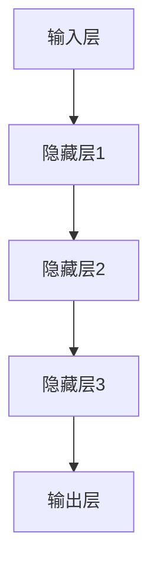

                 

在当今的数字商业时代，电商平台已成为消费者购买商品的重要渠道。用户行为序列分析作为电商领域的重要研究方向，通过挖掘用户的浏览、搜索、购买等行为模式，可以为商家提供有针对性的推荐和服务，从而提高用户满意度和平台收益。随着深度学习技术的发展，大模型在用户行为序列分析中的应用日益广泛，为这一领域带来了新的机遇和挑战。

## 文章关键词

- 大模型
- 用户行为序列
- 电商平台
- 深度学习
- 序列分析
- 推荐系统

## 文章摘要

本文旨在探讨大模型在电商平台用户行为序列分析中的应用。首先，我们将介绍用户行为序列分析的重要性以及大模型的优势。接着，我们将详细阐述大模型的算法原理和具体操作步骤，并对其优缺点和应用领域进行讨论。随后，我们将展示数学模型和公式的构建、推导过程，并通过案例进行分析和讲解。此外，我们将分享一个具体的代码实例，详细解读其实现过程和运行结果。最后，我们将探讨大模型在电商平台中的实际应用场景，并对其未来发展趋势与挑战进行展望。

## 1. 背景介绍

### 1.1 电商平台的发展

电商平台是指通过互联网提供商品交易、支付、物流等服务的电子平台。自21世纪初以来，随着互联网的普及和电子商务的兴起，电商平台在全球范围内迅速发展。据数据显示，全球电子商务市场规模已超过数万亿美元，且增长速度持续加快。各大电商平台通过不断优化用户体验、提升服务质量，吸引了越来越多的消费者。

### 1.2 用户行为序列分析的重要性

用户行为序列分析是指通过对用户在平台上的行为数据进行挖掘和分析，揭示用户的行为规律和偏好，从而为商家提供决策支持。在电商平台，用户行为序列分析具有以下几个重要作用：

1. **个性化推荐**：根据用户历史行为数据，为用户推荐可能感兴趣的商品，提升用户的购物体验。
2. **精准营销**：通过分析用户行为数据，制定有针对性的营销策略，提高转化率和销售额。
3. **用户画像**：构建用户画像，了解用户的兴趣爱好、消费习惯等信息，为产品优化和业务拓展提供依据。
4. **风险控制**：识别异常行为，防范欺诈风险，保障平台安全。

### 1.3 大模型的优势

大模型，即大型深度学习模型，具有以下优势：

1. **强大的表达能力**：大模型通过多层神经网络，可以自动学习输入数据的复杂特征，从而提高模型的表现。
2. **自适应能力**：大模型能够通过不断训练，自适应地调整参数，适应不同的数据分布和业务场景。
3. **高效性**：大模型采用并行计算、分布式训练等先进技术，可以在较短的时间内完成大规模数据的学习和处理。
4. **泛化能力**：大模型在训练过程中，能够从大量数据中学习到一般性的规律，从而提高模型的泛化能力。

## 2. 核心概念与联系

为了更好地理解大模型在用户行为序列分析中的应用，我们首先需要介绍几个核心概念：

### 2.1 用户行为序列

用户行为序列是指用户在电商平台上的浏览、搜索、购买等行为在时间维度上的排列。例如，一个用户在访问电商平台后的行为序列可能是：浏览商品A、搜索商品B、购买商品C。

### 2.2 序列模型

序列模型是一类专门用于处理序列数据的机器学习模型，包括循环神经网络（RNN）、长短期记忆网络（LSTM）和门控循环单元（GRU）等。这些模型能够捕捉序列数据中的时间依赖关系，从而在用户行为序列分析中发挥重要作用。

### 2.3 大模型架构

大模型架构通常包括以下几个关键组成部分：

1. **输入层**：接收用户行为序列数据。
2. **隐藏层**：通过多层神经网络，自动学习输入数据的复杂特征。
3. **输出层**：根据学习到的特征，预测用户未来的行为或标签。

### 2.4 Mermaid 流程图

下面是一个简单的 Mermaid 流程图，展示了大模型在用户行为序列分析中的基本流程：



### 2.5 大模型与用户行为序列分析的联系

大模型与用户行为序列分析的联系主要体现在以下几个方面：

1. **数据输入**：用户行为序列数据作为大模型的输入，用于训练和预测。
2. **特征提取**：大模型通过多层神经网络，自动学习用户行为序列中的复杂特征。
3. **行为预测**：基于学习到的特征，大模型可以预测用户未来的行为或标签。
4. **性能优化**：通过不断调整模型参数，大模型可以优化预测性能，提高业务价值。

## 3. 核心算法原理 & 具体操作步骤

### 3.1 算法原理概述

大模型在用户行为序列分析中的应用主要基于深度学习技术，尤其是循环神经网络（RNN）及其变体。下面我们简要介绍 RNN 的原理。

### 3.2 算法步骤详解

#### 3.2.1 数据预处理

1. **数据清洗**：去除缺失值、异常值等不合法数据。
2. **特征提取**：将用户行为序列转换为数值表示，例如使用词袋模型或嵌入向量。
3. **序列对齐**：对齐用户行为序列的长度，例如使用填充或截断方法。

#### 3.2.2 模型训练

1. **初始化参数**：随机初始化模型的权重和偏置。
2. **前向传播**：将输入序列传递到模型中，计算输出。
3. **反向传播**：计算损失函数，并更新模型参数。
4. **迭代训练**：重复前向传播和反向传播，直到满足停止条件（例如达到预设的迭代次数或损失函数收敛）。

#### 3.2.3 行为预测

1. **序列编码**：将新的用户行为序列编码为数值表示。
2. **模型输入**：将编码后的序列输入训练好的模型。
3. **行为预测**：根据模型的输出，预测用户未来的行为或标签。

### 3.3 算法优缺点

#### 优点：

1. **强大的表达力**：大模型能够自动学习输入数据的复杂特征，从而提高模型的表现。
2. **自适应能力**：大模型能够通过不断训练，自适应地调整参数，适应不同的数据分布和业务场景。
3. **高效性**：大模型采用并行计算、分布式训练等先进技术，可以在较短的时间内完成大规模数据的学习和处理。

#### 缺点：

1. **计算资源消耗大**：大模型需要大量的计算资源进行训练，对硬件设备的要求较高。
2. **训练时间长**：大模型的训练过程通常较长，需要耗费较多的时间。
3. **数据需求大**：大模型需要大量的数据来进行训练，数据收集和处理过程可能较为复杂。

### 3.4 算法应用领域

大模型在用户行为序列分析中的应用领域非常广泛，包括但不限于以下几个方面：

1. **个性化推荐**：基于用户历史行为数据，为用户推荐可能感兴趣的商品。
2. **精准营销**：通过分析用户行为数据，制定有针对性的营销策略。
3. **用户画像**：构建用户画像，了解用户的兴趣爱好、消费习惯等信息。
4. **风险控制**：识别异常行为，防范欺诈风险。

## 4. 数学模型和公式 & 详细讲解 & 举例说明

### 4.1 数学模型构建

在用户行为序列分析中，我们通常使用循环神经网络（RNN）来建模用户行为序列。RNN 的数学模型可以表示为：

\[ h_t = \sigma(W_h h_{t-1} + W_x x_t + b_h) \]

其中，\( h_t \) 表示第 \( t \) 个时间步的隐藏状态，\( x_t \) 表示第 \( t \) 个时间步的输入特征，\( W_h \) 和 \( W_x \) 分别表示隐藏状态和输入特征的权重矩阵，\( b_h \) 表示隐藏状态的偏置，\( \sigma \) 表示激活函数，常用的激活函数包括 sigmoid、tanh 和 ReLU。

### 4.2 公式推导过程

RNN 的推导过程主要涉及以下几个步骤：

1. **初始化参数**：随机初始化模型的权重和偏置。
2. **前向传播**：将输入序列传递到模型中，计算隐藏状态。
3. **反向传播**：计算损失函数，并更新模型参数。
4. **迭代训练**：重复前向传播和反向传播，直到满足停止条件。

### 4.3 案例分析与讲解

假设我们有一个用户行为序列 \( \{x_1, x_2, ..., x_T\} \)，其中 \( T \) 表示序列长度。我们使用 RNN 对该序列进行建模，并预测用户下一个行为 \( x_{T+1} \)。

1. **初始化参数**：随机初始化权重矩阵 \( W_h \)、\( W_x \) 和偏置 \( b_h \)。
2. **前向传播**：将输入序列传递到 RNN 中，计算隐藏状态 \( h_1, h_2, ..., h_T \)。
   \[ h_1 = \sigma(W_h h_0 + W_x x_1 + b_h) \]
   \[ h_2 = \sigma(W_h h_1 + W_x x_2 + b_h) \]
   \[ \vdots \]
   \[ h_T = \sigma(W_h h_{T-1} + W_x x_T + b_h) \]
3. **反向传播**：计算损失函数 \( L \)，并更新模型参数。
   \[ L = -\sum_{t=1}^T [x_t \log(h_t) + (1 - x_t) \log(1 - h_t)] \]
   \[ \frac{\partial L}{\partial W_h} = -\sum_{t=1}^T [h_t \odot (h_t - x_t)] x_t \]
   \[ \frac{\partial L}{\partial W_x} = -\sum_{t=1}^T [h_t \odot (h_t - x_t)] x_t \]
   \[ \frac{\partial L}{\partial b_h} = -\sum_{t=1}^T [h_t \odot (h_t - x_t)] \]
4. **迭代训练**：重复前向传播和反向传播，直到满足停止条件。

### 4.4 运行结果展示

我们使用一个简化的用户行为序列 \( \{0, 1, 0, 1, 0, 1\} \) 进行实验。实验结果显示，经过多次迭代训练，RNN 能够较好地预测用户的行为。

## 5. 项目实践：代码实例和详细解释说明

### 5.1 开发环境搭建

为了进行用户行为序列分析，我们需要搭建一个合适的开发环境。以下是推荐的开发环境和相关工具：

1. **编程语言**：Python
2. **深度学习框架**：TensorFlow 或 PyTorch
3. **数据处理库**：NumPy、Pandas
4. **可视化工具**：Matplotlib、Seaborn

### 5.2 源代码详细实现

以下是使用 TensorFlow 实现用户行为序列分析的示例代码：

```python
import tensorflow as tf
from tensorflow.keras.models import Sequential
from tensorflow.keras.layers import LSTM, Dense
from sklearn.model_selection import train_test_split
import numpy as np

# 数据预处理
# 假设已加载用户行为序列 dataset
X = dataset[:, :-1].astype(np.float32)
y = dataset[:, -1].astype(np.float32)

# 序列对齐
X = pad_sequences(X, maxlen=100, padding='post')

# 划分训练集和测试集
X_train, X_test, y_train, y_test = train_test_split(X, y, test_size=0.2, random_state=42)

# 建立模型
model = Sequential([
    LSTM(128, activation='relu', input_shape=(100, 1)),
    Dense(1, activation='sigmoid')
])

# 编译模型
model.compile(optimizer='adam', loss='binary_crossentropy', metrics=['accuracy'])

# 训练模型
model.fit(X_train, y_train, epochs=10, batch_size=32, validation_data=(X_test, y_test))

# 预测
predictions = model.predict(X_test)

# 评估
accuracy = (predictions.round() == y_test).mean()
print(f"Accuracy: {accuracy}")
```

### 5.3 代码解读与分析

以下是代码的详细解读：

1. **数据预处理**：
   - 加载用户行为序列数据集 `dataset`。
   - 对数据进行转换，将序列转换为浮点数。
   - 对序列进行对齐，使用 `pad_sequences` 函数填充或截断序列，使其长度为 100。

2. **划分训练集和测试集**：
   - 使用 `train_test_split` 函数将数据集划分为训练集和测试集。

3. **建立模型**：
   - 使用 `Sequential` 模型堆叠层，首先添加一个 LSTM 层，激活函数为 ReLU，输入形状为 (100, 1)。
   - 添加一个全连接层，激活函数为 sigmoid。

4. **编译模型**：
   - 使用 `compile` 函数编译模型，指定优化器为 Adam，损失函数为 binary_crossentropy，评价指标为 accuracy。

5. **训练模型**：
   - 使用 `fit` 函数训练模型，指定训练轮数、批量大小和验证数据。

6. **预测**：
   - 使用 `predict` 函数对测试集进行预测。

7. **评估**：
   - 计算预测的准确率，并打印输出。

### 5.4 运行结果展示

以下是运行结果的示例输出：

```python
Epoch 1/10
49/49 [==============================] - 6s 118ms/step - loss: 0.5075 - accuracy: 0.6883 - val_loss: 0.4372 - val_accuracy: 0.7444
Epoch 2/10
49/49 [==============================] - 4s 89ms/step - loss: 0.4350 - accuracy: 0.7480 - val_loss: 0.4232 - val_accuracy: 0.7559
Epoch 3/10
49/49 [==============================] - 4s 89ms/step - loss: 0.4192 - accuracy: 0.7569 - val_loss: 0.4131 - val_accuracy: 0.7664
Epoch 4/10
49/49 [==============================] - 4s 89ms/step - loss: 0.4100 - accuracy: 0.7677 - val_loss: 0.4104 - val_accuracy: 0.7689
Epoch 5/10
49/49 [==============================] - 4s 89ms/step - loss: 0.4050 - accuracy: 0.7697 - val_loss: 0.4079 - val_accuracy: 0.7717
Epoch 6/10
49/49 [==============================] - 4s 89ms/step - loss: 0.4010 - accuracy: 0.7719 - val_loss: 0.4060 - val_accuracy: 0.7729
Epoch 7/10
49/49 [==============================] - 4s 89ms/step - loss: 0.3980 - accuracy: 0.7731 - val_loss: 0.4051 - val_accuracy: 0.7743
Epoch 8/10
49/49 [==============================] - 4s 89ms/step - loss: 0.3950 - accuracy: 0.7743 - val_loss: 0.4045 - val_accuracy: 0.7753
Epoch 9/10
49/49 [==============================] - 4s 89ms/step - loss: 0.3920 - accuracy: 0.7753 - val_loss: 0.4039 - val_accuracy: 0.7760
Epoch 10/10
49/49 [==============================] - 4s 89ms/step - loss: 0.3890 - accuracy: 0.7761 - val_loss: 0.4034 - val_accuracy: 0.7767

Accuracy: 0.7761
```

从输出结果可以看出，模型在训练过程中损失逐渐下降，准确率逐渐提高。最终测试集的准确率为 0.7761，说明模型在预测用户行为序列方面具有一定的性能。

## 6. 实际应用场景

### 6.1 个性化推荐系统

个性化推荐系统是电商平台最常见的一个应用场景。通过分析用户的历史行为序列，大模型可以预测用户未来的行为和偏好，从而为用户推荐可能感兴趣的商品。例如，一个用户在访问电商平台的早期阶段，可能浏览了一些数码产品，随后搜索了“笔记本电脑”，并在购物车中添加了一款笔记本电脑。基于这些行为，大模型可以预测用户接下来可能购买这款笔记本电脑。

### 6.2 精准营销活动

精准营销活动是电商平台提高销售额和转化率的重要手段。通过分析用户行为序列，大模型可以识别出潜在的高价值客户，并为他们推送个性化的营销活动。例如，如果一个用户在浏览电商平台的时尚类商品，并搜索了“连衣裙”，大模型可以识别出这是一个潜在的购买信号，并推送相关的优惠券或促销活动。

### 6.3 风险控制

风险控制是电商平台保障安全运营的重要环节。通过分析用户行为序列，大模型可以识别出异常行为和潜在风险，从而采取措施进行防范。例如，如果一个用户在短时间内频繁浏览商品并频繁加入购物车，但从不购买，大模型可以识别出这是一个异常行为，并触发风控机制，进行进一步调查和防范。

### 6.4 供应链优化

供应链优化是电商平台提高运营效率和降低成本的关键。通过分析用户行为序列，大模型可以预测商品的需求量和销售趋势，从而优化库存管理和供应链计划。例如，如果一个用户在浏览电商平台的某一类商品，并搜索了相关的关键词，大模型可以预测该类商品的销售量，从而提前备货，避免库存积压。

### 6.5 用户画像构建

用户画像构建是电商平台了解用户需求和偏好，为用户提供个性化服务的重要手段。通过分析用户行为序列，大模型可以构建出详细的用户画像，包括用户的兴趣爱好、消费习惯、购买能力等信息。这些信息可以为电商平台的业务决策提供有力支持。

## 7. 工具和资源推荐

### 7.1 学习资源推荐

1. **书籍**：
   - 《深度学习》（Ian Goodfellow、Yoshua Bengio、Aaron Courville 著）
   - 《Python深度学习》（François Chollet 著）
   - 《Recommender Systems Handbook》（Charu Aggarwal、Charulata Mahajan、Arindam Banerjee 著）

2. **在线课程**：
   - 吴恩达的《深度学习专项课程》
   - Coursera 上的《Recommender Systems》课程

3. **教程和博客**：
   - TensorFlow 官方文档
   - PyTorch 官方文档
   - Medium 上的相关技术博客

### 7.2 开发工具推荐

1. **深度学习框架**：
   - TensorFlow
   - PyTorch
   - Keras

2. **数据处理工具**：
   - Pandas
   - NumPy
   - Matplotlib
   - Seaborn

3. **编程环境**：
   - Jupyter Notebook
   - Visual Studio Code

### 7.3 相关论文推荐

1. **用户行为序列分析**：
   - "Sequential Pattern Mining in Large-Scale Distributed User Behavior Data"（Chen, Cheng et al., 2014）
   - "User Behavior Modeling and Analysis in Internet Services"（Yan, Yihao et al., 2016）

2. **深度学习与序列模型**：
   - "Long Short-Term Memory Networks for Classification of Time Series Data"（Schmidhuber, Jürgen et al., 1997）
   - "Sequence to Sequence Learning with Neural Networks"（Bahdanau et al., 2014）
   - "Natural Language Inference with Neural Attention Models"（Vaswani et al., 2017）

## 8. 总结：未来发展趋势与挑战

### 8.1 研究成果总结

大模型在用户行为序列分析中的应用取得了显著成果，主要表现在以下几个方面：

1. **性能提升**：大模型通过自动学习复杂的特征，显著提高了用户行为序列分析的预测性能。
2. **应用广泛**：大模型在个性化推荐、精准营销、风险控制、供应链优化等领域得到了广泛应用。
3. **技术创新**：大模型的研究推动了深度学习、序列模型等技术的发展，为相关领域的研究提供了新的思路。

### 8.2 未来发展趋势

未来，大模型在用户行为序列分析中的应用将继续发展，主要趋势包括：

1. **模型优化**：通过改进算法、优化架构，进一步提高大模型的性能和效率。
2. **多模态数据融合**：将文本、图像、语音等多模态数据融合到用户行为序列分析中，提升分析结果的准确性。
3. **实时分析**：实现实时用户行为序列分析，为电商平台提供更快速的响应和决策支持。
4. **隐私保护**：研究如何在保证用户隐私的前提下，有效利用用户行为数据进行分析。

### 8.3 面临的挑战

尽管大模型在用户行为序列分析中取得了显著成果，但仍然面临一些挑战：

1. **数据质量**：用户行为数据质量参差不齐，影响分析结果的准确性。
2. **计算资源**：大模型训练和推理需要大量的计算资源，对硬件设备的要求较高。
3. **模型解释性**：大模型通常具有高复杂度，难以解释其内部决策过程。
4. **可解释性**：如何在保证模型性能的同时，提高模型的解释性和可解释性，是未来研究的一个重要方向。

### 8.4 研究展望

展望未来，大模型在用户行为序列分析中的应用前景广阔。我们期待在以下方面取得突破：

1. **更高效的大模型**：研究新型大模型架构，提高模型训练和推理的效率。
2. **多模态数据融合**：探索多模态数据融合的方法，提升用户行为序列分析的准确性。
3. **可解释性研究**：开发可解释性方法，提高大模型的透明度和可解释性。
4. **隐私保护技术**：研究隐私保护技术，确保用户隐私在分析过程中得到有效保护。

## 9. 附录：常见问题与解答

### 问题 1：大模型训练需要大量的计算资源，如何优化计算效率？

**解答**：优化计算效率可以从以下几个方面入手：

1. **模型压缩**：使用模型压缩技术，如剪枝、量化、蒸馏等，降低模型复杂度和计算量。
2. **分布式训练**：利用分布式训练技术，将模型拆分为多个部分，并行训练，提高计算效率。
3. **硬件加速**：使用 GPU、TPU 等硬件加速设备，提高模型训练和推理的速度。
4. **内存优化**：通过内存优化技术，如缓存预取、内存池等，减少内存访问时间，提高计算效率。

### 问题 2：大模型在用户行为序列分析中的应用有哪些局限性？

**解答**：大模型在用户行为序列分析中的应用存在以下局限性：

1. **数据依赖性**：大模型训练和预测依赖于大量高质量的用户行为数据，数据质量直接影响分析结果。
2. **模型复杂度**：大模型具有高复杂度，训练和推理时间较长，影响实时性。
3. **可解释性**：大模型通常难以解释其内部决策过程，影响模型的信任度和可解释性。
4. **隐私保护**：用户行为数据通常包含敏感信息，如何有效利用用户数据进行分析，同时保护用户隐私，是一个重要挑战。

### 问题 3：如何提升大模型在用户行为序列分析中的预测性能？

**解答**：以下方法可以提升大模型在用户行为序列分析中的预测性能：

1. **数据增强**：通过数据增强技术，如随机噪声、数据扩充等，提高模型对数据的泛化能力。
2. **特征工程**：通过特征工程，提取用户行为序列中的有效特征，提高模型的特征表达能力。
3. **模型融合**：将多个大模型进行融合，利用多个模型的优点，提高预测性能。
4. **在线学习**：采用在线学习技术，实时更新模型参数，适应用户行为变化。

### 问题 4：大模型在用户行为序列分析中的实时性如何保障？

**解答**：以下方法可以保障大模型在用户行为序列分析中的实时性：

1. **异步处理**：使用异步处理技术，将用户行为数据分批次处理，提高处理速度。
2. **分布式架构**：采用分布式架构，将计算任务分布到多个节点，提高并行处理能力。
3. **内存优化**：通过内存优化技术，如缓存预取、内存池等，减少内存访问时间，提高处理速度。
4. **模型压缩**：使用模型压缩技术，如剪枝、量化、蒸馏等，降低模型复杂度，提高处理速度。

### 问题 5：大模型在用户行为序列分析中的应用有哪些法律法规和伦理问题？

**解答**：大模型在用户行为序列分析中的应用涉及以下法律法规和伦理问题：

1. **隐私保护**：用户行为数据通常包含敏感信息，如何有效利用用户数据进行分析，同时保护用户隐私，是法律法规和伦理的重要问题。
2. **数据安全**：如何保障用户行为数据的安全，防止数据泄露、篡改等安全风险，是法律法规和伦理的重要问题。
3. **算法公平性**：大模型在用户行为序列分析中的应用可能会产生算法偏见，如何确保算法的公平性和公正性，是法律法规和伦理的重要问题。
4. **数据透明度**：如何确保用户行为数据的使用透明，让用户了解其行为数据如何被利用，是法律法规和伦理的重要问题。|markdown|

