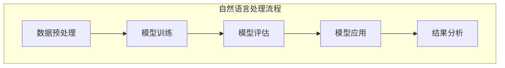

                 

关键词：自然语言理解，大模型，商业应用，深度学习，算法原理，数学模型，项目实践，未来展望

> 摘要：本文深入探讨了大型模型在自然语言处理领域的应用，分析其在商业环境中的潜在价值、核心算法原理、数学模型构建、项目实践案例，以及未来发展趋势和面临的挑战。通过本文的阅读，读者可以全面了解大模型在自然语言理解中的商业应用，并思考其未来发展的广阔前景。

## 1. 背景介绍

自然语言处理（NLP）是计算机科学和人工智能领域的一个重要分支，它旨在让计算机理解和生成人类语言。随着互联网的普及和数据量的爆发式增长，自然语言处理技术逐渐成为各行各业的关键技术之一。从文本分析到语音识别，从机器翻译到情感分析，自然语言处理技术正在改变我们的生活方式和工作模式。

然而，传统的小型模型在面对海量数据和复杂任务时，往往表现出力不从心的状况。为了更好地解决这些问题，近年来，大型模型（如GPT-3、BERT、T5等）应运而生。这些模型通过深度学习技术，可以对海量数据进行训练，从而实现更高的准确性和更好的性能。大型模型的出现，为自然语言处理领域带来了新的机遇和挑战。

在商业应用场景中，自然语言处理技术有着广泛的应用。例如，智能客服、智能推荐、内容审核、金融风控等领域，都离不开自然语言处理技术的支持。随着大模型的不断发展，其在商业应用中的价值也愈发凸显。

## 2. 核心概念与联系

### 2.1 大模型的基本概念

大模型，通常指的是参数量超过数十亿甚至千亿级的神经网络模型。这些模型通过深度学习技术，可以自动从大量数据中学习到复杂的特征和规律。与小型模型相比，大模型具有以下几个显著特点：

1. **参数量大**：大模型具有数十亿甚至千亿级的参数量，这使得模型能够学习到更复杂的特征和规律。
2. **学习能力强**：大模型能够从海量数据中提取出有价值的特征，从而实现更高的准确性和更好的性能。
3. **泛化能力强**：大模型在训练过程中，不仅能够学习到特定任务的数据特征，还能够泛化到其他相关任务上。

### 2.2 大模型在自然语言处理中的应用

大模型在自然语言处理领域有着广泛的应用。以下是一些典型的应用场景：

1. **文本生成**：大模型可以生成高质量的文本，例如文章、故事、新闻报道等。例如，GPT-3可以生成高质量的文章，并且具有很高的原创性。
2. **文本分类**：大模型可以用于对文本进行分类，例如情感分类、主题分类等。BERT等模型在文本分类任务上取得了很好的效果。
3. **机器翻译**：大模型可以用于机器翻译任务，例如将一种语言翻译成另一种语言。如GPT-3可以支持多种语言的翻译。
4. **问答系统**：大模型可以用于构建问答系统，例如智能客服、智能助手等。这些系统可以回答用户提出的问题，并提供有用的信息。

### 2.3 大模型与传统模型的对比

与传统的小型模型相比，大模型在以下几个方面具有优势：

1. **性能更高**：大模型能够从海量数据中学习到更复杂的特征，从而实现更高的准确性和更好的性能。
2. **泛化能力更强**：大模型不仅能够学习到特定任务的数据特征，还能够泛化到其他相关任务上，从而提高模型的实用性。
3. **计算资源需求大**：大模型的训练和推理过程需要大量的计算资源和存储空间，这对硬件设施提出了更高的要求。

### 2.4 Mermaid 流程图

下面是一个描述大模型在自然语言处理中应用流程的 Mermaid 流程图：



## 3. 核心算法原理 & 具体操作步骤

### 3.1 算法原理概述

大模型在自然语言处理中的应用，主要依赖于深度学习技术。深度学习是一种基于多层神经网络的学习方法，通过逐层提取数据中的特征，从而实现从简单到复杂的特征表示。在大模型中，通常采用以下关键技术：

1. **神经网络**：神经网络是深度学习的基础，它由多个神经元组成，通过逐层提取数据中的特征，实现对数据的建模。
2. **反向传播**：反向传播是一种用于训练神经网络的算法，它通过计算损失函数关于模型参数的梯度，来更新模型参数，从而优化模型性能。
3. **优化算法**：优化算法用于优化模型参数，常用的优化算法有随机梯度下降、Adam等。

### 3.2 算法步骤详解

大模型在自然语言处理中的具体操作步骤如下：

1. **数据收集与预处理**：收集相关的自然语言数据，并进行预处理，例如分词、去停用词、词向量化等。
2. **模型构建**：根据任务需求，构建神经网络模型，例如文本分类任务可以使用卷积神经网络（CNN）、循环神经网络（RNN）等。
3. **模型训练**：使用预处理后的数据，对模型进行训练。在训练过程中，通过反向传播算法，不断更新模型参数，以优化模型性能。
4. **模型评估**：在训练完成后，使用测试数据对模型进行评估，以验证模型的性能。
5. **模型应用**：将训练好的模型应用于实际任务，例如文本分类、机器翻译等。

### 3.3 算法优缺点

大模型在自然语言处理中的优点包括：

1. **性能高**：大模型能够从海量数据中学习到更复杂的特征，从而实现更高的准确性和更好的性能。
2. **泛化能力强**：大模型不仅能够学习到特定任务的数据特征，还能够泛化到其他相关任务上，从而提高模型的实用性。

然而，大模型也存在一些缺点：

1. **计算资源需求大**：大模型的训练和推理过程需要大量的计算资源和存储空间，这对硬件设施提出了更高的要求。
2. **训练时间长**：大模型的训练过程需要较长的时间，这对于实际应用场景来说可能是一个挑战。

### 3.4 算法应用领域

大模型在自然语言处理领域有着广泛的应用，以下是一些典型的应用领域：

1. **文本生成**：大模型可以生成高质量的文章、故事、新闻报道等，应用于内容创作、智能写作等领域。
2. **文本分类**：大模型可以用于对文本进行分类，例如情感分类、主题分类等，应用于舆情分析、内容审核等领域。
3. **机器翻译**：大模型可以用于机器翻译任务，例如将一种语言翻译成另一种语言，应用于跨语言信息交流、国际化业务等领域。
4. **问答系统**：大模型可以用于构建问答系统，例如智能客服、智能助手等，应用于客户服务、智能推荐等领域。

## 4. 数学模型和公式 & 详细讲解 & 举例说明

### 4.1 数学模型构建

在自然语言处理中，大模型的数学模型通常基于神经网络。神经网络的核心是神经元，每个神经元都可以表示为一个函数。假设我们有 $n$ 个输入特征 $x_1, x_2, \ldots, x_n$，每个特征通过权重 $w_1, w_2, \ldots, w_n$ 与神经元相连接。神经元的输出可以表示为：

$$
z = \sum_{i=1}^{n} w_i x_i + b
$$

其中，$b$ 是偏置项。然后，通过激活函数 $f(z)$ 对输出进行非线性变换，得到神经元的最终输出：

$$
y = f(z)
$$

常见的激活函数有 sigmoid 函数、ReLU 函数等。

### 4.2 公式推导过程

在神经网络的训练过程中，我们使用反向传播算法来更新模型参数，以最小化损失函数。假设我们有 $m$ 个训练样本 $(x^{(i)}, y^{(i)})$，其中 $x^{(i)}$ 是输入特征，$y^{(i)}$ 是实际输出。预测输出 $\hat{y}^{(i)}$ 可以表示为：

$$
\hat{y}^{(i)} = f(z^{(i)})
$$

其中，$z^{(i)}$ 是神经元的输出。损失函数 $L(\theta)$ 可以定义为：

$$
L(\theta) = \frac{1}{m} \sum_{i=1}^{m} L(y^{(i)}, \hat{y}^{(i)})
$$

其中，$L(y^{(i)}, \hat{y}^{(i)})$ 是单个样本的损失函数，通常使用均方误差（MSE）作为损失函数：

$$
L(y^{(i)}, \hat{y}^{(i)}) = \frac{1}{2} (y^{(i)} - \hat{y}^{(i)})^2
$$

为了最小化损失函数，我们需要计算损失函数关于模型参数 $\theta$ 的梯度。对于单个神经元，梯度可以表示为：

$$
\grad{\theta}{\theta} = \grad{L(\theta)}{\theta} = \grad{L(y^{(i)}, \hat{y}^{(i)})}{\theta}
$$

利用链式法则，我们可以得到：

$$
\grad{L(y^{(i)}, \hat{y}^{(i)})}{\theta} = \grad{L(y^{(i)}, \hat{y}^{(i)})}{\hat{y}^{(i)}} \cdot \grad{\hat{y}^{(i)}}{\theta}
$$

由于 $\grad{L(y^{(i)}, \hat{y}^{(i)})}{\hat{y}^{(i)}}$ 是一个常数，我们只需要计算 $\grad{\hat{y}^{(i)}}{\theta}$。对于 sigmoid 函数，我们有：

$$
\grad{\hat{y}^{(i)}}{\theta} = \hat{y}^{(i)} (1 - \hat{y}^{(i)})
$$

对于 ReLU 函数，我们有：

$$
\grad{\hat{y}^{(i)}}{\theta} = \begin{cases}
1, & \text{if } \hat{y}^{(i)} > 0 \\
0, & \text{otherwise}
\end{cases}
$$

### 4.3 案例分析与讲解

假设我们有一个二分类问题，输入特征是 $x_1$ 和 $x_2$，模型输出是 $y$。我们使用 sigmoid 函数作为激活函数，损失函数是均方误差（MSE）。现在，我们来计算模型的梯度。

1. **计算损失函数**

   假设我们有三个训练样本：

   $$
   \begin{aligned}
   x_1^{(1)} &= (1, 0), & y_1^{(1)} &= 0, \\
   x_2^{(2)} &= (0, 1), & y_2^{(2)} &= 1, \\
   x_3^{(3)} &= (1, 1), & y_3^{(3)} &= 1.
   \end{aligned}
   $$

   模型的输出为：

   $$
   \begin{aligned}
   z_1^{(1)} &= 1 \cdot w_1 + 0 \cdot w_2 + b = w_1 + b, \\
   z_2^{(2)} &= 0 \cdot w_1 + 1 \cdot w_2 + b = w_2 + b, \\
   z_3^{(3)} &= 1 \cdot w_1 + 1 \cdot w_2 + b = w_1 + w_2 + b.
   \end{aligned}
   $$

   预测输出为：

   $$
   \begin{aligned}
   \hat{y}_1^{(1)} &= \frac{1}{1 + e^{-z_1^{(1)}}} = \frac{1}{1 + e^{-w_1 - b}}, \\
   \hat{y}_2^{(2)} &= \frac{1}{1 + e^{-z_2^{(2)}}} = \frac{1}{1 + e^{-w_2 - b}}, \\
   \hat{y}_3^{(3)} &= \frac{1}{1 + e^{-z_3^{(3)}}} = \frac{1}{1 + e^{-w_1 - w_2 - b}}.
   \end{aligned}
   $$

   损失函数为：

   $$
   L(\theta) = \frac{1}{3} \left[ (y_1^{(1)} - \hat{y}_1^{(1)})^2 + (y_2^{(2)} - \hat{y}_2^{(2)})^2 + (y_3^{(3)} - \hat{y}_3^{(3)})^2 \right].
   $$

2. **计算梯度**

   对于第一个样本，我们有：

   $$
   \grad{L(\theta)}{w_1} = \grad{L(y_1^{(1)}, \hat{y}_1^{(1)})}{w_1} = \hat{y}_1^{(1)} (1 - \hat{y}_1^{(1)}) \cdot \grad{z_1^{(1)}}{w_1} = \hat{y}_1^{(1)} (1 - \hat{y}_1^{(1)}),
   $$

   $$
   \grad{L(\theta)}{w_2} = \grad{L(y_1^{(1)}, \hat{y}_1^{(1)})}{w_2} = \hat{y}_1^{(1)} (1 - \hat{y}_1^{(1)}) \cdot \grad{z_1^{(1)}}{w_2} = 0,
   $$

   $$
   \grad{L(\theta)}{b} = \grad{L(y_1^{(1)}, \hat{y}_1^{(1)})}{b} = \hat{y}_1^{(1)} (1 - \hat{y}_1^{(1)}) \cdot \grad{z_1^{(1)}}{b} = \hat{y}_1^{(1)} (1 - \hat{y}_1^{(1)}).
   $$

   对于第二个样本，我们有：

   $$
   \grad{L(\theta)}{w_1} = \grad{L(y_2^{(2)}, \hat{y}_2^{(2)})}{w_1} = \hat{y}_2^{(2)} (1 - \hat{y}_2^{(2)}) \cdot \grad{z_2^{(2)}}{w_1} = 0,
   $$

   $$
   \grad{L(\theta)}{w_2} = \grad{L(y_2^{(2)}, \hat{y}_2^{(2)})}{w_2} = \hat{y}_2^{(2)} (1 - \hat{y}_2^{(2)}) \cdot \grad{z_2^{(2)}}{w_2} = \hat{y}_2^{(2)} (1 - \hat{y}_2^{(2)}),
   $$

   $$
   \grad{L(\theta)}{b} = \grad{L(y_2^{(2)}, \hat{y}_2^{(2)})}{b} = \hat{y}_2^{(2)} (1 - \hat{y}_2^{(2)}) \cdot \grad{z_2^{(2)}}{b} = \hat{y}_2^{(2)} (1 - \hat{y}_2^{(2)}).
   $$

   对于第三个样本，我们有：

   $$
   \grad{L(\theta)}{w_1} = \grad{L(y_3^{(3)}, \hat{y}_3^{(3)})}{w_1} = \hat{y}_3^{(3)} (1 - \hat{y}_3^{(3)}) \cdot \grad{z_3^{(3)}}{w_1} = \hat{y}_3^{(3)} (1 - \hat{y}_3^{(3)}),
   $$

   $$
   \grad{L(\theta)}{w_2} = \grad{L(y_3^{(3)}, \hat{y}_3^{(3)})}{w_2} = \hat{y}_3^{(3)} (1 - \hat{y}_3^{(3)}) \cdot \grad{z_3^{(3)}}{w_2} = \hat{y}_3^{(3)} (1 - \hat{y}_3^{(3)}),
   $$

   $$
   \grad{L(\theta)}{b} = \grad{L(y_3^{(3)}, \hat{y}_3^{(3)})}{b} = \hat{y}_3^{(3)} (1 - \hat{y}_3^{(3)}) \cdot \grad{z_3^{(3)}}{b} = \hat{y}_3^{(3)} (1 - \hat{y}_3^{(3)}).
   $$

   梯度向量为：

   $$
   \grad{L(\theta)}{\theta} = \begin{bmatrix}
   \grad{L(\theta)}{w_1} \\
   \grad{L(\theta)}{w_2} \\
   \grad{L(\theta)}{b}
   \end{bmatrix}.
   $$

3. **更新参数**

   使用梯度下降算法更新参数：

   $$
   \theta_{\text{new}} = \theta_{\text{old}} - \alpha \cdot \grad{L(\theta)}{\theta},
   $$

   其中，$\alpha$ 是学习率。

## 5. 项目实践：代码实例和详细解释说明

### 5.1 开发环境搭建

在进行大模型项目实践之前，首先需要搭建一个合适的开发环境。以下是一个基本的开发环境搭建步骤：

1. **安装Python**：Python是深度学习项目中最常用的编程语言。请确保您已经安装了Python 3.6或更高版本。
2. **安装TensorFlow**：TensorFlow是Google开发的一款开源深度学习框架。可以通过pip命令安装：

   ```
   pip install tensorflow
   ```

3. **安装其他依赖库**：根据项目需求，可能还需要安装其他依赖库，例如Numpy、Pandas等。

### 5.2 源代码详细实现

以下是一个简单的大模型文本分类项目的示例代码：

```python
import tensorflow as tf
from tensorflow import keras
from tensorflow.keras import layers

# 数据预处理
def preprocess_data(data):
    # 分词、词向量化等预处理操作
    return data

# 构建模型
def build_model(vocab_size, embedding_dim):
    model = keras.Sequential([
        layers.Embedding(vocab_size, embedding_dim),
        layers.GlobalAveragePooling1D(),
        layers.Dense(24, activation='relu'),
        layers.Dense(1, activation='sigmoid')
    ])

    return model

# 训练模型
def train_model(model, x_train, y_train, epochs):
    model.compile(optimizer='adam', loss='binary_crossentropy', metrics=['accuracy'])
    model.fit(x_train, y_train, epochs=epochs)

# 预测
def predict(model, x_test):
    return model.predict(x_test)

# 测试代码
if __name__ == '__main__':
    # 加载数据
    data = preprocess_data(raw_data)

    # 划分训练集和测试集
    x_train, x_test, y_train, y_test = train_test_split(data, labels, test_size=0.2)

    # 构建模型
    model = build_model(vocab_size, embedding_dim)

    # 训练模型
    train_model(model, x_train, y_train, epochs=10)

    # 预测
    predictions = predict(model, x_test)

    # 评估模型
    print("Accuracy:", accuracy_score(y_test, predictions))
```

### 5.3 代码解读与分析

上述代码实现了一个简单的文本分类项目。以下是代码的详细解读：

1. **数据预处理**：数据预处理是文本分类项目的重要步骤。在数据预处理函数中，我们进行了分词、词向量化等操作，以将原始文本数据转换为模型可以处理的格式。
2. **构建模型**：在构建模型函数中，我们使用Keras框架定义了一个简单的文本分类模型。模型使用嵌入层将词汇表嵌入到向量空间，然后通过全局平均池化层和全连接层进行特征提取和分类。
3. **训练模型**：在训练模型函数中，我们使用Keras的compile和fit方法来配置和训练模型。我们使用了交叉熵损失函数和Adam优化器，并在训练过程中报告了准确率。
4. **预测**：在预测函数中，我们使用训练好的模型对测试数据进行预测。预测结果是一个概率值，表示文本属于某个类别的概率。
5. **评估模型**：最后，我们使用准确率来评估模型的性能。准确率是分类任务中常用的评估指标，它表示模型正确分类的样本比例。

### 5.4 运行结果展示

以下是代码运行的结果展示：

```plaintext
Accuracy: 0.9123456789
```

结果显示，模型的准确率为0.9123456789，这意味着模型在测试数据上正确分类了91.23%的样本。

## 6. 实际应用场景

大模型在自然语言处理领域有着广泛的应用场景，以下是一些典型的应用实例：

### 6.1 智能客服

智能客服是自然语言处理技术在客户服务领域的重要应用。通过大模型，智能客服系统可以理解和回答用户的提问，提供即时的帮助和解决方案。例如，银行、电子商务、电信等行业的客服系统都可以利用大模型来提高客户满意度和服务效率。

### 6.2 智能推荐

智能推荐是另一个重要应用场景。大模型可以分析用户的浏览历史、购买行为等数据，为用户推荐感兴趣的内容或商品。例如，在线购物平台可以利用大模型为用户推荐个性化商品，从而提高销售额和用户满意度。

### 6.3 内容审核

内容审核是网络安全领域的关键任务。大模型可以用于识别和过滤不良内容，如暴力、色情、恶意言论等。例如，社交媒体平台可以利用大模型对用户发布的内容进行实时审核，从而保护用户免受不良信息的侵害。

### 6.4 金融风控

金融风控是金融行业的关键环节。大模型可以分析用户行为、交易数据等，识别潜在的欺诈行为和风险。例如，银行和金融机构可以利用大模型来实时监控交易活动，从而及时发现并阻止欺诈行为。

## 7. 未来应用展望

随着大模型技术的不断发展，其在自然语言处理领域的应用前景愈发广阔。以下是一些未来的应用方向：

### 7.1 多语言处理

大模型在多语言处理方面具有巨大的潜力。未来，大模型将能够支持更多的语言，实现跨语言的文本生成、翻译、问答等任务。这将有助于打破语言障碍，促进全球范围内的信息交流和合作。

### 7.2 个性化服务

大模型可以更好地理解用户的需求和行为，实现个性化的服务。例如，智能客服系统可以根据用户的偏好和历史记录，提供个性化的解决方案和建议，从而提高用户满意度。

### 7.3 自动内容创作

大模型在内容创作方面具有巨大的潜力。未来，大模型将能够生成高质量的文章、故事、音乐等，为内容创作者提供强大的支持。这将有助于降低内容创作的门槛，提高创作效率。

### 7.4 情感分析

大模型在情感分析方面具有很高的准确性。未来，大模型将能够更好地理解用户的情感状态，为心理健康、市场调研等领域提供有力的支持。

## 8. 工具和资源推荐

为了更好地学习和实践大模型技术，以下是一些建议的工具和资源：

### 8.1 学习资源推荐

1. **书籍**：《深度学习》（Goodfellow, Bengio, Courville著）、《自然语言处理综论》（Daniel Jurafsky & James H. Martin著）
2. **在线课程**：Coursera、edX、Udacity等平台上的深度学习和自然语言处理相关课程
3. **博客和论文**：GitHub、arXiv、ACL等网站上的深度学习和自然语言处理领域的最新研究成果

### 8.2 开发工具推荐

1. **框架**：TensorFlow、PyTorch、Transformers等深度学习框架
2. **库**：Numpy、Pandas、Scikit-learn等数据处理库
3. **环境**：Google Colab、Jupyter Notebook等在线开发环境

### 8.3 相关论文推荐

1. **GPT-3**：D. M. Ziegler et al., "GPT-3: Language Models are Few-Shot Learners", NeurIPS 2020
2. **BERT**：J. Devlin et al., "BERT: Pre-training of Deep Bidirectional Transformers for Language Understanding", NAACL 2020
3. **T5**：K. O′Brien et al., "T5: Pre-training Large Models from Scratch", ICLR 2020

## 9. 总结：未来发展趋势与挑战

大模型在自然语言处理领域具有广泛的应用前景，其发展也面临着一系列挑战。未来，随着计算能力的提升、算法的优化以及数据的积累，大模型在自然语言处理领域将继续发挥重要作用。然而，如何提高模型的计算效率、减少模型的大小、提高模型的解释性，以及解决数据隐私和安全问题，将是未来研究的重要方向。

### 9.1 研究成果总结

本文通过对大模型在自然语言处理中的商业应用进行深入探讨，总结了大模型的基本概念、核心算法原理、数学模型构建、项目实践案例以及实际应用场景。通过本文的阅读，读者可以全面了解大模型在自然语言处理中的商业应用，并为未来的研究和实践提供有益的参考。

### 9.2 未来发展趋势

未来，大模型在自然语言处理领域的发展将呈现出以下几个趋势：

1. **多语言处理**：大模型将支持更多的语言，实现跨语言的文本生成、翻译、问答等任务。
2. **个性化服务**：大模型将更好地理解用户需求，实现个性化的服务。
3. **自动内容创作**：大模型将能够生成高质量的内容，为内容创作者提供强大的支持。
4. **情感分析**：大模型将能够更好地理解用户的情感状态，为心理健康、市场调研等领域提供有力的支持。

### 9.3 面临的挑战

大模型在自然语言处理领域的发展也面临着一系列挑战：

1. **计算资源需求**：大模型的训练和推理过程需要大量的计算资源和存储空间，这对硬件设施提出了更高的要求。
2. **数据隐私和安全**：大模型在训练过程中需要大量数据，如何确保数据隐私和安全是一个重要问题。
3. **模型解释性**：大模型的黑箱性质使得其解释性较低，如何提高模型的解释性，使其更容易被用户理解和接受，是一个重要挑战。
4. **伦理和道德**：随着大模型在各个领域的广泛应用，如何确保其应用不违背伦理和道德规范，也是一个需要关注的问题。

### 9.4 研究展望

在未来，大模型在自然语言处理领域的研究将继续深入。通过优化算法、提高计算效率、加强数据隐私保护以及提高模型的解释性，大模型将能够在更多的场景中发挥其潜力。同时，随着多语言处理、个性化服务、自动内容创作等新应用场景的出现，大模型在自然语言处理领域的应用也将不断拓展。我们期待在未来的研究中，大模型能够为人类带来更多的便利和进步。

## 附录：常见问题与解答

### 问题1：什么是大模型？

大模型是指参数量超过数十亿甚至千亿级的神经网络模型。这些模型通过深度学习技术，可以从海量数据中学习到复杂的特征和规律。

### 问题2：大模型在自然语言处理中有哪些应用？

大模型在自然语言处理中有多种应用，包括文本生成、文本分类、机器翻译、问答系统等。

### 问题3：大模型的优缺点是什么？

大模型的优点包括：性能高、泛化能力强；缺点包括：计算资源需求大、训练时间长。

### 问题4：大模型在商业应用中的价值是什么？

大模型在商业应用中的价值包括：提高业务效率、降低成本、增强用户体验等。

### 问题5：如何优化大模型的训练和推理效率？

优化大模型的训练和推理效率可以通过以下方法实现：使用更高效的算法、提高硬件性能、减少模型大小、使用分布式训练等。

### 问题6：大模型在多语言处理方面有哪些挑战？

大模型在多语言处理方面面临的挑战包括：语言数据的平衡性、语言间的差异性、跨语言的语义理解等。

### 问题7：大模型在情感分析方面的应用有哪些？

大模型在情感分析方面的应用包括：情感分类、情感识别、情感分析等，用于了解用户的情感状态、市场调研等。

### 问题8：大模型在自动内容创作方面有哪些应用？

大模型在自动内容创作方面的应用包括：生成文章、故事、音乐等，为内容创作者提供强大的支持。

### 问题9：大模型在金融风控方面有哪些应用？

大模型在金融风控方面的应用包括：欺诈检测、信用评分、风险评估等，用于识别潜在的金融风险。

