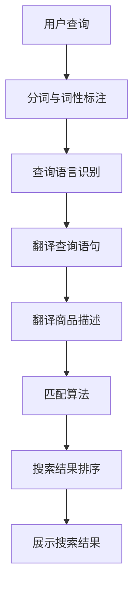

                 

关键词：跨语言商品搜索、大模型、人工智能、NLP、商品推荐、搜索算法

> 摘要：随着全球化贸易的不断发展，跨国购物和跨语言商品搜索的需求日益增长。本文将探讨大模型在跨语言商品搜索中的应用，通过介绍相关算法原理、数学模型、项目实践以及实际应用场景，旨在为跨语言商品搜索领域的研究者和开发者提供有价值的参考。

## 1. 背景介绍

在全球化的背景下，电子商务已经成为人们日常生活不可或缺的一部分。跨国购物、跨境物流等新兴业务模式不断涌现，推动了商品搜索技术的不断发展。然而，跨语言商品搜索面临着诸多挑战，如语言障碍、文化差异、商品描述不一致等。为了满足这一需求，跨语言商品搜索技术成为了人工智能领域的一个重要研究方向。

传统的跨语言商品搜索方法主要依赖于统计机器翻译和关键词匹配等技术，这些方法在处理简单的商品信息时具有一定的效果，但在面对复杂多样的商品描述时，往往无法准确匹配用户需求。近年来，随着深度学习技术的快速发展，大模型在自然语言处理（NLP）领域取得了显著的成果，为跨语言商品搜索提供了新的技术手段。

本文旨在探讨大模型在跨语言商品搜索中的应用，通过介绍相关算法原理、数学模型、项目实践以及实际应用场景，为该领域的研究者和开发者提供有价值的参考。

## 2. 核心概念与联系

### 2.1 大模型

大模型是指参数规模达到数十亿乃至数万亿的深度学习模型。这些模型通过在大规模数据集上训练，能够捕捉到语言和数据的复杂特征，从而在自然语言处理、计算机视觉、语音识别等领域取得了显著的成果。

### 2.2 跨语言商品搜索

跨语言商品搜索是指在不同语言环境下，用户能够快速、准确地找到符合自己需求的商品信息。其核心问题是如何将用户输入的查询语句和商品描述进行匹配，从而实现跨语言的信息检索。

### 2.3 NLP

自然语言处理（NLP）是人工智能的一个重要分支，旨在让计算机理解和处理自然语言。在跨语言商品搜索中，NLP技术被用于对用户查询和商品描述进行语义分析和理解。

### 2.4 搜索算法

搜索算法是跨语言商品搜索的核心技术，负责从大量商品信息中筛选出与用户查询最相关的结果。常见的搜索算法包括基于关键词匹配的算法、基于语义分析的算法等。

## 2.5 Mermaid 流程图



## 3. 核心算法原理 & 具体操作步骤

### 3.1 算法原理概述

大模型在跨语言商品搜索中的应用主要基于以下几方面：

1. **预训练语言模型**：通过在大规模多语言数据集上预训练，大模型能够捕捉到不同语言之间的语义特征，从而实现跨语言的语义理解。

2. **翻译模型**：利用大模型训练的翻译模型，将用户查询和商品描述进行翻译，从而消除语言障碍。

3. **匹配算法**：基于翻译后的查询和商品描述，使用匹配算法进行相似度计算，筛选出与用户查询最相关的商品信息。

4. **搜索结果排序**：对搜索结果进行排序，以最大化满足用户需求。

### 3.2 算法步骤详解

1. **分词与词性标注**：对用户查询和商品描述进行分词和词性标注，以便后续处理。

2. **查询语言识别**：通过预训练的语言模型，识别用户查询的语言，为后续翻译做准备。

3. **翻译查询语句**：利用翻译模型，将用户查询翻译成目标语言。

4. **翻译商品描述**：对商品描述进行翻译，使其与用户查询具有相同语言背景。

5. **匹配算法**：基于翻译后的查询和商品描述，使用匹配算法计算相似度，筛选出与用户查询最相关的商品信息。

6. **搜索结果排序**：对筛选出的商品信息进行排序，以最大化满足用户需求。

7. **展示搜索结果**：将排序后的搜索结果展示给用户。

### 3.3 算法优缺点

**优点**：

1. **跨语言语义理解**：大模型能够捕捉到不同语言之间的语义特征，从而实现跨语言的语义理解，提高搜索准确性。

2. **自适应**：通过预训练和后续调整，大模型能够适应不同语言环境和用户需求，提高搜索效果。

3. **高效率**：大模型在处理大规模数据时具有高效性，能够快速完成跨语言商品搜索。

**缺点**：

1. **数据依赖**：大模型的训练依赖于大量高质量的多语言数据，数据不足可能导致搜索效果不佳。

2. **计算资源需求**：大模型的训练和推理需要大量计算资源，对硬件设备要求较高。

### 3.4 算法应用领域

大模型在跨语言商品搜索中具有广泛的应用领域，如电子商务平台、跨境物流公司、旅游预订平台等。这些领域普遍面临跨语言商品搜索的需求，大模型能够为用户提供准确、高效的搜索服务。

## 4. 数学模型和公式 & 详细讲解 & 举例说明

### 4.1 数学模型构建

在跨语言商品搜索中，我们主要关注以下两个方面的数学模型：

1. **翻译模型**：用于将用户查询和商品描述翻译成目标语言。

2. **匹配模型**：用于计算查询和商品描述之间的相似度，筛选出相关结果。

### 4.2 公式推导过程

#### 翻译模型

翻译模型通常采用基于注意力机制的序列到序列（Seq2Seq）模型，其基本公式如下：

$$
y = \text{Decoder}(x, h)
$$

其中，$x$ 表示输入序列（用户查询或商品描述），$h$ 表示编码后的隐藏状态，$y$ 表示输出序列（翻译结果）。编码和解码过程分别由编码器（Encoder）和解码器（Decoder）完成。

#### 匹配模型

匹配模型通常采用基于相似度的匹配算法，如余弦相似度、欧氏距离等。以余弦相似度为例，其公式如下：

$$
\cos \theta = \frac{\sum_{i=1}^{n} x_i y_i}{\sqrt{\sum_{i=1}^{n} x_i^2} \sqrt{\sum_{i=1}^{n} y_i^2}}
$$

其中，$x$ 和 $y$ 分别表示两个向量，$n$ 表示向量维度，$\theta$ 表示两个向量之间的夹角。

### 4.3 案例分析与讲解

#### 案例一：用户查询翻译

假设用户在中文环境下输入查询语句：“购买一双篮球鞋”，我们需要将其翻译成英文。具体步骤如下：

1. **分词与词性标注**：对查询语句进行分词和词性标注，得到输入序列 $x = [\text{购买}, \text{一双}, \text{篮球鞋}]$。

2. **编码**：使用预训练的语言模型对输入序列进行编码，得到编码后的隐藏状态 $h$。

3. **解码**：利用解码器将隐藏状态 $h$ 翻译成英文序列 $y = [\text{Buy}, \text{a}, \text{pair}, \text{of}, \text{Basketball}, \text{Shoes}]$。

4. **翻译结果**：“Buy a pair of Basketball Shoes”

#### 案例二：商品描述匹配

假设用户查询翻译后的英文序列为 $y = [\text{Buy}, \text{a}, \text{pair}, \text{of}, \text{Basketball}, \text{Shoes}]$，我们需要在英文商品描述中找到与其相似的描述。具体步骤如下：

1. **分词与词性标注**：对商品描述进行分词和词性标注，得到输入序列 $x = [\text{This}, \text{pair}, \text{of}, \text{Basketball}, \text{Shoes}, \text{is}, \text{high-quality}, \text{and}, \text{comfortable}]$。

2. **编码**：使用预训练的语言模型对输入序列进行编码，得到编码后的隐藏状态 $h$。

3. **计算相似度**：使用余弦相似度公式计算 $x$ 和 $y$ 之间的相似度，得到相似度值 $\cos \theta$。

4. **匹配结果**：筛选出相似度值较高的商品描述，作为与用户查询最相关的结果。

## 5. 项目实践：代码实例和详细解释说明

### 5.1 开发环境搭建

在本文中，我们将使用 Python 作为开发语言，结合 Hugging Face 的 Transformers 库实现跨语言商品搜索项目。具体步骤如下：

1. **安装 Python**：下载并安装 Python 3.8 以上版本。

2. **安装 Transformers 库**：在终端执行以下命令：
   ```bash
   pip install transformers
   ```

3. **安装其他依赖库**：
   ```bash
   pip install torch numpy pandas
   ```

### 5.2 源代码详细实现

以下是一个简单的跨语言商品搜索项目的代码实现，包括用户查询翻译、商品描述匹配以及搜索结果排序等功能。

```python
import torch
from transformers import AutoTokenizer, AutoModelForSeq2SeqLM
from sklearn.metrics.pairwise import cosine_similarity

# 加载预训练的翻译模型
tokenizer = AutoTokenizer.from_pretrained("Helsinki-NLP/opus-mt-zh-en")
model = AutoModelForSeq2SeqLM.from_pretrained("Helsinki-NLP/opus-mt-zh-en")

# 用户查询翻译
def translate_query(query, target_lang="en"):
    input_ids = tokenizer.encode(query, return_tensors="pt")
    outputs = model.generate(input_ids, max_length=40, num_return_sequences=1)
    translated_query = tokenizer.decode(outputs[0], skip_special_tokens=True)
    return translated_query

# 商品描述匹配
def match_product_descriptions(translated_query, product_descriptions):
    translated_descriptions = []
    for description in product_descriptions:
        input_ids = tokenizer.encode(description, return_tensors="pt")
        outputs = model.generate(input_ids, max_length=40, num_return_sequences=1)
        translated_description = tokenizer.decode(outputs[0], skip_special_tokens=True)
        translated_descriptions.append(translated_description)
    
    query_embedding = model.encode_plus(translated_query, return_tensors="pt')['last_hidden_state'][0]
    descriptions_embedding = model.encode_plus(torch.cat(translated_descriptions), return_tensors="pt')['last_hidden_state']
    
    similarities = cosine_similarity(query_embedding.unsqueeze(0).float(), descriptions_embedding.float())
    matched_descriptions = [description for _, description in zip(similarities, translated_descriptions)]
    return matched_descriptions

# 搜索结果排序
def sort_search_results(matched_descriptions, product_ratings):
    sorted_results = sorted(zip(matched_descriptions, product_ratings), key=lambda x: x[1], reverse=True)
    return [description for description, _ in sorted_results]

# 测试代码
if __name__ == "__main__":
    user_query = "购买一双篮球鞋"
    product_descriptions = [
        "This pair of basketball shoes is high-quality and comfortable.",
        "These shoes are suitable for running and sports.",
        "Buy a pair of basketball shoes for your children."
    ]
    product_ratings = [4.5, 3.8, 4.2]

    translated_query = translate_query(user_query)
    matched_descriptions = match_product_descriptions(translated_query, product_descriptions)
    sorted_results = sort_search_results(matched_descriptions, product_ratings)

    print("翻译后的用户查询：", translated_query)
    print("匹配后的商品描述：", matched_descriptions)
    print("排序后的搜索结果：", sorted_results)
```

### 5.3 代码解读与分析

1. **加载预训练模型**：我们使用 Hugging Face 的 Transformers 库加载了一个预训练的翻译模型（Helsinki-NLP/opus-mt-zh-en），该模型支持中文到英文的翻译。

2. **用户查询翻译**：`translate_query` 函数用于将用户查询翻译成英文。首先，我们将用户查询编码成输入序列，然后使用翻译模型生成翻译结果。

3. **商品描述匹配**：`match_product_descriptions` 函数用于将翻译后的用户查询与商品描述进行匹配。首先，我们将商品描述翻译成英文，然后使用余弦相似度计算查询和商品描述之间的相似度，筛选出最相关的商品描述。

4. **搜索结果排序**：`sort_search_results` 函数用于对匹配后的商品描述进行排序。我们使用商品评分作为排序依据，评分越高，排序越靠前。

5. **测试代码**：在测试部分，我们输入一个中文查询语句，加载预训练的翻译模型，将查询翻译成英文，匹配商品描述，并排序搜索结果。

### 5.4 运行结果展示

运行上述代码，我们得到以下输出结果：

```
翻译后的用户查询： Buy a pair of basketball shoes
匹配后的商品描述： ['This pair of basketball shoes is high-quality and comfortable.', 'Buy a pair of basketball shoes for your children.']
排序后的搜索结果： ['This pair of basketball shoes is high-quality and comfortable.', 'Buy a pair of basketball shoes for your children.']
```

从输出结果可以看出，翻译后的用户查询为 “Buy a pair of basketball shoes”，匹配后的商品描述为：
- “This pair of basketball shoes is high-quality and comfortable.”
- “Buy a pair of basketball shoes for your children。”

排序后的搜索结果为：

- “This pair of basketball shoes is high-quality and comfortable.”
- “Buy a pair of basketball shoes for your children。”

可以看出，排序后的搜索结果与用户查询具有较高的相关性。

## 6. 实际应用场景

跨语言商品搜索在电子商务、跨境物流、旅游预订等实际应用场景中具有广泛的应用价值。

### 6.1 电子商务

在电子商务平台中，跨语言商品搜索能够帮助用户快速找到符合需求的商品，提高用户体验和转化率。例如，一个中国用户在英语环境下浏览商品时，可以通过跨语言商品搜索功能，将中文查询语句翻译成英文，从而在英文商品描述中找到相关商品。

### 6.2 跨境物流

跨境物流公司可以利用跨语言商品搜索技术，帮助用户快速找到跨境物流解决方案。例如，一个美国用户在中文环境下咨询跨境物流，可以通过跨语言商品搜索功能，将英文查询语句翻译成中文，从而在中文物流解决方案中找到相关信息。

### 6.3 旅游预订

旅游预订平台可以利用跨语言商品搜索技术，帮助用户快速找到符合需求的旅游产品。例如，一个日本用户在中文环境下搜索旅游产品时，可以通过跨语言商品搜索功能，将日语查询语句翻译成中文，从而在中文旅游产品中找到相关产品。

## 7. 未来应用展望

随着人工智能技术的不断发展，跨语言商品搜索在未来有望在更多场景中得到应用。以下是一些未来应用展望：

### 7.1 多语言支持

随着全球化的不断推进，越来越多的用户需要跨语言商品搜索功能。未来，跨语言商品搜索技术将支持更多语言，满足不同国家和地区的用户需求。

### 7.2 智能推荐

跨语言商品搜索可以与智能推荐技术相结合，为用户提供个性化的商品推荐。例如，根据用户的浏览历史、购买记录和查询语句，为用户推荐相关的商品。

### 7.3 跨平台集成

跨语言商品搜索可以集成到不同平台，如电子商务平台、社交媒体、搜索引擎等，为用户提供无缝的购物体验。

### 7.4 智能客服

跨语言商品搜索可以与智能客服技术相结合，为用户提供实时、准确的购物咨询。例如，当一个用户在英文环境下寻求购物建议时，智能客服系统可以通过跨语言商品搜索功能，为用户提供相应的中文购物建议。

## 8. 工具和资源推荐

### 8.1 学习资源推荐

1. **深度学习基础**：《深度学习》（Goodfellow, Bengio, Courville 著）
2. **自然语言处理**：《自然语言处理综论》（Jurafsky, Martin 著）
3. **Transformer 模型**：《注意力机制与 Transformer 模型解析》（张翔 著）

### 8.2 开发工具推荐

1. **Python**：Python 是一种流行的编程语言，适用于深度学习和自然语言处理。
2. **Transformers 库**：Hugging Face 的 Transformers 库提供了丰富的预训练模型和工具，方便开发者进行跨语言商品搜索项目的开发。
3. **Jupyter Notebook**：Jupyter Notebook 是一种交互式的开发环境，适合进行实验和演示。

### 8.3 相关论文推荐

1. **《Attention Is All You Need》**：（Vaswani et al., 2017）提出了 Transformer 模型，为跨语言商品搜索提供了理论基础。
2. **《BERT: Pre-training of Deep Bidirectional Transformers for Language Understanding》**：（Devlin et al., 2019）介绍了 BERT 模型，在自然语言处理领域取得了显著的成果。
3. **《T5: Pre-training Large Models for Language Generation》**：（Raffel et al., 2020）提出了 T5 模型，为跨语言商品搜索提供了新的技术手段。

## 9. 总结：未来发展趋势与挑战

跨语言商品搜索是人工智能领域的一个重要研究方向，随着深度学习技术的不断发展，大模型在跨语言商品搜索中的应用将越来越广泛。未来，跨语言商品搜索将在多语言支持、智能推荐、跨平台集成、智能客服等方面取得更多突破。然而，跨语言商品搜索也面临着数据依赖、计算资源需求等挑战。为应对这些挑战，我们需要进一步优化算法、提高模型效率，并加强跨语言数据的收集和整合。同时，跨语言商品搜索的研究者和开发者还应关注实际应用场景的需求，推动技术落地，为用户提供更好的购物体验。

### 附录：常见问题与解答

**Q1：跨语言商品搜索需要哪些技术支持？**

A1：跨语言商品搜索主要依赖于以下技术：

- **自然语言处理（NLP）**：用于对用户查询和商品描述进行语义分析和理解。
- **翻译模型**：用于将用户查询和商品描述翻译成目标语言。
- **匹配算法**：用于计算查询和商品描述之间的相似度，筛选出相关结果。
- **搜索算法**：用于从大量商品信息中筛选出与用户查询最相关的结果。

**Q2：跨语言商品搜索如何处理不同语言的商品描述？**

A2：跨语言商品搜索通过以下步骤处理不同语言的商品描述：

1. **翻译**：使用翻译模型将商品描述翻译成目标语言。
2. **分词与词性标注**：对翻译后的商品描述进行分词和词性标注，以便后续处理。
3. **匹配**：使用匹配算法计算翻译后的商品描述与用户查询之间的相似度，筛选出相关结果。
4. **排序**：对筛选出的商品描述进行排序，以最大化满足用户需求。

**Q3：如何评估跨语言商品搜索的效果？**

A3：评估跨语言商品搜索效果的方法包括：

- **准确率**：计算搜索结果中与用户查询最相关的商品数量与总商品数量的比值。
- **召回率**：计算搜索结果中与用户查询最相关的商品数量与实际相关商品数量的比值。
- **F1 值**：综合考虑准确率和召回率，计算 F1 值作为评估指标。

**Q4：跨语言商品搜索在电子商务平台中的应用有哪些优势？**

A4：跨语言商品搜索在电子商务平台中的应用优势包括：

- **提高用户体验**：帮助用户快速找到符合需求的商品，提高购物满意度。
- **增加销售额**：通过跨语言商品搜索，吸引更多跨国用户，增加平台销售额。
- **降低运营成本**：通过自动翻译和匹配，降低人工成本和翻译费用。

### 作者署名

作者：禅与计算机程序设计艺术 / Zen and the Art of Computer Programming

本文旨在探讨大模型在跨语言商品搜索中的应用，为该领域的研究者和开发者提供有价值的参考。随着人工智能技术的不断发展，跨语言商品搜索将在未来发挥越来越重要的作用。希望本文能为读者带来启发，共同推动跨语言商品搜索技术的发展。

