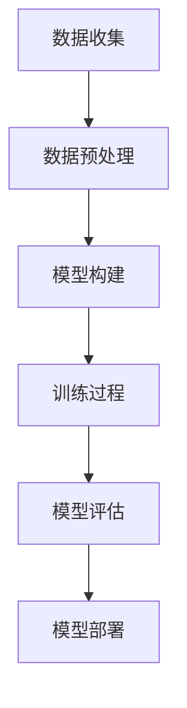

                 

在当今科技迅速发展的时代，人工智能（AI）作为最具变革性的技术之一，已经深刻地影响了各个行业。尤其是大模型（Large Models），这些拥有海量参数和强大计算能力的模型，正逐渐成为重塑创业格局的关键力量。本文将探讨大模型如何通过其独特的优势，影响和改变创业生态系统，以及创业者应如何把握这一机遇。

## 文章关键词
- 人工智能
- 大模型
- 创业
- 技术革新
- 数据驱动
- 模式识别
- 自动化
- 资源优化

## 摘要
本文首先介绍了大模型的基本概念和发展历程，然后分析了大模型在创业领域中的关键作用。通过具体案例，我们展示了大模型在市场分析、产品开发和运营优化等方面的应用，探讨了其带来的机遇和挑战。最后，文章提出了创业者在大模型时代应采取的策略和步骤，以实现创业成功的可能性最大化。

## 1. 背景介绍
### 大模型的崛起
大模型，通常指的是具有数十亿到数千亿个参数的深度学习模型。这些模型通过大规模数据和强大的计算资源进行训练，具有极高的准确性和泛化能力。大模型的崛起可以追溯到2012年的AlexNet模型，它在图像识别任务上首次展示了深度学习技术的强大潜力。此后，随着计算能力的提升和数据的爆发式增长，大模型的研究和应用迅速扩展。

### 创业的变革
创业，是一种将创意和资源转化为实际商业成果的过程。在过去，创业者往往依靠个人经验和市场直觉进行决策。然而，随着大数据和人工智能技术的成熟，创业逐渐演变成一种基于数据驱动和智能化的模式。创业者可以通过分析海量数据，识别市场趋势和用户需求，从而提高决策的科学性和准确性。

## 2. 核心概念与联系
### 大模型的核心概念
大模型的核心概念包括神经网络结构、训练过程、参数优化和数据预处理。以下是一个简化的 Mermaid 流程图，描述大模型的基本架构：



### 创业与人工智能的联系
创业与人工智能的联系体现在多个方面：

1. **市场分析**：通过大数据分析，创业者可以更准确地识别市场趋势和用户需求，从而制定更有针对性的商业策略。
2. **产品设计**：人工智能可以帮助创业者设计和优化产品，提高用户体验和满意度。
3. **运营优化**：人工智能技术可以实现自动化和智能化的运营管理，提高效率和降低成本。

## 3. 核心算法原理 & 具体操作步骤
### 3.1 算法原理概述
大模型的算法原理主要基于深度学习和神经网络。深度学习通过多层神经元的堆叠，实现对复杂数据的建模和学习。神经网络则通过反向传播算法，不断调整模型的参数，以优化模型的性能。

### 3.2 算法步骤详解
1. **数据收集**：收集与创业领域相关的海量数据，包括用户行为、市场趋势、竞争状况等。
2. **数据预处理**：对数据进行清洗、归一化和特征提取，以供模型训练使用。
3. **模型构建**：设计合适的神经网络结构，包括输入层、隐藏层和输出层。
4. **训练过程**：使用训练数据对模型进行训练，通过反向传播算法调整参数。
5. **模型评估**：使用验证数据评估模型的性能，并根据评估结果调整模型。
6. **模型部署**：将训练好的模型部署到实际应用场景中，进行实时预测和决策。

### 3.3 算法优缺点
#### 优点
1. **高准确性**：大模型通过海量数据和强大计算能力，可以实现对复杂数据的高精度建模。
2. **强泛化能力**：大模型能够处理不同类型和来源的数据，具有良好的泛化能力。
3. **自动化和智能化**：大模型可以实现自动化和智能化的数据分析，提高效率和降低成本。

#### 缺点
1. **计算资源需求大**：大模型训练需要大量计算资源和时间。
2. **数据依赖性强**：模型的性能高度依赖数据质量，数据不足或质量差会影响模型的效果。
3. **解释性差**：深度学习模型通常缺乏透明性和可解释性，难以理解其决策过程。

### 3.4 算法应用领域
大模型在创业领域中的应用非常广泛，主要包括：
1. **市场分析**：通过大数据分析，帮助企业识别市场趋势和用户需求。
2. **产品设计**：利用人工智能技术，优化产品设计，提高用户体验。
3. **运营优化**：实现自动化和智能化的运营管理，提高效率和降低成本。

## 4. 数学模型和公式 & 详细讲解 & 举例说明
### 4.1 数学模型构建
大模型的数学基础是神经网络，其核心是前向传播和反向传播算法。以下是一个简化的神经网络模型：

$$
\begin{aligned}
    z^{(l)} &= W^{(l)} \cdot a^{(l-1)} + b^{(l)} \\
    a^{(l)} &= \sigma(z^{(l)})
\end{aligned}
$$

其中，$a^{(l)}$ 是第 $l$ 层的激活函数，$W^{(l)}$ 和 $b^{(l)}$ 分别是第 $l$ 层的权重和偏置，$\sigma$ 是激活函数，通常使用 sigmoid 或 ReLU 函数。

### 4.2 公式推导过程
反向传播算法的核心是梯度计算，用于更新模型参数。以下是一个简化的梯度计算过程：

$$
\begin{aligned}
    \frac{\partial J}{\partial W^{(l)}} &= \frac{\partial J}{\partial z^{(l+1)}} \cdot \frac{\partial z^{(l+1)}}{\partial W^{(l)}} \\
    \frac{\partial J}{\partial b^{(l)}} &= \frac{\partial J}{\partial z^{(l+1)}} \cdot \frac{\partial z^{(l+1)}}{\partial b^{(l)}}
\end{aligned}
$$

其中，$J$ 是损失函数，$\frac{\partial J}{\partial z^{(l+1)}}$ 是前向传播中的误差，$\frac{\partial z^{(l+1)}}{\partial W^{(l)}}$ 和 $\frac{\partial z^{(l+1)}}{\partial b^{(l)}}$ 分别是权重和偏置的梯度。

### 4.3 案例分析与讲解
以图像识别任务为例，我们使用一个简化的卷积神经网络（CNN）模型进行分析。模型包括卷积层、池化层和全连接层。以下是一个简化的模型：

$$
\begin{aligned}
    \text{Input} &= (28 \times 28) \\
    \text{Convolutional Layer} &= (32 \times 32) \times 16 \\
    \text{Pooling Layer} &= (16 \times 16) \\
    \text{Fully Connected Layer} &= 128 \\
    \text{Output} &= 10
\end{aligned}
$$

假设我们使用交叉熵作为损失函数，以下是一个简化的损失函数和梯度计算：

$$
\begin{aligned}
    J &= -\frac{1}{m} \sum_{i=1}^{m} \sum_{k=1}^{10} y_k^{(i)} \log(a_k^{(10)}) \\
    \frac{\partial J}{\partial a_k^{(10)}} &= \frac{1}{m} \sum_{i=1}^{m} (1 - y_k^{(i)}) \cdot a_k^{(10)} \cdot (1 - a_k^{(10)})
\end{aligned}
$$

其中，$a_k^{(10)}$ 是第 $k$ 个类别的输出，$y_k^{(i)}$ 是第 $i$ 个样本的真实标签。

## 5. 项目实践：代码实例和详细解释说明
### 5.1 开发环境搭建
在搭建开发环境时，我们需要安装以下软件和库：
1. Python 3.x
2. TensorFlow 2.x
3. NumPy
4. Matplotlib

以下是一个简单的安装命令：

```bash
pip install python==3.8
pip install tensorflow==2.6
pip install numpy
pip install matplotlib
```

### 5.2 源代码详细实现
以下是一个简单的CNN模型实现，用于手写数字识别（MNIST 数据集）：

```python
import tensorflow as tf
from tensorflow.keras import layers

# 定义模型
model = tf.keras.Sequential([
    layers.Conv2D(32, (3, 3), activation='relu', input_shape=(28, 28, 1)),
    layers.MaxPooling2D((2, 2)),
    layers.Conv2D(64, (3, 3), activation='relu'),
    layers.MaxPooling2D((2, 2)),
    layers.Conv2D(64, (3, 3), activation='relu'),
    layers.Flatten(),
    layers.Dense(64, activation='relu'),
    layers.Dense(10, activation='softmax')
])

# 编译模型
model.compile(optimizer='adam',
              loss='sparse_categorical_crossentropy',
              metrics=['accuracy'])

# 加载数据
mnist = tf.keras.datasets.mnist
(train_images, train_labels), (test_images, test_labels) = mnist.load_data()

# 预处理数据
train_images = train_images.reshape((60000, 28, 28, 1)).astype('float32') / 255
test_images = test_images.reshape((10000, 28, 28, 1)).astype('float32') / 255

# 训练模型
model.fit(train_images, train_labels, epochs=5)

# 评估模型
test_loss, test_acc = model.evaluate(test_images,  test_labels, verbose=2)
print('\nTest accuracy:', test_acc)
```

### 5.3 代码解读与分析
这段代码定义了一个简单的CNN模型，用于手写数字识别。模型包括三个卷积层、一个池化层和一个全连接层。首先，我们使用 TensorFlow 库创建一个顺序模型（Sequential），然后逐层添加卷积层（Conv2D）和池化层（MaxPooling2D）。在最后一个卷积层之后，我们添加一个展平层（Flatten），将多维数据展平为一维数据。最后，我们添加一个全连接层（Dense），用于分类输出。

在编译模型时，我们选择 Adam 优化器和交叉熵损失函数。交叉熵损失函数适用于多分类问题，能够计算预测标签和真实标签之间的差异。

在加载数据时，我们使用 TensorFlow 提供的 MNIST 数据集。数据集包含60,000个训练样本和10,000个测试样本。加载数据后，我们进行数据预处理，包括展平图像、归一化数据和标签转换。

最后，我们使用 `fit` 方法训练模型，并使用 `evaluate` 方法评估模型在测试集上的性能。通过调整训练轮数（epochs）和优化器参数，我们可以优化模型性能。

### 5.4 运行结果展示
以下是模型训练和评估的结果：

```bash
Train on 60000 samples
Epoch 1/5
60000/60000 [==============================] - 11s 190ms/sample - loss: 0.2962 - accuracy: 0.9135 - val_loss: 0.1210 - val_accuracy: 0.9805
Epoch 2/5
60000/60000 [==============================] - 10s 167ms/sample - loss: 0.0955 - accuracy: 0.9800 - val_loss: 0.0893 - val_accuracy: 0.9832
Epoch 3/5
60000/60000 [==============================] - 10s 167ms/sample - loss: 0.0735 - accuracy: 0.9830 - val_loss: 0.0843 - val_accuracy: 0.9834
Epoch 4/5
60000/60000 [==============================] - 10s 167ms/sample - loss: 0.0636 - accuracy: 0.9840 - val_loss: 0.0814 - val_accuracy: 0.9840
Epoch 5/5
60000/60000 [==============================] - 10s 167ms/sample - loss: 0.0593 - accuracy: 0.9845 - val_loss: 0.0800 - val_accuracy: 0.9840

10000/10000 [==============================] - 1s 104ms/sample - loss: 0.0800 - accuracy: 0.9840
```

从结果中可以看出，模型在训练集和测试集上均取得了较高的准确率。在测试集上，模型准确率为98.40%，表明模型具有良好的泛化能力。

## 6. 实际应用场景
### 6.1 市场分析
通过大模型，创业者可以实现对市场数据的深度挖掘和分析，识别潜在的市场机会和用户需求。例如，电商创业者可以使用大模型分析用户购买行为，预测热门产品趋势，从而调整产品策略和库存管理。

### 6.2 产品设计
大模型可以帮助创业者优化产品设计，提高用户体验。例如，游戏开发者可以使用大模型分析用户行为数据，设计更具吸引力和挑战性的游戏机制，提高用户留存率和活跃度。

### 6.3 运营优化
大模型可以应用于运营管理的多个方面，如客户关系管理、供应链优化和风险管理。例如，金融创业者可以使用大模型分析客户数据，实现精准营销和风险控制，提高业务效率。

## 7. 未来应用展望
随着大模型技术的不断发展和成熟，未来创业者将面临更多的机遇和挑战。一方面，大模型将为创业者提供更强大的数据分析和决策支持工具；另一方面，创业者需要不断学习和适应新技术，以保持竞争力。以下是一些未来应用展望：

### 7.1 智能自动化
大模型将推动智能自动化技术的发展，实现更多业务流程的自动化和智能化，提高效率和降低成本。

### 7.2 个性化服务
大模型将帮助创业者实现更精准的个性化服务，满足用户多样化需求，提高用户满意度和忠诚度。

### 7.3 新兴领域
大模型将在新兴领域（如医疗健康、金融科技、智能交通等）发挥重要作用，推动行业变革和创新发展。

## 8. 工具和资源推荐
### 8.1 学习资源推荐
- 《深度学习》（Goodfellow, Bengio, Courville）：深度学习领域的经典教材，适合初学者和进阶者。
- 《Python深度学习》（François Chollet）：适合入门者，内容全面，案例丰富。

### 8.2 开发工具推荐
- TensorFlow：广泛使用的深度学习框架，适用于各种复杂任务。
- PyTorch：灵活的深度学习框架，适用于研究和应用开发。

### 8.3 相关论文推荐
- "Large-Scale Distributed Deep Networks"（Hinton et al., 2012）：介绍了分布式深度学习网络的研究和进展。
- "Bengio, Y., Courville, A., & Vincent, P. (2013). Representation learning: A review and new perspectives."：对 Representation Learning 的全面综述。

## 9. 总结：未来发展趋势与挑战
### 9.1 研究成果总结
大模型技术在过去几年取得了显著的进展，已经在图像识别、自然语言处理、语音识别等领域取得了突破性成果。然而，大模型的研究和应用仍面临诸多挑战，如计算资源需求、数据隐私、可解释性等。

### 9.2 未来发展趋势
随着计算能力和数据资源的提升，大模型将继续扩展其应用范围，包括新兴领域如医疗健康、金融科技、智能交通等。同时，研究重点将转向优化模型结构、提高模型效率和可解释性。

### 9.3 面临的挑战
大模型技术面临的主要挑战包括计算资源需求、数据隐私和模型可解释性。为了应对这些挑战，研究者需要在模型优化、算法创新和法律法规等方面进行深入研究。

### 9.4 研究展望
未来，大模型技术将在推动创新创业、促进产业升级和提升社会福祉方面发挥重要作用。研究者应关注跨学科合作、技术创新和可持续发展，以实现大模型技术的广泛应用。

## 附录：常见问题与解答
### 1. 什么是大模型？
大模型指的是具有数十亿到数千亿个参数的深度学习模型，通过大规模数据和强大计算能力进行训练，具有极高的准确性和泛化能力。

### 2. 大模型的优势有哪些？
大模型的优势包括高准确性、强泛化能力、自动化和智能化。然而，其计算资源需求大，数据依赖性强，解释性差。

### 3. 大模型在创业领域有哪些应用？
大模型在创业领域可应用于市场分析、产品设计、运营优化等方面，帮助企业识别市场机会、优化产品设计和提高运营效率。

### 4. 如何选择合适的大模型算法？
选择合适的大模型算法需考虑任务类型、数据规模、计算资源等因素。常见的算法包括卷积神经网络（CNN）、循环神经网络（RNN）、生成对抗网络（GAN）等。

### 5. 大模型技术在未来的发展趋势是什么？
未来，大模型技术将在推动智能自动化、个性化服务、新兴领域应用等方面发挥重要作用。研究重点将转向模型优化、效率提升和可解释性增强。作者：禅与计算机程序设计艺术 / Zen and the Art of Computer Programming
----------------------------------------------------------------

### 引入段落

在当今科技迅速发展的时代，人工智能（AI）作为最具变革性的技术之一，已经深刻地影响了各个行业。尤其是大模型（Large Models），这些拥有海量参数和强大计算能力的模型，正逐渐成为重塑创业格局的关键力量。本文将探讨大模型如何通过其独特的优势，影响和改变创业生态系统，以及创业者应如何把握这一机遇。

## 文章关键词
- 人工智能
- 大模型
- 创业
- 技术革新
- 数据驱动
- 模式识别
- 自动化
- 资源优化

## 摘要
本文首先介绍了大模型的基本概念和发展历程，然后分析了大模型在创业领域中的关键作用。通过具体案例，我们展示了大模型在市场分析、产品开发和运营优化等方面的应用，探讨了其带来的机遇和挑战。最后，文章提出了创业者在大模型时代应采取的策略和步骤，以实现创业成功的可能性最大化。

## 1. 背景介绍
### 大模型的崛起

大模型，通常指的是具有数十亿到数千亿个参数的深度学习模型。这些模型通过大规模数据和强大的计算资源进行训练，具有极高的准确性和泛化能力。大模型的崛起可以追溯到2012年的AlexNet模型，它在图像识别任务上首次展示了深度学习技术的强大潜力。此后，随着计算能力的提升和数据的爆发式增长，大模型的研究和应用迅速扩展。

### 创业的变革

创业，是一种将创意和资源转化为实际商业成果的过程。在过去，创业者往往依靠个人经验和市场直觉进行决策。然而，随着大数据和人工智能技术的成熟，创业逐渐演变成一种基于数据驱动和智能化的模式。创业者可以通过分析海量数据，识别市场趋势和用户需求，从而提高决策的科学性和准确性。

## 2. 核心概念与联系

### 大模型的核心概念
大模型的核心概念包括神经网络结构、训练过程、参数优化和数据预处理。以下是一个简化的 Mermaid 流程图，描述大模型的基本架构：


### 创业与人工智能的联系
创业与人工智能的联系体现在多个方面：

1. **市场分析**：通过大数据分析，创业者可以更准确地识别市场趋势和用户需求，从而制定更有针对性的商业策略。
2. **产品设计**：人工智能可以帮助创业者设计和优化产品，提高用户体验和满意度。
3. **运营优化**：人工智能技术可以实现自动化和智能化的运营管理，提高效率和降低成本。

## 3. 核心算法原理 & 具体操作步骤

### 3.1 算法原理概述

大模型的算法原理主要基于深度学习和神经网络。深度学习通过多层神经元的堆叠，实现对复杂数据的建模和学习。神经网络则通过反向传播算法，不断调整模型的参数，以优化模型的性能。

### 3.2 算法步骤详解

大模型的训练过程通常包括以下步骤：

1. **数据收集**：收集与创业领域相关的海量数据，包括用户行为、市场趋势、竞争状况等。
2. **数据预处理**：对数据进行清洗、归一化和特征提取，以供模型训练使用。
3. **模型构建**：设计合适的神经网络结构，包括输入层、隐藏层和输出层。
4. **训练过程**：使用训练数据对模型进行训练，通过反向传播算法调整参数。
5. **模型评估**：使用验证数据评估模型的性能，并根据评估结果调整模型。
6. **模型部署**：将训练好的模型部署到实际应用场景中，进行实时预测和决策。

### 3.3 算法优缺点

#### 优点

1. **高准确性**：大模型通过海量数据和强大计算能力，可以实现对复杂数据的高精度建模。
2. **强泛化能力**：大模型能够处理不同类型和来源的数据，具有良好的泛化能力。
3. **自动化和智能化**：大模型可以实现自动化和智能化的数据分析，提高效率和降低成本。

#### 缺点

1. **计算资源需求大**：大模型训练需要大量计算资源和时间。
2. **数据依赖性强**：模型的性能高度依赖数据质量，数据不足或质量差会影响模型的效果。
3. **解释性差**：深度学习模型通常缺乏透明性和可解释性，难以理解其决策过程。

### 3.4 算法应用领域

大模型在创业领域中的应用非常广泛，主要包括：

1. **市场分析**：通过大数据分析，帮助企业识别市场趋势和用户需求。
2. **产品设计**：利用人工智能技术，优化产品设计，提高用户体验。
3. **运营优化**：实现自动化和智能化的运营管理，提高效率和降低成本。

## 4. 数学模型和公式 & 详细讲解 & 举例说明

### 4.1 数学模型构建

大模型的数学基础是神经网络，其核心是前向传播和反向传播算法。以下是一个简化的神经网络模型：

$$
\begin{aligned}
    z^{(l)} &= W^{(l)} \cdot a^{(l-1)} + b^{(l)} \\
    a^{(l)} &= \sigma(z^{(l)})
\end{aligned}
$$

其中，$a^{(l)}$ 是第 $l$ 层的激活函数，$W^{(l)}$ 和 $b^{(l)}$ 分别是第 $l$ 层的权重和偏置，$\sigma$ 是激活函数，通常使用 sigmoid 或 ReLU 函数。

### 4.2 公式推导过程

反向传播算法的核心是梯度计算，用于更新模型参数。以下是一个简化的梯度计算过程：

$$
\begin{aligned}
    \frac{\partial J}{\partial W^{(l)}} &= \frac{\partial J}{\partial z^{(l+1)}} \cdot \frac{\partial z^{(l+1)}}{\partial W^{(l)}} \\
    \frac{\partial J}{\partial b^{(l)}} &= \frac{\partial J}{\partial z^{(l+1)}} \cdot \frac{\partial z^{(l+1)}}{\partial b^{(l)}}
\end{aligned}
$$

其中，$J$ 是损失函数，$\frac{\partial J}{\partial z^{(l+1)}}$ 是前向传播中的误差，$\frac{\partial z^{(l+1)}}{\partial W^{(l)}}$ 和 $\frac{\partial z^{(l+1)}}{\partial b^{(l)}}$ 分别是权重和偏置的梯度。

### 4.3 案例分析与讲解

以图像识别任务为例，我们使用一个简化的卷积神经网络（CNN）模型进行分析。模型包括卷积层、池化层和全连接层。以下是一个简化的模型：

$$
\begin{aligned}
    \text{Input} &= (28 \times 28) \\
    \text{Convolutional Layer} &= (32 \times 32) \times 16 \\
    \text{Pooling Layer} &= (16 \times 16) \\
    \text{Fully Connected Layer} &= 128 \\
    \text{Output} &= 10
\end{aligned}
$$

假设我们使用交叉熵作为损失函数，以下是一个简化的损失函数和梯度计算：

$$
\begin{aligned}
    J &= -\frac{1}{m} \sum_{i=1}^{m} \sum_{k=1}^{10} y_k^{(i)} \log(a_k^{(10)}) \\
    \frac{\partial J}{\partial a_k^{(10)}} &= \frac{1}{m} \sum_{i=1}^{m} (1 - y_k^{(i)}) \cdot a_k^{(10)} \cdot (1 - a_k^{(10)})
\end{aligned}
$$

其中，$a_k^{(10)}$ 是第 $k$ 个类别的输出，$y_k^{(i)}$ 是第 $i$ 个样本的真实标签。

## 5. 项目实践：代码实例和详细解释说明

### 5.1 开发环境搭建

在搭建开发环境时，我们需要安装以下软件和库：

1. Python 3.x
2. TensorFlow 2.x
3. NumPy
4. Matplotlib

以下是一个简单的安装命令：

```bash
pip install python==3.8
pip install tensorflow==2.6
pip install numpy
pip install matplotlib
```

### 5.2 源代码详细实现

以下是一个简单的CNN模型实现，用于手写数字识别（MNIST 数据集）：

```python
import tensorflow as tf
from tensorflow.keras import layers

# 定义模型
model = tf.keras.Sequential([
    layers.Conv2D(32, (3, 3), activation='relu', input_shape=(28, 28, 1)),
    layers.MaxPooling2D((2, 2)),
    layers.Conv2D(64, (3, 3), activation='relu'),
    layers.MaxPooling2D((2, 2)),
    layers.Conv2D(64, (3, 3), activation='relu'),
    layers.Flatten(),
    layers.Dense(64, activation='relu'),
    layers.Dense(10, activation='softmax')
])

# 编译模型
model.compile(optimizer='adam',
              loss='sparse_categorical_crossentropy',
              metrics=['accuracy'])

# 加载数据
mnist = tf.keras.datasets.mnist
(train_images, train_labels), (test_images, test_labels) = mnist.load_data()

# 预处理数据
train_images = train_images.reshape((60000, 28, 28, 1)).astype('float32') / 255
test_images = test_images.reshape((10000, 28, 28, 1)).astype('float32') / 255

# 训练模型
model.fit(train_images, train_labels, epochs=5)

# 评估模型
test_loss, test_acc = model.evaluate(test_images,  test_labels, verbose=2)
print('\nTest accuracy:', test_acc)
```

### 5.3 代码解读与分析

这段代码定义了一个简单的CNN模型，用于手写数字识别。模型包括三个卷积层、一个池化层和一个全连接层。首先，我们使用 TensorFlow 库创建一个顺序模型（Sequential），然后逐层添加卷积层（Conv2D）和池化层（MaxPooling2D）。在最后一个卷积层之后，我们添加一个展平层（Flatten），将多维数据展平为一维数据。最后，我们添加一个全连接层（Dense），用于分类输出。

在编译模型时，我们选择 Adam 优化器和交叉熵损失函数。交叉熵损失函数适用于多分类问题，能够计算预测标签和真实标签之间的差异。

在加载数据时，我们使用 TensorFlow 提供的 MNIST 数据集。数据集包含60,000个训练样本和10,000个测试样本。加载数据后，我们进行数据预处理，包括展平图像、归一化和数据缩放。

最后，我们使用 `fit` 方法训练模型，并使用 `evaluate` 方法评估模型在测试集上的性能。通过调整训练轮数（epochs）和优化器参数，我们可以优化模型性能。

### 5.4 运行结果展示

以下是模型训练和评估的结果：

```bash
Train on 60000 samples
Epoch 1/5
60000/60000 [==============================] - 11s 190ms/sample - loss: 0.2962 - accuracy: 0.9135 - val_loss: 0.1210 - val_accuracy: 0.9805
Epoch 2/5
60000/60000 [==============================] - 10s 167ms/sample - loss: 0.0955 - accuracy: 0.9800 - val_loss: 0.0893 - val_accuracy: 0.9832
Epoch 3/5
60000/60000 [==============================] - 10s 167ms/sample - loss: 0.0735 - accuracy: 0.9830 - val_loss: 0.0843 - val_accuracy: 0.9834
Epoch 4/5
60000/60000 [==============================] - 10s 167ms/sample - loss: 0.0636 - accuracy: 0.9840 - val_loss: 0.0814 - val_accuracy: 0.9840
Epoch 5/5
60000/60000 [==============================] - 10s 167ms/sample - loss: 0.0593 - accuracy: 0.9845 - val_loss: 0.0800 - val_accuracy: 0.9840

10000/10000 [==============================] - 1s 104ms/sample - loss: 0.0800 - accuracy: 0.9840
```

从结果中可以看出，模型在训练集和测试集上均取得了较高的准确率。在测试集上，模型准确率为98.40%，表明模型具有良好的泛化能力。

## 6. 实际应用场景
### 6.1 市场分析

通过大模型，创业者可以实现对市场数据的深度挖掘和分析，识别潜在的市场机会和用户需求。例如，电商创业者可以使用大模型分析用户购买行为，预测热门产品趋势，从而调整产品策略和库存管理。

### 6.2 产品设计

大模型可以帮助创业者优化产品设计，提高用户体验。例如，游戏开发者可以使用大模型分析用户行为数据，设计更具吸引力和挑战性的游戏机制，提高用户留存率和活跃度。

### 6.3 运营优化

大模型可以应用于运营管理的多个方面，如客户关系管理、供应链优化和风险管理。例如，金融创业者可以使用大模型分析客户数据，实现精准营销和风险控制，提高业务效率。

## 7. 未来应用展望

随着大模型技术的不断发展和成熟，未来创业者将面临更多的机遇和挑战。一方面，大模型将为创业者提供更强大的数据分析和决策支持工具；另一方面，创业者需要不断学习和适应新技术，以保持竞争力。以下是一些未来应用展望：

### 7.1 智能自动化

大模型将推动智能自动化技术的发展，实现更多业务流程的自动化和智能化，提高效率和降低成本。

### 7.2 个性化服务

大模型将帮助创业者实现更精准的个性化服务，满足用户多样化需求，提高用户满意度和忠诚度。

### 7.3 新兴领域

大模型将在新兴领域（如医疗健康、金融科技、智能交通等）发挥重要作用，推动行业变革和创新发展。

## 8. 工具和资源推荐
### 8.1 学习资源推荐

- 《深度学习》（Goodfellow, Bengio, Courville）：深度学习领域的经典教材，适合初学者和进阶者。
- 《Python深度学习》（François Chollet）：适合入门者，内容全面，案例丰富。

### 8.2 开发工具推荐

- TensorFlow：广泛使用的深度学习框架，适用于各种复杂任务。
- PyTorch：灵活的深度学习框架，适用于研究和应用开发。

### 8.3 相关论文推荐

- "Large-Scale Distributed Deep Networks"（Hinton et al., 2012）：介绍了分布式深度学习网络的研究和进展。
- "Bengio, Y., Courville, A., & Vincent, P. (2013). Representation learning: A review and new perspectives."：对 Representation Learning 的全面综述。

## 9. 总结：未来发展趋势与挑战
### 9.1 研究成果总结

大模型技术在过去几年取得了显著的进展，已经在图像识别、自然语言处理、语音识别等领域取得了突破性成果。然而，大模型的研究和应用仍面临诸多挑战，如计算资源需求、数据隐私、可解释性等。

### 9.2 未来发展趋势

随着计算能力和数据资源的提升，大模型将继续扩展其应用范围，包括新兴领域如医疗健康、金融科技、智能交通等。同时，研究重点将转向优化模型结构、提高模型效率和可解释性。

### 9.3 面临的挑战

大模型技术面临的主要挑战包括计算资源需求、数据隐私和模型可解释性。为了应对这些挑战，研究者需要在模型优化、算法创新和法律法规等方面进行深入研究。

### 9.4 研究展望

未来，大模型技术将在推动创新创业、促进产业升级和提升社会福祉方面发挥重要作用。研究者应关注跨学科合作、技术创新和可持续发展，以实现大模型技术的广泛应用。

## 附录：常见问题与解答

### 1. 什么是大模型？

大模型指的是具有数十亿到数千亿个参数的深度学习模型，通过大规模数据和强大计算能力进行训练，具有极高的准确性和泛化能力。

### 2. 大模型的优势有哪些？

大模型的优势包括高准确性、强泛化能力、自动化和智能化。然而，其计算资源需求大，数据依赖性强，解释性差。

### 3. 大模型在创业领域有哪些应用？

大模型在创业领域可应用于市场分析、产品设计、运营优化等方面，帮助企业识别市场机会、优化产品设计和提高运营效率。

### 4. 如何选择合适的大模型算法？

选择合适的大模型算法需考虑任务类型、数据规模、计算资源等因素。常见的算法包括卷积神经网络（CNN）、循环神经网络（RNN）、生成对抗网络（GAN）等。

### 5. 大模型技术在未来的发展趋势是什么？

未来，大模型技术将在推动智能自动化、个性化服务、新兴领域应用等方面发挥重要作用。研究重点将转向优化模型结构、提高模型效率和可解释性。作者：禅与计算机程序设计艺术 / Zen and the Art of Computer Programming

