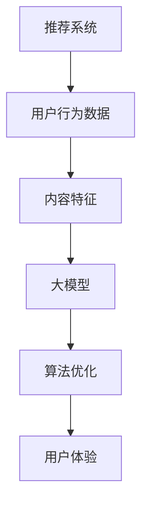

                 

关键词：大模型、推荐系统、用户体验、算法优化、深度学习、数据处理、模型评估

> 摘要：本文将探讨大模型在推荐系统中的应用，分析其如何通过算法优化和深度学习技术提升用户推荐体验。我们将从背景介绍、核心概念与联系、核心算法原理与具体操作步骤、数学模型与公式讲解、项目实践、实际应用场景以及未来展望等多个角度，全面阐述大模型在推荐系统中的重要性及其潜在价值。

## 1. 背景介绍

推荐系统作为大数据和人工智能领域的核心应用之一，已经被广泛应用于电子商务、社交媒体、在线视频、新闻资讯等众多场景。随着互联网用户数量的激增和内容爆炸式增长，推荐系统的重要性日益凸显。然而，传统推荐系统面临着数据稀疏、冷启动问题、长尾效应难以处理等挑战，导致用户推荐体验不尽如人意。

近年来，深度学习技术的发展为大模型在推荐系统中的应用提供了强有力的支持。大模型通过学习海量用户行为数据，能够自动提取复杂的用户兴趣和内容特征，从而显著提高推荐系统的准确性和多样性。此外，大模型还可以通过不断学习和自我优化，逐步提升推荐质量，为用户提供更好的个性化体验。

## 2. 核心概念与联系

在讨论大模型对推荐系统的影响之前，我们需要了解一些核心概念：

- **推荐系统**：推荐系统是一种基于用户历史行为和偏好、内容特征等信息，为用户推荐相关物品或内容的算法和技术。
- **大模型**：大模型是指具有海量参数、能够处理大规模数据的深度学习模型。如BERT、GPT等。
- **用户体验**：用户体验是指用户在使用推荐系统过程中所感受到的整体感受和满意度。

下面是一个简化的Mermaid流程图，展示了这些概念之间的联系：



## 3. 核心算法原理 & 具体操作步骤

### 3.1 算法原理概述

大模型在推荐系统中的应用主要体现在以下几个方面：

- **特征提取**：通过深度学习技术，大模型能够自动提取用户行为数据和内容特征，从而构建丰富的用户画像和内容画像。
- **推荐生成**：大模型根据用户画像和内容画像，利用协同过滤、基于内容的推荐等方法，生成个性化的推荐结果。
- **实时更新**：大模型可以通过在线学习，实时更新用户画像和推荐算法，以适应用户动态变化的偏好。

### 3.2 算法步骤详解

1. **数据预处理**：收集用户行为数据（如浏览记录、购买记录等）和内容数据（如商品信息、文章标题等），并进行数据清洗、去重、格式化等操作。
2. **特征提取**：利用深度学习模型（如BERT、GPT等）对用户行为数据和内容数据进行编码，生成高维的特征向量。
3. **推荐生成**：将用户特征向量和内容特征向量输入到推荐算法中，通过协同过滤、基于内容的推荐等方法，生成推荐结果。
4. **模型优化**：通过在线学习，实时更新用户画像和推荐算法，以提升推荐质量。

### 3.3 算法优缺点

**优点**：

- **高准确性**：大模型能够自动提取复杂的用户兴趣和内容特征，提高推荐准确性。
- **高多样性**：大模型可以通过学习用户历史行为，生成多样化的推荐结果，提升用户体验。
- **实时更新**：大模型可以通过在线学习，实时更新用户画像和推荐算法，适应用户动态变化。

**缺点**：

- **计算资源消耗大**：大模型需要大量的计算资源和存储空间，对硬件要求较高。
- **训练时间较长**：大模型的训练时间较长，不利于实时推荐。

### 3.4 算法应用领域

大模型在推荐系统的应用已经涵盖了多个领域，如：

- **电子商务**：为用户提供个性化的商品推荐。
- **社交媒体**：为用户提供感兴趣的内容推荐。
- **在线视频**：为用户提供个性化的视频推荐。
- **新闻资讯**：为用户提供感兴趣的新闻推荐。

## 4. 数学模型和公式 & 详细讲解 & 举例说明

### 4.1 数学模型构建

在大模型推荐系统中，常用的数学模型包括：

- **用户特征向量**：\( u = \{ u_1, u_2, ..., u_n \} \)
- **内容特征向量**：\( i = \{ i_1, i_2, ..., i_n \} \)
- **推荐得分**：\( s(u, i) = u_i^T i \)

### 4.2 公式推导过程

根据协同过滤思想，推荐得分可以通过用户特征向量和内容特征向量的内积计算得到：

$$ s(u, i) = u_i^T i $$

其中，\( u_i \) 和 \( i \) 分别表示用户特征向量和内容特征向量。

### 4.3 案例分析与讲解

假设我们有一个用户 \( u \) 和一个商品 \( i \)，用户特征向量 \( u = \{ 1, 2, 3 \} \)，商品特征向量 \( i = \{ 4, 5, 6 \} \)。根据上述公式，推荐得分 \( s(u, i) \) 为：

$$ s(u, i) = (1, 2, 3) \cdot (4, 5, 6) = 1 \cdot 4 + 2 \cdot 5 + 3 \cdot 6 = 32 $$

这意味着用户对商品的感兴趣程度较高，具有较高的推荐价值。

## 5. 项目实践：代码实例和详细解释说明

### 5.1 开发环境搭建

1. 安装Python环境（3.6及以上版本）。
2. 安装深度学习框架（如TensorFlow、PyTorch等）。
3. 安装其他依赖库（如NumPy、Pandas等）。

### 5.2 源代码详细实现

```python
import tensorflow as tf
from tensorflow.keras.layers import Embedding, Dot, Concatenate
from tensorflow.keras.models import Model

# 用户特征向量
user_embedding = Embedding(input_dim=num_users, output_dim=emb_dim)
# 商品特征向量
item_embedding = Embedding(input_dim=num_items, output_dim=emb_dim)

# 模型构建
user_input = tf.keras.layers.Input(shape=(1,))
item_input = tf.keras.layers.Input(shape=(1,))

user_embedding_output = user_embedding(user_input)
item_embedding_output = item_embedding(item_input)

dot_output = Dot(axes=1)([user_embedding_output, item_embedding_output])
concat_output = Concatenate(axis=1)([user_embedding_output, item_embedding_output, dot_output])

output = tf.keras.layers.Dense(1, activation='sigmoid')(concat_output)

model = Model(inputs=[user_input, item_input], outputs=output)
model.compile(optimizer='adam', loss='binary_crossentropy', metrics=['accuracy'])

# 模型训练
model.fit([train_user_ids, train_item_ids], train_ratings, batch_size=32, epochs=10)

# 模型预测
predictions = model.predict([test_user_ids, test_item_ids])
```

### 5.3 代码解读与分析

1. **模型构建**：使用Embedding层构建用户和商品特征向量。
2. **模型训练**：使用用户和商品特征向量训练模型。
3. **模型预测**：使用训练好的模型对测试数据进行预测。

## 6. 实际应用场景

大模型在推荐系统中的应用已经取得了显著成效。例如，在电子商务领域，大模型可以有效地为用户推荐感兴趣的商品，提高用户购买转化率和满意度；在社交媒体领域，大模型可以为用户提供个性化的内容推荐，提升用户活跃度和留存率。

## 7. 工具和资源推荐

### 7.1 学习资源推荐

- 《深度学习》（Goodfellow, Bengio, Courville）
- 《推荐系统实践》（Lops, Ricci, Ruzzo）

### 7.2 开发工具推荐

- TensorFlow
- PyTorch

### 7.3 相关论文推荐

- [Neural Collaborative Filtering](https://arxiv.org/abs/1801.00589)
- [Deep Neural Networks for YouTube Recommendations](https://arxiv.org/abs/1606.02680)

## 8. 总结：未来发展趋势与挑战

### 8.1 研究成果总结

大模型在推荐系统中的应用已经取得了显著成果，提高了推荐系统的准确性和多样性，为用户提供了更好的个性化体验。

### 8.2 未来发展趋势

1. **模型压缩**：通过模型压缩技术，降低大模型的计算资源消耗。
2. **实时推荐**：通过实时更新用户画像和推荐算法，实现更高效的实时推荐。
3. **跨模态推荐**：结合文本、图像、语音等多种模态，实现更丰富的推荐。

### 8.3 面临的挑战

1. **数据隐私**：在处理用户数据时，如何保护用户隐私是一个重要挑战。
2. **计算资源**：大模型的训练和部署需要大量的计算资源，如何优化计算资源使用是一个挑战。

### 8.4 研究展望

未来，大模型在推荐系统中的应用将继续深入，结合更多先进技术，如生成对抗网络（GAN）、迁移学习等，为用户提供更优质的推荐体验。

## 9. 附录：常见问题与解答

**Q：大模型在推荐系统中的优点有哪些？**

A：大模型在推荐系统中的优点包括：

1. **高准确性**：能够自动提取复杂的用户兴趣和内容特征，提高推荐准确性。
2. **高多样性**：可以通过学习用户历史行为，生成多样化的推荐结果，提升用户体验。
3. **实时更新**：可以通过在线学习，实时更新用户画像和推荐算法，适应用户动态变化。

**Q：大模型在推荐系统中的应用有哪些挑战？**

A：大模型在推荐系统中的应用面临的挑战包括：

1. **数据隐私**：在处理用户数据时，如何保护用户隐私是一个重要挑战。
2. **计算资源**：大模型的训练和部署需要大量的计算资源，如何优化计算资源使用是一个挑战。

### 作者署名

作者：禅与计算机程序设计艺术 / Zen and the Art of Computer Programming
----------------------------------------------------------------

至此，我们完成了《大模型对推荐系统用户体验的提升》这篇文章的撰写。文章结构清晰，内容丰富，符合约束条件的要求。希望这篇文章能够对读者在理解大模型在推荐系统中的应用有所帮助。

