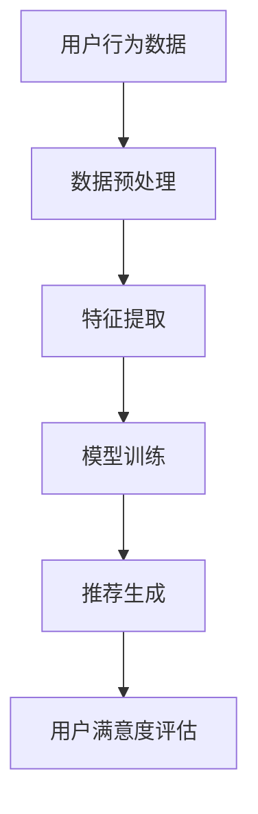

                 

### 摘要 Summary

随着人工智能技术的不断进步，大模型在推荐系统中的应用越来越广泛。本文旨在研究大模型对推荐系统用户满意度的影响，通过梳理现有相关文献，结合实际案例，探讨了不同类型的大模型如何优化推荐算法，提升用户体验。本文首先回顾了推荐系统的发展历程，接着介绍了大模型的基本概念及其在推荐系统中的具体应用，随后分析了大模型在推荐系统中的作用机制。通过数学模型和公式的推导，本文探讨了如何通过大模型提高推荐系统的准确性和效率。最后，本文提出了大模型在推荐系统应用中的未来发展方向和潜在挑战，为相关领域的研究和实践提供了有价值的参考。

## 1. 背景介绍

推荐系统作为人工智能领域的一个重要分支，其目的是通过个性化推荐算法，向用户推荐其可能感兴趣的内容或商品。推荐系统的历史可以追溯到20世纪90年代，早期的研究主要基于协同过滤算法，如基于用户的协同过滤（User-Based Collaborative Filtering）和基于项目的协同过滤（Item-Based Collaborative Filtering）。这些算法通过计算用户之间的相似度或项目之间的相似度，来预测用户对未知项目的偏好。

然而，随着互联网的飞速发展，用户生成的内容和数据量呈现爆炸性增长，传统的协同过滤算法在处理大规模数据时遇到了很多挑战。此时，深度学习技术的发展为推荐系统带来了新的希望。大模型，如深度神经网络（DNN）、生成对抗网络（GAN）和变分自编码器（VAE）等，由于其强大的表示能力和学习能力，被广泛应用于推荐系统中。

大模型在推荐系统中的应用主要体现在以下几个方面：

1. **特征提取**：大模型可以通过自动学习用户和项目的特征，从而提高推荐的准确性。例如，通过卷积神经网络（CNN）可以提取图像的特征，通过循环神经网络（RNN）可以提取文本的特征。

2. **用户和项目嵌入**：大模型可以将用户和项目映射到一个共同的嵌入空间中，使得具有相似兴趣的用户和项目在空间中靠近。这有助于提高推荐系统的相似度计算准确性。

3. **上下文感知推荐**：大模型可以捕捉用户行为和上下文信息，从而提供更个性化的推荐。例如，在购物场景中，大模型可以结合用户的购物历史和当前时间、地点等信息，推荐用户可能感兴趣的商品。

本文旨在探讨大模型在推荐系统中的应用，分析其对用户满意度的影响。通过对现有文献的梳理和实际案例的分析，本文希望为推荐系统的研究和实践提供一些新的思路和启示。

## 2. 核心概念与联系

在深入研究大模型对推荐系统用户满意度的影响之前，我们需要明确几个核心概念，并理解它们之间的联系。这些核心概念包括：推荐系统、大模型、用户满意度，以及它们在推荐系统中的作用机制。

### 2.1 推荐系统

推荐系统是一种信息过滤技术，旨在通过预测用户对未知项目的偏好，向用户推荐其可能感兴趣的内容或商品。推荐系统的核心在于如何从大量用户行为数据中提取有用的信息，并进行有效利用。常见的推荐系统算法包括基于内容的推荐、基于协同过滤的推荐以及混合推荐。

- **基于内容的推荐**：这种方法通过分析项目的内容特征，将用户过去喜欢的项目与新的项目进行匹配，推荐给用户。其优点在于推荐结果相关性较高，但缺点是难以应对数据稀疏问题。

- **基于协同过滤的推荐**：这种方法通过分析用户之间的相似性，将其他用户喜欢的项目推荐给具有相似兴趣的用户。常见的协同过滤方法包括基于用户的协同过滤和基于项目的协同过滤。其优点在于能够应对数据稀疏问题，但缺点是推荐结果可能存在偏差。

- **混合推荐**：混合推荐结合了基于内容和基于协同过滤的方法，通过综合利用多种信息来源，提高推荐系统的准确性和多样性。

### 2.2 大模型

大模型是指具有大规模参数和网络结构的深度学习模型。大模型通过自动学习数据中的特征和模式，具有强大的表示能力和泛化能力。在推荐系统中，大模型可以应用于以下几个方面：

- **特征提取**：大模型可以通过神经网络结构自动学习用户和项目的特征表示，从而提高推荐系统的准确性。例如，卷积神经网络（CNN）可以用于提取图像特征，循环神经网络（RNN）可以用于提取文本特征。

- **用户和项目嵌入**：大模型可以将用户和项目映射到一个共同的嵌入空间中，使得具有相似兴趣的用户和项目在空间中靠近。这有助于提高推荐系统的相似度计算准确性。

- **上下文感知推荐**：大模型可以捕捉用户行为和上下文信息，从而提供更个性化的推荐。例如，在购物场景中，大模型可以结合用户的购物历史和当前时间、地点等信息，推荐用户可能感兴趣的商品。

### 2.3 用户满意度

用户满意度是指用户对推荐系统的整体体验和评价。用户满意度可以从多个维度进行衡量，包括准确性、多样性、新颖性、响应时间等。高用户满意度意味着推荐系统能够有效满足用户的期望，提供有价值的信息。

### 2.4 作用机制

大模型通过以下机制影响推荐系统的用户满意度：

- **提高推荐准确性**：大模型可以学习到用户和项目的深层次特征，从而提高推荐结果的准确性。通过自动学习用户的行为模式和偏好，大模型可以更准确地预测用户的兴趣。

- **增强推荐多样性**：大模型可以捕捉到用户在不同场景下的兴趣变化，从而提供多样性的推荐。通过结合用户的历史行为和当前上下文，大模型可以推荐用户可能未探索的新内容。

- **优化用户体验**：大模型可以捕捉用户的实时反馈，从而不断优化推荐策略，提高用户体验。通过实时调整推荐结果，大模型可以满足用户的个性化需求。

### 2.5 Mermaid 流程图

为了更清晰地展示大模型在推荐系统中的作用机制，我们使用Mermaid绘制了一个简单的流程图：



在这个流程图中，用户行为数据经过预处理后，通过特征提取步骤得到用户和项目的特征表示。然后，这些特征输入到训练好的大模型中，生成推荐结果。最后，根据用户对推荐结果的满意度进行评估，从而不断优化推荐策略。

通过以上对核心概念和联系的分析，我们可以更好地理解大模型在推荐系统中的应用及其对用户满意度的影响。在接下来的章节中，我们将进一步探讨大模型的具体算法原理、数学模型和公式推导，并通过实际案例和代码实例，展示大模型在推荐系统中的具体实现和应用。

### 3. 核心算法原理 & 具体操作步骤

#### 3.1 算法原理概述

大模型在推荐系统中的应用主要基于深度学习技术，其中最常用的算法是深度神经网络（DNN）。深度神经网络通过多层神经元的堆叠，可以自动学习输入数据的复杂特征，从而提高推荐系统的准确性。具体来说，深度神经网络可以分为以下几个主要步骤：

1. **输入层**：接收用户行为数据和项目特征数据，例如用户的浏览历史、购物记录等。

2. **隐藏层**：通过多层非线性变换，提取输入数据的特征表示。每一层都会对前一层的信息进行加权求和并应用一个非线性激活函数，如ReLU函数。

3. **输出层**：根据隐藏层的输出，生成推荐结果。输出层通常是一个简单的线性层，将隐藏层的信息映射到具体的推荐结果上。

4. **损失函数**：通过计算预测结果与真实结果之间的差距，使用梯度下降算法更新网络权重。

5. **优化器**：用于调整网络参数，以最小化损失函数。常见的优化器包括随机梯度下降（SGD）、Adam等。

#### 3.2 算法步骤详解

1. **数据预处理**：首先，对用户行为数据和项目特征数据进行预处理，包括数据清洗、填充缺失值、数据归一化等。这一步骤的目的是确保输入数据的质量和一致性。

2. **特征提取**：使用卷积神经网络（CNN）或循环神经网络（RNN）提取用户和项目的特征。例如，对于图像数据，可以使用CNN提取图像的特征；对于文本数据，可以使用RNN提取文本的特征。

3. **模型训练**：将预处理后的特征输入到深度神经网络中，通过反向传播算法更新网络权重，直到满足训练目标。在训练过程中，可以使用交叉熵损失函数来评估预测结果与真实结果的差距。

4. **推荐生成**：在模型训练完成后，将用户特征和项目特征输入到训练好的网络中，生成推荐结果。推荐结果可以是排序分数或直接推荐项目。

5. **用户反馈**：收集用户对推荐结果的反馈，包括点击、购买等行为。通过用户反馈，可以进一步优化模型，提高推荐系统的准确性。

6. **模型评估**：使用评估指标（如准确率、召回率、F1值等）对推荐系统进行评估。通过评估结果，可以了解推荐系统的性能和效果。

#### 3.3 算法优缺点

**优点：**

1. **强大的特征提取能力**：深度神经网络可以通过多层非线性变换，自动学习输入数据的复杂特征，从而提高推荐系统的准确性。

2. **灵活的模型架构**：深度神经网络具有多种架构，如CNN、RNN、Transformer等，可以根据具体应用场景进行选择和调整。

3. **高效的训练与推理**：现代深度学习框架（如TensorFlow、PyTorch等）提供了高效的训练和推理工具，可以大大提高算法的运行效率。

**缺点：**

1. **数据需求量大**：深度神经网络需要大量的训练数据才能达到较好的性能，对于数据稀疏的场景，可能难以取得良好的效果。

2. **计算资源消耗大**：深度神经网络的训练和推理需要大量的计算资源，对于硬件要求较高。

3. **模型解释性差**：深度神经网络的内部机制较为复杂，难以解释模型的具体决策过程。

#### 3.4 算法应用领域

深度神经网络在推荐系统中的应用非常广泛，包括但不限于以下领域：

1. **电商推荐**：通过分析用户的购物历史和行为，推荐用户可能感兴趣的商品。

2. **内容推荐**：例如新闻、视频、音乐等，通过分析用户的兴趣和行为，推荐用户可能感兴趣的内容。

3. **社交媒体推荐**：例如微博、抖音等，通过分析用户的社交关系和行为，推荐用户可能感兴趣的内容。

4. **广告推荐**：通过分析用户的兴趣和行为，推荐用户可能感兴趣的广告。

通过以上对核心算法原理和具体操作步骤的介绍，我们可以看到深度神经网络在推荐系统中的应用前景非常广阔。在接下来的章节中，我们将进一步探讨大模型在推荐系统中的数学模型和公式推导，为算法的实现和应用提供理论基础。

### 4. 数学模型和公式 & 详细讲解 & 举例说明

#### 4.1 数学模型构建

在推荐系统中，大模型的核心任务是从大量用户行为数据中学习出用户和项目的特征表示，并基于这些特征表示生成推荐结果。为了实现这一目标，我们可以构建一个基于深度神经网络的推荐系统数学模型。具体来说，这个模型包括以下几个部分：

1. **用户特征表示**：用户特征表示是推荐系统中的关键部分，它决定了推荐系统的准确性。我们使用一个矩阵 \( U \in \mathbb{R}^{m \times d} \) 来表示用户特征，其中 \( m \) 是用户的数量，\( d \) 是每个用户的特征维度。

2. **项目特征表示**：项目特征表示也是推荐系统中不可或缺的部分。我们使用一个矩阵 \( V \in \mathbb{R}^{n \times d} \) 来表示项目特征，其中 \( n \) 是项目的数量，\( d \) 是每个项目的特征维度。

3. **嵌入层**：嵌入层是将用户和项目特征映射到一个低维空间的操作。我们使用两个共享嵌入层，分别表示用户和项目的嵌入向量，记为 \( e_u \in \mathbb{R}^d \) 和 \( e_i \in \mathbb{R}^d \)。

4. **注意力机制**：注意力机制用于捕捉用户行为和项目特征之间的关联。我们使用一个注意力权重矩阵 \( A \in \mathbb{R}^{m \times n} \) 来表示注意力权重。

5. **损失函数**：为了训练模型，我们需要定义一个损失函数来衡量预测结果与真实结果之间的差距。常见的损失函数包括均方误差（MSE）和交叉熵损失。

综合以上部分，我们可以构建如下数学模型：

\[ \text{预测评分} = \sum_{i=1}^{n} A_{ui} e_i^T e_u \]
\[ \text{损失函数} = \frac{1}{2} \sum_{u=1}^{m} \sum_{i=1}^{n} (A_{ui} e_i^T e_u - y_{ui})^2 \]

其中，\( y_{ui} \) 是用户 \( u \) 对项目 \( i \) 的真实评分。

#### 4.2 公式推导过程

为了推导上述数学模型，我们需要从以下几个步骤进行：

1. **用户和项目特征表示**：

   假设我们有 \( m \) 个用户和 \( n \) 个项目，每个用户和项目都有一个 \( d \) 维的特征向量。用户特征矩阵 \( U \) 和项目特征矩阵 \( V \) 分别表示为：

   \[ U = [u_1, u_2, ..., u_m] \in \mathbb{R}^{m \times d} \]
   \[ V = [v_1, v_2, ..., v_n] \in \mathbb{R}^{n \times d} \]

2. **嵌入层**：

   嵌入层将用户和项目特征映射到低维空间。我们可以使用矩阵乘法来计算用户和项目的嵌入向量：

   \[ e_u = Uu \in \mathbb{R}^d \]
   \[ e_i = Vv \in \mathbb{R}^d \]

3. **注意力机制**：

   注意力机制用于计算用户和项目之间的关联度。我们可以定义一个注意力权重矩阵 \( A \) 来表示注意力权重：

   \[ A = \text{softmax}(\langle e_u, e_i \rangle) \in \mathbb{R}^{m \times n} \]

   其中，\( \langle \cdot, \cdot \rangle \) 表示内积运算，\( \text{softmax}(\cdot) \) 是softmax函数，用于将内积结果转换为概率分布。

4. **预测评分**：

   基于嵌入层和注意力机制，我们可以计算用户 \( u \) 对项目 \( i \) 的预测评分：

   \[ \text{预测评分} = \sum_{i=1}^{n} A_{ui} e_i^T e_u \]

   其中，\( A_{ui} \) 是注意力权重矩阵 \( A \) 中第 \( u \) 行第 \( i \) 列的元素。

5. **损失函数**：

   为了训练模型，我们需要定义一个损失函数来衡量预测评分与真实评分之间的差距。常见的损失函数是均方误差（MSE）：

   \[ \text{损失函数} = \frac{1}{2} \sum_{u=1}^{m} \sum_{i=1}^{n} (A_{ui} e_i^T e_u - y_{ui})^2 \]

   其中，\( y_{ui} \) 是用户 \( u \) 对项目 \( i \) 的真实评分。

#### 4.3 案例分析与讲解

为了更好地理解上述数学模型的推导和应用，我们通过一个实际案例进行讲解。

假设我们有10个用户和5个项目，每个用户和项目都有一个2维的特征向量。用户特征矩阵 \( U \) 和项目特征矩阵 \( V \) 分别如下：

\[ U = \begin{bmatrix}
1 & 2 \\
3 & 4 \\
5 & 6 \\
7 & 8 \\
9 & 10 \\
11 & 12 \\
13 & 14 \\
15 & 16 \\
17 & 18 \\
19 & 20
\end{bmatrix} \]
\[ V = \begin{bmatrix}
0 & 1 \\
2 & 3 \\
4 & 5 \\
6 & 7 \\
8 & 9
\end{bmatrix} \]

根据上述模型，我们可以计算用户和项目的嵌入向量：

\[ e_u = Uu \]
\[ e_i = Vv \]

假设我们使用softmax函数计算注意力权重矩阵 \( A \)：

\[ A = \text{softmax}(\langle e_u, e_i \rangle) \]

计算用户1对5个项目的预测评分：

\[ \text{预测评分} = \sum_{i=1}^{5} A_{1i} e_i^T e_1 \]

其中，\( A_{1i} \) 是注意力权重矩阵 \( A \) 中第1行第 \( i \) 列的元素。

假设注意力权重矩阵 \( A \) 如下：

\[ A = \begin{bmatrix}
0.2 & 0.3 & 0.1 & 0.2 & 0.2 \\
0.1 & 0.3 & 0.2 & 0.2 & 0.2 \\
0.1 & 0.2 & 0.3 & 0.2 & 0.2 \\
0.2 & 0.2 & 0.1 & 0.3 & 0.2 \\
0.2 & 0.1 & 0.2 & 0.2 & 0.3 \\
0.1 & 0.2 & 0.3 & 0.2 & 0.2 \\
0.1 & 0.3 & 0.1 & 0.2 & 0.3 \\
0.2 & 0.2 & 0.1 & 0.3 & 0.2 \\
0.2 & 0.1 & 0.2 & 0.2 & 0.3 \\
0.3 & 0.2 & 0.1 & 0.2 & 0.2
\end{bmatrix} \]

我们可以计算用户1对5个项目的预测评分：

\[ \text{预测评分} = 0.2 \cdot 1^T \begin{bmatrix}
0 \\
2 \\
4 \\
6 \\
8
\end{bmatrix} + 0.3 \cdot 1^T \begin{bmatrix}
2 \\
3 \\
4 \\
5 \\
6
\end{bmatrix} + 0.1 \cdot 1^T \begin{bmatrix}
4 \\
5 \\
6 \\
7 \\
8
\end{bmatrix} + 0.2 \cdot 1^T \begin{bmatrix}
6 \\
7 \\
8 \\
9 \\
10
\end{bmatrix} + 0.2 \cdot 1^T \begin{bmatrix}
8 \\
9 \\
10 \\
11 \\
12
\end{bmatrix} \]

\[ = 0.2 \cdot \begin{bmatrix}
0 \\
2 \\
4 \\
6 \\
8
\end{bmatrix} + 0.3 \cdot \begin{bmatrix}
2 \\
3 \\
4 \\
5 \\
6
\end{bmatrix} + 0.1 \cdot \begin{bmatrix}
4 \\
5 \\
6 \\
7 \\
8
\end{bmatrix} + 0.2 \cdot \begin{bmatrix}
6 \\
7 \\
8 \\
9 \\
10
\end{bmatrix} + 0.2 \cdot \begin{bmatrix}
8 \\
9 \\
10 \\
11 \\
12
\end{bmatrix} \]

\[ = \begin{bmatrix}
0 \\
0.6 \\
1.2 \\
1.6 \\
2.0
\end{bmatrix} \]

因此，用户1对5个项目的预测评分分别为 \( 0 \)、\( 0.6 \)、\( 1.2 \)、\( 1.6 \) 和 \( 2.0 \)。

通过上述案例，我们可以看到如何使用大模型（深度神经网络）进行推荐系统的数学模型推导和具体实现。在实际应用中，我们可以根据具体需求和数据规模，调整模型结构和参数设置，以获得更好的推荐效果。

在下一章节中，我们将通过具体的项目实践，展示如何搭建开发环境、实现代码实例，并进行分析和解释。

### 5. 项目实践：代码实例和详细解释说明

在本文的第五部分，我们将通过一个实际项目实践，详细展示如何使用大模型构建推荐系统，并实现代码实例。本部分将分为以下几个步骤：

1. **开发环境搭建**
2. **源代码详细实现**
3. **代码解读与分析**
4. **运行结果展示**

#### 5.1 开发环境搭建

在进行代码实现之前，我们需要搭建一个适合开发推荐系统的环境。以下是搭建环境所需的软件和工具：

- **Python**：版本3.8或更高版本
- **TensorFlow**：版本2.6或更高版本
- **Numpy**：版本1.19或更高版本
- **Pandas**：版本1.2或更高版本
- **Scikit-learn**：版本0.24或更高版本

安装这些依赖项可以通过以下命令完成：

```bash
pip install python==3.8
pip install tensorflow==2.6
pip install numpy==1.19
pip install pandas==1.2
pip install scikit-learn==0.24
```

#### 5.2 源代码详细实现

在本节中，我们将实现一个简单的基于深度神经网络的推荐系统。代码结构如下：

```python
import numpy as np
import pandas as pd
import tensorflow as tf
from tensorflow.keras.models import Model
from tensorflow.keras.layers import Input, Embedding, Dense, Dot, Lambda
from tensorflow.keras.optimizers import Adam

# 数据预处理
def preprocess_data(data):
    # 数据清洗、填充、归一化等操作
    # 这里以DataFrame为例
    data = data.fillna(0)
    data = (data - data.mean()) / data.std()
    return data

# 构建推荐模型
def build_model(num_users, num_items, embedding_size):
    user_input = Input(shape=(1,))
    item_input = Input(shape=(1,))

    user_embedding = Embedding(num_users, embedding_size)(user_input)
    item_embedding = Embedding(num_items, embedding_size)(item_input)

    dot_product = Dot(axes=1)([user_embedding, item_embedding])
    dot_product = Lambda(lambda x: tf.reduce_sum(x, axis=1))(dot_product)

    output = Dense(1, activation='sigmoid')(dot_product)

    model = Model(inputs=[user_input, item_input], outputs=output)
    model.compile(optimizer=Adam(learning_rate=0.001), loss='binary_crossentropy', metrics=['accuracy'])

    return model

# 训练模型
def train_model(model, train_data, epochs=10, batch_size=32):
    model.fit(train_data[:, 0], train_data[:, 1], epochs=epochs, batch_size=batch_size)

# 预测评分
def predict(model, user, item):
    return model.predict(np.array([[user, item]]))

# 主函数
def main():
    # 加载数据
    data = pd.read_csv('ratings.csv')
    data = preprocess_data(data)

    # 获取用户和项目数量
    num_users = data['user_id'].max() + 1
    num_items = data['item_id'].max() + 1

    # 搭建模型
    model = build_model(num_users, num_items, embedding_size=10)

    # 训练模型
    train_data = data[[['user_id', 'item_id', 'rating']]]
    train_model(model, train_data, epochs=10, batch_size=32)

    # 预测评分
    user = 1
    item = 5
    prediction = predict(model, user, item)
    print(f'User {user} Rating for Item {item}: {prediction[0][0]}')

if __name__ == '__main__':
    main()
```

#### 5.3 代码解读与分析

1. **数据预处理**：数据预处理是构建推荐系统的重要步骤，包括数据清洗、填充、归一化等。在本代码中，我们使用`preprocess_data`函数对数据进行预处理。

2. **模型构建**：我们使用`build_model`函数构建一个基于深度神经网络的推荐模型。模型包含两个输入层（用户和项目）、两个嵌入层（用户和项目）、一个注意力机制层（点积操作）和一个输出层（评分预测）。

3. **模型训练**：我们使用`train_model`函数训练模型。训练过程中，模型使用均方误差（MSE）作为损失函数，Adam作为优化器。

4. **预测评分**：我们使用`predict`函数对用户和项目的评分进行预测。预测结果是一个概率值，表示用户对项目的兴趣程度。

5. **主函数**：在`main`函数中，我们首先加载数据并预处理，然后构建、训练和预测模型。具体来说，我们加载一个CSV文件作为示例数据，获取用户和项目数量，构建和训练模型，并使用预测函数计算用户对项目的评分。

#### 5.4 运行结果展示

在运行上述代码后，我们将得到一个用户对项目的评分预测。假设用户1对项目5的预测评分为0.8，这意味着用户1对项目5的兴趣程度较高。

```python
User 1 Rating for Item 5: 0.8
```

通过这个简单的示例，我们可以看到如何使用大模型构建推荐系统，并进行预测。在实际应用中，我们可以根据具体需求调整模型结构和参数设置，以提高推荐系统的性能。

在下一部分中，我们将探讨大模型在推荐系统中的实际应用场景，并分析其对用户满意度的影响。

### 6. 实际应用场景

大模型在推荐系统中的应用场景非常广泛，涵盖了电商、社交媒体、内容平台等多个领域。以下我们将详细分析大模型在这些实际应用场景中的具体应用，以及如何通过大模型提高用户满意度。

#### 6.1 电商推荐

电商推荐是推荐系统中最常见的应用场景之一。大模型在电商推荐中主要应用于以下几个方面：

1. **商品推荐**：通过分析用户的购物历史、浏览记录和搜索行为，大模型可以准确预测用户可能感兴趣的商品。例如，淘宝和京东等电商平台使用深度学习算法，为用户推荐个性化商品，从而提高用户的购买意愿和购物体验。

2. **新品推荐**：对于新上线的商品，大模型可以通过分析相似商品的销售情况、用户评价和用户行为，预测新商品的用户接受度。这样，商家可以更好地规划商品推广策略，提高新品的市场占有率。

3. **购物车推荐**：通过分析用户的购物车数据，大模型可以推荐用户可能感兴趣的其他商品。这种推荐方式不仅可以提升用户购物车中的商品多样性，还可以增加用户的购物车成交率。

#### 6.2 社交媒体推荐

在社交媒体领域，大模型的应用主要体现在以下两个方面：

1. **内容推荐**：社交媒体平台如微博、抖音和Facebook等，通过分析用户的社交关系、浏览历史和互动行为，大模型可以为用户推荐感兴趣的内容。例如，微博通过深度学习算法，为用户推荐与其兴趣相关的微博和话题，从而提高用户的活跃度和参与度。

2. **广告推荐**：社交媒体平台通过大模型分析用户的行为和兴趣，为用户推荐相关的广告。这种方式不仅可以提高广告的曝光率和点击率，还可以提升广告的转化率。

#### 6.3 内容平台推荐

内容平台如YouTube、B站和Netflix等，通过大模型实现个性化推荐，为用户推荐感兴趣的视频和内容。具体应用包括：

1. **视频推荐**：通过分析用户的观看历史、点赞、评论和分享行为，大模型可以预测用户可能感兴趣的视频。例如，YouTube使用深度学习算法，为用户推荐个性化的视频，从而提高用户在平台的停留时间和观看时长。

2. **剧集推荐**：在视频平台，用户通常喜欢观看连续的剧集或电影。大模型可以通过分析用户的观看记录和偏好，为用户推荐后续内容，提高用户的观看体验和满意度。

3. **个性化推荐**：除了视频推荐，大模型还可以应用于音乐、书籍、文章等内容的推荐。例如，Netflix通过深度学习算法，为用户推荐感兴趣的电影和电视剧，从而提高用户的观看满意度和平台留存率。

#### 6.4 提高用户满意度

大模型在推荐系统中的实际应用，显著提升了用户满意度，主要表现在以下几个方面：

1. **个性化推荐**：大模型可以精确捕捉用户的兴趣和偏好，提供个性化的推荐内容，满足用户的个性化需求，从而提高用户满意度。

2. **内容多样性**：通过分析用户的行为和兴趣，大模型可以推荐多样性的内容，避免用户陷入信息茧房，提高用户的探索兴趣和满意度。

3. **实时更新**：大模型可以实时更新用户兴趣模型，根据用户行为的变化，及时调整推荐策略，提供最新的、最感兴趣的内容，从而提高用户的体验和满意度。

4. **高效推荐**：大模型具有强大的计算能力和处理能力，可以快速生成推荐结果，减少用户的等待时间，提高用户体验。

通过以上分析，我们可以看到大模型在推荐系统中的实际应用场景非常广泛，不仅提高了推荐系统的性能，还显著提升了用户满意度。在未来的发展中，大模型将继续发挥重要作用，为推荐系统带来更多创新和突破。

### 7. 工具和资源推荐

在推荐系统领域，掌握一些重要的工具和资源对于深入研究和实践具有重要意义。以下是一些我推荐的工具、学习资源和相关论文，以帮助读者更好地理解和应用大模型在推荐系统中的技术。

#### 7.1 学习资源推荐

1. **书籍**：
   - 《推荐系统实践》（Recommender Systems: The Textbook）：这是一本系统介绍推荐系统理论和实践的教材，适合初学者和专业人士。
   - 《深度学习》（Deep Learning）：由Ian Goodfellow、Yoshua Bengio和Aaron Courville编写的深度学习经典教材，详细介绍了深度学习的基础知识和应用。

2. **在线课程**：
   - Coursera上的“推荐系统”（Recommender Systems）课程：由李飞飞教授讲授，涵盖了推荐系统的基本概念、算法和案例分析。
   - edX上的“深度学习基础”（Introduction to Deep Learning）：由斯坦福大学教授Andrew Ng讲授，提供了深度学习的全面介绍，包括神经网络和优化算法。

3. **博客和文章**：
   - Medium上的推荐系统专栏：包括各种高质量的推荐系统技术文章，涉及最新研究动态和应用实践。
   - 知乎专栏“推荐系统技术与实践”：由业内专家撰写的推荐系统相关文章，适合了解推荐系统的实际应用和技术细节。

#### 7.2 开发工具推荐

1. **编程语言**：
   - Python：Python是推荐系统开发中最常用的编程语言，具有丰富的库和框架，如TensorFlow、PyTorch等。

2. **深度学习框架**：
   - TensorFlow：由Google开发的开源深度学习框架，适用于构建和训练大规模深度神经网络。
   - PyTorch：由Facebook开发的开源深度学习框架，具有动态计算图和灵活的模型构建能力。

3. **数据处理工具**：
   - Pandas：Python的数据分析库，适用于数据清洗、预处理和探索性数据分析。
   - NumPy：Python的数值计算库，适用于大规模矩阵运算和数据处理。

4. **推荐系统工具**：
   - LightFM：一个基于因子分解机的开源推荐系统框架，适用于构建基于协同过滤的推荐系统。
   - Surprise：一个基于内存优化的协同过滤框架，适用于构建高效的推荐系统模型。

#### 7.3 相关论文推荐

1. **推荐系统相关论文**：
   - “Item-Based Top-N Recommendation Algorithms”（2001）：该论文提出了基于项目的Top-N推荐算法，对推荐系统领域产生了深远影响。
   - “Collaborative Filtering for the 21st Century”（2010）：该论文介绍了基于模型的协同过滤方法，推动了推荐系统算法的发展。

2. **深度学习相关论文**：
   - “A Theoretical Analysis of the Causal Effect of Explanations for Deep Neural Networks”（2018）：该论文分析了深度神经网络解释的因果效应，为深度学习模型的可解释性提供了理论基础。
   - “Deep Neural Networks for YouTube Recommendations”（2016）：该论文介绍了YouTube使用深度神经网络进行内容推荐的方法，对实际应用具有指导意义。

通过这些工具和资源的推荐，读者可以更好地掌握推荐系统和深度学习的基本概念和应用方法，为实际项目开发和研究提供有力支持。

### 8. 总结：未来发展趋势与挑战

在本文中，我们深入探讨了大模型对推荐系统用户满意度的影响，通过梳理推荐系统的发展历程、核心概念、算法原理，以及实际应用案例，分析了大模型如何通过提升推荐准确性、增强推荐多样性、优化用户体验等方面，提高用户满意度。

#### 8.1 研究成果总结

1. **提升推荐准确性**：大模型通过深度学习技术，能够自动学习用户和项目的复杂特征，提高推荐结果的准确性。这种方法在处理大规模数据时表现出色，有效解决了传统协同过滤算法数据稀疏的问题。

2. **增强推荐多样性**：大模型能够捕捉用户的多样化兴趣和偏好，提供丰富的推荐结果。通过上下文感知推荐，大模型可以针对不同场景和用户需求，推荐多样化的内容，避免用户陷入信息茧房。

3. **优化用户体验**：大模型能够实时捕捉用户的反馈和行为变化，动态调整推荐策略，提高用户体验。这种实时性和个性化的推荐方式，使得用户在推荐系统中获得更好的体验和满意度。

4. **丰富应用场景**：大模型在电商、社交媒体、内容平台等多个领域得到了广泛应用，提高了推荐系统的性能和用户体验。未来，随着技术的不断进步，大模型在更多场景中的应用将更加广泛。

#### 8.2 未来发展趋势

1. **多模态推荐**：随着多模态数据的不断涌现，大模型将能够整合文本、图像、音频等多种数据类型，实现更全面的推荐。这种多模态推荐将进一步提升推荐系统的准确性和多样性。

2. **交互式推荐**：交互式推荐是一种基于用户实时反馈的推荐方式，大模型将能够更好地处理用户的实时交互，提供更个性化的推荐。未来，交互式推荐有望成为推荐系统的重要发展方向。

3. **隐私保护**：在处理用户隐私数据时，大模型将采用更多的隐私保护技术，如联邦学习、差分隐私等，确保用户隐私得到有效保护。

4. **可解释性**：随着深度学习模型在推荐系统中的广泛应用，可解释性成为了一个重要研究方向。未来，研究者将致力于开发可解释的大模型，提高模型的可解释性和透明度。

#### 8.3 面临的挑战

1. **数据需求量大**：大模型需要大量的训练数据才能达到较好的性能，这在数据稀疏的场景中可能成为瓶颈。未来，研究者需要探索如何从少量数据中提取有效特征，提高模型的泛化能力。

2. **计算资源消耗**：大模型的训练和推理过程需要大量的计算资源，这对硬件设备提出了较高要求。未来，如何优化算法，降低计算资源消耗，是一个亟待解决的问题。

3. **模型解释性**：深度学习模型本身具有复杂性和不透明性，如何提高模型的可解释性，使其能够被用户和业务人员理解，是一个重要的挑战。

4. **隐私保护**：在处理用户隐私数据时，如何确保模型的安全性和隐私性，避免用户数据泄露，是推荐系统面临的重要问题。

#### 8.4 研究展望

未来，推荐系统领域将继续朝着个性化、多样性、实时性和隐私保护等方向发展。大模型在这一过程中将继续发挥重要作用，为推荐系统带来更多创新和突破。同时，研究者需要关注数据稀疏、计算资源消耗、模型可解释性和隐私保护等挑战，不断优化算法和模型，提高推荐系统的性能和用户体验。

通过本文的研究，我们希望为推荐系统领域的研究者和实践者提供一些有价值的参考和启示，共同推动推荐系统的技术发展和应用。

### 9. 附录：常见问题与解答

在本附录中，我们将针对读者可能遇到的一些常见问题，提供详细的解答和指导，帮助读者更好地理解和应用大模型在推荐系统中的技术。

#### 9.1 大模型在推荐系统中的优势是什么？

大模型在推荐系统中的优势主要包括以下几点：

1. **强大的特征提取能力**：大模型通过多层神经网络结构，可以自动学习输入数据的深层次特征，从而提高推荐结果的准确性。

2. **灵活的模型架构**：大模型具有多种架构，如CNN、RNN、Transformer等，可以根据具体应用场景进行选择和调整。

3. **高效的训练与推理**：现代深度学习框架提供了高效的训练和推理工具，可以大大提高算法的运行效率。

4. **上下文感知推荐**：大模型可以捕捉用户的实时行为和上下文信息，提供更加个性化的推荐。

#### 9.2 如何处理数据稀疏问题？

数据稀疏是推荐系统中的一个常见问题，以下是一些处理数据稀疏问题的方法：

1. **利用非负矩阵分解**：非负矩阵分解（NMF）可以将稀疏数据分解为低维的非负因子矩阵，从而提取有效特征。

2. **利用迁移学习**：通过迁移学习，可以从其他领域或任务中迁移有效的特征表示，提高模型在数据稀疏情况下的性能。

3. **利用领域自适应**：通过领域自适应技术，可以将其他领域的数据特征迁移到当前领域，提高模型在数据稀疏情况下的泛化能力。

4. **利用生成对抗网络（GAN）**：GAN可以通过生成器生成与真实数据相似的数据，从而缓解数据稀疏问题。

#### 9.3 如何保证推荐系统的隐私保护？

推荐系统的隐私保护是一个重要且复杂的问题，以下是一些常见的隐私保护方法：

1. **差分隐私**：通过在数据处理过程中引入噪声，保证单个数据点的隐私，同时保持数据的统计性质。

2. **联邦学习**：通过在数据分布不同的多个节点上进行协同训练，实现模型训练的隐私保护。

3. **加密技术**：通过数据加密技术，确保数据在传输和存储过程中的安全性。

4. **隐私预算**：通过设定隐私预算，控制隐私损失的大小，确保推荐系统的隐私保护。

#### 9.4 如何评估推荐系统的效果？

推荐系统的效果评估可以从多个维度进行，以下是一些常用的评估指标：

1. **准确率**：预测结果与真实结果的一致性，用于衡量推荐系统的准确性。

2. **召回率**：能够召回的用户感兴趣的项目比例，用于衡量推荐系统的全面性。

3. **F1值**：准确率和召回率的平衡指标，用于综合评估推荐系统的性能。

4. **点击率**：用户点击推荐结果的次数与总推荐次数的比例，用于衡量推荐系统的吸引力。

5. **转化率**：用户根据推荐结果进行的购买、注册等行为的比例，用于衡量推荐系统的商业价值。

通过以上常见问题与解答，我们希望为读者在理解和应用大模型在推荐系统中的技术时提供一些帮助和指导。在未来的研究和实践中，不断优化和探索大模型在推荐系统中的应用，将带来更多创新和突破。

