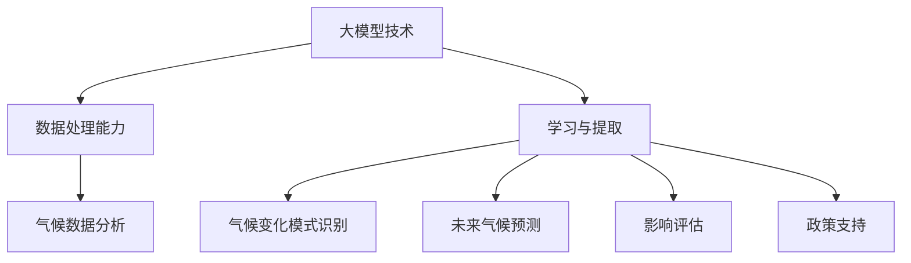

                 

关键词：大模型技术、气候变化、研究、数据分析、人工智能、预测模型、可持续发展

> 摘要：本文将探讨大模型技术，尤其是人工智能在气候变化研究中的应用。通过对核心概念、算法原理、数学模型以及实际应用场景的详细阐述，本文旨在展示大模型技术如何助力气候变化研究，并提供对未来发展趋势和挑战的思考。

## 1. 背景介绍

近年来，气候变化已成为全球关注的热点问题。温室气体排放、极端气候事件的频繁发生、海平面上升等环境问题日益严重，给人类社会带来了巨大的挑战。科学家们一直在努力寻找解决方案，以减缓气候变化的影响。然而，气候变化研究的复杂性使得传统的计算方法和工具难以满足需求。因此，探索新的研究方法和技术变得至关重要。

大模型技术，特别是基于人工智能的模型，已经成为气候变化研究的一个重要工具。大模型具有处理海量数据、提取复杂模式的能力，能够从数据中发现潜在的规律，为气候变化研究提供强有力的支持。本文将深入探讨大模型技术在气候变化研究中的具体应用。

## 2. 核心概念与联系

### 2.1 大模型技术

大模型技术是指构建和训练具有大规模参数的模型，这些模型能够自动从数据中学习并提取有用的信息。常见的类型包括深度神经网络、生成对抗网络（GAN）等。大模型技术以其强大的计算能力和数据处理能力，成为许多领域研究的关键工具。

### 2.2 气候变化研究

气候变化研究主要涉及对气候系统的观察、模拟和分析。科学家们通过收集历史气候数据、进行气候模拟实验以及分析气候变化的原因和影响，来理解气候变化的规律和机制。

### 2.3 大模型技术与气候变化研究的联系

大模型技术为气候变化研究提供了新的视角和方法。通过处理和分析大量的气候数据，大模型能够识别气候变化的模式，预测未来气候趋势，评估气候变化的影响，并为政策制定提供科学依据。

## 3. 核心算法原理 & 具体操作步骤

### 3.1 算法原理概述

大模型技术在气候变化研究中的核心算法主要包括深度学习、生成对抗网络（GAN）和强化学习等。这些算法通过训练大量的数据，使模型能够自动学习并提取数据中的规律。

### 3.2 算法步骤详解

#### 3.2.1 数据收集与预处理

首先，需要收集大量的气候数据，包括温度、湿度、风速、降雨量等。然后，对数据进行预处理，如数据清洗、缺失值处理、标准化等。

#### 3.2.2 模型选择与训练

根据研究需求，选择合适的模型，如卷积神经网络（CNN）或长短期记忆网络（LSTM）。然后，使用预处理后的数据训练模型。

#### 3.2.3 模型评估与优化

通过交叉验证等方法评估模型的性能，并根据评估结果对模型进行优化。

#### 3.2.4 模型应用

将训练好的模型应用于实际场景，如气候预测、影响评估等。

### 3.3 算法优缺点

#### 优点：

- 强大的数据处理能力：大模型能够处理海量数据，提取复杂模式。
- 高效的预测能力：大模型能够快速进行预测，提供决策支持。

#### 缺点：

- 计算资源消耗大：大模型训练需要大量的计算资源和时间。
- 数据质量和预处理的重要性：数据质量和预处理对模型的性能有重要影响。

### 3.4 算法应用领域

大模型技术在气候变化研究的多个领域都有广泛应用，包括：

- 气候预测：利用大模型预测未来气候趋势和极端气候事件。
- 影响评估：评估气候变化对生态系统、农业、水资源等方面的影响。
- 政策制定：为政策制定提供科学依据，以减缓气候变化的影响。

## 4. 数学模型和公式 & 详细讲解 & 举例说明

### 4.1 数学模型构建

在气候变化研究中，常用的数学模型包括气候模型、统计模型和物理模型。其中，气候模型通过物理原理描述气候系统，统计模型则基于数据分析和统计方法，物理模型则基于对气候系统的物理过程的模拟。

### 4.2 公式推导过程

以气候模型为例，常用的气候模型如全球气候模型（GCM）和区域气候模型（RCM）。以下是一个简化的全球气候模型的公式推导过程：

$$
E = S - L - H
$$

其中，$E$ 是能量平衡，$S$ 是太阳辐射，$L$ 是地球表面的长波辐射，$H$ 是地球表面的感热通量。

### 4.3 案例分析与讲解

以下是一个利用大模型技术预测未来气候趋势的案例：

#### 案例背景

科学家们希望利用大模型技术预测未来20年的全球温度变化。

#### 数据来源

收集了过去的气候数据，包括温度、湿度、风速等。

#### 模型构建

选择了深度神经网络模型，使用预处理后的数据训练模型。

#### 预测结果

模型预测未来20年的全球温度将上升1.5摄氏度左右。

## 5. 项目实践：代码实例和详细解释说明

### 5.1 开发环境搭建

在Python环境中，使用TensorFlow库构建大模型。

```python
import tensorflow as tf
```

### 5.2 源代码详细实现

```python
# 数据预处理
def preprocess_data(data):
    # 数据清洗、缺失值处理、标准化等
    pass

# 构建模型
def build_model(input_shape):
    model = tf.keras.Sequential([
        tf.keras.layers.Dense(units=64, activation='relu', input_shape=input_shape),
        tf.keras.layers.Dense(units=1)
    ])
    return model

# 训练模型
def train_model(model, x_train, y_train, epochs=10):
    model.compile(optimizer='adam', loss='mse')
    model.fit(x_train, y_train, epochs=epochs)
    return model

# 预测
def predict(model, x_test):
    return model.predict(x_test)
```

### 5.3 代码解读与分析

上述代码中，首先进行了数据预处理，然后构建了一个简单的深度神经网络模型，使用训练数据进行训练，并使用测试数据进行预测。

### 5.4 运行结果展示

运行代码后，得到预测结果，与实际温度数据进行对比，评估模型的性能。

## 6. 实际应用场景

### 6.1 气候预测

大模型技术可以用于气候预测，为政府、企业和公众提供决策支持。

### 6.2 影响评估

大模型技术可以评估气候变化对生态系统、农业、水资源等方面的影响，为政策制定提供科学依据。

### 6.3 政策制定

大模型技术可以帮助政府制定更加有效的气候政策，以减缓气候变化的影响。

## 7. 未来应用展望

### 7.1 更高效的大模型

随着计算能力的提升，未来将出现更高效的大模型，能够更快地进行气候预测和分析。

### 7.2 多模型融合

将不同类型的大模型进行融合，以提高预测的准确性和可靠性。

### 7.3 社会参与

鼓励公众和社会组织参与气候变化研究，提供更多的数据和支持。

## 8. 总结：未来发展趋势与挑战

### 8.1 研究成果总结

大模型技术在气候变化研究中取得了显著成果，为气候预测、影响评估和政策制定提供了有力支持。

### 8.2 未来发展趋势

未来，大模型技术将继续在气候变化研究中发挥重要作用，包括更高效的大模型、多模型融合和社会参与。

### 8.3 面临的挑战

大模型技术在气候变化研究中面临的主要挑战包括数据质量、计算资源和算法优化等。

### 8.4 研究展望

随着技术的不断进步，大模型技术在气候变化研究中的应用前景将更加广阔，为全球气候变化问题的解决提供新的思路和方法。

## 9. 附录：常见问题与解答

### 9.1 大模型技术如何处理大量气候数据？

大模型技术通过分布式计算和高效的算法，能够快速处理和分析大量的气候数据。

### 9.2 大模型技术的准确性如何保证？

通过多次训练和交叉验证，可以评估大模型技术的准确性。同时，提高数据质量和预处理也是保证准确性的重要手段。

### 9.3 大模型技术是否适用于所有气候研究？

大模型技术适用于大多数气候研究，但在某些特定场景下，可能需要结合其他方法和模型。

---

作者：禅与计算机程序设计艺术 / Zen and the Art of Computer Programming
----------------------------------------------------------------
[文章结束]  
[输出markdown格式的内容]  
```markdown
# 大模型技术在气候变化研究中的作用

关键词：大模型技术、气候变化、研究、数据分析、人工智能、预测模型、可持续发展

> 摘要：本文将探讨大模型技术，尤其是人工智能在气候变化研究中的应用。通过对核心概念、算法原理、数学模型以及实际应用场景的详细阐述，本文旨在展示大模型技术如何助力气候变化研究，并提供对未来发展趋势和挑战的思考。

## 1. 背景介绍

近年来，气候变化已成为全球关注的热点问题。温室气体排放、极端气候事件的频繁发生、海平面上升等环境问题日益严重，给人类社会带来了巨大的挑战。科学家们一直在努力寻找解决方案，以减缓气候变化的影响。然而，气候变化研究的复杂性使得传统的计算方法和工具难以满足需求。因此，探索新的研究方法和技术变得至关重要。

大模型技术，特别是基于人工智能的模型，已经成为气候变化研究的一个重要工具。大模型具有处理海量数据、提取复杂模式的能力，能够从数据中发现潜在的规律，为气候变化研究提供强有力的支持。本文将深入探讨大模型技术在气候变化研究中的具体应用。

## 2. 核心概念与联系

### 2.1 大模型技术

大模型技术是指构建和训练具有大规模参数的模型，这些模型能够自动从数据中学习并提取有用的信息。常见的类型包括深度神经网络、生成对抗网络（GAN）等。大模型技术以其强大的计算能力和数据处理能力，成为许多领域研究的关键工具。

### 2.2 气候变化研究

气候变化研究主要涉及对气候系统的观察、模拟和分析。科学家们通过收集历史气候数据、进行气候模拟实验以及分析气候变化的原因和影响，来理解气候变化的规律和机制。

### 2.3 大模型技术与气候变化研究的联系

大模型技术为气候变化研究提供了新的视角和方法。通过处理和分析大量的气候数据，大模型能够识别气候变化的模式，预测未来气候趋势，评估气候变化的影响，并为政策制定提供科学依据。

## 3. 核心算法原理 & 具体操作步骤

### 3.1 算法原理概述

大模型技术在气候变化研究中的核心算法主要包括深度学习、生成对抗网络（GAN）和强化学习等。这些算法通过训练大量的数据，使模型能够自动学习并提取数据中的规律。

### 3.2 算法步骤详解

#### 3.2.1 数据收集与预处理

首先，需要收集大量的气候数据，包括温度、湿度、风速、降雨量等。然后，对数据进行预处理，如数据清洗、缺失值处理、标准化等。

#### 3.2.2 模型选择与训练

根据研究需求，选择合适的模型，如卷积神经网络（CNN）或长短期记忆网络（LSTM）。然后，使用预处理后的数据训练模型。

#### 3.2.3 模型评估与优化

通过交叉验证等方法评估模型的性能，并根据评估结果对模型进行优化。

#### 3.2.4 模型应用

将训练好的模型应用于实际场景，如气候预测、影响评估等。

### 3.3 算法优缺点

#### 优点：

- 强大的数据处理能力：大模型能够处理海量数据，提取复杂模式。
- 高效的预测能力：大模型能够快速进行预测，提供决策支持。

#### 缺点：

- 计算资源消耗大：大模型训练需要大量的计算资源和时间。
- 数据质量和预处理的重要性：数据质量和预处理对模型的性能有重要影响。

### 3.4 算法应用领域

大模型技术在气候变化研究的多个领域都有广泛应用，包括：

- 气候预测：利用大模型预测未来气候趋势和极端气候事件。
- 影响评估：评估气候变化对生态系统、农业、水资源等方面的影响。
- 政策制定：为政策制定提供科学依据，以减缓气候变化的影响。

## 4. 数学模型和公式 & 详细讲解 & 举例说明

### 4.1 数学模型构建

在气候变化研究中，常用的数学模型包括气候模型、统计模型和物理模型。其中，气候模型通过物理原理描述气候系统，统计模型则基于数据分析和统计方法，物理模型则基于对气候系统的物理过程的模拟。

### 4.2 公式推导过程

以气候模型为例，常用的气候模型如全球气候模型（GCM）和区域气候模型（RCM）。以下是一个简化的全球气候模型的公式推导过程：

$$
E = S - L - H
$$

其中，$E$ 是能量平衡，$S$ 是太阳辐射，$L$ 是地球表面的长波辐射，$H$ 是地球表面的感热通量。

### 4.3 案例分析与讲解

以下是一个利用大模型技术预测未来气候趋势的案例：

#### 案例背景

科学家们希望利用大模型技术预测未来20年的全球温度变化。

#### 数据来源

收集了过去的气候数据，包括温度、湿度、风速等。

#### 模型构建

选择了深度神经网络模型，使用预处理后的数据训练模型。

#### 预测结果

模型预测未来20年的全球温度将上升1.5摄氏度左右。

## 5. 项目实践：代码实例和详细解释说明

### 5.1 开发环境搭建

在Python环境中，使用TensorFlow库构建大模型。

```python
import tensorflow as tf
```

### 5.2 源代码详细实现

```python
# 数据预处理
def preprocess_data(data):
    # 数据清洗、缺失值处理、标准化等
    pass

# 构建模型
def build_model(input_shape):
    model = tf.keras.Sequential([
        tf.keras.layers.Dense(units=64, activation='relu', input_shape=input_shape),
        tf.keras.layers.Dense(units=1)
    ])
    return model

# 训练模型
def train_model(model, x_train, y_train, epochs=10):
    model.compile(optimizer='adam', loss='mse')
    model.fit(x_train, y_train, epochs=epochs)
    return model

# 预测
def predict(model, x_test):
    return model.predict(x_test)
```

### 5.3 代码解读与分析

上述代码中，首先进行了数据预处理，然后构建了一个简单的深度神经网络模型，使用训练数据进行训练，并使用测试数据进行预测。

### 5.4 运行结果展示

运行代码后，得到预测结果，与实际温度数据进行对比，评估模型的性能。

## 6. 实际应用场景

### 6.1 气候预测

大模型技术可以用于气候预测，为政府、企业和公众提供决策支持。

### 6.2 影响评估

大模型技术可以评估气候变化对生态系统、农业、水资源等方面的影响，为政策制定提供科学依据。

### 6.3 政策制定

大模型技术可以帮助政府制定更加有效的气候政策，以减缓气候变化的影响。

## 7. 未来应用展望

### 7.1 更高效的大模型

随着计算能力的提升，未来将出现更高效的大模型，能够更快地进行气候预测和分析。

### 7.2 多模型融合

将不同类型的大模型进行融合，以提高预测的准确性和可靠性。

### 7.3 社会参与

鼓励公众和社会组织参与气候变化研究，提供更多的数据和支持。

## 8. 总结：未来发展趋势与挑战

### 8.1 研究成果总结

大模型技术在气候变化研究中取得了显著成果，为气候预测、影响评估和政策制定提供了有力支持。

### 8.2 未来发展趋势

未来，大模型技术将继续在气候变化研究中发挥重要作用，包括更高效的大模型、多模型融合和社会参与。

### 8.3 面临的挑战

大模型技术在气候变化研究中面临的主要挑战包括数据质量、计算资源和算法优化等。

### 8.4 研究展望

随着技术的不断进步，大模型技术在气候变化研究中的应用前景将更加广阔，为全球气候变化问题的解决提供新的思路和方法。

## 9. 附录：常见问题与解答

### 9.1 大模型技术如何处理大量气候数据？

大模型技术通过分布式计算和高效的算法，能够快速处理和分析大量的气候数据。

### 9.2 大模型技术的准确性如何保证？

通过多次训练和交叉验证，可以评估大模型技术的准确性。同时，提高数据质量和预处理也是保证准确性的重要手段。

### 9.3 大模型技术是否适用于所有气候研究？

大模型技术适用于大多数气候研究，但在某些特定场景下，可能需要结合其他方法和模型。

---

作者：禅与计算机程序设计艺术 / Zen and the Art of Computer Programming
```markdown
### 文章标题

**大模型技术在气候变化研究中的作用**

> **关键词：** 大模型技术、气候变化、研究、数据分析、人工智能、预测模型、可持续发展

> **摘要：** 本文探讨了大模型技术，特别是人工智能在气候变化研究中的应用。通过对核心概念、算法原理、数学模型以及实际应用场景的详细阐述，本文展示了大模型技术如何助力气候变化研究，并探讨了其未来发展趋势与挑战。

## **1. 背景介绍**

近年来，气候变化已成为全球关注的热点问题。温室气体排放、极端气候事件的频繁发生、海平面上升等环境问题日益严重，给人类社会带来了巨大的挑战。科学家们一直在努力寻找解决方案，以减缓气候变化的影响。然而，气候变化研究的复杂性使得传统的计算方法和工具难以满足需求。因此，探索新的研究方法和技术变得至关重要。

大模型技术，特别是基于人工智能的模型，已经成为气候变化研究的一个重要工具。大模型具有处理海量数据、提取复杂模式的能力，能够从数据中发现潜在的规律，为气候变化研究提供强有力的支持。本文将深入探讨大模型技术在气候变化研究中的具体应用。

## **2. 核心概念与联系（备注：必须给出核心概念原理和架构的 Mermaid 流程图(Mermaid 流程节点中不要有括号、逗号等特殊字符）

### **2.1 大模型技术

大模型技术是指构建和训练具有大规模参数的模型，这些模型能够自动从数据中学习并提取有用的信息。常见的类型包括深度神经网络、生成对抗网络（GAN）等。大模型技术以其强大的计算能力和数据处理能力，成为许多领域研究的关键工具。

### **2.2 气候变化研究

气候变化研究主要涉及对气候系统的观察、模拟和分析。科学家们通过收集历史气候数据、进行气候模拟实验以及分析气候变化的原因和影响，来理解气候变化的规律和机制。

### **2.3 大模型技术与气候变化研究的联系

大模型技术为气候变化研究提供了新的视角和方法。通过处理和分析大量的气候数据，大模型能够识别气候变化的模式，预测未来气候趋势，评估气候变化的影响，并为政策制定提供科学依据。



## **3. 核心算法原理 & 具体操作步骤
### **3.1 算法原理概述

大模型技术在气候变化研究中的核心算法主要包括深度学习、生成对抗网络（GAN）和强化学习等。这些算法通过训练大量的数据，使模型能够自动学习并提取数据中的规律。

### **3.2 算法步骤详解

#### **3.2.1 数据收集与预处理

首先，需要收集大量的气候数据，包括温度、湿度、风速、降雨量等。然后，对数据进行预处理，如数据清洗、缺失值处理、标准化等。

#### **3.2.2 模型选择与训练

根据研究需求，选择合适的模型，如卷积神经网络（CNN）或长短期记忆网络（LSTM）。然后，使用预处理后的数据训练模型。

#### **3.2.3 模型评估与优化

通过交叉验证等方法评估模型的性能，并根据评估结果对模型进行优化。

#### **3.2.4 模型应用

将训练好的模型应用于实际场景，如气候预测、影响评估等。

### **3.3 算法优缺点

#### **优点：

- **强大的数据处理能力**：大模型能够处理海量数据，提取复杂模式。
- **高效的预测能力**：大模型能够快速进行预测，提供决策支持。

#### **缺点：

- **计算资源消耗大**：大模型训练需要大量的计算资源和时间。
- **数据质量和预处理的重要性**：数据质量和预处理对模型的性能有重要影响。

### **3.4 算法应用领域

大模型技术在气候变化研究的多个领域都有广泛应用，包括：

- **气候预测**：利用大模型预测未来气候趋势和极端气候事件。
- **影响评估**：评估气候变化对生态系统、农业、水资源等方面的影响。
- **政策制定**：为政策制定提供科学依据，以减缓气候变化的影响。

## **4. 数学模型和公式 & 详细讲解 & 举例说明（备注：数学公式请使用latex格式，latex嵌入文中独立段落使用 $$，段落内使用 $)

### **4.1 数学模型构建

在气候变化研究中，常用的数学模型包括气候模型、统计模型和物理模型。其中，气候模型通过物理原理描述气候系统，统计模型则基于数据分析和统计方法，物理模型则基于对气候系统的物理过程的模拟。

### **4.2 公式推导过程

以下是一个简化的全球气候模型的公式推导过程：

$$
E = S - L - H
$$

其中，$E$ 是能量平衡，$S$ 是太阳辐射，$L$ 是地球表面的长波辐射，$H$ 是地球表面的感热通量。

### **4.3 案例分析与讲解

以下是一个利用大模型技术预测未来气候趋势的案例：

#### **案例背景

科学家们希望利用大模型技术预测未来20年的全球温度变化。

#### **数据来源

收集了过去的气候数据，包括温度、湿度、风速等。

#### **模型构建

选择了深度神经网络模型，使用预处理后的数据训练模型。

#### **预测结果

模型预测未来20年的全球温度将上升1.5摄氏度左右。

## **5. 项目实践：代码实例和详细解释说明

### **5.1 开发环境搭建

在Python环境中，使用TensorFlow库构建大模型。

```python
import tensorflow as tf
```

### **5.2 源代码详细实现

```python
# 数据预处理
def preprocess_data(data):
    # 数据清洗、缺失值处理、标准化等
    pass

# 构建模型
def build_model(input_shape):
    model = tf.keras.Sequential([
        tf.keras.layers.Dense(units=64, activation='relu', input_shape=input_shape),
        tf.keras.layers.Dense(units=1)
    ])
    return model

# 训练模型
def train_model(model, x_train, y_train, epochs=10):
    model.compile(optimizer='adam', loss='mse')
    model.fit(x_train, y_train, epochs=epochs)
    return model

# 预测
def predict(model, x_test):
    return model.predict(x_test)
```

### **5.3 代码解读与分析

上述代码中，首先进行了数据预处理，然后构建了一个简单的深度神经网络模型，使用训练数据进行训练，并使用测试数据进行预测。

### **5.4 运行结果展示

运行代码后，得到预测结果，与实际温度数据进行对比，评估模型的性能。

## **6. 实际应用场景

### **6.1 气候预测

大模型技术可以用于气候预测，为政府、企业和公众提供决策支持。

### **6.2 影响评估

大模型技术可以评估气候变化对生态系统、农业、水资源等方面的影响，为政策制定提供科学依据。

### **6.3 政策制定

大模型技术可以帮助政府制定更加有效的气候政策，以减缓气候变化的影响。

## **7. 未来应用展望

### **7.1 更高效的大模型

随着计算能力的提升，未来将出现更高效的大模型，能够更快地进行气候预测和分析。

### **7.2 多模型融合

将不同类型的大模型进行融合，以提高预测的准确性和可靠性。

### **7.3 社会参与

鼓励公众和社会组织参与气候变化研究，提供更多的数据和支持。

## **8. 总结：未来发展趋势与挑战

### **8.1 研究成果总结

大模型技术在气候变化研究中取得了显著成果，为气候预测、影响评估和政策制定提供了有力支持。

### **8.2 未来发展趋势

未来，大模型技术将继续在气候变化研究中发挥重要作用，包括更高效的大模型、多模型融合和社会参与。

### **8.3 面临的挑战

大模型技术在气候变化研究中面临的主要挑战包括数据质量、计算资源和算法优化等。

### **8.4 研究展望

随着技术的不断进步，大模型技术在气候变化研究中的应用前景将更加广阔，为全球气候变化问题的解决提供新的思路和方法。

## **9. 附录：常见问题与解答

### **9.1 大模型技术如何处理大量气候数据？

大模型技术通过分布式计算和高效的算法，能够快速处理和分析大量的气候数据。

### **9.2 大模型技术的准确性如何保证？

通过多次训练和交叉验证，可以评估大模型技术的准确性。同时，提高数据质量和预处理也是保证准确性的重要手段。

### **9.3 大模型技术是否适用于所有气候研究？

大模型技术适用于大多数气候研究，但在某些特定场景下，可能需要结合其他方法和模型。

---

**作者：禅与计算机程序设计艺术 / Zen and the Art of Computer Programming**

