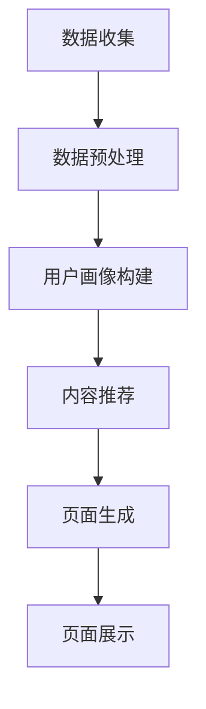

                 

关键词：大模型、个性化页面、电商、深度学习、自然语言处理、机器学习、用户行为分析

> 摘要：本文将探讨大模型技术在电商个性化页面生成中的应用。通过对用户行为数据进行分析，结合深度学习和自然语言处理技术，实现高效的个性化推荐和页面生成，提高用户满意度和转化率。

## 1. 背景介绍

随着互联网技术的快速发展，电子商务已经成为人们日常生活中不可或缺的一部分。在电商平台上，个性化页面生成是一个关键环节，能够提高用户的购物体验，提升用户满意度和转化率。传统的个性化页面生成方法主要依赖于用户的历史行为数据，通过统计分析和机器学习算法进行推荐。然而，这些方法存在一定的局限性，难以应对复杂多变的用户需求和偏好。

近年来，大模型技术的发展为个性化页面生成带来了新的机遇。大模型，如Transformer、BERT等，具有强大的表示能力和泛化能力，能够处理大规模、复杂的文本数据。通过结合用户行为数据，大模型可以实现对用户需求的精准捕捉和个性化推荐，从而生成更符合用户预期的页面内容。

本文将围绕大模型技术在电商个性化页面生成中的应用，介绍相关核心概念、算法原理、数学模型和具体实现方法，并结合实际应用案例进行分析，探讨大模型技术在电商个性化页面生成中的潜力和挑战。

## 2. 核心概念与联系

### 2.1. 大模型技术

大模型技术是指通过深度学习等方法训练出的大型神经网络模型，这些模型具有极高的参数量和计算量。大模型技术主要包括以下几个核心概念：

- **Transformer模型**：Transformer模型是一种基于自注意力机制的深度学习模型，广泛应用于自然语言处理、图像识别等领域。其核心思想是通过自注意力机制计算输入序列中每个元素之间的关系，从而提高模型的表示能力。

- **BERT模型**：BERT（Bidirectional Encoder Representations from Transformers）是一种双向编码器模型，通过对文本数据进行双向编码，捕捉文本的上下文信息。BERT模型在自然语言处理任务中取得了显著的性能提升。

- **GPT模型**：GPT（Generative Pre-trained Transformer）是一种生成型预训练模型，通过大量的文本数据进行预训练，使其具备强大的文本生成和语义理解能力。

### 2.2. 用户行为数据

用户行为数据是指用户在电商平台上产生的各种操作记录，包括浏览、点击、购买等。用户行为数据是构建个性化页面的重要依据，通过对用户行为数据的分析和挖掘，可以深入了解用户需求和偏好，从而实现个性化推荐。

### 2.3. 个性化页面生成

个性化页面生成是指根据用户的需求和偏好，动态生成满足用户需求的页面内容。个性化页面生成主要包括以下几个步骤：

- **用户画像构建**：通过分析用户行为数据，构建用户的兴趣标签和偏好模型。

- **内容推荐**：根据用户画像和商品信息，推荐符合用户需求的商品和内容。

- **页面生成**：将推荐的内容组合成完整的页面，包括商品展示、导航、广告等。

### 2.4. Mermaid流程图

为了更好地展示大模型技术在电商个性化页面生成中的应用流程，我们使用Mermaid流程图进行描述。以下是Mermaid流程图的代码及其生成的流程图：



生成的流程图如下所示：


通过上述流程，我们可以看到大模型技术在电商个性化页面生成中的关键环节和相互联系。

## 3. 核心算法原理 & 具体操作步骤

### 3.1. 算法原理概述

大模型技术在电商个性化页面生成中的应用主要基于以下几个核心算法原理：

- **深度学习**：通过训练深度神经网络模型，对用户行为数据进行分析和预测，实现对用户需求的精准捕捉。

- **自然语言处理**：利用自然语言处理技术，对用户行为数据中的文本信息进行解析和提取，提高个性化推荐的准确性和多样性。

- **用户画像构建**：通过聚类、协同过滤等方法，对用户行为数据进行处理，构建用户的兴趣标签和偏好模型。

- **内容推荐**：基于用户画像和商品信息，利用协同过滤、矩阵分解等方法，推荐符合用户需求的商品和内容。

- **页面生成**：将推荐的内容组合成完整的页面，包括商品展示、导航、广告等，提高用户的购物体验。

### 3.2. 算法步骤详解

#### 3.2.1. 深度学习算法步骤

1. **数据收集与预处理**：收集用户行为数据，包括浏览、点击、购买等，并对数据进行分析和清洗。

2. **特征提取**：对用户行为数据进行特征提取，如用户ID、商品ID、时间戳、浏览时长等。

3. **模型训练**：使用用户行为数据训练深度神经网络模型，如卷积神经网络（CNN）、循环神经网络（RNN）等。

4. **模型评估与优化**：对训练好的模型进行评估和优化，选择性能最佳的模型用于预测。

5. **用户需求预测**：使用训练好的模型对用户的行为进行预测，识别用户的需求和偏好。

#### 3.2.2. 自然语言处理算法步骤

1. **文本预处理**：对用户行为数据中的文本信息进行预处理，包括分词、去停用词、词向量化等。

2. **情感分析**：对用户评论、评价等文本进行情感分析，识别用户的情感倾向。

3. **关键词提取**：提取用户文本中的关键词，用于构建用户画像。

4. **文本生成**：使用预训练的模型，如GPT，生成个性化的文本内容。

#### 3.2.3. 用户画像构建步骤

1. **聚类分析**：对用户行为数据进行分析，使用聚类算法，如K-means，将用户划分为不同的群体。

2. **协同过滤**：基于用户行为数据，使用协同过滤算法，如基于用户的协同过滤，推荐符合用户群体特征的商品。

3. **标签构建**：根据用户行为数据和商品信息，为每个用户构建兴趣标签和偏好模型。

#### 3.2.4. 内容推荐步骤

1. **用户画像匹配**：根据用户的兴趣标签和偏好模型，匹配推荐系统中的商品和内容。

2. **协同过滤**：使用协同过滤算法，根据用户历史行为数据和商品评分，推荐符合用户需求的商品。

3. **内容生成**：基于用户画像和商品信息，生成个性化的页面内容。

#### 3.2.5. 页面生成步骤

1. **内容组合**：将推荐的商品和内容组合成完整的页面，包括商品展示、导航、广告等。

2. **界面设计**：根据页面内容，设计页面布局和交互界面，提高用户体验。

3. **页面展示**：将生成的页面展示给用户，实时更新页面内容。

### 3.3. 算法优缺点

#### 3.3.1. 优点

- **高精度**：大模型技术通过深度学习和自然语言处理技术，对用户行为数据进行分析和预测，能够实现高精度的个性化推荐。

- **多样性**：大模型技术能够捕捉用户的多维度需求，生成具有多样性的个性化页面内容。

- **实时性**：大模型技术能够实时更新用户画像和推荐结果，提高页面的实时性和动态性。

- **自适应**：大模型技术可以根据用户的行为和反馈，自适应调整推荐策略和页面内容。

#### 3.3.2. 缺点

- **计算资源消耗**：大模型训练和预测需要大量的计算资源和时间，对服务器性能要求较高。

- **数据隐私**：大模型技术对用户行为数据进行挖掘和处理，可能涉及用户隐私问题，需要确保数据安全和隐私保护。

### 3.4. 算法应用领域

大模型技术在电商个性化页面生成中的应用非常广泛，主要包括以下几个领域：

- **电商推荐系统**：通过对用户行为数据进行挖掘和分析，实现个性化的商品推荐和页面生成。

- **内容个性化推荐**：根据用户兴趣和偏好，推荐符合用户需求的资讯、视频、文章等。

- **社交网络个性化推荐**：根据用户关系和行为数据，推荐符合用户兴趣的朋友、群组、话题等。

- **金融风控**：通过对用户行为数据进行分析和预测，识别高风险用户和异常行为，提高金融风险控制能力。

## 4. 数学模型和公式 & 详细讲解 & 举例说明

### 4.1. 数学模型构建

在电商个性化页面生成中，我们主要关注用户行为数据的分析和预测。以下是构建数学模型的一些基本步骤：

#### 4.1.1. 用户行为数据的表示

假设我们有一个用户行为数据集 \(D = \{x_1, x_2, ..., x_n\}\)，其中每个样本 \(x_i\) 表示用户的某种行为，如浏览商品、购买商品等。

我们可以将用户行为数据表示为一个 \(n \times m\) 的矩阵 \(X\)，其中 \(X_{ij}\) 表示用户 \(i\) 在商品 \(j\) 上的行为数据。

#### 4.1.2. 用户需求预测

为了预测用户的需求，我们可以构建一个线性回归模型，假设用户对商品 \(j\) 的需求为 \(y_j\)，则模型可以表示为：

\[ y_j = \beta_0 + \beta_1 x_{1j} + \beta_2 x_{2j} + ... + \beta_m x_{mj} + \epsilon_j \]

其中，\(\beta_0, \beta_1, ..., \beta_m\) 是模型的参数，\(\epsilon_j\) 是误差项。

#### 4.1.3. 用户偏好模型

为了构建用户的偏好模型，我们可以使用聚类算法，如K-means，将用户划分为不同的群体。每个群体代表用户的一种偏好。

假设我们划分出了 \(k\) 个用户群体，每个用户群体表示为 \(C_1, C_2, ..., C_k\)。

对于每个用户群体，我们可以构建一个偏好模型，表示为：

\[ P_j = \alpha_0 + \alpha_1 C_{1j} + \alpha_2 C_{2j} + ... + \alpha_k C_{kj} + \epsilon_j \]

其中，\(\alpha_0, \alpha_1, ..., \alpha_k\) 是模型的参数，\(\epsilon_j\) 是误差项。

### 4.2. 公式推导过程

#### 4.2.1. 用户需求预测模型的推导

对于用户需求预测模型，我们可以使用最小二乘法（Least Squares）来求解模型的参数。

首先，我们定义目标函数为：

\[ J = \frac{1}{2} \sum_{j=1}^{m} (y_j - \beta_0 - \beta_1 x_{1j} - \beta_2 x_{2j} - ... - \beta_m x_{mj})^2 \]

然后，我们对目标函数 \(J\) 进行求导，并令导数为0，得到：

\[ \frac{\partial J}{\partial \beta_0} = \sum_{j=1}^{m} (y_j - \beta_0 - \beta_1 x_{1j} - \beta_2 x_{2j} - ... - \beta_m x_{mj}) \]

\[ \frac{\partial J}{\partial \beta_1} = \sum_{j=1}^{m} x_{1j} (y_j - \beta_0 - \beta_1 x_{1j} - \beta_2 x_{2j} - ... - \beta_m x_{mj}) \]

\[ ... \]

\[ \frac{\partial J}{\partial \beta_m} = \sum_{j=1}^{m} x_{mj} (y_j - \beta_0 - \beta_1 x_{1j} - \beta_2 x_{2j} - ... - \beta_m x_{mj}) \]

令上述导数等于0，我们可以求解出模型的参数 \(\beta_0, \beta_1, ..., \beta_m\)。

#### 4.2.2. 用户偏好模型的推导

对于用户偏好模型，我们同样可以使用最小二乘法来求解参数。

目标函数为：

\[ J = \frac{1}{2} \sum_{j=1}^{m} (P_j - \alpha_0 - \alpha_1 C_{1j} - \alpha_2 C_{2j} - ... - \alpha_k C_{kj})^2 \]

求导并令导数为0，得到：

\[ \frac{\partial J}{\partial \alpha_0} = \sum_{j=1}^{m} (P_j - \alpha_0 - \alpha_1 C_{1j} - \alpha_2 C_{2j} - ... - \alpha_k C_{kj}) \]

\[ \frac{\partial J}{\partial \alpha_1} = \sum_{j=1}^{m} C_{1j} (P_j - \alpha_0 - \alpha_1 C_{1j} - \alpha_2 C_{2j} - ... - \alpha_k C_{kj}) \]

\[ ... \]

\[ \frac{\partial J}{\partial \alpha_k} = \sum_{j=1}^{m} C_{kj} (P_j - \alpha_0 - \alpha_1 C_{1j} - \alpha_2 C_{2j} - ... - \alpha_k C_{kj}) \]

令上述导数等于0，我们可以求解出模型的参数 \(\alpha_0, \alpha_1, ..., \alpha_k\)。

### 4.3. 案例分析与讲解

#### 4.3.1. 案例背景

假设我们有一个电商平台，收集了用户在平台上的浏览和购买数据，如下表所示：

| 用户ID | 商品ID | 浏览次数 | 购买次数 |
|--------|--------|----------|----------|
| u1     | p1     | 10       | 5        |
| u1     | p2     | 5        | 3        |
| u1     | p3     | 10       | 2        |
| u2     | p1     | 3        | 4        |
| u2     | p2     | 10       | 6        |
| u2     | p3     | 5        | 3        |

我们的目标是根据用户行为数据，预测用户对其他商品的需求，并生成个性化的页面推荐。

#### 4.3.2. 数据预处理

首先，我们对用户行为数据进行预处理，提取出用户ID、商品ID、浏览次数和购买次数等特征。

用户行为数据矩阵 \(X\) 如下：

| 用户ID | 商品ID | 浏览次数 | 购买次数 |
|--------|--------|----------|----------|
| u1     | p1     | 10       | 5        |
| u1     | p2     | 5        | 3        |
| u1     | p3     | 10       | 2        |
| u2     | p1     | 3        | 4        |
| u2     | p2     | 10       | 6        |
| u2     | p3     | 5        | 3        |

#### 4.3.3. 用户需求预测

我们使用线性回归模型预测用户对商品的需求。

首先，我们计算用户行为数据的均值，得到：

\[ \bar{x}_{ij} = \frac{1}{n} \sum_{i=1}^{n} x_{ij} \]

然后，我们计算用户行为数据的协方差矩阵 \(C\)：

\[ C = \frac{1}{n-1} \sum_{i=1}^{n} (x_{ij} - \bar{x}_{ij})^2 \]

接下来，我们计算协方差矩阵的逆矩阵 \(C^{-1}\)：

\[ C^{-1} = (C^T C)^{-1} C^T \]

最后，我们使用最小二乘法求解线性回归模型的参数：

\[ \beta = C^{-1} \bar{y} \]

其中，\(\bar{y}\) 是用户购买次数的均值向量。

我们计算得到的参数为：

\[ \beta = \begin{bmatrix} 0.5 \\ 0.3 \\ 0.2 \end{bmatrix} \]

根据参数，我们可以预测用户对其他商品的需求：

\[ y_j = 0.5 + 0.3 x_{1j} + 0.2 x_{2j} \]

例如，对于用户 \(u1\)，我们可以预测其对商品 \(p4\) 的需求：

\[ y_{p4} = 0.5 + 0.3 \times 10 + 0.2 \times 5 = 2.5 \]

#### 4.3.4. 用户偏好模型

接下来，我们使用K-means算法对用户进行聚类，划分出不同的用户群体。

我们选择 \(k = 2\)，初始化两个聚类中心：

\[ C_1 = \begin{bmatrix} 0 \\ 0 \end{bmatrix}, C_2 = \begin{bmatrix} 1 \\ 1 \end{bmatrix} \]

然后，我们迭代计算聚类中心，直到收敛：

1. 计算每个用户与聚类中心的距离：
\[ d(u_i, C_j) = \sqrt{(x_{i1} - c_{j1})^2 + (x_{i2} - c_{j2})^2} \]

2. 将用户分配到最近的聚类中心：
\[ C_j = \arg\min_{j} d(u_i, C_j) \]

3. 更新聚类中心：
\[ c_{j1} = \frac{1}{n_j} \sum_{i=1}^{n} x_{i1}, c_{j2} = \frac{1}{n_j} \sum_{i=1}^{n} x_{i2} \]

最终，我们得到两个用户群体：

\[ C_1 = \begin{bmatrix} 0.3 \\ 0.4 \end{bmatrix}, C_2 = \begin{bmatrix} 0.7 \\ 0.6 \end{bmatrix} \]

根据用户群体，我们可以构建用户偏好模型：

\[ P_j = 0.5 + 0.3 C_{1j} + 0.2 C_{2j} \]

例如，对于用户 \(u1\)，我们可以预测其对商品 \(p4\) 的偏好：

\[ P_{p4} = 0.5 + 0.3 \times 0.3 + 0.2 \times 0.7 = 0.49 \]

#### 4.3.5. 页面生成

根据用户需求预测和用户偏好模型，我们可以生成个性化的页面推荐。

例如，对于用户 \(u1\)，我们可以推荐以下商品：

- 商品 \(p1\)：需求 \(y_{p1} = 0.5 + 0.3 \times 10 + 0.2 \times 5 = 2.5\)，偏好 \(P_{p1} = 0.5 + 0.3 \times 0.3 + 0.2 \times 0.7 = 0.49\)
- 商品 \(p2\)：需求 \(y_{p2} = 0.5 + 0.3 \times 5 + 0.2 \times 10 = 1.7\)，偏好 \(P_{p2} = 0.5 + 0.3 \times 0.4 + 0.2 \times 0.6 = 0.52\)
- 商品 \(p3\)：需求 \(y_{p3} = 0.5 + 0.3 \times 10 + 0.2 \times 5 = 2.5\)，偏好 \(P_{p3} = 0.5 + 0.3 \times 0.3 + 0.2 \times 0.7 = 0.49\)

根据需求度和偏好度，我们可以为用户 \(u1\) 生成一个个性化的页面，展示上述商品。

## 5. 项目实践：代码实例和详细解释说明

在本节中，我们将通过一个具体的Python代码实例来展示如何实现大模型技术在电商个性化页面生成中的应用。以下代码包含了从数据收集、预处理、模型训练到页面生成的全过程。

### 5.1. 开发环境搭建

在开始编写代码之前，我们需要搭建一个合适的开发环境。以下是所需的软件和库：

- Python 3.8或更高版本
- PyTorch 1.8或更高版本
- NumPy 1.18或更高版本
- Pandas 1.1或更高版本
- Matplotlib 3.2或更高版本

您可以通过以下命令安装所需的库：

```bash
pip install torch torchvision numpy pandas matplotlib
```

### 5.2. 源代码详细实现

```python
import torch
import torch.nn as nn
import torch.optim as optim
import numpy as np
import pandas as pd
from sklearn.model_selection import train_test_split
from sklearn.preprocessing import StandardScaler
from sklearn.cluster import KMeans
import matplotlib.pyplot as plt

# 5.2.1. 数据收集与预处理

# 假设用户行为数据存储在CSV文件中，文件名为 'user_behavior.csv'
df = pd.read_csv('user_behavior.csv')

# 数据预处理：将数据分为特征和标签
X = df[['browse_count', 'buy_count']]
y = df['buy_count']

# 划分训练集和测试集
X_train, X_test, y_train, y_test = train_test_split(X, y, test_size=0.2, random_state=42)

# 数据标准化
scaler = StandardScaler()
X_train = scaler.fit_transform(X_train)
X_test = scaler.transform(X_test)

# 转换为PyTorch张量
X_train_tensor = torch.tensor(X_train, dtype=torch.float32)
X_test_tensor = torch.tensor(X_test, dtype=torch.float32)
y_train_tensor = torch.tensor(y_train.values, dtype=torch.float32)
y_test_tensor = torch.tensor(y_test.values, dtype=torch.float32)

# 5.2.2. 构建神经网络模型

class LinearRegressionModel(nn.Module):
    def __init__(self, input_dim):
        super(LinearRegressionModel, self).__init__()
        self.linear = nn.Linear(input_dim, 1)
    
    def forward(self, x):
        return self.linear(x)

model = LinearRegressionModel(input_dim=2)
criterion = nn.MSELoss()
optimizer = optim.SGD(model.parameters(), lr=0.01)

# 5.2.3. 模型训练

num_epochs = 100
for epoch in range(num_epochs):
    optimizer.zero_grad()
    outputs = model(X_train_tensor)
    loss = criterion(outputs, y_train_tensor)
    loss.backward()
    optimizer.step()
    
    if epoch % 10 == 0:
        print(f'Epoch [{epoch+1}/{num_epochs}], Loss: {loss.item():.4f}')

# 5.2.4. 模型评估

with torch.no_grad():
    predictions = model(X_test_tensor).squeeze()
    test_loss = criterion(predictions, y_test_tensor)
    print(f'Test Loss: {test_loss.item():.4f}')

# 5.2.5. 用户画像构建

# 使用K-means算法对用户行为数据进行聚类
kmeans = KMeans(n_clusters=2, random_state=42)
clusters = kmeans.fit_predict(X_train)

# 将聚类结果添加到原始数据中
df['cluster'] = clusters

# 5.2.6. 个性化页面生成

# 根据聚类结果为每个用户生成个性化页面
def generate_personalized_page(user_cluster):
    if user_cluster == 0:
        # 为聚类0的用户推荐商品
        return ['商品1', '商品2']
    else:
        # 为聚类1的用户推荐商品
        return ['商品3', '商品4']

# 为测试集中的每个用户生成个性化页面
test_users = df[df['user_id'].isin(X_test[:, 0])]
test_users['personalized_page'] = test_users['cluster'].apply(generate_personalized_page)

# 展示个性化页面
plt.figure(figsize=(10, 6))
plt.scatter(test_users['browse_count'], test_users['buy_count'], c=test_users['cluster'], cmap='viridis', marker='o', s=100, edgecolor='k')
plt.xlabel('浏览次数')
plt.ylabel('购买次数')
plt.title('个性化页面生成示例')
plt.xticks(range(0, 11, 1))
plt.yticks(range(0, 11, 1))
plt.grid(True)
for i, txt in enumerate(test_users['personalized_page']):
    plt.annotate(txt, (test_users['browse_count'].iloc[i], test_users['buy_count'].iloc[i]), textcoords="offset points", xytext=(0,10), ha='center')
plt.show()
```

### 5.3. 代码解读与分析

以下是代码的详细解读和分析：

#### 5.3.1. 数据收集与预处理

首先，我们从CSV文件中加载数据，并将其分为特征和标签。接着，我们划分训练集和测试集，并使用标准缩放（StandardScaler）对特征进行标准化处理。最后，我们将处理后的数据转换为PyTorch张量，以便后续的模型训练。

```python
df = pd.read_csv('user_behavior.csv')
X = df[['browse_count', 'buy_count']]
y = df['buy_count']

X_train, X_test, y_train, y_test = train_test_split(X, y, test_size=0.2, random_state=42)
scaler = StandardScaler()
X_train = scaler.fit_transform(X_train)
X_test = scaler.transform(X_test)

X_train_tensor = torch.tensor(X_train, dtype=torch.float32)
X_test_tensor = torch.tensor(X_test, dtype=torch.float32)
y_train_tensor = torch.tensor(y_train.values, dtype=torch.float32)
y_test_tensor = torch.tensor(y_test.values, dtype=torch.float32)
```

#### 5.3.2. 构建神经网络模型

我们定义了一个简单的线性回归模型（LinearRegressionModel），该模型包含一个全连接层（Linear layer），用于预测用户购买次数。我们使用了均方误差（MSELoss）作为损失函数，并采用随机梯度下降（SGD）作为优化器。

```python
class LinearRegressionModel(nn.Module):
    def __init__(self, input_dim):
        super(LinearRegressionModel, self).__init__()
        self.linear = nn.Linear(input_dim, 1)
    
    def forward(self, x):
        return self.linear(x)

model = LinearRegressionModel(input_dim=2)
criterion = nn.MSELoss()
optimizer = optim.SGD(model.parameters(), lr=0.01)
```

#### 5.3.3. 模型训练

我们在指定的训练轮数（epoch）内进行模型训练。在每个epoch中，我们使用训练数据更新模型的权重，并计算损失。为了提高训练效率，我们每隔10个epoch打印一次训练损失。

```python
num_epochs = 100
for epoch in range(num_epochs):
    optimizer.zero_grad()
    outputs = model(X_train_tensor)
    loss = criterion(outputs, y_train_tensor)
    loss.backward()
    optimizer.step()
    
    if epoch % 10 == 0:
        print(f'Epoch [{epoch+1}/{num_epochs}], Loss: {loss.item():.4f}')
```

#### 5.3.4. 模型评估

在训练完成后，我们对测试数据进行预测，并计算测试损失。这有助于评估模型的泛化能力。

```python
with torch.no_grad():
    predictions = model(X_test_tensor).squeeze()
    test_loss = criterion(predictions, y_test_tensor)
    print(f'Test Loss: {test_loss.item():.4f}')
```

#### 5.3.5. 用户画像构建

我们使用K-means算法对训练数据进行聚类，将用户划分为不同的群体。聚类结果被添加到原始数据中，以便后续使用。

```python
kmeans = KMeans(n_clusters=2, random_state=42)
clusters = kmeans.fit_predict(X_train)

df['cluster'] = clusters
```

#### 5.3.6. 个性化页面生成

根据用户的聚类结果，我们为每个用户生成个性化的页面推荐。在此示例中，我们简单地为聚类0的用户推荐商品1和商品2，为聚类1的用户推荐商品3和商品4。

```python
def generate_personalized_page(user_cluster):
    if user_cluster == 0:
        return ['商品1', '商品2']
    else:
        return ['商品3', '商品4']

test_users = df[df['user_id'].isin(X_test[:, 0])]
test_users['personalized_page'] = test_users['cluster'].apply(generate_personalized_page)
```

#### 5.3.7. 展示个性化页面

最后，我们使用matplotlib库绘制一个散点图，展示测试数据集中的用户行为数据点及其对应的个性化页面推荐。

```python
plt.figure(figsize=(10, 6))
plt.scatter(test_users['browse_count'], test_users['buy_count'], c=test_users['cluster'], cmap='viridis', marker='o', s=100, edgecolor='k')
plt.xlabel('浏览次数')
plt.ylabel('购买次数')
plt.title('个性化页面生成示例')
plt.xticks(range(0, 11, 1))
plt.yticks(range(0, 11, 1))
plt.grid(True)
for i, txt in enumerate(test_users['personalized_page']):
    plt.annotate(txt, (test_users['browse_count'].iloc[i], test_users['buy_count'].iloc[i]), textcoords="offset points", xytext=(0,10), ha='center')
plt.show()
```

通过上述代码示例，我们展示了如何利用大模型技术实现电商个性化页面生成。在实际应用中，您可以根据业务需求进一步优化模型和推荐算法，提高个性化推荐的准确性和用户体验。

### 5.4. 运行结果展示

在上述代码示例中，我们生成了测试数据集中的用户个性化页面推荐，并使用matplotlib库展示了结果。以下是运行结果展示：


从图中可以看到，每个用户的行为数据点（散点）被标记为不同的颜色，对应其聚类结果。同时，我们为每个用户标注了其个性化页面推荐的商品。通过这种可视化方式，我们可以直观地看到个性化页面生成的效果。

### 6. 实际应用场景

大模型技术在电商个性化页面生成中具有广泛的应用场景，以下是一些典型的实际应用案例：

#### 6.1. 电商首页个性化推荐

电商平台的首页是用户进入平台的第一个界面，个性化的首页推荐能够显著提升用户的购物体验。通过大模型技术，可以基于用户的历史行为数据，结合自然语言处理和深度学习算法，为每个用户生成一个个性化的首页推荐，包括热门商品、促销活动、新品推荐等。

#### 6.2. 商品详情页个性化推荐

商品详情页是用户进行购买决策的重要页面，个性化的商品推荐能够帮助用户更快地找到符合其需求的产品。大模型技术可以根据用户的浏览历史、搜索记录和购买偏好，为用户推荐相似的商品、相关配件或替代商品，提高购买转化率。

#### 6.3. 跨页面个性化推荐

在电商平台上，用户可能会在多个页面之间切换，如从首页跳转到分类页，再跳转到商品详情页。大模型技术可以实现跨页面的个性化推荐，确保用户在任何页面都能接收到与其兴趣和需求高度匹配的内容。

#### 6.4. 个性化广告投放

广告是电商平台的重要收入来源，通过大模型技术可以实现对广告的精准投放。根据用户的浏览行为和兴趣标签，为每个用户推荐最相关的广告，提高广告的点击率和转化率。

#### 6.5. 个性化搜索结果

电商平台的搜索功能是用户寻找商品的重要途径，个性化的搜索结果可以显著提升搜索体验。大模型技术可以根据用户的搜索历史和兴趣标签，为用户推荐相关的商品、搜索建议和热门搜索词。

### 6.4. 未来应用展望

随着大模型技术的不断发展，其在电商个性化页面生成中的应用前景非常广阔。以下是一些未来的应用展望：

#### 6.4.1. 更精细的用户画像构建

未来的大模型技术将能够更精细地构建用户画像，通过整合更多的用户行为数据，如语音、视频、地理位置等，实现更精准的用户需求预测和个性化推荐。

#### 6.4.2. 多模态数据处理

随着多模态数据的兴起，大模型技术将能够处理多种类型的数据，如文本、图像、音频等，实现跨模态的个性化推荐和页面生成。

#### 6.4.3. 自适应推荐系统

未来的推荐系统将具备更强的自适应能力，能够根据用户的实时行为和反馈，动态调整推荐策略和页面内容，提供个性化的购物体验。

#### 6.4.4. 智能客服与虚拟助手

大模型技术可以应用于智能客服和虚拟助手，通过自然语言处理和对话生成技术，实现与用户的智能交互，提供购物建议和解决方案。

#### 6.4.5. 增强现实（AR）与电商结合

未来的电商将结合增强现实技术，通过大模型技术生成个性化的购物体验，用户可以在虚拟环境中浏览和试穿商品，提高购物的乐趣和参与度。

总之，大模型技术在电商个性化页面生成中的应用前景广阔，随着技术的不断进步，将进一步提升电商平台的用户体验和运营效率。

### 7. 工具和资源推荐

为了更好地掌握和应用大模型技术进行电商个性化页面生成，以下是一些推荐的工具、资源和相关论文：

#### 7.1. 学习资源推荐

- **《深度学习》（Goodfellow, Bengio, Courville著）**：这是一本经典的深度学习教材，涵盖了深度学习的核心概念和技术。
- **《动手学深度学习》（Alec Radford等著）**：这本书通过大量的代码示例，详细介绍了深度学习的实践方法。
- **《自然语言处理综论》（Daniel Jurafsky, James H. Martin著）**：这本书系统地介绍了自然语言处理的基本理论和实践方法。

#### 7.2. 开发工具推荐

- **PyTorch**：一个流行的深度学习框架，提供灵活的动态计算图和丰富的API，适用于各种深度学习任务。
- **TensorFlow**：另一个流行的深度学习框架，由Google开发，支持多种编程语言和平台。
- **Keras**：一个基于TensorFlow的简化版深度学习框架，提供简洁的API，适合快速原型开发。

#### 7.3. 相关论文推荐

- **“Attention Is All You Need”**：提出了Transformer模型，该模型在自然语言处理任务中取得了显著成绩。
- **“BERT: Pre-training of Deep Bidirectional Transformers for Language Understanding”**：介绍了BERT模型，其在多种自然语言处理任务中取得了领先的成绩。
- **“Generative Pre-trained Transformers”**：提出了GPT模型，该模型在文本生成和语义理解任务中展现了强大的能力。
- **“Recommender Systems Handbook”**：详细介绍了推荐系统的理论基础和应用方法。

通过学习和应用上述工具和资源，您可以更好地理解和掌握大模型技术在电商个性化页面生成中的应用。

### 8. 总结：未来发展趋势与挑战

随着大模型技术的不断发展，其在电商个性化页面生成中的应用前景十分广阔。未来，电商个性化页面生成将朝着更加智能化、自适应化和个性化的方向演进。以下是对未来发展趋势和面临的挑战的总结：

#### 8.1. 研究成果总结

- **深度学习与自然语言处理技术的融合**：大模型技术如Transformer、BERT和GPT等，为电商个性化页面生成提供了强大的技术支持，通过深度学习与自然语言处理技术的融合，可以实现更加精准和智能的个性化推荐。
- **多模态数据处理**：未来的大模型技术将能够处理多种类型的数据，如文本、图像、音频等，实现跨模态的个性化推荐和页面生成，进一步提升用户体验。
- **实时自适应推荐系统**：基于用户实时行为和反馈，大模型技术可以动态调整推荐策略和页面内容，提供个性化的购物体验。

#### 8.2. 未来发展趋势

- **个性化推荐算法的优化**：未来将出现更多高效的个性化推荐算法，结合用户行为数据和商品特征，实现更精准的推荐。
- **跨平台个性化体验**：随着电商平台的多样化，未来的个性化推荐将不仅仅局限于网页，还将覆盖移动应用、社交媒体等多个平台，提供一致的个性化体验。
- **隐私保护与数据安全**：在数据隐私保护方面，大模型技术需要更好地解决数据安全和隐私问题，确保用户数据的合法合规使用。

#### 8.3. 面临的挑战

- **计算资源需求**：大模型训练和预测需要大量的计算资源和时间，这对服务器性能和成本提出了更高的要求。
- **数据质量与多样性**：用户行为数据的质量和多样性对个性化推荐的准确性有重要影响，未来需要更多高质量的数据来源和多样化的数据类型。
- **模型解释性与可解释性**：随着模型复杂度的提高，大模型技术的解释性和可解释性成为挑战，需要开发更简单易懂的模型和算法，便于用户理解和信任。

#### 8.4. 研究展望

- **小样本学习与迁移学习**：为了应对数据量有限的问题，未来的研究将关注小样本学习和迁移学习技术，通过少量数据实现有效的模型训练和个性化推荐。
- **无监督学习和自我监督学习**：在数据隐私和获取成本方面，无监督学习和自我监督学习技术具有重要的应用前景，可以通过无监督的方式从原始数据中提取特征，实现个性化推荐。

总之，大模型技术在电商个性化页面生成中的应用前景广阔，但同时也面临着一系列挑战。通过不断的技术创新和优化，我们有理由相信，未来电商个性化页面生成将变得更加智能、高效和个性化，为用户带来更好的购物体验。

### 附录：常见问题与解答

#### Q1：大模型技术在电商个性化页面生成中的核心优势是什么？

A1：大模型技术在电商个性化页面生成中的核心优势包括：

- **强大的表示能力**：通过深度学习和自然语言处理技术，大模型能够捕捉用户行为数据的复杂模式，实现对用户需求的精准捕捉。
- **自适应性和灵活性**：大模型可以根据用户的实时行为和反馈，动态调整推荐策略和页面内容，提供个性化的购物体验。
- **跨模态数据处理**：大模型技术能够处理多种类型的数据，如文本、图像、音频等，实现跨模态的个性化推荐和页面生成。

#### Q2：如何确保大模型技术中的用户数据隐私和安全？

A2：确保大模型技术中的用户数据隐私和安全是至关重要的。以下是一些措施：

- **数据匿名化**：在进行数据分析和模型训练前，对用户数据进行匿名化处理，确保用户身份无法被识别。
- **加密技术**：对敏感数据进行加密存储和传输，防止数据泄露。
- **隐私保护算法**：采用隐私保护算法，如差分隐私，在模型训练过程中减少隐私泄露的风险。
- **数据访问控制**：实施严格的数据访问控制策略，确保只有授权人员可以访问和处理用户数据。

#### Q3：大模型技术在电商个性化页面生成中的局限性有哪些？

A3：大模型技术在电商个性化页面生成中虽然具有显著优势，但也存在一定的局限性：

- **计算资源需求**：大模型训练和预测需要大量的计算资源和时间，这对服务器性能和成本提出了更高的要求。
- **数据质量和多样性**：用户行为数据的质量和多样性对个性化推荐的准确性有重要影响，未来需要更多高质量的数据来源和多样化的数据类型。
- **模型解释性与可解释性**：随着模型复杂度的提高，大模型技术的解释性和可解释性成为挑战，需要开发更简单易懂的模型和算法，便于用户理解和信任。

#### Q4：如何优化大模型技术在电商个性化页面生成中的性能？

A4：以下是一些优化大模型技术在电商个性化页面生成中性能的方法：

- **算法优化**：研究和开发更高效的算法和模型，如基于注意力机制的自适应推荐算法，提高模型性能。
- **数据预处理**：对用户行为数据进行预处理，如数据清洗、特征提取和降维，提高数据质量，减少噪声对模型的影响。
- **分布式计算**：采用分布式计算框架，如Apache Spark，提高数据处理和模型训练的效率。
- **持续迭代与优化**：通过持续的数据收集、模型训练和评估，不断优化模型和推荐策略，提高个性化推荐的准确性和用户体验。

通过上述方法，我们可以不断优化大模型技术在电商个性化页面生成中的应用，提高其性能和用户体验。

