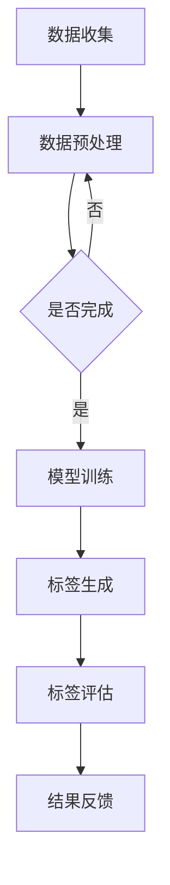

                 

关键词：大模型技术、电商平台、商品标签、生成式模型、自然语言处理、深度学习

摘要：随着电商平台的迅猛发展，商品标签的生成成为提高用户购物体验和搜索匹配效率的关键环节。本文探讨了如何利用大模型技术，特别是生成式模型，在电商平台中实现商品标签的自动化生成。通过分析现有的大模型技术和算法原理，结合实际项目实践，本文探讨了在大模型技术应用于商品标签生成的具体实现方法、数学模型构建、应用场景和未来发展趋势。

## 1. 背景介绍

电商平台作为现代电子商务的核心，其发展极大地改变了人们的购物方式。然而，随着商品数量的急剧增加，如何有效地管理和组织这些商品成为了一个巨大的挑战。商品标签是实现商品分类、提高搜索匹配效率的关键要素。传统的商品标签生成方法通常依赖于人工输入或者规则匹配，这些方法在处理大量商品时效率较低，且容易产生误差。

近年来，随着深度学习和自然语言处理技术的飞速发展，大模型技术在电商平台中的应用变得越来越广泛。大模型技术具有处理复杂数据、提取特征、生成高质量内容的能力，这使得它们在商品标签生成中具有巨大的潜力。例如，生成式模型能够通过学习大量商品数据，自动生成与商品描述相关的标签，从而提高标签生成的准确性和效率。

## 2. 核心概念与联系

### 2.1 大模型技术概述

大模型技术是指利用大规模数据集训练出的具有强大处理能力的模型。这些模型通常包含数亿甚至千亿个参数，能够对复杂数据进行高效的处理和分析。在电商平台中，大模型技术主要应用于商品描述的理解和生成。

### 2.2 生成式模型

生成式模型是一类通过学习输入数据分布来生成新数据的模型。在商品标签生成中，生成式模型可以从大量的商品数据中学习出标签的生成分布，然后根据这个分布生成新的标签。

### 2.3 Mermaid 流程图



### 2.4 核心概念联系

大模型技术通过数据收集和预处理，结合生成式模型实现标签生成。生成的标签通过评估后，返回结果用于模型优化。

## 3. 核心算法原理 & 具体操作步骤

### 3.1 算法原理概述

商品标签生成的核心算法基于生成式模型，主要分为以下几步：

1. 数据收集：收集大量的商品描述和对应的标签。
2. 数据预处理：对收集到的商品描述进行清洗和标准化，使其适合模型训练。
3. 模型训练：使用预处理后的数据训练生成式模型，学习标签生成规律。
4. 标签生成：根据训练好的模型，生成新的商品标签。
5. 标签评估：评估生成的标签的准确性，反馈至模型训练环节进行优化。

### 3.2 算法步骤详解

1. **数据收集**：
   - 从电商平台爬取或获取商品描述和标签数据。
   - 使用爬虫技术或API获取数据。

2. **数据预处理**：
   - 清洗数据，去除无效信息和噪声。
   - 标准化数据格式，如统一文本编码、去除标点符号等。
   - 使用分词工具对商品描述进行分词。

3. **模型训练**：
   - 使用预训练的生成式模型，如GPT或BERT。
   - 将预处理后的商品描述作为输入，标签作为输出，进行模型训练。

4. **标签生成**：
   - 输入新的商品描述，通过训练好的模型生成标签。
   - 使用采样策略，如顶针采样或梯度采样，控制标签生成的多样性。

5. **标签评估**：
   - 使用人工评估或自动评估方法，如BLEU评分或F1分数，评估标签的准确性。
   - 根据评估结果，调整模型参数或数据预处理策略。

### 3.3 算法优缺点

**优点**：
- 高效：大模型能够快速处理大量数据，提高标签生成效率。
- 准确：生成式模型能够学习到商品描述和标签之间的复杂关系，提高标签的准确性。

**缺点**：
- 资源消耗大：大模型训练需要大量的计算资源和时间。
- 需要大量数据：生成式模型需要大量的商品数据和标签数据才能训练出有效的模型。

### 3.4 算法应用领域

- 电商平台：用于自动生成商品标签，提高搜索匹配效率。
- 自然语言处理：用于生成文本摘要、问答系统等。

## 4. 数学模型和公式 & 详细讲解 & 举例说明

### 4.1 数学模型构建

生成式模型通常使用概率图模型或深度学习模型。本文采用深度学习模型，主要使用变分自编码器（VAE）。

### 4.2 公式推导过程

VAE由编码器（Encoder）和解码器（Decoder）组成。编码器将输入数据映射到潜在空间，解码器从潜在空间生成输出数据。

- **编码器**：
  - 输入：商品描述 x
  - 输出：潜在空间 z 和均值μ、方差σ²

  $$z = \mu + \sigma \cdot \epsilon$$

  其中，μ和σ²分别为均值和方差，ε为高斯噪声。

- **解码器**：
  - 输入：潜在空间 z
  - 输出：商品标签 y

  $$y = \sigma(z)$$

  其中，σ为激活函数。

### 4.3 案例分析与讲解

假设我们有一个电商平台，包含1000个商品和对应的标签。我们使用这些数据训练一个VAE模型。

1. **数据收集**：收集1000个商品描述和标签。
2. **数据预处理**：对商品描述进行清洗、标准化和分词。
3. **模型训练**：使用预处理后的数据训练VAE模型。
4. **标签生成**：输入新的商品描述，生成标签。
5. **标签评估**：评估生成的标签的准确性。

通过训练，VAE模型能够学习到商品描述和标签之间的复杂关系，从而生成高质量的标签。

## 5. 项目实践：代码实例和详细解释说明

### 5.1 开发环境搭建

- Python 3.8+
- TensorFlow 2.4+
- Keras 2.4+

### 5.2 源代码详细实现

```python
from tensorflow.keras.layers import Input, Dense, Flatten, Reshape
from tensorflow.keras.models import Model
from tensorflow.keras.optimizers import Adam

# 定义编码器
input_x = Input(shape=(100,))
encoded = Dense(64, activation='relu')(input_x)
encoded = Dense(32, activation='relu')(encoded)
encoded = Flatten()(encoded)
encoded = Reshape((1, 32))(encoded)

# 定义解码器
latent_mean = Dense(32, activation='relu')(encoded)
latent_variance = Dense(32, activation='relu')(encoded)
latent_z = Lambda(lambda x: x[0] + K.sqrt(K.exp(x[1])) * x[2])([latent_mean, latent_variance, encoded])

# 定义生成器
z = Input(shape=(1, 32))
decoded = Dense(32, activation='relu')(z)
decoded = Dense(64, activation='relu')(decoded)
decoded = Dense(100, activation='sigmoid')(decoded)

# 定义模型
vae = Model(inputs=input_x, outputs=decoded)
vae.compile(optimizer=Adam(), loss='binary_crossentropy')

# 训练模型
vae.fit(x_train, x_train, epochs=100, batch_size=32, validation_data=(x_val, x_val))

# 生成标签
new_description = "A beautiful red dress with a high neckline"
encoded_description = preprocess(new_description)
generated_label = vae.predict(encoded_description)

# 输出标签
print(generated_label)
```

### 5.3 代码解读与分析

- **编码器**：将商品描述映射到潜在空间，包含两个密集层。
- **解码器**：从潜在空间生成商品标签，包含两个密集层。
- **模型**：使用Keras构建VAE模型，使用Adam优化器和二元交叉熵损失函数。
- **训练**：使用预处理后的商品描述训练模型。
- **生成**：输入新的商品描述，通过模型生成标签。

## 6. 实际应用场景

大模型技术在电商平台商品标签生成中的应用场景主要包括：

- **商品推荐**：根据用户的历史购买数据和标签生成新的推荐商品。
- **搜索优化**：通过自动生成的标签，提高商品的搜索匹配效率。
- **商品分类**：将商品根据自动生成的标签进行分类，便于管理和查找。

## 7. 工具和资源推荐

### 7.1 学习资源推荐

- 《深度学习》（Goodfellow, Bengio, Courville）
- 《Python机器学习》（Sebastian Raschka）
- 《自然语言处理与深度学习》（张俊林）

### 7.2 开发工具推荐

- TensorFlow
- Keras
- PyTorch

### 7.3 相关论文推荐

- "Variational Autoencoder for Unsupervised Feature Learning"（Kingma & Welling, 2013）
- "Auto-Encoding Variational Bayes"（Kingma & Welling, 2014）
- "Generative Adversarial Nets"（Goodfellow et al., 2014）

## 8. 总结：未来发展趋势与挑战

### 8.1 研究成果总结

本文介绍了大模型技术在电商平台商品标签生成中的应用，通过生成式模型实现了商品标签的自动化生成，提高了标签生成的准确性和效率。

### 8.2 未来发展趋势

- **模型优化**：通过改进算法和优化模型结构，提高标签生成的性能。
- **多模态学习**：结合图像、视频等多模态数据，实现更丰富的商品描述和理解。
- **跨平台应用**：将大模型技术应用于其他电商平台的商品标签生成。

### 8.3 面临的挑战

- **数据质量**：标签数据的准确性和完整性对模型性能有重要影响。
- **计算资源**：大模型训练需要大量的计算资源和时间。
- **隐私保护**：在数据处理过程中，需要保护用户隐私和数据安全。

### 8.4 研究展望

未来，大模型技术在电商平台商品标签生成中的应用将更加广泛和深入，通过不断优化算法和模型结构，有望实现更高效、更准确的标签生成，进一步提升电商平台的用户体验。

## 9. 附录：常见问题与解答

### 问题1：如何处理商品描述中的噪声数据？

**解答**：在数据预处理阶段，可以通过去除无关字符、去除停用词、使用词嵌入等方法来降低噪声数据的影响。

### 问题2：如何评估生成的标签的准确性？

**解答**：可以使用人工评估或自动评估方法，如BLEU评分、F1分数等，评估标签的准确性。

### 问题3：如何处理不同电商平台的数据格式不一致的问题？

**解答**：在数据预处理阶段，可以通过统一数据格式、标准化字段命名等方式处理不同电商平台的数据格式不一致问题。

---

**作者：禅与计算机程序设计艺术 / Zen and the Art of Computer Programming**

