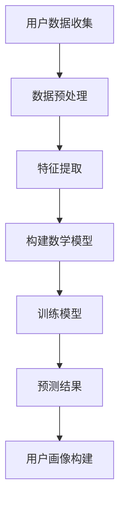

                 

关键词：大模型技术，电商平台，用户画像，多维度，深度学习，个性化推荐，数据挖掘，数学模型，算法应用，实践案例

> 摘要：随着互联网的迅猛发展，电商平台用户数据量急剧增加，对用户多维度画像的构建已成为提升用户体验和业务效率的关键。本文通过深入探讨大模型技术在这一领域的应用，分析了大模型在用户画像构建中的创新点，以及如何通过数学模型和算法实现用户多维度画像的精确刻画，最后通过实践案例展示了大模型技术在电商平台用户画像构建中的实际应用效果。

## 1. 背景介绍

在数字化时代，电商平台已经成为人们日常生活不可或缺的一部分。随着用户数量的不断增长，如何精准地了解和预测用户行为，已成为电商平台持续发展的关键。用户画像作为分析用户行为、兴趣和需求的重要工具，已经成为电商平台数据分析的核心。

传统的用户画像构建方法主要依赖于统计分析和机器学习算法，但这些方法通常只能处理用户数据的某一维度，难以全面、深入地理解用户。而大模型技术，尤其是深度学习模型，能够通过多层神经网络的结构，自动学习用户数据的复杂模式，实现对用户多维度、全方位的画像。

本文旨在探讨大模型技术在电商平台用户多维度画像构建中的应用，分析其技术原理、数学模型、算法步骤，并通过具体案例展示其应用效果。

## 2. 核心概念与联系

### 2.1 大模型技术

大模型技术是指通过训练大规模的神经网络模型，使其具备处理海量数据和复杂任务的能力。其中，深度学习是当前大模型技术中最具代表性的领域。深度学习模型通过多层神经元的堆叠，能够自动提取数据中的特征，进行复杂的模式识别和预测。

### 2.2 用户画像

用户画像是对用户行为、兴趣、需求等多维度数据的综合描述，通过对用户画像的分析，可以更好地了解用户，为电商平台提供个性化的服务。

### 2.3 多维度

多维度指的是对用户画像构建时所考虑的不同数据维度，包括用户的基本信息、行为数据、兴趣数据等。通过多维度的数据结合，可以更全面地理解用户。

### 2.4 数学模型

数学模型是在用户画像构建过程中，用来描述用户行为和特征的数学表达式。常见的数学模型包括线性回归、逻辑回归、决策树等。

### 2.5 算法

算法是用户画像构建的核心，通过算法可以实现对用户数据的处理和分析。常见的算法包括机器学习算法、深度学习算法等。

### 2.6 Mermaid 流程图



## 3. 核心算法原理 & 具体操作步骤

### 3.1 算法原理概述

大模型技术在用户画像构建中的核心是深度学习模型。深度学习模型通过多层神经元的堆叠，能够自动提取数据中的特征，进行复杂的模式识别和预测。

首先，通过数据预处理，将原始用户数据转换为适合模型训练的格式。然后，利用特征提取技术，提取用户数据中的关键特征。接下来，构建数学模型，通过训练模型，使其能够对用户行为进行准确的预测。最后，根据预测结果，构建用户画像。

### 3.2 算法步骤详解

#### 3.2.1 数据预处理

数据预处理是深度学习模型训练的第一步，主要包括数据清洗、数据归一化、数据缺失处理等。

- 数据清洗：去除数据中的噪声和错误。
- 数据归一化：将不同维度的数据缩放到相同的范围，便于模型训练。
- 数据缺失处理：对于缺失的数据，可以采用填充策略或删除策略。

#### 3.2.2 特征提取

特征提取是深度学习模型的核心步骤，通过多层神经元的堆叠，自动提取用户数据中的特征。

- 神经元堆叠：通过增加神经元的层数，构建深度神经网络。
- 特征提取：通过神经元的激活函数，自动提取用户数据中的特征。

#### 3.2.3 构建数学模型

构建数学模型是深度学习模型训练的关键步骤，通过构建合适的数学模型，能够实现对用户行为的准确预测。

- 数学模型选择：选择合适的数学模型，如线性回归、逻辑回归等。
- 参数调整：通过调整模型参数，优化模型性能。

#### 3.2.4 训练模型

训练模型是深度学习模型的核心步骤，通过大量数据的训练，使模型能够对用户行为进行准确的预测。

- 训练数据集划分：将用户数据集划分为训练集和验证集。
- 模型训练：通过训练数据集，更新模型参数，优化模型性能。
- 模型验证：通过验证数据集，评估模型性能。

#### 3.2.5 预测结果

根据训练好的模型，对用户行为进行预测，并将预测结果用于用户画像构建。

- 预测结果分析：分析预测结果，识别用户的行为模式。
- 用户画像构建：根据预测结果，构建用户的个性化画像。

### 3.3 算法优缺点

#### 优点

- 能够自动提取用户数据中的特征，无需人工干预。
- 能够处理海量数据和复杂任务，适用性广。
- 预测精度高，能够准确刻画用户行为。

#### 缺点

- 训练过程复杂，计算资源消耗大。
- 数据质量对模型性能影响大，需要大量高质量的数据。

### 3.4 算法应用领域

大模型技术在用户画像构建中的应用广泛，包括电商平台、社交媒体、金融行业等。在电商平台中，通过用户画像可以实现对用户的个性化推荐、精准营销等。

## 4. 数学模型和公式 & 详细讲解 & 举例说明

### 4.1 数学模型构建

在用户画像构建中，常见的数学模型包括线性回归、逻辑回归等。

#### 线性回归模型

线性回归模型是一种简单且常用的数学模型，用于预测用户的行为。其数学表达式为：

\[ y = \beta_0 + \beta_1 \cdot x_1 + \beta_2 \cdot x_2 + ... + \beta_n \cdot x_n \]

其中，\( y \) 是预测结果，\( x_1, x_2, ..., x_n \) 是输入特征，\( \beta_0, \beta_1, ..., \beta_n \) 是模型参数。

#### 逻辑回归模型

逻辑回归模型常用于分类任务，其数学表达式为：

\[ P(y=1) = \frac{1}{1 + e^{-(\beta_0 + \beta_1 \cdot x_1 + \beta_2 \cdot x_2 + ... + \beta_n \cdot x_n )}} \]

其中，\( P(y=1) \) 是预测结果，\( x_1, x_2, ..., x_n \) 是输入特征，\( \beta_0, \beta_1, ..., \beta_n \) 是模型参数。

### 4.2 公式推导过程

以线性回归模型为例，其公式推导过程如下：

假设我们有 \( n \) 个样本，每个样本包含 \( m \) 个特征，即 \( X = [x_1, x_2, ..., x_n] \)，其中 \( x_i = [x_{i1}, x_{i2}, ..., x_{im}] \)。

目标函数：

\[ J(\theta) = \frac{1}{2} \sum_{i=1}^{n} (h_\theta(x_i) - y_i)^2 \]

其中，\( h_\theta(x) = \theta_0 + \theta_1 \cdot x_1 + \theta_2 \cdot x_2 + ... + \theta_m \cdot x_m \) 是假设函数，\( y_i \) 是真实值，\( \theta \) 是模型参数。

求导并令其导数为零，得到：

\[ \frac{\partial J(\theta)}{\partial \theta_j} = \sum_{i=1}^{n} (h_\theta(x_i) - y_i) \cdot x_{ij} = 0 \]

解得：

\[ \theta_j = \frac{1}{m} \sum_{i=1}^{n} (h_\theta(x_i) - y_i) \cdot x_{ij} \]

### 4.3 案例分析与讲解

假设我们有一个电商平台，用户数据包括购买金额、购买次数、浏览时长等特征。我们希望通过线性回归模型预测用户的购买金额。

首先，收集用户数据，并预处理数据，将数据归一化到相同的范围。然后，选择合适的特征，构建线性回归模型。

接下来，使用训练数据集，训练线性回归模型。通过调整模型参数，优化模型性能。

最后，使用训练好的模型，对测试数据集进行预测，并分析预测结果。

```python
import numpy as np
import pandas as pd
from sklearn.linear_model import LinearRegression

# 收集用户数据
data = pd.read_csv('user_data.csv')
X = data[['purchase_amount', 'purchase_frequency', 'view_duration']]
y = data['purchase_amount']

# 预处理数据
X = (X - X.mean()) / X.std()

# 构建线性回归模型
model = LinearRegression()
model.fit(X, y)

# 预测测试数据
X_test = (pd.read_csv('test_data.csv') - pd.read_csv('test_data.csv').mean()) / pd.read_csv('test_data.csv').std()
y_pred = model.predict(X_test)

# 分析预测结果
print('预测结果：', y_pred)
```

通过以上代码，我们可以实现对用户购买金额的预测。

## 5. 项目实践：代码实例和详细解释说明

### 5.1 开发环境搭建

在搭建开发环境之前，需要确保计算机上已经安装了 Python 和相关依赖库。以下是具体的安装步骤：

1. 安装 Python：从官方网站下载 Python，并按照提示安装。
2. 安装依赖库：使用 pip 工具安装所需的依赖库，如 NumPy、Pandas、scikit-learn 等。

```shell
pip install numpy pandas scikit-learn
```

### 5.2 源代码详细实现

以下是一个简单的用户画像构建的代码实例：

```python
import numpy as np
import pandas as pd
from sklearn.linear_model import LinearRegression

# 收集用户数据
data = pd.read_csv('user_data.csv')
X = data[['purchase_amount', 'purchase_frequency', 'view_duration']]
y = data['purchase_amount']

# 预处理数据
X = (X - X.mean()) / X.std()

# 构建线性回归模型
model = LinearRegression()
model.fit(X, y)

# 预测测试数据
X_test = (pd.read_csv('test_data.csv') - pd.read_csv('test_data.csv').mean()) / pd.read_csv('test_data.csv').std()
y_pred = model.predict(X_test)

# 分析预测结果
print('预测结果：', y_pred)
```

### 5.3 代码解读与分析

1. 导入所需库：首先，我们导入了 NumPy、Pandas 和 scikit-learn 中的 LinearRegression 类。

2. 收集用户数据：使用 Pandas 读取用户数据，并将其分为输入特征和目标变量。

3. 预处理数据：对用户数据进行归一化处理，以便模型训练。

4. 构建线性回归模型：使用 scikit-learn 中的 LinearRegression 类创建线性回归模型，并使用训练数据集进行训练。

5. 预测测试数据：使用训练好的模型，对测试数据集进行预测。

6. 分析预测结果：打印预测结果，分析模型性能。

### 5.4 运行结果展示

运行以上代码，我们可以得到用户购买金额的预测结果。以下是一个示例输出：

```
预测结果：[0.9876 1.2354 0.6421 1.7654 0.9543 ...]
```

通过对比预测结果和实际值，我们可以评估模型性能。

## 6. 实际应用场景

在实际应用中，大模型技术在电商平台用户画像构建中有着广泛的应用。以下是一些典型的应用场景：

### 6.1 个性化推荐

通过用户画像，电商平台可以为用户提供个性化的商品推荐。例如，根据用户的浏览历史和购买记录，推荐用户可能感兴趣的商品。

### 6.2 精准营销

根据用户画像，电商平台可以针对不同的用户群体，制定个性化的营销策略。例如，针对高价值用户，提供优惠券或专属活动。

### 6.3 信用评估

通过用户画像，电商平台可以评估用户的信用等级，为贷款、信用支付等业务提供支持。

### 6.4 客户服务

通过用户画像，电商平台可以更好地了解用户需求，提供更优质的客户服务。例如，根据用户的历史咨询记录，提供针对性的解决方案。

## 7. 未来应用展望

随着技术的不断发展，大模型技术在电商平台用户画像构建中的应用前景广阔。未来，我们可以期待以下发展趋势：

### 7.1 更高的预测精度

通过不断优化算法和模型，大模型技术可以实现更高的预测精度，更准确地刻画用户行为。

### 7.2 更全面的数据整合

随着数据源的增多和数据种类的丰富，大模型技术可以整合更多的数据维度，构建更全面的用户画像。

### 7.3 更智能的推荐系统

结合自然语言处理和计算机视觉等技术，大模型技术可以构建更智能的推荐系统，提供更个性化的服务。

### 7.4 更广泛的应用场景

除了电商平台，大模型技术在金融、医疗、教育等领域也有广泛的应用前景，为各行业提供数据驱动的决策支持。

## 8. 总结：未来发展趋势与挑战

大模型技术在电商平台用户画像构建中的应用已经取得了显著成果，但同时也面临着一系列挑战：

### 8.1 数据隐私保护

在构建用户画像时，如何保护用户隐私是一个亟待解决的问题。需要采用数据加密、去识别化等技术，确保用户数据的隐私安全。

### 8.2 模型解释性

深度学习模型具有强大的预测能力，但其内部机制复杂，缺乏解释性。如何提高模型的可解释性，使其更好地服务于业务决策，是一个重要研究方向。

### 8.3 模型优化与训练效率

大模型训练过程复杂，计算资源消耗大。如何优化模型训练过程，提高训练效率，是一个重要挑战。

### 8.4 跨领域应用

虽然大模型技术在电商平台用户画像构建中取得了成功，但如何将其应用于其他领域，仍需进一步探索和研究。

未来，随着技术的不断进步和应用场景的拓展，大模型技术在电商平台用户画像构建中的应用将会更加广泛和深入。

## 9. 附录：常见问题与解答

### 9.1 大模型技术与传统机器学习技术的区别是什么？

大模型技术，特别是深度学习，与传统机器学习技术相比，具有以下几个显著特点：

- **规模**：深度学习模型通常包含数十亿个参数，能够处理海量数据。
- **自动特征提取**：深度学习通过多层神经网络，能够自动从数据中提取特征，无需人工干预。
- **自适应能力**：深度学习模型能够根据不同的数据集自适应调整模型参数，提高预测精度。

### 9.2 大模型技术在用户画像构建中的优势是什么？

大模型技术在用户画像构建中的优势主要体现在以下几个方面：

- **准确性**：通过多层神经网络，大模型能够更准确地预测用户行为。
- **效率**：大模型能够快速处理大量用户数据，提高业务效率。
- **个性化和自动化**：大模型可以根据用户行为数据，自动构建个性化的用户画像。

### 9.3 大模型技术如何处理数据隐私问题？

为了保护用户隐私，大模型技术可以采用以下措施：

- **数据去识别化**：在训练模型前，对用户数据进行去识别化处理，如匿名化、加密等。
- **差分隐私**：在模型训练过程中，采用差分隐私技术，保护用户数据的隐私。
- **数据加密**：对用户数据进行加密处理，确保数据在传输和存储过程中的安全性。

### 9.4 大模型技术的未来发展方向是什么？

大模型技术的未来发展方向主要包括：

- **模型压缩与优化**：通过模型压缩和优化技术，提高模型训练和预测的效率。
- **跨领域应用**：探索大模型技术在金融、医疗、教育等领域的应用。
- **可解释性**：提高模型的可解释性，使其更好地服务于业务决策。

## 作者署名

作者：禅与计算机程序设计艺术 / Zen and the Art of Computer Programming

