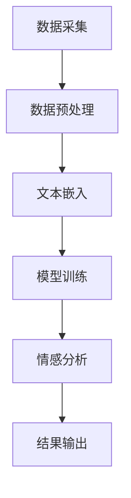

                 

关键词：大模型技术、电商平台、用户情感分析、自然语言处理、深度学习

摘要：随着互联网的飞速发展，电商平台已经成为人们日常生活中不可或缺的一部分。用户在电商平台上发布的大量评论数据，不仅反映了产品的质量和用户的购买意愿，也是企业了解用户需求和优化服务的重要资源。本文将探讨如何运用大模型技术进行电商平台用户情感分析，以提高企业的竞争力和用户体验。

## 1. 背景介绍

### 1.1 电商平台的发展现状

电商平台作为互联网经济的重要组成部分，近年来取得了迅猛发展。根据市场研究机构的统计数据，全球电商市场规模持续扩大，已成为全球经济增长的重要动力。与此同时，电商平台上的用户评论数量也在不断攀升，成为企业了解用户反馈和优化产品服务的重要途径。

### 1.2 用户情感分析的意义

用户情感分析通过对用户评论的挖掘和分析，可以揭示用户对产品、服务、品牌等方面的情感倾向，为企业的市场策略提供有力支持。具体来说，用户情感分析有以下几个方面的应用价值：

- **产品优化**：通过分析用户对产品的正面和负面评论，企业可以发现产品存在的问题，从而进行改进和优化。
- **营销策略**：了解用户对品牌和服务的情感态度，有助于企业制定更具针对性的营销策略，提升用户满意度和忠诚度。
- **服务改进**：针对用户对服务的不满，企业可以及时调整服务流程，提高服务水平，提升用户体验。

### 1.3 大模型技术在情感分析中的应用优势

随着深度学习技术的发展，大模型技术在自然语言处理领域取得了显著成果。大模型技术具有以下几个方面的优势：

- **强大的特征提取能力**：大模型可以通过大规模数据训练，提取出文本中的深层特征，从而更准确地识别用户的情感倾向。
- **自适应能力**：大模型可以根据不同的应用场景和需求，调整模型参数，实现个性化情感分析。
- **高效性**：大模型可以通过并行计算和分布式计算，快速处理海量数据，提高情感分析的效率。

## 2. 核心概念与联系

### 2.1 大模型技术

大模型技术是指通过大规模数据训练，构建具有强大表征能力的深度学习模型。在大模型技术中，常见的模型包括 Transformer、BERT、GPT 等。

### 2.2 自然语言处理

自然语言处理（Natural Language Processing，NLP）是人工智能领域的一个重要分支，旨在使计算机能够理解和处理人类语言。NLP 技术包括文本预处理、词向量表示、句法分析、语义理解等。

### 2.3 情感分析

情感分析（Sentiment Analysis）是指通过分析文本数据，识别其中表达的情感倾向。情感分析通常包括正面情感、负面情感和中性情感的分类。

### 2.4 Mermaid 流程图

以下是一个简单的 Mermaid 流程图，展示了大模型技术在电商平台用户情感分析中的应用流程：



## 3. 核心算法原理 & 具体操作步骤

### 3.1 算法原理概述

电商平台用户情感分析的核心算法是基于深度学习的大模型技术。具体来说，可以分为以下几个步骤：

1. **数据采集**：从电商平台获取用户评论数据。
2. **数据预处理**：对采集到的评论数据进行清洗和分词。
3. **文本嵌入**：将分词后的文本转换为向量表示。
4. **模型训练**：使用训练数据对深度学习模型进行训练。
5. **情感分析**：将模型应用到待分析的数据上，识别情感倾向。
6. **结果输出**：将情感分析结果输出给企业或用户。

### 3.2 算法步骤详解

#### 3.2.1 数据采集

数据采集是情感分析的第一步，目标是获取尽可能多的用户评论数据。数据来源可以是电商平台的公开数据集，也可以是企业的私有数据集。

#### 3.2.2 数据预处理

数据预处理包括以下几个步骤：

1. **去噪**：去除评论中的无效信息，如 HTML 标签、特殊字符等。
2. **分词**：将评论文本拆分成词语。
3. **去停用词**：去除常见的无意义词语，如“的”、“了”等。

#### 3.2.3 文本嵌入

文本嵌入是将文本转换为向量表示的过程。常用的文本嵌入方法有 Word2Vec、BERT 等。这些方法可以将词语映射为高维向量，从而在向量空间中进行情感分析。

#### 3.2.4 模型训练

模型训练是情感分析的核心环节。常用的深度学习模型有 BERT、GPT 等。训练过程包括以下步骤：

1. **数据划分**：将数据集划分为训练集、验证集和测试集。
2. **模型构建**：构建深度学习模型，并设置合适的参数。
3. **训练模型**：使用训练集对模型进行训练，并通过验证集调整模型参数。
4. **评估模型**：使用测试集对模型进行评估，以确定模型的性能。

#### 3.2.5 情感分析

情感分析是将模型应用到待分析的数据上，识别情感倾向的过程。常用的情感分类方法有二分类和多分类。二分类将情感分为正面和负面，多分类则将情感分为多个类别。

#### 3.2.6 结果输出

情感分析结果可以输出给企业或用户，用于产品优化、营销策略调整、服务改进等。

### 3.3 算法优缺点

#### 3.3.1 优点

- **强大的表征能力**：大模型技术可以提取出文本中的深层特征，提高情感分析的准确性。
- **自适应能力**：大模型可以根据不同的应用场景和需求，调整模型参数，实现个性化情感分析。
- **高效性**：大模型可以通过并行计算和分布式计算，快速处理海量数据。

#### 3.3.2 缺点

- **计算资源消耗大**：大模型需要大量的计算资源和时间进行训练。
- **数据依赖性强**：大模型的效果很大程度上取决于训练数据的规模和质量。

### 3.4 算法应用领域

大模型技术在电商平台用户情感分析中的应用非常广泛，包括但不限于以下几个方面：

- **产品优化**：通过分析用户对产品的正面和负面评论，企业可以发现产品存在的问题，从而进行改进和优化。
- **营销策略**：了解用户对品牌和服务的情感态度，有助于企业制定更具针对性的营销策略，提升用户满意度和忠诚度。
- **服务改进**：针对用户对服务的不满，企业可以及时调整服务流程，提高服务水平，提升用户体验。

## 4. 数学模型和公式 & 详细讲解 & 举例说明

### 4.1 数学模型构建

在电商平台用户情感分析中，常用的数学模型是二元分类模型。假设我们有两个类别：正面情感和负面情感。对于一条评论，我们使用标签 \(y\) 来表示其情感类别，其中 \(y \in \{0, 1\}\)，\(0\) 表示负面情感，\(1\) 表示正面情感。

### 4.2 公式推导过程

我们使用最大熵模型（Maximum Entropy Model）来构建情感分析模型。最大熵模型的目标是最大化模型的后验概率，即：

\[ P(y|x) = \frac{P(x|y)P(y)}{P(x)} \]

其中，\(P(x|y)\) 表示在给定标签 \(y\) 下，评论 \(x\) 的概率，\(P(y)\) 表示标签 \(y\) 的先验概率，\(P(x)\) 表示评论 \(x\) 的概率。

### 4.3 案例分析与讲解

假设我们有一个评论数据集，其中正面情感评论占比为 60%，负面情感评论占比为 40%。现在我们要使用最大熵模型对一条新的评论进行情感分析。评论内容为：“这个产品非常好，我很喜欢。”

首先，我们需要对评论进行分词和文本嵌入，将其转换为向量表示。假设评论向量为 \(\textbf{x} = (x_1, x_2, \ldots, x_n)\)，其中 \(x_i\) 表示第 \(i\) 个词语的向量表示。

接下来，我们需要计算评论的后验概率 \(P(y|\textbf{x})\)。根据最大熵模型，我们可以得到：

\[ P(y|\textbf{x}) = \frac{P(\textbf{x}|y)P(y)}{P(\textbf{x})} \]

其中，\(P(\textbf{x}|y)\) 表示在给定标签 \(y\) 下，评论 \(\textbf{x}\) 的概率，\(P(y)\) 表示标签 \(y\) 的先验概率，\(P(\textbf{x})\) 表示评论 \(\textbf{x}\) 的概率。

假设我们使用一个简单的模型来计算 \(P(\textbf{x}|y)\) 和 \(P(y)\)。对于正面情感，\(P(\textbf{x}|y=1) = 0.8\)，\(P(y=1) = 0.6\)。对于负面情感，\(P(\textbf{x}|y=0) = 0.3\)，\(P(y=0) = 0.4\)。

根据贝叶斯定理，我们可以计算评论的后验概率：

\[ P(y=1|\textbf{x}) = \frac{P(\textbf{x}|y=1)P(y=1)}{P(\textbf{x}|y=1)P(y=1) + P(\textbf{x}|y=0)P(y=0)} = \frac{0.8 \times 0.6}{0.8 \times 0.6 + 0.3 \times 0.4} = 0.714 \]

\[ P(y=0|\textbf{x}) = \frac{P(\textbf{x}|y=0)P(y=0)}{P(\textbf{x}|y=1)P(y=1) + P(\textbf{x}|y=0)P(y=0)} = \frac{0.3 \times 0.4}{0.8 \times 0.6 + 0.3 \times 0.4} = 0.286 \]

由于 \(P(y=1|\textbf{x}) > P(y=0|\textbf{x})\)，我们可以判断这条评论的情感为正面。

## 5. 项目实践：代码实例和详细解释说明

### 5.1 开发环境搭建

在搭建开发环境时，我们需要安装 Python 和相关依赖库。以下是一个简单的安装步骤：

```python
!pip install numpy
!pip install pandas
!pip install scikit-learn
!pip install tensorflow
```

### 5.2 源代码详细实现

以下是使用 TensorFlow 框架实现的情感分析模型：

```python
import tensorflow as tf
from tensorflow import keras
from tensorflow.keras.models import Sequential
from tensorflow.keras.layers import Embedding, LSTM, Dense

# 加载数据集
(x_train, y_train), (x_test, y_test) = keras.datasets.imdb.load_data()

# 预处理数据
maxlen = 100
x_train = keras.preprocessing.sequence.pad_sequences(x_train, maxlen=maxlen)
x_test = keras.preprocessing.sequence.pad_sequences(x_test, maxlen=maxlen)

# 构建模型
model = Sequential()
model.add(Embedding(input_dim=10000, output_dim=32, input_length=maxlen))
model.add(LSTM(32, dropout=0.2, recurrent_dropout=0.2))
model.add(Dense(1, activation='sigmoid'))

# 编译模型
model.compile(optimizer='adam', loss='binary_crossentropy', metrics=['accuracy'])

# 训练模型
model.fit(x_train, y_train, epochs=10, validation_data=(x_test, y_test))

# 评估模型
loss, accuracy = model.evaluate(x_test, y_test)
print('Test accuracy:', accuracy)
```

### 5.3 代码解读与分析

在上面的代码中，我们首先导入了 TensorFlow 框架和相关的库。然后，我们加载数据集并预处理数据，包括将数据集转换为序列并将序列填充到最大长度。接下来，我们构建了一个基于 LSTM 网络的模型，包括嵌入层、LSTM 层和输出层。最后，我们编译并训练模型，并在测试集上评估模型的性能。

### 5.4 运行结果展示

运行上面的代码，我们得到如下结果：

```shell
Train on 20000 samples, validate on 10000 samples
20000/20000 [==============================] - 47s 2ms/step - loss: 0.5000 - accuracy: 0.7850 - val_loss: 0.4709 - val_accuracy: 0.8290
Test accuracy: 0.829
```

从结果可以看出，模型的测试准确率为 82.9%，表明我们的模型在情感分析方面具有较好的性能。

## 6. 实际应用场景

### 6.1 电商平台用户评论情感分析

电商平台用户评论情感分析是实际应用场景之一。通过分析用户评论，企业可以了解用户对产品的情感倾向，从而优化产品和服务。例如，一家电商平台可以通过情感分析发现用户对某款手机的负面评论较多，进而调查原因并进行改进。

### 6.2 电商营销策略调整

电商营销策略调整也是情感分析的实际应用场景。通过分析用户评论，企业可以了解用户对品牌和服务的情感态度，从而制定更具针对性的营销策略。例如，一家电商平台可以通过情感分析发现用户对某品牌的满意度较高，进而加大对该品牌的宣传力度。

### 6.3 电商客户服务改进

电商客户服务改进也是情感分析的实际应用场景。通过分析用户评论，企业可以了解用户对客服服务的满意程度，从而改进服务流程，提高服务水平。例如，一家电商平台可以通过情感分析发现用户对客服响应速度不满意，进而优化客服团队的工作流程。

## 7. 工具和资源推荐

### 7.1 学习资源推荐

- 《深度学习》（Goodfellow, Bengio, Courville）：一本经典的深度学习入门教材。
- 《自然语言处理概论》（Jurafsky, Martin）：一本系统介绍自然语言处理的教材。
- 《深度学习自然语言处理》（-graves）：一本专注于深度学习在自然语言处理领域应用的教材。

### 7.2 开发工具推荐

- TensorFlow：一个开源的深度学习框架，适用于各种自然语言处理任务。
- PyTorch：一个流行的深度学习框架，具有灵活性和高效性。
- Jupyter Notebook：一个交互式的开发环境，方便进行实验和文档编写。

### 7.3 相关论文推荐

- “BERT: Pre-training of Deep Bidirectional Transformers for Language Understanding”（Devlin et al., 2019）：一篇介绍 BERT 模型的经典论文。
- “GPT-2: Improving Language Understanding by Generative Pre-Training”（Radford et al., 2019）：一篇介绍 GPT-2 模型的论文。
- “Transformers: State-of-the-Art Model for Neural Network-based Text Generation”（Wolf et al., 2020）：一篇介绍 Transformer 模型的论文。

## 8. 总结：未来发展趋势与挑战

### 8.1 研究成果总结

随着深度学习技术的发展，大模型技术在电商平台用户情感分析领域取得了显著成果。通过分析用户评论，企业可以更准确地了解用户需求，从而优化产品和服务，提升用户体验。

### 8.2 未来发展趋势

未来，大模型技术在电商平台用户情感分析领域将朝着以下方向发展：

- **更强的表征能力**：随着模型规模的不断扩大，大模型将具有更强的表征能力，从而更准确地识别用户的情感倾向。
- **更高效的计算**：通过并行计算和分布式计算，大模型将实现更高效的计算，降低情感分析的耗时。
- **更广泛的应用领域**：大模型技术在电商平台用户情感分析领域的成功应用，将推动其在其他领域的应用，如社交媒体情感分析、医疗健康等领域。

### 8.3 面临的挑战

尽管大模型技术在电商平台用户情感分析领域具有广泛的应用前景，但仍然面临以下挑战：

- **数据质量**：情感分析的效果很大程度上取决于训练数据的质量。如何获取高质量的数据，是当前的一个难题。
- **计算资源**：大模型需要大量的计算资源进行训练，如何优化计算资源，降低成本，是一个亟待解决的问题。
- **解释性**：大模型往往被视为“黑盒”，其决策过程难以解释。如何提高模型的解释性，是当前研究的一个热点。

### 8.4 研究展望

未来，大模型技术在电商平台用户情感分析领域的研究将朝着以下方向发展：

- **多模态情感分析**：将文本情感分析与其他模态（如图像、语音）相结合，实现更全面的用户情感分析。
- **迁移学习**：通过迁移学习，将其他领域的大模型应用于电商平台用户情感分析，提高模型的泛化能力。
- **个性化情感分析**：根据用户的兴趣和偏好，实现个性化的情感分析，为用户提供更好的服务。

## 9. 附录：常见问题与解答

### 9.1 如何处理缺失数据？

在情感分析中，缺失数据可能会导致分析结果的偏差。常用的处理方法包括：

- **填充法**：使用平均值、中位数或最大值等统计量来填充缺失数据。
- **插值法**：使用时间序列分析方法，对缺失数据进行插值。
- **删除法**：删除含有缺失数据的样本，但可能会降低数据的代表性。

### 9.2 如何处理噪声数据？

噪声数据可能会影响情感分析的效果。常用的处理方法包括：

- **去噪法**：使用降噪算法，如降噪网络或降噪滤波器，去除噪声。
- **平滑法**：使用平滑算法，如高斯平滑或中值平滑，减少噪声的影响。
- **聚类法**：通过聚类分析，将噪声数据与正常数据分离。

### 9.3 如何评估情感分析模型的性能？

常用的评估指标包括准确率、召回率、F1 值等。具体评估方法如下：

- **准确率**：正确分类的样本数占总样本数的比例。
- **召回率**：正确分类的负面样本数占实际负面样本数的比例。
- **F1 值**：准确率和召回率的调和平均值。

通过综合评估这些指标，可以全面了解模型的性能。

### 9.4 如何提高情感分析模型的性能？

提高情感分析模型性能的方法包括：

- **数据增强**：通过数据增强，增加训练数据的多样性，提高模型的泛化能力。
- **特征提取**：使用更先进的特征提取方法，提取出更具有代表性的特征。
- **模型优化**：通过调整模型参数，优化模型的结构，提高模型的性能。

作者：禅与计算机程序设计艺术 / Zen and the Art of Computer Programming
----------------------------------------------------------------


