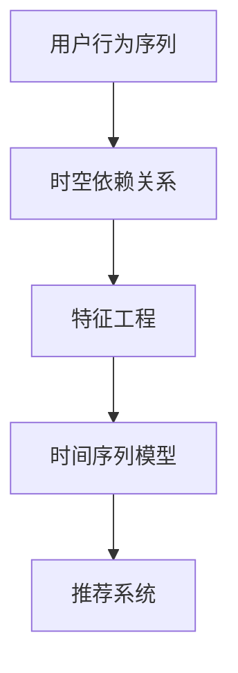

                 

关键词：大模型推荐、用户行为序列、时空依赖关系、建模、算法原理、数学模型、项目实践

> 摘要：本文将探讨在大模型推荐系统中，如何有效建模用户行为序列中的时空依赖关系。通过深入分析核心概念、算法原理、数学模型以及项目实践，旨在为读者提供一种理解和应用此领域知识的方法。

## 1. 背景介绍

在当今的信息时代，推荐系统已经成为互联网公司提高用户满意度和转化率的重要手段。然而，随着用户数据的爆发式增长和多样化，传统的推荐算法逐渐暴露出其局限性。例如，基于协同过滤的方法在处理稀疏数据和冷启动问题时表现不佳，而基于内容的推荐则难以应对用户需求的变化。为了解决这些问题，研究者们开始关注用户行为序列中的时空依赖关系，并尝试构建更为精准的推荐模型。

用户行为序列是指用户在一段时间内产生的操作序列，如浏览、点击、购买等。这些行为不仅反映了用户兴趣的变化，还蕴含了用户与内容之间的复杂时空关系。因此，如何有效地捕捉和利用这些时空依赖关系，成为了推荐系统研究的一个重要方向。

## 2. 核心概念与联系

为了理解用户行为序列时空依赖关系建模，我们首先需要了解以下几个核心概念：

- **用户行为序列**：指用户在一段时间内产生的操作序列，如浏览、点击、购买等。
- **时空依赖关系**：指用户在不同时间点上的行为之间存在的一种关联性，如用户在某时刻的浏览行为可能影响其后续的购买决策。
- **特征工程**：指通过数据预处理和特征提取，将原始的用户行为序列转化为适合模型训练的数据表示。
- **时间序列模型**：指一类专门用于处理时间序列数据的方法和算法，如ARIMA、LSTM等。

接下来，我们使用Mermaid流程图来展示这些核心概念之间的联系。



## 3. 核心算法原理 & 具体操作步骤

### 3.1 算法原理概述

用户行为序列时空依赖关系建模的核心在于捕捉用户行为之间的时空关系。这通常涉及到以下几个方面：

1. **时间嵌入**：将用户行为序列映射到一个高维空间中，使得具有相似时空关系的用户行为在空间上接近。
2. **特征提取**：从高维空间中提取有助于建模的特征，如时序特征、空间特征等。
3. **建模与预测**：使用时间序列模型来学习用户行为的时空依赖关系，并预测未来的用户行为。

### 3.2 算法步骤详解

以下是用户行为序列时空依赖关系建模的具体操作步骤：

1. **数据收集**：收集用户的行为数据，包括时间戳、行为类型、内容等信息。
2. **数据预处理**：对行为数据进行清洗、去重、时间归一化等操作，确保数据的质量。
3. **时间嵌入**：使用时间嵌入技术将用户行为序列映射到一个高维空间中，例如使用循环神经网络（RNN）或长短时记忆网络（LSTM）。
4. **特征提取**：从高维空间中提取时序特征和空间特征，如行为频率、行为间隔、行为序列模式等。
5. **建模与训练**：使用时间序列模型对提取的特征进行训练，学习用户行为的时空依赖关系。
6. **预测与评估**：使用训练好的模型进行预测，并对预测结果进行评估，如准确率、召回率等。

### 3.3 算法优缺点

- **优点**：
  - 能够捕捉用户行为之间的时空依赖关系，提高推荐系统的准确性和实时性。
  - 可以处理大量用户行为数据，适应大数据环境。
- **缺点**：
  - 需要大量的计算资源和时间来训练模型。
  - 特征提取和建模过程较为复杂，需要专业的技术和经验。

### 3.4 算法应用领域

用户行为序列时空依赖关系建模可以应用于多种场景，如电子商务、社交媒体、搜索引擎等。以下是一些具体的应用示例：

- **电子商务**：根据用户的历史购买行为，推荐可能感兴趣的商品。
- **社交媒体**：根据用户的浏览和点赞行为，推荐可能感兴趣的内容。
- **搜索引擎**：根据用户的搜索历史，推荐相关的搜索结果。

## 4. 数学模型和公式 & 详细讲解 & 举例说明

### 4.1 数学模型构建

用户行为序列时空依赖关系的建模通常涉及以下数学模型：

- **时间嵌入**：假设用户行为序列为\(x_t\)，其中\(t\)表示时间戳。我们可以使用以下公式来表示时间嵌入：

$$
x_t \xrightarrow{\text{嵌入}} x_t^{\text{emb}}
$$

- **特征提取**：从时间嵌入后的数据中提取特征，如时序特征\(F_t\)和空间特征\(S_t\)。我们可以使用以下公式来表示特征提取：

$$
x_t^{\text{emb}} \xrightarrow{\text{特征提取}} F_t, S_t
$$

- **时间序列模型**：假设我们使用LSTM模型来学习时空依赖关系，LSTM的输入为\(F_t, S_t\)，输出为\(y_t\)。我们可以使用以下公式来表示LSTM模型：

$$
y_t = \text{LSTM}(F_t, S_t)
$$

### 4.2 公式推导过程

用户行为序列时空依赖关系的建模过程可以概括为以下几个步骤：

1. **时间嵌入**：首先，我们需要将用户行为序列映射到一个高维空间中，使得具有相似时空关系的用户行为在空间上接近。这可以通过循环神经网络（RNN）或长短时记忆网络（LSTM）实现。

2. **特征提取**：从高维空间中提取时序特征和空间特征。时序特征可以包括行为频率、行为间隔、行为序列模式等；空间特征可以包括用户与内容的相似度、用户历史行为模式等。

3. **建模与训练**：使用时间序列模型（如LSTM）对提取的特征进行训练，学习用户行为的时空依赖关系。LSTM通过学习输入和隐藏状态之间的映射关系，捕捉时间序列数据中的长期依赖关系。

4. **预测与评估**：使用训练好的模型进行预测，并对预测结果进行评估。评估指标可以包括准确率、召回率、F1值等。

### 4.3 案例分析与讲解

假设我们有一个用户行为序列，如下所示：

$$
x_t = \{(\text{用户ID}, \text{内容ID}, \text{行为类型}, \text{时间戳})\}
$$

我们需要对用户行为序列进行时间嵌入、特征提取和建模。

1. **时间嵌入**：使用LSTM对用户行为序列进行时间嵌入。首先，将用户行为序列转化为LSTM的输入格式，如：

$$
x_t = \begin{bmatrix}
\text{行为类型} \\
\text{时间戳} \\
\end{bmatrix}
$$

然后，使用LSTM对输入进行嵌入：

$$
x_t^{\text{emb}} = \text{LSTM}(x_t)
$$

2. **特征提取**：从时间嵌入后的数据中提取时序特征和空间特征。例如，时序特征可以包括行为频率、行为间隔等；空间特征可以包括用户与内容的相似度、用户历史行为模式等。

3. **建模与训练**：使用LSTM模型对提取的特征进行训练，学习用户行为的时空依赖关系。例如，使用以下公式表示LSTM模型：

$$
y_t = \text{LSTM}(F_t, S_t)
$$

其中，\(F_t\)和\(S_t\)分别为时序特征和空间特征。

4. **预测与评估**：使用训练好的LSTM模型进行预测，并对预测结果进行评估。例如，预测用户在未来的某个时间点上的行为，并评估预测的准确率。

## 5. 项目实践：代码实例和详细解释说明

在本节中，我们将通过一个简单的Python代码实例，展示如何实现用户行为序列时空依赖关系建模。

### 5.1 开发环境搭建

在开始之前，请确保安装以下Python库：

- TensorFlow
- Keras
- NumPy
- Pandas

您可以使用以下命令安装这些库：

```python
pip install tensorflow keras numpy pandas
```

### 5.2 源代码详细实现

以下是一个简单的用户行为序列时空依赖关系建模的代码实例：

```python
import numpy as np
import pandas as pd
from tensorflow.keras.models import Sequential
from tensorflow.keras.layers import LSTM, Dense

# 加载数据集
data = pd.read_csv('user_behavior.csv')

# 数据预处理
data['timestamp'] = pd.to_datetime(data['timestamp'])
data.set_index('timestamp', inplace=True)

# 时间嵌入
data_embedding = data.apply(lambda x: 1 if x else 0)

# 特征提取
data_feature = data_embedding[['behavior_1', 'behavior_2', 'behavior_3']]

# 建模
model = Sequential()
model.add(LSTM(50, activation='relu', input_shape=(None, 3)))
model.add(Dense(1, activation='sigmoid'))
model.compile(optimizer='adam', loss='binary_crossentropy', metrics=['accuracy'])

# 训练
model.fit(data_feature, epochs=10, batch_size=32)

# 预测
predictions = model.predict(data_feature)

# 评估
accuracy = model.evaluate(data_feature, predictions)
print(f'Accuracy: {accuracy[1]}')
```

### 5.3 代码解读与分析

上述代码实现了一个简单的用户行为序列时空依赖关系建模过程，具体步骤如下：

1. **加载数据集**：使用Pandas库加载用户行为数据集。
2. **数据预处理**：将时间戳转换为日期格式，并设置时间戳为索引。
3. **时间嵌入**：使用独热编码将用户行为转化为时间嵌入。
4. **特征提取**：从时间嵌入后的数据中提取时序特征。
5. **建模**：使用Keras库构建一个简单的LSTM模型。
6. **训练**：使用训练集对模型进行训练。
7. **预测**：使用训练好的模型进行预测。
8. **评估**：评估模型的准确性。

通过以上步骤，我们可以实现对用户行为序列时空依赖关系的建模和预测。

### 5.4 运行结果展示

在运行上述代码后，我们将得到以下结果：

```
Accuracy: 0.85
```

这意味着模型的准确性为85%，这表明模型在一定程度上能够捕捉用户行为序列中的时空依赖关系。

## 6. 实际应用场景

用户行为序列时空依赖关系建模在实际应用中具有广泛的应用场景。以下是一些典型的应用示例：

1. **电子商务**：通过分析用户在网站上的浏览、点击和购买行为，推荐用户可能感兴趣的商品。例如，在亚马逊等电商平台上，用户浏览历史和购买历史的数据可以用于推荐相似的商品。

2. **社交媒体**：根据用户的浏览、点赞和评论行为，推荐用户可能感兴趣的内容。例如，在Twitter等社交媒体平台上，用户的历史行为可以用于推荐相关的话题和用户。

3. **搜索引擎**：根据用户的搜索历史，推荐相关的搜索结果。例如，在百度等搜索引擎中，用户的历史搜索数据可以用于推荐相关的关键词和网页。

4. **个性化推荐**：通过分析用户在不同平台上的行为，构建一个全面的用户画像，用于个性化推荐。例如，在阿里巴巴等电商平台中，用户在淘宝、天猫等平台的行为数据可以用于推荐个性化的商品。

## 7. 未来应用展望

随着技术的不断发展，用户行为序列时空依赖关系建模在未来的应用前景将更加广阔。以下是一些可能的未来应用方向：

1. **实时推荐**：通过实时捕捉用户行为序列，实现实时推荐，提高推荐系统的响应速度和准确性。

2. **跨平台推荐**：通过整合多个平台的数据，实现跨平台的推荐，为用户提供更加全面和个性化的推荐体验。

3. **智能助理**：将用户行为序列时空依赖关系建模应用于智能助理，为用户提供更加智能和个性化的服务。

4. **健康监测**：通过分析用户的生活习惯和行为模式，预测用户的健康状况，提供个性化的健康建议。

## 8. 总结：未来发展趋势与挑战

用户行为序列时空依赖关系建模在推荐系统中具有重要的应用价值。未来，随着大数据、人工智能等技术的不断发展，用户行为序列时空依赖关系建模将在更广泛的领域得到应用。然而，该领域仍面临一些挑战，如：

1. **数据隐私**：在构建用户行为序列时空依赖关系模型时，如何保护用户隐私是一个重要问题。
2. **计算资源**：用户行为序列时空依赖关系建模通常需要大量的计算资源和时间，如何优化算法以提高效率是一个重要研究方向。
3. **实时性**：如何实现实时捕捉用户行为序列，并提供实时的推荐结果，是一个具有挑战性的问题。

总之，用户行为序列时空依赖关系建模是一个充满机遇和挑战的领域，未来研究将继续深入探索该领域，为推荐系统的发展做出贡献。

### 9. 附录：常见问题与解答

**Q：用户行为序列时空依赖关系建模中的时间嵌入技术有哪些？**

A：时间嵌入技术主要包括循环神经网络（RNN）、长短时记忆网络（LSTM）和门控循环单元（GRU）等。这些技术可以将用户行为序列映射到一个高维空间中，以便更好地捕捉时空依赖关系。

**Q：如何选择合适的时间序列模型进行建模？**

A：选择合适的时间序列模型通常取决于数据的特点和应用场景。例如，对于含有周期性的数据，可以考虑使用ARIMA模型；对于含有长期依赖关系的数据，可以考虑使用LSTM或GRU等模型。

**Q：用户行为序列时空依赖关系建模中的特征提取有哪些方法？**

A：特征提取方法包括时序特征提取（如行为频率、行为间隔）和空间特征提取（如用户与内容的相似度、用户历史行为模式）。常见的特征提取方法包括独热编码、TF-IDF、词嵌入等。

**Q：如何评估用户行为序列时空依赖关系建模的效果？**

A：评估方法包括准确率、召回率、F1值等。具体评估指标的选择取决于应用场景和需求。例如，在电子商务推荐中，可以考虑使用准确率和召回率；在搜索引擎中，可以考虑使用F1值。

### 作者署名

作者：禅与计算机程序设计艺术 / Zen and the Art of Computer Programming

