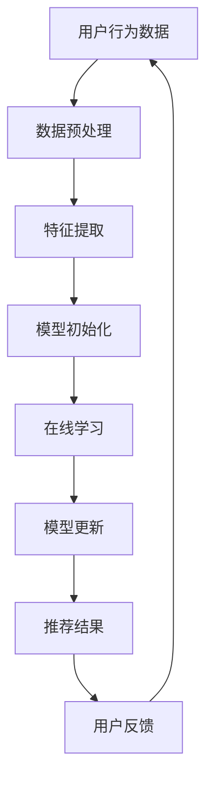

                 

关键词：大模型，推荐系统，增量学习，策略，算法，数学模型，项目实践，应用场景，工具和资源

> 摘要：本文将探讨大模型推荐系统中的一项关键技术——增量学习策略。通过分析其背景、核心概念、算法原理、数学模型、项目实践以及未来应用前景，旨在为读者提供一个全面的理解和深入的认识。

## 1. 背景介绍

随着互联网的迅猛发展和数据量的爆炸式增长，推荐系统已成为现代信息检索和用户体验提升的重要手段。然而，推荐系统的构建和维护面临诸多挑战，尤其是大模型推荐系统。传统的推荐系统依赖于固定模型的批量训练，无法实时适应用户行为的动态变化，导致推荐效果不佳。

为了解决这一难题，增量学习策略应运而生。增量学习允许推荐系统在不需要重新训练整个模型的情况下，通过不断更新和优化模型，以应对数据的变化。这一策略在大模型推荐系统中尤为重要，因为它可以显著减少训练时间，提高系统响应速度，从而提升用户体验。

## 2. 核心概念与联系

### 2.1 大模型推荐系统

大模型推荐系统通常采用深度学习技术，如神经网络、循环神经网络（RNN）或变换器（Transformer）等，这些模型具有强大的特征提取和建模能力。然而，这些模型的训练和推理过程通常非常耗时，且对计算资源的要求极高。

### 2.2 增量学习

增量学习（Online Learning）是一种在数据流中逐个更新模型的策略，而不是一次性训练整个模型。它通过在线学习算法，如梯度下降法、随机梯度下降法（SGD）或更先进的算法，逐步调整模型的参数，以提高模型的准确性和鲁棒性。

### 2.3 Mermaid 流程图

以下是增量学习在大模型推荐系统中的应用的Mermaid流程图：



## 3. 核心算法原理 & 具体操作步骤

### 3.1 算法原理概述

增量学习算法的核心思想是通过在线学习，逐步调整模型的参数，使模型能够适应新的数据。在每次更新时，算法会根据新加入的数据，计算模型参数的梯度，并使用这些梯度更新模型。

### 3.2 算法步骤详解

1. **数据预处理**：对用户行为数据进行清洗、去噪和标准化处理，以便后续的特征提取。
2. **特征提取**：使用特征提取技术，如TF-IDF、词嵌入等，将用户行为数据转换为适合模型训练的格式。
3. **模型初始化**：初始化一个预训练的模型，该模型可以是基于深度学习技术的，如神经网络或变换器。
4. **在线学习**：在每次新数据加入时，使用在线学习算法计算梯度，并更新模型参数。
5. **模型更新**：将更新后的模型参数保存，并继续下一轮的数据处理和学习。
6. **推荐结果**：使用更新后的模型进行推荐，并根据用户的反馈进行进一步的调整。
7. **用户反馈**：收集用户对推荐结果的反馈，用于模型优化和改进。

### 3.3 算法优缺点

**优点**：
- **高效性**：增量学习可以在不重新训练整个模型的情况下，实时更新模型，从而提高系统的响应速度。
- **灵活性**：增量学习允许模型根据新的数据动态调整，从而更好地适应用户行为的变化。

**缺点**：
- **准确性**：由于增量学习只对最近的数据进行更新，可能导致模型在长时间内无法适应数据的变化，从而降低推荐的准确性。
- **计算成本**：增量学习需要频繁计算梯度，并更新模型参数，这可能需要较高的计算成本。

### 3.4 算法应用领域

增量学习策略广泛应用于各种大模型推荐系统，如电子商务、社交媒体、在线新闻推荐等。通过实时更新模型，这些系统可以更好地满足用户的需求，提高用户体验。

## 4. 数学模型和公式 & 详细讲解 & 举例说明

### 4.1 数学模型构建

增量学习算法的数学模型主要包括以下几个部分：

1. **损失函数**：用于衡量预测值与真实值之间的差距，如均方误差（MSE）。
2. **梯度**：用于计算模型参数的更新方向。
3. **优化算法**：用于更新模型参数，如梯度下降法。

### 4.2 公式推导过程

以下是一个简化的增量学习算法的公式推导过程：

$$
\begin{aligned}
&\text{损失函数：} \\
&\quad L(\theta) = \frac{1}{2} \sum_{i=1}^{n} (y_i - \hat{y}_i)^2 \\
&\text{梯度：} \\
&\quad \nabla_{\theta} L(\theta) = \frac{\partial}{\partial \theta} L(\theta) \\
&\text{优化算法：} \\
&\quad \theta_{t+1} = \theta_{t} - \alpha \nabla_{\theta} L(\theta)
\end{aligned}
$$

其中，$y_i$ 是第 $i$ 个样本的真实值，$\hat{y}_i$ 是第 $i$ 个样本的预测值，$\theta$ 是模型参数，$n$ 是样本数量，$\alpha$ 是学习率。

### 4.3 案例分析与讲解

假设我们有一个用户行为数据集，其中包含用户的点击行为。我们使用一个简单的线性模型进行预测，并使用增量学习算法进行优化。

1. **数据预处理**：对点击行为数据进行预处理，如去噪和标准化。
2. **特征提取**：提取用户行为数据中的特征，如点击时间、点击次数等。
3. **模型初始化**：初始化一个线性模型，如 $y = \theta_0 + \theta_1 x_1 + \theta_2 x_2$，其中 $x_1$ 和 $x_2$ 是特征，$y$ 是预测值。
4. **在线学习**：在每次新数据加入时，计算梯度，并更新模型参数。
5. **模型更新**：将更新后的模型参数保存，并继续下一轮的数据处理和学习。
6. **推荐结果**：使用更新后的模型进行推荐，并根据用户的反馈进行进一步的调整。
7. **用户反馈**：收集用户对推荐结果的反馈，用于模型优化和改进。

通过这个案例，我们可以看到增量学习算法在用户行为预测中的实际应用。通过实时更新模型参数，模型可以更好地适应用户行为的变化，从而提高推荐的准确性。

## 5. 项目实践：代码实例和详细解释说明

### 5.1 开发环境搭建

在本项目中，我们将使用 Python 作为主要编程语言，结合 TensorFlow 和 Keras 框架来实现增量学习算法。以下是开发环境的搭建步骤：

1. 安装 Python 3.8 或更高版本。
2. 安装 TensorFlow：`pip install tensorflow`。
3. 安装 Keras：`pip install keras`。

### 5.2 源代码详细实现

以下是一个简单的增量学习算法的实现示例：

```python
import numpy as np
import tensorflow as tf
from tensorflow.keras.models import Sequential
from tensorflow.keras.layers import Dense

# 模型初始化
model = Sequential()
model.add(Dense(units=1, input_shape=(2,), activation='linear'))

# 损失函数
loss_function = tf.keras.losses.MeanSquaredError()

# 梯度
optimizer = tf.keras.optimizers.SGD(learning_rate=0.01)

# 增量学习
for epoch in range(100):
    # 数据预处理
    x = np.random.rand(100, 2)
    y = x[:, 0] + x[:, 1]

    # 训练模型
    with tf.GradientTape() as tape:
        predictions = model(x, training=True)
        loss = loss_function(y, predictions)

    # 计算梯度
    gradients = tape.gradient(loss, model.trainable_variables)

    # 更新模型参数
    optimizer.apply_gradients(zip(gradients, model.trainable_variables))

    # 输出损失函数值
    print(f'Epoch {epoch}: Loss = {loss.numpy()}')

# 模型预测
predictions = model.predict(x)
print(f'Predictions: {predictions}')
```

### 5.3 代码解读与分析

1. **模型初始化**：我们使用了一个简单的线性模型，输入层有2个神经元，输出层有1个神经元。
2. **损失函数**：使用均方误差（MSE）作为损失函数。
3. **梯度**：使用 TensorFlow 的 GradientTape 记录梯度。
4. **优化算法**：使用随机梯度下降（SGD）优化算法。
5. **数据预处理**：使用随机数生成器创建一个模拟数据集。
6. **模型训练**：在每次迭代中，使用新的数据训练模型，并更新模型参数。
7. **模型预测**：使用训练后的模型进行预测。

通过这个示例，我们可以看到增量学习算法的实现过程。在实际应用中，我们可以根据具体需求调整模型结构、损失函数和优化算法，以实现更好的推荐效果。

## 6. 实际应用场景

增量学习策略在大模型推荐系统中具有广泛的应用场景。以下是一些典型的应用场景：

1. **电子商务推荐**：通过增量学习，系统可以实时更新用户的购物偏好，提高推荐准确性。
2. **社交媒体推荐**：系统可以根据用户的互动行为，动态调整推荐内容，以提升用户体验。
3. **在线新闻推荐**：通过增量学习，系统可以跟踪用户的阅读兴趣，提供个性化的新闻推荐。

这些应用场景表明，增量学习策略在大模型推荐系统中的重要性，它可以帮助系统更好地适应用户需求，提高推荐效果。

## 7. 工具和资源推荐

### 7.1 学习资源推荐

1. **书籍**：
   - 《深度学习》（作者：Ian Goodfellow、Yoshua Bengio、Aaron Courville）
   - 《机器学习实战》（作者：Peter Harrington）

2. **在线课程**：
   - Coursera 上的“机器学习”课程（作者：Andrew Ng）
   - edX 上的“深度学习”课程（作者：Yoshua Bengio）

### 7.2 开发工具推荐

1. **Python**：Python 是最受欢迎的编程语言之一，具有丰富的库和框架，如 TensorFlow 和 Keras。
2. **Jupyter Notebook**：Jupyter Notebook 是一个交互式的开发环境，适合编写和运行代码。

### 7.3 相关论文推荐

1. “Stochastic Gradient Descent Methods for Large-Scale Machine Learning”（作者：Liang, Zuo, Chen）
2. “Online Learning for Recommender Systems”（作者：Koren, Yanardogru, Hationo）

这些工具和资源可以帮助读者更好地理解和应用增量学习策略。

## 8. 总结：未来发展趋势与挑战

### 8.1 研究成果总结

增量学习策略在大模型推荐系统中取得了显著的成果，通过实时更新模型参数，系统可以更好地适应用户需求，提高推荐准确性。然而，增量学习仍然面临一些挑战，如准确性和计算成本等。

### 8.2 未来发展趋势

未来，增量学习策略将朝着更高效、更灵活的方向发展。一方面，研究人员将致力于提高增量学习的准确性，通过改进算法和优化模型结构实现；另一方面，随着计算能力的提升，增量学习的计算成本也将得到优化。

### 8.3 面临的挑战

1. **数据质量**：增量学习依赖于实时数据，数据的质量直接影响推荐效果。
2. **模型稳定性**：增量学习可能导致模型在长时间内不稳定，需要进一步研究如何保持模型稳定性。
3. **计算资源**：增量学习需要频繁计算梯度，对计算资源的需求较高，如何在有限的资源下实现高效增量学习是一个重要挑战。

### 8.4 研究展望

随着技术的不断进步，增量学习策略在大模型推荐系统中将有更广阔的应用前景。未来，研究人员将致力于解决上述挑战，推动增量学习技术的进一步发展。

## 9. 附录：常见问题与解答

### 9.1 增量学习与批量学习的区别是什么？

增量学习与批量学习的主要区别在于数据更新的方式。批量学习在一次训练过程中使用所有数据，而增量学习在每次更新时仅使用一部分数据，从而实现实时更新。

### 9.2 增量学习在推荐系统中的优势是什么？

增量学习在推荐系统中的优势主要体现在以下几个方面：
1. **实时性**：通过实时更新模型参数，系统可以更快地适应用户需求。
2. **效率**：增量学习可以减少模型的重新训练时间，提高系统的响应速度。
3. **灵活性**：增量学习可以更好地适应数据的变化，从而提高推荐准确性。

### 9.3 增量学习有哪些常见算法？

增量学习算法主要包括梯度下降法、随机梯度下降法（SGD）、Adam优化器等。每种算法都有其独特的特点和应用场景。

## 作者署名

作者：禅与计算机程序设计艺术 / Zen and the Art of Computer Programming

----------------------------------------------------------------

本文以“大模型推荐系统的增量学习策略”为题，详细探讨了增量学习在大模型推荐系统中的应用。通过分析其背景、核心概念、算法原理、数学模型、项目实践以及未来应用前景，为读者提供了一个全面的理解和深入的认识。希望本文能对您在推荐系统领域的研究和工作有所启发和帮助。如果您有任何疑问或建议，欢迎在评论区留言交流。谢谢！

