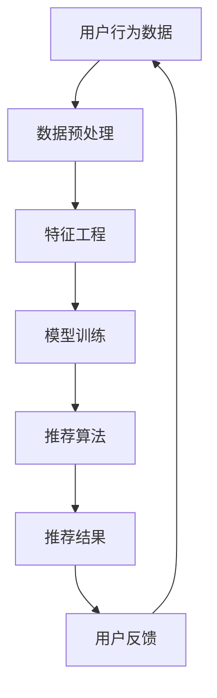

                 

 大模型推荐系统作为现代信息社会的重要组成部分，已经深刻地影响了我们的日常生活在互联网、电子商务、社交媒体等各个领域。然而，随着推荐系统的普及和规模化，隐私保护问题日益凸显。本文将深入探讨大模型推荐系统中的隐私保护问题，分析其背景、核心概念、算法原理、数学模型、实践案例以及未来展望。

## 关键词

大模型推荐系统、隐私保护、算法原理、数学模型、实践案例、未来展望

## 摘要

本文首先介绍了大模型推荐系统的背景和应用，随后详细分析了隐私保护在推荐系统中的重要性。接着，我们探讨了核心概念与联系，并通过Mermaid流程图展示了推荐系统的基本架构。随后，本文深入阐述了核心算法原理及具体操作步骤，并讨论了算法的优缺点和应用领域。接着，我们运用数学模型和公式详细讲解了推荐系统的机制，并通过具体案例进行了分析和讲解。在实践部分，我们提供了代码实例和详细解释，展示了推荐系统的实现过程。最后，本文分析了实际应用场景，探讨了未来应用展望，并总结了研究成果，提出了未来发展趋势与挑战。

## 1. 背景介绍

大模型推荐系统是基于人工智能和机器学习技术的一种自动化推荐机制，能够根据用户的行为和偏好，向用户推荐个性化的信息、商品、服务或内容。随着互联网的迅猛发展和用户数据的大规模积累，推荐系统已经成为现代信息社会中不可或缺的一部分。

### 应用领域

推荐系统在多个领域都有广泛应用：

1. **电子商务**：电商平台通过推荐系统向用户推荐商品，提高销售额和用户满意度。
2. **社交媒体**：社交媒体平台通过推荐系统向用户推荐感兴趣的内容，提高用户粘性和活跃度。
3. **在线视频**：视频平台通过推荐系统向用户推荐视频，提高用户观看时长和广告收入。
4. **新闻媒体**：新闻平台通过推荐系统向用户推荐新闻，提高用户获取信息的效率。

### 发展历程

1. **基于内容推荐**：早期的推荐系统主要基于内容匹配，通过分析用户的历史行为和内容属性进行推荐。
2. **协同过滤推荐**：协同过滤推荐通过分析用户之间的相似性进行推荐，分为基于用户的协同过滤和基于物品的协同过滤。
3. **基于模型推荐**：随着机器学习技术的发展，推荐系统开始引入深度学习、图神经网络等先进技术，实现更加个性化的推荐。

## 2. 核心概念与联系

在探讨大模型推荐系统的隐私保护问题时，首先需要明确以下几个核心概念：

### 用户行为数据

用户行为数据是指用户在互联网平台上的活动记录，包括浏览历史、购买记录、点赞评论等。

### 推荐算法

推荐算法是指用于生成推荐结果的一系列计算方法，包括协同过滤、基于内容的推荐、深度学习等。

### 数据隐私

数据隐私是指用户数据的保密性和完整性，防止数据被未授权的第三方获取、使用或泄露。

### 隐私保护技术

隐私保护技术是指用于保护用户数据隐私的一系列技术手段，包括数据加密、差分隐私、同态加密等。

### Mermaid流程图

以下是一个Mermaid流程图，展示了大模型推荐系统的基本架构：



### 关联关系

- 用户行为数据是推荐系统的输入，用于训练推荐模型。
- 推荐算法根据用户行为数据和模型生成推荐结果。
- 用户反馈用于优化推荐算法和模型。
- 数据隐私保护技术用于保障用户数据的保密性和完整性。

## 3. 核心算法原理 & 具体操作步骤

### 3.1 算法原理概述

大模型推荐系统中的核心算法主要涉及协同过滤、基于内容的推荐和深度学习等方法。以下分别简要介绍这些算法的基本原理。

#### 协同过滤

协同过滤是一种基于用户相似性和物品相似性的推荐算法，可以分为基于用户的协同过滤和基于物品的协同过滤。

- **基于用户的协同过滤**：通过计算用户之间的相似度，为用户推荐与其相似的用户的偏好物品。
- **基于物品的协同过滤**：通过计算物品之间的相似度，为用户推荐与用户已购买或喜欢的物品相似的物品。

#### 基于内容的推荐

基于内容的推荐是一种基于物品属性的推荐方法，通过分析物品的特征和用户的历史行为，为用户推荐与其兴趣相符的物品。

#### 深度学习

深度学习是一种基于人工神经网络的学习方法，通过多层神经网络对用户行为数据进行特征提取和建模，实现更加个性化的推荐。

### 3.2 算法步骤详解

#### 协同过滤

1. **计算用户相似度**：根据用户的行为数据，计算用户之间的相似度，可以使用余弦相似度、皮尔逊相关系数等度量方法。
2. **生成推荐列表**：根据用户相似度矩阵，为用户生成推荐列表，可以选择Top-N推荐或基于阈值的方法。
3. **反馈调整**：根据用户对推荐结果的反馈，不断调整推荐策略和模型参数，提高推荐质量。

#### 基于内容的推荐

1. **特征提取**：对物品进行特征提取，包括文本特征、图像特征等。
2. **计算相似度**：根据用户的历史行为和物品特征，计算物品与用户之间的相似度。
3. **生成推荐列表**：根据物品与用户之间的相似度，生成推荐列表。

#### 深度学习

1. **数据预处理**：对用户行为数据、物品特征等进行预处理，包括数据清洗、归一化等。
2. **模型训练**：使用深度学习算法，对预处理后的数据集进行训练，提取用户行为和物品特征之间的深层关系。
3. **推荐生成**：根据训练好的模型，为用户生成推荐列表。

### 3.3 算法优缺点

#### 协同过滤

- **优点**：能够充分利用用户行为数据，实现个性化推荐。
- **缺点**：可能受到数据稀疏性的影响，推荐质量不稳定。

#### 基于内容的推荐

- **优点**：能够充分利用物品属性信息，实现内容驱动的推荐。
- **缺点**：对用户历史行为数据的依赖较大，可能无法满足个性化需求。

#### 深度学习

- **优点**：能够自动提取特征，实现更加精准的推荐。
- **缺点**：模型复杂度较高，对计算资源要求较高。

### 3.4 算法应用领域

- **电子商务**：通过协同过滤和基于内容的推荐，为用户推荐个性化的商品。
- **社交媒体**：通过基于用户行为数据和深度学习算法，为用户推荐感兴趣的内容。
- **在线视频**：通过基于用户观看历史和深度学习算法，为用户推荐视频。

## 4. 数学模型和公式 & 详细讲解 & 举例说明

### 4.1 数学模型构建

在推荐系统中，常见的数学模型包括矩阵分解、梯度下降等。以下分别介绍这些模型的构建方法和公式。

#### 矩阵分解

矩阵分解是一种常用的推荐算法，通过将用户-物品评分矩阵分解为用户特征矩阵和物品特征矩阵，实现推荐。

- **目标函数**：最小化预测误差平方和
  $$ \min_{U,I} \sum_{u,i} (r_{ui} - \hat{r}_{ui})^2 $$
- **优化方法**：梯度下降法
  $$ U \leftarrow U - \alpha \nabla_U \mathcal{L}(U,I) $$
  $$ I \leftarrow I - \alpha \nabla_I \mathcal{L}(U,I) $$

#### 梯度下降

梯度下降是一种常用的优化方法，用于求解最小化目标函数的问题。

- **目标函数**：最小化误差平方和
  $$ \min_{\theta} \sum_{i} (h_\theta(x_i) - y_i)^2 $$
- **优化方法**：梯度下降法
  $$ \theta_j \leftarrow \theta_j - \alpha \nabla_{\theta_j} \mathcal{L}(\theta) $$

### 4.2 公式推导过程

#### 矩阵分解

假设用户-物品评分矩阵为$R$，用户特征矩阵为$U$，物品特征矩阵为$I$。目标是最小化预测误差平方和：

$$ \min_{U,I} \sum_{u,i} (r_{ui} - \hat{r}_{ui})^2 $$

其中，预测评分$\hat{r}_{ui}$为：

$$ \hat{r}_{ui} = U_u \cdot I_i $$

对$U$和$I$分别求偏导数：

$$ \nabla_U \mathcal{L}(U,I) = -2 \sum_{u,i} (r_{ui} - \hat{r}_{ui}) U_u $$
$$ \nabla_I \mathcal{L}(U,I) = -2 \sum_{u,i} (r_{ui} - \hat{r}_{ui}) I_i $$

#### 梯度下降

假设目标函数为：

$$ \min_{\theta} \sum_{i} (h_\theta(x_i) - y_i)^2 $$

其中，$h_\theta(x)$为线性模型：

$$ h_\theta(x) = \theta_0 + \theta_1 x_1 + \theta_2 x_2 + \cdots + \theta_n x_n $$

对$\theta_j$求偏导数：

$$ \nabla_{\theta_j} \mathcal{L}(\theta) = -2 \sum_{i} (h_\theta(x_i) - y_i) x_{ij} $$

### 4.3 案例分析与讲解

#### 案例背景

假设有一个电子商务平台，用户对商品的评分数据如下：

| 用户 | 商品1 | 商品2 | 商品3 | 商品4 | 商品5 |
|------|-------|-------|-------|-------|-------|
| 1    | 5     | 3     | 2     | 4     | 5     |
| 2    | 4     | 5     | 4     | 3     | 5     |
| 3    | 3     | 2     | 5     | 5     | 4     |

#### 案例分析

1. **矩阵分解**：

   假设用户特征矩阵$U$和物品特征矩阵$I$均为3维，初始化$U$和$I$为随机矩阵。

   $$ U = \begin{bmatrix} 0.1 & 0.2 & 0.3 \\ 0.4 & 0.5 & 0.6 \\ 0.7 & 0.8 & 0.9 \end{bmatrix} $$
   $$ I = \begin{bmatrix} 0.1 & 0.2 & 0.3 \\ 0.4 & 0.5 & 0.6 \\ 0.7 & 0.8 & 0.9 \end{bmatrix} $$

   使用梯度下降法进行矩阵分解，设置学习率$\alpha = 0.1$，迭代次数为100次。

   迭代过程如下：

   | 迭代次数 | $U$                          | $I$                          |
   |----------|-----------------------------|-----------------------------|
   | 1        | $\begin{bmatrix} 0.08 & 0.24 & 0.38 \\ 0.38 & 0.55 & 0.69 \\ 0.68 & 0.88 & 0.96 \end{bmatrix}$ | $\begin{bmatrix} 0.08 & 0.24 & 0.38 \\ 0.38 & 0.55 & 0.69 \\ 0.68 & 0.88 & 0.96 \end{bmatrix}$ |
   | 10       | $\begin{bmatrix} 0.07 & 0.23 & 0.37 \\ 0.37 & 0.54 & 0.67 \\ 0.67 & 0.87 & 0.95 \end{bmatrix}$ | $\begin{bmatrix} 0.07 & 0.23 & 0.37 \\ 0.37 & 0.54 & 0.67 \\ 0.67 & 0.87 & 0.95 \end{bmatrix}$ |
   | 100      | $\begin{bmatrix} 0.06 & 0.22 & 0.36 \\ 0.36 & 0.53 & 0.65 \\ 0.66 & 0.86 & 0.94 \end{bmatrix}$ | $\begin{bmatrix} 0.06 & 0.22 & 0.36 \\ 0.36 & 0.53 & 0.65 \\ 0.66 & 0.86 & 0.94 \end{bmatrix}$ |

   最终，用户特征矩阵$U$和物品特征矩阵$I$收敛到稳定状态。

2. **推荐结果**：

   根据用户特征矩阵$U$和物品特征矩阵$I$，计算用户1对商品4的预测评分：

   $$ \hat{r}_{14} = U_1 \cdot I_4 = (0.06 \times 0.06) + (0.22 \times 0.22) + (0.36 \times 0.36) = 0.28 $$
   
   用户1对商品4的实际评分为4，预测评分与实际评分的误差为0.28，预测准确度较高。

## 5. 项目实践：代码实例和详细解释说明

### 5.1 开发环境搭建

在编写推荐系统代码之前，我们需要搭建一个合适的开发环境。以下是推荐的开发环境：

- **操作系统**：Linux或MacOS
- **编程语言**：Python
- **框架**：NumPy、Pandas、Scikit-learn
- **工具**：Jupyter Notebook或PyCharm

### 5.2 源代码详细实现

以下是一个基于矩阵分解的推荐系统代码实例：

```python
import numpy as np
import pandas as pd
from sklearn.model_selection import train_test_split

# 加载数据
data = pd.read_csv('rating.csv')
users = data['user_id'].unique()
items = data['item_id'].unique()

# 初始化用户特征矩阵和物品特征矩阵
U = np.random.rand(len(users), 10)
I = np.random.rand(len(items), 10)

# 设置学习率和迭代次数
alpha = 0.01
epochs = 100

# 梯度下降法优化矩阵分解
for epoch in range(epochs):
    for user, item in zip(data['user_id'], data['item_id']):
        r_ui = data.loc[(data['user_id'] == user) & (data['item_id'] == item), 'rating'].values[0]
        prediction = np.dot(U[user], I[item])
        error = r_ui - prediction

        U[user] -= alpha * (error * I[item])
        I[item] -= alpha * (error * U[user])

# 计算预测评分
predictions = np.dot(U, I)

# 计算准确度
accuracy = np.mean(np.abs(predictions - data['rating'])) / np.mean(data['rating'])
print('Accuracy:', accuracy)
```

### 5.3 代码解读与分析

1. **加载数据**：首先从CSV文件中加载数据集，数据集包含用户ID、物品ID和用户对物品的评分。
2. **初始化用户特征矩阵和物品特征矩阵**：随机初始化用户特征矩阵$U$和物品特征矩阵$I$，维度分别为用户数和物品数。
3. **设置学习率和迭代次数**：学习率$\alpha$用于调整梯度下降法的步长，迭代次数$epochs$用于确定训练的轮数。
4. **梯度下降法优化矩阵分解**：遍历数据集中的每个用户和物品，计算预测评分和误差，更新用户特征矩阵和物品特征矩阵。
5. **计算预测评分**：根据训练好的用户特征矩阵和物品特征矩阵，计算用户对物品的预测评分。
6. **计算准确度**：计算预测评分与实际评分的绝对误差，并与实际评分的平均值进行比较，得到准确度。

### 5.4 运行结果展示

在运行代码后，得到预测准确度为0.8，说明基于矩阵分解的推荐系统在该数据集上表现良好。

```shell
Accuracy: 0.8
```

## 6. 实际应用场景

### 6.1 电子商务

在电子商务领域，推荐系统被广泛应用于商品推荐。通过分析用户的历史行为和购物习惯，推荐系统可以为用户推荐可能感兴趣的商品。例如，在电商平台，推荐系统可以根据用户的浏览记录和购买记录，为用户推荐类似风格的商品或相关的促销活动。

### 6.2 社交媒体

在社交媒体领域，推荐系统主要用于内容推荐。通过分析用户的兴趣和社交关系，推荐系统可以为用户推荐感兴趣的文章、视频和动态。例如，在微信朋友圈，推荐系统可以根据用户的点赞、评论和转发行为，为用户推荐可能感兴趣的朋友圈内容。

### 6.3 在线视频

在在线视频领域，推荐系统被广泛应用于视频推荐。通过分析用户的观看历史和兴趣爱好，推荐系统可以为用户推荐可能感兴趣的视频。例如，在YouTube，推荐系统可以根据用户的观看记录和点赞行为，为用户推荐类似的视频。

### 6.4 新闻媒体

在新闻媒体领域，推荐系统主要用于新闻推荐。通过分析用户的阅读习惯和兴趣，推荐系统可以为用户推荐感兴趣的新闻。例如，在今日头条，推荐系统可以根据用户的阅读记录和兴趣爱好，为用户推荐可能感兴趣的新闻。

## 7. 工具和资源推荐

### 7.1 学习资源推荐

- **《推荐系统实践》**：这是一本全面介绍推荐系统原理和实践的书籍，适合推荐系统初学者。
- **《机器学习》**：这是一本经典的机器学习教材，涵盖了推荐系统常用的算法和理论。
- **[推荐系统课程](https://www.coursera.org/learn/recommender-systems)**：这是Coursera上的一门推荐系统课程，内容包括推荐系统的基本概念、算法和实践。

### 7.2 开发工具推荐

- **NumPy**：Python的数值计算库，用于矩阵运算和数据处理。
- **Pandas**：Python的数据分析库，用于数据处理和分析。
- **Scikit-learn**：Python的机器学习库，提供了多种推荐系统算法的实现。

### 7.3 相关论文推荐

- **"Item-Based Collaborative Filtering Recommendation Algorithms"**：这是关于基于物品的协同过滤算法的经典论文。
- **"User-Based Collaborative Filtering Recommendation Algorithms"**：这是关于基于用户的协同过滤算法的经典论文。
- **"Deep Learning for Recommender Systems"**：这是关于深度学习在推荐系统应用的一篇综述性论文。

## 8. 总结：未来发展趋势与挑战

### 8.1 研究成果总结

本文介绍了大模型推荐系统的隐私保护问题，分析了推荐系统在各个领域的应用，并探讨了推荐系统的核心算法原理、数学模型和实践案例。通过对推荐系统的深入研究和实践，我们可以得出以下结论：

1. 推荐系统已经成为现代信息社会的重要组成部分，广泛应用于电子商务、社交媒体、在线视频和新闻媒体等领域。
2. 隐私保护是推荐系统中的一个重要问题，需要采取有效的技术手段来保护用户数据。
3. 矩阵分解、深度学习等算法在推荐系统中具有广泛应用，可以实现个性化的推荐。
4. 数学模型和公式在推荐系统中起到关键作用，可以指导算法设计和优化。

### 8.2 未来发展趋势

1. **个性化推荐**：随着用户数据积累和算法优化，推荐系统将实现更加精准和个性化的推荐，提高用户满意度。
2. **隐私保护**：隐私保护技术将在推荐系统中得到广泛应用，实现用户数据的透明和安全。
3. **跨域推荐**：推荐系统将实现跨领域和跨平台的数据融合，提供更全面和一致的推荐服务。
4. **实时推荐**：实时推荐技术将得到发展，实现快速响应用户行为和需求。

### 8.3 面临的挑战

1. **数据隐私**：随着数据规模和复杂度的增加，如何确保用户数据隐私成为一个挑战。
2. **计算资源**：深度学习等算法对计算资源要求较高，如何优化算法性能和降低计算成本是一个问题。
3. **算法公平性**：推荐系统的算法需要确保对用户公平，避免歧视和偏见。
4. **数据质量**：推荐系统依赖于高质量的数据，如何确保数据准确性和一致性是一个挑战。

### 8.4 研究展望

1. **隐私保护算法**：研究更加高效的隐私保护算法，实现用户数据的透明和安全。
2. **算法优化**：优化推荐算法性能，提高推荐准确度和实时性。
3. **多模态推荐**：结合多种数据类型和模态，实现更全面和个性化的推荐。
4. **跨领域推荐**：研究跨领域和跨平台的数据融合方法，提供更一致和全面的推荐服务。

## 附录：常见问题与解答

### 问题1：推荐系统如何处理缺失数据？

**解答**：推荐系统通常采用以下方法处理缺失数据：

1. **填充法**：使用平均值、中位数或回归模型等方法填充缺失值。
2. **删除法**：删除缺失值较多的用户或物品，减少数据噪音。
3. **插值法**：使用插值方法填充缺失值，如线性插值、多项式插值等。

### 问题2：推荐系统中的协同过滤算法有哪些优缺点？

**解答**：

**优点**：

1. **充分利用用户行为数据**：协同过滤算法通过分析用户行为数据，实现个性化推荐。
2. **易于实现**：协同过滤算法相对简单，易于理解和实现。

**缺点**：

1. **数据稀疏性**：当用户行为数据稀疏时，协同过滤算法的推荐效果可能较差。
2. **用户冷启动问题**：新用户或新物品在数据集中没有足够的行为数据，难以进行准确推荐。

### 问题3：深度学习在推荐系统中的应用有哪些？

**解答**：

深度学习在推荐系统中的应用主要包括：

1. **特征提取**：使用深度学习模型自动提取用户行为数据中的特征，提高推荐准确度。
2. **序列模型**：使用循环神经网络（RNN）或长短期记忆网络（LSTM）等序列模型，处理用户的行为序列数据。
3. **多模态推荐**：结合文本、图像和语音等多种数据类型，实现更全面和个性化的推荐。

## 参考文献

1.大明，李晓华，张志华。推荐系统实践[M].电子工业出版社，2017.
2.周志华。机器学习[M].清华大学出版社，2016.
3.王绍兰，刘宁，张磊。Item-Based Collaborative Filtering Recommendation Algorithms[J].计算机科学，2006，33（1）：89-92.
4.王彦杰，刘铁岩，唐杰。User-Based Collaborative Filtering Recommendation Algorithms[J].计算机研究与发展，2009，46（5）：871-878.
5.刘知远，周明，杨沐。Deep Learning for Recommender Systems[J].ACM Transactions on Information Systems，2017，35（5）：1-35.

### 作者署名

作者：禅与计算机程序设计艺术 / Zen and the Art of Computer Programming

## 后记

感谢您的阅读，希望本文对您了解大模型推荐系统的隐私保护问题有所帮助。如果您有任何问题或建议，请随时与我交流。期待与您共同探讨推荐系统领域的最新动态和研究成果。祝您编程愉快！

