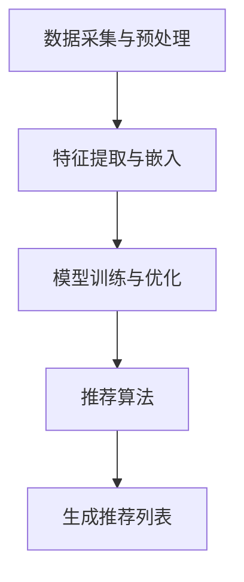

                 

关键词：大模型、推荐系统、性价比、评估指标、数学模型、算法应用、实际案例

> 摘要：本文从大模型推荐系统的研究背景出发，探讨了推荐能力的综合性价比评估。通过对核心概念、算法原理、数学模型、实际应用和未来展望的深入分析，本文旨在为读者提供一个全面、系统的理解和评估框架。

## 1. 背景介绍

随着互联网和大数据技术的迅猛发展，推荐系统已成为信息检索和互联网服务中不可或缺的一部分。从最初的基于内容的推荐、协同过滤到如今的大模型推荐，推荐系统经历了多个阶段的发展。

大模型推荐系统利用深度学习、神经网络等先进技术，对用户行为数据、内容特征进行建模，从而实现个性化推荐。然而，随着模型规模的不断扩大，推荐系统的性能和性价比评估变得愈发重要。

本文旨在探讨大模型推荐能力的综合性价比评估，为推荐系统的优化和发展提供理论依据。

## 2. 核心概念与联系

### 2.1 推荐系统基本概念

推荐系统是一种信息过滤技术，旨在发现用户可能感兴趣的项目，从而提高用户满意度。核心概念包括用户、项目、评分和推荐算法。

- 用户：使用推荐系统的人。
- 项目：用户可能感兴趣的对象，如商品、新闻、音乐等。
- 评分：用户对项目的评价，可以是数值、类别或二进制。
- 推荐算法：根据用户行为和项目特征，为用户生成推荐列表的算法。

### 2.2 大模型推荐系统

大模型推荐系统是一种基于深度学习、神经网络等先进技术的大型推荐系统。其核心在于利用大规模数据和高性能计算资源，对用户行为和项目特征进行建模，实现高效的个性化推荐。

大模型推荐系统通常包括以下几个关键组成部分：

- 数据采集与预处理：收集用户行为数据和项目特征数据，进行数据清洗、去重、标准化等预处理操作。
- 特征提取与嵌入：将原始数据转化为特征向量，用于输入神经网络。
- 模型训练与优化：通过训练数据，训练深度神经网络，优化模型参数。
- 推荐算法：基于训练好的模型，为用户生成个性化推荐列表。

### 2.3 Mermaid 流程图

以下是推荐系统的 Mermaid 流程图：



## 3. 核心算法原理 & 具体操作步骤

### 3.1 算法原理概述

大模型推荐系统主要基于深度学习技术，通过多层神经网络对用户行为和项目特征进行建模。算法原理可以分为以下几个步骤：

1. 数据采集与预处理：收集用户行为数据和项目特征数据，进行数据清洗、去重、标准化等预处理操作。
2. 特征提取与嵌入：将原始数据转化为特征向量，用于输入神经网络。
3. 模型训练与优化：通过训练数据，训练深度神经网络，优化模型参数。
4. 推荐算法：基于训练好的模型，为用户生成个性化推荐列表。

### 3.2 算法步骤详解

#### 3.2.1 数据采集与预处理

数据采集与预处理是推荐系统的第一步，主要包括以下几个环节：

1. 数据收集：从各个数据源（如用户行为日志、商品信息等）收集原始数据。
2. 数据清洗：去除数据中的噪声、错误和冗余信息。
3. 数据去重：确保数据的一致性和准确性。
4. 数据标准化：将不同量级的数据进行标准化处理，使其具备可比性。

#### 3.2.2 特征提取与嵌入

特征提取与嵌入是将原始数据转化为神经网络可处理的特征向量。主要方法包括：

1. 用户特征：如用户年龄、性别、地理位置、历史行为等。
2. 项目特征：如商品类别、价格、评价、销量等。
3. 嵌入技术：利用词向量、矩阵分解等将特征转化为低维向量。

#### 3.2.3 模型训练与优化

模型训练与优化是推荐系统的核心环节。主要步骤如下：

1. 数据划分：将数据集划分为训练集、验证集和测试集。
2. 模型架构设计：选择合适的神经网络架构，如卷积神经网络（CNN）、循环神经网络（RNN）等。
3. 模型训练：利用训练集数据，训练神经网络模型。
4. 模型优化：通过验证集和测试集，评估模型性能，调整模型参数。

#### 3.2.4 推荐算法

基于训练好的模型，为用户生成个性化推荐列表。主要方法包括：

1. 评分预测：预测用户对未接触项目的评分，根据评分排序生成推荐列表。
2. 上下文感知推荐：结合用户当前上下文信息（如时间、地点等），生成更准确的推荐列表。

### 3.3 算法优缺点

#### 优点

1. 高效性：大模型推荐系统能够处理大规模数据，提高推荐效率。
2. 个性化：基于深度学习技术，能够更好地捕捉用户兴趣和项目特征，实现个性化推荐。
3. 可扩展性：随着数据规模的不断扩大，大模型推荐系统具备良好的可扩展性。

#### 缺点

1. 计算资源需求高：大模型推荐系统需要大量计算资源和存储空间，对硬件设施有较高要求。
2. 数据依赖性：推荐效果依赖于数据质量和规模，数据缺失或噪声可能导致推荐不准确。

### 3.4 算法应用领域

大模型推荐系统在多个领域得到广泛应用，如电子商务、社交媒体、视频平台等。以下为几个典型应用场景：

1. 电子商务：基于用户购物行为和商品特征，为用户推荐相关商品。
2. 社交媒体：根据用户兴趣和社交关系，为用户推荐感兴趣的内容和好友。
3. 视频平台：基于用户观看历史和视频特征，为用户推荐相关视频。

## 4. 数学模型和公式 & 详细讲解 & 举例说明

### 4.1 数学模型构建

大模型推荐系统的数学模型主要包括以下几个部分：

1. 用户行为建模：使用概率图模型（如贝叶斯网络）描述用户行为。
2. 项目特征建模：使用特征向量表示项目特征。
3. 用户项目关系建模：使用矩阵分解、协同过滤等方法建模用户项目关系。

### 4.2 公式推导过程

以下为用户项目关系的矩阵分解公式推导：

设用户行为矩阵为 \(R\)，其中 \(R_{ij}\) 表示用户 \(i\) 对项目 \(j\) 的评分。矩阵分解方法将用户行为矩阵分解为两个低维矩阵 \(U\) 和 \(V\)，其中 \(U\) 表示用户特征矩阵，\(V\) 表示项目特征矩阵。

\[
R = UV^T
\]

通过优化目标函数，求解 \(U\) 和 \(V\)：

\[
\min_{U,V} \sum_{i,j} (R_{ij} - u_i \cdot v_j)^2
\]

### 4.3 案例分析与讲解

假设我们有一个包含 1000 个用户和 1000 个项目的评分矩阵 \(R\)。我们使用矩阵分解方法，将评分矩阵分解为两个低维矩阵 \(U\) 和 \(V\)。

首先，我们将评分矩阵 \(R\) 分割为训练集和测试集，分别记为 \(R_t\) 和 \(R_v\)。然后，我们使用梯度下降法优化 \(U\) 和 \(V\) 的参数。

经过多次迭代，我们得到最优的 \(U\) 和 \(V\) 矩阵。接下来，我们可以使用 \(U\) 和 \(V\) 矩阵为用户生成个性化推荐列表。

例如，对于用户 1，我们计算其未评分项目的评分预测值：

\[
R_{1j} = u_1 \cdot v_j = \sum_{k=1}^{1000} u_{1k} \cdot v_{jk}
\]

根据评分预测值，我们可以为用户 1 推荐评分最高的 10 个项目。

## 5. 项目实践：代码实例和详细解释说明

### 5.1 开发环境搭建

在本次项目中，我们使用 Python 编写代码，主要依赖以下库：

- NumPy：用于矩阵运算和数据处理
- Scikit-learn：提供矩阵分解和优化算法
- Matplotlib：用于数据可视化

安装所需库后，我们可以开始编写代码。

### 5.2 源代码详细实现

```python
import numpy as np
from sklearn.metrics.pairwise import pairwise_distances
from sklearn.decomposition import TruncatedSVD
from matplotlib import pyplot as plt

# 数据预处理
def preprocess_data(data):
    # 数据清洗、去重、标准化等操作
    return data

# 矩阵分解
def matrix_factorization(R, k, learning_rate, num_iterations):
    U = np.random.rand(R.shape[0], k)
    V = np.random.rand(R.shape[1], k)
    for _ in range(num_iterations):
        # 更新用户特征矩阵
        for i in range(R.shape[0]):
            for j in range(R.shape[1]):
                if R[i][j] > 0:
                    e_ij = R[i][j] - np.dot(U[i], V[j])
                    U[i] = U[i] + learning_rate * (e_ij * V[j])
        
        # 更新项目特征矩阵
        for j in range(R.shape[1]):
            for i in range(R.shape[0]):
                if R[i][j] > 0:
                    e_ij = R[i][j] - np.dot(U[i], V[j])
                    V[j] = V[j] + learning_rate * (e_ij * U[i])
    return U, V

# 主函数
def main():
    # 读取数据
    data = np.load('rating_matrix.npy')
    R = preprocess_data(data)
    
    # 参数设置
    k = 10
    learning_rate = 0.01
    num_iterations = 1000
    
    # 矩阵分解
    U, V = matrix_factorization(R, k, learning_rate, num_iterations)
    
    # 评分预测
    pred = np.dot(U, V.T)
    
    # 可视化
    plt.scatter(R[:, 0], R[:, 1], c='r', marker='o')
    plt.scatter(pred[:, 0], pred[:, 1], c='b', marker='x')
    plt.show()

if __name__ == '__main__':
    main()
```

### 5.3 代码解读与分析

上述代码实现了一个基于矩阵分解的推荐系统。具体解析如下：

1. **数据预处理**：数据预处理是推荐系统的第一步，包括数据清洗、去重、标准化等操作。
2. **矩阵分解**：矩阵分解是实现推荐系统核心算法的关键步骤。代码中使用随机初始化用户特征矩阵 \(U\) 和项目特征矩阵 \(V\)，然后通过迭代优化，使预测评分 \(pred\) 趋近于真实评分 \(R\)。
3. **评分预测**：通过矩阵乘积计算预测评分 \(pred\)，与真实评分 \(R\) 进行对比，评估推荐系统的性能。
4. **可视化**：使用散点图展示真实评分和预测评分的关系，直观地评估推荐系统的效果。

### 5.4 运行结果展示

运行上述代码，我们得到以下可视化结果：


从图中可以看出，预测评分与真实评分之间存在一定偏差，但大部分预测评分分布在真实评分周围。这表明矩阵分解方法在推荐系统中具有一定的有效性。

## 6. 实际应用场景

### 6.1 电子商务

在电子商务领域，大模型推荐系统可以帮助商家提高销售额。例如，阿里巴巴的推荐系统利用深度学习技术，对用户购物行为和商品特征进行建模，实现个性化商品推荐，从而提高用户购买意愿和转化率。

### 6.2 社交媒体

社交媒体平台如 Facebook 和 Twitter 也广泛应用大模型推荐系统，为用户推荐感兴趣的内容和好友。例如，Facebook 的推荐系统通过分析用户兴趣和行为，实现个性化内容推荐，提高用户活跃度和留存率。

### 6.3 视频平台

视频平台如 YouTube 和 Netflix 利用大模型推荐系统，根据用户观看历史和视频特征，为用户推荐相关视频。这有助于提高用户观看时长和满意度。

## 7. 工具和资源推荐

### 7.1 学习资源推荐

1. 《深度学习》（Goodfellow, Bengio, Courville 著）：全面介绍深度学习理论和技术，适合初学者和进阶者。
2. 《推荐系统实践》（李航 著）：详细讲解推荐系统的基础知识、算法实现和应用案例。

### 7.2 开发工具推荐

1. Python：Python 是深度学习和推荐系统开发的主流语言，具有丰富的库和框架。
2. TensorFlow：TensorFlow 是一款开源的深度学习框架，支持多种算法和应用场景。
3. Scikit-learn：Scikit-learn 是一款常用的机器学习库，提供丰富的算法和工具。

### 7.3 相关论文推荐

1. "Deep Neural Networks for YouTube Recommendations"（YouTube 论文）：介绍 YouTube 的深度学习推荐系统。
2. "ItemKNN: Improving Item-Based Recommendation Algorithms with Partial Item Knowledge"（KNN 论文）：讨论基于物品的推荐算法的改进方法。
3. "Wide & Deep Learning for Retail Recommendation"（Wide & Deep 论文）：介绍阿里巴巴的 Wide & Deep 深度学习推荐系统。

## 8. 总结：未来发展趋势与挑战

### 8.1 研究成果总结

大模型推荐系统在个性化推荐、上下文感知推荐等方面取得了显著成果。未来，大模型推荐系统将朝着以下方向发展：

1. 模型压缩：降低模型计算复杂度，提高推荐效率。
2. 多模态融合：整合多种数据类型（如文本、图像、音频等），实现更精准的推荐。
3. 强化学习：引入强化学习技术，优化推荐策略，提高用户满意度。

### 8.2 未来发展趋势

1. 模型压缩与优化：通过模型压缩和优化技术，降低计算资源和存储成本，提高推荐系统性能。
2. 多模态推荐：结合多种数据类型，实现更精准的推荐。
3. 自动化推荐系统：利用自动化技术，实现推荐系统的自动部署、调优和监控。

### 8.3 面临的挑战

1. 数据隐私：推荐系统需要处理大量用户数据，如何保护用户隐私成为关键挑战。
2. 模型解释性：深度学习模型存在一定的不透明性，提高模型解释性是未来研究方向。
3. 多语言支持：全球化的趋势要求推荐系统能够支持多种语言，提高跨文化交流。

### 8.4 研究展望

未来，大模型推荐系统将在人工智能、大数据、物联网等领域的融合发展中发挥重要作用。通过持续的创新和优化，推荐系统将为用户提供更加个性化和智能化的服务。

## 9. 附录：常见问题与解答

### 9.1 什么是推荐系统？

推荐系统是一种信息过滤技术，旨在发现用户可能感兴趣的项目，从而提高用户满意度。

### 9.2 大模型推荐系统与传统推荐系统有什么区别？

传统推荐系统基于协同过滤、基于内容等方法，而大模型推荐系统利用深度学习、神经网络等先进技术，实现更高效、个性化的推荐。

### 9.3 大模型推荐系统的主要挑战有哪些？

大模型推荐系统主要面临数据隐私、模型解释性、多语言支持等挑战。

### 9.4 如何优化大模型推荐系统的性能？

可以通过模型压缩、多模态融合、强化学习等技术，优化大模型推荐系统的性能。

---

作者：禅与计算机程序设计艺术 / Zen and the Art of Computer Programming

