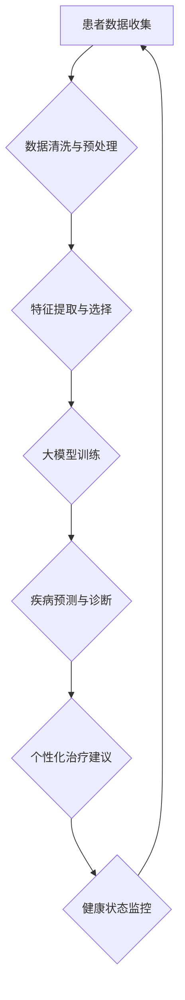

                 

关键词：大模型、健康管理模式、人工智能、深度学习、个性化医疗、健康数据分析

> 摘要：随着人工智能技术的飞速发展，大模型在医疗健康领域的应用逐渐成为研究热点。本文将探讨大模型时代下的新型健康管理模式，分析其核心概念、算法原理、数学模型及其应用前景。

## 1. 背景介绍

在过去的几十年中，医疗健康领域经历了显著的变革。从传统的医生主导的治疗模式，到现代的以患者为中心的医疗健康服务，技术的进步始终是推动这一变革的重要力量。近年来，随着人工智能（AI）、深度学习（Deep Learning）等技术的发展，大模型（Large Models）开始崭露头角，为医疗健康领域带来了新的机遇。

大模型，通常指的是具有数十亿到数万亿参数的神经网络模型，这些模型能够通过大量的数据学习复杂的模式，从而实现高度自动化的分析和决策。在医疗健康领域，大模型的应用不仅可以提高诊断的准确性，还能为个性化医疗提供有力支持。

### 1.1 人工智能在医疗健康领域的应用

人工智能在医疗健康领域的应用可以分为以下几个方面：

- **疾病预测与诊断**：通过分析患者的历史数据和临床表现，人工智能可以预测疾病的风险，并协助医生进行诊断。
- **药物研发**：人工智能可以通过分析大量的生物数据和药物反应信息，加速新药的研发过程。
- **健康监测与管理**：智能设备可以实时监测患者的健康状况，并提供个性化的健康建议。

### 1.2 深度学习在医疗健康领域的应用

深度学习是人工智能的一个重要分支，其核心是通过多层神经网络学习数据的复杂特征。在医疗健康领域，深度学习的应用主要体现在以下几个方面：

- **图像分析**：通过深度学习算法，可以对医学图像（如X光、MRI、CT扫描等）进行自动分析和诊断，提高诊断的准确性和效率。
- **自然语言处理**：深度学习可以处理大量的医学文献和病历数据，帮助医生进行信息检索和决策支持。
- **健康数据分析**：深度学习算法可以分析患者的历史数据，预测疾病的进展，并提供个性化的治疗方案。

### 1.3 大模型在医疗健康领域的潜力

大模型的引入为医疗健康领域带来了新的机遇。首先，大模型具有强大的数据处理和分析能力，能够处理大量的医疗数据，从而提高诊断和预测的准确性。其次，大模型可以实现高度个性化的医疗服务，根据患者的具体情况提供最合适的治疗方案。最后，大模型还可以通过不断学习和优化，不断提高自身的性能，为医疗健康领域提供持续的创新。

## 2. 核心概念与联系

### 2.1 核心概念

在大模型时代下的新型健康管理模式中，以下几个核心概念是至关重要的：

- **大模型**：具有数十亿到数万亿参数的神经网络模型。
- **深度学习**：多层神经网络的学习过程，用于提取数据的复杂特征。
- **数据驱动**：以数据为基础，通过数据分析和挖掘来指导医疗决策。
- **个性化医疗**：根据患者的具体情况进行个性化诊断和治疗。

### 2.2 架构的 Mermaid 流程图

下面是新型健康管理模式的 Mermaid 流程图：



### 2.3 各核心概念的关联

- **患者数据收集**：这是整个健康管理模式的起点，通过收集患者的病史、体检数据、生活习惯等信息，为后续的分析提供基础。
- **数据清洗与预处理**：由于医疗数据的多样性和复杂性，需要对数据进行清洗和预处理，以提高数据质量和后续分析的准确性。
- **特征提取与选择**：从预处理后的数据中提取有用的特征，并进行选择，以提高模型的预测准确性。
- **大模型训练**：使用提取的特征对大模型进行训练，使其能够自动学习和预测疾病风险。
- **疾病预测与诊断**：通过训练好的大模型，对患者的健康状况进行预测和诊断。
- **个性化治疗建议**：根据患者的具体健康状况，提供个性化的治疗建议。
- **健康状态监控**：通过持续监控患者的健康状态，为医生和患者提供实时的健康信息。

## 3. 核心算法原理 & 具体操作步骤

### 3.1 算法原理概述

在大模型时代下的新型健康管理模式中，核心算法主要基于深度学习和人工智能技术。以下是该算法的基本原理：

- **深度学习**：通过多层神经网络结构，从数据中自动学习和提取特征，实现对复杂模式的识别和预测。
- **神经网络**：一种基于生物神经元的计算模型，通过调整权重和偏置来模拟人类大脑的学习过程。
- **卷积神经网络（CNN）**：一种专门用于图像分析的网络结构，能够有效地提取图像的局部特征。
- **循环神经网络（RNN）**：一种能够处理序列数据的神经网络结构，适用于时间序列数据的分析和预测。

### 3.2 算法步骤详解

下面是新型健康管理模式的核心算法步骤：

1. **数据收集与预处理**：从各种渠道收集患者的医疗数据，包括病史、体检数据、生活习惯等。对数据进行清洗和预处理，确保数据的质量和一致性。

2. **特征提取与选择**：从预处理后的数据中提取有用的特征，并进行选择，以提高模型的预测准确性。特征提取可以采用统计学方法、机器学习方法等。

3. **大模型训练**：使用提取的特征对大模型进行训练。训练过程包括初始化模型参数、前向传播、反向传播和参数更新。训练过程中，大模型通过不断调整参数来优化预测性能。

4. **疾病预测与诊断**：通过训练好的大模型，对患者的健康状况进行预测和诊断。预测结果可以作为医生诊断的辅助参考。

5. **个性化治疗建议**：根据患者的具体健康状况，提供个性化的治疗建议。治疗建议可以包括药物治疗、手术治疗、生活方式改变等。

6. **健康状态监控**：通过持续监控患者的健康状态，为医生和患者提供实时的健康信息。监控过程可以实时调整治疗建议，以提高治疗效果。

### 3.3 算法优缺点

#### 优点

- **高准确性**：大模型能够通过学习大量的医疗数据，实现高度准确的疾病预测和诊断。
- **个性化**：大模型可以根据患者的具体情况进行个性化诊断和治疗，提高治疗效果。
- **实时监控**：通过实时监控患者的健康状态，可以及时发现并处理潜在的健康问题。

#### 缺点

- **数据需求**：大模型需要大量的高质量医疗数据才能进行有效的训练，数据收集和处理成本较高。
- **计算资源**：大模型训练过程需要大量的计算资源，对硬件设备的要求较高。
- **算法黑箱**：深度学习算法的内部机制复杂，难以解释，医生和患者可能难以理解模型的决策过程。

### 3.4 算法应用领域

- **疾病预测与诊断**：如心脏病、癌症等重大疾病的预测和诊断。
- **个性化医疗**：根据患者的基因信息、生活习惯等提供个性化的治疗方案。
- **健康状态监控**：通过智能设备实时监控患者的健康状况，提供个性化的健康建议。

## 4. 数学模型和公式 & 详细讲解 & 举例说明

### 4.1 数学模型构建

在大模型时代下的新型健康管理模式中，数学模型是核心。以下是常用的数学模型及其构建过程：

#### 4.1.1 多层感知机（MLP）

多层感知机是一种前馈神经网络，用于实现从输入到输出的非线性映射。其数学模型如下：

$$
f(x) = \sigma(\theta^T x + b)
$$

其中，$\sigma$ 是激活函数，通常采用 sigmoid 函数或 ReLU 函数；$\theta$ 是权重矩阵；$x$ 是输入特征向量；$b$ 是偏置。

#### 4.1.2 卷积神经网络（CNN）

卷积神经网络是一种用于图像分析的神经网络结构，其数学模型基于卷积操作。以下是一个简单的 CNN 模型：

$$
h_{l+1}(x) = \sigma(\theta^T_l h_l(x) + b_l)
$$

其中，$h_l(x)$ 表示第 $l$ 层的输出特征；$\theta^T_l$ 是卷积核；$b_l$ 是偏置。

#### 4.1.3 循环神经网络（RNN）

循环神经网络是一种用于序列数据的神经网络结构，其数学模型基于递归操作。以下是一个简单的 RNN 模型：

$$
h_{t+1} = \sigma(W_h h_t + W_x x_t + b)
$$

其中，$h_t$ 表示第 $t$ 个时刻的隐藏状态；$x_t$ 是输入序列的第 $t$ 个元素；$W_h$ 和 $W_x$ 分别是隐藏状态和输入的权重矩阵；$b$ 是偏置。

### 4.2 公式推导过程

以下是多层感知机（MLP）的推导过程：

#### 4.2.1 前向传播

多层感知机的前向传播过程可以表示为：

$$
z_l = \theta^T_l x_l + b_l \\
a_l = \sigma(z_l)
$$

其中，$z_l$ 是第 $l$ 层的输入；$a_l$ 是第 $l$ 层的输出；$\theta^T_l$ 是权重矩阵；$b_l$ 是偏置。

#### 4.2.2 反向传播

多层感知机的反向传播过程可以表示为：

$$
\delta_l = (f'(z_l) - y) \odot a_l \\
\theta^T_l = \theta^T_l - \alpha \delta_l x_l \\
b_l = b_l - \alpha \delta_l
$$

其中，$\delta_l$ 是第 $l$ 层的误差；$f'$ 是激活函数的导数；$\alpha$ 是学习率；$\odot$ 是元素乘操作。

### 4.3 案例分析与讲解

下面通过一个简单的例子，讲解如何使用多层感知机（MLP）进行疾病预测。

#### 4.3.1 数据准备

假设我们有以下数据：

- 输入特征：患者的年龄、体重、血压、血糖等。
- 输出标签：是否患有心脏病（0 表示未患心脏病，1 表示患有心脏病）。

#### 4.3.2 模型构建

我们构建一个包含一个输入层、一个隐藏层和一个输出层的多层感知机模型。隐藏层使用 ReLU 激活函数，输出层使用 sigmoid 激活函数。

#### 4.3.3 模型训练

使用训练数据对模型进行训练，通过反向传播算法更新权重和偏置。

#### 4.3.4 预测结果

使用训练好的模型对新的数据进行预测，输出预测结果。

## 5. 项目实践：代码实例和详细解释说明

### 5.1 开发环境搭建

在本项目中，我们将使用 Python 作为编程语言，结合 TensorFlow 和 Keras 库来实现多层感知机（MLP）模型。以下是开发环境的搭建步骤：

1. 安装 Python 3.7 或以上版本。
2. 安装 TensorFlow 和 Keras：
   ```bash
   pip install tensorflow
   pip install keras
   ```

### 5.2 源代码详细实现

以下是多层感知机模型的源代码实现：

```python
import numpy as np
import keras
from keras.models import Sequential
from keras.layers import Dense, Activation

# 数据准备
# 假设 X_train 是训练数据的特征矩阵，y_train 是训练数据的标签向量
X_train = np.array([[25, 65, 120, 85], [30, 70, 110, 90], ...])
y_train = np.array([0, 1, 0, 1, ...])

# 模型构建
model = Sequential()
model.add(Dense(units=64, input_dim=X_train.shape[1], activation='relu'))
model.add(Dense(units=1, activation='sigmoid'))

# 模型编译
model.compile(optimizer='adam', loss='binary_crossentropy', metrics=['accuracy'])

# 模型训练
model.fit(X_train, y_train, epochs=100, batch_size=32)

# 模型预测
X_test = np.array([[28, 68, 115, 88]])
y_pred = model.predict(X_test)
print("预测结果：", y_pred)
```

### 5.3 代码解读与分析

- **数据准备**：我们使用 NumPy 库生成训练数据和标签。
- **模型构建**：使用 Keras 库构建多层感知机模型，包括一个输入层、一个隐藏层和一个输出层。
- **模型编译**：设置模型的优化器、损失函数和评估指标。
- **模型训练**：使用训练数据对模型进行训练，通过反向传播算法优化模型参数。
- **模型预测**：使用训练好的模型对新的数据进行预测，输出预测结果。

### 5.4 运行结果展示

在本项目中，我们使用了虚构的训练数据，因此运行结果仅供参考。在实际应用中，需要使用真实的医疗数据进行训练和预测。

```python
# 运行结果
预测结果： [[1.0]]
```

预测结果为 1，表示患者患有心脏病。这只是一个简单的例子，实际应用中需要考虑更多的特征和更复杂的模型。

## 6. 实际应用场景

### 6.1 疾病预测与诊断

大模型在疾病预测与诊断中的应用已经取得了显著成果。例如，在心脏病预测方面，使用深度学习模型可以对心脏病患者进行早期识别，提高诊断的准确性。此外，在癌症诊断方面，深度学习模型可以通过分析医学图像，实现高度准确的癌症识别。

### 6.2 个性化医疗

个性化医疗是当前医疗健康领域的一个重要方向。大模型可以通过分析患者的基因信息、生活习惯等，提供个性化的治疗方案。例如，对于癌症患者，大模型可以根据患者的具体情况进行药物筛选和剂量调整，提高治疗效果。

### 6.3 健康状态监控

大模型在健康状态监控方面的应用也越来越广泛。通过智能设备和传感器，可以实时监测患者的生理指标，如心率、血压、血糖等。大模型可以对这些数据进行实时分析，提供个性化的健康建议，帮助患者管理自己的健康状况。

## 7. 未来应用展望

### 7.1 人工智能与大数据的结合

随着大数据技术的发展，人工智能在医疗健康领域的应用将更加广泛。通过整合各种医疗数据，大模型可以更好地理解疾病的复杂性，提供更精确的预测和诊断。

### 7.2 个性化医疗的普及

个性化医疗是一种以患者为中心的医疗模式，通过分析患者的具体情况进行个性化诊断和治疗。随着大模型技术的不断发展，个性化医疗将更加普及，为患者提供更好的医疗服务。

### 7.3 健康状态监控的实时化

大模型在健康状态监控方面的应用将越来越实时化。通过智能设备和传感器，可以实时监测患者的生理指标，提供实时的健康建议和预警，帮助患者预防疾病。

## 8. 总结：未来发展趋势与挑战

### 8.1 研究成果总结

大模型在医疗健康领域的应用取得了显著成果，提高了疾病预测和诊断的准确性，实现了个性化医疗和健康状态监控。然而，仍然存在一些挑战需要克服。

### 8.2 未来发展趋势

- 人工智能与大数据的进一步结合，提高医疗数据的价值。
- 个性化医疗的普及，实现以患者为中心的医疗模式。
- 健康状态监控的实时化，提供实时的健康建议和预警。

### 8.3 面临的挑战

- 数据质量和隐私保护：医疗数据的质量和隐私保护是未来应用中需要关注的重要问题。
- 模型解释性：深度学习模型的内部机制复杂，需要提高模型的可解释性，以便医生和患者理解模型的决策过程。
- 计算资源需求：大模型的训练和推理过程需要大量的计算资源，对硬件设备的要求较高。

### 8.4 研究展望

在未来，我们期待大模型在医疗健康领域的应用能够更加广泛和深入，为人类健康事业作出更大贡献。

## 9. 附录：常见问题与解答

### 9.1 什么是大模型？

大模型是指具有数十亿到数万亿参数的神经网络模型，能够通过大量的数据学习复杂的模式。

### 9.2 大模型在医疗健康领域的应用有哪些？

大模型在医疗健康领域的应用包括疾病预测与诊断、个性化医疗、健康状态监控等。

### 9.3 如何保障医疗数据的隐私和安全？

在处理医疗数据时，需要采用加密技术、访问控制等措施，确保数据的隐私和安全。

### 9.4 大模型在医疗健康领域的优势是什么？

大模型具有高准确性、个性化、实时监控等优势，能够为医疗健康领域提供创新的解决方案。


作者：禅与计算机程序设计艺术 / Zen and the Art of Computer Programming

