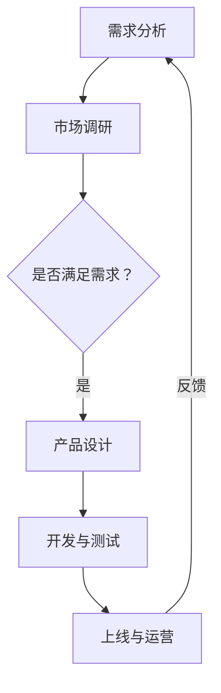

                 

关键词：大模型，创业产品设计，AI，架构设计，机器学习，神经网络，未来趋势

> 摘要：随着人工智能技术的飞速发展，大模型成为推动创业创新的核心力量。本文将深入探讨大模型在创业产品设计中的应用，探讨其原理、算法、数学模型以及实际操作案例，旨在为创业者提供有价值的指导，共同迎接AI驱动的未来。

## 1. 背景介绍

### 1.1 大模型的发展历程

大模型（Large Models），即拥有巨大参数规模和强泛化能力的神经网络模型，如Transformer、BERT、GPT等。自2018年以来，大模型的研究和应用逐渐成为人工智能领域的热点。得益于计算能力的提升和海量数据资源的积累，大模型在自然语言处理、计算机视觉、语音识别等领域取得了显著成果。

### 1.2 创业设计的重要性

创业设计不仅关乎产品的成功，更关乎企业的长远发展。优秀的设计可以提升用户体验，增强用户粘性，从而为企业创造更多的商业价值。在AI时代，如何将大模型融入创业设计，将直接影响到企业的竞争力。

## 2. 核心概念与联系

### 2.1 大模型原理

大模型基于深度学习技术，采用多层神经网络结构，通过学习大量数据，实现从输入到输出的映射。其核心思想是模拟人脑神经网络，通过非线性变换和层次化结构，逐步提取输入数据的特征。

### 2.2 创业设计框架

创业设计包括需求分析、市场调研、产品设计、开发与测试、上线与运营等环节。将大模型应用于创业设计，可以提升数据分析、智能推荐、语音交互等环节的效率和质量。

### 2.3 Mermaid 流程图



## 3. 核心算法原理 & 具体操作步骤

### 3.1 算法原理概述

大模型算法主要包括两个部分：前向传播和反向传播。

1. 前向传播：将输入数据通过神经网络层次结构进行变换，逐步提取特征，最终得到输出结果。
2. 反向传播：计算输出结果与预期结果的误差，通过误差反馈调整网络参数，使模型逐渐优化。

### 3.2 算法步骤详解

1. 数据预处理：对原始数据进行清洗、归一化等处理，使其符合模型输入要求。
2. 模型构建：选择合适的神经网络结构，初始化模型参数。
3. 模型训练：使用训练数据对模型进行迭代训练，通过优化算法调整模型参数。
4. 模型评估：使用测试数据评估模型性能，根据评估结果调整模型。
5. 模型部署：将训练好的模型部署到实际应用场景，实现自动化处理。

### 3.3 算法优缺点

#### 优点：

1. 强泛化能力：大模型能够从大量数据中学习，具有较强的泛化能力。
2. 高效处理：大模型能够处理海量数据，提高数据处理效率。
3. 自动化决策：大模型可以实现自动化决策，降低人工干预成本。

#### 缺点：

1. 计算资源消耗：大模型训练和部署需要大量计算资源和存储空间。
2. 数据依赖性：大模型对数据质量要求较高，数据不足或质量差可能导致模型性能下降。

### 3.4 算法应用领域

大模型广泛应用于自然语言处理、计算机视觉、语音识别、推荐系统等领域。在创业设计中，大模型可以应用于需求分析、市场调研、产品设计、开发与测试等环节，提升业务效率和质量。

## 4. 数学模型和公式 & 详细讲解 & 举例说明

### 4.1 数学模型构建

大模型的核心是多层感知机（MLP）和循环神经网络（RNN）。

1. MLP模型：

$$
y = \sigma(W_n \cdot a_{n-1} + b_n)
$$

其中，$y$ 为输出，$\sigma$ 为激活函数，$W_n$ 和 $b_n$ 分别为权重和偏置。

2. RNN模型：

$$
h_t = \sigma(W_h \cdot [h_{t-1}, x_t] + b_h)
$$

其中，$h_t$ 为当前隐藏状态，$x_t$ 为当前输入，$W_h$ 和 $b_h$ 分别为权重和偏置。

### 4.2 公式推导过程

以MLP模型为例，假设输入数据为 $x$，输出数据为 $y$，则有：

$$
y = \sigma(W_n \cdot x + b_n)
$$

对公式两边求导，得到：

$$
\frac{dy}{dx} = \sigma'(W_n \cdot x + b_n) \cdot W_n
$$

其中，$\sigma'$ 为激活函数的导数。

### 4.3 案例分析与讲解

以自然语言处理中的情感分析为例，输入为文本数据，输出为情感标签（正面、负面、中性）。

1. 数据预处理：对文本数据进行分词、去停用词等处理，将文本转换为词向量。
2. 模型构建：构建多层感知机模型，输入层为词向量，输出层为情感标签。
3. 模型训练：使用训练数据对模型进行迭代训练，优化模型参数。
4. 模型评估：使用测试数据评估模型性能，调整模型参数。

## 5. 项目实践：代码实例和详细解释说明

### 5.1 开发环境搭建

1. 安装Python环境。
2. 安装TensorFlow库：`pip install tensorflow`
3. 安装Keras库：`pip install keras`

### 5.2 源代码详细实现

```python
from keras.models import Sequential
from keras.layers import Dense, LSTM
from keras.preprocessing.text import Tokenizer
from keras.preprocessing.sequence import pad_sequences

# 数据预处理
tokenizer = Tokenizer(num_words=10000)
tokenizer.fit_on_texts(train_data)
sequences = tokenizer.texts_to_sequences(train_data)
data = pad_sequences(sequences, maxlen=100)

# 模型构建
model = Sequential()
model.add(LSTM(128, activation='relu', input_shape=(100,)))
model.add(Dense(1, activation='sigmoid'))

# 模型训练
model.compile(optimizer='rmsprop', loss='binary_crossentropy', metrics=['acc'])
model.fit(data, train_labels, epochs=10, batch_size=32)

# 代码解读与分析
# Tokenizer用于将文本数据转换为词向量。
# pad_sequences用于将词向量序列填充为相同长度。
# LSTM用于提取文本数据的特征。
# Dense用于实现分类。
```

### 5.3 运行结果展示

运行代码后，可以使用测试数据对模型进行评估。输出结果包括模型的准确率、召回率等指标。

## 6. 实际应用场景

### 6.1 智能推荐系统

利用大模型进行用户兴趣分析，实现个性化推荐，提升用户满意度。

### 6.2 智能客服系统

利用大模型实现自然语言处理，提高客服机器人回答问题的准确性和效率。

### 6.3 健康风险评估

利用大模型进行医学数据挖掘，预测健康风险，为用户提供个性化健康建议。

## 7. 未来应用展望

随着人工智能技术的不断发展，大模型将在更多领域得到应用。未来，大模型有望在自动驾驶、智能家居、教育、医疗等领域发挥重要作用，推动人类社会迈向智能化。

## 8. 工具和资源推荐

### 8.1 学习资源推荐

1. 《深度学习》（Ian Goodfellow、Yoshua Bengio、Aaron Courville 著）
2. 《神经网络与深度学习》（邱锡鹏 著）

### 8.2 开发工具推荐

1. TensorFlow
2. Keras

### 8.3 相关论文推荐

1. "Attention Is All You Need"
2. "BERT: Pre-training of Deep Bidirectional Transformers for Language Understanding"

## 9. 总结：未来发展趋势与挑战

### 9.1 研究成果总结

大模型在自然语言处理、计算机视觉等领域取得了显著成果，为创业设计提供了新的思路和工具。

### 9.2 未来发展趋势

随着计算能力的提升和海量数据资源的积累，大模型的应用将越来越广泛，创业设计的智能化程度将不断提高。

### 9.3 面临的挑战

1. 计算资源消耗：大模型训练和部署需要大量计算资源和存储空间。
2. 数据依赖性：大模型对数据质量要求较高，数据不足或质量差可能导致模型性能下降。
3. 伦理与隐私：如何确保大模型的应用符合伦理规范，保护用户隐私，是未来研究的重要方向。

### 9.4 研究展望

未来，大模型的研究将朝着高效性、可解释性和安全性方向发展，为创业设计提供更强有力的支持。

## 10. 附录：常见问题与解答

### 10.1 如何选择合适的大模型？

1. 根据应用场景选择：如自然语言处理选择Transformer、计算机视觉选择卷积神经网络（CNN）。
2. 考虑计算资源：选择适合自己计算能力的模型，如MobileNet、ResNet等。

### 10.2 大模型训练过程中如何避免过拟合？

1. 使用更多的训练数据。
2. 采用正则化技术，如Dropout、权重衰减等。
3. 使用交叉验证等方法评估模型性能。

### 10.3 如何优化大模型的部署？

1. 使用量化技术降低模型参数规模。
2. 采用模型压缩算法，如模型剪枝、蒸馏等。
3. 使用模型解释性工具，提高模型的可解释性。

作者：禅与计算机程序设计艺术 / Zen and the Art of Computer Programming
----------------------------------------------------------------

以上就是本文《大模型时代的创业产品设计：AI驱动的未来》的完整内容。希望这篇文章能为您在创业设计过程中提供有益的启示。在AI时代，让我们携手共进，共创美好未来！

