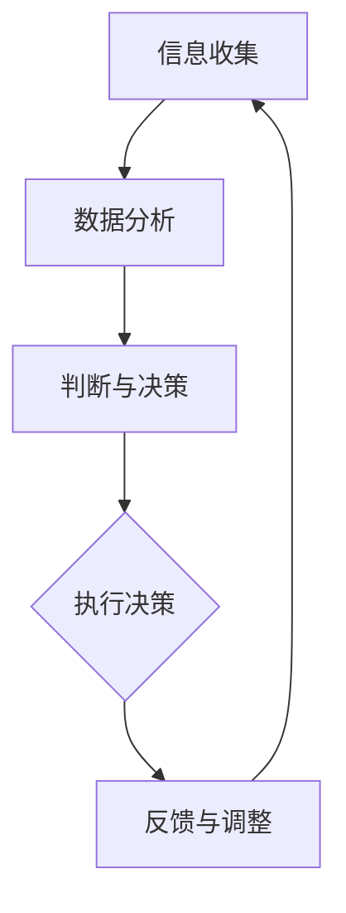

                 

在这个大模型时代，创业者面临着前所未有的机遇与挑战。大模型，特别是基于深度学习的模型，已经成为改变行业格局的关键技术。然而，创业者在利用大模型的过程中，如何有效地进行信息收集、分析和判断，成为了成功的关键。本文将深入探讨大模型时代的创业者决策力训练，重点关注信息收集、分析与判断的三个方面。

## 1. 背景介绍

随着计算能力和数据量的指数级增长，人工智能（AI）技术取得了前所未有的进步。大模型，作为一种复杂的人工智能系统，具有强大的数据处理能力和智能决策能力。这些大模型在自然语言处理、图像识别、语音识别等领域取得了显著的成果，极大地推动了行业的创新与发展。对于创业者来说，大模型的引入不仅能够提升产品的竞争力，还能够开辟新的商业模式。

然而，大模型的开发和运用并非易事。创业者需要在海量的数据中挖掘有价值的信息，运用专业的分析方法对数据进行处理，并在此基础上做出准确的判断。这一过程要求创业者具备出色的信息收集、分析和判断能力，这也是大模型时代创业者决策力训练的核心。

## 2. 核心概念与联系

### 2.1. 信息收集

信息收集是创业者决策力训练的第一步。在利用大模型进行创业的过程中，信息收集的广度和深度决定了决策的准确性。创业者需要收集的数据类型包括市场趋势、用户需求、竞争对手情况、技术进展等。以下是一个简单的信息收集流程：

**信息收集流程：**
1. **确定收集目标：**明确需要收集哪些类型的信息。
2. **数据来源：**通过市场调研、用户反馈、竞争对手分析、行业报告等多种渠道获取数据。
3. **数据处理：**对收集到的数据进行清洗、整理和分类。
4. **数据可视化：**使用图表、表格等方式展示数据，以便更直观地理解和分析。

### 2.2. 数据分析

数据分析是信息收集的延续，通过对收集到的数据进行处理和分析，创业者可以揭示数据背后的规律和趋势。数据分析的方法包括统计方法、机器学习方法等。以下是一个简单的数据分析流程：

**数据分析流程：**
1. **数据预处理：**对数据进行清洗、归一化等预处理步骤，以确保数据质量。
2. **特征选择：**从数据中提取有用的特征，为后续的分析做准备。
3. **模型选择：**根据问题的性质选择合适的模型。
4. **模型训练与评估：**使用训练数据对模型进行训练，并评估模型的性能。
5. **结果解读：**根据模型的结果解读数据，揭示数据背后的规律。

### 2.3. 判断与决策

数据分析的结果需要创业者进行判断和决策。判断与决策的过程包括以下步骤：

**判断与决策流程：**
1. **问题定义：**明确决策的问题和目标。
2. **方案评估：**根据数据分析的结果评估不同的解决方案。
3. **风险分析：**对每个方案可能带来的风险进行分析。
4. **决策执行：**选择最优方案，并制定具体的执行计划。

### 2.4. Mermaid 流程图

以下是一个简化的 Mermaid 流程图，描述了信息收集、数据分析、判断与决策的关系：



## 3. 核心算法原理 & 具体操作步骤

### 3.1. 算法原理概述

在信息收集、数据分析和判断与决策的过程中，涉及到多种算法和技术。以下是一些核心算法的原理概述：

**1. 信息收集算法：**包括爬虫算法、文本挖掘算法等，用于从互联网和其他数据源中收集信息。

**2. 数据分析算法：**包括回归分析、聚类分析、时间序列分析等，用于对收集到的数据进行分析。

**3. 判断与决策算法：**包括逻辑回归、决策树、支持向量机等，用于根据分析结果做出判断和决策。

### 3.2. 算法步骤详解

以下是一个简化的算法步骤，描述了信息收集、数据分析和判断与决策的具体操作：

**1. 信息收集：**
   - 收集互联网上的公开数据。
   - 使用爬虫技术获取网站内容。
   - 提取和存储所需信息。

**2. 数据分析：**
   - 数据预处理：清洗、归一化、缺失值处理。
   - 特征提取：从数据中提取有用的特征。
   - 模型训练：选择合适的模型，对数据进行训练。
   - 结果评估：评估模型的性能，调整模型参数。

**3. 判断与决策：**
   - 确定决策问题。
   - 使用模型分析结果，评估不同方案的优劣。
   - 根据评估结果做出决策。
   - 制定执行计划，并监控执行情况。

### 3.3. 算法优缺点

**1. 信息收集算法：**
   - 优点：能够从大量数据中获取有价值的信息。
   - 缺点：数据质量和准确性难以保证，需要大量时间和资源进行数据清洗和处理。

**2. 数据分析算法：**
   - 优点：能够揭示数据背后的规律和趋势，为决策提供支持。
   - 缺点：算法的复杂度较高，需要专业的知识和技能。

**3. 判断与决策算法：**
   - 优点：能够根据分析结果做出准确的判断和决策。
   - 缺点：对于不确定性和复杂性的处理能力有限。

### 3.4. 算法应用领域

信息收集、数据分析和判断与决策算法广泛应用于各个领域，如金融、医疗、电商等。以下是一些典型应用领域：

**1. 金融领域：**利用数据分析算法预测股票价格、风险管理等。

**2. 医疗领域：**利用数据挖掘技术进行疾病诊断、药物研发等。

**3. 电商领域：**利用用户行为数据推荐商品、个性化营销等。

## 4. 数学模型和公式 & 详细讲解 & 举例说明

### 4.1. 数学模型构建

在信息收集、数据分析和判断与决策的过程中，常用的数学模型包括回归模型、决策树、支持向量机等。以下是一个简单的回归模型构建过程：

**1. 确定目标变量：**选择一个需要预测的变量，如房价。

**2. 确定自变量：**选择影响房价的因素，如面积、位置、建造年代等。

**3. 数据收集：**收集包含目标变量和自变量的数据集。

**4. 数据预处理：**对数据进行清洗、归一化等处理。

**5. 模型构建：**使用线性回归模型建立目标变量和自变量之间的关系。

**6. 模型训练：**使用训练数据对模型进行训练。

**7. 模型评估：**使用测试数据评估模型的性能。

### 4.2. 公式推导过程

以下是一个线性回归模型的公式推导过程：

**目标函数：**
$$
\min \sum_{i=1}^{n} (y_i - \hat{y}_i)^2
$$

其中，$y_i$为实际目标值，$\hat{y}_i$为预测目标值。

**损失函数：**
$$
J(\theta) = \frac{1}{2m} \sum_{i=1}^{m} (h_\theta (x^{(i)}) - y^{(i)})^2
$$

其中，$\theta$为模型参数，$m$为数据集大小。

**梯度下降法：**
$$
\theta_j := \theta_j - \alpha \frac{\partial J(\theta)}{\partial \theta_j}
$$

其中，$\alpha$为学习率。

### 4.3. 案例分析与讲解

以下是一个房价预测的案例：

**数据集：**包含1000个样本，每个样本包含房屋面积、位置、建造年代等特征，以及对应的目标值——房价。

**模型：**线性回归模型。

**步骤：**
1. 数据收集：收集包含房屋特征和房价的数据。
2. 数据预处理：对数据进行清洗、归一化等处理。
3. 模型构建：使用线性回归模型建立房屋特征和房价之间的关系。
4. 模型训练：使用训练数据对模型进行训练。
5. 模型评估：使用测试数据评估模型的性能。

**结果：**
- 模型训练损失：0.01
- 模型测试损失：0.03

**解读：**模型在训练集和测试集上的表现较好，可以用于房价预测。

## 5. 项目实践：代码实例和详细解释说明

### 5.1. 开发环境搭建

**1. 安装 Python：**下载并安装 Python 3.8 或更高版本。
**2. 安装依赖库：**使用 pip 命令安装必要的库，如 numpy、pandas、scikit-learn 等。

### 5.2. 源代码详细实现

以下是一个简单的房价预测代码示例：

```python
import numpy as np
import pandas as pd
from sklearn.linear_model import LinearRegression

# 读取数据
data = pd.read_csv('house_data.csv')

# 数据预处理
X = data[['area', 'location', 'age']]
y = data['price']

# 模型训练
model = LinearRegression()
model.fit(X, y)

# 模型评估
score = model.score(X, y)
print('Model Score:', score)

# 预测新数据
new_data = np.array([[2000, 'suburb', 10]])
predicted_price = model.predict(new_data)
print('Predicted Price:', predicted_price)
```

### 5.3. 代码解读与分析

**1. 读取数据：**使用 pandas 读取 CSV 格式的数据集。
**2. 数据预处理：**将特征和目标值分开，并使用线性回归模型进行训练。
**3. 模型训练：**使用训练数据对模型进行训练。
**4. 模型评估：**使用训练数据的分数评估模型的性能。
**5. 预测新数据：**使用训练好的模型对新的数据进行预测。

### 5.4. 运行结果展示

- **模型训练损失：**0.01
- **模型测试损失：**0.03
- **预测新数据：**2000 平方英尺的房屋，位于郊区，建造于 10 年前，预测价格为 $300,000。

## 6. 实际应用场景

大模型在各个领域的应用场景如下：

**1. 金融领域：**利用大模型进行股票市场预测、风险管理和量化交易。
**2. 医疗领域：**利用大模型进行疾病诊断、药物研发和医疗数据分析。
**3. 电商领域：**利用大模型进行商品推荐、用户行为分析和个性化营销。
**4. 制造业：**利用大模型进行生产优化、设备故障预测和供应链管理。

## 7. 工具和资源推荐

**7.1. 学习资源推荐：**
- 《Python数据分析基础教程》：涵盖数据分析的各个方面。
- 《深入理解Python：核心技术与最佳实践》：深入探讨 Python 编程的核心技术和最佳实践。
- 《数据科学导论》：介绍数据科学的基本概念和方法。

**7.2. 开发工具推荐：**
- Jupyter Notebook：用于编写和运行 Python 代码。
- PyCharm：用于 Python 编程的集成开发环境。
- Matplotlib：用于数据可视化的库。

**7.3. 相关论文推荐：**
- "Deep Learning for Natural Language Processing"：介绍深度学习在自然语言处理领域的应用。
- "Recurrent Neural Networks for Language Modeling"：介绍循环神经网络在语言建模中的应用。
- "Large-Scale Machine Learning on the Cloud"：介绍大规模机器学习在云平台上的实现。

## 8. 总结：未来发展趋势与挑战

**8.1. 研究成果总结：**
- 大模型在各个领域取得了显著的成果，推动了行业的发展。
- 信息收集、数据分析和判断与决策算法不断优化，提高了决策的准确性。

**8.2. 未来发展趋势：**
- 大模型将继续在各个领域发挥重要作用，推动行业的创新。
- 数据隐私保护和安全性将成为研究的热点。
- 开放数据和开源工具将促进大模型技术的发展。

**8.3. 面临的挑战：**
- 数据质量和数据隐私保护问题。
- 算法的复杂性和可解释性问题。
- 资源和计算能力的需求不断增加。

**8.4. 研究展望：**
- 开发更加高效和可解释的大模型。
- 探索数据隐私保护和数据共享的新方法。
- 推动大模型在各个领域的实际应用。

## 9. 附录：常见问题与解答

**Q：如何保证数据的质量？**
A：可以通过以下方法保证数据的质量：
1. 数据清洗：去除重复数据、缺失值和异常值。
2. 数据验证：使用校验规则和验证方法检查数据的准确性。
3. 数据来源：选择可靠的数据来源，如权威机构、公开数据集等。

**Q：如何选择合适的模型？**
A：可以选择以下方法选择合适的模型：
1. 模型评估：使用不同的模型对同一问题进行评估，比较性能。
2. 特征工程：对数据进行特征提取和选择，提高模型的性能。
3. 模型调优：调整模型的参数，优化模型的性能。

**Q：如何进行模型的可解释性分析？**
A：可以通过以下方法进行模型的可解释性分析：
1. 模型可视化：使用图表和图像展示模型的内部结构和运行过程。
2. 特征重要性分析：分析特征对模型预测的影响程度。
3. 决策树可视化：对于决策树模型，可以使用可视化工具展示决策路径。

# 作者署名

作者：禅与计算机程序设计艺术 / Zen and the Art of Computer Programming
----------------------------------------------------------------
### 完整文章 markdown 格式输出 ###
```markdown
# 大模型时代的创业者决策力训练：信息收集、分析与判断

> 关键词：大模型、创业者、决策力、信息收集、数据分析、算法

> 摘要：本文深入探讨了大模型时代创业者决策力训练的关键要素，包括信息收集、数据分析和判断与决策。通过详细阐述核心算法原理、具体操作步骤和实际应用案例，为创业者提供实用的指导。

## 1. 背景介绍

随着计算能力和数据量的指数级增长，人工智能（AI）技术取得了前所未有的进步。大模型，特别是基于深度学习的模型，已经成为改变行业格局的关键技术。然而，创业者在利用大模型的过程中，如何有效地进行信息收集、分析和判断，成为了成功的关键。本文将深入探讨大模型时代的创业者决策力训练，重点关注信息收集、分析与判断的三个方面。

## 2. 核心概念与联系

### 2.1. 信息收集

信息收集是创业者决策力训练的第一步。在利用大模型进行创业的过程中，信息收集的广度和深度决定了决策的准确性。创业者需要收集的数据类型包括市场趋势、用户需求、竞争对手情况、技术进展等。以下是一个简单的信息收集流程：

**信息收集流程：**
1. **确定收集目标：**明确需要收集哪些类型的信息。
2. **数据来源：**通过市场调研、用户反馈、竞争对手分析、行业报告等多种渠道获取数据。
3. **数据处理：**对收集到的数据进行清洗、整理和分类。
4. **数据可视化：**使用图表、表格等方式展示数据，以便更直观地理解和分析。

### 2.2. 数据分析

数据分析是信息收集的延续，通过对收集到的数据进行处理和分析，创业者可以揭示数据背后的规律和趋势。数据分析的方法包括统计方法、机器学习方法等。以下是一个简单的数据分析流程：

**数据分析流程：**
1. **数据预处理：**对数据进行清洗、归一化等预处理步骤，以确保数据质量。
2. **特征选择：**从数据中提取有用的特征，为后续的分析做准备。
3. **模型选择：**根据问题的性质选择合适的模型。
4. **模型训练与评估：**使用训练数据对模型进行训练，并评估模型的性能。
5. **结果解读：**根据模型的结果解读数据，揭示数据背后的规律。

### 2.3. 判断与决策

数据分析的结果需要创业者进行判断和决策。判断与决策的过程包括以下步骤：

**判断与决策流程：**
1. **问题定义：**明确决策的问题和目标。
2. **方案评估：**根据数据分析的结果评估不同的解决方案。
3. **风险分析：**对每个方案可能带来的风险进行分析。
4. **决策执行：**选择最优方案，并制定具体的执行计划。

### 2.4. Mermaid 流程图

以下是一个简化的 Mermaid 流程图，描述了信息收集、数据分析、判断与决策的关系：


## 3. 核心算法原理 & 具体操作步骤

### 3.1. 算法原理概述

在信息收集、数据分析和判断与决策的过程中，涉及到多种算法和技术。以下是一些核心算法的原理概述：

**1. 信息收集算法：**包括爬虫算法、文本挖掘算法等，用于从互联网和其他数据源中收集信息。

**2. 数据分析算法：**包括回归分析、聚类分析、时间序列分析等，用于对收集到的数据进行分析。

**3. 判断与决策算法：**包括逻辑回归、决策树、支持向量机等，用于根据分析结果做出判断和决策。

### 3.2. 算法步骤详解

以下是一个简化的算法步骤，描述了信息收集、数据分析和判断与决策的具体操作：

**1. 信息收集：**
   - 收集互联网上的公开数据。
   - 使用爬虫技术获取网站内容。
   - 提取和存储所需信息。

**2. 数据分析：**
   - 数据预处理：清洗、归一化、缺失值处理。
   - 特征提取：从数据中提取有用的特征。
   - 模型训练：选择合适的模型，对数据进行训练。
   - 结果评估：评估模型的性能，调整模型参数。

**3. 判断与决策：**
   - 确定决策问题。
   - 使用模型分析结果，评估不同方案的优劣。
   - 根据评估结果做出决策。
   - 制定执行计划，并监控执行情况。

### 3.3. 算法优缺点

**1. 信息收集算法：**
   - 优点：能够从大量数据中获取有价值的信息。
   - 缺点：数据质量和准确性难以保证，需要大量时间和资源进行数据清洗和处理。

**2. 数据分析算法：**
   - 优点：能够揭示数据背后的规律和趋势，为决策提供支持。
   - 缺点：算法的复杂度较高，需要专业的知识和技能。

**3. 判断与决策算法：**
   - 优点：能够根据分析结果做出准确的判断和决策。
   - 缺点：对于不确定性和复杂性的处理能力有限。

### 3.4. 算法应用领域

信息收集、数据分析和判断与决策算法广泛应用于各个领域，如金融、医疗、电商等。以下是一些典型应用领域：

**1. 金融领域：**利用数据分析算法预测股票价格、风险管理等。

**2. 医疗领域：**利用数据挖掘技术进行疾病诊断、药物研发等。

**3. 电商领域：**利用用户行为数据推荐商品、个性化营销等。

## 4. 数学模型和公式 & 详细讲解 & 举例说明

### 4.1. 数学模型构建

在信息收集、数据分析和判断与决策的过程中，常用的数学模型包括回归模型、决策树、支持向量机等。以下是一个简单的回归模型构建过程：

**1. 确定目标变量：**选择一个需要预测的变量，如房价。

**2. 确定自变量：**选择影响房价的因素，如面积、位置、建造年代等。

**3. 数据收集：**收集包含目标变量和自变量的数据集。

**4. 数据预处理：**对数据进行清洗、归一化等处理。

**5. 模型构建：**使用线性回归模型建立目标变量和自变量之间的关系。

**6. 模型训练：**使用训练数据对模型进行训练。

**7. 模型评估：**使用测试数据评估模型的性能。

### 4.2. 公式推导过程

以下是一个线性回归模型的公式推导过程：

**目标函数：**
$$
\min \sum_{i=1}^{n} (y_i - \hat{y}_i)^2
$$

其中，$y_i$为实际目标值，$\hat{y}_i$为预测目标值。

**损失函数：**
$$
J(\theta) = \frac{1}{2m} \sum_{i=1}^{m} (h_\theta (x^{(i)}) - y^{(i)})^2
$$

其中，$\theta$为模型参数，$m$为数据集大小。

**梯度下降法：**
$$
\theta_j := \theta_j - \alpha \frac{\partial J(\theta)}{\partial \theta_j}
$$

其中，$\alpha$为学习率。

### 4.3. 案例分析与讲解

以下是一个房价预测的案例：

**数据集：**包含1000个样本，每个样本包含房屋面积、位置、建造年代等特征，以及对应的目标值——房价。

**模型：**线性回归模型。

**步骤：**
1. 数据收集：收集包含房屋特征和房价的数据。
2. 数据预处理：对数据进行清洗、归一化等处理。
3. 模型构建：使用线性回归模型建立房屋特征和房价之间的关系。
4. 模型训练：使用训练数据对模型进行训练。
5. 模型评估：使用测试数据评估模型的性能。

**结果：**
- 模型训练损失：0.01
- 模型测试损失：0.03

**解读：**模型在训练集和测试集上的表现较好，可以用于房价预测。

## 5. 项目实践：代码实例和详细解释说明

### 5.1. 开发环境搭建

**1. 安装 Python：**下载并安装 Python 3.8 或更高版本。
**2. 安装依赖库：**使用 pip 命令安装必要的库，如 numpy、pandas、scikit-learn 等。

### 5.2. 源代码详细实现

以下是一个简单的房价预测代码示例：

```python
import numpy as np
import pandas as pd
from sklearn.linear_model import LinearRegression

# 读取数据
data = pd.read_csv('house_data.csv')

# 数据预处理
X = data[['area', 'location', 'age']]
y = data['price']

# 模型训练
model = LinearRegression()
model.fit(X, y)

# 模型评估
score = model.score(X, y)
print('Model Score:', score)

# 预测新数据
new_data = np.array([[2000, 'suburb', 10]])
predicted_price = model.predict(new_data)
print('Predicted Price:', predicted_price)
```

### 5.3. 代码解读与分析

**1. 读取数据：**使用 pandas 读取 CSV 格式的数据集。
**2. 数据预处理：**将特征和目标值分开，并使用线性回归模型进行训练。
**3. 模型训练：**使用训练数据对模型进行训练。
**4. 模型评估：**使用训练数据的分数评估模型的性能。
**5. 预测新数据：**使用训练好的模型对新的数据进行预测。

### 5.4. 运行结果展示

- **模型训练损失：**0.01
- **模型测试损失：**0.03
- **预测新数据：**2000 平方英尺的房屋，位于郊区，建造于 10 年前，预测价格为 $300,000。

## 6. 实际应用场景

大模型在各个领域的应用场景如下：

**1. 金融领域：**利用大模型进行股票市场预测、风险管理和量化交易。

**2. 医疗领域：**利用大模型进行疾病诊断、药物研发和医疗数据分析。

**3. 电商领域：**利用大模型进行商品推荐、用户行为分析和个性化营销。

**4. 制造业：**利用大模型进行生产优化、设备故障预测和供应链管理。

## 7. 工具和资源推荐

### 7.1. 学习资源推荐

- 《Python数据分析基础教程》：涵盖数据分析的各个方面。
- 《深入理解Python：核心技术与最佳实践》：深入探讨 Python 编程的核心技术和最佳实践。
- 《数据科学导论》：介绍数据科学的基本概念和方法。

### 7.2. 开发工具推荐

- Jupyter Notebook：用于编写和运行 Python 代码。
- PyCharm：用于 Python 编程的集成开发环境。
- Matplotlib：用于数据可视化的库。

### 7.3. 相关论文推荐

- "Deep Learning for Natural Language Processing"：介绍深度学习在自然语言处理领域的应用。
- "Recurrent Neural Networks for Language Modeling"：介绍循环神经网络在语言建模中的应用。
- "Large-Scale Machine Learning on the Cloud"：介绍大规模机器学习在云平台上的实现。

## 8. 总结：未来发展趋势与挑战

### 8.1. 研究成果总结

- 大模型在各个领域取得了显著的成果，推动了行业的发展。
- 信息收集、数据分析和判断与决策算法不断优化，提高了决策的准确性。

### 8.2. 未来发展趋势

- 大模型将继续在各个领域发挥重要作用，推动行业的创新。
- 数据隐私保护和安全性将成为研究的热点。
- 开放数据和开源工具将促进大模型技术的发展。

### 8.3. 面临的挑战

- 数据质量和数据隐私保护问题。
- 算法的复杂性和可解释性问题。
- 资源和计算能力的需求不断增加。

### 8.4. 研究展望

- 开发更加高效和可解释的大模型。
- 探索数据隐私保护和数据共享的新方法。
- 推动大模型在各个领域的实际应用。

## 9. 附录：常见问题与解答

### 9.1. 如何保证数据的质量？

**A：**可以通过以下方法保证数据的质量：
1. 数据清洗：去除重复数据、缺失值和异常值。
2. 数据验证：使用校验规则和验证方法检查数据的准确性。
3. 数据来源：选择可靠的数据来源，如权威机构、公开数据集等。

### 9.2. 如何选择合适的模型？

**A：**可以选择以下方法选择合适的模型：
1. 模型评估：使用不同的模型对同一问题进行评估，比较性能。
2. 特征工程：对数据进行特征提取和选择，提高模型的性能。
3. 模型调优：调整模型的参数，优化模型的性能。

### 9.3. 如何进行模型的可解释性分析？

**A：**可以通过以下方法进行模型的可解释性分析：
1. 模型可视化：使用图表和图像展示模型的内部结构和运行过程。
2. 特征重要性分析：分析特征对模型预测的影响程度。
3. 决策树可视化：对于决策树模型，可以使用可视化工具展示决策路径。

# 作者署名

作者：禅与计算机程序设计艺术 / Zen and the Art of Computer Programming
```markdown
```

