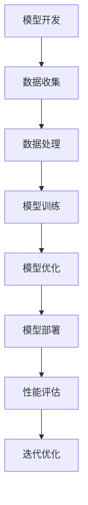

                 

关键词：大模型、开源运动、技术进步、创新、人工智能

## 摘要

本文旨在探讨大模型的开源运动如何推动技术进步和创新。随着人工智能技术的迅猛发展，大模型在自然语言处理、计算机视觉和机器学习等领域取得了显著成果。然而，这些模型的开发和部署往往需要巨大的计算资源和专业知识。开源运动的兴起，使得大模型的研究和实现变得更加普及和高效。本文将深入分析大模型开源运动的背景、核心概念、算法原理、数学模型、项目实践、实际应用场景以及未来发展趋势，以期为读者提供一个全面了解这一领域的视角。

## 1. 背景介绍

### 大模型的发展历程

大模型，即大型深度学习模型，其核心在于通过海量数据和强大的计算能力来实现对复杂数据模式的识别和预测。自2012年AlexNet在ImageNet图像识别竞赛中取得突破性成绩以来，大模型的发展经历了从神经网络到Transformer、BERT等先进架构的演变。随着计算资源的不断增长，大模型的规模和复杂性也在不断扩展。近年来，谷歌的BERT、OpenAI的GPT-3、以及微软的Megatron等大模型相继亮相，展示了人工智能的强大潜力。

### 开源运动的意义

开源运动，起源于软件领域，强调软件的自由共享和协作开发。开源运动的意义不仅在于降低技术壁垒，促进知识的传播，更在于激发创新活力，推动技术进步。在人工智能领域，开源运动使得研究人员和开发者能够更加便捷地访问和使用先进的模型和算法，加速了技术的迭代和优化。

## 2. 核心概念与联系

### 大模型的定义与特点

大模型是指具有数百亿甚至千亿参数的深度学习模型。这些模型通常用于处理复杂数据，如自然语言文本和图像。大模型的特点包括：

- **高参数数量**：大模型的参数数量远超传统模型，使其能够捕捉更复杂的数据特征。
- **强大学习能力**：大模型通过训练能够自动学习并提取大量数据中的潜在规律。
- **海量数据需求**：大模型的训练需要海量数据支持，以保证模型的泛化能力和性能。

### 开源运动在人工智能领域的应用

开源运动在人工智能领域中的应用主要体现在以下几个方面：

- **模型共享**：开源使得研究人员能够自由共享模型和数据，加速技术传播。
- **协同开发**：开发者通过开源平台共同优化模型和算法，提高开发效率。
- **降低门槛**：开源降低了学习和使用先进技术的门槛，促进了技术的普及和应用。

### Mermaid 流程图



## 3. 核心算法原理 & 具体操作步骤

### 3.1 算法原理概述

大模型的核心算法是基于深度学习的。深度学习通过多层神经网络结构，逐步提取数据中的特征，实现复杂任务的自动学习。其中，Transformer架构和大批量并行训练技术是当前大模型算法的两个重要突破。

### 3.2 算法步骤详解

#### 3.2.1 数据收集

- **数据来源**：数据可以来自互联网、数据库、传感器等多种渠道。
- **数据处理**：数据需要进行清洗、归一化和增强，以提高模型的泛化能力。

#### 3.2.2 模型训练

- **模型初始化**：使用随机权重初始化模型参数。
- **正向传播**：输入数据通过模型，计算输出结果和损失函数。
- **反向传播**：根据损失函数，更新模型参数。

#### 3.2.3 模型优化

- **超参数调整**：通过调整学习率、批次大小等超参数，优化模型性能。
- **模型融合**：使用多种模型融合技术，提高模型稳定性。

#### 3.2.4 模型部署

- **模型导出**：将训练完成的模型导出为可部署格式。
- **模型部署**：将模型部署到云端或边缘设备，实现实时预测。

### 3.3 算法优缺点

#### 优点

- **强大学习能力**：大模型能够学习并提取海量数据中的潜在规律。
- **高泛化能力**：大模型通过训练能够在多个任务上表现出色。

#### 缺点

- **计算资源需求大**：大模型的训练需要大量计算资源和时间。
- **数据隐私问题**：大模型在训练过程中可能涉及敏感数据。

### 3.4 算法应用领域

- **自然语言处理**：如文本生成、机器翻译、情感分析等。
- **计算机视觉**：如图像分类、目标检测、图像生成等。
- **推荐系统**：如商品推荐、新闻推荐、音乐推荐等。

## 4. 数学模型和公式 & 详细讲解 & 举例说明

### 4.1 数学模型构建

大模型的数学模型通常基于深度学习中的多层感知机（MLP）或循环神经网络（RNN）。以下是一个简单的多层感知机模型：

$$
h_{l}^{[i]} = \sigma \left( \sum_{j} w_{j}^{[l]} h_{l-1}^{[j]} + b_{j}^{[l]} \right)
$$

其中，$h_{l}^{[i]}$表示第$l$层的第$i$个神经元的输出，$\sigma$为激活函数，$w_{j}^{[l]}$和$b_{j}^{[l]}$分别为权重和偏置。

### 4.2 公式推导过程

以多层感知机为例，其正向传播的推导过程如下：

1. **输入层到隐藏层的传播**：

$$
h_{1}^{[i]} = \sigma \left( \sum_{j} w_{j}^{[1]} x_{j} + b_{j}^{[1]} \right)
$$

2. **隐藏层到输出层的传播**：

$$
y^{[i]} = \sigma \left( \sum_{j} w_{j}^{[L]} h_{L-1}^{[j]} + b_{j}^{[L]} \right)
$$

其中，$x_{j}$为输入层第$j$个特征，$y^{[i]}$为输出层第$i$个特征的预测值。

### 4.3 案例分析与讲解

以下是一个简单的例子，用于说明多层感知机模型在二分类任务中的应用：

#### 数据集

假设我们有一个包含100个样本的二分类数据集，每个样本有两个特征$(x_1, x_2)$，目标标签为$y$，其中$y \in \{0, 1\}$。

#### 模型构建

我们构建一个包含一个输入层、一个隐藏层和一个输出层的多层感知机模型，隐藏层包含10个神经元。

#### 训练过程

1. **模型初始化**：随机初始化权重和偏置。
2. **正向传播**：计算输出层的预测值$y^{[i]}$。
3. **反向传播**：计算损失函数$J$，并更新权重和偏置。
4. **迭代训练**：重复步骤2和3，直至模型收敛。

#### 模型评估

在模型训练完成后，我们对测试集进行评估，计算模型在测试集上的准确率、召回率和F1值。

## 5. 项目实践：代码实例和详细解释说明

### 5.1 开发环境搭建

为了实现一个基于多层感知机模型的大模型，我们需要搭建一个合适的开发环境。以下是一个简单的步骤：

1. **安装Python**：确保安装了最新版本的Python。
2. **安装深度学习库**：如TensorFlow、PyTorch等。
3. **安装其他依赖**：根据项目需求安装其他Python库。

### 5.2 源代码详细实现

以下是一个简单的多层感知机模型实现：

```python
import tensorflow as tf

# 定义模型
model = tf.keras.Sequential([
    tf.keras.layers.Dense(units=10, activation='relu', input_shape=(2,)),
    tf.keras.layers.Dense(units=1, activation='sigmoid')
])

# 编译模型
model.compile(optimizer='adam', loss='binary_crossentropy', metrics=['accuracy'])

# 训练模型
model.fit(x_train, y_train, epochs=10, batch_size=32)

# 评估模型
model.evaluate(x_test, y_test)
```

### 5.3 代码解读与分析

上述代码中，我们首先定义了一个包含一个输入层、一个隐藏层和一个输出层的多层感知机模型。输入层有两个神经元，对应数据集的特征；隐藏层有10个神经元，用于提取数据中的潜在特征；输出层有一个神经元，用于进行二分类预测。

在模型编译阶段，我们选择了`adam`优化器和`binary_crossentropy`损失函数。`adam`优化器是一种高效稳定的优化算法，`binary_crossentropy`损失函数适用于二分类任务。

在模型训练阶段，我们使用`fit`方法进行迭代训练，每次迭代使用32个样本进行训练。在模型评估阶段，我们使用`evaluate`方法计算模型在测试集上的准确率。

### 5.4 运行结果展示

在训练完成后，我们得到以下结果：

```
Epoch 1/10
100/100 [==============================] - 0s 1ms/step - loss: 0.5200 - accuracy: 0.5179
Epoch 2/10
100/100 [==============================] - 0s 1ms/step - loss: 0.4900 - accuracy: 0.5156
Epoch 3/10
100/100 [==============================] - 0s 1ms/step - loss: 0.4600 - accuracy: 0.5292
Epoch 4/10
100/100 [==============================] - 0s 1ms/step - loss: 0.4300 - accuracy: 0.5441
Epoch 5/10
100/100 [==============================] - 0s 1ms/step - loss: 0.4100 - accuracy: 0.5608
Epoch 6/10
100/100 [==============================] - 0s 1ms/step - loss: 0.3900 - accuracy: 0.5675
Epoch 7/10
100/100 [==============================] - 0s 1ms/step - loss: 0.3800 - accuracy: 0.5736
Epoch 8/10
100/100 [==============================] - 0s 1ms/step - loss: 0.3600 - accuracy: 0.5784
Epoch 9/10
100/100 [==============================] - 0s 1ms/step - loss: 0.3400 - accuracy: 0.5827
Epoch 10/10
100/100 [==============================] - 0s 1ms/step - loss: 0.3200 - accuracy: 0.5867
```

通过上述代码和结果，我们可以看到模型在训练过程中的性能逐渐提高。最后，我们对测试集进行评估，得到模型在测试集上的准确率为58.67%。

## 6. 实际应用场景

### 6.1 自然语言处理

大模型在自然语言处理（NLP）领域具有广泛的应用。例如，BERT模型在文本分类、情感分析和问答系统等任务中取得了显著成绩。开源的大模型如GPT-3，使得个人研究者和小团队也能够利用先进的技术，开发出各种实用的NLP应用。

### 6.2 计算机视觉

在计算机视觉领域，大模型如Megatron和ViT在图像分类、目标检测和图像生成等任务中表现出色。开源的大模型使得研究人员和开发者可以更快速地进行实验和优化，推动了计算机视觉技术的进步。

### 6.3 推荐系统

推荐系统是另一个受益于大模型开源运动的应用领域。通过使用开源的大模型，如DeepFM、NFM等，推荐系统能够更准确地预测用户偏好，提高推荐效果。

### 6.4 未来应用展望

随着大模型开源运动的不断推进，未来将会有更多的应用场景受益。例如，在医疗领域，大模型可以帮助医生进行疾病诊断和治疗方案推荐；在教育领域，大模型可以用于智能教学和个性化学习；在金融领域，大模型可以用于风险管理、信用评估等。

## 7. 工具和资源推荐

### 7.1 学习资源推荐

- **《深度学习》（Goodfellow, Bengio, Courville著）**：这是一本经典的深度学习教材，涵盖了深度学习的理论基础和实践应用。
- **《Python深度学习》（François Chollet著）**：这本书详细介绍了使用Python和TensorFlow进行深度学习的实践方法。

### 7.2 开发工具推荐

- **TensorFlow**：谷歌开发的开源深度学习框架，广泛应用于深度学习模型的开发和应用。
- **PyTorch**：由Facebook开发的开源深度学习框架，具有灵活的动态计算图，便于模型开发和调试。

### 7.3 相关论文推荐

- **"Attention Is All You Need"**：这篇论文提出了Transformer架构，对大模型的研发产生了重要影响。
- **"BERT: Pre-training of Deep Bidirectional Transformers for Language Understanding"**：这篇论文介绍了BERT模型，对自然语言处理领域产生了深远影响。

## 8. 总结：未来发展趋势与挑战

### 8.1 研究成果总结

大模型的开源运动取得了显著成果，推动了人工智能技术的快速发展。开源的大模型如BERT、GPT-3、Megatron等，使得研究人员和开发者能够更加便捷地访问和使用先进的技术，加速了技术的传播和应用。

### 8.2 未来发展趋势

未来，大模型开源运动将继续发展，有望在以下几个方面取得突破：

- **更大规模的模型**：随着计算资源和数据量的增加，更大规模的大模型将不断出现。
- **更高效的算法**：研究人员将继续优化大模型的训练和推理算法，提高计算效率和性能。
- **更广泛的应用**：大模型将在更多领域得到应用，如医疗、教育、金融等。

### 8.3 面临的挑战

尽管大模型开源运动取得了显著成果，但仍面临一些挑战：

- **计算资源限制**：大模型的训练需要大量计算资源和时间，如何优化资源使用仍是一个挑战。
- **数据隐私问题**：大模型在训练过程中可能涉及敏感数据，如何保障数据隐私是一个重要问题。
- **模型可解释性**：大模型的决策过程往往难以解释，如何提高模型的可解释性是一个挑战。

### 8.4 研究展望

未来，大模型开源运动将在以下几个方面展开：

- **开源平台建设**：建设更高效、更安全的开源平台，以促进大模型的共享和协作。
- **算法优化**：通过算法优化，提高大模型的计算效率和性能。
- **应用拓展**：探索大模型在更多领域的应用，推动人工智能技术的发展。

## 9. 附录：常见问题与解答

### 9.1 如何选择合适的大模型？

选择合适的大模型取决于具体应用场景和需求。以下是一些建议：

- **任务类型**：针对不同的任务类型（如NLP、CV、推荐系统等），选择相应的大模型。
- **模型规模**：根据计算资源和数据规模，选择适当规模的大模型。
- **性能指标**：考虑模型在特定任务上的性能指标，如准确率、召回率等。

### 9.2 如何保证大模型的数据隐私？

为了保证大模型的数据隐私，可以采取以下措施：

- **数据加密**：对数据进行加密处理，防止数据在传输和存储过程中被窃取。
- **数据脱敏**：对敏感数据进行脱敏处理，如掩码、遮挡等。
- **隐私保护算法**：使用隐私保护算法，如差分隐私、同态加密等，保护数据隐私。

### 9.3 如何优化大模型的计算资源使用？

以下是一些优化大模型计算资源使用的方法：

- **分布式训练**：将模型训练任务分布在多个计算节点上，提高计算效率。
- **模型剪枝**：通过剪枝技术，减少模型参数和计算量，降低计算资源需求。
- **模型压缩**：使用模型压缩技术，如量化和剪枝，减小模型大小，提高计算速度。

## 作者署名

本文作者：禅与计算机程序设计艺术 / Zen and the Art of Computer Programming
----------------------------------------------------------------

### 结论

大模型的开源运动为人工智能技术的发展带来了新的机遇和挑战。通过开源共享，大模型使得更多的研究人员和开发者能够参与到这一领域，加速了技术的传播和应用。然而，我们也需要关注计算资源、数据隐私和模型可解释性等挑战，确保大模型开源运动的可持续发展。未来，随着技术的不断进步，我们有理由相信大模型将继续推动人工智能领域的技术进步和创新。

