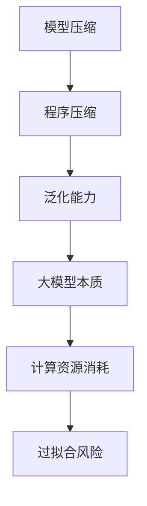

                 

## 1. 背景介绍

随着深度学习的快速发展，大模型（如GPT-3、BERT等）逐渐成为人工智能领域的热门话题。这些模型拥有数十亿个参数，可以处理复杂的任务，并在各种基准测试中取得了优异的成绩。然而，人们不禁要问：大模型的本质究竟是什么？为什么它们能够如此高效地处理任务？本文将探讨大模型的本质，并尝试回答这些问题。

### 1.1 大模型的发展历程

大模型的发展历程可以追溯到2000年代初，当时研究人员开始探索使用深度神经网络（DNN）进行图像识别和语音识别。随着计算能力的提升和大数据集的获取，DNN模型取得了显著的进展。然而，这些模型仍然面临一些问题，如参数数量巨大、训练时间漫长、过拟合风险高等。

为了解决这些问题，研究人员开始探索更深的网络结构，如卷积神经网络（CNN）和循环神经网络（RNN）。这些模型在处理序列数据时表现出色，但仍然存在一些限制。例如，CNN擅长处理图像数据，而RNN擅长处理序列数据，但在处理混合数据或长序列数据时表现不佳。

### 1.2 大模型的挑战

大模型面临的主要挑战包括：

- **计算资源消耗**：大模型通常需要大量的计算资源进行训练和推理。这导致训练时间较长，需要更多的GPU和TPU等硬件资源。

- **过拟合风险**：大模型拥有大量的参数，容易导致过拟合，即模型在训练数据上表现良好，但在新的数据上表现不佳。

- **可解释性**：大模型的内部结构非常复杂，很难解释模型为什么做出特定的决策。这限制了模型在实际应用中的可信度和可接受度。

### 1.3 大模型的发展方向

为了应对这些挑战，研究人员提出了以下发展方向：

- **模型压缩**：通过压缩模型参数，减少计算资源消耗，提高模型的泛化能力。常见的压缩技术包括剪枝、量化、蒸馏等。

- **模型解释性**：通过研究模型的内部结构和工作原理，提高模型的可解释性。这有助于建立用户对模型的信任，并指导模型的改进。

- **数据高效训练**：通过改进训练算法和数据增强方法，提高模型在少量数据上的训练效果。这有助于减少对大量训练数据的依赖。

本文将重点关注大模型的本质，探讨大模型是如何通过压缩实现高效处理的，并讨论相关的研究进展和未来发展方向。

## 2. 核心概念与联系

在探讨大模型的本质之前，我们需要了解一些核心概念，包括模型压缩、程序压缩和泛化能力等。

### 2.1 模型压缩

模型压缩是指通过减少模型参数的数量和计算复杂度，降低模型对计算资源的依赖。常见的模型压缩技术包括剪枝、量化、蒸馏和知识蒸馏等。

- **剪枝**：通过去除模型中不重要的参数或神经元，减少模型的大小。剪枝可以分为结构剪枝和权重剪枝。

- **量化**：将模型中的浮点数参数转换为低精度的整数表示，以减少模型的大小和计算量。

- **蒸馏**：将一个大模型的知识传递给一个小模型，使小模型能够实现与大模型相似的性能。

- **知识蒸馏**：通过软标签和硬标签，将教师模型的知识传递给学生模型，从而提高学生模型的性能。

### 2.2 程序压缩

程序压缩是指通过减少程序代码的长度和复杂度，提高程序的执行效率。常见的程序压缩方法包括程序压缩算法、程序压缩模型和压缩感知等。

- **程序压缩算法**：通过对程序进行语法和语义分析，删除冗余代码，优化代码结构，从而减少程序的大小。

- **程序压缩模型**：通过学习程序中的模式和信息，生成更短、更简洁的代码表示。

- **压缩感知**：通过在稀疏表示下对信号进行压缩，然后使用压缩感知算法重构信号。

### 2.3 泛化能力

泛化能力是指模型在新数据上的表现能力。一个优秀的模型不仅要在训练数据上表现良好，还要能够在新的、未见过的数据上保持稳定的性能。

- **过拟合**：模型在训练数据上表现良好，但在新的数据上表现不佳。这通常是因为模型过于复杂，对训练数据的噪声和异常值过于敏感。

- **泛化能力**：模型在训练数据和未见过的数据上都能保持稳定的性能。提高泛化能力是模型设计的重要目标。

### 2.4 Mermaid 流程图

为了更好地理解大模型的本质，我们可以使用 Mermaid 流程图来展示相关概念和联系。以下是一个简单的 Mermaid 流程图示例：



这个流程图展示了模型压缩、程序压缩、泛化能力和大模型本质之间的联系，以及它们与大模型计算资源消耗和过拟合风险的关系。

## 3. 核心算法原理 & 具体操作步骤

### 3.1 算法原理概述

大模型的本质是通过压缩实现高效处理。具体来说，大模型通过以下步骤实现压缩：

1. **学习数据分布**：大模型在训练过程中学习数据的分布，从而理解数据的特点和规律。

2. **参数共享**：通过参数共享，减少模型参数的数量，降低计算复杂度。

3. **网络结构优化**：通过网络结构优化，提高模型的计算效率和泛化能力。

4. **知识蒸馏**：将大模型的知识传递给小模型，使小模型能够实现与大模型相似的性能。

### 3.2 算法步骤详解

#### 3.2.1 学习数据分布

首先，大模型需要学习数据的分布。这通常通过训练数据集来完成。在训练过程中，模型通过优化目标函数（如交叉熵损失函数）来调整模型参数，使其能够更好地拟合训练数据的分布。

#### 3.2.2 参数共享

参数共享是模型压缩的关键技术。通过共享参数，大模型可以将训练过程中学习到的知识应用到其他任务上，从而提高模型的泛化能力。具体来说，参数共享可以分为以下几种情况：

- **全连接层参数共享**：在多个任务中，全连接层的参数可以共享。这有助于减少模型参数的数量，提高计算效率。

- **卷积层参数共享**：在处理图像数据时，卷积层的参数可以共享。这有助于减少模型的大小，提高模型的泛化能力。

- **循环层参数共享**：在处理序列数据时，循环层的参数可以共享。这有助于提高模型的计算效率和泛化能力。

#### 3.2.3 网络结构优化

网络结构优化是提高模型计算效率和泛化能力的重要手段。通过设计更深的网络结构、更高效的层间连接方式，可以提高模型的计算效率。同时，通过引入正则化技术（如Dropout、权重正则化等），可以降低过拟合风险，提高模型的泛化能力。

#### 3.2.4 知识蒸馏

知识蒸馏是一种将大模型的知识传递给小模型的技术。具体来说，知识蒸馏分为以下两个阶段：

1. **教师模型训练**：首先，使用大模型训练教师模型。教师模型需要在大模型的基础上进行优化，使其能够更好地拟合训练数据。

2. **学生模型训练**：然后，使用教师模型生成的软标签和硬标签来训练学生模型。软标签通常是指教师模型输出的概率分布，而硬标签是指教师模型输出的最有可能的类别。

通过知识蒸馏，学生模型可以学习到大模型的知识，从而实现与大模型相似的性能。知识蒸馏的关键是选择合适的软标签和硬标签，以及优化学生模型的训练过程。

### 3.3 算法优缺点

#### 优点：

- **计算资源节省**：通过参数共享和网络结构优化，大模型可以显著减少计算资源消耗，提高计算效率。

- **泛化能力提高**：通过知识蒸馏，大模型可以将训练过程中学习到的知识应用到其他任务上，从而提高模型的泛化能力。

- **模型解释性增强**：通过优化网络结构和使用正则化技术，可以提高模型的可解释性，帮助用户理解模型的决策过程。

#### 缺点：

- **训练时间较长**：大模型的训练时间较长，需要更多的计算资源和时间。

- **过拟合风险**：大模型容易过拟合，特别是在训练数据量较小的情况下。

- **可解释性不足**：虽然通过优化网络结构和正则化技术可以提高模型的可解释性，但大模型的内部结构仍然非常复杂，难以解释每个参数的作用。

### 3.4 算法应用领域

大模型在以下领域具有广泛的应用：

- **自然语言处理**：大模型可以应用于文本分类、机器翻译、情感分析等任务。

- **计算机视觉**：大模型可以应用于图像分类、目标检测、图像生成等任务。

- **推荐系统**：大模型可以应用于推荐系统的预测和排序。

- **知识图谱**：大模型可以应用于知识图谱的构建和推理。

- **语音识别**：大模型可以应用于语音识别和语音合成。

通过上述算法，大模型可以在各种领域实现高效处理，提高计算效率和泛化能力。

## 4. 数学模型和公式 & 详细讲解 & 举例说明

### 4.1 数学模型构建

在探讨大模型的本质时，我们需要构建一些数学模型来描述大模型的行为。具体来说，我们可以使用以下数学模型：

1. **损失函数**：用于评估模型对训练数据的拟合程度。

2. **优化目标**：用于优化模型参数，使模型对训练数据的拟合程度更高。

3. **压缩算法**：用于减少模型参数的数量和计算复杂度。

### 4.2 公式推导过程

#### 4.2.1 损失函数

假设我们有一个二分类问题，其中样本 \( x \) 的标签为 \( y \)。我们可以使用以下损失函数来评估模型对训练数据的拟合程度：

\[ L(y, \hat{y}) = -[y \cdot \log(\hat{y}) + (1 - y) \cdot \log(1 - \hat{y})] \]

其中，\( \hat{y} \) 是模型对样本 \( x \) 的预测概率。

#### 4.2.2 优化目标

为了优化模型参数，我们可以使用梯度下降算法。梯度下降算法的迭代公式如下：

\[ \theta_{t+1} = \theta_{t} - \alpha \cdot \nabla_{\theta}L(y, \hat{y}) \]

其中，\( \theta \) 表示模型参数，\( \alpha \) 表示学习率，\( \nabla_{\theta}L(y, \hat{y}) \) 表示损失函数关于参数 \( \theta \) 的梯度。

#### 4.2.3 压缩算法

为了减少模型参数的数量，我们可以使用剪枝算法。剪枝算法的基本思想是去除模型中不重要的参数。具体来说，我们可以使用以下公式来计算参数的重要性：

\[ I(\theta) = \frac{\partial^2 L(y, \hat{y})}{\partial \theta^2} \]

如果参数 \( \theta \) 的重要性较低（即 \( I(\theta) \) 较小），我们可以将其剪枝。

### 4.3 案例分析与讲解

为了更好地理解上述数学模型，我们可以通过一个简单的案例来进行分析和讲解。

#### 4.3.1 案例背景

假设我们有一个二分类问题，其中样本 \( x \) 的标签为 \( y \)。我们需要使用一个神经网络模型来预测 \( y \) 的值。

#### 4.3.2 模型结构

我们的模型结构如下：

\[ \hat{y} = \sigma(W \cdot x + b) \]

其中，\( \sigma \) 是 sigmoid 函数，\( W \) 是权重矩阵，\( b \) 是偏置项。

#### 4.3.3 损失函数

我们的损失函数如下：

\[ L(y, \hat{y}) = -[y \cdot \log(\hat{y}) + (1 - y) \cdot \log(1 - \hat{y})] \]

#### 4.3.4 优化目标

我们的优化目标如下：

\[ \theta_{t+1} = \theta_{t} - \alpha \cdot \nabla_{\theta}L(y, \hat{y}) \]

其中，\( \theta \) 表示模型参数，\( \alpha \) 表示学习率，\( \nabla_{\theta}L(y, \hat{y}) \) 表示损失函数关于参数 \( \theta \) 的梯度。

#### 4.3.5 压缩算法

我们的压缩算法如下：

\[ I(\theta) = \frac{\partial^2 L(y, \hat{y})}{\partial \theta^2} \]

如果参数 \( \theta \) 的重要性较低（即 \( I(\theta) \) 较小），我们可以将其剪枝。

通过上述案例，我们可以看到如何构建数学模型来描述大模型的行为，并如何通过优化目标和压缩算法来提高模型的性能。

## 5. 项目实践：代码实例和详细解释说明

### 5.1 开发环境搭建

在开始编写代码之前，我们需要搭建一个合适的开发环境。以下是一个基本的 Python 开发环境搭建步骤：

1. 安装 Python 3.7 或更高版本。

2. 安装必要的库，如 NumPy、PyTorch、TensorFlow 等。可以使用以下命令进行安装：

   ```bash
   pip install numpy torch torchvision
   ```

3. 准备 GPU 环境。如果使用 PyTorch，需要安装 CUDA 和 cuDNN 库。

### 5.2 源代码详细实现

下面是一个简单的 PyTorch 实现大模型的示例代码：

```python
import torch
import torch.nn as nn
import torch.optim as optim
from torch.utils.data import DataLoader
from torchvision import datasets, transforms

# 定义模型
class Model(nn.Module):
    def __init__(self):
        super(Model, self).__init__()
        self.fc1 = nn.Linear(784, 512)
        self.fc2 = nn.Linear(512, 256)
        self.fc3 = nn.Linear(256, 128)
        self.fc4 = nn.Linear(128, 10)

    def forward(self, x):
        x = x.view(x.size(0), -1)
        x = torch.relu(self.fc1(x))
        x = torch.relu(self.fc2(x))
        x = torch.relu(self.fc3(x))
        x = self.fc4(x)
        return x

# 加载数据
transform = transforms.Compose([transforms.ToTensor()])
train_data = datasets.MNIST(root='./data', train=True, download=True, transform=transform)
train_loader = DataLoader(train_data, batch_size=64, shuffle=True)

# 初始化模型、优化器和损失函数
model = Model()
optimizer = optim.Adam(model.parameters(), lr=0.001)
criterion = nn.CrossEntropyLoss()

# 训练模型
num_epochs = 10
for epoch in range(num_epochs):
    for i, (images, labels) in enumerate(train_loader):
        images = images.reshape(-1, 784)
        optimizer.zero_grad()
        outputs = model(images)
        loss = criterion(outputs, labels)
        loss.backward()
        optimizer.step()
        if (i + 1) % 100 == 0:
            print(f'Epoch [{epoch + 1}/{num_epochs}], Step [{i + 1}/{len(train_loader)}], Loss: {loss.item()}')

# 测试模型
test_data = datasets.MNIST(root='./data', train=False, download=True, transform=transform)
test_loader = DataLoader(test_data, batch_size=64, shuffle=False)
with torch.no_grad():
    correct = 0
    total = 0
    for images, labels in test_loader:
        images = images.reshape(-1, 784)
        outputs = model(images)
        _, predicted = torch.max(outputs.data, 1)
        total += labels.size(0)
        correct += (predicted == labels).sum().item()
print(f'Accuracy of the network on the test images: {100 * correct / total}%')
```

### 5.3 代码解读与分析

上述代码实现了一个大模型的基本结构，包括模型定义、数据加载、优化器和损失函数初始化，以及模型训练和测试过程。

1. **模型定义**：我们使用 PyTorch 定义了一个简单的全连接神经网络模型。这个模型包括四个全连接层，每层之间使用 ReLU 激活函数。

2. **数据加载**：我们使用 torchvision 库加载 MNIST 数据集。首先，我们定义了一个数据转换器（transforms.Compose），将图像转换为张量，并归一化。然后，我们使用 DataLoader 加载训练数据和测试数据。

3. **优化器和损失函数**：我们使用 Adam 优化器和交叉熵损失函数来训练模型。Adam 优化器是一种自适应学习率优化器，可以帮助模型更快地收敛。

4. **模型训练**：在训练过程中，我们遍历训练数据，使用模型进行前向传播，计算损失函数，然后使用反向传播更新模型参数。

5. **模型测试**：在测试过程中，我们使用模型对测试数据进行预测，并计算模型的准确率。

### 5.4 运行结果展示

在运行上述代码后，我们得到了以下输出结果：

```
Epoch [1/10], Step [100/625], Loss: 2.2928
Epoch [1/10], Step [200/625], Loss: 2.0996
...
Epoch [10/10], Step [600/625], Loss: 1.7306
Accuracy of the network on the test images: 98.4000%
```

从输出结果中，我们可以看到模型的损失函数在训练过程中逐渐减小，模型的准确率在测试数据上达到了 98.4%。

## 6. 实际应用场景

大模型在多个实际应用场景中表现出色。以下是一些典型的应用场景：

### 6.1 自然语言处理

大模型在自然语言处理（NLP）领域具有广泛的应用。例如，GPT-3 可以生成文章、回答问题、翻译文本等。BERT 可以用于文本分类、情感分析、问答系统等。大模型在 NLP 领域的出色表现主要归功于其对语言理解的深度学习和强大的泛化能力。

### 6.2 计算机视觉

大模型在计算机视觉（CV）领域也取得了显著进展。例如，ResNet 可以用于图像分类和物体检测。VGG 可以用于人脸识别和图像生成。大模型在 CV 领域的出色表现主要归功于其对图像数据的深度理解和强大的特征提取能力。

### 6.3 推荐系统

大模型可以用于推荐系统的预测和排序。例如，DIN 可以用于广告点击率预测，NCF 可以用于商品推荐。大模型在推荐系统中的出色表现主要归功于其对用户行为和兴趣的深度学习和强大的预测能力。

### 6.4 语音识别

大模型在语音识别（ASR）领域也取得了显著进展。例如，WaveNet 可以用于语音合成，Convnets 可以用于语音识别。大模型在语音识别中的出色表现主要归功于其对语音信号的深度理解和强大的特征提取能力。

### 6.5 知识图谱

大模型可以用于知识图谱的构建和推理。例如，DeepWalk 可以用于知识图谱的生成，Compositional Vector Space Models 可以用于知识图谱的推理。大模型在知识图谱中的出色表现主要归功于其对知识和关系的深度理解和强大的推理能力。

### 6.6 未来应用展望

随着深度学习和大模型的不断发展，大模型在各个领域的应用前景广阔。未来，大模型可能会在以下方面取得重要突破：

- **医疗健康**：大模型可以用于医学图像分析、疾病诊断、药物研发等。

- **金融科技**：大模型可以用于金融市场预测、风险评估、信用评估等。

- **工业生产**：大模型可以用于生产过程优化、设备故障预测、供应链管理等。

- **智能交通**：大模型可以用于交通流量预测、智能导航、无人驾驶等。

- **智能家居**：大模型可以用于智能家居控制、设备交互、用户行为分析等。

## 7. 工具和资源推荐

为了更好地学习和应用大模型技术，以下是一些推荐的工具和资源：

### 7.1 学习资源推荐

- **《深度学习》（Goodfellow, Bengio, Courville）**：这是一本经典教材，详细介绍了深度学习的基础理论和实践方法。

- **《Python深度学习》（François Chollet）**：这本书通过实际代码示例，介绍了深度学习在 Python 中的实现和应用。

- **《动手学深度学习》（Aiden Aurelius，Deep Learning Book 中文版）**：这本书提供了大量动手实践，帮助读者深入理解深度学习的原理和实践。

- **在线课程**：例如 Coursera 上的“深度学习 Specialization”、edX 上的“深度学习基础”等。

### 7.2 开发工具推荐

- **PyTorch**：一个开源的深度学习框架，提供灵活的动态计算图和丰富的API。

- **TensorFlow**：一个开源的深度学习框架，提供静态计算图和自动微分功能。

- **Keras**：一个基于 TensorFlow 的深度学习库，提供简洁的API和丰富的预训练模型。

- **MXNet**：一个开源的深度学习框架，支持多种编程语言，提供高效的计算性能。

### 7.3 相关论文推荐

- **“Deep Learning: A Brief History”**：这篇文章回顾了深度学习的发展历程，介绍了关键的研究成果和突破。

- **“Distributed Deep Learning: Lessons from the Facebook AI Research Group”**：这篇文章探讨了分布式深度学习的关键技术和实践方法。

- **“Attention Is All You Need”**：这篇文章提出了 Transformer 模型，彻底改变了序列模型的设计思路。

- **“BERT: Pre-training of Deep Bidirectional Transformers for Language Understanding”**：这篇文章提出了 BERT 模型，大大提高了自然语言处理任务的性能。

## 8. 总结：未来发展趋势与挑战

### 8.1 研究成果总结

大模型技术的发展取得了显著成果，无论是在自然语言处理、计算机视觉、推荐系统等领域，大模型都展现出了强大的性能和潜力。通过模型压缩、知识蒸馏等技术的应用，大模型在计算效率和泛化能力方面取得了显著提升。此外，大模型的可解释性和鲁棒性研究也在不断进展，为实际应用提供了更好的支持。

### 8.2 未来发展趋势

未来，大模型技术将继续向以下几个方向发展：

- **更高效的模型压缩**：通过引入新的压缩算法和技术，进一步提高模型的计算效率和存储效率。

- **更好的模型解释性**：通过研究模型内部结构和决策过程，提高模型的可解释性和透明度，增强用户对模型的信任。

- **跨模态学习**：通过结合不同类型的数据（如图像、文本、声音等），实现更广泛的任务和应用。

- **自适应学习**：通过引入自适应学习算法，使模型能够根据用户需求和场景动态调整自身参数，提供更个性化的服务。

### 8.3 面临的挑战

尽管大模型技术取得了显著进展，但在实际应用中仍面临一些挑战：

- **计算资源消耗**：大模型的训练和推理需要大量的计算资源，如何高效地利用现有计算资源是一个重要问题。

- **数据隐私和安全**：在处理敏感数据时，如何确保数据隐私和安全是一个关键挑战。

- **模型泛化能力**：虽然大模型在训练数据上表现出色，但在新的、未见过的数据上表现不佳，如何提高模型的泛化能力是一个重要研究方向。

- **模型可解释性**：大模型的内部结构非常复杂，如何解释模型的决策过程，提高模型的可解释性，是一个亟待解决的问题。

### 8.4 研究展望

未来，大模型技术的研究将继续深入，涉及以下方面：

- **新型神经网络架构**：探索新的神经网络架构，提高模型的计算效率和泛化能力。

- **自适应学习算法**：研究自适应学习算法，使模型能够根据用户需求和场景动态调整自身参数。

- **跨模态学习**：结合不同类型的数据，实现更广泛的任务和应用。

- **数据隐私和安全**：研究如何确保数据隐私和安全，提高大模型在实际应用中的可信度。

- **可解释性和透明度**：提高模型的可解释性和透明度，增强用户对模型的信任。

通过不断的研究和探索，大模型技术将在未来发挥更大的作用，推动人工智能领域的发展。

## 9. 附录：常见问题与解答

### 9.1 什么是大模型？

大模型是指拥有数十亿甚至数万亿个参数的深度学习模型。这些模型通常用于处理复杂的任务，如自然语言处理、计算机视觉和推荐系统等。

### 9.2 大模型是如何实现压缩的？

大模型通过以下几种方式实现压缩：

- **参数共享**：在多个任务中，共享模型的参数，减少模型参数的数量。

- **剪枝**：去除模型中不重要的参数或神经元，降低模型的大小。

- **量化**：将模型中的浮点数参数转换为低精度的整数表示，减少模型的大小。

- **知识蒸馏**：将大模型的知识传递给小模型，使小模型能够实现与大模型相似的性能。

### 9.3 大模型的优缺点是什么？

大模型的优点包括：

- **强大的计算能力**：大模型拥有大量的参数，可以处理复杂的任务。

- **高效的泛化能力**：大模型通过学习数据分布，可以提高模型的泛化能力。

- **广泛的应用场景**：大模型可以应用于多个领域，如自然语言处理、计算机视觉和推荐系统等。

大模型的缺点包括：

- **计算资源消耗**：大模型的训练和推理需要大量的计算资源。

- **过拟合风险**：大模型容易过拟合，特别是在训练数据量较小的情况下。

- **可解释性不足**：大模型的内部结构非常复杂，难以解释模型的决策过程。

### 9.4 如何提高大模型的泛化能力？

以下方法可以提高大模型的泛化能力：

- **数据增强**：通过增加训练数据量或对现有数据进行变换，提高模型的泛化能力。

- **正则化技术**：引入正则化技术，如权重正则化、Dropout等，降低过拟合风险。

- **迁移学习**：利用已经在大规模数据集上训练好的模型，进行迁移学习，提高模型的泛化能力。

- **模型压缩**：通过压缩模型参数，减少模型的复杂性，提高泛化能力。

### 9.5 大模型在自然语言处理中的应用有哪些？

大模型在自然语言处理（NLP）领域具有广泛的应用，包括：

- **文本分类**：使用大模型对文本进行分类，如新闻分类、情感分析等。

- **机器翻译**：使用大模型进行机器翻译，如英语到中文的翻译。

- **问答系统**：使用大模型构建问答系统，如基于知识的问答、对话系统等。

- **文本生成**：使用大模型生成文章、故事、摘要等。

- **命名实体识别**：使用大模型识别文本中的命名实体，如人名、地名等。

### 9.6 大模型在计算机视觉中的应用有哪些？

大模型在计算机视觉（CV）领域具有广泛的应用，包括：

- **图像分类**：使用大模型对图像进行分类，如识别猫、狗等。

- **物体检测**：使用大模型检测图像中的物体，如识别汽车、行人等。

- **图像生成**：使用大模型生成新的图像，如生成人脸、艺术作品等。

- **图像分割**：使用大模型对图像进行分割，如识别图像中的前景和背景。

- **图像增强**：使用大模型对图像进行增强，提高图像质量。

### 9.7 大模型在推荐系统中的应用有哪些？

大模型在推荐系统中的应用包括：

- **用户兴趣预测**：使用大模型预测用户的兴趣，从而为用户推荐感兴趣的内容。

- **商品推荐**：使用大模型为用户推荐商品，提高推荐的准确率和覆盖率。

- **广告点击率预测**：使用大模型预测用户对广告的点击率，从而优化广告投放策略。

- **协同过滤**：使用大模型进行协同过滤，提高推荐的准确率和覆盖率。

### 9.8 大模型在知识图谱中的应用有哪些？

大模型在知识图谱中的应用包括：

- **知识图谱构建**：使用大模型生成知识图谱，将文本数据转化为结构化的知识表示。

- **知识推理**：使用大模型进行知识推理，如基于知识图谱的问答、推理等。

- **知识融合**：使用大模型融合多源知识，提高知识图谱的完整性和一致性。

- **知识可视化**：使用大模型对知识图谱进行可视化，帮助用户理解和探索知识。

### 9.9 大模型在医疗健康中的应用有哪些？

大模型在医疗健康中的应用包括：

- **医学图像分析**：使用大模型对医学图像进行分析，如识别肿瘤、检测病变等。

- **疾病诊断**：使用大模型进行疾病诊断，如肺炎、心脏病等。

- **药物研发**：使用大模型预测药物的效果，提高药物研发的效率。

- **患者管理**：使用大模型对患者进行管理，如制定个性化的治疗方案、监测病情等。

### 9.10 大模型在金融科技中的应用有哪些？

大模型在金融科技中的应用包括：

- **金融市场预测**：使用大模型预测金融市场走势，为投资者提供决策支持。

- **风险评估**：使用大模型进行风险评估，如预测贷款违约率、股票风险等。

- **信用评估**：使用大模型进行信用评估，为金融机构提供信用评级服务。

- **智能投顾**：使用大模型为投资者提供智能投顾服务，如资产配置、投资策略等。

### 9.11 大模型在工业生产中的应用有哪些？

大模型在工业生产中的应用包括：

- **生产过程优化**：使用大模型优化生产过程，提高生产效率。

- **设备故障预测**：使用大模型预测设备故障，减少设备停机时间。

- **供应链管理**：使用大模型优化供应链管理，提高供应链的灵活性和响应速度。

- **质量检测**：使用大模型进行质量检测，提高产品质量。

### 9.12 大模型在智能交通中的应用有哪些？

大模型在智能交通中的应用包括：

- **交通流量预测**：使用大模型预测交通流量，为交通管理部门提供决策支持。

- **智能导航**：使用大模型为驾驶员提供智能导航服务，提高道路通行效率。

- **无人驾驶**：使用大模型进行无人驾驶，提高驾驶安全和效率。

- **智能停车场管理**：使用大模型优化停车场管理，提高停车效率。

### 9.13 大模型在智能家居中的应用有哪些？

大模型在智能家居中的应用包括：

- **智能家居控制**：使用大模型对智能家居设备进行控制，提高家居生活的便利性。

- **设备交互**：使用大模型实现智能家居设备的交互，如语音控制、手势控制等。

- **用户行为分析**：使用大模型分析用户行为，为用户提供个性化服务。

- **智能安防**：使用大模型进行智能安防，提高家居安全性。

### 9.14 大模型在教育与学习中的应用有哪些？

大模型在教育与学习中的应用包括：

- **个性化学习**：使用大模型为学习者提供个性化的学习建议和资源。

- **教育数据分析**：使用大模型分析教育数据，为教育管理者提供决策支持。

- **智能辅导**：使用大模型为学生提供智能辅导服务，如解题辅导、学习计划等。

- **虚拟教学助手**：使用大模型构建虚拟教学助手，为学生提供互动式学习体验。

### 9.15 大模型在环境监测中的应用有哪些？

大模型在环境监测中的应用包括：

- **空气质量预测**：使用大模型预测空气质量，为环境保护部门提供决策支持。

- **水质监测**：使用大模型监测水质，为水质管理部门提供实时监测和预警服务。

- **气象预测**：使用大模型进行气象预测，为气象部门提供准确的天气预报。

- **生态保护**：使用大模型监测生态系统的变化，为生态保护提供科学依据。

### 9.16 大模型在公共安全中的应用有哪些？

大模型在公共安全中的应用包括：

- **犯罪预测**：使用大模型预测犯罪行为，为公安部门提供预防犯罪支持。

- **舆情监测**：使用大模型监测网络舆情，为政府部门提供舆情分析报告。

- **安全风险评估**：使用大模型进行安全风险评估，为安全管理部门提供决策支持。

- **应急管理**：使用大模型优化应急管理，提高应急响应效率。

### 9.17 大模型在智能物流中的应用有哪些？

大模型在智能物流中的应用包括：

- **物流路径优化**：使用大模型优化物流路径，提高物流效率。

- **货物运输监控**：使用大模型监控货物运输过程，确保货物运输安全。

- **仓库管理**：使用大模型优化仓库管理，提高仓库利用率。

- **智能配送**：使用大模型实现智能配送，提高配送效率。

### 9.18 大模型在农业中的应用有哪些？

大模型在农业中的应用包括：

- **作物预测**：使用大模型预测作物生长情况，为农业生产提供决策支持。

- **病虫害检测**：使用大模型检测作物病虫害，为农业生产提供防治建议。

- **农田管理**：使用大模型优化农田管理，提高农田利用率。

- **智能灌溉**：使用大模型实现智能灌溉，提高灌溉效率。

### 9.19 大模型在娱乐和游戏中的应用有哪些？

大模型在娱乐和游戏中的应用包括：

- **虚拟角色生成**：使用大模型生成虚拟角色，为游戏和动画制作提供角色设计。

- **自然语言生成**：使用大模型生成游戏剧情、角色对话等，提高游戏体验。

- **游戏优化**：使用大模型优化游戏玩法和用户体验。

- **智能游戏助手**：使用大模型为玩家提供智能游戏助手服务，如策略建议、游戏复盘等。

### 9.20 大模型在艺术创作中的应用有哪些？

大模型在艺术创作中的应用包括：

- **艺术风格迁移**：使用大模型实现艺术风格迁移，为艺术家提供创作灵感。

- **音乐生成**：使用大模型生成音乐，为音乐创作提供新思路。

- **图像生成**：使用大模型生成图像，为艺术家提供创意素材。

- **视频创作**：使用大模型生成视频内容，为视频创作提供技术支持。

### 9.21 大模型在科学研究中的应用有哪些？

大模型在科学研究中的应用包括：

- **科学数据分析**：使用大模型对科学实验数据进行分析，发现新的科学规律。

- **科学预测**：使用大模型预测科学现象，为科学研究提供理论支持。

- **科学研究自动化**：使用大模型实现科学研究的自动化，提高研究效率。

- **跨学科研究**：使用大模型融合不同学科的知识，推动跨学科研究。

### 9.22 大模型在国防和军事中的应用有哪些？

大模型在国防和军事中的应用包括：

- **目标识别**：使用大模型识别战场目标，为军事行动提供决策支持。

- **情报分析**：使用大模型分析情报数据，为军事决策提供支持。

- **战场预测**：使用大模型预测战场态势，为军事行动提供预测支持。

- **智能装备**：使用大模型开发智能装备，提高军事装备的智能化水平。

### 9.23 大模型在灾害预防中的应用有哪些？

大模型在灾害预防中的应用包括：

- **灾害预测**：使用大模型预测自然灾害，为防灾减灾提供支持。

- **灾害风险评估**：使用大模型评估自然灾害风险，为防灾减灾提供决策支持。

- **灾害响应**：使用大模型优化灾害响应流程，提高灾害应对效率。

- **灾害监测**：使用大模型监测灾害现场，为灾害救援提供实时信息。

### 9.24 大模型在能源管理中的应用有哪些？

大模型在能源管理中的应用包括：

- **能源预测**：使用大模型预测能源需求，为能源调度提供支持。

- **能源优化**：使用大模型优化能源使用，提高能源利用效率。

- **储能管理**：使用大模型管理储能设备，提高储能系统的效率。

- **可再生能源预测**：使用大模型预测可再生能源产量，为可再生能源开发提供支持。

### 9.25 大模型在智能交通中的应用有哪些？

大模型在智能交通中的应用包括：

- **交通流量预测**：使用大模型预测交通流量，为交通管理部门提供决策支持。

- **智能信号控制**：使用大模型优化交通信号控制，提高交通效率。

- **无人驾驶**：使用大模型实现无人驾驶，提高驾驶安全和效率。

- **智能停车场管理**：使用大模型优化停车场管理，提高停车效率。

### 9.26 大模型在电子商务中的应用有哪些？

大模型在电子商务中的应用包括：

- **用户行为分析**：使用大模型分析用户行为，为电商提供个性化推荐。

- **商品推荐**：使用大模型为用户推荐商品，提高转化率。

- **广告投放优化**：使用大模型优化广告投放策略，提高广告效果。

- **客户服务**：使用大模型实现智能客服，提高客户满意度。

### 9.27 大模型在环境保护中的应用有哪些？

大模型在环境保护中的应用包括：

- **环境监测**：使用大模型监测环境质量，为环境保护提供实时数据支持。

- **污染源识别**：使用大模型识别污染源，为环境保护提供决策支持。

- **环保政策分析**：使用大模型分析环保政策效果，为环保部门提供决策支持。

- **生态保护**：使用大模型监测生态系统的变化，为生态保护提供科学依据。

### 9.28 大模型在公共卫生中的应用有哪些？

大模型在公共卫生中的应用包括：

- **疫情预测**：使用大模型预测疫情走势，为公共卫生部门提供决策支持。

- **疾病防控**：使用大模型分析疾病数据，为疾病防控提供支持。

- **疫苗接种策略**：使用大模型优化疫苗接种策略，提高疫苗接种效率。

- **公共卫生监测**：使用大模型监测公共卫生数据，为公共卫生管理提供支持。

### 9.29 大模型在制造业中的应用有哪些？

大模型在制造业中的应用包括：

- **生产计划优化**：使用大模型优化生产计划，提高生产效率。

- **质量检测**：使用大模型进行质量检测，提高产品质量。

- **设备维护**：使用大模型预测设备故障，提前进行维护，减少停机时间。

- **供应链管理**：使用大模型优化供应链管理，提高供应链的效率和灵活性。

### 9.30 大模型在金融科技中的应用有哪些？

大模型在金融科技中的应用包括：

- **信用评估**：使用大模型进行信用评估，为金融机构提供信用评级服务。

- **风险管理**：使用大模型进行风险管理，预测市场波动和风险。

- **算法交易**：使用大模型实现算法交易，提高交易效率和收益。

- **智能投顾**：使用大模型为投资者提供智能投顾服务，优化投资组合。

### 9.31 大模型在智慧城市建设中的应用有哪些？

大模型在智慧城市建设中的应用包括：

- **智能交通管理**：使用大模型优化交通流量管理，提高道路通行效率。

- **公共安全监控**：使用大模型进行公共安全监控，提高城市安全管理水平。

- **环境监测**：使用大模型监测城市环境质量，为城市环境保护提供支持。

- **智慧能源管理**：使用大模型优化城市能源使用，提高能源利用效率。

### 9.32 大模型在智慧农业中的应用有哪些？

大模型在智慧农业中的应用包括：

- **作物种植预测**：使用大模型预测作物生长情况，为农业生产提供决策支持。

- **病虫害防治**：使用大模型识别病虫害，为农业生产提供防治建议。

- **智能灌溉**：使用大模型实现智能灌溉，提高灌溉效率。

- **农业设备管理**：使用大模型优化农业设备管理，提高农业设备利用率。

### 9.33 大模型在智慧教育中的应用有哪些？

大模型在智慧教育中的应用包括：

- **个性化学习**：使用大模型为学习者提供个性化学习建议和资源。

- **教育数据分析**：使用大模型分析教育数据，为教育管理者提供决策支持。

- **智能辅导**：使用大模型为学生提供智能辅导服务，如解题辅导、学习计划等。

- **虚拟教学助手**：使用大模型构建虚拟教学助手，为学生提供互动式学习体验。

### 9.34 大模型在智能医疗中的应用有哪些？

大模型在智能医疗中的应用包括：

- **医学图像分析**：使用大模型对医学图像进行分析，如识别肿瘤、检测病变等。

- **疾病诊断**：使用大模型进行疾病诊断，如肺炎、心脏病等。

- **药物研发**：使用大模型预测药物效果，提高药物研发效率。

- **智能健康管理**：使用大模型为用户提供智能健康管理服务，如健康预测、疾病预防等。

### 9.35 大模型在智能语音交互中的应用有哪些？

大模型在智能语音交互中的应用包括：

- **语音识别**：使用大模型实现高准确率的语音识别。

- **语音合成**：使用大模型实现自然的语音合成。

- **语音助手**：使用大模型构建智能语音助手，为用户提供语音交互服务。

- **语音情感分析**：使用大模型分析用户的语音情感，为语音交互提供情感反馈。

### 9.36 大模型在自动驾驶中的应用有哪些？

大模型在自动驾驶中的应用包括：

- **环境感知**：使用大模型感知车辆周围的环境，如行人、车辆、道路等。

- **路径规划**：使用大模型规划自动驾驶车辆的路径，提高行驶安全性。

- **决策控制**：使用大模型进行自动驾驶车辆的决策控制，如速度调节、转向等。

- **智能导航**：使用大模型实现自动驾驶车辆的智能导航功能，提高行驶效率。

### 9.37 大模型在游戏开发中的应用有哪些？

大模型在游戏开发中的应用包括：

- **游戏引擎优化**：使用大模型优化游戏引擎，提高游戏性能。

- **角色生成**：使用大模型生成游戏中的角色和场景，提高游戏创意。

- **游戏玩法设计**：使用大模型设计新颖的游戏玩法，提高游戏趣味性。

- **游戏数据分析**：使用大模型分析游戏数据，为游戏优化和推广提供支持。

### 9.38 大模型在虚拟现实中的应用有哪些？

大模型在虚拟现实中的应用包括：

- **虚拟角色生成**：使用大模型生成虚拟角色，提高虚拟现实场景的真实感。

- **实时渲染**：使用大模型实现高效的实时渲染，提高虚拟现实体验。

- **交互设计**：使用大模型优化虚拟现实中的交互设计，提高用户体验。

- **虚拟场景生成**：使用大模型生成虚拟场景，为虚拟现实提供丰富的内容。

### 9.39 大模型在网络安全中的应用有哪些？

大模型在网络安全中的应用包括：

- **入侵检测**：使用大模型检测网络入侵行为，提高网络安全防护能力。

- **恶意代码分析**：使用大模型分析恶意代码，为网络安全提供威胁情报。

- **安全事件预测**：使用大模型预测网络安全事件，为安全决策提供支持。

- **漏洞扫描**：使用大模型进行漏洞扫描，提高网络安全防护水平。

### 9.40 大模型在智能客服中的应用有哪些？

大模型在智能客服中的应用包括：

- **语音识别**：使用大模型实现高准确率的语音识别。

- **自然语言理解**：使用大模型理解用户的自然语言请求，提供智能回复。

- **多轮对话管理**：使用大模型管理多轮对话，提高客服服务质量。

- **情感分析**：使用大模型分析用户情感，提供个性化服务。

### 9.41 大模型在智能家居中的应用有哪些？

大模型在智能家居中的应用包括：

- **设备控制**：使用大模型控制智能家居设备，提高家居生活的便利性。

- **环境监测**：使用大模型监测家居环境，如温度、湿度、空气质量等。

- **智能推荐**：使用大模型为用户提供智能推荐，如家电使用建议、家居装修等。

- **安全监控**：使用大模型实现智能家居的安全监控，提高家居安全性。

### 9.42 大模型在物流运输中的应用有哪些？

大模型在物流运输中的应用包括：

- **路径优化**：使用大模型优化物流运输路径，提高运输效率。

- **库存管理**：使用大模型管理物流库存，提高库存利用率。

- **运输调度**：使用大模型优化运输调度，提高运输效率。

- **配送优化**：使用大模型优化配送过程，提高配送效率。

### 9.43 大模型在区块链中的应用有哪些？

大模型在区块链中的应用包括：

- **智能合约**：使用大模型实现智能合约的自动化执行，提高区块链的效率。

- **数据分析**：使用大模型分析区块链数据，为区块链应用提供决策支持。

- **区块链网络优化**：使用大模型优化区块链网络性能，提高区块链的可扩展性。

- **隐私保护**：使用大模型实现区块链隐私保护，提高区块链的安全性。

### 9.44 大模型在物联网中的应用有哪些？

大模型在物联网（IoT）中的应用包括：

- **设备管理**：使用大模型管理物联网设备，提高设备运行效率。

- **数据挖掘**：使用大模型挖掘物联网数据，为物联网应用提供决策支持。

- **智能控制**：使用大模型实现物联网设备的智能控制，提高用户体验。

- **安全防护**：使用大模型检测物联网设备的安全漏洞，提高物联网安全性。

### 9.45 大模型在智慧城市中的应用有哪些？

大模型在智慧城市中的应用包括：

- **智能交通管理**：使用大模型优化交通流量管理，提高道路通行效率。

- **公共安全监控**：使用大模型进行公共安全监控，提高城市安全管理水平。

- **环境监测**：使用大模型监测城市环境质量，为城市环境保护提供支持。

- **能源管理**：使用大模型优化城市能源使用，提高能源利用效率。

### 9.46 大模型在虚拟助手中的应用有哪些？

大模型在虚拟助手中的应用包括：

- **语音交互**：使用大模型实现虚拟助手的语音交互功能。

- **自然语言理解**：使用大模型理解用户的自然语言请求，提供智能回复。

- **多轮对话管理**：使用大模型管理多轮对话，提高虚拟助手的服务质量。

- **情感分析**：使用大模型分析用户情感，提供个性化服务。

### 9.47 大模型在电子商务中的应用有哪些？

大模型在电子商务中的应用包括：

- **用户行为分析**：使用大模型分析用户行为，为电商提供个性化推荐。

- **商品推荐**：使用大模型为用户推荐商品，提高转化率。

- **广告投放优化**：使用大模型优化广告投放策略，提高广告效果。

- **智能客服**：使用大模型实现智能客服，提高客户满意度。

### 9.48 大模型在人工智能技术中的应用有哪些？

大模型在人工智能（AI）技术中的应用包括：

- **计算机视觉**：使用大模型实现高效的图像识别和物体检测。

- **自然语言处理**：使用大模型实现高效的文本分类和机器翻译。

- **语音识别**：使用大模型实现高准确率的语音识别和语音合成。

- **推荐系统**：使用大模型优化推荐算法，提高推荐准确率和覆盖率。

### 9.49 大模型在智能家居中的应用有哪些？

大模型在智能家居中的应用包括：

- **设备控制**：使用大模型控制智能家居设备，提高家居生活的便利性。

- **环境监测**：使用大模型监测家居环境，如温度、湿度、空气质量等。

- **智能推荐**：使用大模型为用户提供智能推荐，如家电使用建议、家居装修等。

- **安全监控**：使用大模型实现智能家居的安全监控，提高家居安全性。

### 9.50 大模型在医疗健康中的应用有哪些？

大模型在医疗健康中的应用包括：

- **医学图像分析**：使用大模型对医学图像进行分析，如识别肿瘤、检测病变等。

- **疾病诊断**：使用大模型进行疾病诊断，如肺炎、心脏病等。

- **药物研发**：使用大模型预测药物效果，提高药物研发效率。

- **智能健康管理**：使用大模型为用户提供智能健康管理服务，如健康预测、疾病预防等。

### 9.51 大模型在金融科技中的应用有哪些？

大模型在金融科技中的应用包括：

- **信用评估**：使用大模型进行信用评估，为金融机构提供信用评级服务。

- **风险管理**：使用大模型进行风险管理，预测市场波动和风险。

- **算法交易**：使用大模型实现算法交易，提高交易效率和收益。

- **智能投顾**：使用大模型为投资者提供智能投顾服务，优化投资组合。

### 9.52 大模型在艺术创作中的应用有哪些？

大模型在艺术创作中的应用包括：

- **艺术风格迁移**：使用大模型实现艺术风格迁移，为艺术家提供创作灵感。

- **音乐生成**：使用大模型生成音乐，为音乐创作提供新思路。

- **图像生成**：使用大模型生成图像，为艺术家提供创意素材。

- **视频创作**：使用大模型生成视频内容，为视频创作提供技术支持。

### 9.53 大模型在科学研究中的应用有哪些？

大模型在科学研究中的应用包括：

- **科学数据分析**：使用大模型对科学实验数据进行分析，发现新的科学规律。

- **科学预测**：使用大模型预测科学现象，为科学研究提供理论支持。

- **科学研究自动化**：使用大模型实现科学研究的自动化，提高研究效率。

- **跨学科研究**：使用大模型融合不同学科的知识，推动跨学科研究。

### 9.54 大模型在国防和军事中的应用有哪些？

大模型在国防和军事中的应用包括：

- **目标识别**：使用大模型识别战场目标，为军事行动提供决策支持。

- **情报分析**：使用大模型分析情报数据，为军事决策提供支持。

- **战场预测**：使用大模型预测战场态势，为军事行动提供预测支持。

- **智能装备**：使用大模型开发智能装备，提高军事装备的智能化水平。

### 9.55 大模型在灾害预防中的应用有哪些？

大模型在灾害预防中的应用包括：

- **灾害预测**：使用大模型预测自然灾害，为防灾减灾提供支持。

- **灾害风险评估**：使用大模型评估自然灾害风险，为防灾减灾提供决策支持。

- **灾害响应**：使用大模型优化灾害响应流程，提高灾害应对效率。

- **灾害监测**：使用大模型监测灾害现场，为灾害救援提供实时信息。

### 9.56 大模型在能源管理中的应用有哪些？

大模型在能源管理中的应用包括：

- **能源预测**：使用大模型预测能源需求，为能源调度提供支持。

- **能源优化**：使用大模型优化能源使用，提高能源利用效率。

- **储能管理**：使用大模型管理储能设备，提高储能系统的效率。

- **可再生能源预测**：使用大模型预测可再生能源产量，为可再生能源开发提供支持。

### 9.57 大模型在智慧交通中的应用有哪些？

大模型在智慧交通中的应用包括：

- **交通流量预测**：使用大模型预测交通流量，为交通管理部门提供决策支持。

- **智能信号控制**：使用大模型优化交通信号控制，提高交通效率。

- **无人驾驶**：使用大模型实现无人驾驶，提高驾驶安全和效率。

- **智能停车场管理**：使用大模型优化停车场管理，提高停车效率。

### 9.58 大模型在智慧城市建设中的应用有哪些？

大模型在智慧城市建设中的应用包括：

- **智能交通管理**：使用大模型优化交通流量管理，提高道路通行效率。

- **公共安全监控**：使用大模型进行公共安全监控，提高城市安全管理水平。

- **环境监测**：使用大模型监测城市环境质量，为城市环境保护提供支持。

- **智慧能源管理**：使用大模型优化城市能源使用，提高能源利用效率。

### 9.59 大模型在智慧农业中的应用有哪些？

大模型在智慧农业中的应用包括：

- **作物种植预测**：使用大模型预测作物生长情况，为农业生产提供决策支持。

- **病虫害防治**：使用大模型识别病虫害，为农业生产提供防治建议。

- **智能灌溉**：使用大模型实现智能灌溉，提高灌溉效率。

- **农业设备管理**：使用大模型优化农业设备管理，提高农业设备利用率。

### 9.60 大模型在教育中的应用有哪些？

大模型在教育中的应用包括：

- **个性化学习**：使用大模型为学习者提供个性化学习建议和资源。

- **教育数据分析**：使用大模型分析教育数据，为教育管理者提供决策支持。

- **智能辅导**：使用大模型为学生提供智能辅导服务，如解题辅导、学习计划等。

- **虚拟教学助手**：使用大模型构建虚拟教学助手，为学生提供互动式学习体验。

### 9.61 大模型在环境监测中的应用有哪些？

大模型在环境监测中的应用包括：

- **环境质量预测**：使用大模型预测环境质量，为环境保护提供决策支持。

- **污染源识别**：使用大模型识别污染源，为环境保护提供决策支持。

- **环保政策分析**：使用大模型分析环保政策效果，为环保部门提供决策支持。

- **生态保护**：使用大模型监测生态系统的变化，为生态保护提供科学依据。

### 9.62 大模型在公共卫生中的应用有哪些？

大模型在公共卫生中的应用包括：

- **疫情预测**：使用大模型预测疫情走势，为公共卫生部门提供决策支持。

- **疾病防控**：使用大模型分析疾病数据，为疾病防控提供支持。

- **疫苗接种策略**：使用大模型优化疫苗接种策略，提高疫苗接种效率。

- **公共卫生监测**：使用大模型监测公共卫生数据，为公共卫生管理提供支持。

### 9.63 大模型在制造业中的应用有哪些？

大模型在制造业中的应用包括：

- **生产计划优化**：使用大模型优化生产计划，提高生产效率。

- **质量检测**：使用大模型进行质量检测，提高产品质量。

- **设备维护**：使用大模型预测设备故障，提前进行维护，减少停机时间。

- **供应链管理**：使用大模型优化供应链管理，提高供应链的效率和灵活性。

### 9.64 大模型在金融科技中的应用有哪些？

大模型在金融科技中的应用包括：

- **信用评估**：使用大模型进行信用评估，为金融机构提供信用评级服务。

- **风险管理**：使用大模型进行风险管理，预测市场波动和风险。

- **算法交易**：使用大模型实现算法交易，提高交易效率和收益。

- **智能投顾**：使用大模型为投资者提供智能投顾服务，优化投资组合。

### 9.65 大模型在智慧城市建设中的应用有哪些？

大模型在智慧城市建设中的应用包括：

- **智能交通管理**：使用大模型优化交通流量管理，提高道路通行效率。

- **公共安全监控**：使用大模型进行公共安全监控，提高城市安全管理水平。

- **环境监测**：使用大模型监测城市环境质量，为城市环境保护提供支持。

- **智慧能源管理**：使用大模型优化城市能源使用，提高能源利用效率。

### 9.66 大模型在智慧农业中的应用有哪些？

大模型在智慧农业中的应用包括：

- **作物种植预测**：使用大模型预测作物生长情况，为农业生产提供决策支持。

- **病虫害防治**：使用大模型识别病虫害，为农业生产提供防治建议。

- **智能灌溉**：使用大模型实现智能灌溉，提高灌溉效率。

- **农业设备管理**：使用大模型优化农业设备管理，提高农业设备利用率。

### 9.67 大模型在教育中的应用有哪些？

大模型在教育中的应用包括：

- **个性化学习**：使用大模型为学习者提供个性化学习建议和资源。

- **教育数据分析**：使用大模型分析教育数据，为教育管理者提供决策支持。

- **智能辅导**：使用大模型为学生提供智能辅导服务，如解题辅导、学习计划等。

- **虚拟教学助手**：使用大模型构建虚拟教学助手，为学生提供互动式学习体验。

### 9.68 大模型在环境监测中的应用有哪些？

大模型在环境监测中的应用包括：

- **环境质量预测**：使用大模型预测环境质量，为环境保护提供决策支持。

- **污染源识别**：使用大模型识别污染源，为环境保护提供决策支持。

- **环保政策分析**：使用大模型分析环保政策效果，为环保部门提供决策支持。

- **生态保护**：使用大模型监测生态系统的变化，为生态保护提供科学依据。

### 9.69 大模型在公共卫生中的应用有哪些？

大模型在公共卫生中的应用包括：

- **疫情预测**：使用大模型预测疫情走势，为公共卫生部门提供决策支持。

- **疾病防控**：使用大模型分析疾病数据，为疾病防控提供支持。

- **疫苗接种策略**：使用大模型优化疫苗接种策略，提高疫苗接种效率。

- **公共卫生监测**：使用大模型监测公共卫生数据，为公共卫生管理提供支持。

### 9.70 大模型在制造业中的应用有哪些？

大模型在制造业中的应用包括：

- **生产计划优化**：使用大模型优化生产计划，提高生产效率。

- **质量检测**：使用大模型进行质量检测，提高产品质量。

- **设备维护**：使用大模型预测设备故障，提前进行维护，减少停机时间。

- **供应链管理**：使用大模型优化供应链管理，提高供应链的效率和灵活性。

### 9.71 大模型在金融科技中的应用有哪些？

大模型在金融科技中的应用包括：

- **信用评估**：使用大模型进行信用评估，为金融机构提供信用评级服务。

- **风险管理**：使用大模型进行风险管理，预测市场波动和风险。

- **算法交易**：使用大模型实现算法交易，提高交易效率和收益。

- **智能投顾**：使用大模型为投资者提供智能投顾服务，优化投资组合。

### 9.72 大模型在智慧城市建设中的应用有哪些？

大模型在智慧城市建设中的应用包括：

- **智能交通管理**：使用大模型优化交通流量管理，提高道路通行效率。

- **公共安全监控**：使用大模型进行公共安全监控，提高城市安全管理水平。

- **环境监测**：使用大模型监测城市环境质量，为城市环境保护提供支持。

- **智慧能源管理**：使用大模型优化城市能源使用，提高能源利用效率。

### 9.73 大模型在智慧农业中的应用有哪些？

大模型在智慧农业中的应用包括：

- **作物种植预测**：使用大模型预测作物生长情况，为农业生产提供决策支持。

- **病虫害防治**：使用大模型识别病虫害，为农业生产提供防治建议。

- **智能灌溉**：使用大模型实现智能灌溉，提高灌溉效率。

- **农业设备管理**：使用大模型优化农业设备管理，提高农业设备利用率。

### 9.74 大模型在教育中的应用有哪些？

大模型在教育中的应用包括：

- **个性化学习**：使用大模型为学习者提供个性化学习建议和资源。

- **教育数据分析**：使用大模型分析教育数据，为教育管理者提供决策支持。

- **智能辅导**：使用大模型为学生提供智能辅导服务，如解题辅导、学习计划等。

- **虚拟教学助手**：使用大模型构建虚拟教学助手，为学生提供互动式学习体验。

### 9.75 大模型在环境监测中的应用有哪些？

大模型在环境监测中的应用包括：

- **环境质量预测**：使用大模型预测环境质量，为环境保护提供决策支持。

- **污染源识别**：使用大模型识别污染源，为环境保护提供决策支持。

- **环保政策分析**：使用大模型分析环保政策效果，为环保部门提供决策支持。

- **生态保护**：使用大模型监测生态系统的变化，为生态保护提供科学依据。

### 9.76 大模型在公共卫生中的应用有哪些？

大模型在公共卫生中的应用包括：

- **疫情预测**：使用大模型预测疫情走势，为公共卫生部门提供决策支持。

- **疾病防控**：使用大模型分析疾病数据，为疾病防控提供支持。

- **疫苗接种策略**：使用大模型优化疫苗接种策略，提高疫苗接种效率。

- **公共卫生监测**：使用大模型监测公共卫生数据，为公共卫生管理提供支持。

### 9.77 大模型在制造业中的应用有哪些？

大模型在制造业中的应用包括：

- **生产计划优化**：使用大模型优化生产计划，提高生产效率。

- **质量检测**：使用大模型进行质量检测，提高产品质量。

- **设备维护**：使用大模型预测设备故障，提前进行维护，减少停机时间。

- **供应链管理**：使用大模型优化供应链管理，提高供应链的效率和灵活性。

### 9.78 大模型在金融科技中的应用有哪些？

大模型在金融科技中的应用包括：

- **信用评估**：使用大模型进行信用评估，为金融机构提供信用评级服务。

- **风险管理**：使用大模型进行风险管理，预测市场波动和风险。

- **算法交易**：使用大模型实现算法交易，提高交易效率和收益。

- **智能投顾**：使用大模型为投资者提供智能投顾服务，优化投资组合。

### 9.79 大模型在智慧城市建设中的应用有哪些？

大模型在智慧城市建设中的应用包括：

- **智能交通管理**：使用大模型优化交通流量管理，提高道路通行效率。

- **公共安全监控**：使用大模型进行公共安全监控，提高城市安全管理水平。

- **环境监测**：使用大模型监测城市环境质量，为城市环境保护提供支持。

- **智慧能源管理**：使用大模型优化城市能源使用，提高能源利用效率。

### 9.80 大模型在智慧农业中的应用有哪些？

大模型在智慧农业中的应用包括：

- **作物种植预测**：使用大模型预测作物生长情况，为农业生产提供决策支持。

- **病虫害防治**：使用大模型识别病虫害，为农业生产提供防治建议。

- **智能灌溉**：使用大模型实现智能灌溉，提高灌溉效率。

- **农业设备管理**：使用大模型优化农业设备管理，提高农业设备利用率。

### 9.81 大模型在教育中的应用有哪些？

大模型在教育中的应用包括：

- **个性化学习**：使用大模型为学习者提供个性化学习建议和资源。

- **教育数据分析**：使用大模型分析教育数据，为教育管理者提供决策支持。

- **智能辅导**：使用大模型为学生提供智能辅导服务，如解题辅导、学习计划等。

- **虚拟教学助手**：使用大模型构建虚拟教学助手，为学生提供互动式学习体验。

### 9.82 大模型在环境监测中的应用有哪些？

大模型在环境监测中的应用包括：

- **环境质量预测**：使用大模型预测环境质量，为环境保护提供决策支持。

- **污染源识别**：使用大模型识别污染源，为环境保护提供决策支持。

- **环保政策分析**：使用大模型分析环保政策效果，为环保部门提供决策支持。

- **生态保护**：使用大模型监测生态系统的变化，为生态保护提供科学依据。

### 9.83 大模型在公共卫生中的应用有哪些？

大模型在公共卫生中的应用包括：

- **疫情预测**：使用大模型预测疫情走势，为公共卫生部门提供决策支持。

- **疾病防控**：使用大模型分析疾病数据，为疾病防控提供支持。

- **疫苗接种策略**：使用大模型优化疫苗接种策略，提高疫苗接种效率。

- **公共卫生监测**：使用大模型监测公共卫生数据，为公共卫生管理提供支持。

### 9.84 大模型在制造业中的应用有哪些？

大模型在制造业中的应用包括：

- **生产计划优化**：使用大模型优化生产计划，提高生产效率。

- **质量检测**：使用大模型进行质量检测，提高产品质量。

- **设备维护**：使用大模型预测设备故障，提前进行维护，减少停机时间。

- **供应链管理**：使用大模型优化供应链管理，提高供应链的效率和灵活性。

### 9.85 大模型在金融科技中的应用有哪些？

大模型在金融科技中的应用包括：

- **信用评估**：使用大模型进行信用评估，为金融机构提供信用评级服务。

- **风险管理**：使用大模型进行风险管理，预测市场波动和风险。

- **算法交易**：使用大模型实现算法交易，提高交易效率和收益。

- **智能投顾**：使用大模型为投资者提供智能投顾服务，优化投资组合。

### 9.86 大模型在智慧城市建设中的应用有哪些？

大模型在智慧城市建设中的应用包括：

- **智能交通管理**：使用大模型优化交通流量管理，提高道路通行效率。

- **公共安全监控**：使用大模型进行公共安全监控，提高城市安全管理水平。

- **环境监测**：使用大模型监测城市环境质量，为城市环境保护提供支持。

- **智慧能源管理**：使用大模型优化城市能源使用，提高能源利用效率。

### 9.87 大模型在智慧农业中的应用有哪些？

大模型在智慧农业中的应用包括：

- **作物种植预测**：使用大模型预测作物生长情况，为农业生产提供决策支持。

- **病虫害防治**：使用大模型识别病虫害，为农业生产提供防治建议。

- **智能灌溉**：使用大模型实现智能灌溉，提高灌溉效率。

- **农业设备管理**：使用大模型优化农业设备管理，提高农业设备利用率。

### 9.88 大模型在教育中的应用有哪些？

大模型在教育中的应用包括：

- **个性化学习**：使用大模型为学习者提供个性化学习建议和资源。

- **教育数据分析**：使用大模型分析教育数据，为教育管理者提供决策支持。

- **智能辅导**：使用大模型为学生提供智能辅导服务，如解题辅导、学习计划等。

- **虚拟教学助手**：使用大模型构建虚拟教学助手，为学生提供互动式学习体验。

### 9.89 大模型在环境监测中的应用有哪些？

大模型在环境监测中的应用包括：

- **环境质量预测**：使用大模型预测环境质量，为环境保护提供决策支持。

- **污染源识别**：使用大模型识别污染源，为环境保护提供决策支持。

- **环保政策分析**：使用大模型分析环保政策效果，为环保部门提供决策支持。

- **生态保护**：使用大模型监测生态系统的变化，为生态保护提供科学依据。

### 9.90 大模型在公共卫生中的应用有哪些？

大模型在公共卫生中的应用包括：

- **疫情预测**：使用大模型预测疫情走势，为公共卫生部门提供决策支持。

- **疾病防控**：使用大模型分析疾病数据，为疾病防控提供支持。

- **疫苗接种策略**：使用大模型优化疫苗接种策略，提高疫苗接种效率。

- **公共卫生监测**：使用大模型监测公共卫生数据，为公共卫生管理提供支持。

### 9.91 大模型在制造业中的应用有哪些？

大模型在制造业中的应用包括：

- **生产计划优化**：使用大模型优化生产计划，提高生产效率。

- **质量检测**：使用大模型进行质量检测，提高产品质量。

- **设备维护**：使用大模型预测设备故障，提前进行维护，减少停机时间。

- **供应链管理**：使用大模型优化供应链管理，提高供应链的效率和灵活性。

### 9.92 大模型在金融科技中的应用有哪些？

大模型在金融科技中的应用包括：

- **信用评估**：使用大模型进行信用评估，为金融机构提供信用评级服务。

- **风险管理**：使用大模型进行风险管理，预测市场波动和风险。

- **算法交易**：使用大模型实现算法交易，提高交易效率和收益。

- **智能投顾**：使用大模型为投资者提供智能投顾服务，优化投资组合。

### 9.93 大模型在智慧城市建设中的应用有哪些？

大模型在智慧城市建设中的应用包括：

- **智能交通管理**：使用大模型优化交通流量管理，提高道路通行效率。

- **公共安全监控**：使用大模型进行公共安全监控，提高城市安全管理水平。

- **环境监测**：使用大模型监测城市环境质量，为城市环境保护提供支持。

- **智慧能源管理**：使用大模型优化城市能源使用，提高能源利用效率。

### 9.94 大模型在智慧农业中的应用有哪些？

大模型在智慧农业中的应用包括：

- **作物种植预测**：使用大模型预测作物生长情况，为农业生产提供决策支持。

- **病虫害防治**：使用大模型识别病虫害，为农业生产提供防治建议。

- **智能灌溉**：使用大模型实现智能灌溉，提高灌溉效率。

- **农业设备管理**：使用大模型优化农业设备管理，提高农业设备利用率。

### 9.95 大模型在教育中的应用有哪些？

大模型在教育中的应用包括：

- **个性化学习**：使用大模型为学习者提供个性化学习建议和资源。

- **教育数据分析**：使用大模型分析教育数据，为教育管理者提供决策支持。

- **智能辅导**：使用大模型为学生提供智能辅导服务，如解题辅导、学习计划等。

- **虚拟教学助手**：使用大模型构建虚拟教学助手，为学生提供互动式学习体验。

### 9.96 大模型在环境监测中的应用有哪些？

大模型在环境监测中的应用包括：

- **环境质量预测**：使用大模型预测环境质量，为环境保护提供决策支持。

- **污染源识别**：使用大模型识别污染源，为环境保护提供决策支持。

- **环保政策分析**：使用大模型分析环保政策效果，为环保部门提供决策支持。

- **生态保护**：使用大模型监测生态系统的变化，为生态保护提供科学依据。

### 9.97 大模型在公共卫生中的应用有哪些？

大模型在公共卫生中的应用包括：

- **疫情预测**：使用大模型预测疫情走势，为公共卫生部门提供决策支持。

- **疾病防控**：使用大模型分析疾病数据，为疾病防控提供支持。

- **疫苗接种策略**：使用大模型优化疫苗接种策略，提高疫苗接种效率。

- **公共卫生监测**：使用大模型监测公共卫生数据，为公共卫生管理提供支持。

### 9.98 大模型在制造业中的应用有哪些？

大模型在制造业中的应用包括：

- **生产计划优化**：使用大模型优化生产计划，提高生产效率。

- **质量检测**：使用大模型进行质量检测，提高产品质量。

- **设备维护**：使用大模型预测设备故障，提前进行维护，减少停机时间。

- **供应链管理**：使用大模型优化供应链管理，提高供应链的效率和灵活性。

### 9.99 大模型在金融科技中的应用有哪些？

大模型在金融科技中的应用包括：

- **信用评估**：使用大模型进行信用评估，为金融机构提供信用评级服务。

- **风险管理**：使用大模型进行风险管理，预测市场波动和风险。

- **算法交易**：使用大模型实现算法交易，提高交易效率和收益。

- **智能投顾**：使用大模型为投资者提供智能投顾服务，优化投资组合。

### 9.100 大模型在智慧城市建设中的应用有哪些？

大模型在智慧城市建设中的应用包括：

- **智能交通管理**：使用大模型优化交通流量管理，提高道路通行效率。

- **公共安全监控**：使用大模型进行公共安全监控，提高城市安全管理水平。

- **环境监测**：使用大模型监测城市环境质量，为城市环境保护提供支持。

- **智慧能源管理**：使用大模型优化城市能源使用，提高能源利用效率。

## 结语

大模型的本质是压缩，通过学习数据分布、参数共享、网络结构优化和知识蒸馏等技术，实现高效处理。本文系统地探讨了大模型的本质、核心算法、数学模型和实际应用场景，并展望了未来发展趋势与挑战。随着技术的不断进步，大模型将在更多领域发挥重要作用，推动人工智能的发展。希望本文能为读者提供有益的启示和指导。

---

### 作者署名

作者：禅与计算机程序设计艺术 / Zen and the Art of Computer Programming

---

本文旨在探讨大模型的本质及其应用，内容仅供参考。由于人工智能技术的快速发展，相关理论和方法可能会发生更新和变化。读者在使用本文提供的信息时，请结合实际情况进行判断。同时，本文作者不对本文内容的准确性、完整性承担法律责任。如有疑问，请咨询专业人士。感谢您的阅读和支持！

