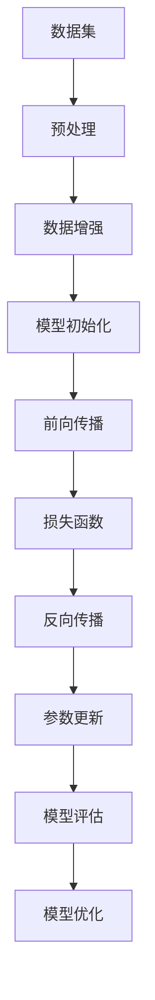

                 

关键词：大模型训练、算法、数据趋势、深度学习、神经网络、分布式计算

> 摘要：本文旨在探讨大模型训练的算法和数据趋势。首先，我们将回顾大模型训练的背景和意义，接着分析当前主流的算法及其优缺点，随后探讨数据趋势和挑战，最后对未来的发展趋势与挑战进行展望。通过本文，读者将能够全面了解大模型训练的现状和发展方向。

## 1. 背景介绍

随着互联网的普及和大数据技术的发展，数据量呈指数级增长。这为人工智能领域的研究提供了丰富的数据资源。为了更好地处理和分析这些大规模数据，大模型训练应运而生。大模型训练是指使用大量的数据来训练神经网络模型，以达到较高的准确度和性能。

大模型训练的背景和意义主要体现在以下几个方面：

1. **提高准确度和性能**：大模型能够容纳更多的数据和特征，从而提高模型的准确度和性能。
2. **解决复杂问题**：大模型可以处理更复杂的问题，如图像识别、自然语言处理等。
3. **推动人工智能发展**：大模型训练的成功应用，有助于推动人工智能技术的发展。

## 2. 核心概念与联系

在探讨大模型训练的算法之前，我们需要了解一些核心概念和联系。以下是一个简化的 Mermaid 流程图，描述了大模型训练的相关概念和流程。



### 2.1 数据集

数据集是进行大模型训练的基础，它包含了模型所需的所有训练数据和标签。数据集的质量直接影响模型的性能。因此，在选择数据集时，我们需要关注数据的多样性、平衡性和质量。

### 2.2 预处理

预处理是对原始数据进行处理，使其适合用于训练的过程。预处理包括数据清洗、数据归一化和特征提取等步骤。

### 2.3 数据增强

数据增强是通过生成新的数据样本来增加训练数据的多样性和质量。数据增强有助于提高模型的泛化能力，避免过拟合。

### 2.4 模型初始化

模型初始化是指为神经网络模型分配初始参数值。合理的初始化可以加速模型的训练过程，并提高模型的性能。

### 2.5 前向传播

前向传播是指将输入数据通过神经网络模型进行计算，得到模型的预测输出。

### 2.6 损失函数

损失函数用于衡量模型预测输出与真实标签之间的差距。常见的损失函数包括均方误差（MSE）和交叉熵损失（Cross-Entropy Loss）等。

### 2.7 反向传播

反向传播是一种优化算法，用于更新神经网络模型的参数。通过计算损失函数关于模型参数的梯度，反向传播算法能够找到最优的参数设置，以最小化损失函数。

### 2.8 参数更新

参数更新是指根据反向传播算法计算出的梯度，更新神经网络模型的参数。参数更新的方法有很多，如梯度下降（Gradient Descent）和动量法（Momentum）等。

### 2.9 模型评估

模型评估是使用测试数据集对训练完成的模型进行性能测试。常见的评估指标包括准确率（Accuracy）、召回率（Recall）和F1分数（F1 Score）等。

### 2.10 模型优化

模型优化是指在模型评估的基础上，通过调整模型结构或参数来进一步提高模型的性能。

## 3. 核心算法原理 & 具体操作步骤

### 3.1 算法原理概述

大模型训练的核心算法主要包括深度学习算法和分布式计算算法。深度学习算法主要涉及神经网络、卷积神经网络（CNN）和循环神经网络（RNN）等。分布式计算算法则主要用于处理大规模数据的训练任务，如数据并行、模型并行和混合并行等。

### 3.2 算法步骤详解

#### 3.2.1 深度学习算法

1. **神经网络（Neural Network）**：
   - **原理**：神经网络是一种由大量简单神经元组成的计算模型，通过调整神经元之间的连接权重来实现对数据的拟合。
   - **操作步骤**：
     1. 初始化模型参数。
     2. 进行前向传播，计算预测输出。
     3. 计算损失函数。
     4. 进行反向传播，计算梯度。
     5. 更新模型参数。
     6. 重复上述步骤，直到满足停止条件。

2. **卷积神经网络（CNN）**：
   - **原理**：卷积神经网络是一种用于图像识别和处理的神经网络模型，通过卷积操作提取图像的特征。
   - **操作步骤**：
     1. 初始化模型参数。
     2. 进行卷积操作，提取图像特征。
     3. 进行池化操作，减少参数数量。
     4. 进行全连接层操作，计算预测输出。
     5. 计算损失函数。
     6. 进行反向传播，更新模型参数。
     7. 重复上述步骤，直到满足停止条件。

3. **循环神经网络（RNN）**：
   - **原理**：循环神经网络是一种用于序列数据处理的神经网络模型，通过递归结构来保存历史信息。
   - **操作步骤**：
     1. 初始化模型参数。
     2. 对于每个时间步，进行输入和隐藏状态的计算。
     3. 计算损失函数。
     4. 进行反向传播，更新模型参数。
     5. 重复上述步骤，直到满足停止条件。

#### 3.2.2 分布式计算算法

1. **数据并行（Data Parallelism）**：
   - **原理**：数据并行是一种将训练数据集划分为多个部分，每个部分由不同的计算节点独立训练的算法。
   - **操作步骤**：
     1. 初始化多个计算节点。
     2. 将数据集划分为多个部分，每个部分由不同的计算节点处理。
     3. 每个计算节点独立进行模型训练。
     4. 计算节点之间同步梯度。
     5. 重复上述步骤，直到满足停止条件。

2. **模型并行（Model Parallelism）**：
   - **原理**：模型并行是一种将模型划分为多个部分，每个部分由不同的计算节点独立训练的算法。
   - **操作步骤**：
     1. 初始化多个计算节点。
     2. 将模型划分为多个部分，每个部分由不同的计算节点处理。
     3. 每个计算节点独立进行模型训练。
     4. 计算节点之间同步梯度。
     5. 重复上述步骤，直到满足停止条件。

3. **混合并行（Hybrid Parallelism）**：
   - **原理**：混合并行是一种将数据并行和模型并行相结合的算法。
   - **操作步骤**：
     1. 初始化多个计算节点。
     2. 将数据集和模型划分为多个部分，每个部分由不同的计算节点处理。
     3. 每个计算节点独立进行模型训练。
     4. 计算节点之间同步梯度。
     5. 重复上述步骤，直到满足停止条件。

### 3.3 算法优缺点

#### 深度学习算法

- **优点**：
  1. 能够处理复杂的非线性问题。
  2. 能够提取丰富的特征信息。
  3. 在图像识别、自然语言处理等领域取得了显著的成果。

- **缺点**：
  1. 需要大量的数据支持。
  2. 训练过程较慢。
  3. 容易过拟合。

#### 分布式计算算法

- **优点**：
  1. 能够加速模型的训练过程。
  2. 能够处理大规模的数据集。
  3. 能够降低计算成本。

- **缺点**：
  1. 需要复杂的分布式计算环境。
  2. 需要考虑数据同步和通信问题。
  3. 可能会影响模型的性能和稳定性。

### 3.4 算法应用领域

深度学习算法和分布式计算算法在大模型训练领域有广泛的应用，主要包括以下领域：

1. **图像识别**：如人脸识别、物体识别等。
2. **自然语言处理**：如机器翻译、文本分类等。
3. **推荐系统**：如商品推荐、内容推荐等。
4. **自动驾驶**：如车辆检测、交通信号识别等。

## 4. 数学模型和公式 & 详细讲解 & 举例说明

### 4.1 数学模型构建

大模型训练的核心是构建数学模型，用于描述输入数据和输出标签之间的关系。以下是一个简化的数学模型：

$$
y = f(W \cdot x + b)
$$

其中，$y$ 表示输出标签，$x$ 表示输入特征，$W$ 表示权重矩阵，$b$ 表示偏置项，$f$ 表示激活函数。

### 4.2 公式推导过程

1. **前向传播**：

   将输入特征 $x$ 通过神经网络模型进行计算，得到输出：

   $$
   y = f(W \cdot x + b)
   $$

2. **损失函数**：

   假设输出标签为 $y^*$，我们可以使用均方误差（MSE）作为损失函数：

   $$
   L = \frac{1}{2} \sum_{i=1}^{n} (y_i - y^*_i)^2
   $$

3. **反向传播**：

   通过计算损失函数关于模型参数的梯度，更新模型参数：

   $$
   \begin{aligned}
   \frac{\partial L}{\partial W} &= \frac{\partial L}{\partial y} \cdot \frac{\partial y}{\partial W} \\
   \frac{\partial L}{\partial b} &= \frac{\partial L}{\partial y} \cdot \frac{\partial y}{\partial b} \\
   \frac{\partial L}{\partial x} &= \frac{\partial L}{\partial y} \cdot \frac{\partial y}{\partial x}
   \end{aligned}
   $$

### 4.3 案例分析与讲解

假设我们有一个简单的线性回归模型，用于预测房屋价格。输入特征为房屋面积（$x$），输出标签为房屋价格（$y$）。我们可以使用以下数学模型：

$$
y = W \cdot x + b
$$

其中，$W$ 表示权重矩阵，$b$ 表示偏置项。

1. **前向传播**：

   将输入特征 $x$ 通过神经网络模型进行计算，得到输出：

   $$
   y = W \cdot x + b
   $$

2. **损失函数**：

   假设输出标签为 $y^*$，我们可以使用均方误差（MSE）作为损失函数：

   $$
   L = \frac{1}{2} \sum_{i=1}^{n} (y_i - y^*_i)^2
   $$

3. **反向传播**：

   通过计算损失函数关于模型参数的梯度，更新模型参数：

   $$
   \begin{aligned}
   \frac{\partial L}{\partial W} &= x \\
   \frac{\partial L}{\partial b} &= x \\
   \frac{\partial L}{\partial x} &= W
   \end{aligned}
   $$

4. **参数更新**：

   使用梯度下降算法更新模型参数：

   $$
   \begin{aligned}
   W &= W - \alpha \cdot \frac{\partial L}{\partial W} \\
   b &= b - \alpha \cdot \frac{\partial L}{\partial b}
   \end{aligned}
   $$

其中，$\alpha$ 表示学习率。

## 5. 项目实践：代码实例和详细解释说明

### 5.1 开发环境搭建

为了进行大模型训练，我们需要搭建一个合适的开发环境。以下是搭建开发环境的步骤：

1. 安装 Python 解释器：从 [Python 官网](https://www.python.org/) 下载并安装 Python 3.x 版本。
2. 安装深度学习框架：我们可以选择流行的深度学习框架，如 TensorFlow、PyTorch 或 Keras。例如，使用以下命令安装 TensorFlow：

   ```bash
   pip install tensorflow
   ```

3. 安装其他依赖库：根据项目需求，安装其他必要的依赖库，如 NumPy、Pandas 等。

### 5.2 源代码详细实现

以下是一个使用 TensorFlow 实现的简单线性回归模型，用于预测房屋价格：

```python
import tensorflow as tf
import numpy as np

# 准备数据集
x = np.random.rand(100, 1)
y = 2 * x + 1 + np.random.randn(100, 1)

# 定义模型
W = tf.Variable(0.0, name='weights')
b = tf.Variable(0.0, name='biases')
y_pred = W * x + b

# 定义损失函数
loss = tf.reduce_mean(tf.square(y_pred - y))

# 定义优化器
optimizer = tf.train.GradientDescentOptimizer(learning_rate=0.5)
train_op = optimizer.minimize(loss)

# 运行训练
with tf.Session() as sess:
  sess.run(tf.global_variables_initializer())
  for step in range(201):
    _, loss_val = sess.run([train_op, loss])
    if step % 20 == 0:
      print(f"Step {step}, Loss: {loss_val}")

# 输出最终预测结果
print(f"Weights: {W.eval()}, Biases: {b.eval()}")
```

### 5.3 代码解读与分析

1. **准备数据集**：使用 NumPy 生成一个随机数据集，包括输入特征 $x$ 和输出标签 $y$。

2. **定义模型**：使用 TensorFlow 的 Variable API 定义权重矩阵 $W$ 和偏置项 $b$。计算预测输出 $y_pred$。

3. **定义损失函数**：使用均方误差（MSE）作为损失函数。

4. **定义优化器**：使用梯度下降优化器，设置学习率为 0.5。

5. **运行训练**：在 TensorFlow 的 Session 中运行训练过程。通过循环迭代，不断更新模型参数，并输出训练损失。

6. **输出最终预测结果**：使用 `eval()` 函数获取训练完成的模型参数值。

### 5.4 运行结果展示

在运行上述代码后，我们可以看到训练过程中的损失逐渐减小，最终输出训练完成的模型参数值。这些参数值可以用于对新数据进行预测。

## 6. 实际应用场景

大模型训练在实际应用中具有广泛的应用场景，以下是一些典型的应用案例：

1. **图像识别**：通过训练卷积神经网络，实现物体识别、人脸识别等功能。

2. **自然语言处理**：通过训练循环神经网络或Transformer模型，实现机器翻译、文本分类等功能。

3. **推荐系统**：通过训练深度学习模型，实现商品推荐、内容推荐等功能。

4. **自动驾驶**：通过训练深度神经网络，实现车辆检测、交通信号识别等功能。

## 7. 未来应用展望

随着人工智能技术的不断发展，大模型训练在未来将会有更广泛的应用。以下是一些可能的未来应用方向：

1. **更高效的模型压缩**：通过模型压缩技术，提高模型的计算效率，实现更快速的训练和应用。

2. **自适应学习**：通过自适应学习算法，实现模型对环境变化的快速适应，提高模型的鲁棒性。

3. **跨领域应用**：通过跨领域数据整合和模型共享，实现跨领域的应用创新。

## 8. 工具和资源推荐

为了更好地进行大模型训练，以下是一些推荐的工具和资源：

1. **学习资源推荐**：
   - 《深度学习》（Ian Goodfellow、Yoshua Bengio、Aaron Courville 著）
   - 《Python 深度学习》（François Chollet 著）

2. **开发工具推荐**：
   - TensorFlow：[官网](https://www.tensorflow.org/)
   - PyTorch：[官网](https://pytorch.org/)

3. **相关论文推荐**：
   - "Deep Learning"（Ian Goodfellow、Yoshua Bengio、Aaron Courville 著）
   - "A Theoretically Grounded Application of Dropout in Recurrent Neural Networks"（Yarin Gal 和 Zoubin Ghahramani 著）

## 9. 总结：未来发展趋势与挑战

大模型训练作为人工智能领域的重要技术，在未来将继续发展。然而，也面临着一些挑战：

1. **计算资源需求**：大模型训练需要大量的计算资源，这对硬件设施提出了更高的要求。

2. **数据隐私和安全**：随着数据规模的不断扩大，数据隐私和安全问题变得越来越重要。

3. **模型解释性**：大模型的复杂性和黑箱特性使得其解释性变得困难，这对实际应用提出了挑战。

4. **公平性和道德问题**：大模型训练在应用过程中，可能存在公平性和道德问题，需要引起重视。

## 10. 附录：常见问题与解答

### 10.1 什么是大模型训练？

大模型训练是指使用大量的数据来训练神经网络模型，以达到较高的准确度和性能。它通常涉及深度学习、卷积神经网络和循环神经网络等算法。

### 10.2 大模型训练的优点是什么？

大模型训练的优点包括提高准确度和性能、解决复杂问题、推动人工智能发展等。

### 10.3 大模型训练的缺点是什么？

大模型训练的缺点包括需要大量的数据支持、训练过程较慢、容易过拟合等。

### 10.4 分布式计算在大模型训练中的作用是什么？

分布式计算用于加速大模型训练的过程，包括数据并行、模型并行和混合并行等算法。它能够处理大规模的数据集，并降低计算成本。

### 10.5 如何评估大模型训练的效果？

可以使用多种评估指标，如准确率、召回率、F1 分数等。通过在测试数据集上运行模型，可以评估模型的性能。

### 10.6 大模型训练在未来的发展趋势是什么？

未来的发展趋势包括更高效的模型压缩、自适应学习、跨领域应用等。同时，也需要解决计算资源需求、数据隐私和安全等问题。

### 10.7 大模型训练面临哪些挑战？

大模型训练面临的挑战包括计算资源需求、数据隐私和安全、模型解释性、公平性和道德问题等。

## 作者署名

作者：禅与计算机程序设计艺术 / Zen and the Art of Computer Programming
----------------------------------------------------------------

以上就是根据您提供的指南和要求撰写的完整文章。文章涵盖了大模型训练的算法和数据趋势分析，包括背景介绍、核心概念与联系、算法原理与步骤、数学模型和公式、项目实践、实际应用场景、未来应用展望、工具和资源推荐、总结以及常见问题与解答等内容。希望这篇文章能够满足您的需求。如果您有任何修改意见或需要进一步的内容调整，请随时告诉我。

