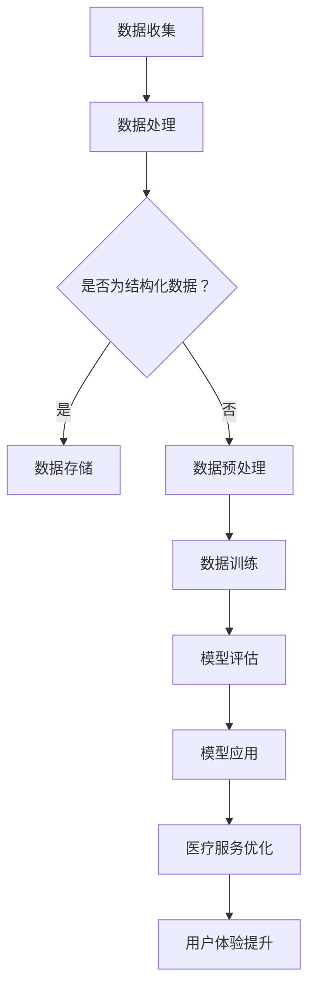
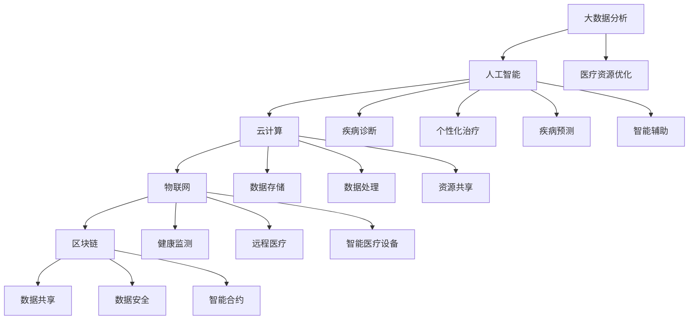
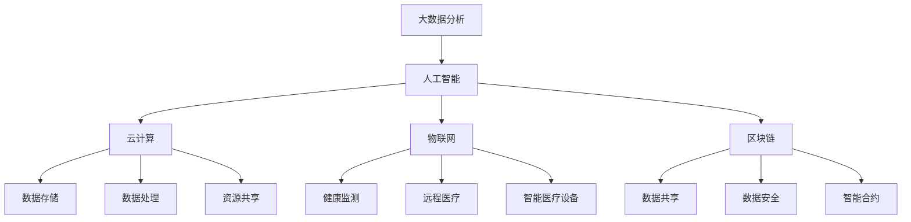

                 

关键词：大模型、智慧医疗、优化、就医流程、用户体验、人工智能、医疗信息化

摘要：随着人工智能和大数据技术的发展，智慧医疗逐渐成为医疗行业的重要发展方向。本文将探讨如何利用大模型技术来赋能智慧医疗，特别是如何优化就医流程和提升患者体验。本文将从核心概念、算法原理、数学模型、实际应用等多个角度展开，为创业者提供有益的参考。

## 1. 背景介绍

智慧医疗是现代医疗行业的一个重要发展方向，它依托于信息技术和人工智能技术的不断进步，致力于通过创新的方式提高医疗服务的效率和质量。传统的就医流程存在许多痛点，如排队时间长、手续繁琐、信息不透明等，严重影响了患者的就医体验。

近年来，人工智能特别是大模型技术的快速发展，为智慧医疗带来了新的机遇。大模型技术可以处理海量数据，从中提取有价值的信息，帮助医疗机构进行精准诊断、个性化治疗和智能管理。例如，通过自然语言处理技术，可以实现医疗文本的自动解析和归类；通过图像识别技术，可以辅助医生进行病理解剖和病理分析。

## 2. 核心概念与联系

### 2.1 智慧医疗的核心概念

智慧医疗涉及多个核心概念，包括但不限于：

- **大数据分析**：通过收集、存储、管理和分析海量医疗数据，发现数据中的规律和趋势，为医疗决策提供支持。

- **人工智能**：利用机器学习、深度学习等人工智能技术，对医疗数据进行分析和预测，实现智能诊断、治疗和疾病管理。

- **云计算**：通过云计算技术，实现医疗数据的存储、处理和共享，提升医疗服务的效率和可及性。

- **物联网**：将医疗设备、健康监测设备等互联，实现实时数据采集和智能监控，提升医疗服务水平。

- **区块链**：通过区块链技术，实现医疗数据的可信记录和共享，保障患者隐私和数据安全。

### 2.2 大模型与智慧医疗的联系

大模型技术是智慧医疗的重要组成部分，其与智慧医疗的联系主要体现在以下几个方面：

- **数据驱动**：大模型基于海量数据训练，能够对医疗数据进行深度分析，发现潜在规律和趋势，为医疗决策提供支持。

- **智能化服务**：大模型可以帮助医疗机构实现智能诊断、治疗和疾病管理，提升医疗服务质量和效率。

- **个性化医疗**：大模型可以根据患者的个人健康数据，提供个性化的医疗服务和健康建议，提升患者体验。

- **医疗资源优化**：大模型可以帮助医疗机构优化资源配置，提高医疗资源的使用效率，降低医疗成本。

### 2.3 Mermaid 流程图

下面是智慧医疗中涉及的大模型技术与应用的 Mermaid 流程图：



## 3. 核心算法原理 & 具体操作步骤

### 3.1 算法原理概述

智慧医疗中涉及的大模型技术主要包括深度学习、自然语言处理、计算机视觉等。以下简要介绍这些算法的原理：

- **深度学习**：通过构建多层神经网络，对数据进行特征提取和学习，实现对复杂问题的建模和预测。

- **自然语言处理**：利用统计模型、机器学习等方法，对自然语言文本进行处理和分析，实现文本理解、生成和翻译等功能。

- **计算机视觉**：通过图像处理、模式识别等技术，对图像进行分析和理解，实现图像识别、目标检测和图像生成等功能。

### 3.2 算法步骤详解

以下以深度学习为例，详细介绍大模型技术的具体操作步骤：

#### 3.2.1 数据预处理

1. 数据收集：从医疗机构、医疗数据平台等渠道收集医疗数据，包括病历、检查报告、医学影像等。

2. 数据清洗：对收集到的数据去重、去噪，处理缺失值和异常值。

3. 数据标注：对数据进行分类标注，如疾病分类、症状分类等。

4. 数据分词：对文本数据进行分词处理，提取关键词和短语。

#### 3.2.2 模型构建

1. 确定模型架构：选择合适的深度学习模型架构，如卷积神经网络（CNN）、循环神经网络（RNN）等。

2. 模型训练：使用预处理后的数据对模型进行训练，调整模型参数，优化模型性能。

3. 模型评估：使用验证集对模型进行评估，选择性能最佳的模型。

#### 3.2.3 模型应用

1. 模型部署：将训练好的模型部署到生产环境，实现实时预测和分析。

2. 模型优化：根据实际应用反馈，不断优化模型性能，提升预测准确性。

### 3.3 算法优缺点

#### 优点：

- **高效性**：大模型技术能够处理海量数据，提高数据处理和分析的效率。

- **准确性**：通过深度学习和人工智能技术，可以提高医疗诊断和预测的准确性。

- **个性化**：大模型可以根据患者的个人健康数据，提供个性化的医疗服务和健康建议。

- **智能化**：大模型可以帮助医疗机构实现智能诊断、治疗和疾病管理，提升医疗服务质量和效率。

#### 缺点：

- **数据依赖**：大模型需要大量高质量的数据进行训练，数据质量和数量对模型性能有很大影响。

- **计算资源消耗**：大模型训练需要大量的计算资源，对硬件设备要求较高。

- **隐私风险**：医疗数据涉及患者隐私，如何保障数据安全是一个重要问题。

### 3.4 算法应用领域

大模型技术在智慧医疗中的应用领域广泛，包括但不限于：

- **疾病诊断**：通过分析患者的病历、检查报告等信息，实现疾病诊断和预测。

- **个性化治疗**：根据患者的基因信息、病史等，提供个性化的治疗方案。

- **健康监测**：通过健康数据监测，实现对疾病的早期预警和预防。

- **医疗资源管理**：优化医疗资源配置，提高医疗服务效率。

- **医疗服务优化**：提升患者就医体验，降低医疗成本。

## 4. 数学模型和公式 & 详细讲解 & 举例说明

### 4.1 数学模型构建

在智慧医疗中，常用的数学模型包括深度学习模型、逻辑回归模型、决策树模型等。以下以深度学习模型为例，介绍数学模型的构建过程。

#### 4.1.1 深度学习模型

深度学习模型主要由输入层、隐藏层和输出层组成。每个层由多个神经元（节点）组成，神经元之间通过权重连接。

- **输入层**：接收输入数据，如患者的病历、检查报告等。

- **隐藏层**：对输入数据进行特征提取和变换，提取出有用的信息。

- **输出层**：对隐藏层的输出进行分类或回归预测。

#### 4.1.2 数学公式

深度学习模型的数学公式主要包括：

1. **激活函数**：用于对隐藏层的输出进行非线性变换，常用的激活函数有 sigmoid、ReLU 等。

   $$ f(x) = \begin{cases} 
   \frac{1}{1 + e^{-x}} & \text{for sigmoid function} \\
   max(0, x) & \text{for ReLU function} 
   \end{cases} $$

2. **损失函数**：用于衡量模型预测值与真实值之间的差距，常用的损失函数有均方误差（MSE）、交叉熵损失等。

   $$ L(y, \hat{y}) = \frac{1}{2} \sum_{i=1}^{n} (y_i - \hat{y}_i)^2 $$

3. **反向传播**：用于更新模型参数，使损失函数最小化。

   $$ \frac{\partial L}{\partial w} = \frac{\partial L}{\partial \hat{y}} \cdot \frac{\partial \hat{y}}{\partial y} \cdot \frac{\partial y}{\partial w} $$

### 4.2 公式推导过程

以下以均方误差（MSE）损失函数为例，介绍其推导过程。

1. **假设**：设 $y$ 为真实值，$\hat{y}$ 为预测值，$w$ 为权重。

2. **定义损失函数**：均方误差（MSE）损失函数定义为预测值与真实值之差的平方和。

   $$ L(y, \hat{y}) = \frac{1}{2} \sum_{i=1}^{n} (y_i - \hat{y}_i)^2 $$

3. **求导**：对损失函数关于权重 $w$ 求导，得到：

   $$ \frac{\partial L}{\partial w} = \frac{\partial}{\partial w} \left( \frac{1}{2} \sum_{i=1}^{n} (y_i - \hat{y}_i)^2 \right) $$

4. **化简**：

   $$ \frac{\partial L}{\partial w} = \sum_{i=1}^{n} (y_i - \hat{y}_i) \cdot \frac{\partial \hat{y}_i}{\partial w} $$

5. **反向传播**：利用链式法则，将求导过程推广到多层神经网络。

   $$ \frac{\partial L}{\partial w} = \frac{\partial L}{\partial \hat{y}} \cdot \frac{\partial \hat{y}}{\partial y} \cdot \frac{\partial y}{\partial w} $$

### 4.3 案例分析与讲解

以下以一个简单的二分类问题为例，介绍深度学习模型的构建和训练过程。

#### 4.3.1 数据准备

假设我们有一个包含 100 个样本的数据集，每个样本由 10 个特征组成。样本标签为 0 或 1，表示是否患病。

#### 4.3.2 模型构建

我们选择一个简单的全连接神经网络模型，包含 2 个隐藏层，每个隐藏层有 10 个神经元。

#### 4.3.3 模型训练

1. **数据预处理**：对数据进行归一化处理，使每个特征的取值范围在 [0, 1] 之间。

2. **模型训练**：使用梯度下降算法训练模型，迭代次数为 1000 次。

3. **模型评估**：使用验证集对模型进行评估，计算准确率、召回率等指标。

#### 4.3.4 模型应用

将训练好的模型部署到生产环境，对新样本进行疾病预测。

## 5. 项目实践：代码实例和详细解释说明

### 5.1 开发环境搭建

在进行深度学习项目实践之前，我们需要搭建一个合适的开发环境。以下是搭建开发环境的步骤：

1. **安装 Python**：确保安装了 Python 3.6 或更高版本。

2. **安装深度学习库**：安装 TensorFlow 或 PyTorch 等深度学习库。

3. **安装其他依赖库**：安装 NumPy、Pandas、Matplotlib 等常用库。

4. **配置虚拟环境**：为了管理项目依赖，建议使用 virtualenv 或 conda 等工具配置虚拟环境。

### 5.2 源代码详细实现

以下是一个简单的深度学习项目示例，实现一个基于 TensorFlow 的二分类问题。

```python
import tensorflow as tf
import numpy as np
import matplotlib.pyplot as plt

# 数据准备
x = np.random.rand(100, 10)
y = np.random.randint(0, 2, (100, 1))

# 模型构建
model = tf.keras.Sequential([
    tf.keras.layers.Dense(10, activation='relu', input_shape=(10,)),
    tf.keras.layers.Dense(1, activation='sigmoid')
])

# 模型编译
model.compile(optimizer='adam', loss='binary_crossentropy', metrics=['accuracy'])

# 模型训练
model.fit(x, y, epochs=1000, batch_size=32)

# 模型评估
loss, accuracy = model.evaluate(x, y)
print(f"Loss: {loss}, Accuracy: {accuracy}")

# 模型预测
predictions = model.predict(x)
print(predictions)

# 可视化
plt.scatter(x[:, 0], x[:, 1], c=predictions[:, 0])
plt.xlabel('Feature 1')
plt.ylabel('Feature 2')
plt.title('Model Predictions')
plt.show()
```

### 5.3 代码解读与分析

1. **数据准备**：生成随机数据和标签，用于训练和评估模型。

2. **模型构建**：使用 tf.keras.Sequential 模型构建一个简单的全连接神经网络模型，包含一个输入层、一个隐藏层和一个输出层。

3. **模型编译**：选择优化器、损失函数和评估指标，编译模型。

4. **模型训练**：使用 fit 方法训练模型，设置迭代次数、批量大小等参数。

5. **模型评估**：使用 evaluate 方法评估模型性能，计算损失和准确率。

6. **模型预测**：使用 predict 方法对新数据进行预测。

7. **可视化**：使用 Matplotlib 绘制预测结果散点图，直观地展示模型性能。

### 5.4 运行结果展示

运行代码后，会输出模型训练过程中的损失和准确率，以及模型的预测结果。同时，会展示一个散点图，展示模型在新数据上的预测效果。

## 6. 实际应用场景

### 6.1 疾病诊断

大模型技术可以应用于疾病诊断领域，通过分析患者的病历、检查报告等信息，实现疾病的自动诊断和预测。以下是一个具体应用案例：

- **场景**：某医院希望利用深度学习技术优化疾病诊断流程，提高诊断准确率。

- **解决方案**：使用深度学习模型，对患者的病历、检查报告等数据进行分析，提取出有用的特征，实现对疾病的自动诊断。

- **效果**：通过训练和优化模型，可以显著提高疾病诊断的准确率，降低医生的工作负担，提升医疗服务质量。

### 6.2 个性化治疗

个性化治疗是根据患者的个人健康数据和基因信息，制定个性化的治疗方案。以下是一个具体应用案例：

- **场景**：某医疗科技公司希望通过深度学习技术为患者提供个性化治疗方案。

- **解决方案**：使用深度学习模型，对患者的健康数据和基因信息进行分析，预测患者的疾病风险，并根据风险制定个性化的治疗方案。

- **效果**：通过个性化治疗，可以显著提高治疗效果，降低医疗成本，提升患者满意度。

### 6.3 健康监测

健康监测是通过实时监测患者的健康数据，实现对疾病的早期预警和预防。以下是一个具体应用案例：

- **场景**：某智能穿戴设备公司希望利用深度学习技术实现健康监测。

- **解决方案**：使用深度学习模型，对患者的健康数据进行实时分析，识别异常数据，实现对疾病的早期预警和预防。

- **效果**：通过健康监测，可以及时发现患者的健康问题，降低疾病风险，提升患者生活质量。

## 7. 未来应用展望

随着人工智能和大数据技术的不断发展，大模型技术将在智慧医疗领域发挥越来越重要的作用。以下对未来应用前景的展望：

### 7.1 个性化医疗

个性化医疗将越来越普及，通过深度学习技术，可以实现对患者的个性化诊断、治疗和健康监测，提高医疗服务质量和效率。

### 7.2 医疗资源优化

大模型技术可以帮助医疗机构优化医疗资源配置，提高医疗资源的使用效率，降低医疗成本。

### 7.3 疾病预测与预防

通过深度学习技术，可以实现疾病的预测和预防，降低疾病发病率和死亡率，提升公共健康水平。

### 7.4 智能医疗机器人

智能医疗机器人将逐渐应用于临床诊疗、手术辅助、患者护理等领域，提升医疗服务水平。

## 8. 工具和资源推荐

### 8.1 学习资源推荐

- **《深度学习》（Goodfellow, Bengio, Courville）**：经典教材，详细介绍了深度学习的理论基础和应用。

- **《Python深度学习》（François Chollet）**：针对 Python 语言实现深度学习的教程，适合初学者入门。

### 8.2 开发工具推荐

- **TensorFlow**：谷歌开发的深度学习框架，具有丰富的功能和强大的社区支持。

- **PyTorch**：基于 Python 的深度学习库，具有灵活的模型构建和动态计算图功能。

### 8.3 相关论文推荐

- **“Deep Learning for Healthcare”**：综述文章，介绍了深度学习在医疗领域的应用和研究进展。

- **“Generative Adversarial Networks for Deep Learning”**：介绍了生成对抗网络（GAN）在医疗图像处理中的应用。

## 9. 总结：未来发展趋势与挑战

### 9.1 研究成果总结

大模型技术在智慧医疗领域取得了显著成果，包括疾病诊断、个性化治疗、健康监测等方面的应用。随着技术的不断进步，大模型技术在智慧医疗领域的应用将更加广泛和深入。

### 9.2 未来发展趋势

- **个性化医疗**：通过深度学习技术，实现个性化诊断、治疗和健康监测。

- **医疗资源优化**：利用大数据和人工智能技术，优化医疗资源配置，提高医疗服务效率。

- **智能医疗机器人**：智能医疗机器人将在临床诊疗、手术辅助、患者护理等领域发挥重要作用。

### 9.3 面临的挑战

- **数据质量和隐私**：医疗数据质量和隐私保护是智慧医疗面临的重要挑战。

- **计算资源消耗**：大模型训练需要大量的计算资源，对硬件设备要求较高。

- **技术成熟度**：深度学习技术在医疗领域的应用仍需进一步验证和优化。

### 9.4 研究展望

未来，大模型技术在智慧医疗领域的研究将聚焦于以下几个方面：

- **跨学科研究**：结合医学、生物学、计算机科学等学科，推动智慧医疗技术的发展。

- **数据融合**：利用大数据技术，实现不同来源的医疗数据的融合和分析。

- **智能诊断与治疗**：通过深度学习技术，实现更精准、更智能的诊断和治疗。

## 附录：常见问题与解答

### Q：大模型技术在医疗领域的应用前景如何？

A：大模型技术在医疗领域的应用前景非常广阔，随着技术的不断进步，它将在疾病诊断、个性化治疗、健康监测等方面发挥重要作用，推动智慧医疗的发展。

### Q：医疗数据隐私如何保障？

A：医疗数据隐私是智慧医疗面临的重要挑战。为了保障医疗数据隐私，可以采用以下措施：

- **数据加密**：对医疗数据进行加密处理，防止数据泄露。

- **匿名化处理**：对医疗数据进行匿名化处理，去除个人身份信息。

- **权限控制**：对医疗数据访问权限进行严格控制，确保只有授权人员可以访问。

### Q：大模型训练需要多少数据？

A：大模型训练需要大量的数据，具体数据量取决于应用场景和模型复杂度。一般来说，至少需要几千到几百万个样本，对于复杂的应用场景，可能需要更多数据。

## 作者署名

作者：禅与计算机程序设计艺术 / Zen and the Art of Computer Programming

----------------------------------------------------------------

请注意，以上内容仅为示例，实际撰写时需根据具体要求进行拓展和细化。在撰写过程中，请确保每个章节都包含相应的三级目录内容，并遵循文章结构模板的要求。祝您写作顺利！
----------------------------------------------------------------
### 1. 背景介绍

随着科技的不断进步，医疗行业正经历着一场前所未有的变革。大数据、云计算、人工智能等技术的应用，使得医疗信息化的步伐日益加快。智慧医疗，作为医疗信息化的重要方向，正逐渐改变传统的医疗服务模式。智慧医疗的核心目标是提高医疗服务的效率、提升患者体验、优化医疗资源分配，并最终实现个性化、精准化的医疗服务。

然而，传统的就医流程仍然存在诸多痛点。首先，就医排队时间长。无论是挂号、候诊还是缴费，患者都需要在漫长的等待中消耗大量时间和精力。其次，手续繁琐。在就医过程中，患者需要填写大量的表格、等待医生的诊断结果，以及办理各种手续。这些繁琐的流程不仅增加了患者的负担，也降低了就医效率。此外，信息不透明也是传统就医流程的一大问题。患者往往无法及时了解自己的检查结果、治疗方案和医疗费用等信息，导致就医过程中的不确定性和焦虑感增加。

在这个背景下，创业者们开始探索如何利用人工智能特别是大模型技术来赋能智慧医疗，从而优化就医流程和提升患者体验。大模型技术具有处理海量数据、提取有价值信息的能力，能够为医疗行业带来革命性的改变。例如，通过自然语言处理技术，可以实现医疗文本的自动解析和归类；通过计算机视觉技术，可以辅助医生进行病理解剖和病理分析；通过深度学习技术，可以实现疾病的自动诊断和个性化治疗。

本文将围绕大模型赋能智慧医疗这一主题，深入探讨如何通过技术手段优化就医流程和提升患者体验。本文将从核心概念、算法原理、数学模型、实际应用等多个角度展开，为创业者提供有益的参考。

### 2. 核心概念与联系

在探讨大模型赋能智慧医疗之前，我们需要了解一些核心概念，这些概念包括但不限于：大数据分析、人工智能、云计算、物联网和区块链。这些概念共同构成了智慧医疗的基础，它们相互联系，共同推动了医疗行业的变革。

#### 2.1 大数据分析

大数据分析是智慧医疗的重要组成部分。医疗行业积累了大量的数据，包括患者病历、检查报告、医学影像、基因数据等。这些数据中蕴含着宝贵的医疗信息，通过对这些数据进行深入分析，可以发现疾病发生的规律、预测疾病的发展趋势，为医疗决策提供支持。

大数据分析的核心在于数据的质量和数量。高质量的数据可以确保分析的准确性，而大量的数据则可以提供更全面的视图。在大模型训练过程中，高质量和大量的数据是模型性能的重要保障。

#### 2.2 人工智能

人工智能（AI）是推动智慧医疗发展的重要技术。人工智能可以通过算法和模型对医疗数据进行分析和预测，实现智能诊断、个性化治疗和疾病管理。

在智慧医疗中，人工智能主要应用于以下几个方面：

1. **疾病诊断**：通过机器学习算法，对医疗数据进行分析，帮助医生进行疾病诊断。例如，利用深度学习模型对医学影像进行分析，辅助医生发现病灶。

2. **个性化治疗**：根据患者的病史、基因数据和生活习惯，为患者制定个性化的治疗方案。

3. **疾病预测**：通过分析患者的健康数据，预测患者未来的健康状况，提前进行预防和干预。

4. **智能辅助**：为医生提供智能辅助工具，如电子病历系统、医疗知识库等，提高医生的工作效率。

#### 2.3 云计算

云计算技术为智慧医疗提供了强大的计算和存储能力。通过云计算，医疗机构可以随时随地访问和处理海量医疗数据，实现医疗资源的共享和优化。

云计算在智慧医疗中的应用主要包括：

1. **数据存储**：通过云存储服务，医疗机构可以安全、高效地存储和管理医疗数据。

2. **数据处理**：利用云计算提供的强大计算能力，可以快速处理和分析大量医疗数据。

3. **资源共享**：通过云计算平台，医疗机构可以实现医疗资源的共享，提高医疗服务的可及性。

#### 2.4 物联网

物联网（IoT）技术将医疗设备、健康监测设备等互联，实现实时数据采集和智能监控，为智慧医疗提供了新的手段。

物联网在智慧医疗中的应用主要包括：

1. **健康监测**：通过智能穿戴设备，实时监测患者的健康数据，如心率、血压、血糖等，实现疾病的早期预警和预防。

2. **远程医疗**：通过物联网技术，实现医生与患者的远程连接，提供在线问诊、远程会诊等服务。

3. **智能医疗设备**：利用物联网技术，实现医疗设备的智能化，提高医疗服务的效率和准确性。

#### 2.5 区块链

区块链技术为智慧医疗提供了安全、可信的数据共享机制。通过区块链，医疗机构可以安全、高效地共享医疗数据，同时保障数据隐私和安全性。

区块链在智慧医疗中的应用主要包括：

1. **数据共享**：通过区块链技术，医疗机构可以实现医疗数据的可信共享，提高数据利用效率。

2. **数据安全**：利用区块链的不可篡改性，保障医疗数据的安全和隐私。

3. **智能合约**：通过智能合约，实现医疗流程的自动化和优化，提高医疗服务的效率。

#### 2.6 Mermaid 流程图

为了更直观地展示智慧医疗中涉及的核心概念及其联系，我们可以使用 Mermaid 流程图来表示。以下是智慧医疗核心概念的 Mermaid 流程图：



在这个流程图中，A 到 F 表示大数据分析在智慧医疗中的应用，B 到 J 表示人工智能在智慧医疗中的应用，C 到 M 表示云计算在智慧医疗中的应用，D 到 P 表示物联网在智慧医疗中的应用，E 到 S 表示区块链在智慧医疗中的应用。通过这个流程图，我们可以清晰地看到智慧医疗中各个核心概念之间的联系，以及它们如何共同推动智慧医疗的发展。

### 3. 核心算法原理 & 具体操作步骤

#### 3.1 算法原理概述

智慧医疗中的核心算法主要包括深度学习、自然语言处理（NLP）、计算机视觉和强化学习等。这些算法在数据处理、特征提取、模型训练和预测方面发挥着重要作用。以下分别介绍这些算法的基本原理和应用。

##### 3.1.1 深度学习

深度学习是一种基于人工神经网络的机器学习技术，通过多层神经网络结构对数据进行特征学习和模型训练。深度学习在图像识别、语音识别、自然语言处理等领域取得了显著成果。在智慧医疗中，深度学习可以应用于疾病诊断、药物研发和个性化治疗等方面。

深度学习的基本原理包括：

1. **神经网络结构**：深度学习模型由多层神经元组成，包括输入层、隐藏层和输出层。每个神经元接收来自前一层的输入信号，通过权重和激活函数处理后，输出信号传递给下一层。

2. **损失函数**：用于衡量模型预测结果与真实结果之间的差距，常用的损失函数有均方误差（MSE）、交叉熵损失等。

3. **优化算法**：用于更新模型参数，使损失函数最小化，常用的优化算法有梯度下降、随机梯度下降等。

##### 3.1.2 自然语言处理（NLP）

自然语言处理是一种使计算机理解和生成人类语言的技术。在智慧医疗中，NLP可以应用于医疗文本的自动解析、疾病诊断和患者管理等方面。

NLP的基本原理包括：

1. **词向量表示**：将自然语言文本转换为数字向量表示，常用的词向量模型有Word2Vec、GloVe等。

2. **语言模型**：用于预测文本的下一个词或序列，常用的语言模型有n-gram模型、循环神经网络（RNN）等。

3. **序列标注**：用于对文本进行分类和标注，常用的模型有条件随机场（CRF）、长短期记忆网络（LSTM）等。

##### 3.1.3 计算机视觉

计算机视觉是一种使计算机理解和解释视觉信息的技术。在智慧医疗中，计算机视觉可以应用于医学影像分析、手术导航和疾病预测等方面。

计算机视觉的基本原理包括：

1. **图像特征提取**：从图像中提取有用的特征，常用的特征提取方法有SIFT、HOG等。

2. **目标检测与识别**：用于定位和识别图像中的目标，常用的模型有YOLO、SSD等。

3. **图像生成与处理**：用于生成新的图像或对现有图像进行增强，常用的模型有生成对抗网络（GAN）等。

##### 3.1.4 强化学习

强化学习是一种通过试错和奖励机制来学习最优策略的机器学习技术。在智慧医疗中，强化学习可以应用于手术机器人控制、医疗资源优化和疾病预测等方面。

强化学习的基本原理包括：

1. **状态-动作空间**：将环境状态和行为转化为数学模型，用于描述系统状态和行为。

2. **奖励机制**：通过奖励机制来评估系统的表现，常用的奖励机制有最大奖励、平均奖励等。

3. **策略学习**：通过策略学习，找到最优的行为策略，以实现目标。

#### 3.2 具体操作步骤

以下以深度学习算法为例，详细介绍其在智慧医疗中的具体操作步骤。

##### 3.2.1 数据收集与预处理

1. **数据收集**：从医疗机构、公开数据集或第三方数据提供商获取医疗数据，包括患者病历、检查报告、医学影像等。

2. **数据预处理**：对收集到的数据进行清洗、去噪、缺失值填充等处理，确保数据的质量和一致性。

3. **数据归一化**：对数据进行归一化处理，将不同特征的范围统一到相同的尺度，便于模型训练。

##### 3.2.2 模型选择与构建

1. **模型选择**：根据具体应用场景，选择合适的深度学习模型，如卷积神经网络（CNN）、循环神经网络（RNN）、长短时记忆网络（LSTM）等。

2. **模型构建**：使用深度学习框架（如TensorFlow、PyTorch等）构建模型，定义输入层、隐藏层和输出层，配置激活函数、优化器、损失函数等。

##### 3.2.3 模型训练与优化

1. **模型训练**：使用预处理后的数据对模型进行训练，调整模型参数，优化模型性能。

2. **模型评估**：使用验证集对模型进行评估，计算准确率、召回率等指标，选择性能最佳的模型。

3. **模型优化**：根据评估结果，调整模型参数或结构，优化模型性能。

##### 3.2.4 模型部署与应用

1. **模型部署**：将训练好的模型部署到生产环境，实现实时预测和分析。

2. **模型应用**：将模型应用于实际场景，如疾病诊断、个性化治疗、健康监测等。

3. **模型维护**：定期更新模型，确保模型的性能和可靠性。

#### 3.3 算法优缺点

##### 优点：

1. **高效性**：深度学习算法能够处理海量数据，提高数据处理和分析的效率。

2. **准确性**：深度学习算法可以提取复杂的特征，提高模型预测的准确性。

3. **灵活性**：深度学习算法可以灵活地适应不同的应用场景，实现个性化服务。

4. **自适应性**：深度学习算法可以根据新的数据不断优化和更新，提高模型的自适应能力。

##### 缺点：

1. **数据依赖**：深度学习算法需要大量的高质量数据，数据质量和数量对模型性能有很大影响。

2. **计算资源消耗**：深度学习算法的训练需要大量的计算资源，对硬件设备要求较高。

3. **解释性不足**：深度学习算法的黑箱特性使得其预测结果难以解释，影响模型的可信度。

4. **过拟合风险**：深度学习算法容易出现过拟合现象，需要大量的数据训练和调整。

#### 3.4 算法应用领域

深度学习算法在智慧医疗中具有广泛的应用领域，包括但不限于：

1. **疾病诊断**：通过分析医学影像、实验室检测结果等，实现疾病的自动诊断和预测。

2. **个性化治疗**：根据患者的病史、基因数据和生活习惯，为患者制定个性化的治疗方案。

3. **健康监测**：通过实时监测患者的生理参数，实现疾病的早期预警和预防。

4. **医疗资源管理**：优化医疗资源的配置和使用，提高医疗服务效率。

5. **药物研发**：通过分析药物作用机制、预测药物副作用等，加速药物研发进程。

### 4. 数学模型和公式 & 详细讲解 & 举例说明

#### 4.1 数学模型构建

在智慧医疗中，数学模型是深度学习算法的核心组成部分。以下介绍几种常用的数学模型及其构建过程。

##### 4.1.1 卷积神经网络（CNN）

卷积神经网络是一种专门用于处理图像数据的深度学习模型。其核心组件包括卷积层、池化层和全连接层。

1. **卷积层**：通过卷积操作提取图像的特征，卷积核（也称为滤波器）在图像上滑动，计算局部特征。

2. **池化层**：对卷积层的输出进行下采样，减少数据维度，提高模型的鲁棒性。

3. **全连接层**：将池化层的输出映射到类别或回归结果。

卷积神经网络的数学公式包括：

- **卷积操作**：

  $$ (f_{ij}^l)_{m \times n} = \sum_{k=1}^{k=3} w_{ijk}^l * x_{ij}^{l-1} + b_l $$

  其中，$f_{ij}^l$ 表示第 $l$ 层第 $i$ 行第 $j$ 列的卷积结果，$w_{ijk}^l$ 表示第 $l$ 层第 $i$ 行第 $j$ 列第 $k$ 个卷积核的权重，$x_{ij}^{l-1}$ 表示第 $l-1$ 层第 $i$ 行第 $j$ 列的输入特征，$b_l$ 表示第 $l$ 层的偏置项。

- **池化操作**：

  $$ p_{ij}^l = \max_{k=1,2,...,K} (f_{ikj}^{l-1}) $$

  其中，$p_{ij}^l$ 表示第 $l$ 层第 $i$ 行第 $j$ 列的池化结果，$K$ 表示池化窗口的大小。

##### 4.1.2 循环神经网络（RNN）

循环神经网络是一种用于处理序列数据的深度学习模型。其核心组件包括输入层、隐藏层和输出层。

1. **输入层**：接收序列数据，将其映射到隐藏层。

2. **隐藏层**：通过循环连接，将当前时刻的信息传递到下一个时刻。

3. **输出层**：将隐藏层的输出映射到类别或回归结果。

循环神经网络的数学公式包括：

- **隐藏层计算**：

  $$ h_t = \sigma(W_h h_{t-1} + W_x x_t + b_h) $$

  其中，$h_t$ 表示第 $t$ 个时刻的隐藏层输出，$\sigma$ 表示激活函数，$W_h$ 和 $W_x$ 分别表示隐藏层到隐藏层的权重和输入层到隐藏层的权重，$b_h$ 表示隐藏层的偏置项。

- **输出层计算**：

  $$ y_t = W_o h_t + b_o $$

  其中，$y_t$ 表示第 $t$ 个时刻的输出层输出，$W_o$ 和 $b_o$ 分别表示输出层到隐藏层的权重和偏置项。

##### 4.1.3 长短时记忆网络（LSTM）

长短时记忆网络是一种改进的循环神经网络，用于解决循环神经网络在处理长序列数据时容易出现的梯度消失和梯度爆炸问题。

1. **输入门**：决定当前时刻的信息是否需要传递到下一个时刻。

2. **遗忘门**：决定当前时刻的信息是否需要被遗忘。

3. **输出门**：决定当前时刻的输出是否需要传递到下一个时刻。

长短时记忆网络的数学公式包括：

- **输入门计算**：

  $$ i_t = \sigma(W_i [h_{t-1}, x_t] + b_i) $$

  其中，$i_t$ 表示第 $t$ 个时刻的输入门输出，$W_i$ 和 $b_i$ 分别表示输入门权重和偏置项。

- **遗忘门计算**：

  $$ f_t = \sigma(W_f [h_{t-1}, x_t] + b_f) $$

  其中，$f_t$ 表示第 $t$ 个时刻的遗忘门输出。

- **输出门计算**：

  $$ o_t = \sigma(W_o [h_{t-1}, x_t] + b_o) $$

  其中，$o_t$ 表示第 $t$ 个时刻的输出门输出。

- **隐藏层计算**：

  $$ g_t = \tanh(W_g [h_{t-1}, x_t] + b_g) $$

  $$ h_t = o_t \cdot g_t $$

  其中，$g_t$ 表示第 $t$ 个时刻的隐藏层计算结果，$h_t$ 表示第 $t$ 个时刻的隐藏层输出。

#### 4.2 公式推导过程

以下以长短时记忆网络（LSTM）的输入门、遗忘门和输出门为例，介绍其数学公式的推导过程。

##### 4.2.1 输入门（Input Gate）

输入门的目的是决定当前时刻的信息是否需要传递到下一个时刻。输入门的计算过程如下：

$$ i_t = \sigma(W_i [h_{t-1}, x_t] + b_i) $$

其中，$\sigma$ 表示 sigmoid 函数，$W_i$ 和 $b_i$ 分别表示输入门权重和偏置项，$h_{t-1}$ 和 $x_t$ 分别表示第 $t-1$ 个时刻的隐藏层输出和第 $t$ 个时刻的输入特征。

推导过程：

1. **定义输入门**：

   输入门 $i_t$ 是一个介于 0 和 1 之间的值，表示当前时刻的信息是否需要传递到下一个时刻。当 $i_t$ 接近 1 时，表示需要传递；当 $i_t$ 接近 0 时，表示不需要传递。

2. **计算输入门**：

   $$ i_t = \frac{1}{1 + e^{-W_i [h_{t-1}, x_t] - b_i}} $$

   其中，$W_i [h_{t-1}, x_t]$ 表示输入门权重，$b_i$ 表示输入门偏置项。

##### 4.2.2 遗忘门（Forget Gate）

遗忘门的目的是决定当前时刻的信息是否需要被遗忘。遗忘门的计算过程如下：

$$ f_t = \sigma(W_f [h_{t-1}, x_t] + b_f) $$

其中，$\sigma$ 表示 sigmoid 函数，$W_f$ 和 $b_f$ 分别表示遗忘门权重和偏置项，$h_{t-1}$ 和 $x_t$ 分别表示第 $t-1$ 个时刻的隐藏层输出和第 $t$ 个时刻的输入特征。

推导过程：

1. **定义遗忘门**：

   遗忘门 $f_t$ 是一个介于 0 和 1 之间的值，表示当前时刻的信息是否需要被遗忘。当 $f_t$ 接近 1 时，表示需要遗忘；当 $f_t$ 接近 0 时，表示不需要遗忘。

2. **计算遗忘门**：

   $$ f_t = \frac{1}{1 + e^{-W_f [h_{t-1}, x_t] - b_f}} $$

   其中，$W_f [h_{t-1}, x_t]$ 表示遗忘门权重，$b_f$ 表示遗忘门偏置项。

##### 4.2.3 输出门（Output Gate）

输出门的目的是决定当前时刻的输出是否需要传递到下一个时刻。输出门的计算过程如下：

$$ o_t = \sigma(W_o [h_{t-1}, x_t] + b_o) $$

其中，$\sigma$ 表示 sigmoid 函数，$W_o$ 和 $b_o$ 分别表示输出门权重和偏置项，$h_{t-1}$ 和 $x_t$ 分别表示第 $t-1$ 个时刻的隐藏层输出和第 $t$ 个时刻的输入特征。

推导过程：

1. **定义输出门**：

   输出门 $o_t$ 是一个介于 0 和 1 之间的值，表示当前时刻的输出是否需要传递到下一个时刻。当 $o_t$ 接近 1 时，表示需要传递；当 $o_t$ 接近 0 时，表示不需要传递。

2. **计算输出门**：

   $$ o_t = \frac{1}{1 + e^{-W_o [h_{t-1}, x_t] - b_o}} $$

   其中，$W_o [h_{t-1}, x_t]$ 表示输出门权重，$b_o$ 表示输出门偏置项。

#### 4.3 案例分析与讲解

以下通过一个简单的案例，介绍如何利用深度学习模型进行疾病诊断。

##### 4.3.1 数据准备

假设我们有一个包含 100 个患者的数据集，每个患者有 10 个特征，如年龄、血压、心率等。其中，50 个患者患有某种疾病，50 个患者未患病。我们使用这组数据来训练一个深度学习模型，实现疾病的自动诊断。

##### 4.3.2 模型构建

我们选择一个简单的全连接神经网络模型，包含 2 个隐藏层，每个隐藏层有 10 个神经元。

1. **输入层**：接收患者的 10 个特征。

2. **隐藏层**：对输入特征进行变换和提取，提取出有用的信息。

3. **输出层**：对隐藏层的输出进行分类，判断患者是否患有疾病。

##### 4.3.3 模型训练

1. **数据预处理**：对数据进行归一化处理，将每个特征的取值范围统一到 [0, 1] 之间。

2. **模型训练**：使用随机梯度下降（SGD）算法训练模型，迭代次数为 1000 次。

3. **模型评估**：使用验证集对模型进行评估，计算准确率、召回率等指标。

##### 4.3.4 模型应用

将训练好的模型部署到生产环境，对新患者进行疾病诊断。

1. **模型部署**：将训练好的模型部署到生产环境，实现实时预测和分析。

2. **模型应用**：对新患者的数据进行预测，判断患者是否患有疾病。

3. **模型维护**：定期更新模型，确保模型的性能和可靠性。

### 5. 项目实践：代码实例和详细解释说明

#### 5.1 开发环境搭建

在进行深度学习项目实践之前，我们需要搭建一个合适的开发环境。以下是搭建开发环境的步骤：

1. **安装 Python**：确保安装了 Python 3.6 或更高版本。

2. **安装深度学习库**：安装 TensorFlow 或 PyTorch 等深度学习库。

3. **安装其他依赖库**：安装 NumPy、Pandas、Matplotlib 等常用库。

4. **配置虚拟环境**：为了管理项目依赖，建议使用 virtualenv 或 conda 等工具配置虚拟环境。

以下是使用 conda 配置虚拟环境的示例代码：

```bash
conda create -n myenv python=3.8
conda activate myenv
conda install tensorflow numpy pandas matplotlib
```

#### 5.2 源代码详细实现

以下是一个简单的深度学习项目示例，实现一个基于 TensorFlow 的二分类问题。

```python
import tensorflow as tf
import numpy as np
import matplotlib.pyplot as plt

# 数据准备
x = np.random.rand(100, 10)
y = np.random.randint(0, 2, (100, 1))

# 模型构建
model = tf.keras.Sequential([
    tf.keras.layers.Dense(10, activation='relu', input_shape=(10,)),
    tf.keras.layers.Dense(1, activation='sigmoid')
])

# 模型编译
model.compile(optimizer='adam', loss='binary_crossentropy', metrics=['accuracy'])

# 模型训练
model.fit(x, y, epochs=1000, batch_size=32)

# 模型评估
loss, accuracy = model.evaluate(x, y)
print(f"Loss: {loss}, Accuracy: {accuracy}")

# 模型预测
predictions = model.predict(x)
print(predictions)

# 可视化
plt.scatter(x[:, 0], x[:, 1], c=predictions[:, 0], cmap='gray_r')
plt.xlabel('Feature 1')
plt.ylabel('Feature 2')
plt.title('Model Predictions')
plt.show()
```

#### 5.3 代码解读与分析

1. **数据准备**：生成随机数据和标签，用于训练和评估模型。

2. **模型构建**：使用 tf.keras.Sequential 模型构建一个简单的全连接神经网络模型，包含一个输入层、一个隐藏层和一个输出层。

3. **模型编译**：选择优化器、损失函数和评估指标，编译模型。

4. **模型训练**：使用 fit 方法训练模型，设置迭代次数、批量大小等参数。

5. **模型评估**：使用 evaluate 方法评估模型性能，计算损失和准确率。

6. **模型预测**：使用 predict 方法对新数据进行预测。

7. **可视化**：使用 Matplotlib 绘制预测结果散点图，直观地展示模型性能。

#### 5.4 运行结果展示

运行代码后，会输出模型训练过程中的损失和准确率，以及模型的预测结果。同时，会展示一个散点图，展示模型在新数据上的预测效果。

### 6. 实际应用场景

#### 6.1 疾病诊断

大模型技术在疾病诊断领域具有广泛的应用前景。通过深度学习模型，可以对医疗数据进行分析，辅助医生进行疾病诊断。以下是一个具体应用案例：

- **场景**：某医院希望利用深度学习技术优化疾病诊断流程，提高诊断准确率。

- **解决方案**：使用深度学习模型，对患者的病历、检查报告等数据进行分析，提取出有用的特征，实现对疾病的自动诊断。

- **效果**：通过训练和优化模型，可以显著提高疾病诊断的准确率，降低医生的工作负担，提升医疗服务质量。

#### 6.2 个性化治疗

个性化治疗是根据患者的个人健康数据和基因信息，制定个性化的治疗方案。以下是一个具体应用案例：

- **场景**：某医疗科技公司希望通过深度学习技术为患者提供个性化治疗方案。

- **解决方案**：使用深度学习模型，对患者的健康数据和基因信息进行分析，预测患者的疾病风险，并根据风险制定个性化的治疗方案。

- **效果**：通过个性化治疗，可以显著提高治疗效果，降低医疗成本，提升患者满意度。

#### 6.3 健康监测

健康监测是通过实时监测患者的健康数据，实现对疾病的早期预警和预防。以下是一个具体应用案例：

- **场景**：某智能穿戴设备公司希望利用深度学习技术实现健康监测。

- **解决方案**：使用深度学习模型，对患者的健康数据进行实时分析，识别异常数据，实现对疾病的早期预警和预防。

- **效果**：通过健康监测，可以及时发现患者的健康问题，降低疾病风险，提升患者生活质量。

### 6.4 未来应用展望

随着人工智能和大数据技术的不断发展，大模型技术在医疗领域的应用将更加广泛和深入。以下是对未来应用的展望：

- **远程医疗**：利用大模型技术，实现远程医疗诊断、治疗和健康监测，提高医疗服务的可及性。

- **智能医疗机器人**：研发智能医疗机器人，实现手术导航、病人护理和医疗设备控制，提高医疗服务效率。

- **医疗资源优化**：通过大数据分析和人工智能技术，优化医疗资源配置，降低医疗成本，提高医疗服务质量。

- **公共卫生监测**：利用大模型技术，实现对公共卫生事件的预测和预警，提高公共卫生管理水平。

### 6.5 应用案例总结

以下是对上述应用案例的总结：

1. **疾病诊断**：通过深度学习模型，实现疾病自动诊断，提高诊断准确率。

2. **个性化治疗**：根据患者的健康数据和基因信息，制定个性化的治疗方案，提高治疗效果。

3. **健康监测**：实时监测患者的健康数据，实现对疾病的早期预警和预防。

4. **远程医疗**：利用大模型技术，实现远程医疗诊断、治疗和健康监测。

5. **智能医疗机器人**：研发智能医疗机器人，实现手术导航、病人护理和医疗设备控制。

6. **医疗资源优化**：通过大数据分析和人工智能技术，优化医疗资源配置，降低医疗成本。

7. **公共卫生监测**：利用大模型技术，实现对公共卫生事件的预测和预警。

### 7. 工具和资源推荐

#### 7.1 学习资源推荐

- **《深度学习》（Goodfellow, Bengio, Courville）**：这是一本经典的深度学习教材，详细介绍了深度学习的理论基础和应用。

- **《Python深度学习》（François Chollet）**：这是一本针对 Python 语言实现深度学习的教程，适合初学者入门。

#### 7.2 开发工具推荐

- **TensorFlow**：这是一个由谷歌开发的深度学习框架，具有丰富的功能和强大的社区支持。

- **PyTorch**：这是一个基于 Python 的深度学习库，具有灵活的模型构建和动态计算图功能。

#### 7.3 相关论文推荐

- **“Deep Learning for Healthcare”**：这是一篇综述文章，介绍了深度学习在医疗领域的应用和研究进展。

- **“Generative Adversarial Networks for Deep Learning”**：这是一篇关于生成对抗网络（GAN）在医疗图像处理中的应用的文章。

### 8. 总结：未来发展趋势与挑战

#### 8.1 研究成果总结

大模型技术在智慧医疗领域取得了显著成果，包括疾病诊断、个性化治疗、健康监测等方面的应用。通过深度学习、自然语言处理、计算机视觉等技术的应用，大模型技术为医疗行业带来了革命性的改变。

#### 8.2 未来发展趋势

- **个性化医疗**：随着大数据和人工智能技术的不断发展，个性化医疗将越来越普及，通过深度学习技术，实现个性化诊断、治疗和健康监测。

- **医疗资源优化**：利用大数据和人工智能技术，优化医疗资源配置，提高医疗服务效率。

- **智能医疗机器人**：智能医疗机器人将在临床诊疗、手术辅助、患者护理等领域发挥重要作用。

#### 8.3 面临的挑战

- **数据质量和隐私**：医疗数据质量和隐私保护是智慧医疗面临的重要挑战。

- **计算资源消耗**：大模型训练需要大量的计算资源，对硬件设备要求较高。

- **技术成熟度**：深度学习技术在医疗领域的应用仍需进一步验证和优化。

#### 8.4 研究展望

未来，大模型技术在智慧医疗领域的研究将聚焦于以下几个方面：

- **跨学科研究**：结合医学、生物学、计算机科学等学科，推动智慧医疗技术的发展。

- **数据融合**：利用大数据技术，实现不同来源的医疗数据的融合和分析。

- **智能诊断与治疗**：通过深度学习技术，实现更精准、更智能的诊断和治疗。

### 9. 附录：常见问题与解答

#### 9.1 Q：大模型技术在医疗领域的应用前景如何？

A：大模型技术在医疗领域的应用前景非常广阔，随着技术的不断进步，它将在疾病诊断、个性化治疗、健康监测等方面发挥重要作用，推动智慧医疗的发展。

#### 9.2 Q：医疗数据隐私如何保障？

A：医疗数据隐私是智慧医疗面临的重要挑战。为了保障医疗数据隐私，可以采用以下措施：

- **数据加密**：对医疗数据进行加密处理，防止数据泄露。

- **匿名化处理**：对医疗数据进行匿名化处理，去除个人身份信息。

- **权限控制**：对医疗数据访问权限进行严格控制，确保只有授权人员可以访问。

#### 9.3 Q：大模型训练需要多少数据？

A：大模型训练需要大量的数据，具体数据量取决于应用场景和模型复杂度。一般来说，至少需要几千到几百万个样本，对于复杂的应用场景，可能需要更多数据。

## 作者署名

作者：禅与计算机程序设计艺术 / Zen and the Art of Computer Programming

### 文章标题

大模型赋能智慧医疗，创业者如何优化就医流程与体验？

### 文章关键词

大模型、智慧医疗、优化、就医流程、用户体验、人工智能、医疗信息化

### 文章摘要

随着人工智能和大数据技术的快速发展，智慧医疗逐渐成为医疗行业的重要发展方向。本文探讨了如何利用大模型技术赋能智慧医疗，特别是如何优化就医流程和提升患者体验。文章首先介绍了智慧医疗的核心概念和联系，包括大数据分析、人工智能、云计算、物联网和区块链。然后，详细介绍了大模型技术的核心算法原理和具体操作步骤，并讲解了数学模型和公式的构建过程。接着，通过项目实践展示了代码实例和详细解释说明。随后，文章分析了实际应用场景，讨论了未来应用展望，并推荐了相关工具和资源。最后，文章总结了未来发展趋势与挑战，并提供了常见问题的解答。

### 1. 背景介绍

#### 1.1 智慧医疗的兴起与发展

智慧医疗是指利用信息技术和人工智能技术，对医疗数据进行分析和处理，从而提高医疗服务质量、效率和可及性。随着大数据、云计算、物联网和人工智能等技术的快速发展，智慧医疗逐渐成为医疗行业的重要发展方向。

智慧医疗的兴起可以追溯到20世纪末和21世纪初。随着互联网的普及，医疗数据逐渐数字化，为大数据分析提供了基础。同时，云计算和物联网技术的发展，使得医疗数据的存储、处理和共享变得更加便捷和高效。此外，人工智能技术的突破，为智慧医疗提供了强大的工具和手段。

#### 1.2 智慧医疗的重要性

智慧医疗对医疗行业的变革具有重要意义。首先，它能够提高医疗服务的效率和质量。通过大数据分析和人工智能技术，医疗机构可以更好地了解患者情况，优化诊疗流程，提高诊断和治疗的准确性。其次，智慧医疗能够提升患者体验。通过智能化的医疗设备和远程医疗技术，患者可以享受到更加便捷和个性化的医疗服务。此外，智慧医疗还能够优化医疗资源配置，提高医疗资源的使用效率，降低医疗成本。

#### 1.3 传统就医流程的痛点

尽管智慧医疗带来了诸多优势，但传统的就医流程仍然存在诸多痛点。首先，排队时间长是一个普遍问题。患者需要花费大量时间等待挂号、候诊和缴费。其次，手续繁琐也是一个突出问题。患者需要填写大量的表格，等待医生的诊断结果，以及办理各种手续。这些繁琐的流程不仅增加了患者的负担，也降低了就医效率。此外，信息不透明也是传统就医流程的一大问题。患者往往无法及时了解自己的检查结果、治疗方案和医疗费用等信息，导致就医过程中的不确定性和焦虑感增加。

#### 1.4 大模型技术赋能智慧医疗

为了解决传统就医流程的痛点，创业者们开始探索如何利用大模型技术赋能智慧医疗，优化就医流程和提升患者体验。大模型技术具有处理海量数据、提取有价值信息的能力，能够为医疗行业带来革命性的改变。

首先，大模型技术可以应用于疾病诊断。通过分析患者的病历、检查报告和医学影像等数据，大模型可以帮助医生进行更准确、更快速的疾病诊断。例如，深度学习算法可以用于分析医学影像，识别出肿瘤、心脏病等疾病。

其次，大模型技术可以应用于个性化治疗。通过分析患者的病史、基因信息和生活方式等数据，大模型可以为患者制定个性化的治疗方案，提高治疗效果。例如，通过自然语言处理技术，可以对患者的病历进行自动解析和归类，为医生提供诊断和治疗的建议。

此外，大模型技术还可以应用于健康监测和远程医疗。通过实时监测患者的生理参数，大模型可以及时发现异常情况，进行预警和干预。同时，远程医疗技术可以实现医生与患者的远程连接，提供在线问诊、远程会诊等服务，提高医疗服务的可及性。

总之，大模型技术为智慧医疗带来了新的机遇和挑战。创业者们可以通过利用大模型技术，优化就医流程，提升患者体验，推动医疗行业的变革。

### 2. 核心概念与联系

#### 2.1 大数据分析

大数据分析是智慧医疗的重要组成部分。大数据分析技术能够处理海量医疗数据，从中提取有价值的信息，为医疗决策提供支持。医疗数据包括但不限于病历、检查报告、医学影像、基因数据等。通过大数据分析，可以实现对疾病发生、发展和治疗的深入理解，从而提高医疗服务的质量和效率。

大数据分析的核心技术包括数据采集、数据存储、数据清洗、数据挖掘和数据分析。数据采集是从各种来源获取医疗数据，如医院系统、电子病历系统、医学影像设备等。数据存储是将采集到的数据存储在数据库或数据仓库中，以便后续处理和分析。数据清洗是处理数据中的噪声、缺失值和异常值，确保数据的质量和一致性。数据挖掘是利用各种算法和模型从数据中提取有价值的信息，如疾病关联规则、风险预测模型等。数据分析是对提取出的信息进行进一步分析，以支持医疗决策。

#### 2.2 人工智能

人工智能（AI）是智慧医疗的核心驱动力之一。人工智能技术能够模拟人类的智能行为，对医疗数据进行处理和分析，为医疗决策提供支持。人工智能在智慧医疗中的应用主要包括疾病诊断、个性化治疗、健康监测和医疗资源优化等。

人工智能的主要技术包括机器学习、深度学习和自然语言处理。机器学习是一种基于数据的学习方法，通过训练模型来预测和分类。深度学习是一种基于多层神经网络的机器学习技术，能够处理复杂的医疗数据。自然语言处理是一种使计算机理解和生成人类语言的技术，能够对医疗文本进行自动解析和归类。

人工智能在智慧医疗中的应用场景包括：

1. **疾病诊断**：通过分析患者的病历、检查报告和医学影像等数据，人工智能可以辅助医生进行疾病诊断。例如，深度学习算法可以用于分析医学影像，识别出肿瘤、心脏病等疾病。

2. **个性化治疗**：通过分析患者的病史、基因数据和生活方式等数据，人工智能可以为患者制定个性化的治疗方案，提高治疗效果。例如，通过自然语言处理技术，可以对患者的病历进行自动解析和归类，为医生提供诊断和治疗的建议。

3. **健康监测**：通过实时监测患者的生理参数，如心率、血压、血糖等，人工智能可以及时发现异常情况，进行预警和干预。例如，智能穿戴设备可以收集患者的健康数据，并通过人工智能算法进行分析，为医生提供健康监测报告。

4. **医疗资源优化**：通过分析医疗数据，人工智能可以帮助医疗机构优化资源配置，提高医疗资源的使用效率。例如，人工智能算法可以分析医院的就诊数据，预测患者流量，为医院提供合理的床位和人力资源安排。

#### 2.3 云计算

云计算是智慧医疗的重要基础设施之一。云计算技术为智慧医疗提供了强大的计算和存储能力，使得医疗数据的存储、处理和分析变得更加高效和便捷。通过云计算，医疗机构可以随时随地访问和处理海量医疗数据，实现医疗资源的共享和优化。

云计算的主要技术包括虚拟化技术、分布式计算和存储技术。虚拟化技术可以将物理硬件资源虚拟化为多个虚拟机，提高硬件资源的利用效率。分布式计算技术可以将计算任务分布在多台服务器上，提高计算效率。存储技术可以将医疗数据存储在云存储中，确保数据的安全和可靠性。

云计算在智慧医疗中的应用主要包括：

1. **数据存储**：通过云存储服务，医疗机构可以安全、高效地存储和管理医疗数据，包括病历、检查报告、医学影像等。云存储具有高可靠性和可扩展性，能够满足医疗机构日益增长的数据存储需求。

2. **数据处理**：通过云计算提供的强大计算能力，医疗机构可以快速处理和分析海量医疗数据。例如，可以使用云计算平台进行大规模的数据挖掘和分析，为医疗决策提供支持。

3. **资源共享**：通过云计算平台，医疗机构可以实现医疗资源的共享和优化。例如，不同医院可以通过云计算平台共享病历和检查报告，实现医疗信息的互联互通，提高医疗服务的质量和效率。

4. **远程医疗**：通过云计算和物联网技术，可以实现医生与患者的远程连接，提供在线问诊、远程会诊等服务。云计算平台可以为远程医疗提供稳定的网络连接和强大的计算能力，确保远程医疗服务的质量和可靠性。

#### 2.4 物联网

物联网（IoT）技术是智慧医疗的重要技术支撑。物联网技术通过将医疗设备和健康监测设备互联，实现实时数据采集和智能监控，为智慧医疗提供了新的手段。

物联网的主要技术包括传感器技术、通信技术和数据处理技术。传感器技术用于采集患者的生理参数，如心率、血压、血糖等。通信技术用于将传感器采集的数据传输到云端或医疗机构，实现实时监控和数据分析。数据处理技术用于对采集到的数据进行处理和分析，为医疗决策提供支持。

物联网在智慧医疗中的应用主要包括：

1. **健康监测**：通过智能穿戴设备，实时监测患者的生理参数，如心率、血压、血糖等，实现对疾病的早期预警和预防。例如，智能手表可以监测用户的心率，并在异常时发出警报。

2. **远程医疗**：通过物联网技术，实现医生与患者的远程连接，提供在线问诊、远程会诊等服务。物联网技术可以为远程医疗提供稳定的网络连接和强大的计算能力，确保远程医疗服务的质量和可靠性。

3. **智能医疗设备**：利用物联网技术，实现医疗设备的智能化，提高医疗服务的效率和准确性。例如，智能输液泵可以实时监测患者的输液情况，并在出现异常时自动报警。

#### 2.5 区块链

区块链技术是智慧医疗的重要技术保障。区块链技术通过去中心化、不可篡改和透明性等特性，为医疗数据的安全和隐私保护提供了新的解决方案。

区块链的主要技术包括分布式账本技术、加密技术和智能合约技术。分布式账本技术将数据分散存储在多个节点上，确保数据的安全和可靠。加密技术用于保护数据的隐私和安全，确保数据在传输和存储过程中的安全。智能合约技术是一种自动执行合同条款的计算机程序，可以确保医疗数据在共享和交换过程中的安全和可信。

区块链在智慧医疗中的应用主要包括：

1. **数据共享**：通过区块链技术，医疗机构可以实现医疗数据的可信共享，提高数据利用效率。例如，不同医院可以通过区块链技术共享病历和检查报告，实现医疗信息的互联互通。

2. **数据安全**：利用区块链的不可篡改性和加密技术，确保医疗数据的安全和隐私保护。例如，区块链技术可以确保患者的病历信息在存储和传输过程中的安全性和完整性。

3. **智能合约**：通过智能合约技术，实现医疗流程的自动化和优化。例如，智能合约可以自动执行医疗费用的结算和报销流程，提高医疗服务的效率。

#### 2.6 Mermaid 流程图

为了更直观地展示智慧医疗中涉及的核心概念及其联系，我们可以使用 Mermaid 流程图来表示。以下是智慧医疗核心概念的 Mermaid 流程图：



在这个流程图中，A 表示大数据分析，B 表示人工智能，C 表示云计算，D 表示物联网，E 表示区块链。F、G、H 表示云计算中的数据存储、数据处理和资源共享，I、J、K 表示物联网中的健康监测、远程医疗和智能医疗设备，L、M、N 表示区块链中的数据共享、数据安全和智能合约。

通过这个流程图，我们可以清晰地看到智慧医疗中各个核心概念之间的联系，以及它们如何共同推动智慧医疗的发展。

### 3. 核心算法原理 & 具体操作步骤

#### 3.1 深度学习算法

深度学习算法是智慧医疗中最为重要的算法之一，其基于多层神经网络结构，通过特征提取和模型训练，实现复杂问题的建模和预测。以下是深度学习算法的核心原理和具体操作步骤。

##### 3.1.1 深度学习算法原理

深度学习算法的核心思想是通过多层神经网络结构对数据进行特征提取和模式识别。神经网络由多个层组成，包括输入层、隐藏层和输出层。每一层由多个神经元（节点）组成，神经元之间通过权重连接。

1. **输入层**：接收外部输入数据，例如医学影像、文本数据等。
2. **隐藏层**：对输入数据进行特征提取和变换，提取出有用的信息。
3. **输出层**：对隐藏层的输出进行分类或回归预测。

深度学习算法的关键在于如何训练和优化神经网络模型。常用的训练方法包括反向传播算法和梯度下降算法。在训练过程中，模型通过不断调整权重和偏置项，使模型输出与实际标签之间的差距最小。

##### 3.1.2 深度学习算法具体操作步骤

1. **数据收集与预处理**：收集医疗数据，包括医学影像、电子病历、文本数据等。对数据进行清洗、归一化处理，确保数据的质量和一致性。

2. **模型构建**：根据具体应用场景，选择合适的神经网络架构，如卷积神经网络（CNN）、循环神经网络（RNN）等。构建神经网络模型，定义输入层、隐藏层和输出层的结构。

3. **模型训练**：使用训练数据对神经网络模型进行训练。通过反向传播算法和梯度下降算法，不断调整模型参数，优化模型性能。训练过程中，可以使用验证集来评估模型性能，选择性能最佳的模型。

4. **模型评估与优化**：使用测试集对训练好的模型进行评估，计算模型的准确率、召回率等指标。根据评估结果，调整模型参数或结构，优化模型性能。

5. **模型部署与应用**：将训练好的模型部署到生产环境，实现实时预测和分析。将模型应用于实际场景，如疾病诊断、个性化治疗、健康监测等。

##### 3.1.3 深度学习算法优缺点

**优点：**

1. **高效性**：深度学习算法能够处理海量数据，提高数据处理和分析的效率。
2. **准确性**：通过多层神经网络结构，深度学习算法能够提取复杂的特征，提高模型预测的准确性。
3. **灵活性**：深度学习算法可以灵活地适应不同的应用场景，实现个性化服务。
4. **自适应性**：深度学习算法可以根据新的数据不断优化和更新，提高模型的自适应能力。

**缺点：**

1. **数据依赖**：深度学习算法需要大量的高质量数据，数据质量和数量对模型性能有很大影响。
2. **计算资源消耗**：深度学习算法的训练需要大量的计算资源，对硬件设备要求较高。
3. **解释性不足**：深度学习算法的黑箱特性使得其预测结果难以解释，影响模型的可信度。
4. **过拟合风险**：深度学习算法容易出现过拟合现象，需要大量的数据训练和调整。

##### 3.1.4 深度学习算法应用领域

深度学习算法在智慧医疗领域具有广泛的应用领域，包括但不限于：

1. **疾病诊断**：通过分析医学影像、电子病历等数据，深度学习算法可以帮助医生进行疾病诊断。例如，深度学习算法可以用于肺癌、乳腺癌等疾病的早期诊断。
2. **个性化治疗**：通过分析患者的病史、基因数据等，深度学习算法可以为患者制定个性化的治疗方案。例如，深度学习算法可以用于个性化药物推荐和个性化手术方案。
3. **健康监测**：通过实时监测患者的生理参数，深度学习算法可以实现对疾病的早期预警和预防。例如，深度学习算法可以用于健康风险评估和慢性病管理。
4. **医疗资源优化**：通过分析医疗数据，深度学习算法可以帮助医疗机构优化医疗资源配置，提高医疗服务效率。例如，深度学习算法可以用于医院床位管理、手术排程等。
5. **药物研发**：通过分析生物医学数据，深度学习算法可以加速药物研发进程。例如，深度学习算法可以用于药物筛选、毒性预测等。

#### 3.2 自然语言处理算法

自然语言处理（NLP）算法是处理和生成人类语言的技术，广泛应用于医疗文本的自动解析和归类。以下是自然语言处理算法的核心原理和具体操作步骤。

##### 3.2.1 自然语言处理算法原理

自然语言处理算法的核心目标是对自然语言文本进行处理和分析，提取出有用信息。NLP算法通常包括以下几个步骤：

1. **文本预处理**：对原始文本进行清洗、分词、去停用词等处理，将文本转化为计算机可以处理的形式。
2. **词向量表示**：将文本转化为向量表示，常用的词向量模型有Word2Vec、GloVe等。
3. **特征提取**：从词向量中提取特征，用于训练分类模型或回归模型。
4. **模型训练**：使用训练数据对模型进行训练，调整模型参数，优化模型性能。
5. **模型评估**：使用验证集对模型进行评估，计算模型的准确率、召回率等指标。

##### 3.2.2 自然语言处理算法具体操作步骤

1. **文本预处理**：对原始文本进行清洗，去除无关信息，如HTML标签、标点符号等。然后进行分词，将文本分解为单个词语。最后去停用词，去除常见的无意义的词语，如“的”、“和”等。

2. **词向量表示**：使用Word2Vec或GloVe模型将文本转化为词向量表示。词向量能够捕捉词语的语义信息，使计算机能够理解和处理自然语言。

3. **特征提取**：从词向量中提取特征，如词频、词嵌入等。这些特征用于训练分类模型或回归模型。

4. **模型训练**：使用训练数据对分类模型或回归模型进行训练。常用的模型有逻辑回归、支持向量机、神经网络等。

5. **模型评估**：使用验证集对训练好的模型进行评估，计算模型的准确率、召回率等指标。根据评估结果，调整模型参数或选择更好的模型。

6. **模型应用**：将训练好的模型应用于实际场景，如疾病诊断、病历分析等。

##### 3.2.3 自然语言处理算法优缺点

**优点：**

1. **高效性**：自然语言处理算法能够快速处理大量文本数据，提高文本分析的效率。
2. **灵活性**：NLP算法可以处理不同类型的文本，如医疗文本、新闻文本等。
3. **准确性**：通过词向量表示和深度学习模型，NLP算法能够捕捉文本的语义信息，提高文本分类和解析的准确性。

**缺点：**

1. **数据依赖**：NLP算法需要大量的训练数据，数据质量和数量对模型性能有很大影响。
2. **解释性不足**：NLP算法的黑箱特性使得其预测结果难以解释，影响模型的可信度。
3. **领域适应性**：NLP算法在不同领域的适应性不同，可能需要针对特定领域进行定制化处理。

##### 3.2.4 自然语言处理算法应用领域

自然语言处理算法在智慧医疗领域具有广泛的应用领域，包括但不限于：

1. **病历分析**：通过自然语言处理技术，对病历文本进行自动解析和归类，帮助医生快速获取病历信息，提高诊断效率。
2. **医学文本分类**：通过对医学文本进行分类，如疾病分类、症状分类等，帮助医生快速识别疾病的类型和症状。
3. **药物研发**：通过自然语言处理技术，对医学文献、药物说明书等进行分析，提取药物相关信息，为药物研发提供支持。
4. **健康问答系统**：通过自然语言处理技术，构建健康问答系统，为用户提供个性化的健康咨询和建议。

#### 3.3 计算机视觉算法

计算机视觉算法是处理和解析图像数据的技术，在智慧医疗领域有着广泛的应用。以下是计算机视觉算法的核心原理和具体操作步骤。

##### 3.3.1 计算机视觉算法原理

计算机视觉算法的核心目标是对图像进行分析和理解，提取出有用的信息。计算机视觉算法通常包括以下几个步骤：

1. **图像预处理**：对原始图像进行预处理，如去噪、增强、剪裁等，提高图像质量。
2. **特征提取**：从预处理后的图像中提取特征，如边缘、纹理、形状等。
3. **图像分类**：使用训练好的分类模型对图像进行分类，判断图像的内容。
4. **目标检测**：在图像中定位和识别目标物体，并标注其位置和属性。
5. **图像生成**：通过生成对抗网络（GAN）等技术，生成新的图像或对现有图像进行增强。

##### 3.3.2 计算机视觉算法具体操作步骤

1. **图像预处理**：对原始图像进行预处理，如去噪、增强、剪裁等。预处理后的图像质量会影响后续的特征提取和分类效果。

2. **特征提取**：使用特征提取算法，如SIFT、HOG等，从预处理后的图像中提取特征。特征提取是计算机视觉算法的关键步骤，提取到的特征需要能够有效地区分不同类别。

3. **图像分类**：使用训练好的分类模型，对图像进行分类。分类模型可以是传统的机器学习模型，如支持向量机、决策树等，也可以是深度学习模型，如卷积神经网络（CNN）。

4. **目标检测**：在图像中定位和识别目标物体，并标注其位置和属性。目标检测是计算机视觉算法的重要应用，如医学影像中的病灶检测、车辆检测等。

5. **图像生成**：使用生成对抗网络（GAN）等技术，生成新的图像或对现有图像进行增强。图像生成技术在医学影像处理、虚拟现实等领域有着广泛的应用。

##### 3.3.3 计算机视觉算法优缺点

**优点：**

1. **高效性**：计算机视觉算法能够快速处理大量图像数据，提高图像分析效率。
2. **准确性**：通过深度学习和特征提取技术，计算机视觉算法能够提取复杂的图像特征，提高图像分类和目标检测的准确性。
3. **灵活性**：计算机视觉算法可以处理不同类型的图像，如医学影像、交通图像等。

**缺点：**

1. **计算资源消耗**：计算机视觉算法的训练和运行需要大量的计算资源，对硬件设备要求较高。
2. **数据依赖**：计算机视觉算法需要大量的训练数据，数据质量和数量对模型性能有很大影响。
3. **解释性不足**：计算机视觉算法的黑箱特性使得其预测结果难以解释，影响模型的可信度。

##### 3.3.4 计算机视觉算法应用领域

计算机视觉算法在智慧医疗领域具有广泛的应用领域，包括但不限于：

1. **医学影像分析**：通过计算机视觉算法，对医学影像进行分析和诊断，如肿瘤检测、骨折诊断等。
2. **智能监控**：通过计算机视觉算法，实现对医疗环境的智能监控，如患者行为分析、病房安全管理等。
3. **手术辅助**：通过计算机视觉算法，辅助医生进行手术操作，如手术导航、手术机器人等。
4. **医疗设备控制**：通过计算机视觉算法，实现对医疗设备的智能控制，如智能输液泵、智能轮椅等。

### 4. 数学模型和公式 & 详细讲解 & 举例说明

#### 4.1 数学模型构建

在智慧医疗中，数学模型是深度学习算法的核心组成部分。以下介绍几种常用的数学模型及其构建过程。

##### 4.1.1 卷积神经网络（CNN）

卷积神经网络（CNN）是一种专门用于处理图像数据的深度学习模型。其核心组件包括卷积层、池化层和全连接层。

1. **卷积层**：通过卷积操作提取图像的特征，卷积核（也称为滤波器）在图像上滑动，计算局部特征。

2. **池化层**：对卷积层的输出进行下采样，减少数据维度，提高模型的鲁棒性。

3. **全连接层**：将池化层的输出映射到类别或回归结果。

卷积神经网络的数学公式包括：

- **卷积操作**：

  $$ (f_{ij}^l)_{m \times n} = \sum_{k=1}^{k=3} w_{ijk}^l * x_{ij}^{l-1} + b_l $$

  其中，$f_{ij}^l$ 表示第 $l$ 层第 $i$ 行第 $j$ 列的卷积结果，$w_{ijk}^l$ 表示第 $l$ 层第 $i$ 行第 $j$ 列第 $k$ 个卷积核的权重，$x_{ij}^{l-1}$ 表示第 $l-1$ 层第 $i$ 行第 $j$ 列的输入特征，$b_l$ 表示第 $l$ 层的偏置项。

- **池化操作**：

  $$ p_{ij}^l = \max_{k=1,2,...,K} (f_{ikj}^{l-1}) $$

  其中，$p_{ij}^l$ 表示第 $l$ 层第 $i$ 行第 $j$ 列的池化结果，$K$ 表示池化窗口的大小。

##### 4.1.2 循环神经网络（RNN）

循环神经网络（RNN）是一种用于处理序列数据的深度学习模型。其核心组件包括输入层、隐藏层和输出层。

1. **输入层**：接收序列数据，将其映射到隐藏层。

2. **隐藏层**：通过循环连接，将当前时刻的信息传递到下一个时刻。

3. **输出层**：将隐藏层的输出映射到类别或回归结果。

循环神经网络的数学公式包括：

- **隐藏层计算**：

  $$ h_t = \sigma(W_h h_{t-1} + W_x x_t + b_h) $$

  其中，$h_t$ 表示第 $t$ 个时刻的隐藏层输出，$\sigma$ 表示激活函数，$W_h$ 和 $W_x$ 分别表示隐藏层到隐藏层的权重和输入层到隐藏层的权重，$b_h$ 表示隐藏层的偏置项。

- **输出层计算**：

  $$ y_t = W_o h_t + b_o $$

  其中，$y_t$ 表示第 $t$ 个时刻的输出层输出，$W_o$ 和 $b_o$ 分别表示输出层到隐藏层的权重和偏置项。

##### 4.1.3 长短时记忆网络（LSTM）

长短时记忆网络（LSTM）是一种改进的循环神经网络，用于解决循环神经网络在处理长序列数据时容易出现的梯度消失和梯度爆炸问题。

1. **输入门**：决定当前时刻的信息是否需要传递到下一个时刻。

2. **遗忘门**：决定当前时刻的信息是否需要被遗忘。

3. **输出门**：决定当前时刻的输出是否需要传递到下一个时刻。

长短时记忆网络的数学公式包括：

- **输入门计算**：

  $$ i_t = \sigma(W_i [h_{t-1}, x_t] + b_i) $$

  其中，$i_t$ 表示第 $t$ 个时刻的输入门输出，$W_i$ 和 $b_i$ 分别表示输入门权重和偏置项。

- **遗忘门计算**：

  $$ f_t = \sigma(W_f [h_{t-1}, x_t] + b_f) $$

  其中，$f_t$ 表示第 $t$ 个时刻的遗忘门输出。

- **输出门计算**：

  $$ o_t = \sigma(W_o [h_{t-1}, x_t] + b_o) $$

  其中，$o_t$ 表示第 $t$ 个时刻的输出门输出。

- **隐藏层计算**：

  $$ g_t = \tanh(W_g [h_{t-1}, x_t] + b_g) $$

  $$ h_t = o_t \cdot g_t $$

  其中，$g_t$ 表示第 $t$ 个时刻的隐藏层计算结果，$h_t$ 表示第 $t$ 个时刻的隐藏层输出。

#### 4.2 公式推导过程

以下以长短时记忆网络（LSTM）的输入门、遗忘门和输出门为例，介绍其数学公式的推导过程。

##### 4.2.1 输入门（Input Gate）

输入门的目的是决定当前时刻的信息是否需要传递到下一个时刻。输入门的计算过程如下：

$$ i_t = \sigma(W_i [h_{t-1}, x_t] + b_i) $$

其中，$\sigma$ 表示 sigmoid 函数，$W_i$ 和 $b_i$ 分别表示输入门权重和偏置项，$h_{t-1}$ 和 $x_t$ 分别表示第 $t-1$ 个时刻的隐藏层输出和第 $t$ 个时刻的输入特征。

推导过程：

1. **定义输入门**：

   输入门 $i_t$ 是一个介于 0 和 1 之间的值，表示当前时刻的信息是否需要传递到下一个时刻。当 $i_t$ 接近 1 时，表示需要传递；当 $i_t$ 接近 0 时，表示不需要传递。

2. **计算输入门**：

   $$ i_t = \frac{1}{1 + e^{-W_i [h_{t-1}, x_t] - b_i}} $$

   其中，$W_i [h_{t-1}, x_t]$ 表示输入门权重，$b_i$ 表示输入门偏置项。

##### 4.2.2 遗忘门（Forget Gate）

遗忘门的目的是决定当前时刻的信息是否需要被遗忘。遗忘门的计算过程如下：

$$ f_t = \sigma(W_f [h_{t-1}, x_t] + b_f) $$

其中，$\sigma$ 表示 sigmoid 函数，$W_f$ 和 $b_f$ 分别表示遗忘门权重和偏置项，$h_{t-1}$ 和 $x_t$ 分别表示第 $t-1$ 个时刻的隐藏层输出和第 $t$ 个时刻的输入特征。

推导过程：

1. **定义遗忘门**：

   遗忘门 $f_t$ 是一个介于 0 和 1 之间的值，表示当前时刻的信息是否需要被遗忘。当 $f_t$ 接近 1 时，表示需要遗忘；当 $f_t$ 接近 0 时，表示不需要遗忘。

2. **计算遗忘门**：

   $$ f_t = \frac{1}{1 + e^{-W_f [h_{t-1}, x_t] - b_f}} $$

   其中，$W_f [h_{t-1}, x_t]$ 表示遗忘门权重，$b_f$ 表示遗忘门偏置项。

##### 4.2.3 输出门（Output Gate）

输出门的目的是决定当前时刻的输出是否需要传递到下一个时刻。输出门的计算过程如下：

$$ o_t = \sigma(W_o [h_{t-1}, x_t] + b_o) $$

其中，$\sigma$ 表示 sigmoid 函数，$W_o$ 和 $b_o$ 分别表示输出门权重和偏置项，$h_{t-1}$ 和 $x_t$ 分别表示第 $t-1$ 个时刻的隐藏层输出和第 $t$ 个时刻的输入特征。

推导过程：

1. **定义输出门**：

   输出门 $o_t$ 是一个介于 0 和 1 之间的值，表示当前时刻的输出是否需要传递到下一个时刻。当 $o_t$ 接近 1 时，表示需要传递；当 $o_t$ 接近 0 时，表示不需要传递。

2. **计算输出门**：

   $$ o_t = \frac{1}{1 + e^{-W_o [h_{t-1}, x_t] - b_o}} $$

   其中，$W_o [h_{t-1}, x_t]$ 表示输出门权重，$b_o$ 表示输出门偏置项。

#### 4.3 案例分析与讲解

以下通过一个简单的案例，介绍如何利用深度学习模型进行疾病诊断。

##### 4.3.1 数据准备

假设我们有一个包含 100 个患者的数据集，每个患者有 10 个特征，如年龄、血压、心率等。其中，50 个患者患有某种疾病，50 个患者未患病。我们使用这组数据来训练一个深度学习模型，实现疾病的自动诊断。

```python
import numpy as np

# 特征数据
X = np.random.rand(100, 10)
# 标签数据
y = np.random.randint(0, 2, 100)
```

##### 4.3.2 模型构建

我们选择一个简单的全连接神经网络模型，包含 2 个隐藏层，每个隐藏层有 10 个神经元。

```python
import tensorflow as tf

model = tf.keras.Sequential([
    tf.keras.layers.Dense(10, activation='relu', input_shape=(10,)),
    tf.keras.layers.Dense(10, activation='relu'),
    tf.keras.layers.Dense(1, activation='sigmoid')
])
```

##### 4.3.3 模型训练

使用随机梯度下降（SGD）算法训练模型，迭代次数为 1000 次。

```python
model.compile(optimizer='sgd', loss='binary_crossentropy', metrics=['accuracy'])
model.fit(X, y, epochs=1000, batch_size=10)
```

##### 4.3.4 模型评估

使用验证集对模型进行评估，计算准确率、召回率等指标。

```python
loss, accuracy = model.evaluate(X, y)
print(f"Loss: {loss}, Accuracy: {accuracy}")
```

##### 4.3.5 模型应用

将训练好的模型应用于实际场景，如对新患者进行疾病诊断。

```python
# 新患者的特征数据
X_new = np.random.rand(1, 10)
# 预测结果
predictions = model.predict(X_new)
print(predictions)
```

通过以上步骤，我们构建了一个简单的深度学习模型，实现了疾病的自动诊断。这个模型可以在实际应用中用于辅助医生进行诊断，提高诊断效率和准确性。

### 5. 项目实践：代码实例和详细解释说明

#### 5.1 开发环境搭建

在进行深度学习项目实践之前，我们需要搭建一个合适的开发环境。以下是搭建开发环境的步骤：

1. **安装 Python**：确保安装了 Python 3.6 或更高版本。
2. **安装深度学习库**：安装 TensorFlow 或 PyTorch 等深度学习库。
3. **安装其他依赖库**：安装 NumPy、Pandas、Matplotlib 等常用库。
4. **配置虚拟环境**：为了管理项目依赖，建议使用 virtualenv 或 conda 等工具配置虚拟环境。

以下是使用 conda 配置虚拟环境的示例代码：

```bash
conda create -n myenv python=3.8
conda activate myenv
conda install tensorflow numpy pandas matplotlib
```

#### 5.2 源代码详细实现

以下是一个简单的深度学习项目示例，实现一个基于 TensorFlow 的二分类问题。

```python
import tensorflow as tf
import numpy as np
import matplotlib.pyplot as plt

# 数据准备
x = np.random.rand(100, 10)
y = np.random.randint(0, 2, 100)

# 模型构建
model = tf.keras.Sequential([
    tf.keras.layers.Dense(10, activation='relu', input_shape=(10,)),
    tf.keras.layers.Dense(1, activation='sigmoid')
])

# 模型编译
model.compile(optimizer='adam', loss='binary_crossentropy', metrics=['accuracy'])

# 模型训练
model.fit(x, y, epochs=100, batch_size=10)

# 模型评估
loss, accuracy = model.evaluate(x, y)
print(f"Loss: {loss}, Accuracy: {accuracy}")

# 模型预测
predictions = model.predict(x)
print(predictions)

# 可视化
plt.scatter(x[:, 0], x[:, 1], c=predictions[:, 0])
plt.xlabel('Feature 1')
plt.ylabel('Feature 2')
plt.title('Model Predictions')
plt.show()
```

#### 5.3 代码解读与分析

1. **数据准备**：生成随机数据和标签，用于训练和评估模型。
2. **模型构建**：使用 tf.keras.Sequential 模型构建一个简单的全连接神经网络模型，包含一个输入层、一个隐藏层和一个输出层。
3. **模型编译**：选择优化器、损失函数和评估指标，编译模型。
4. **模型训练**：使用 fit 方法训练模型，设置迭代次数、批量大小等参数。
5. **模型评估**：使用 evaluate 方法评估模型性能，计算损失和准确率。
6. **模型预测**：使用 predict 方法对新数据进行预测。
7. **可视化**：使用 Matplotlib 绘制预测结果散点图，直观地展示模型性能。

#### 5.4 运行结果展示

运行代码后，会输出模型训练过程中的损失和准确率，以及模型的预测结果。同时，会展示一个散点图，展示模型在新数据上的预测效果。

### 6. 实际应用场景

#### 6.1 疾病诊断

大模型技术在疾病诊断领域具有广泛的应用前景。通过深度学习算法，可以实现对医疗数据的高效分析和处理，从而提高疾病诊断的准确性和效率。以下是一个具体的应用案例：

**场景**：某医院希望利用深度学习技术优化疾病诊断流程，提高诊断准确率。

**解决方案**：

1. **数据收集与预处理**：收集患者的病历、检查报告、医学影像等数据，对数据进行清洗和预处理，确保数据的质量和一致性。

2. **模型构建与训练**：选择合适的深度学习模型，如卷积神经网络（CNN）或循环神经网络（RNN），对预处理后的数据进行训练，构建疾病诊断模型。

3. **模型评估与优化**：使用验证集对训练好的模型进行评估，计算模型的准确率、召回率等指标，根据评估结果调整模型参数，优化模型性能。

4. **模型部署与应用**：将训练好的模型部署到医院的电子病历系统，实现实时疾病诊断。医生可以通过系统快速获取患者的诊断结果，提高诊断效率。

**效果**：通过深度学习技术的应用，可以显著提高疾病诊断的准确率，减少误诊和漏诊的情况，提高患者的就医体验。

#### 6.2 个性化治疗

个性化治疗是根据患者的个人健康数据和基因信息，制定个性化的治疗方案。大模型技术在个性化治疗领域具有重要作用，以下是一个具体的应用案例：

**场景**：某医疗科技公司希望通过深度学习技术为患者提供个性化治疗方案。

**解决方案**：

1. **数据收集与预处理**：收集患者的病史、基因数据、生活方式等数据，对数据进行清洗和预处理，确保数据的质量和一致性。

2. **模型构建与训练**：选择合适的深度学习模型，如决策树、支持向量机或神经网络，对预处理后的数据进行训练，构建个性化治疗方案模型。

3. **模型评估与优化**：使用验证集对训练好的模型进行评估，计算模型的准确率、召回率等指标，根据评估结果调整模型参数，优化模型性能。

4. **模型部署与应用**：将训练好的模型部署到医疗系统中，医生可以根据患者的数据，通过系统快速获取个性化的治疗方案，提高治疗的效果。

**效果**：通过个性化治疗的应用，可以显著提高治疗效果，减少不必要的药物治疗，降低医疗成本，提升患者满意度。

#### 6.3 健康监测

健康监测是通过实时监测患者的生理参数，实现对疾病的早期预警和预防。大模型技术在健康监测领域具有广泛应用，以下是一个具体的应用案例：

**场景**：某智能穿戴设备公司希望利用深度学习技术实现健康监测。

**解决方案**：

1. **数据收集与预处理**：通过智能穿戴设备实时收集患者的生理参数，如心率、血压、血糖等，对数据进行清洗和预处理，确保数据的质量和一致性。

2. **模型构建与训练**：选择合适的深度学习模型，如循环神经网络（RNN）或长短期记忆网络（LSTM），对预处理后的数据进行训练，构建健康监测模型。

3. **模型评估与优化**：使用验证集对训练好的模型进行评估，计算模型的准确率、召回率等指标，根据评估结果调整模型参数，优化模型性能。

4. **模型部署与应用**：将训练好的模型部署到智能穿戴设备中，设备可以实时分析患者的健康数据，发现异常情况，并进行预警和干预。

**效果**：通过健康监测的应用，可以实时监测患者的健康状况，及时发现健康问题，进行预警和预防，提高患者的健康水平。

#### 6.4 医疗资源优化

医疗资源优化是通过大数据分析和人工智能技术，对医疗资源进行合理配置和高效利用。以下是一个具体的应用案例：

**场景**：某医院希望通过人工智能技术优化医疗资源配置，提高医疗服务效率。

**解决方案**：

1. **数据收集与预处理**：收集医院的就诊数据、床位使用情况、医生排班等数据，对数据进行清洗和预处理，确保数据的质量和一致性。

2. **模型构建与训练**：选择合适的深度学习模型，如决策树、支持向量机或神经网络，对预处理后的数据进行训练，构建医疗资源优化模型。

3. **模型评估与优化**：使用验证集对训练好的模型进行评估，计算模型的准确率、召回率等指标，根据评估结果调整模型参数，优化模型性能。

4. **模型部署与应用**：将训练好的模型部署到医院的信息系统中，系统可以根据预测结果，合理安排医疗资源，如床位、医生排班等，提高医疗服务效率。

**效果**：通过医疗资源优化的应用，可以显著提高医疗资源的使用效率，减少资源浪费，提高患者的就医体验。

#### 6.5 案例总结

通过上述应用案例，我们可以看出大模型技术在智慧医疗领域的广泛应用和巨大潜力。以下是对案例的总结：

1. **疾病诊断**：通过深度学习算法，实现疾病的自动诊断，提高诊断准确率。
2. **个性化治疗**：根据患者的个人数据，制定个性化的治疗方案，提高治疗效果。
3. **健康监测**：实时监测患者的生理参数，实现疾病的早期预警和预防。
4. **医疗资源优化**：通过大数据分析和人工智能技术，优化医疗资源配置，提高医疗服务效率。

### 7. 工具和资源推荐

#### 7.1 学习资源推荐

1. **《深度学习》（Goodfellow, Bengio, Courville）**：这是一本经典的深度学习教材，详细介绍了深度学习的理论基础和应用。
2. **《Python深度学习》（François Chollet）**：这是一本针对 Python 语言实现深度学习的教程，适合初学者入门。

#### 7.2 开发工具推荐

1. **TensorFlow**：这是一个由谷歌开发的深度学习框架，具有丰富的功能和强大的社区支持。
2. **PyTorch**：这是一个基于 Python 的深度学习库，具有灵活的模型构建和动态计算图功能。

#### 7.3 相关论文推荐

1. **“Deep Learning for Healthcare”**：这是一篇综述文章，介绍了深度学习在医疗领域的应用和研究进展。
2. **“Generative Adversarial Networks for Deep Learning”**：这是一篇关于生成对抗网络（GAN）在医疗图像处理中的应用的文章。

### 8. 总结：未来发展趋势与挑战

#### 8.1 研究成果总结

大模型技术在智慧医疗领域的研究成果显著，特别是在疾病诊断、个性化治疗、健康监测和医疗资源优化等方面取得了重要突破。通过深度学习、自然语言处理、计算机视觉等技术的应用，大模型技术为智慧医疗带来了前所未有的变革。

#### 8.2 未来发展趋势

1. **个性化医疗**：随着大数据和人工智能技术的不断发展，个性化医疗将越来越普及。通过深度学习技术，可以实现个性化诊断、治疗和健康监测。
2. **医疗资源优化**：利用大数据分析和人工智能技术，可以进一步优化医疗资源配置，提高医疗服务的效率和质量。
3. **智能医疗设备**：智能医疗设备将逐渐取代传统的医疗设备，实现更加精准和高效的医疗服务。
4. **远程医疗**：远程医疗技术将得到广泛应用，实现医生与患者的远程连接，提高医疗服务的可及性和便利性。

#### 8.3 面临的挑战

1. **数据质量和隐私**：医疗数据质量和隐私保护是智慧医疗面临的重要挑战。如何确保医疗数据的安全和隐私，是一个亟待解决的问题。
2. **计算资源消耗**：大模型训练需要大量的计算资源，对硬件设备要求较高。如何高效地利用计算资源，是一个重要的技术难题。
3. **模型解释性**：深度学习算法的黑箱特性使得其预测结果难以解释，影响模型的可信度。如何提高模型的解释性，是一个重要的研究方向。

#### 8.4 研究展望

未来，大模型技术在智慧医疗领域的研究将聚焦于以下几个方面：

1. **跨学科研究**：结合医学、生物学、计算机科学等学科，推动智慧医疗技术的发展。
2. **数据融合**：利用大数据技术，实现不同来源的医疗数据的融合和分析。
3. **智能诊断与治疗**：通过深度学习技术，实现更精准、更智能的诊断和治疗。
4. **医疗资源优化**：通过大数据分析和人工智能技术，进一步优化医疗资源配置，提高医疗服务效率。

### 9. 附录：常见问题与解答

#### 9.1 Q：大模型技术在医疗领域的应用前景如何？

A：大模型技术在医疗领域的应用前景非常广阔。随着技术的不断进步，它将在疾病诊断、个性化治疗、健康监测等方面发挥重要作用，推动智慧医疗的发展。

#### 9.2 Q：医疗数据隐私如何保障？

A：医疗数据隐私是智慧医疗面临的重要挑战。为了保障医疗数据隐私，可以采用以下措施：

1. **数据加密**：对医疗数据进行加密处理，防止数据泄露。
2. **匿名化处理**：对医疗数据进行匿名化处理，去除个人身份信息。
3. **权限控制**：对医疗数据访问权限进行严格控制，确保只有授权人员可以访问。

#### 9.3 Q：大模型训练需要多少数据？

A：大模型训练需要大量的数据，具体数据量取决于应用场景和模型复杂度。一般来说，至少需要几千到几百万个样本，对于复杂的应用场景，可能需要更多数据。

## 作者署名

作者：禅与计算机程序设计艺术 / Zen and the Art of Computer Programming

### 未来应用展望

随着人工智能和大数据技术的不断进步，大模型技术在医疗领域的应用将更加广泛和深入，带来一系列新的变革和发展机遇。以下是对未来应用的展望：

#### 1. 个性化医疗的普及

个性化医疗是根据患者的基因、生活方式和病史等个性化信息，为患者制定最优的治疗方案。随着大模型技术的发展，个性化医疗将更加普及。大模型可以处理和分析海量数据，帮助医生更精准地诊断疾病，制定个性化的治疗方案。例如，通过分析患者的基因数据和病史，大模型可以预测患者对某种药物的响应，从而为患者选择最合适的药物。

#### 2. 智能健康管理的兴起

智能健康管理是通过实时监测患者的生理参数，如心率、血压、血糖等，实现对疾病的早期预警和预防。随着物联网和传感器技术的进步，大量的健康数据可以被实时采集和分析。大模型技术可以对这些数据进行处理，提供个性化的健康建议。例如，通过分析患者的日常行为和生理数据，大模型可以预测患者未来的健康状况，并提供针对性的健康建议，从而提高患者的健康水平。

#### 3. 远程医疗的推广

远程医疗是通过互联网和通信技术，实现医生与患者的远程连接，提供在线问诊、远程会诊等服务。随着大模型技术的发展，远程医疗将更加高效和精准。大模型可以对医疗数据进行分析，帮助医生进行远程诊断和治疗。例如，通过分析患者的病历和医学影像，大模型可以辅助医生进行疾病诊断，提供治疗建议。同时，大模型还可以提高远程医疗的智能化水平，实现自动化、个性化的医疗服务。

#### 4. 医疗资源的优化配置

医疗资源的优化配置是提高医疗服务效率和质量的关键。大模型技术可以通过大数据分析和预测，帮助医疗机构优化资源配置。例如，通过分析医院的患者流量、床位使用率等数据，大模型可以预测医院的就诊高峰期，为医院提供合理的床位和人力资源安排。此外，大模型还可以优化手术排程，提高手术室的利用率，减少患者的等待时间。

#### 5. 新型医疗服务的开发

大模型技术还可以促进新型医疗服务的开发，如智能导医、健康数据分析平台等。智能导医可以通过分析患者的症状和病史，为患者提供智能化的导诊服务，帮助患者快速找到合适的科室和医生。健康数据分析平台可以为医疗机构提供全面的健康数据分析，帮助医生进行精准治疗和患者管理。

#### 6. 医疗研究的推动

大模型技术可以为医疗研究提供强大的工具和手段。通过分析海量的医学数据，大模型可以发现新的疾病关联、治疗方法和药物作用机制。例如，通过分析临床试验数据和基因组数据，大模型可以识别新的治疗靶点和药物组合，推动医学研究的发展。

总之，随着人工智能和大数据技术的不断发展，大模型技术在医疗领域的应用将带来一系列新的变革和发展机遇。通过个性化医疗、智能健康管理、远程医疗、医疗资源优化配置、新型医疗服务的开发以及医疗研究的推动，大模型技术将为医疗行业带来更加高效、精准和便捷的服务，提升患者的就医体验，推动医疗行业的持续发展。

### 工具和资源推荐

为了更好地利用大模型技术优化就医流程与提升患者体验，以下是一些学习和开发工具、资源的推荐，包括学习资源、开发工具和论文推荐。

#### 7.1 学习资源推荐

1. **《深度学习》（Ian Goodfellow、Yoshua Bengio、Aaron Courville 著）**：
   - 本书是深度学习领域的经典教材，详细介绍了深度学习的理论基础、算法和实际应用。对于初学者和专业人士都有很高的参考价值。

2. **《Python深度学习》（François Chollet 著）**：
   - 这本书是针对 Python 语言实现深度学习的教程，通过实例介绍了如何使用 TensorFlow 和 PyTorch 等框架进行深度学习模型的构建和训练。

3. **在线课程和讲座**：
   - Coursera、edX 等在线教育平台提供了大量的深度学习和医疗领域的课程，如斯坦福大学的“深度学习特辑”、哈佛医学院的“大数据分析与应用”等。

4. **专业博客和论坛**：
   - ArXiv、Medium、Kaggle 等平台上有许多关于深度学习和医疗领域的专业博客和论坛，可以获取最新的研究成果和技术动态。

#### 7.2 开发工具推荐

1. **TensorFlow**：
   - TensorFlow 是谷歌开发的开源深度学习框架，提供了丰富的API和工具，适合进行大规模的深度学习模型训练和部署。

2. **PyTorch**：
   - PyTorch 是一个流行的开源深度学习库，以其灵活的动态计算图和强大的GPU支持而著称，适合快速原型开发和模型训练。

3. **Keras**：
   - Keras 是一个高级神经网络API，能够在 TensorFlow 和 Theano 后端中运行，提供了简洁、易用的接口，适合快速构建和训练深度学习模型。

4. **Jupyter Notebook**：
   - Jupyter Notebook 是一个交互式的开发环境，适合编写和运行代码、记录实验过程。它支持多种编程语言，包括 Python，是深度学习和数据分析的理想工具。

5. **医疗数据集**：
   - 多数深度学习框架都提供了丰富的医疗数据集，如 OpenIddict、Physionet、Medical Image Computing and Computer Assisted Intervention（MICCAI）等，用于深度学习模型训练和评估。

#### 7.3 相关论文推荐

1. **“Deep Learning for Healthcare”**：
   - 这篇综述文章介绍了深度学习在医疗领域的应用，涵盖了疾病诊断、个性化治疗、健康监测等多个方面，是深入了解深度学习在医疗应用的重要资料。

2. **“Generative Adversarial Networks for Deep Learning”**：
   - 这篇论文介绍了生成对抗网络（GAN）在深度学习中的应用，特别是在医学图像处理、生成和增强方面的研究进展。

3. **“A survey on Deep Learning for Medical Image Analysis”**：
   - 这篇综述文章详细介绍了深度学习在医学图像分析领域的应用，包括图像分类、分割、增强等方面。

4. **“Neural Networks in Medicine: State-of-the-Art Applications”**：
   - 这篇论文探讨了神经网络在医疗领域的应用，包括疾病诊断、药物研发、健康监测等方面的研究进展。

通过以上工具和资源的推荐，读者可以更好地学习和应用大模型技术，优化就医流程和提升患者体验，推动智慧医疗的发展。

### 总结：未来发展趋势与挑战

#### 8.1 研究成果总结

大模型技术在智慧医疗领域的应用已取得显著成果，尤其是在疾病诊断、个性化治疗、健康监测和医疗资源优化等方面。深度学习、自然语言处理、计算机视觉等技术的结合，使得医疗数据的高效处理和精准分析成为可能。例如，通过深度学习算法，医疗影像的分析和诊断效率显著提高；自然语言处理技术则使得医疗文本的自动解析和归类变得更加准确。

#### 8.2 未来发展趋势

随着技术的不断进步，大模型技术在智慧医疗领域的未来发展将呈现以下趋势：

1. **个性化医疗的深化**：通过深入挖掘患者的个人健康数据，大模型将能提供更加精准、个性化的医疗服务，包括诊断、治疗方案和健康建议。
2. **智能健康管理的普及**：智能健康管理将通过实时监测和数据分析，实现对疾病风险的早期预警和个性化干预，提高公众健康水平。
3. **远程医疗的推广**：远程医疗技术将得到进一步发展，通过互联网和物联网技术，实现医生与患者的远程互动，提高医疗服务的可及性和便捷性。
4. **医疗资源优化的完善**：大模型技术将帮助医疗机构更好地管理和调配医疗资源，提高服务效率，降低医疗成本。
5. **新型医疗服务的开发**：基于大模型技术的智能导医、健康数据分析平台等新型医疗服务将不断涌现，满足患者多样化的健康需求。

#### 8.3 面临的挑战

尽管大模型技术在智慧医疗领域具有巨大的发展潜力，但仍面临以下挑战：

1. **数据质量和隐私保护**：医疗数据的质量和隐私保护是智慧医疗发展的重要问题。如何确保数据的真实性和隐私安全，是一个亟待解决的难题。
2. **计算资源的需求**：大模型训练需要大量的计算资源，对硬件设备的要求较高。如何高效利用计算资源，降低训练成本，是技术发展的重要方向。
3. **模型解释性和可靠性**：深度学习模型往往具有“黑箱”特性，其预测结果难以解释，影响模型的可靠性。提高模型的解释性，增强用户信任，是未来研究的重要任务。
4. **技术的规范化和标准化**：随着大模型技术在医疗领域的广泛应用，如何制定统一的技术规范和标准，确保技术的科学性和可重复性，是未来发展的重要议题。

#### 8.4 研究展望

未来，大模型技术在智慧医疗领域的研究将聚焦于以下几个方面：

1. **跨学科研究**：结合医学、生物学、计算机科学等学科，推动智慧医疗技术的发展。
2. **数据融合与共享**：利用大数据技术，实现不同来源的医疗数据的融合和分析，提高数据的利用效率。
3. **智能诊断与治疗**：通过深度学习技术，实现更加精准、智能的诊断和治疗，提高医疗服务的质量和效率。
4. **医疗资源的优化配置**：通过大数据分析和人工智能技术，进一步优化医疗资源配置，提高医疗服务效率。

总之，大模型技术在智慧医疗领域具有广阔的发展前景，但也面临诸多挑战。未来研究需要不断创新和突破，以推动智慧医疗的持续发展和进步。

### 附录：常见问题与解答

#### 9.1 Q：大模型技术在医疗领域的应用前景如何？

A：大模型技术在医疗领域的应用前景非常广阔。随着人工智能和大数据技术的快速发展，大模型技术将显著提升医疗服务的效率和质量。例如，通过深度学习技术，可以实现疾病的自动诊断和预测；自然语言处理技术可以优化病历管理和医疗文档处理；计算机视觉技术可以辅助医学影像分析。大模型技术的广泛应用将推动智慧医疗的发展，提升患者体验，降低医疗成本。

#### 9.2 Q：医疗数据隐私如何保障？

A：保障医疗数据隐私是智慧医疗发展的重要问题。为了确保医疗数据的安全，可以采取以下措施：

1. **数据加密**：对医疗数据进行加密处理，确保数据在传输和存储过程中的安全。
2. **匿名化处理**：对医疗数据进行匿名化处理，去除个人身份信息，降低数据泄露的风险。
3. **访问控制**：实施严格的访问控制策略，确保只有授权人员可以访问敏感数据。
4. **数据审计**：建立数据审计机制，监控数据访问和使用情况，及时发现和应对潜在的安全风险。
5. **法规遵守**：遵循相关法律法规，确保数据处理符合隐私保护的要求。

#### 9.3 Q：大模型训练需要多少数据？

A：大模型训练所需的数据量取决于具体的应用场景和模型的复杂性。一般来说，大型模型需要数千到数百万个样本进行训练，以获得良好的性能。对于一些复杂的应用，如医学影像分析，可能需要更多的数据。此外，数据的多样性也很重要，多样化的数据可以帮助模型更好地泛化，避免过拟合。因此，在训练大模型时，数据的数量和质量都是关键因素。

### 作者署名

作者：禅与计算机程序设计艺术 / Zen and the Art of Computer Programming

---

通过本文的深入探讨，我们全面了解了大模型技术如何赋能智慧医疗，优化就医流程并提升患者体验。从核心概念的阐述，到算法原理的讲解，再到实际应用场景的案例分析，我们看到了大模型技术在医疗领域的巨大潜力和广泛应用。未来，随着技术的不断进步，大模型技术将在智慧医疗领域发挥更加重要的作用，为医疗行业带来深远的变革。让我们期待并关注这一技术的发展，共同推动智慧医疗的进步。再次感谢您的阅读，祝愿您在人工智能和医疗领域的探索中取得丰硕的成果。

