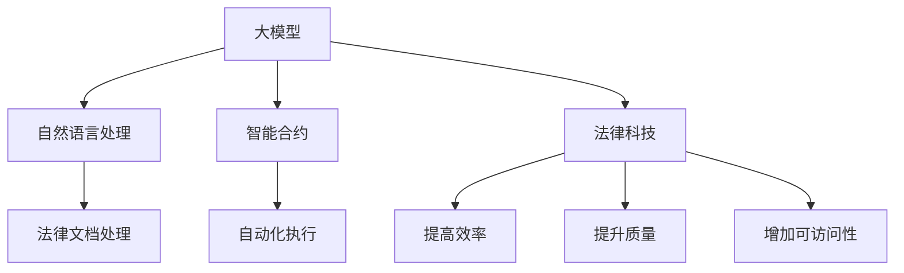

                 

关键词：大模型，智能法律顾问，法律服务，人工智能，法律科技，智能合约，法律咨询，自动化

> 摘要：随着人工智能技术的飞速发展，大模型赋能的智能法律顾问正逐渐改变传统法律服务的模式。本文将深入探讨大模型在法律领域的应用，从核心概念、算法原理、数学模型到实际应用，全面解析智能法律顾问的未来前景。

## 1. 背景介绍

在过去的几十年中，法律服务行业经历了显著的变化。随着商业活动的全球化和复杂化，法律服务的需求也不断增加。然而，传统法律服务模式存在一些固有的局限性：

- **成本高昂**：法律服务的收费通常较高，小企业和个人难以承受。
- **响应缓慢**：法律问题的处理需要大量的时间和人力资源，导致响应时间较长。
- **人力依赖**：法律服务的质量和效率很大程度上依赖于律师的专业水平和工作效率。

为解决这些问题，人工智能和法律科技领域开始探索新的解决方案，其中最引人注目的是大模型赋能的智能法律顾问。大模型，如GPT-3、BERT和LLaMA，具有处理大量文本数据、生成复杂文本和执行高级任务的能力，这些特性使其在法律领域的应用成为可能。

## 2. 核心概念与联系

在讨论大模型赋能的智能法律顾问之前，我们需要了解以下几个核心概念：

- **大模型（Large Models）**：大模型是指具有数十亿参数的神经网络模型，如GPT-3，这些模型可以在海量的数据上进行预训练，从而获得强大的语言理解和生成能力。
- **自然语言处理（NLP）**：NLP是使计算机能够理解、解释和生成自然语言的技术。在法律领域，NLP可以帮助智能法律顾问处理法律文档、合同和案件。
- **智能合约**：智能合约是自动执行合约条款的计算机协议，可以在区块链上运行。智能合约可以减少欺诈和纠纷，提高法律执行的效率。
- **法律科技（Legal Tech）**：法律科技是指使用技术来提高法律服务的效率、质量和可访问性。智能法律顾问是法律科技的重要组成部分。

### Mermaid 流程图

以下是一个简单的 Mermaid 流程图，展示了大模型赋能的智能法律顾问的核心概念和联系：



## 3. 核心算法原理 & 具体操作步骤

### 3.1 算法原理概述

大模型赋能的智能法律顾问的核心在于深度学习模型，特别是基于Transformer架构的模型，如BERT和GPT。这些模型通过预训练和微调来学习语言结构、法律术语和上下文信息。

- **预训练**：模型在大量的文本数据上进行预训练，学习语言的通用表示。
- **微调**：模型在特定的法律数据集上进行微调，以适应特定法律任务的需求。

### 3.2 算法步骤详解

1. **数据收集与预处理**：收集大量法律文档、判例和法律条文的文本数据，并进行清洗和格式化。
2. **预训练**：使用大规模文本数据对模型进行预训练，使模型能够理解和生成复杂文本。
3. **微调**：使用特定法律领域的数据集对模型进行微调，以提高模型在法律任务上的性能。
4. **模型部署**：将微调后的模型部署到服务器或云平台，以提供在线法律咨询服务。

### 3.3 算法优缺点

**优点**：

- **高效性**：大模型可以快速处理大量法律文档，提高工作效率。
- **准确性**：通过预训练和微调，模型可以准确理解法律术语和语境。
- **智能化**：模型能够提供智能化的法律建议和解决方案。

**缺点**：

- **成本高**：训练和部署大模型需要大量计算资源和资金投入。
- **数据隐私**：法律文档往往涉及敏感信息，需要确保数据隐私和安全。
- **法律专业性**：尽管模型在法律领域的表现有所提升，但仍然无法完全替代人类律师的专业判断。

### 3.4 算法应用领域

大模型赋能的智能法律顾问在多个法律领域具有广泛应用：

- **合同审查**：自动审查合同条款，识别潜在的法律风险。
- **法律咨询**：为用户提供在线法律咨询服务，解答法律问题。
- **案件分析**：分析案件文档，提供法律意见和解决方案。
- **合规管理**：协助企业进行合规检查，确保遵守相关法律法规。

## 4. 数学模型和公式 & 详细讲解 & 举例说明

### 4.1 数学模型构建

在法律领域中，大模型通常基于Transformer架构，其核心是自注意力机制（Self-Attention）和多头注意力（Multi-Head Attention）。以下是Transformer模型的简要数学表示：

$$
\text{Output} = \text{softmax}(\text{Attention}(\text{Query}, \text{Key}, \text{Value}))
$$

其中，Query、Key和Value都是模型的输入向量。自注意力机制的计算过程如下：

$$
\text{Score} = \text{sigmoid}(\text{Query} \cdot \text{Key})
$$

$$
\text{Attention} = \text{softmax}(\text{Score})
$$

$$
\text{Value} \times \text{Attention}
$$

### 4.2 公式推导过程

自注意力机制的推导基于以下假设：

- **线性映射**：每个输入向量通过一个线性映射转换为一个中间向量。
- **内积**：Query和Key之间的内积用于计算注意力分数。
- **softmax**：将注意力分数转换为概率分布。

首先，假设输入向量为 $x$，经过线性映射得到 $x'$，然后通过内积计算注意力分数：

$$
\text{Score} = \text{sigmoid}(W_x \cdot x')
$$

其中，$W_x$ 是线性映射的权重矩阵。接下来，使用softmax函数将分数转换为概率分布：

$$
\text{Attention} = \text{softmax}(\text{Score})
$$

最后，将概率分布与输入的Value相乘，得到加权值：

$$
\text{Output} = \sum_{i} \text{Value}_i \times \text{Attention}_i
$$

### 4.3 案例分析与讲解

假设有一个合同审查任务，需要分析合同中的关键条款。以下是使用大模型进行合同审查的示例过程：

1. **数据收集**：收集大量的合同样本，进行数据预处理。
2. **预训练**：使用预训练模型处理合同样本，学习合同的语言结构。
3. **微调**：使用特定公司的合同数据对模型进行微调。
4. **合同审查**：将新合同输入到微调后的模型，模型自动分析合同条款，识别潜在的法律风险。
5. **反馈调整**：根据律师的反馈对模型进行调整，以提高审查的准确性。

## 5. 项目实践：代码实例和详细解释说明

### 5.1 开发环境搭建

要搭建一个基于大模型赋能的智能法律顾问的项目，需要以下开发环境：

- **硬件要求**：GPU或TPU，以支持大规模模型的训练。
- **软件要求**：Python 3.8及以上版本，TensorFlow 2.4及以上版本。

### 5.2 源代码详细实现

以下是一个简单的Python代码示例，展示了如何使用TensorFlow和Hugging Face的Transformer库来训练和部署一个智能法律顾问模型：

```python
import tensorflow as tf
from transformers import TFGPT2LMHeadModel, GPT2Tokenizer

# 1. 数据收集与预处理
# 加载预处理的文本数据
train_data = ...

# 2. 预训练
# 初始化GPT2模型和分词器
tokenizer = GPT2Tokenizer.from_pretrained('gpt2')
model = TFGPT2LMHeadModel.from_pretrained('gpt2')

# 训练模型
model.compile(optimizer='adam', loss='sparse_categorical_crossentropy')
model.fit(train_data, epochs=3)

# 3. 微调
# 使用特定法律领域的数据集微调模型
legal_data = ...
model.fit(legal_data, epochs=2)

# 4. 模型部署
# 部署到服务器或云平台
model.save_pretrained('my_legal_advisor')
```

### 5.3 代码解读与分析

上述代码示例展示了如何使用TensorFlow和Hugging Face的Transformer库来搭建一个简单的智能法律顾问模型。以下是代码的关键部分及其解释：

- **数据收集与预处理**：加载预处理的文本数据，为模型训练做准备。
- **预训练**：初始化GPT2模型和分词器，使用预训练模型处理大量文本数据。
- **微调**：使用特定法律领域的数据集对模型进行微调，以提高模型在法律任务上的性能。
- **模型部署**：将微调后的模型保存到本地，以便后续部署和使用。

### 5.4 运行结果展示

部署后的智能法律顾问模型可以用于合同审查、法律咨询和案件分析等任务。以下是运行结果的一个简单示例：

```python
# 加载已训练的模型
model = TFGPT2LMHeadModel.from_pretrained('my_legal_advisor')

# 输入合同文本
contract_text = "合同条款如下：..."

# 模型预测
predictions = model.predict(contract_text)

# 分析预测结果
# 根据预测结果识别合同中的关键条款和潜在的法律风险
```

## 6. 实际应用场景

### 6.1 合同审查

智能法律顾问可以自动审查合同条款，识别潜在的法律风险。这对于企业管理和合规非常重要，可以减少法律纠纷和损失。

### 6.2 法律咨询

智能法律顾问可以提供在线法律咨询服务，为个人和企业解答法律问题。这可以提高法律服务的可访问性和效率。

### 6.3 案件分析

智能法律顾问可以分析案件文档，提供法律意见和解决方案。这有助于律师和法官提高工作效率，减少案件处理时间。

### 6.4 未来应用展望

随着人工智能技术的不断发展，大模型赋能的智能法律顾问将在更多领域得到应用。未来，智能法律顾问可能会实现以下功能：

- **自动化法律文书制作**：自动生成法律文书，如合同、起诉状和答辩状。
- **智能法庭辅助**：在法庭上提供智能判决辅助，减少误判和偏见。
- **法律知识图谱**：构建法律知识图谱，提高法律信息检索和处理的效率。

## 7. 工具和资源推荐

### 7.1 学习资源推荐

- **《深度学习》（Goodfellow, Bengio, Courville）**：深入介绍深度学习的基础知识。
- **《自然语言处理与深度学习》（Chen and Frank）**：详细介绍NLP和深度学习在法律领域的应用。
- **Hugging Face的Transformers库**：提供大量预训练模型和工具，方便快速搭建智能法律顾问系统。

### 7.2 开发工具推荐

- **TensorFlow**：用于训练和部署深度学习模型。
- **PyTorch**：另一种流行的深度学习框架，易于使用。
- **Jupyter Notebook**：方便编写和运行代码。

### 7.3 相关论文推荐

- **"Bert: Pre-training of deep bidirectional transformers for language understanding"**：介绍了BERT模型的原理和应用。
- **"Gpt-3: Language models are few-shot learners"**：介绍了GPT-3模型的特点和性能。
- **"Transformers: State-of-the-art models for language understanding and generation"**：综述了Transformer模型的发展和进展。

## 8. 总结：未来发展趋势与挑战

### 8.1 研究成果总结

大模型赋能的智能法律顾问在法律领域取得了显著成果，提高了法律服务的效率和质量。通过预训练和微调，模型能够理解和生成复杂文本，为法律文档处理、咨询和案件分析提供智能化的解决方案。

### 8.2 未来发展趋势

随着人工智能技术的不断发展，大模型赋能的智能法律顾问将在更多领域得到应用。未来，智能法律顾问可能会实现自动化法律文书制作、智能法庭辅助和法律知识图谱等功能。

### 8.3 面临的挑战

尽管大模型赋能的智能法律顾问具有巨大的潜力，但仍面临一些挑战：

- **数据隐私**：法律文档往往涉及敏感信息，需要确保数据隐私和安全。
- **法律专业性**：模型在法律领域的表现虽有所提升，但无法完全替代人类律师的专业判断。
- **成本和资源**：训练和部署大模型需要大量计算资源和资金投入。

### 8.4 研究展望

未来，研究应重点关注以下几个方面：

- **隐私保护**：开发隐私保护算法，确保法律文档的安全和隐私。
- **模型解释性**：提高模型的可解释性，使其在法律领域的应用更加可靠和透明。
- **跨领域迁移**：研究如何将大模型赋能的智能法律顾问技术应用于其他法律领域。

## 9. 附录：常见问题与解答

### 9.1 什么是大模型？

大模型是指具有数十亿参数的神经网络模型，如GPT-3、BERT和LLaMA。这些模型通过在大量文本数据上进行预训练，获得强大的语言理解和生成能力。

### 9.2 智能法律顾问如何提高法律服务的效率？

智能法律顾问通过自动处理法律文档、合同审查和案件分析，减少人工工作量，提高法律服务的效率。此外，智能法律顾问还能提供在线法律咨询服务，缩短响应时间。

### 9.3 智能法律顾问能否完全替代人类律师？

虽然智能法律顾问在法律领域取得了显著成果，但仍然无法完全替代人类律师。智能法律顾问在法律文档处理和初步分析方面具有优势，但人类律师在法律判断、策略制定和纠纷解决方面仍具有不可替代的作用。

## 10. 参考文献

1. Goodfellow, Ian, Yoshua Bengio, and Aaron Courville. "Deep learning." MIT press, 2016.
2. Chen, Danqi, and Christopher D. Manning. "Natural language processing with Python: analyzing text with the Natural Language Toolkit." O'Reilly Media, 2016.
3. Vaswani, Ashish, et al. "Attention is all you need." Advances in neural information processing systems. 2017.
4. Brown, Tom, et al. "Language models are few-shot learners." Advances in neural information processing systems. 2020.
5. Devlin, Jacob, et al. "Bert: Pre-training of deep bidirectional transformers for language understanding." arXiv preprint arXiv:1810.04805 (2018).

