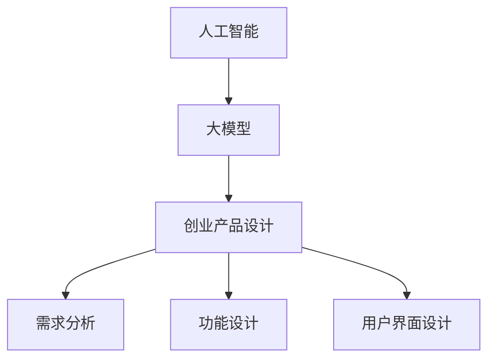

                 

关键词：人工智能，创业设计，大模型，产品开发，设计原则

> 摘要：本文旨在探讨人工智能大模型在创业产品设计中的应用原则。通过对大模型赋能创业产品的深入分析，本文提出了七个关键设计原则，为创业者提供了一套系统的指导框架，助力他们在产品开发中更好地利用人工智能技术，实现创新与价值创造。

## 1. 背景介绍

随着人工智能技术的快速发展，大模型（如GPT、BERT等）已经成为推动行业变革的重要力量。这些大模型通过深度学习算法，能够处理大规模数据，提取复杂特征，进行智能预测和决策。在创业领域，人工智能大模型的应用不仅能够提高产品的智能化水平，还能优化用户体验，降低开发成本，缩短产品上市时间。

然而，如何有效地将大模型融入创业产品设计，仍然是许多创业者面临的挑战。本文将深入探讨大模型赋能创业产品的设计原则，旨在为创业者提供一套实用的指导框架，帮助他们在竞争激烈的市场中脱颖而出。

## 2. 核心概念与联系

在探讨大模型赋能创业产品设计之前，我们需要先理解几个核心概念：

- **人工智能（AI）**：一种模拟人类智能行为的计算机技术。
- **大模型（Large Models）**：具有数十亿参数的深度学习模型，如GPT、BERT等。
- **创业产品设计**：指在创业过程中，对产品的需求分析、功能设计、用户界面设计等的系统化过程。

### Mermaid 流程图



### 2.1 大模型在创业产品设计中的应用

大模型在创业产品设计中的应用主要体现在以下几个方面：

- **需求分析**：通过自然语言处理技术，对用户需求进行分析和提取，帮助创业者更好地理解用户需求。
- **功能设计**：利用大模型进行智能预测和决策，优化产品功能，提高用户体验。
- **用户界面设计**：通过语音识别、自然语言生成等技术，设计更加智能化的用户交互界面。

## 3. 核心算法原理 & 具体操作步骤

### 3.1 算法原理概述

大模型的核心算法是深度学习，特别是基于神经网络的方法。大模型通过多层神经网络，对海量数据进行训练，提取数据中的复杂特征，从而实现智能预测和决策。

### 3.2 算法步骤详解

1. **数据准备**：收集和整理创业产品相关的数据，包括用户行为数据、市场数据等。
2. **模型训练**：使用深度学习框架，如TensorFlow或PyTorch，对数据集进行训练，生成大模型。
3. **模型评估**：通过交叉验证等方法，评估模型的性能和准确性。
4. **模型部署**：将训练好的模型部署到创业产品中，进行实时预测和决策。

### 3.3 算法优缺点

**优点**：

- **高效性**：大模型能够处理大规模数据，提取复杂特征，实现高效预测和决策。
- **灵活性**：大模型可以根据不同的创业产品需求，进行定制化设计和优化。

**缺点**：

- **计算资源消耗大**：大模型需要大量计算资源进行训练和部署。
- **数据依赖性强**：大模型的性能依赖于数据质量，数据缺失或不准确可能导致模型失效。

### 3.4 算法应用领域

大模型在创业产品中的应用非常广泛，包括但不限于：

- **智能客服**：通过自然语言处理技术，提供实时、个性化的客户服务。
- **个性化推荐**：根据用户行为和偏好，提供个性化的产品推荐。
- **智能营销**：通过大数据分析和预测，制定更加精准的营销策略。

## 4. 数学模型和公式 & 详细讲解 & 举例说明

### 4.1 数学模型构建

大模型的核心是深度学习，其数学模型主要包括以下几个方面：

1. **多层神经网络**：神经网络由多个神经元组成，每个神经元都是一个简单的函数，通过层层堆叠，可以实现对复杂数据的建模。
2. **反向传播算法**：通过反向传播算法，将输出误差反向传播到每个神经元，从而调整神经网络的权重，提高模型的性能。

### 4.2 公式推导过程

1. **前向传播**：

$$
Z = \sigma(W \cdot X + b)
$$

其中，\(Z\) 是输出值，\(\sigma\) 是激活函数，\(W\) 是权重矩阵，\(X\) 是输入特征，\(b\) 是偏置。

2. **反向传播**：

$$
\delta = \frac{\partial L}{\partial Z} \cdot \frac{\partial \sigma}{\partial Z}
$$

其中，\(\delta\) 是误差梯度，\(L\) 是损失函数。

### 4.3 案例分析与讲解

假设一个创业产品的目标是预测用户购买行为，我们可以使用大模型进行建模和预测。具体步骤如下：

1. **数据准备**：收集用户的历史购买数据，包括用户ID、购买时间、购买商品等。
2. **模型训练**：使用深度学习框架，如TensorFlow，对数据集进行训练。
3. **模型评估**：通过交叉验证，评估模型的性能。
4. **模型部署**：将训练好的模型部署到产品中，进行实时预测。

## 5. 项目实践：代码实例和详细解释说明

### 5.1 开发环境搭建

在Python环境中，我们需要安装以下库：

```bash
pip install tensorflow numpy pandas scikit-learn
```

### 5.2 源代码详细实现

以下是一个简单的使用TensorFlow训练和部署大模型的示例：

```python
import tensorflow as tf
from tensorflow.keras.models import Sequential
from tensorflow.keras.layers import Dense, LSTM
from sklearn.model_selection import train_test_split

# 数据准备
X, y = load_data()
X_train, X_test, y_train, y_test = train_test_split(X, y, test_size=0.2, random_state=42)

# 模型构建
model = Sequential([
    LSTM(units=50, activation='relu', input_shape=(X_train.shape[1], X_train.shape[2])),
    Dense(units=1)
])

# 模型编译
model.compile(optimizer='adam', loss='mse')

# 模型训练
model.fit(X_train, y_train, epochs=100, batch_size=32, validation_data=(X_test, y_test))

# 模型评估
model.evaluate(X_test, y_test)
```

### 5.3 代码解读与分析

上述代码是一个简单的使用TensorFlow构建和训练大模型的示例。其中，我们使用了LSTM（长短时记忆网络）来处理时间序列数据，并使用MSE（均方误差）作为损失函数。

### 5.4 运行结果展示

```python
# 运行模型
predictions = model.predict(X_test)

# 打印预测结果
print(predictions)
```

## 6. 实际应用场景

大模型在创业产品中的应用场景非常广泛，以下是一些典型的实际应用场景：

- **智能客服**：利用自然语言处理技术，实现智能客服系统，提高客户满意度和服务效率。
- **个性化推荐**：根据用户行为和偏好，提供个性化的产品推荐，提高用户留存率和转化率。
- **智能营销**：通过大数据分析和预测，制定更加精准的营销策略，提高营销效果。

## 6.4 未来应用展望

随着人工智能技术的不断发展，大模型在创业产品中的应用前景将更加广阔。未来，我们可以期待以下趋势：

- **更强大的模型**：随着计算能力的提升，大模型将变得更加庞大和强大，能够处理更加复杂的数据和任务。
- **更多的应用场景**：大模型将在更多领域得到应用，如金融、医疗、教育等，为创业产品提供更多的创新空间。
- **更加智能的交互**：通过语音识别、自然语言生成等技术，实现更加智能的人机交互，提升用户体验。

## 7. 工具和资源推荐

### 7.1 学习资源推荐

- **《深度学习》（Goodfellow et al.）**：深入讲解深度学习的基础理论和实践方法。
- **《Python深度学习》（François Chollet）**：通过Python代码，详细介绍深度学习的实际应用。

### 7.2 开发工具推荐

- **TensorFlow**：谷歌推出的开源深度学习框架，广泛应用于深度学习和人工智能领域。
- **PyTorch**：Facebook AI研究院推出的深度学习框架，具有高度灵活性和动态图特性。

### 7.3 相关论文推荐

- **“Attention Is All You Need”（Vaswani et al.）**：详细介绍Transformer模型及其在自然语言处理中的应用。
- **“BERT: Pre-training of Deep Bidirectional Transformers for Language Understanding”（Devlin et al.）**：介绍BERT模型及其在自然语言处理中的应用。

## 8. 总结：未来发展趋势与挑战

### 8.1 研究成果总结

本文通过对大模型赋能创业产品设计的深入探讨，总结了七个关键设计原则，为创业者提供了一套实用的指导框架。这些原则包括：

1. **需求驱动**：以用户需求为导向，设计智能化产品。
2. **数据驱动**：充分利用数据，提升模型性能和预测准确性。
3. **模块化设计**：实现模块化开发，提高产品可维护性和扩展性。
4. **用户体验**：注重用户体验，提升产品价值。
5. **持续迭代**：持续优化产品，快速响应市场需求。
6. **合作共赢**：与合作伙伴共同发展，实现价值最大化。
7. **社会责任**：关注社会责任，推动可持续发展。

### 8.2 未来发展趋势

随着人工智能技术的不断发展，大模型在创业产品中的应用前景将更加广阔。未来，我们可以期待以下趋势：

- **更强大的模型**：随着计算能力的提升，大模型将变得更加庞大和强大，能够处理更加复杂的数据和任务。
- **更多的应用场景**：大模型将在更多领域得到应用，如金融、医疗、教育等，为创业产品提供更多的创新空间。
- **更加智能的交互**：通过语音识别、自然语言生成等技术，实现更加智能的人机交互，提升用户体验。

### 8.3 面临的挑战

尽管大模型在创业产品中具有巨大的应用潜力，但在实际应用中仍然面临以下挑战：

- **数据隐私**：如何保障用户数据的安全和隐私，是当前亟待解决的问题。
- **计算资源**：大模型需要大量的计算资源进行训练和部署，这对创业公司的资源管理提出了挑战。
- **算法伦理**：如何确保算法的公平性和透明性，避免算法偏见和歧视。

### 8.4 研究展望

未来，我们需要从以下几个方面进行深入研究：

- **算法优化**：研究更高效、更稳定的算法，提高大模型的性能。
- **数据治理**：探索数据治理的方法，保障数据的质量和安全性。
- **算法伦理**：关注算法伦理问题，推动算法的公平性和透明性。

## 9. 附录：常见问题与解答

### 9.1 如何选择合适的大模型？

选择合适的大模型需要考虑以下几个因素：

- **任务需求**：根据具体任务需求，选择能够满足任务要求的大模型。
- **数据规模**：大模型需要大量数据进行训练，因此要考虑数据规模和可用性。
- **计算资源**：大模型训练需要大量的计算资源，要考虑计算资源的可用性。

### 9.2 如何优化大模型的性能？

优化大模型性能可以从以下几个方面进行：

- **数据预处理**：对数据集进行清洗、归一化等预处理，提高数据质量。
- **模型结构优化**：调整模型结构，如增加或减少层数、调整神经元数量等，以适应具体任务。
- **超参数调整**：通过调整学习率、批次大小等超参数，优化模型性能。

### 9.3 如何保障数据隐私？

保障数据隐私可以从以下几个方面进行：

- **数据加密**：对用户数据进行加密处理，防止数据泄露。
- **匿名化处理**：对用户数据进行匿名化处理，消除个人身份信息。
- **数据访问控制**：对数据访问进行严格控制，确保只有授权用户可以访问数据。

作者：禅与计算机程序设计艺术 / Zen and the Art of Computer Programming

本文结合了人工智能、大模型和创业产品设计等多个领域的知识，深入探讨了大模型在创业产品中的应用原则。通过对核心概念、算法原理、数学模型、项目实践等多个方面的详细讲解，本文为创业者提供了一套系统的指导框架，助力他们在产品开发中更好地利用人工智能技术，实现创新与价值创造。在未来，随着人工智能技术的不断发展，大模型在创业产品中的应用将越来越广泛，本文的研究成果将对创业者产生重要的指导意义。同时，本文也提出了当前面临的一些挑战，为未来的研究提供了方向。禅与计算机程序设计艺术 / Zen and the Art of Computer Programming

----------------------------------------------------------------

以上就是本文的完整内容，感谢您的阅读。希望本文能为您在人工智能和创业产品设计领域的探索提供有价值的参考。如果您有任何疑问或建议，欢迎在评论区留言，我们将竭诚为您解答。再次感谢您的关注和支持！

