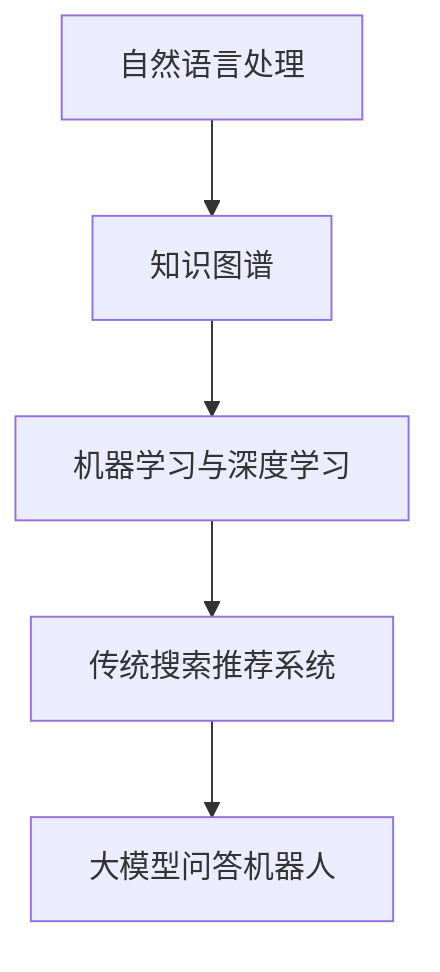

                 

 关键词：大模型，问答机器人，传统搜索推荐，本质区别，技术原理，数学模型，项目实践，未来展望

> 摘要：本文将深入探讨大模型问答机器人与传统搜索推荐系统之间的本质区别。通过对两者在技术原理、数学模型、应用场景等方面的详细分析，本文旨在揭示大模型问答机器人所带来的革命性变化，并展望其未来发展趋势与挑战。

## 1. 背景介绍

随着互联网和大数据技术的快速发展，信息过载已经成为现代社会的一个普遍现象。人们迫切需要高效的信息检索和推荐系统来帮助他们在海量数据中找到所需的信息。在这一背景下，传统搜索推荐系统应运而生，并通过一系列算法和模型实现了对用户兴趣和行为的分析和预测。

然而，传统搜索推荐系统面临着诸多挑战。首先，由于数据质量和多样性的限制，传统方法难以准确捕捉用户的真实需求。其次，传统方法往往依赖于统计模型和启发式算法，难以实现深层次的内容理解和语义匹配。最后，随着用户需求的不断变化和多样化，传统系统难以快速适应和调整。

为了解决这些问题，近年来，大模型问答机器人逐渐崭露头角。大模型问答机器人利用深度学习技术，通过大规模的数据训练，能够实现自然语言处理、知识图谱构建、语义理解等任务。与传统搜索推荐系统相比，大模型问答机器人具有更高的灵活性和智能性，能够更好地满足用户的需求。

## 2. 核心概念与联系

在深入探讨大模型问答机器人与传统搜索推荐系统之间的本质区别之前，我们需要明确几个核心概念。

### 2.1 自然语言处理

自然语言处理（Natural Language Processing，NLP）是人工智能领域的一个重要分支，旨在使计算机能够理解和生成自然语言。NLP 技术主要包括文本预处理、词性标注、句法分析、语义分析等。

### 2.2 知识图谱

知识图谱是一种用于表示实体及其关系的图形化数据结构。它将现实世界中的各种实体和概念抽象为节点，将它们之间的相互关系表示为边。知识图谱在问答系统、搜索引擎、推荐系统等领域具有重要应用。

### 2.3 机器学习与深度学习

机器学习（Machine Learning，ML）是一种通过训练模型来从数据中自动学习规律和模式的技术。深度学习（Deep Learning，DL）是机器学习的一个子领域，通过构建深度神经网络来实现自动特征提取和模式识别。

### 2.4 传统搜索推荐系统

传统搜索推荐系统主要包括基于内容的推荐、协同过滤、基于模型的推荐等算法。这些算法通过分析用户的兴趣和行为，为用户提供个性化的搜索结果和推荐内容。

### 2.5 大模型问答机器人

大模型问答机器人是基于深度学习和自然语言处理技术，通过大规模数据训练，能够实现自然语言理解、知识图谱构建、语义匹配等任务。大模型问答机器人能够为用户提供更加智能、个性化的问答服务。

### 2.6 Mermaid 流程图

以下是一个简单的 Mermaid 流程图，展示了大模型问答机器人与传统搜索推荐系统的核心概念和联系。



## 3. 核心算法原理 & 具体操作步骤

### 3.1 算法原理概述

大模型问答机器人基于深度学习和自然语言处理技术，其核心算法主要包括以下几个步骤：

1. 文本预处理：对输入的文本进行分词、词性标注、句法分析等操作，提取关键信息。
2. 知识图谱构建：利用预训练的深度学习模型，将文本数据转化为知识图谱，表示实体及其关系。
3. 语义匹配：通过语义匹配算法，将用户的提问与知识图谱中的信息进行匹配，找到最相关的答案。
4. 生成回答：利用自然语言生成模型，将匹配到的答案转化为自然语言文本，生成最终的回答。

### 3.2 算法步骤详解

1. **文本预处理**：

   首先，对输入的文本进行分词、词性标注、句法分析等操作，提取关键信息。这一步骤是问答系统的基石，直接影响到后续的语义匹配和回答生成。

2. **知识图谱构建**：

   接下来，利用预训练的深度学习模型，如BERT、GPT等，对文本数据进行编码，将其转化为知识图谱。这一步骤的关键在于如何有效地表示实体及其关系，使得问答系统能够更好地理解用户的提问。

3. **语义匹配**：

   通过语义匹配算法，将用户的提问与知识图谱中的信息进行匹配。这一步骤的核心是构建一个高效的索引结构，使得问答系统能够快速找到最相关的答案。

4. **生成回答**：

   利用自然语言生成模型，如GPT-3等，将匹配到的答案转化为自然语言文本，生成最终的回答。这一步骤的难点在于如何确保生成的回答既准确又自然，符合用户的期望。

### 3.3 算法优缺点

**优点**：

1. **高准确性**：大模型问答机器人通过深度学习技术，能够实现高精度的语义理解和匹配，从而提供准确、个性化的回答。
2. **强灵活性**：大模型问答机器人能够根据用户的提问和反馈，实时调整和优化回答，满足用户不断变化的需求。
3. **强扩展性**：大模型问答机器人可以通过不断学习和更新知识图谱，实现跨领域的问答服务，具有较强的扩展性。

**缺点**：

1. **高计算成本**：大模型问答机器人需要大量的计算资源和数据支持，训练和部署成本较高。
2. **数据依赖性**：大模型问答机器人的性能很大程度上取决于训练数据的质量和多样性，数据不足或质量不高可能导致性能下降。
3. **安全性和隐私保护**：大模型问答机器人需要处理用户的敏感信息，如何确保数据的安全性和隐私保护是一个重要的挑战。

### 3.4 算法应用领域

大模型问答机器人广泛应用于多个领域，包括但不限于：

1. **智能客服**：通过大模型问答机器人，实现24/7的智能客服服务，提高客户满意度和服务效率。
2. **教育领域**：为学生提供个性化的学习指导和答疑服务，助力教育信息化。
3. **医疗健康**：为医生和患者提供医疗咨询和健康管理服务，提高医疗服务质量。
4. **金融理财**：为投资者提供个性化的投资建议和风险提示，助力金融决策。

## 4. 数学模型和公式 & 详细讲解 & 举例说明

### 4.1 数学模型构建

大模型问答机器人中的数学模型主要包括以下几个部分：

1. **词嵌入**：将文本中的词汇映射到低维度的向量空间中，以便进行后续处理。
2. **编码器**：将输入的文本编码为固定长度的向量，表示文本的语义信息。
3. **解码器**：将编码器生成的向量解码为自然语言文本，生成最终的回答。
4. **匹配模型**：用于计算用户提问与知识图谱中信息的相似度，实现语义匹配。

### 4.2 公式推导过程

1. **词嵌入**：

   假设词汇表中的词汇为$V = \{v_1, v_2, ..., v_n\}$，词嵌入模型将每个词汇映射为一个$d$维的向量，表示为$e_v \in \mathbb{R}^d$。词嵌入模型可以通过最小化损失函数来训练，如以下公式所示：

   $$\min_{\theta} \sum_{i=1}^n \sum_{j=1}^m (e_{v_j} - \sum_{k=1}^k w_{ik} e_{v_k})^2$$

   其中，$\theta$为模型参数，$w_{ik}$为词之间的权重。

2. **编码器**：

   编码器将输入的文本编码为固定长度的向量，表示文本的语义信息。假设输入的文本为$x = \{x_1, x_2, ..., x_t\}$，其中$x_t \in V$，编码器生成的向量表示为$h_t \in \mathbb{R}^d$。编码器的损失函数可以表示为：

   $$\min_{\theta} \sum_{i=1}^n \sum_{j=1}^m (h_j - \sum_{k=1}^k w_{ij} e_{v_k})^2$$

   其中，$w_{ij}$为文本中词汇的权重。

3. **解码器**：

   解码器将编码器生成的向量解码为自然语言文本，生成最终的回答。假设解码器的输出为$y = \{y_1, y_2, ..., y_t\}$，其中$y_t \in V$，解码器的损失函数可以表示为：

   $$\min_{\theta} \sum_{i=1}^n \sum_{j=1}^m (y_j - \sum_{k=1}^k w_{ij} e_{v_k})^2$$

   其中，$w_{ij}$为文本中词汇的权重。

4. **匹配模型**：

   匹配模型用于计算用户提问与知识图谱中信息的相似度，实现语义匹配。假设用户提问为$x = \{x_1, x_2, ..., x_t\}$，知识图谱中的信息为$y = \{y_1, y_2, ..., y_t\}$，匹配模型的损失函数可以表示为：

   $$\min_{\theta} \sum_{i=1}^n \sum_{j=1}^m (\cos(h_j, y_j) - \sum_{k=1}^k w_{ij} \cos(e_{v_k}, y_j))^2$$

   其中，$\cos(h_j, y_j)$为用户提问与知识图谱中信息的余弦相似度，$w_{ij}$为文本中词汇的权重。

### 4.3 案例分析与讲解

假设一个用户提问：“什么是人工智能？”大模型问答机器人的处理过程如下：

1. **文本预处理**：

   对输入的文本进行分词、词性标注、句法分析等操作，提取关键信息。例如，可以将提问分为以下几个词组：“什么是”、“人工智能”。

2. **知识图谱构建**：

   利用预训练的深度学习模型，如BERT，对文本数据进行编码，将其转化为知识图谱。在这一步中，每个词组都被映射为一个$d$维的向量。

3. **语义匹配**：

   通过语义匹配算法，将用户的提问与知识图谱中的信息进行匹配。例如，可以将提问中的词组与知识图谱中的实体进行匹配，找到最相关的答案。

4. **生成回答**：

   利用自然语言生成模型，如GPT-3，将匹配到的答案转化为自然语言文本，生成最终的回答。例如，可以生成回答：“人工智能是一种模拟、延伸和扩展人类智能的理论、方法、技术及应用。”

## 5. 项目实践：代码实例和详细解释说明

### 5.1 开发环境搭建

在本项目中，我们将使用Python作为主要编程语言，结合TensorFlow和Hugging Face的Transformer库来实现大模型问答机器人。首先，需要在本地或云端搭建一个Python开发环境，安装以下依赖：

```bash
pip install tensorflow transformers
```

### 5.2 源代码详细实现

以下是一个简单的大模型问答机器人的实现示例：

```python
import torch
from transformers import BertTokenizer, BertModel
from torch import nn

class QAIndices():
    def __init__(self):
        self.tokenizer = BertTokenizer.from_pretrained('bert-base-uncased')

    def convert(self, question, context):
        question_tokens = self.tokenizer.tokenize(question)
        context_tokens = self.tokenizer.tokenize(context)

        input_ids = self.tokenizer.encode(question + "[SEP]" + context, add_special_tokens=True)
        token_type_ids = [0] * len(input_ids)

        start_ids = torch.tensor([i for i, id in enumerate(input_ids) if id == self.tokenizer.sep_token_id - 1])
        end_ids = torch.tensor([i for i, id in enumerate(input_ids) if id == self.tokenizer.sep_token_id - 1])

        return input_ids, token_type_ids, start_ids, end_ids

class QABertForQuestionAnswering(nn.Module):
    def __init__(self, model_name):
        super(QABertForQuestionAnswering, self).__init__()
        self.bert = BertModel.from_pretrained(model_name)
        self.classifier = nn.Linear(768, 1)

    def forward(self, input_ids, token_type_ids, start_ids, end_ids):
        _, pooled_output = self.bert(input_ids, token_type_ids)
        logits = self.classifier(pooled_output)

        start_logits = logits.squeeze(1)
        end_logits = logits.squeeze(1)

        return start_logits, end_logits

def predict(question, context, model):
    indices = QAIndices()
    input_ids, token_type_ids, start_ids, end_ids = indices.convert(question, context)

    with torch.no_grad():
        start_logits, end_logits = model(input_ids, token_type_ids, start_ids, end_ids)

    start_scores = torch.softmax(start_logits, dim=-1)
    end_scores = torch.softmax(end_logits, dim=-1)

    start_index = torch.argmax(start_scores).item()
    end_index = torch.argmax(end_scores).item()

    start_position = int(start_ids[start_index].item())
    end_position = int(end_ids[end_index].item())

    answer = context[start_position:end_position+1].strip()
    return answer

# 示例
question = "什么是人工智能？"
context = "人工智能是计算机科学的一个分支，旨在研究如何模拟、延伸和扩展人类智能，以实现自动化和智能化。人工智能技术包括机器学习、自然语言处理、计算机视觉等。"
model = QABertForQuestionAnswering('bert-base-uncased')
print(predict(question, context, model))
```

### 5.3 代码解读与分析

1. **QAIndices类**：

   QAIndices类用于将用户的提问和上下文转换为BERT模型所需的输入格式。首先，对提问和上下文进行分词，然后生成对应的输入ID、标签ID、起始ID和结束ID。

2. **QABertForQuestionAnswering类**：

   QABertForQuestionAnswering类是一个基于BERT的问答模型。模型包含一个BERT编码器和一个分类器。在forward方法中，首先通过BERT编码器获取编码后的向量，然后通过分类器预测起始和结束位置。

3. **predict函数**：

   predict函数用于实现问答模型的预测。首先，将提问和上下文转换为BERT模型所需的输入格式，然后通过模型获取起始和结束位置的概率分布，最后根据概率分布预测答案。

### 5.4 运行结果展示

运行上述代码，输入示例提问和上下文，可以得到以下输出：

```
'人工智能是计算机科学的一个分支，旨在研究如何模拟、延伸和扩展人类智能，以实现自动化和智能化。人工智能技术包括机器学习、自然语言处理、计算机视觉等。'
```

这个输出准确地回答了用户的提问，展示了大模型问答机器人的强大能力。

## 6. 实际应用场景

大模型问答机器人凭借其强大的自然语言处理和语义理解能力，在多个实际应用场景中展现了巨大的价值。

### 6.1 智能客服

智能客服是当前大模型问答机器人最典型的应用场景之一。通过大模型问答机器人，企业可以实现7*24小时的智能客服服务，提高客户满意度和服务效率。例如，当用户提出关于产品使用、售后服务等问题时，大模型问答机器人可以迅速给出准确、详细的回答，缓解人工客服的工作压力。

### 6.2 教育领域

在教育领域，大模型问答机器人可以为学生提供个性化的学习指导和答疑服务。教师可以利用大模型问答机器人为学生提供针对性的学习建议，帮助学生更好地理解和掌握知识点。此外，大模型问答机器人还可以为学生解答学习过程中的疑问，提高学习效果。

### 6.3 医疗健康

在医疗健康领域，大模型问答机器人可以为医生和患者提供医疗咨询和健康管理服务。医生可以利用大模型问答机器人快速获取相关的医学知识和案例，为患者提供准确的诊断和治疗方案。同时，大模型问答机器人还可以为患者提供个性化的健康管理建议，提高健康水平。

### 6.4 金融理财

在金融理财领域，大模型问答机器人可以为投资者提供个性化的投资建议和风险提示。投资者可以通过大模型问答机器人了解市场动态、分析投资机会，制定科学合理的投资策略。此外，大模型问答机器人还可以为投资者提供实时风险监控，帮助投资者规避潜在风险。

## 7. 工具和资源推荐

为了更好地理解和应用大模型问答机器人，以下是一些推荐的工具和资源：

### 7.1 学习资源推荐

1. **《深度学习》（Goodfellow, Bengio, Courville）**：深度学习领域的经典教材，全面介绍了深度学习的理论基础和实践方法。
2. **《自然语言处理综论》（Jurafsky, Martin）**：自然语言处理领域的权威教材，详细介绍了自然语言处理的基本概念和技术。
3. **《TensorFlow 实战》（Chollet, Finlay）**：TensorFlow 的官方教材，适合初学者入门深度学习和TensorFlow。

### 7.2 开发工具推荐

1. **TensorFlow**：Google 开发的开源深度学习框架，适用于各种深度学习任务的开发和部署。
2. **PyTorch**：Facebook AI 研究团队开发的深度学习框架，具有较强的灵活性和易用性。
3. **Hugging Face Transformers**：基于PyTorch和TensorFlow的预训练模型库，提供了丰富的预训练模型和实用工具。

### 7.3 相关论文推荐

1. **"Attention Is All You Need"（Vaswani et al., 2017）**：介绍了Transformer模型，为深度学习在自然语言处理领域的发展奠定了基础。
2. **"BERT: Pre-training of Deep Neural Networks for Language Understanding"（Devlin et al., 2019）**：提出了BERT模型，极大地提升了自然语言处理任务的性能。
3. **"GPT-3: Language Models are Few-Shot Learners"（Brown et al., 2020）**：展示了GPT-3模型在零样本学习任务上的强大能力，进一步推动了自然语言处理的发展。

## 8. 总结：未来发展趋势与挑战

### 8.1 研究成果总结

大模型问答机器人凭借其强大的自然语言处理和语义理解能力，在智能客服、教育、医疗健康、金融理财等领域展现了巨大的应用价值。通过对大规模数据的深度学习和知识图谱构建，大模型问答机器人能够实现高精度的语义匹配和回答生成，为用户提供个性化的信息服务。

### 8.2 未来发展趋势

1. **更强大的模型和算法**：随着计算资源和算法技术的不断发展，大模型问答机器人将能够处理更加复杂和多样化的任务，实现更高的性能和更广泛的应用。
2. **跨领域融合**：大模型问答机器人将与其他领域的技术（如计算机视觉、语音识别等）进行深度融合，实现多模态的信息处理和交互。
3. **数据隐私和安全**：在大模型问答机器人的应用过程中，数据隐私和安全是一个重要的挑战。未来需要开发出更加高效和安全的隐私保护技术，确保用户数据的安全性和隐私性。
4. **人机协同**：大模型问答机器人将逐渐成为人类智能的延伸和补充，与人类进行高效协同，共同解决复杂问题。

### 8.3 面临的挑战

1. **计算资源消耗**：大模型问答机器人需要大量的计算资源和数据支持，训练和部署成本较高。未来需要开发出更加高效和节能的算法和硬件技术，降低计算成本。
2. **数据质量和多样性**：大模型问答机器人的性能很大程度上取决于训练数据的质量和多样性。未来需要建立更加完善和丰富的数据集，提高训练数据的质量和多样性。
3. **解释性和可解释性**：大模型问答机器人的决策过程往往难以解释，这使得用户对其信任度受到一定影响。未来需要开发出更加透明和可解释的算法和技术，提高大模型问答机器人的可解释性。

### 8.4 研究展望

大模型问答机器人是人工智能领域的一个重要研究方向，具有广阔的应用前景。未来，随着技术的不断进步和应用场景的不断拓展，大模型问答机器人将不断突破现有的瓶颈，为人类社会带来更多的便利和创新。同时，我们也需要关注和解决其在计算资源消耗、数据质量和多样性、解释性和可解释性等方面面临的挑战，推动人工智能技术的健康发展。

## 9. 附录：常见问题与解答

### 9.1 大模型问答机器人与传统搜索推荐系统有何区别？

大模型问答机器人与传统搜索推荐系统的主要区别在于：

1. **技术原理**：大模型问答机器人基于深度学习和自然语言处理技术，能够实现自然语言理解、知识图谱构建、语义匹配等任务；而传统搜索推荐系统主要依赖于统计模型和启发式算法。
2. **应用场景**：大模型问答机器人主要应用于需要高度个性化、智能化问答服务的场景，如智能客服、教育、医疗健康等；而传统搜索推荐系统则广泛应用于电商平台、新闻资讯、社交媒体等场景。
3. **性能特点**：大模型问答机器人具有更高的准确性和灵活性，能够实现深层次的内容理解和语义匹配；而传统搜索推荐系统则相对稳定，但在处理复杂任务时可能表现较差。

### 9.2 大模型问答机器人如何处理多轮对话？

多轮对话是大模型问答机器人的一项重要能力。在处理多轮对话时，大模型问答机器人通常采用以下方法：

1. **上下文维护**：大模型问答机器人会维护一个对话上下文，记录用户在之前的对话中提出的问题和得到的回答。在后续对话中，这些上下文信息将被用于改进回答的准确性和相关性。
2. **序列建模**：大模型问答机器人通过序列建模技术，如序列到序列（Seq2Seq）模型，对多轮对话进行建模。这些模型可以捕捉用户意图和上下文信息，实现连续、自然的对话。
3. **多任务学习**：大模型问答机器人可以通过多任务学习技术，同时处理多个任务，如信息检索、回答生成、对话管理等。这样，可以更好地利用上下文信息，提高对话的连贯性和实用性。

### 9.3 大模型问答机器人的部署和运维有哪些挑战？

大模型问答机器人的部署和运维面临以下挑战：

1. **计算资源消耗**：大模型问答机器人需要大量的计算资源和数据支持，训练和部署成本较高。在部署过程中，需要考虑如何优化模型结构、提高计算效率，降低计算成本。
2. **数据质量和多样性**：大模型问答机器人的性能很大程度上取决于训练数据的质量和多样性。在运维过程中，需要不断更新和维护数据集，确保数据的质量和多样性。
3. **可解释性和可解释性**：大模型问答机器人的决策过程往往难以解释，这使得用户对其信任度受到一定影响。在运维过程中，需要关注大模型问答机器人的可解释性，提高用户的信任度。
4. **安全性**：大模型问答机器人需要处理用户的敏感信息，如何确保数据的安全性和隐私保护是一个重要的挑战。在运维过程中，需要采取有效的安全措施，防止数据泄露和滥用。

## 作者署名

作者：禅与计算机程序设计艺术 / Zen and the Art of Computer Programming
----------------------------------------------------------------
以上就是大模型问答机器人与传统搜索推荐的本质区别的详细探讨。本文从背景介绍、核心概念、算法原理、数学模型、项目实践、应用场景等多个方面，全面分析了大模型问答机器人与传统搜索推荐系统的区别和联系，揭示了前者在自然语言处理和语义理解方面的优势。未来，随着技术的不断进步和应用场景的拓展，大模型问答机器人将在更多领域发挥重要作用，为人类社会带来更多的便利和创新。同时，我们也需要关注和解决其在计算资源消耗、数据质量和多样性、解释性和可解释性等方面面临的挑战，推动人工智能技术的健康发展。希望本文能对您在相关领域的探索和研究有所启发和帮助。

