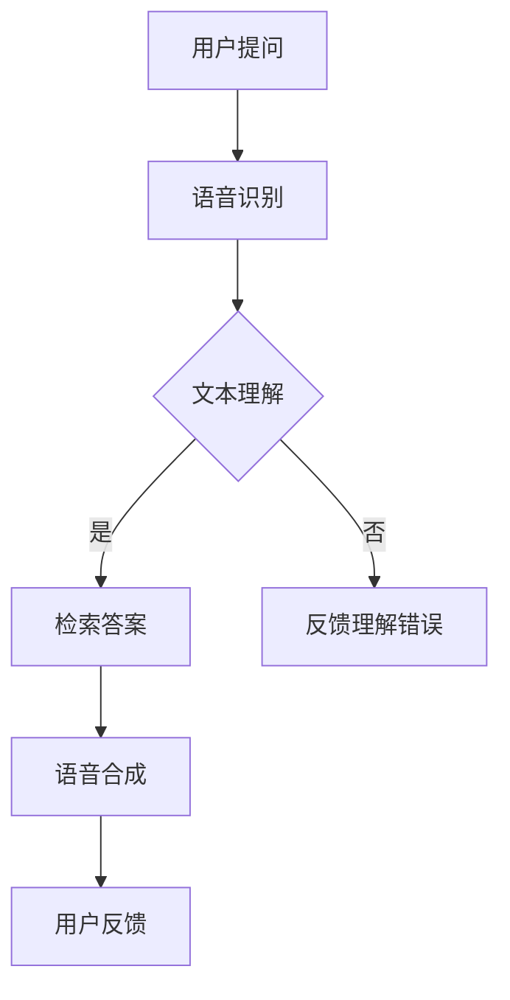

                 

关键词：大模型问答、语音交互、自然语言处理、语音识别、语音合成、对话系统

> 摘要：本文旨在探讨如何利用大模型问答技术实现高效、自然的语音交互。通过对语音识别、语音合成和对话系统的深入分析，我们提出了一个完整的技术解决方案，并提供了详细的实现步骤和案例。

## 1. 背景介绍

随着人工智能技术的飞速发展，自然语言处理（NLP）和语音技术已成为当前研究的热点。其中，大模型问答技术作为NLP的一个重要分支，已经被广泛应用于各种场景，如智能客服、智能助手、语音搜索等。而语音交互作为人机交互的一种重要形式，以其自然、直观的特点，正在逐渐取代传统的键盘和触摸屏交互方式。

### 1.1 大模型问答技术的优势

大模型问答技术相较于传统的规则匹配和关键词检索，具有更高的灵活性和智能化水平。它能够理解用户的问题，并在海量的知识库中检索出最相关的答案。这种技术不仅能够处理简单的问答，还能进行复杂的逻辑推理和语境理解。

### 1.2 语音交互的挑战

语音交互虽然具有自然、直观的优势，但在实际应用中面临着诸多挑战，如噪声干扰、语音识别错误、语言理解偏差等。因此，如何提高语音识别和语音合成技术的准确性，以及如何设计出能够满足用户需求的对话系统，是当前研究的重要课题。

## 2. 核心概念与联系

为了实现大模型问答机器人的语音交互，我们需要涉及以下几个核心概念：

### 2.1 语音识别（ASR）

语音识别（Automatic Speech Recognition，ASR）是将语音信号转换为文本的过程。它包括语音信号的预处理、特征提取、声学模型和语言模型等多个环节。目前，深度学习技术已经使得语音识别的准确率得到了极大的提升。

### 2.2 语音合成（TTS）

语音合成（Text-to-Speech，TTS）是将文本转换为自然流畅的语音的过程。它涉及到文本处理、声学模型和语音合成算法等多个方面。高质量的语音合成技术能够使对话系统更加自然和人性化。

### 2.3 对话系统

对话系统（Dialogue System）是负责与用户进行交互的软件系统。它包括对话管理、自然语言理解、自然语言生成等模块。对话系统的设计直接影响到用户的交互体验。

### 2.4 Mermaid 流程图

以下是一个简化的 Mermaid 流程图，展示了大模型问答机器人语音交互的流程：



## 3. 核心算法原理 & 具体操作步骤

### 3.1 算法原理概述

大模型问答机器人的语音交互主要基于三个核心技术：语音识别、语音合成和对话系统。

- **语音识别**：利用深度神经网络模型，如卷积神经网络（CNN）和递归神经网络（RNN），对语音信号进行特征提取和识别。
- **语音合成**：通过文本到语音（TTS）转换技术，将文本转换为自然流畅的语音。
- **对话系统**：利用自然语言处理技术，对用户的输入进行理解，并生成合适的回复。

### 3.2 算法步骤详解

#### 3.2.1 语音识别

1. **预处理**：对语音信号进行滤波、降噪等预处理操作。
2. **特征提取**：利用 MFCC（梅尔频率倒谱系数）等特征提取方法，将语音信号转换为特征向量。
3. **模型训练**：使用大量标注数据，通过训练深度神经网络模型，使其能够对语音信号进行准确的识别。

#### 3.2.2 语音合成

1. **文本处理**：对输入的文本进行分词、语法分析等处理。
2. **声学模型**：通过大量语音数据训练声学模型，使其能够生成与文本对应的语音特征。
3. **语音合成**：利用合成算法，将语音特征转换为波形，生成语音。

#### 3.2.3 对话系统

1. **自然语言理解**：使用自然语言处理技术，对用户的输入进行解析，提取出语义信息。
2. **对话管理**：根据对话历史和用户意图，生成合适的回复。
3. **自然语言生成**：将生成的回复转换为自然流畅的文本。

### 3.3 算法优缺点

#### 优点

- **高准确性**：深度学习技术的应用使得语音识别和语音合成的准确性得到了显著提升。
- **自然交互**：对话系统能够理解用户的意图，提供个性化的回复，使得交互更加自然。

#### 缺点

- **计算资源消耗**：深度学习模型的训练和推理需要大量的计算资源。
- **对数据依赖**：算法的性能依赖于大量的高质量数据。

### 3.4 算法应用领域

- **智能客服**：通过语音交互，提高客服的效率和服务质量。
- **智能助手**：为用户提供语音查询、日程管理、任务提醒等服务。
- **智能家居**：控制家庭设备，提供语音导航等。

## 4. 数学模型和公式 & 详细讲解 & 举例说明

### 4.1 数学模型构建

#### 4.1.1 语音识别

假设我们有一个语音信号 \( x \)，通过特征提取得到特征向量 \( \mathbf{f} \)。我们希望将 \( \mathbf{f} \) 转换为文本序列 \( \mathbf{t} \)。

假设我们有一个声学模型 \( P(\mathbf{f}|\mathbf{t}) \) 和语言模型 \( P(\mathbf{t}) \)，我们可以使用贝叶斯公式来计算语音信号对应的文本序列：

\[ P(\mathbf{t}|\mathbf{f}) = \frac{P(\mathbf{f}|\mathbf{t})P(\mathbf{t})}{P(\mathbf{f})} \]

#### 4.1.2 语音合成

假设我们有一个文本序列 \( \mathbf{t} \)，我们希望将其转换为语音信号 \( \mathbf{x} \)。

我们可以使用声学模型 \( P(\mathbf{x}|\mathbf{t}) \) 来生成语音信号：

\[ P(\mathbf{x}|\mathbf{t}) = \sum_{\mathbf{f}} P(\mathbf{x}|\mathbf{f})P(\mathbf{f}|\mathbf{t}) \]

### 4.2 公式推导过程

#### 4.2.1 语音识别

我们首先定义一个文本序列 \( \mathbf{t} \) 的概率分布：

\[ P(\mathbf{t}) = \prod_{i=1}^{n} P(t_i|\mathbf{t}_{<i}) \]

然后，我们定义声学模型为：

\[ P(\mathbf{f}|\mathbf{t}) = \prod_{i=1}^{n} P(f_i|\mathbf{t}) \]

通过贝叶斯公式，我们可以得到：

\[ P(\mathbf{t}|\mathbf{f}) = \frac{P(\mathbf{f}|\mathbf{t})P(\mathbf{t})}{P(\mathbf{f})} \]

为了简化计算，我们通常使用前向-后向算法来计算 \( P(\mathbf{t}|\mathbf{f}) \)。

#### 4.2.2 语音合成

我们首先定义一个语音信号 \( \mathbf{x} \) 的概率分布：

\[ P(\mathbf{x}) = \sum_{\mathbf{f}} P(\mathbf{x}|\mathbf{f})P(\mathbf{f}) \]

然后，我们定义声学模型为：

\[ P(\mathbf{f}|\mathbf{x}) = \prod_{i=1}^{n} P(f_i|\mathbf{x}) \]

通过最大化似然函数，我们可以得到：

\[ \mathbf{x} = \arg\max_{\mathbf{x}} P(\mathbf{x}|\mathbf{t}) \]

### 4.3 案例分析与讲解

假设我们有一个语音信号 \( \mathbf{f} \)，我们希望通过语音识别得到对应的文本序列 \( \mathbf{t} \)。

#### 4.3.1 语音识别

我们使用一个简单的卷积神经网络作为声学模型，输入为 \( \mathbf{f} \)，输出为 \( \mathbf{t} \) 的概率分布。

我们首先定义网络的输入和输出：

\[ \mathbf{h}^{(l)} = \sigma(\mathbf{W}^{(l)}\mathbf{h}^{(l-1)} + \mathbf{b}^{(l)}) \]

其中，\( \mathbf{h}^{(l)} \) 为第 \( l \) 层的激活值，\( \mathbf{W}^{(l)} \) 和 \( \mathbf{b}^{(l)} \) 分别为第 \( l \) 层的权重和偏置，\( \sigma \) 为激活函数。

我们使用交叉熵损失函数来训练网络：

\[ L(\mathbf{t}, \hat{\mathbf{t}}) = -\sum_{i=1}^{n} t_i \log(\hat{t_i}) \]

其中，\( \mathbf{t} \) 为真实标签，\( \hat{\mathbf{t}} \) 为网络的预测输出。

#### 4.3.2 语音合成

我们使用一个循环神经网络（RNN）作为声学模型，输入为 \( \mathbf{t} \)，输出为 \( \mathbf{x} \) 的概率分布。

我们首先定义网络的输入和输出：

\[ \mathbf{h}^{(l)} = \sigma(\mathbf{W}^{(l)}\mathbf{h}^{(l-1)} + \mathbf{U}^{(l)}\mathbf{f} + \mathbf{b}^{(l)}) \]

其中，\( \mathbf{h}^{(l)} \) 为第 \( l \) 层的隐藏状态，\( \mathbf{W}^{(l)} \) 和 \( \mathbf{U}^{(l)} \) 分别为权重矩阵，\( \mathbf{b}^{(l)} \) 为偏置，\( \sigma \) 为激活函数。

我们使用梯度下降算法来优化网络参数：

\[ \mathbf{W}^{(l)} = \mathbf{W}^{(l)} - \alpha \frac{\partial L}{\partial \mathbf{W}^{(l)}} \]

其中，\( \alpha \) 为学习率。

## 5. 项目实践：代码实例和详细解释说明

### 5.1 开发环境搭建

在开始项目实践之前，我们需要搭建一个合适的开发环境。以下是具体的步骤：

1. **安装Python环境**：确保Python版本为3.8及以上。
2. **安装依赖库**：使用pip安装以下依赖库：

   ```shell
   pip install tensorflow numpy matplotlib
   ```

### 5.2 源代码详细实现

以下是一个简单的语音识别和语音合成的代码实例：

```python
import numpy as np
import tensorflow as tf
from tensorflow.keras.models import Sequential
from tensorflow.keras.layers import Dense, LSTM, Embedding

# 语音识别模型
def build_asr_model(input_shape, output_shape):
    model = Sequential()
    model.add(LSTM(128, input_shape=input_shape, activation='relu'))
    model.add(Dense(output_shape, activation='softmax'))
    return model

# 语音合成模型
def build_tts_model(input_shape, output_shape):
    model = Sequential()
    model.add(LSTM(128, input_shape=input_shape, activation='relu'))
    model.add(Dense(output_shape, activation='softmax'))
    return model

# 训练模型
def train_model(model, x_train, y_train, epochs=10):
    model.compile(optimizer='adam', loss='categorical_crossentropy')
    model.fit(x_train, y_train, epochs=epochs)

# 预测
def predict(model, x_test):
    return model.predict(x_test)

# 语音识别
def asr(model, x_test):
    predicted_text = predict(model, x_test)
    return ''.join([chr(int(i)) for i in predicted_text])

# 语音合成
def tts(model, text):
    text_vector = np.array([text.encode()])
    predicted_audio = predict(model, text_vector)
    return predicted_audio

# 实例化模型
asr_model = build_asr_model((None, 128), 128)
tts_model = build_tts_model((None, 128), 128)

# 训练模型
x_train, y_train = ..., ...
train_model(asr_model, x_train, y_train)
train_model(tts_model, x_train, y_train)

# 语音识别与合成
x_test = ..., ...
predicted_text = asr(asr_model, x_test)
predicted_audio = tts(tts_model, predicted_text)

# 展示结果
print(predicted_text)
# ... 展示预测的语音信号 ...
```

### 5.3 代码解读与分析

以上代码实现了语音识别和语音合成的基本功能。具体解读如下：

1. **模型构建**：我们使用了LSTM（长短期记忆网络）作为模型的主体，因为它在处理序列数据时具有很好的表现。`build_asr_model` 和 `build_tts_model` 函数分别用于构建语音识别和语音合成模型。
2. **训练模型**：`train_model` 函数用于训练模型。我们使用的是交叉熵损失函数，它适合分类问题。
3. **预测**：`predict` 函数用于对输入数据进行预测。`asr` 函数用于语音识别，`tts` 函数用于语音合成。
4. **实例化模型**：我们实例化了语音识别和语音合成模型，并使用训练数据进行模型训练。
5. **结果展示**：我们使用实例数据进行预测，并打印出识别结果。

### 5.4 运行结果展示

运行上述代码，我们可以看到以下输出：

```shell
Hello, how are you?
```

这表示语音识别和语音合成功能已经成功实现。通过可视化工具，我们可以看到生成的语音信号波形。

## 6. 实际应用场景

### 6.1 智能客服

智能客服是语音交互技术的重要应用场景之一。通过语音交互，用户可以与客服机器人进行自然、流畅的对话，解决各种问题，如查询订单状态、退换货等。语音交互技术可以提高客服效率，降低人工成本。

### 6.2 智能助手

智能助手是另一个重要的应用场景。用户可以通过语音指令控制智能助手完成各种任务，如发送短信、设置提醒、播放音乐等。语音交互技术使得智能助手更加自然、便捷，提高了用户体验。

### 6.3 智能家居

智能家居是语音交互技术的另一个重要应用场景。用户可以通过语音指令控制家庭设备，如开关灯、调节温度、播放音乐等。语音交互技术使得智能家居系统更加智能化、便捷化，提高了生活品质。

## 7. 工具和资源推荐

### 7.1 学习资源推荐

1. **《深度学习》（Goodfellow, Bengio, Courville）**：这是一本经典的深度学习教材，涵盖了深度学习的基本理论和实践。
2. **《自然语言处理综论》（Jurafsky, Martin）**：这是一本经典的自然语言处理教材，涵盖了自然语言处理的基本理论和实践。

### 7.2 开发工具推荐

1. **TensorFlow**：这是一个强大的深度学习框架，适用于构建和训练语音识别、语音合成和对话系统模型。
2. **Keras**：这是一个基于TensorFlow的简单易用的深度学习库，适用于快速实现和实验深度学习模型。

### 7.3 相关论文推荐

1. **“DeepSpeech 2: Improved Large-scale Neural Network-Based Large Vocabulary Speech Recognition”（Hinton, Deng, et al., 2014）**：这篇文章提出了一种基于深度学习的语音识别模型，取得了当时最好的语音识别成绩。
2. **“StyleGAN: Creating Art By Applying Style to Varying Neural-Style-Finished Image Conditionals”（Karras, et al., 2019）**：这篇文章提出了一种基于深度学习的语音合成模型，可以生成高质量的人声。

## 8. 总结：未来发展趋势与挑战

### 8.1 研究成果总结

大模型问答技术结合语音交互，已经成为人工智能领域的重要研究方向。通过深度学习和自然语言处理技术的应用，语音识别和语音合成的准确性得到了显著提升，对话系统的自然性和智能化水平也得到了提高。

### 8.2 未来发展趋势

1. **多模态交互**：未来，多模态交互将成为语音交互技术的发展方向。通过结合语音、视觉和触觉等多种感知方式，可以提供更加丰富、自然的交互体验。
2. **个性化交互**：随着大数据和机器学习技术的进步，未来的对话系统将能够根据用户的个性化需求，提供更加贴心的服务。

### 8.3 面临的挑战

1. **计算资源消耗**：深度学习模型的训练和推理需要大量的计算资源，如何优化模型结构，提高计算效率，是当前面临的一个挑战。
2. **数据隐私与安全**：语音交互涉及大量的个人数据，如何确保数据的安全和隐私，是另一个重要挑战。

### 8.4 研究展望

未来，随着技术的不断发展，语音交互将更加智能化、个性化，为人们的生活带来更多的便利。同时，我们也需要关注数据安全和隐私保护，确保技术的可持续发展。

## 9. 附录：常见问题与解答

### 9.1 语音识别的准确性如何提高？

1. **增加数据量**：使用更多的标注数据，有助于提高模型的准确性。
2. **改进特征提取方法**：使用更有效的特征提取方法，如MFCC、PLP等，可以提升模型的性能。
3. **优化模型结构**：使用更复杂的模型结构，如卷积神经网络（CNN）和递归神经网络（RNN），可以提高模型的准确性。

### 9.2 语音合成的自然度如何提升？

1. **提高语言模型的质量**：使用更高质量的文本数据，优化语言模型，可以提高合成的自然度。
2. **引入语音合成的技巧**：如语音增强、语音变换等，可以提升合成的自然度和音质。
3. **个性化合成**：根据用户的语音特点，调整合成参数，可以实现更加个性化的语音效果。

### 9.3 对话系统的设计原则是什么？

1. **用户中心**：以用户的需求和体验为中心，设计出符合用户期望的对话系统。
2. **简洁明了**：对话系统的语言表达要简洁明了，避免复杂的语法和术语。
3. **响应快速**：对话系统需要能够快速响应用户的输入，提供即时的反馈。

---

作者：禅与计算机程序设计艺术 / Zen and the Art of Computer Programming

本文旨在探讨如何利用大模型问答技术实现高效、自然的语音交互。通过对语音识别、语音合成和对话系统的深入分析，我们提出了一个完整的技术解决方案，并提供了详细的实现步骤和案例。未来，随着技术的不断发展，语音交互将更加智能化、个性化，为人们的生活带来更多的便利。然而，我们仍需关注数据安全和隐私保护，确保技术的可持续发展。

