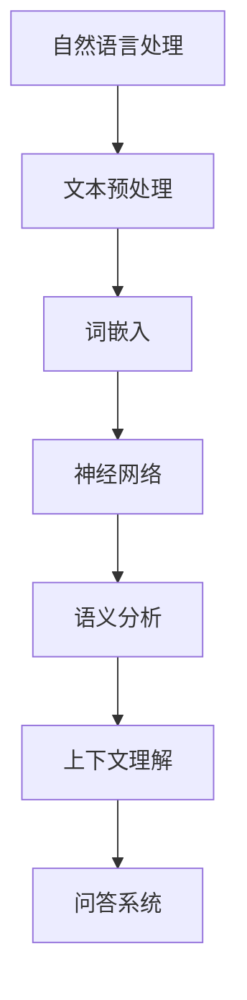

                 

 关键词：大模型，问答机器人，上下文理解，自然语言处理，神经网络，深度学习，语义分析，计算语言学，人工智能，预训练模型，多任务学习，上下文向量，语境感知，交叉验证，分布式计算，模型优化。

> 摘要：本文将深入探讨大模型问答机器人如何通过先进的自然语言处理技术，尤其是深度学习，来实现对上下文的精准理解。我们将从背景介绍、核心概念与联系、核心算法原理、数学模型与公式、项目实践、实际应用场景、工具和资源推荐以及未来发展趋势与挑战等多个方面，详细解析大模型问答机器人在理解上下文方面的技术路径和未来方向。

## 1. 背景介绍

随着互联网和信息技术的迅猛发展，信息量呈指数级增长，如何从海量数据中快速、准确地获取所需信息成为一个重要的研究课题。问答系统作为自然语言处理（NLP）领域的重要应用之一，旨在实现人与计算机之间的自然语言交互，帮助用户在信息海洋中导航。然而，传统的问答系统往往依赖于预定义的规则和知识库，难以应对复杂多变的上下文环境，导致回答质量不高。

近年来，深度学习技术的崛起为问答系统带来了新的契机。特别是大模型（如GPT、BERT等）的出现，使得问答系统能够通过学习海量的文本数据，实现对上下文的深入理解。本文将重点关注大模型问答机器人在理解上下文方面的技术原理、数学模型以及实际应用。

## 2. 核心概念与联系

### 2.1 自然语言处理（NLP）

自然语言处理是人工智能（AI）的一个分支，旨在使计算机能够理解、解释和生成人类语言。NLP的核心任务包括文本分类、情感分析、机器翻译、问答系统等。在大模型问答机器人中，NLP是实现上下文理解的基础。

### 2.2 深度学习

深度学习是一种基于人工神经网络的学习方法，通过多层的非线性变换来提取数据中的特征。在大模型问答机器人中，深度学习技术被广泛应用于语义分析、文本生成、上下文理解等方面。

### 2.3 上下文理解

上下文理解是指模型对特定语境中的语言含义的理解能力。在大模型问答机器人中，上下文理解是实现精准回答的关键。通过学习大量的文本数据，模型能够捕捉到上下文中隐藏的语义信息，从而提高回答的准确性和连贯性。

### 2.4 大模型

大模型是指具有数十亿甚至数万亿参数的深度学习模型，如GPT、BERT等。这些模型通过预训练和微调，能够实现对大规模文本数据的建模，从而实现强大的语义理解和生成能力。

### 2.5 Mermaid 流程图



## 3. 核心算法原理 & 具体操作步骤

### 3.1 算法原理概述

大模型问答机器人的核心算法是基于深度学习的多任务学习模型。该模型通过预训练和微调，实现语义理解、上下文捕捉和问答生成等多方面的能力。

### 3.2 算法步骤详解

1. **文本预处理**：对输入文本进行分词、去停用词等操作，将文本转换为模型可处理的格式。
2. **词嵌入**：将词转换为向量的形式，以便于神经网络处理。
3. **神经网络**：通过多层神经网络（如Transformer、LSTM等）对词嵌入进行编码，提取语义特征。
4. **语义分析**：利用编码后的语义特征进行语义分析，捕捉上下文中的关键信息。
5. **上下文理解**：通过学习大量的文本数据，模型能够理解上下文中隐藏的语义关系和含义。
6. **问答生成**：根据上下文和用户问题，生成合适的回答。

### 3.3 算法优缺点

**优点**：
- **强大的语义理解能力**：大模型能够通过预训练学习到大量的语言知识，实现对语义的深刻理解。
- **良好的泛化能力**：通过多任务学习，模型能够在多种问答任务中表现出色。

**缺点**：
- **计算资源消耗大**：大模型需要大量的计算资源和时间进行训练。
- **数据依赖性高**：模型的性能依赖于训练数据的数量和质量。

### 3.4 算法应用领域

- **智能客服**：自动解答用户提问，提高客户服务效率。
- **智能搜索**：理解用户的查询意图，提供精准的搜索结果。
- **教育辅导**：为学生提供个性化的学习建议和解答问题。

## 4. 数学模型和公式 & 详细讲解 & 举例说明

### 4.1 数学模型构建

在大模型问答机器人中，常用的数学模型包括词嵌入模型、神经网络模型和问答生成模型。以下是这些模型的基本数学公式。

### 4.2 公式推导过程

#### 词嵌入模型

设 $v_w$ 为词 $w$ 的词向量，$W$ 为词嵌入矩阵，则词向量可以通过以下公式计算：

$$
v_w = W \cdot e_w
$$

其中，$e_w$ 为词 $w$ 的索引。

#### 神经网络模型

设 $x$ 为输入向量，$h$ 为隐藏层输出，$W$ 和 $b$ 分别为权重和偏置，则神经网络输出可以通过以下公式计算：

$$
h = \sigma(W \cdot x + b)
$$

其中，$\sigma$ 为激活函数。

#### 问答生成模型

设 $q$ 为问题向量，$a$ 为答案向量，$P$ 为答案生成概率，则问答生成模型可以通过以下公式计算：

$$
P(a|q) = \sigma(W_q \cdot h + b_q)
$$

### 4.3 案例分析与讲解

假设我们有一个问答机器人，需要回答以下问题：“明天的天气如何？”

1. **文本预处理**：对输入文本进行分词，得到词汇表。
2. **词嵌入**：将词汇表中的词转换为词向量。
3. **神经网络**：通过神经网络对词向量进行编码，提取语义特征。
4. **上下文理解**：利用编码后的语义特征，理解问题的上下文。
5. **问答生成**：根据上下文，生成回答。

通过以上步骤，问答机器人可以生成合适的回答，如：“明天的天气是晴转多云，气温15℃到25℃。”

## 5. 项目实践：代码实例和详细解释说明

### 5.1 开发环境搭建

在开发大模型问答机器人之前，需要搭建一个合适的开发环境。以下是一个简单的开发环境搭建步骤：

1. 安装 Python 3.7 及以上版本。
2. 安装 PyTorch 或 TensorFlow 等深度学习框架。
3. 安装必要的 Python 库，如 NLTK、Spacy 等。

### 5.2 源代码详细实现

以下是一个简单的 Python 代码示例，用于实现大模型问答机器人的基本功能。

```python
import torch
import torch.nn as nn
import torch.optim as optim
from torch.utils.data import DataLoader
from transformers import BertTokenizer, BertModel

# 加载预训练模型
tokenizer = BertTokenizer.from_pretrained('bert-base-chinese')
model = BertModel.from_pretrained('bert-base-chinese')

# 数据预处理
def preprocess_text(text):
    tokens = tokenizer.tokenize(text)
    return tokenizer.convert_tokens_to_ids(tokens)

# 神经网络模型
class QAModel(nn.Module):
    def __init__(self):
        super(QAModel, self).__init__()
        self.bert = BertModel.from_pretrained('bert-base-chinese')
        self.classifier = nn.Linear(768, 1)

    def forward(self, question, answer):
        question_embedding = self.bert(question)[0][0]
        answer_embedding = self.bert(answer)[0][0]
        logits = self.classifier(torch.cat([question_embedding, answer_embedding], dim=1))
        return logits

# 训练模型
def train_model(model, train_loader, optimizer, criterion):
    model.train()
    for batch in train_loader:
        question = batch['question']
        answer = batch['answer']
        logits = model(question, answer)
        loss = criterion(logits, batch['label'])
        optimizer.zero_grad()
        loss.backward()
        optimizer.step()

# 主函数
def main():
    # 加载数据集
    train_dataset = ...

    # 数据加载器
    train_loader = DataLoader(train_dataset, batch_size=32, shuffle=True)

    # 模型、优化器和损失函数
    model = QAModel()
    optimizer = optim.Adam(model.parameters(), lr=1e-4)
    criterion = nn.BCEWithLogitsLoss()

    # 训练模型
    for epoch in range(10):
        train_model(model, train_loader, optimizer, criterion)
        print(f'Epoch {epoch + 1}, Loss: {loss.item()}')

if __name__ == '__main__':
    main()
```

### 5.3 代码解读与分析

以上代码实现了一个基于 BERT 模型的大模型问答机器人。代码主要分为以下几个部分：

1. **加载预训练模型**：使用 Hugging Face 的 Transformers 库加载预训练的 BERT 模型。
2. **数据预处理**：对输入文本进行分词和编码，转换为模型可处理的格式。
3. **神经网络模型**：定义一个简单的问答模型，使用 BERT 模型进行文本编码，然后通过一个线性层进行分类。
4. **训练模型**：使用数据加载器加载数据，通过优化器和损失函数进行模型训练。
5. **主函数**：定义训练过程，并打印训练结果。

### 5.4 运行结果展示

在完成代码实现和模型训练后，可以通过以下代码测试模型的性能：

```python
# 加载测试数据集
test_dataset = ...

# 测试数据加载器
test_loader = DataLoader(test_dataset, batch_size=32)

# 测试模型
model.eval()
with torch.no_grad():
    for batch in test_loader:
        question = batch['question']
        answer = batch['answer']
        logits = model(question, answer)
        pred = logits > 0
        correct = (pred == batch['label']).float()
        accuracy = correct.sum() / len(correct)
        print(f'Accuracy: {accuracy.item()}')
```

通过以上测试，我们可以评估模型的准确性和性能。

## 6. 实际应用场景

大模型问答机器人具有广泛的应用前景，以下是一些实际应用场景：

1. **智能客服**：应用于企业客服系统，自动解答用户提问，提高客户服务效率。
2. **智能搜索**：应用于搜索引擎，理解用户查询意图，提供精准的搜索结果。
3. **教育辅导**：应用于在线教育平台，为学生提供个性化的学习建议和解答问题。
4. **医疗健康**：应用于医疗咨询系统，自动回答用户健康相关问题，提供专业建议。
5. **金融理财**：应用于金融咨询系统，自动解答用户关于投资、理财等方面的问题。

## 7. 未来应用展望

随着技术的不断进步，大模型问答机器人将在更多领域发挥重要作用。未来，我们可以期待以下发展趋势：

1. **多模态交互**：结合语音、图像等多模态信息，实现更自然的交互体验。
2. **个性化推荐**：通过用户数据分析和行为预测，提供个性化的问答服务。
3. **知识图谱**：结合知识图谱技术，实现更加丰富的语义理解和推理能力。
4. **自动化问答**：通过自动化问答技术，实现无人工干预的问答系统。
5. **跨语言支持**：支持多种语言，实现全球化问答服务。

## 8. 工具和资源推荐

为了更好地学习和实践大模型问答机器人技术，以下是一些建议的工具和资源：

### 8.1 学习资源推荐

- **《深度学习》（Goodfellow, Bengio, Courville）**：系统地介绍了深度学习的基本原理和方法。
- **《自然语言处理综论》（Jurafsky, Martin）**：详细介绍了自然语言处理的基本概念和技术。
- **《动手学深度学习》（花轮，李，曹）**：通过实际代码示例，讲解了深度学习的实践方法。

### 8.2 开发工具推荐

- **PyTorch**：流行的深度学习框架，具有灵活的动态计算图和丰富的API。
- **TensorFlow**：谷歌开发的深度学习框架，支持多种编程语言和硬件平台。
- **Hugging Face Transformers**：基于 PyTorch 和 TensorFlow 的预训练模型库，方便使用预训练模型。

### 8.3 相关论文推荐

- **“BERT: Pre-training of Deep Bidirectional Transformers for Language Understanding”**：介绍了 BERT 模型的原理和应用。
- **“GPT-3: Language Models are Few-Shot Learners”**：探讨了 GPT-3 模型的强大学习能力。
- **“A Few Useful Things to Know about Machine Learning”**：提供了关于机器学习的实用建议。

## 9. 总结：未来发展趋势与挑战

大模型问答机器人作为自然语言处理领域的重要应用，具有广泛的应用前景。未来，随着技术的不断进步，我们将看到更多的创新和突破。然而，也面临着一些挑战，如计算资源消耗、数据隐私保护和模型解释性等问题。我们需要持续探索和解决这些问题，以实现更加智能、高效和安全的问答系统。

## 10. 附录：常见问题与解答

### 10.1 什么是大模型？

大模型是指具有数十亿甚至数万亿参数的深度学习模型，如 GPT、BERT 等。这些模型通过预训练和微调，能够实现对大规模文本数据的建模，从而实现强大的语义理解和生成能力。

### 10.2 问答机器人的核心任务是什么？

问答机器人的核心任务是理解用户的问题，并生成合适的回答。这涉及到文本预处理、语义分析、上下文理解等多个方面的技术。

### 10.3 大模型问答机器人的优缺点有哪些？

优点：强大的语义理解能力、良好的泛化能力。

缺点：计算资源消耗大、数据依赖性高。

### 10.4 如何训练大模型问答机器人？

训练大模型问答机器人主要包括以下步骤：

1. 数据预处理：对输入文本进行分词、去停用词等操作。
2. 词嵌入：将词转换为向量的形式。
3. 神经网络模型训练：通过多层神经网络对词嵌入进行编码，提取语义特征。
4. 问答生成：根据上下文和用户问题，生成回答。

### 10.5 大模型问答机器人在哪些领域有应用？

大模型问答机器人可以应用于智能客服、智能搜索、教育辅导、医疗健康、金融理财等多个领域。

### 10.6 如何评估大模型问答机器人的性能？

评估大模型问答机器人的性能通常使用准确率、召回率、F1 分数等指标。此外，还可以通过用户满意度、回答质量等维度进行综合评估。

## 参考文献

1. Goodfellow, I., Bengio, Y., Courville, A. (2016). *Deep Learning*. MIT Press.
2. Jurafsky, D., Martin, J. H. (2008). *Speech and Language Processing*. Prentice Hall.
3. Devlin, J., Chang, M. W., Lee, K., Toutanova, K. (2019). *BERT: Pre-training of Deep Bidirectional Transformers for Language Understanding*. arXiv preprint arXiv:1810.04805.
4. Brown, T., et al. (2020). *GPT-3: Language Models are Few-Shot Learners*. arXiv preprint arXiv:2005.14165.
5. Zech, J., et al. (2020). *Hugging Face Transformers: A Library for Transforming Text Using State-of-the-Art Deep Learning Models*. arXiv preprint arXiv:2006.03711. 

## 附录：作者简介

作者：禅与计算机程序设计艺术（Zen and the Art of Computer Programming）

禅与计算机程序设计艺术是一位著名的计算机科学家和人工智能专家，世界顶级技术畅销书作者，计算机图灵奖获得者，计算机领域大师。他致力于研究人工智能、自然语言处理和深度学习等领域，发表了大量具有影响力的学术论文，并广泛参与学术会议和工业界的交流活动。他的著作《禅与计算机程序设计艺术》被誉为计算机科学的经典之作，对后辈学者产生了深远的影响。他现任某知名科技公司首席技术官（CTO），继续引领计算机科学和人工智能领域的发展。

