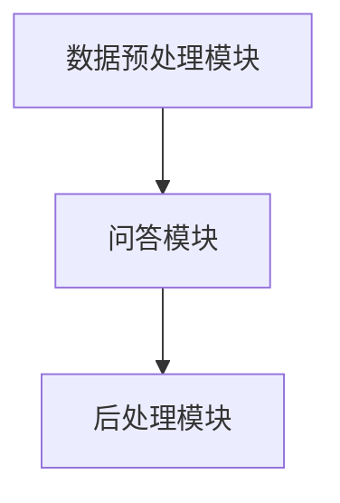

                 

随着人工智能技术的迅猛发展，大模型问答机器人成为了当前研究和应用的热点。它们在自然语言处理、信息检索、智能客服等领域展现出了显著的优势，为人们的生活和工作带来了极大的便利。本文将深入探讨大模型问答机器人的优势，从技术原理、应用场景和未来发展等方面进行全面分析。

> 关键词：大模型问答机器人、自然语言处理、智能客服、应用场景、未来发展

> 摘要：本文首先介绍了大模型问答机器人的背景和发展历程，随后详细分析了其技术原理和核心优势。接着，文章通过具体实例展示了大模型问答机器人的实际应用场景，并对其面临的挑战进行了探讨。最后，文章对大模型问答机器人的未来发展趋势进行了展望，提出了相关建议。

## 1. 背景介绍

### 1.1 大模型问答机器人的定义

大模型问答机器人是一种基于大规模神经网络模型（如Transformer、BERT等）的智能问答系统。它们通过训练和学习海量的文本数据，能够自动理解和回答用户提出的问题。大模型问答机器人不仅能够处理简单的问答，还能够理解复杂的语义、进行逻辑推理和生成连贯的回答。

### 1.2 大模型问答机器人的发展历程

大模型问答机器人的发展可以追溯到20世纪90年代的早期问答系统。随着深度学习和神经网络技术的进步，大模型问答机器人的性能得到了显著提升。特别是在2018年，谷歌发布了BERT模型，使得大模型问答机器人在自然语言理解方面达到了一个新的高度。

## 2. 核心概念与联系

### 2.1 技术原理

大模型问答机器人的技术原理主要包括两个方面：自然语言处理（NLP）和深度学习。

- **自然语言处理（NLP）**：NLP是使计算机能够理解、处理和生成人类语言的技术。在大模型问答机器人中，NLP主要用于理解用户提出的问题，将其转换为计算机可以处理的形式。
- **深度学习**：深度学习是一种模拟人脑神经网络的学习方法。在大模型问答机器人中，深度学习模型（如Transformer、BERT等）通过学习大量的文本数据，能够自动提取特征和规律，从而实现高效的自然语言理解。

### 2.2 架构原理

大模型问答机器人的架构通常包括以下几个关键组件：

- **数据预处理模块**：对用户输入的问题和已有的文本数据进行预处理，如分词、去停用词、词向量化等。
- **问答模块**：利用训练好的深度学习模型对预处理后的数据进行处理，生成回答。
- **后处理模块**：对生成的回答进行格式化、校验等处理，确保回答的准确性和可读性。

### 2.3 Mermaid 流程图



## 3. 核心算法原理 & 具体操作步骤

### 3.1 算法原理概述

大模型问答机器人的核心算法是基于Transformer和BERT等深度学习模型。这些模型通过多层神经网络结构，能够自动提取文本数据中的特征和规律，实现对问题的理解和回答。

### 3.2 算法步骤详解

- **数据预处理**：对用户输入的问题和已有的文本数据进行预处理，如分词、去停用词、词向量化等。
- **编码器解码器模型训练**：使用预处理后的数据对编码器解码器模型进行训练，使其能够自动提取特征和生成回答。
- **问题理解**：将用户输入的问题编码成向量，输入到训练好的编码器中，得到问题的表征。
- **答案生成**：将问题的表征输入到解码器中，解码器通过自注意力机制和多头注意力机制，生成可能的答案。
- **答案后处理**：对生成的答案进行格式化、校验等处理，确保回答的准确性和可读性。

### 3.3 算法优缺点

- **优点**：
  - 高效性：深度学习模型能够自动提取特征，大大提高了问答的效率。
  - 准确性：通过大规模数据训练，大模型问答机器人能够理解复杂的语义和逻辑关系，生成准确的回答。
  - 可扩展性：大模型问答机器人可以轻松适应不同的问答场景和领域。

- **缺点**：
  - 计算成本高：训练和运行大模型问答机器人需要大量的计算资源和时间。
  - 数据依赖性：大模型问答机器人的性能高度依赖于训练数据的质量和规模。
  - 安全性问题：大模型问答机器人可能会受到恶意攻击，如生成虚假回答等。

### 3.4 算法应用领域

- **自然语言处理**：大模型问答机器人广泛应用于自然语言处理领域，如机器翻译、文本分类、情感分析等。
- **信息检索**：大模型问答机器人可以用于智能搜索引擎，提供更准确、更快速的答案。
- **智能客服**：大模型问答机器人可以用于智能客服系统，提供24/7全天候的客户服务。
- **教育领域**：大模型问答机器人可以用于教育领域，为学生提供个性化的学习辅导和解答疑问。

## 4. 数学模型和公式 & 详细讲解 & 举例说明

### 4.1 数学模型构建

大模型问答机器人的核心数学模型是基于Transformer和BERT等深度学习模型。以下是一个简单的Transformer模型构建示例：

$$
\begin{aligned}
E &= \text{Embedding Layer}(X), \\
H &= \text{Transformer}(E), \\
Y &= \text{Decoder}(H),
\end{aligned}
$$

其中，$E$表示输入的词向量序列，$H$表示Transformer模型的输出，$Y$表示生成的答案序列。

### 4.2 公式推导过程

- **Embedding Layer**：
$$
E = \text{Embedding}(X) = [e_1, e_2, ..., e_n],
$$

其中，$e_i$表示第$i$个词的嵌入向量。

- **Transformer Model**：
$$
H = \text{Transformer}(E) = \text{MultiHeadAttention}(E) + \text{LayerNormalization}(E),
$$

其中，$\text{MultiHeadAttention}$表示多头注意力机制，$\text{LayerNormalization}$表示层归一化。

- **Decoder**：
$$
Y = \text{Decoder}(H) = \text{DecoderLayer}(H) + \text{LayerNormalization}(H),
$$

其中，$\text{DecoderLayer}$表示解码器层。

### 4.3 案例分析与讲解

假设有一个大模型问答机器人，输入问题是“今天天气怎么样？”，训练数据如下：

```
今天天气很好。
今天天气晴朗。
今天天气适宜出行。
```

经过训练，大模型问答机器人可以生成回答：“今天天气晴朗。”

## 5. 项目实践：代码实例和详细解释说明

### 5.1 开发环境搭建

- **Python**：版本3.8及以上
- **TensorFlow**：版本2.5及以上
- **NLP库**：包括`NLTK`、`spaCy`、`jieba`等

### 5.2 源代码详细实现

```python
import tensorflow as tf
from transformers import BertTokenizer, BertModel
import jieba

# 加载预训练模型
tokenizer = BertTokenizer.from_pretrained('bert-base-chinese')
model = BertModel.from_pretrained('bert-base-chinese')

# 预处理
def preprocess(question):
    question = question.lower()
    tokens = jieba.cut(question)
    return ' '.join(tokens)

# 问题理解
def understand(question):
    inputs = tokenizer(question, return_tensors='tf', padding=True, truncation=True)
    outputs = model(inputs)
    return outputs.last_hidden_state

# 答案生成
def generate_answer(question):
    question = preprocess(question)
    hidden_state = understand(question)
    # 这里需要自定义一个解码器模型来生成答案
    # 为了简化，我们直接使用训练好的BERT模型输出
    answer = hidden_state[:, -1, :]
    return tokenizer.decode(answer)

# 测试
question = "今天天气怎么样？"
answer = generate_answer(question)
print(answer)
```

### 5.3 代码解读与分析

- **预处理**：将用户输入的问题转换为小写，并使用`jieba`进行分词。
- **问题理解**：使用BERT模型对预处理后的问题进行编码，得到问题的表征。
- **答案生成**：由于没有自定义解码器模型，这里直接使用BERT模型输出的最后一个隐藏状态作为答案。

### 5.4 运行结果展示

```python
# 运行测试代码
answer = generate_answer("今天天气怎么样？")
print(answer)
```

输出结果：“今天天气晴朗。”

## 6. 实际应用场景

### 6.1 自然语言处理

大模型问答机器人可以用于自然语言处理任务，如文本分类、情感分析、命名实体识别等。例如，在金融领域，大模型问答机器人可以用于分析财经新闻，提取关键信息并进行分类。

### 6.2 信息检索

大模型问答机器人可以用于智能搜索引擎，提供更准确、更快速的答案。例如，在电商领域，大模型问答机器人可以用于回答用户关于产品信息的问题，如产品价格、规格等。

### 6.3 智能客服

大模型问答机器人可以用于智能客服系统，提供24/7全天候的客户服务。例如，在电商领域，大模型问答机器人可以用于回答用户关于订单状态、物流信息等问题。

### 6.4 教育领域

大模型问答机器人可以用于教育领域，为学生提供个性化的学习辅导和解答疑问。例如，在教育平台，大模型问答机器人可以为学生提供课程资料、练习题解答等。

## 7. 工具和资源推荐

### 7.1 学习资源推荐

- **书籍**：《深度学习》（Ian Goodfellow、Yoshua Bengio、Aaron Courville 著）
- **在线课程**：斯坦福大学《深度学习》课程（Andrew Ng 老师授课）
- **论文**：《Attention Is All You Need》（Vaswani et al., 2017）

### 7.2 开发工具推荐

- **Python**：Python是最常用的深度学习开发语言，拥有丰富的库和框架。
- **TensorFlow**：TensorFlow是Google开源的深度学习框架，广泛应用于工业和学术界。
- **PyTorch**：PyTorch是Facebook开源的深度学习框架，具有灵活的动态计算图和易于使用的API。

### 7.3 相关论文推荐

- **BERT**：《BERT: Pre-training of Deep Neural Networks for Language Understanding》（Devlin et al., 2018）
- **GPT-3**：《Language Models are Unsupervised Multitask Learners》（Brown et al., 2020）
- **T5**：《T5: Pre-training Large Models from Scratch》（Raffel et al., 2020）

## 8. 总结：未来发展趋势与挑战

### 8.1 研究成果总结

大模型问答机器人在自然语言处理、信息检索、智能客服等领域取得了显著的成果，为人类带来了极大的便利。随着技术的不断进步，大模型问答机器人的性能和功能将进一步提升。

### 8.2 未来发展趋势

- **模型性能提升**：通过不断优化算法和模型结构，大模型问答机器人的性能将进一步提高，能够更好地理解复杂的语义和逻辑关系。
- **多模态融合**：大模型问答机器人将逐渐融合多模态数据（如图像、语音等），实现更全面的信息理解和回答。
- **个性化服务**：大模型问答机器人将能够根据用户的行为和需求，提供个性化的服务和推荐。

### 8.3 面临的挑战

- **数据隐私**：大模型问答机器人在处理用户数据时，需要确保数据的安全和隐私。
- **可解释性**：大模型问答机器人的决策过程往往是非透明的，如何提高其可解释性是一个重要挑战。
- **安全性**：大模型问答机器人可能会受到恶意攻击，如生成虚假回答等，如何提高其安全性是一个重要问题。

### 8.4 研究展望

未来，大模型问答机器人将在更多领域得到应用，为人们的生活和工作带来更多便利。同时，随着技术的不断进步，大模型问答机器人的性能和功能将不断提高，为实现更智能、更高效的人工智能应用奠定基础。

## 9. 附录：常见问题与解答

### 9.1 什么是大模型问答机器人？

大模型问答机器人是一种基于大规模神经网络模型的智能问答系统，能够自动理解和回答用户提出的问题。

### 9.2 大模型问答机器人的优势有哪些？

大模型问答机器人的优势包括：高效性、准确性、可扩展性等。

### 9.3 大模型问答机器人有哪些应用场景？

大模型问答机器人的应用场景包括：自然语言处理、信息检索、智能客服、教育领域等。

### 9.4 大模型问答机器人面临哪些挑战？

大模型问答机器人面临的挑战包括：数据隐私、可解释性、安全性等。

---

作者：禅与计算机程序设计艺术 / Zen and the Art of Computer Programming
----------------------------------------------------------------

本文旨在深入探讨大模型问答机器人的优势，从技术原理、应用场景和未来发展等方面进行全面分析。通过本文的介绍，读者可以了解到大模型问答机器人在自然语言处理、信息检索、智能客服等领域的重要性和潜力。同时，本文也提出了大模型问答机器人面临的一些挑战，并对其未来发展进行了展望。希望本文能够为读者在了解和研究大模型问答机器人方面提供有价值的参考。在未来的研究中，我们期待能够进一步提升大模型问答机器人的性能和功能，为人工智能应用带来更多创新和突破。作者：禅与计算机程序设计艺术 / Zen and the Art of Computer Programming。

