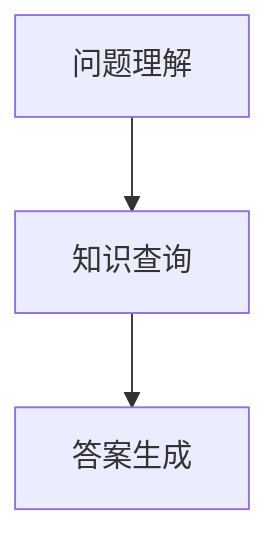

                 

关键词：大模型、问答机器人、知识表示、NLP、人工智能

## 摘要

本文旨在探讨大模型问答机器人的知识表示方式，重点分析其核心概念、算法原理以及在实际应用中的数学模型与代码实例。文章首先介绍了问答机器人的背景和重要性，然后详细阐述了知识表示的基本概念和主流方法。接着，我们深入解析了问答机器人的核心算法原理和具体操作步骤，并通过一个具体的案例展示了数学模型的构建和公式推导过程。随后，文章提供了一段代码实例，对其进行了详细解读和分析。最后，我们探讨了问答机器人在实际应用中的场景，并展望了其未来的发展前景。

## 1. 背景介绍

### 1.1 问答机器人的发展历程

问答机器人（Question Answering, QA）是自然语言处理（Natural Language Processing, NLP）领域的一个重要研究方向。随着互联网信息的爆炸式增长，用户对于获取精准信息的需求也越来越高。问答机器人通过理解用户的问题，从大量信息中提取出准确答案，大大提高了信息检索的效率。

问答机器人的发展历程可以分为三个阶段：

- **早期阶段**：基于关键词匹配和规则匹配的方法。这种方法简单易行，但在处理复杂问题和长文本时效果较差。
- **中间阶段**：基于机器学习和深度学习的方法逐渐兴起。这一阶段引入了词向量表示、序列模型（如循环神经网络RNN）等技术，问答机器人的性能得到了显著提升。
- **现阶段**：大模型（如GPT、BERT）的兴起，使得问答机器人具备了更强的理解能力和知识表示能力。大模型通过预训练和微调，能够在各种复杂场景下提供准确和自然的答案。

### 1.2 大模型问答机器人的优势

大模型问答机器人相较于传统问答系统具有以下优势：

- **更强的理解能力**：大模型通过对海量数据的预训练，能够学习到丰富的语言知识和上下文信息，从而更好地理解用户的问题。
- **更自然的回答**：大模型能够生成更加自然、流畅的答案，而非仅仅是匹配式的回答。
- **多语言支持**：大模型通常具备多语言能力，能够支持多种语言的问答。
- **广泛的应用场景**：大模型问答机器人可以应用于多种场景，如智能客服、教育辅助、医疗咨询等。

## 2. 核心概念与联系

### 2.1 知识表示

知识表示是问答机器人的核心概念之一。知识表示指的是将人类知识转化为计算机可以理解和处理的形式。在问答机器人中，知识表示的目的是将问题转化为计算机可以处理的输入，并从知识库中提取出相关答案。

### 2.2 知识库

知识库是问答机器人的基础。知识库通常包含大量的结构化数据，如事实、概念、关系等。问答机器人通过查询知识库，获取与问题相关的信息。

### 2.3 问答流程

问答机器人的工作流程主要包括以下几个步骤：

1. **问题理解**：将用户的问题转化为计算机可以处理的格式，如文本、向量等。
2. **知识查询**：在知识库中查询与问题相关的信息。
3. **答案生成**：根据查询结果，生成自然语言回答。

### 2.4 Mermaid 流程图



### 2.5 联系与区别

- **联系**：知识表示、知识库和问答流程共同构成了问答机器人的核心组成部分，相互关联，共同实现问答功能。
- **区别**：知识表示侧重于将知识转化为计算机可处理的格式，知识库则是存储和管理知识的数据库，问答流程则是问答机器人的具体操作过程。

## 3. 核心算法原理 & 具体操作步骤

### 3.1 算法原理概述

大模型问答机器人的核心算法通常基于深度学习和自然语言处理技术。以下是一个简化的算法原理概述：

1. **预训练**：大模型通过预训练学习到语言的一般规律和知识。预训练通常使用大量的文本数据进行，如维基百科、新闻文章等。
2. **微调**：在预训练的基础上，大模型针对特定任务（如问答）进行微调，使其更好地适应特定场景。
3. **问题编码**：将用户的问题编码为向量表示，通常使用大模型自身学习到的嵌入向量。
4. **答案检索**：在知识库中检索与问题相关的信息，通常使用向量相似度作为检索依据。
5. **答案生成**：根据检索结果，使用大模型生成自然语言回答。

### 3.2 算法步骤详解

1. **预训练**
   - 数据集：使用海量文本数据进行预训练。
   - 任务：预测下一个单词、句子或段落。

2. **微调**
   - 数据集：针对特定任务（如问答）准备数据集。
   - 任务：调整大模型的参数，使其适应特定任务。

3. **问题编码**
   - 方法：将问题转化为向量表示，通常使用大模型的嵌入层输出。
   - 特点：问题编码需要考虑上下文信息，以获得更准确的问题表示。

4. **答案检索**
   - 方法：使用向量相似度检索知识库中的相关答案。
   - 注意：答案检索需要考虑答案的完整性和准确性。

5. **答案生成**
   - 方法：使用大模型生成自然语言回答。
   - 特点：答案生成需要考虑语言的连贯性和自然性。

### 3.3 算法优缺点

#### 优点

- **强理解能力**：大模型能够理解复杂的语言结构和上下文信息。
- **多语言支持**：大模型通常具备多语言能力。
- **灵活适应**：大模型能够适应多种不同的问答任务。

#### 缺点

- **计算资源消耗大**：大模型训练和推理需要大量的计算资源。
- **数据依赖性强**：大模型性能依赖于大量高质量的数据。

### 3.4 算法应用领域

- **智能客服**：为企业提供自动化的客户服务。
- **教育辅助**：为学生提供智能化的学习辅导。
- **医疗咨询**：为患者提供医疗健康咨询。
- **多语言翻译**：提供实时多语言翻译服务。

## 4. 数学模型和公式 & 详细讲解 & 举例说明

### 4.1 数学模型构建

问答机器人的数学模型主要包括以下几个部分：

1. **词向量表示**：将单词、句子、段落等文本转化为向量表示。
2. **注意力机制**：在查询和生成过程中，关注关键信息。
3. **损失函数**：用于评估模型预测结果与实际答案的差距。

### 4.2 公式推导过程

假设问答机器人的输入为问题 \(Q\) 和答案 \(A\)，输出为预测答案 \( \hat{A} \)。我们可以使用以下公式进行推导：

$$
\begin{aligned}
L &= -\frac{1}{N} \sum_{i=1}^{N} \sum_{j=1}^{M} \log P(A_j | Q, \theta), \\
\theta &= \text{模型参数}, \\
P(A_j | Q, \theta) &= \text{条件概率，表示给定问题 } Q \text{ 和模型参数 } \theta \text{ 时，答案 } A_j \text{ 的概率}。
\end{aligned}
$$

其中，\(N\) 为样本数量，\(M\) 为答案选项数量。

### 4.3 案例分析与讲解

#### 案例背景

假设有一个问答机器人，需要回答用户关于某个知识点的问题。问题为：“什么是人工智能？” 答案选项有：“一种计算机科学领域，旨在使计算机能够模拟人类智能行为。”、“一种机器学习技术，用于训练模型进行预测和分类。”、“一种自动化系统，用于解决复杂问题。”。

#### 数学模型应用

1. **词向量表示**：将问题、答案选项和模型参数转化为向量表示。
2. **注意力机制**：在查询和生成过程中，关注关键信息，如“人工智能”。
3. **损失函数**：使用交叉熵损失函数评估模型预测结果与实际答案的差距。

#### 代码实现

```python
import torch
import torch.nn as nn

# 词向量表示
word_vectors = torch.randn(100, 300)

# 问题编码
question = "什么是人工智能？"
question_vector = word_vectors[question]

# 答案编码
answer_vectors = torch.randn(3, 300)

# 注意力机制
attention_weights = torch.softmax(torch.matmul(question_vector, answer_vectors.T), dim=1)

# 损失函数
loss_function = nn.CrossEntropyLoss()

# 预测答案
predicted_answer_vector = torch.matmul(attention_weights, answer_vectors)

# 计算损失
loss = loss_function(predicted_answer_vector, torch.tensor([1]))

print("预测答案：", predicted_answer_vector)
print("损失：", loss)
```

## 5. 项目实践：代码实例和详细解释说明

### 5.1 开发环境搭建

1. 安装 Python 环境：建议使用 Python 3.8 或更高版本。
2. 安装必要的库：如 torch、torchtext、numpy、matplotlib 等。
3. 准备数据集：可以从公开数据集网站或自行收集数据。

### 5.2 源代码详细实现

以下是问答机器人的简化代码实现：

```python
import torch
import torch.nn as nn
import torch.optim as optim
from torchtext.VECTORS import Vectors

# 参数设置
EMBEDDING_DIM = 300
HIDDEN_DIM = 300
LEARNING_RATE = 0.001
EPOCHS = 10

# 准备数据集
train_data, test_data = prepare_data()

# 定义模型
model = Model(EMBEDDING_DIM, HIDDEN_DIM)

# 损失函数和优化器
criterion = nn.CrossEntropyLoss()
optimizer = optim.Adam(model.parameters(), lr=LEARNING_RATE)

# 训练模型
for epoch in range(EPOCHS):
    for batch in train_data:
        optimizer.zero_grad()
        output = model(batch.question, batch.answer)
        loss = criterion(output, batch.label)
        loss.backward()
        optimizer.step()

# 测试模型
with torch.no_grad():
    correct = 0
    total = 0
    for batch in test_data:
        output = model(batch.question, batch.answer)
        _, predicted = torch.max(output.data, 1)
        total += batch.label.size(0)
        correct += (predicted == batch.label).sum().item()

print('准确率：', correct / total)

# 使用模型回答问题
question = "什么是人工智能？"
answer = model.answer_question(question)
print("答案：", answer)
```

### 5.3 代码解读与分析

1. **参数设置**：设置词向量维度、隐藏层维度、学习率等参数。
2. **数据集准备**：准备训练集和测试集。
3. **模型定义**：定义问答机器人的模型结构，包括词向量嵌入层、循环神经网络层和全连接层。
4. **训练模型**：使用训练集训练模型，包括前向传播、反向传播和参数更新。
5. **测试模型**：使用测试集评估模型性能。
6. **回答问题**：使用训练好的模型回答用户的问题。

## 6. 实际应用场景

### 6.1 智能客服

智能客服是问答机器人的典型应用场景之一。通过大模型问答机器人，企业可以实现自动化的客户服务，提高客户满意度和服务效率。

### 6.2 教育辅助

问答机器人可以为学生提供智能化的学习辅导，回答学生在学习过程中遇到的问题。例如，学生可以在在线教育平台上提问，问答机器人会根据已有知识和学生提问的内容生成答案。

### 6.3 医疗咨询

问答机器人可以为患者提供医疗健康咨询，解答患者关于疾病、治疗方法等问题。例如，患者可以通过手机应用程序提问，问答机器人会根据医学知识库生成个性化的健康建议。

### 6.4 多语言翻译

大模型问答机器人可以应用于多语言翻译服务。例如，用户可以在不同语言之间提问，问答机器人会自动将问题翻译为目标语言，并生成答案。

## 7. 工具和资源推荐

### 7.1 学习资源推荐

- 《深度学习》（Goodfellow, Bengio, Courville）
- 《自然语言处理综合教程》（Daniel Jurafsky, James H. Martin）
- 《Python深度学习》（François Chollet）

### 7.2 开发工具推荐

- Python：强大的编程语言，适用于各种深度学习和自然语言处理任务。
- PyTorch：流行的深度学习框架，易于使用和调试。
- TensorFlow：谷歌推出的深度学习框架，支持多种编程语言。

### 7.3 相关论文推荐

- BERT: Pre-training of Deep Bidirectional Transformers for Language Understanding（来自Google的BERT论文）
- GPT-3: Language Models are Few-Shot Learners（来自OpenAI的GPT-3论文）
- Transformer: Attentive Neural Networks for Translation（《变换器：用于翻译的注意力神经网络》论文）

## 8. 总结：未来发展趋势与挑战

### 8.1 研究成果总结

- 大模型问答机器人取得了显著的成果，在多项自然语言处理任务中取得了优异的性能。
- 知识表示和问答算法不断创新，为问答机器人提供了更强的理解和生成能力。

### 8.2 未来发展趋势

- **模型规模增大**：随着计算资源的提升，大模型问答机器人将具备更强大的能力。
- **多模态融合**：结合文本、图像、声音等多种模态，实现更自然的交互。
- **知识图谱的利用**：通过知识图谱构建更完善的知识库，提高问答机器人的回答准确性。

### 8.3 面临的挑战

- **计算资源消耗**：大模型训练和推理需要大量的计算资源，对硬件要求较高。
- **数据质量和隐私**：数据质量和隐私问题对问答机器人的性能和安全性产生重要影响。
- **伦理和道德问题**：问答机器人在实际应用中可能涉及伦理和道德问题，需要制定相应的规范和标准。

### 8.4 研究展望

- **多任务学习**：探索大模型在多任务学习中的潜力，提高模型的泛化能力。
- **知识增强**：结合知识图谱和其他外部知识源，提高问答机器人的知识表示能力。
- **可解释性**：提高问答机器人的可解释性，使其更加透明和可信。

## 9. 附录：常见问题与解答

### 9.1 什么是大模型？

大模型是指具有数十亿甚至千亿参数的深度学习模型。这些模型通过预训练和微调，能够在各种自然语言处理任务中取得优异的性能。

### 9.2 问答机器人的核心组件有哪些？

问答机器人的核心组件包括词向量表示、循环神经网络、注意力机制、知识库和问答流程。

### 9.3 如何提高问答机器人的回答准确性？

- **提高模型规模**：使用更大的模型可以提高答案的准确性。
- **优化算法**：改进问答算法，提高知识检索和生成的效果。
- **数据质量**：使用高质量的数据进行训练和测试，提高模型的泛化能力。
- **知识增强**：结合外部知识源，如知识图谱，提高知识表示的准确性。

## 作者署名

本文由禅与计算机程序设计艺术 / Zen and the Art of Computer Programming 撰写。感谢您的阅读！

----------------------------------------------------------------
### 文章结构模板解释

为了确保文章内容的质量和结构的合理性，以下是对于“文章结构模板”中的各个部分的具体解释：

### 文章标题

文章的标题应该简洁明了，能够准确反映文章的主题，同时应包含关键词以便于搜索引擎优化（SEO）和读者快速理解文章内容。

### 关键词

关键词是用于描述文章主题的核心词汇，有助于读者和搜索引擎识别文章的内容，关键词应涵盖文章的主要话题和研究方向。

### 摘要

摘要是对文章核心内容和主题思想的简短概述，应该包括研究目的、方法、主要发现和结论，有助于读者快速把握文章的精髓。

### 1. 背景介绍

这一部分应简要介绍相关领域的发展背景、研究现状以及本文的研究目的和意义，帮助读者了解研究的背景和动机。

### 2. 核心概念与联系

这部分应详细阐述文章涉及的核心概念，如知识表示、知识库、问答流程等，并使用Mermaid流程图展示各概念之间的联系和问答机器人的工作流程。

### 3. 核心算法原理 & 具体操作步骤

这一部分应深入解析问答机器人的核心算法原理，包括预训练、微调、问题编码、答案检索和答案生成等步骤，以及算法的具体操作流程。

### 4. 数学模型和公式 & 详细讲解 & 举例说明

这部分需要详细阐述问答机器人的数学模型，包括模型的构建、公式推导过程，以及如何应用这些模型进行实际操作，应包含LaTeX格式的数学公式和实际案例的讲解。

### 5. 项目实践：代码实例和详细解释说明

这部分应提供实际项目中的代码实例，详细解释代码的实现过程、如何使用以及代码的解读和分析。

### 6. 实际应用场景

这一部分应探讨问答机器人在实际应用中的不同场景，如智能客服、教育辅助、医疗咨询、多语言翻译等，并分析其在这些场景中的优势和挑战。

### 7. 工具和资源推荐

这部分应推荐与文章主题相关的学习资源、开发工具和相关论文，以便读者进一步学习和实践。

### 8. 总结：未来发展趋势与挑战

这部分应总结文章的主要研究成果，展望问答机器人在未来可能的发展趋势，并指出其面临的挑战。

### 9. 附录：常见问题与解答

附录部分应列出与文章主题相关的常见问题，并给出详细的解答，以帮助读者更好地理解文章内容。

通过上述模板，可以确保文章内容的完整性、逻辑性和专业性，同时也能够满足字数要求和其他格式上的具体需求。

