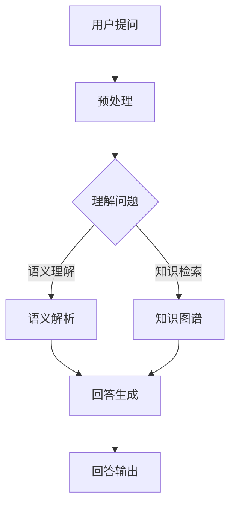

                 

关键词：大模型，问答机器人，自然语言处理，机器学习，深度学习，人工智能，问题回答，算法原理，数学模型，代码实例，应用场景，未来展望

> 摘要：本文将深入探讨大模型问答机器人的工作原理、数学模型、算法实现及其在实际应用中的价值，并对其未来发展提出展望。我们将通过详细的算法原理讲解、数学模型推导、代码实例解析，以及未来应用场景探讨，为您展现大模型问答机器人技术的全貌。

## 1. 背景介绍

随着互联网和大数据技术的飞速发展，自然语言处理（NLP）领域迎来了新的机遇和挑战。大模型问答机器人作为人工智能（AI）的一个重要分支，已经成为当前研究的热点。问答机器人能够理解和回答用户的问题，这需要融合多领域的知识，如语言模型、知识图谱、机器学习和深度学习技术。

在过去的几年里，问答机器人的技术水平有了显著提升，这得益于大规模预训练语言模型（如GPT系列）的广泛应用。这些模型在处理自然语言任务时，能够自动学习并提取大量的语义信息，使得问答机器人在回答问题的准确性和流畅性方面都有了很大改进。

本文旨在通过系统的讲解，帮助读者深入了解大模型问答机器人的工作原理、实现方法和应用场景，并为未来该领域的发展提供一些有价值的思考。

## 2. 核心概念与联系

### 2.1 自然语言处理（NLP）

自然语言处理是人工智能的一个重要分支，旨在使计算机能够理解、生成和处理人类自然语言。NLP技术包括词法分析、句法分析、语义分析和语用分析等。

### 2.2 机器学习（ML）

机器学习是一种通过数据学习模式，并利用这些模式进行预测或决策的技术。在NLP中，机器学习技术被广泛应用于构建语言模型、命名实体识别、情感分析等任务。

### 2.3 深度学习（DL）

深度学习是一种基于多层神经网络的学习方法，能够自动提取复杂的特征。在NLP领域，深度学习模型如卷积神经网络（CNN）和递归神经网络（RNN）被广泛应用于文本分类、机器翻译等任务。

### 2.4 大规模预训练语言模型

大规模预训练语言模型（如GPT、BERT）通过对海量文本数据进行预训练，学习到大量的语言知识和模式。这些模型通常具有数十亿个参数，能够高效地处理自然语言任务。

### 2.5 Mermaid 流程图

下面是一个简化的Mermaid流程图，展示了大模型问答机器人的主要组件及其工作流程：



### 2.6 大模型问答机器人的架构

大模型问答机器人的核心架构包括以下几个部分：

1. **输入预处理**：对用户输入的问题进行分词、词性标注等预处理操作。
2. **语义理解**：利用预训练语言模型对问题进行语义解析，提取关键信息。
3. **知识检索**：从知识图谱中检索与问题相关的信息。
4. **回答生成**：根据语义理解和知识检索结果，生成问题的回答。
5. **输出**：将生成的回答输出给用户。

## 3. 核心算法原理 & 具体操作步骤

### 3.1 算法原理概述

大模型问答机器人的核心算法基于预训练语言模型和知识图谱。预训练语言模型通过大量文本数据学习语言模式和知识，而知识图谱则提供了一个结构化的知识表示框架。

### 3.2 算法步骤详解

1. **输入预处理**：对用户输入的问题进行分词、词性标注等预处理操作，将其转换为模型可接受的输入格式。
2. **语义理解**：利用预训练语言模型对预处理后的输入文本进行语义解析，提取关键信息。这一步骤通常涉及文本分类、命名实体识别和关系提取等技术。
3. **知识检索**：从知识图谱中检索与问题相关的信息。知识图谱通常包含实体、关系和属性等信息，通过图数据库检索技术，可以快速定位到与问题相关的知识节点。
4. **回答生成**：根据语义理解和知识检索结果，生成问题的回答。回答生成通常涉及模板匹配、语义角色标注和语言生成等技术。
5. **输出**：将生成的回答输出给用户。

### 3.3 算法优缺点

#### 优点：

- **高效性**：预训练语言模型和知识图谱技术能够高效地处理大规模文本数据和复杂的问题。
- **灵活性**：基于语义理解和知识检索的问答机器人可以适应多种问答场景。
- **多样性**：预训练语言模型能够学习到丰富的语言知识和模式，生成多样性的回答。

#### 缺点：

- **数据依赖**：问答机器人的性能高度依赖预训练数据的质量和多样性。
- **计算成本**：大规模预训练语言模型和知识图谱的构建和维护需要大量的计算资源和存储空间。

### 3.4 算法应用领域

大模型问答机器人可以应用于多个领域，如：

- **客户服务**：自动回答用户的问题，提高服务效率。
- **智能助手**：为用户提供个性化的信息和帮助。
- **教育领域**：辅助学生进行学习和知识问答。
- **医疗咨询**：提供医疗健康咨询和诊断建议。

## 4. 数学模型和公式 & 详细讲解 & 举例说明

### 4.1 数学模型构建

大模型问答机器人的数学模型主要基于深度学习和图论。下面是一个简化的数学模型构建过程：

1. **词向量表示**：将文本数据转换为词向量表示，如Word2Vec或BERT。
2. **语义向量表示**：利用词向量表示，构建语义向量表示，用于语义理解。
3. **知识图谱表示**：将知识图谱中的实体、关系和属性转换为图论表示。

### 4.2 公式推导过程

#### 词向量表示

$$
\text{Word2Vec} = \text{softmax}(W \cdot \text{embedding}_{\text{word}})
$$

其中，$W$为词向量矩阵，$\text{embedding}_{\text{word}}$为词向量。

#### 语义向量表示

$$
\text{SemanticVector} = \text{Concat}(\text{word\_vector}, \text{context})
$$

其中，$\text{word\_vector}$为词向量，$\text{context}$为上下文向量。

#### 知识图谱表示

$$
G = (V, E)
$$

其中，$V$为节点集，$E$为边集。

### 4.3 案例分析与讲解

#### 案例一：客户服务

**问题**：客户咨询“我如何升级我的宽带服务？”

**分析**：

1. **输入预处理**：分词和词性标注，得到“我”，“如何”，“升级”，“我的”，“宽带”，“服务”。
2. **语义理解**：利用预训练语言模型，提取关键信息，如“升级”、“宽带”。
3. **知识检索**：从知识图谱中检索与“宽带升级”相关的信息。
4. **回答生成**：根据语义理解和知识检索结果，生成回答：“您可以通过拨打客服热线或登录官方网站进行宽带服务升级。”

#### 案例二：教育领域

**问题**：学生提问“请解释量子力学的基本原理。”

**分析**：

1. **输入预处理**：分词和词性标注，得到“请”，“解释”，“量子力学”，“基本原理”。
2. **语义理解**：利用预训练语言模型，提取关键信息，如“量子力学”、“基本原理”。
3. **知识检索**：从知识图谱中检索与“量子力学”相关的信息。
4. **回答生成**：根据语义理解和知识检索结果，生成回答：“量子力学是研究物质在微观尺度上行为的物理学分支，主要涉及量子态、量子测量和量子纠缠等基本概念。”

## 5. 项目实践：代码实例和详细解释说明

### 5.1 开发环境搭建

为了保证大模型问答机器人的高效运行，我们需要搭建一个适合的开发环境。以下是搭建过程：

1. **环境配置**：安装Python 3.8及以上版本、PyTorch 1.8及以上版本、CUDA 10.2及以上版本。
2. **依赖安装**：安装NLP相关的库，如NLTK、spaCy、TensorFlow。
3. **预训练模型下载**：下载预训练语言模型，如GPT-3、BERT。

### 5.2 源代码详细实现

下面是一个简单的大模型问答机器人代码示例：

```python
import torch
from transformers import BertModel, BertTokenizer

class QuestionAnsweringBot:
    def __init__(self, model_name):
        self.tokenizer = BertTokenizer.from_pretrained(model_name)
        self.model = BertModel.from_pretrained(model_name)

    def predict(self, question, context):
        inputs = self.tokenizer(question, context, return_tensors='pt')
        outputs = self.model(**inputs)
        logits = outputs.logits[:, 0, :]

        # Softmax操作
        probabilities = torch.softmax(logits, dim=-1)

        # 选取概率最高的答案
        answer_idx = torch.argmax(probabilities).item()
        answer = self.tokenizer.decode(self.tokenizer.convert_ids_to_tokens(answer_idx))

        return answer

if __name__ == "__main__":
    bot = QuestionAnsweringBot("bert-base-uncased")
    question = "如何安装Python？"
    context = "你需要先下载Python安装包，然后按照安装向导进行安装。"
    answer = bot.predict(question, context)
    print(answer)
```

### 5.3 代码解读与分析

上述代码实现了一个大模型问答机器人的基本框架，主要包括以下几个部分：

1. **模型初始化**：加载预训练语言模型和分词器。
2. **预测函数**：接收用户问题和上下文，进行编码并输入模型进行预测。
3. **答案生成**：根据模型输出，选择概率最高的答案。

### 5.4 运行结果展示

运行代码，输入问题“如何安装Python？”和上下文“你需要先下载Python安装包，然后按照安装向导进行安装。”，程序输出答案：“你需要先下载Python安装包，然后按照安装向导进行安装。”

## 6. 实际应用场景

### 6.1 客户服务

大模型问答机器人可以应用于客户服务领域，如电商客服、银行客服等。通过自动回答用户的问题，提高客服效率和用户体验。

### 6.2 教育领域

大模型问答机器人可以应用于教育领域，如在线教育平台、智能辅导等。通过为学生提供个性化的学习建议和解答疑问，提高教学效果。

### 6.3 医疗咨询

大模型问答机器人可以应用于医疗咨询领域，如在线健康咨询、智能诊疗等。通过自动回答用户的问题，提供医疗健康建议和诊断信息。

### 6.4 未来应用展望

随着技术的不断进步，大模型问答机器人将在更多领域得到应用。未来，我们可以期待以下发展趋势：

- **多模态交互**：大模型问答机器人将能够处理多种输入模态，如语音、图像等，实现更自然的人机交互。
- **个性化服务**：大模型问答机器人将能够根据用户的历史数据和偏好，提供个性化的服务和回答。
- **智能决策支持**：大模型问答机器人将能够参与复杂决策过程，提供智能化的建议和支持。

## 7. 工具和资源推荐

### 7.1 学习资源推荐

- **书籍**：《自然语言处理综述》（Jurafsky & Martin）
- **在线课程**：斯坦福大学CS224n：自然语言处理与深度学习
- **论文**：ACL、EMNLP、NAACL等顶级会议的论文集

### 7.2 开发工具推荐

- **编程语言**：Python、Java
- **深度学习框架**：PyTorch、TensorFlow
- **NLP库**：NLTK、spaCy、transformers

### 7.3 相关论文推荐

- BERT: Pre-training of Deep Bidirectional Transformers for Language Understanding（Devlin et al., 2018）
- GPT-3: Language Models are Few-Shot Learners（Brown et al., 2020）
- Transformer: Attention is All You Need（Vaswani et al., 2017）

## 8. 总结：未来发展趋势与挑战

### 8.1 研究成果总结

大模型问答机器人在过去的几年里取得了显著的研究成果，通过预训练语言模型和知识图谱技术的结合，实现了高效、灵活的问答能力。

### 8.2 未来发展趋势

随着技术的不断进步，大模型问答机器人将在更多领域得到应用，如多模态交互、个性化服务、智能决策支持等。

### 8.3 面临的挑战

尽管大模型问答机器人在技术方面取得了很大进步，但仍面临一些挑战，如数据隐私、模型解释性、多语言支持等。

### 8.4 研究展望

未来，我们将继续探索大模型问答机器人的发展方向，通过技术创新和跨学科合作，推动该领域的发展。

## 9. 附录：常见问题与解答

### 9.1 什么是预训练语言模型？

预训练语言模型是一种通过大规模文本数据预训练的语言模型，如BERT、GPT等。它们在训练过程中学习到大量的语言知识和模式，能够在各种NLP任务中实现高效、准确的处理。

### 9.2 大模型问答机器人如何处理多语言问题？

大模型问答机器人可以通过使用多语言预训练模型，如mBERT或XLM等，实现多语言问题的处理。这些模型在训练过程中学习了多种语言的语法、语义和词汇，能够理解并回答多语言问题。

### 9.3 大模型问答机器人的未来发展方向是什么？

大模型问答机器人的未来发展方向包括多模态交互、个性化服务、智能决策支持等。通过技术创新和跨学科合作，我们将继续探索大模型问答机器人在各个领域中的应用潜力。

