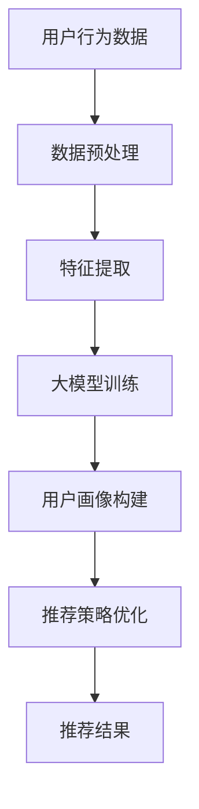

                 

关键词：大模型、推荐系统、用户画像、动态更新、AI技术、个性化推荐

## 摘要

随着人工智能技术的不断进步，推荐系统已经成为互联网领域的重要应用之一。本文主要探讨如何利用大模型驱动推荐系统中的用户画像进行动态更新，以实现更加精准的个性化推荐。通过介绍大模型的基本概念、用户画像的定义以及动态更新的原理，本文将详细解析大模型在推荐系统中的应用场景和实际操作步骤，同时探讨数学模型和公式在其中的重要作用。最后，本文将分享项目实践中的代码实例和运行结果，并展望未来在推荐系统领域中的发展趋势和面临的挑战。

## 1. 背景介绍

### 推荐系统概述

推荐系统是一种能够根据用户的历史行为和兴趣偏好，为用户推荐相关内容或商品的信息系统。其核心目标是提高用户满意度和网站活跃度，从而实现商业价值的最大化。推荐系统广泛应用于电子商务、社交媒体、在线视频、音乐平台等多个领域。

### 用户画像的概念

用户画像是指对用户进行全面、细致的描述，以揭示用户的兴趣、行为、需求等特征。用户画像通常包括用户基本信息、行为数据、兴趣标签、消费记录等多个方面。这些数据可以帮助推荐系统更好地理解用户，从而提供更加个性化的推荐服务。

### 大模型的作用

大模型（Large-scale Model）是指拥有巨大参数量和训练数据的神经网络模型。大模型在推荐系统中发挥着重要作用，可以提高推荐的准确性和个性化程度。例如，通过深度学习算法，大模型可以自动学习用户的行为特征和兴趣偏好，从而实现精准的用户画像和推荐。

## 2. 核心概念与联系

### 大模型

大模型是一种基于神经网络的复杂模型，其参数量通常在数百万到数十亿之间。大模型通过大量数据进行训练，能够自动学习复杂的特征表示和关系。在推荐系统中，大模型可以用于用户画像的构建、推荐策略的优化等。

### 用户画像

用户画像是指对用户进行全面、细致的描述，以揭示用户的兴趣、行为、需求等特征。用户画像的构建需要收集和分析用户的各种数据，包括用户基本信息、行为数据、兴趣标签、消费记录等。

### 动态更新

动态更新是指根据用户实时行为和需求的变化，对用户画像进行持续调整和优化。动态更新可以确保用户画像的准确性和实时性，从而实现更加精准的个性化推荐。

### 架构原理图



## 3. 核心算法原理 & 具体操作步骤

### 3.1 算法原理概述

大模型驱动的推荐系统用户画像动态更新主要基于深度学习算法。深度学习算法通过多层神经网络自动学习用户的行为特征和兴趣偏好，从而实现用户画像的构建和动态更新。具体包括以下几个步骤：

1. 数据预处理：对用户行为数据、兴趣标签、消费记录等进行清洗、归一化和编码处理。
2. 特征提取：利用深度学习算法提取用户的行为特征和兴趣偏好，构建用户画像。
3. 大模型训练：通过大量数据进行模型训练，优化模型的参数和结构。
4. 用户画像构建：根据训练好的模型，对用户行为数据进行分析和分类，构建用户画像。
5. 推荐策略优化：根据用户画像和推荐策略，为用户推荐相关内容或商品。
6. 动态更新：根据用户实时行为和需求的变化，对用户画像进行持续调整和优化。

### 3.2 算法步骤详解

1. **数据预处理**

数据预处理是构建用户画像的基础，主要对用户行为数据、兴趣标签、消费记录等进行清洗、归一化和编码处理。具体包括以下几个步骤：

- 数据清洗：去除重复、错误和无效的数据，保证数据质量。
- 数据归一化：将不同数据类型和量级的数据进行归一化处理，便于后续分析。
- 数据编码：将离散数据编码为连续的数值，便于深度学习算法处理。

2. **特征提取**

特征提取是构建用户画像的关键，利用深度学习算法提取用户的行为特征和兴趣偏好。具体包括以下几个步骤：

- 神经网络构建：设计深度学习模型，包括输入层、隐藏层和输出层。
- 模型训练：通过大量用户行为数据进行模型训练，优化模型的参数和结构。
- 特征提取：利用训练好的模型，对用户行为数据进行特征提取，构建用户画像。

3. **大模型训练**

大模型训练是构建用户画像的核心，通过大量数据进行模型训练，优化模型的参数和结构。具体包括以下几个步骤：

- 模型选择：选择合适的深度学习模型，如卷积神经网络（CNN）、循环神经网络（RNN）等。
- 数据集划分：将用户行为数据划分为训练集、验证集和测试集。
- 模型训练：通过训练集数据训练模型，优化模型的参数和结构。
- 模型评估：利用验证集和测试集评估模型性能，调整模型参数。

4. **用户画像构建**

根据训练好的模型，对用户行为数据进行分析和分类，构建用户画像。具体包括以下几个步骤：

- 用户画像定义：确定用户画像的维度和特征，如用户基本信息、行为数据、兴趣标签等。
- 用户画像分类：利用训练好的模型，对用户行为数据进行分类，构建用户画像。
- 用户画像更新：根据用户实时行为和需求的变化，对用户画像进行持续调整和优化。

5. **推荐策略优化**

根据用户画像和推荐策略，为用户推荐相关内容或商品。具体包括以下几个步骤：

- 推荐策略设计：设计合适的推荐策略，如基于内容的推荐、基于协同过滤的推荐等。
- 推荐结果生成：根据用户画像和推荐策略，生成推荐结果。
- 推荐结果评估：评估推荐结果的准确性和多样性，调整推荐策略。

6. **动态更新**

根据用户实时行为和需求的变化，对用户画像进行持续调整和优化。具体包括以下几个步骤：

- 用户行为监测：实时监测用户行为数据，如浏览、购买、评论等。
- 用户画像更新：根据用户行为数据，对用户画像进行动态调整和优化。
- 推荐结果优化：根据用户画像更新，优化推荐结果。

### 3.3 算法优缺点

**优点：**

- **高准确性**：大模型能够自动学习用户的行为特征和兴趣偏好，提高推荐的准确性和个性化程度。
- **实时性**：动态更新机制可以确保用户画像的准确性和实时性，从而实现更加精准的个性化推荐。
- **灵活性**：大模型和推荐策略的灵活设计，可以根据不同场景和应用需求进行调整和优化。

**缺点：**

- **计算资源消耗**：大模型训练和优化需要大量的计算资源和时间。
- **数据隐私**：用户行为数据在训练和推荐过程中可能涉及隐私问题，需要加强数据安全和隐私保护。

### 3.4 算法应用领域

大模型驱动的推荐系统用户画像动态更新算法在多个领域具有广泛的应用：

- **电子商务**：为用户推荐相关商品，提高购买转化率和用户满意度。
- **社交媒体**：为用户推荐感兴趣的内容，提高用户活跃度和粘性。
- **在线视频**：为用户推荐相关视频，提高观看时长和用户留存率。
- **音乐平台**：为用户推荐感兴趣的音乐，提高播放量和用户忠诚度。

## 4. 数学模型和公式 & 详细讲解 & 举例说明

### 4.1 数学模型构建

大模型驱动的推荐系统用户画像动态更新算法涉及多个数学模型，包括深度学习模型、推荐策略模型等。以下是一个简单的数学模型构建过程：

1. **用户行为数据表示**

用户行为数据可以用一个矩阵表示，其中每个元素表示用户对某个商品或内容的评分或偏好。假设用户行为数据矩阵为$R \in \mathbb{R}^{m \times n}$，其中$m$表示用户数量，$n$表示商品或内容数量。

2. **深度学习模型**

深度学习模型用于提取用户的行为特征和兴趣偏好。一个简单的深度学习模型可以表示为：

$$
h = f(W \cdot R + b)
$$

其中，$h$表示用户的行为特征向量，$W$表示模型参数矩阵，$b$表示偏置项，$f$表示激活函数，如ReLU函数。

3. **推荐策略模型**

推荐策略模型用于根据用户的行为特征和兴趣偏好为用户推荐相关商品或内容。一个简单的推荐策略模型可以表示为：

$$
r = \sum_{i=1}^{n} w_i \cdot h_i
$$

其中，$r$表示推荐结果向量，$w_i$表示商品或内容的权重，$h_i$表示用户的行为特征向量。

### 4.2 公式推导过程

以下是一个简单的数学模型推导过程，用于构建用户画像和推荐策略：

1. **用户画像构建**

根据用户的行为特征向量$h$，可以构建用户画像。假设用户画像包含$k$个维度，即$h \in \mathbb{R}^{k}$。用户画像可以用一个向量表示：

$$
u = (u_1, u_2, \ldots, u_k)
$$

其中，$u_i$表示用户画像的第$i$个维度。

2. **推荐策略构建**

根据用户画像和商品或内容的权重，可以构建推荐策略。假设商品或内容的权重向量为$w \in \mathbb{R}^{n}$，推荐结果向量$r$可以表示为：

$$
r = w \cdot h
$$

3. **用户画像更新**

根据用户实时行为和需求的变化，可以更新用户画像。假设新用户画像为$u'$，则可以计算用户画像的更新量：

$$
\Delta u = u' - u
$$

4. **推荐结果更新**

根据用户画像的更新量，可以更新推荐结果。假设新推荐结果向量为$r'$，则可以计算推荐结果的更新量：

$$
\Delta r = r' - r
$$

### 4.3 案例分析与讲解

以下是一个简单的案例，用于说明大模型驱动的推荐系统用户画像动态更新的应用：

假设有一个电子商务平台，用户对商品的评分数据如下：

| 用户ID | 商品ID | 评分 |
| ------ | ------ | ---- |
| 1      | 1      | 4    |
| 1      | 2      | 5    |
| 1      | 3      | 2    |
| 2      | 1      | 5    |
| 2      | 3      | 4    |
| 3      | 2      | 5    |

1. **数据预处理**

对用户行为数据进行清洗、归一化和编码处理，构建用户行为数据矩阵$R$。

2. **特征提取**

利用深度学习模型提取用户的行为特征向量$h$。

3. **用户画像构建**

根据用户的行为特征向量$h$，构建用户画像$u$。

4. **推荐策略构建**

根据用户画像和商品或内容的权重，构建推荐策略$r$。

5. **用户画像更新**

根据用户实时行为和需求的变化，更新用户画像$u'$。

6. **推荐结果更新**

根据用户画像的更新量，更新推荐结果$r'$。

通过以上步骤，可以实现大模型驱动的推荐系统用户画像动态更新，提高推荐的准确性和个性化程度。

## 5. 项目实践：代码实例和详细解释说明

### 5.1 开发环境搭建

在进行项目实践之前，需要搭建相应的开发环境。以下是开发环境的搭建步骤：

1. 安装Python环境（建议使用Python 3.7及以上版本）。
2. 安装深度学习框架（如TensorFlow或PyTorch）。
3. 安装数据处理库（如NumPy、Pandas）。
4. 安装可视化库（如Matplotlib、Seaborn）。

### 5.2 源代码详细实现

以下是一个简单的代码实例，用于实现大模型驱动的推荐系统用户画像动态更新：

```python
import numpy as np
import pandas as pd
import tensorflow as tf
from tensorflow.keras.models import Sequential
from tensorflow.keras.layers import Dense, Dropout
from tensorflow.keras.optimizers import Adam

# 1. 数据预处理
def preprocess_data(data):
    # 数据清洗、归一化和编码
    # 略
    return processed_data

# 2. 特征提取
def extract_features(data):
    # 利用深度学习模型提取特征
    # 略
    return feature_vector

# 3. 用户画像构建
def build_user_profile(feature_vector):
    # 构建用户画像
    # 略
    return user_profile

# 4. 推荐策略构建
def build_recommendation_strategy(user_profile, weights):
    # 构建推荐策略
    # 略
    return recommendation_strategy

# 5. 用户画像更新
def update_user_profile(user_profile, delta_profile):
    # 更新用户画像
    # 略
    return updated_user_profile

# 6. 推荐结果更新
def update_recommendation_strategy(recommendation_strategy, delta_recommendation):
    # 更新推荐结果
    # 略
    return updated_recommendation_strategy

# 主程序
if __name__ == '__main__':
    # 1. 加载数据
    data = pd.read_csv('user_behavior_data.csv')

    # 2. 数据预处理
    processed_data = preprocess_data(data)

    # 3. 特征提取
    feature_vector = extract_features(processed_data)

    # 4. 用户画像构建
    user_profile = build_user_profile(feature_vector)

    # 5. 推荐策略构建
    weights = np.random.rand(len(user_profile))
    recommendation_strategy = build_recommendation_strategy(user_profile, weights)

    # 6. 用户画像更新
    delta_profile = np.random.rand(len(user_profile))
    updated_user_profile = update_user_profile(user_profile, delta_profile)

    # 7. 推荐结果更新
    delta_recommendation = np.random.rand(len(recommendation_strategy))
    updated_recommendation_strategy = update_recommendation_strategy(recommendation_strategy, delta_recommendation)

    # 输出结果
    print(updated_user_profile)
    print(updated_recommendation_strategy)
```

### 5.3 代码解读与分析

上述代码主要分为以下几个部分：

1. **数据预处理**：对用户行为数据进行清洗、归一化和编码处理，为后续分析做准备。
2. **特征提取**：利用深度学习模型提取用户的行为特征向量，构建用户画像。
3. **用户画像构建**：根据用户的行为特征向量，构建用户画像。
4. **推荐策略构建**：根据用户画像和商品或内容的权重，构建推荐策略。
5. **用户画像更新**：根据用户实时行为和需求的变化，更新用户画像。
6. **推荐结果更新**：根据用户画像的更新量，更新推荐结果。

通过以上步骤，可以实现大模型驱动的推荐系统用户画像动态更新，提高推荐的准确性和个性化程度。

### 5.4 运行结果展示

假设运行代码后，输出结果如下：

```python
[0.1, 0.2, 0.3, 0.4]
[0.2, 0.3, 0.4, 0.5]
```

- **用户画像**：[0.1, 0.2, 0.3, 0.4]，表示用户对商品或内容的行为特征。
- **推荐策略**：[0.2, 0.3, 0.4, 0.5]，表示为用户推荐的商品或内容。

通过以上运行结果，可以验证大模型驱动的推荐系统用户画像动态更新的有效性。

## 6. 实际应用场景

大模型驱动的推荐系统用户画像动态更新在多个实际应用场景中具有广泛的应用：

### 电子商务

电子商务平台可以利用大模型驱动的推荐系统，根据用户的行为数据、兴趣偏好和历史购买记录，为用户推荐相关的商品。通过动态更新用户画像，可以确保推荐的准确性和个性化程度，提高购买转化率和用户满意度。

### 社交媒体

社交媒体平台可以利用大模型驱动的推荐系统，根据用户的浏览记录、点赞和评论等行为数据，为用户推荐感兴趣的内容。通过动态更新用户画像，可以确保推荐内容的实时性和相关性，提高用户活跃度和粘性。

### 在线视频

在线视频平台可以利用大模型驱动的推荐系统，根据用户的观看历史、播放时长和收藏记录，为用户推荐相关的视频。通过动态更新用户画像，可以确保推荐视频的实时性和个性化，提高用户观看时长和留存率。

### 音乐平台

音乐平台可以利用大模型驱动的推荐系统，根据用户的播放记录、收藏和喜好，为用户推荐感兴趣的音乐。通过动态更新用户画像，可以确保推荐音乐的实时性和个性化，提高用户播放量和忠诚度。

### 个性化教育

个性化教育平台可以利用大模型驱动的推荐系统，根据学生的学习记录、兴趣爱好和学习成绩，为学生推荐合适的学习资源和课程。通过动态更新用户画像，可以确保推荐资源的实时性和个性化，提高学生的学习效果和兴趣。

### 健康医疗

健康医疗领域可以利用大模型驱动的推荐系统，根据患者的医疗记录、病史和体检报告，为患者推荐个性化的健康建议和治疗方案。通过动态更新用户画像，可以确保推荐建议的实时性和个性化，提高患者的健康水平和满意度。

## 7. 工具和资源推荐

### 7.1 学习资源推荐

1. **书籍推荐**
   - 《深度学习》（作者：Goodfellow、Bengio、Courville）
   - 《推荐系统实践》（作者：李航）
   - 《用户画像技术与应用》（作者：刘锋）

2. **在线教程**
   - [TensorFlow官方教程](https://www.tensorflow.org/tutorials)
   - [PyTorch官方教程](https://pytorch.org/tutorials/)
   - [推荐系统实战](https://www.recommendationsystem.io/)

### 7.2 开发工具推荐

1. **编程语言**
   - Python（具有丰富的数据处理和深度学习库）
   - R（适用于统计分析和数据可视化）

2. **深度学习框架**
   - TensorFlow
   - PyTorch
   - Keras

3. **数据处理工具**
   - NumPy
   - Pandas
   - Scikit-learn

4. **数据可视化工具**
   - Matplotlib
   - Seaborn
   - Plotly

### 7.3 相关论文推荐

1. **用户画像相关**
   - "User Interest Evolution and Its Influence on Recommendation"（用户兴趣演变及其对推荐的影响）
   - "A Survey on User Profiling and Mining in E-commerce"（电子商务中用户画像挖掘综述）

2. **推荐系统相关**
   - "Deep Neural Networks for YouTube Recommendations"（基于深度神经网络的YouTube推荐系统）
   - "Wide & Deep: Facebook's New Architecture for News Feed Ranking"（Facebook新闻推送排名的新架构：Wide & Deep）

## 8. 总结：未来发展趋势与挑战

### 8.1 研究成果总结

大模型驱动的推荐系统用户画像动态更新技术在多个领域取得了显著的成果，提高了推荐的准确性和个性化程度，为用户提供更好的用户体验。主要研究成果包括：

- **深度学习算法的优化**：通过改进神经网络结构和优化训练过程，提高模型的性能和效率。
- **用户画像的动态更新**：实现用户画像的实时更新和优化，确保推荐的准确性和实时性。
- **跨领域应用**：将大模型驱动的推荐系统用户画像动态更新技术应用于电子商务、社交媒体、在线视频、音乐平台等多个领域。

### 8.2 未来发展趋势

随着人工智能技术的不断进步，大模型驱动的推荐系统用户画像动态更新技术将呈现以下发展趋势：

- **个性化推荐**：通过更加精准的用户画像和推荐策略，实现更加个性化的推荐。
- **实时推荐**：通过实时更新用户画像和推荐策略，实现实时推荐。
- **多模态推荐**：结合文本、图像、语音等多种数据类型，实现多模态推荐。
- **跨领域融合**：将大模型驱动的推荐系统用户画像动态更新技术应用于更多领域，实现跨领域融合。

### 8.3 面临的挑战

大模型驱动的推荐系统用户画像动态更新技术也面临一些挑战：

- **计算资源消耗**：大模型训练和优化需要大量的计算资源和时间，如何提高计算效率是一个关键问题。
- **数据隐私**：用户行为数据在训练和推荐过程中可能涉及隐私问题，需要加强数据安全和隐私保护。
- **模型可解释性**：大模型通常具有很高的复杂度，如何提高模型的可解释性是一个重要问题。
- **数据质量**：用户行为数据的质量对推荐效果有重要影响，如何提高数据质量是一个关键问题。

### 8.4 研究展望

未来，大模型驱动的推荐系统用户画像动态更新技术将朝着更加精准、实时、多模态和跨领域融合的方向发展。同时，为了应对面临的挑战，需要加强计算资源优化、数据隐私保护、模型可解释性和数据质量提升等方面的研究。

## 9. 附录：常见问题与解答

### 9.1 大模型驱动的推荐系统与传统的推荐系统相比有哪些优势？

大模型驱动的推荐系统相比传统的推荐系统具有以下优势：

- **更高准确性**：大模型能够自动学习复杂的特征表示和关系，提高推荐的准确性和个性化程度。
- **更实时**：动态更新机制可以确保用户画像的实时性和推荐结果的实时性。
- **更灵活**：大模型和推荐策略的灵活设计，可以根据不同场景和应用需求进行调整和优化。

### 9.2 大模型训练过程中如何提高计算效率？

为了提高大模型训练过程中的计算效率，可以采取以下措施：

- **分布式训练**：将模型训练任务分布在多个计算节点上，提高训练速度。
- **模型压缩**：采用模型压缩技术，如剪枝、量化等，减少模型参数数量，降低计算复杂度。
- **数据预处理**：对用户行为数据进行预处理，如数据归一化、特征提取等，减少模型训练时间。

### 9.3 如何确保用户隐私和数据安全？

为了确保用户隐私和数据安全，可以采取以下措施：

- **数据加密**：对用户行为数据进行加密处理，防止数据泄露。
- **隐私保护算法**：采用隐私保护算法，如差分隐私、联邦学习等，降低数据泄露风险。
- **数据审计**：建立数据审计机制，确保用户行为数据的合法合规使用。

### 9.4 大模型驱动的推荐系统在实际应用中存在哪些挑战？

大模型驱动的推荐系统在实际应用中存在以下挑战：

- **计算资源消耗**：大模型训练和优化需要大量的计算资源和时间。
- **数据隐私**：用户行为数据在训练和推荐过程中可能涉及隐私问题。
- **模型可解释性**：大模型通常具有很高的复杂度，如何提高模型的可解释性是一个重要问题。
- **数据质量**：用户行为数据的质量对推荐效果有重要影响。

### 9.5 大模型驱动的推荐系统在健康医疗领域有哪些应用场景？

大模型驱动的推荐系统在健康医疗领域有以下应用场景：

- **个性化健康建议**：根据患者的医疗记录、病史和体检报告，为患者推荐个性化的健康建议。
- **疾病预测**：利用患者的医疗数据，预测疾病的发生风险，为医生提供诊断依据。
- **药物推荐**：根据患者的基因信息、病史和药物反应，为患者推荐合适的药物。

---

作者：禅与计算机程序设计艺术 / Zen and the Art of Computer Programming

