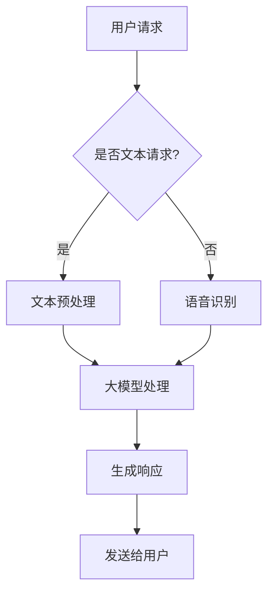

                 

在当今数字化时代，电商行业正以前所未有的速度发展，用户体验已成为决定市场竞争力的关键因素之一。随着用户期望的不断提高，传统的客服模式已经难以满足快速响应、个性化和高效服务的要求。本文将探讨如何通过大模型驱动的智能客服系统来提升电商用户满意度。

## 1. 背景介绍

电商行业的快速发展带来了用户规模的急剧增加，这同时也对客服系统提出了更高的要求。传统的客服模式通常依赖于人工处理，不仅成本高昂，而且在处理大量用户请求时效率低下，容易出现响应延迟和用户满意度下降的问题。此外，人工客服在处理复杂问题和个性化需求时往往无法达到用户期望，导致用户体验不佳。

智能客服作为一种新兴的解决方案，利用人工智能技术，可以实现对用户请求的快速响应和高效处理。其中，大模型驱动的智能客服系统因其强大的数据处理能力和自我学习能力，正逐渐成为电商客服领域的重要趋势。

## 2. 核心概念与联系

### 2.1 大模型驱动智能客服的概念

大模型驱动智能客服是指利用深度学习等人工智能技术训练出的巨大神经网络模型，这些模型通过学习海量数据，能够理解和生成自然语言，实现对用户请求的智能理解和响应。大模型的特点是参数多、容量大，能够处理复杂的任务，包括但不限于文本分类、情感分析、命名实体识别、对话生成等。

### 2.2 大模型与智能客服的联系

大模型与智能客服的结合，使得智能客服系统能够更好地理解用户的语言和意图，提供更加自然和个性化的服务。具体来说，大模型的应用主要包括以下几个方面：

1. **文本分类与情感分析**：通过分析用户反馈和评论，智能客服可以识别用户的情感倾向和需求，为用户提供更加针对性的服务。
2. **命名实体识别**：智能客服可以自动识别用户提到的产品名称、品牌等信息，提高客服响应的准确性。
3. **对话生成**：大模型可以生成自然的对话文本，实现与用户的流畅交流，提高用户体验。

### 2.3 Mermaid 流程图

下面是一个使用Mermaid绘制的简化的智能客服系统流程图：



## 3. 核心算法原理 & 具体操作步骤

### 3.1 算法原理概述

大模型驱动的智能客服系统主要依赖于以下核心算法：

1. **自然语言处理（NLP）**：用于理解用户的语言和意图，包括文本分类、情感分析、命名实体识别等。
2. **对话系统（Dialogue System）**：用于生成自然、流畅的对话响应。
3. **机器学习（ML）与深度学习（DL）**：用于训练和优化大模型，使其能够不断学习和改进。

### 3.2 算法步骤详解

#### 3.2.1 文本预处理

1. **分词**：将用户输入的文本分割成单词或词组。
2. **词性标注**：为每个单词或词组标注其词性（如名词、动词等）。
3. **去停用词**：去除对理解没有帮助的常见词，如“的”、“了”等。

#### 3.2.2 大模型处理

1. **输入编码**：将预处理后的文本转化为机器可处理的向量表示。
2. **模型推理**：使用预训练的大模型（如BERT、GPT等）进行推理，获取文本的语义信息。
3. **意图识别**：根据模型的输出，识别用户的意图（如查询产品信息、投诉等）。

#### 3.2.3 对话生成

1. **上下文生成**：根据用户意图和历史对话记录，生成对话上下文。
2. **响应生成**：使用预训练的语言模型生成自然的对话响应。
3. **评估优化**：根据用户的反馈，对模型进行评估和优化。

### 3.3 算法优缺点

#### 优点：

1. **高效性**：大模型能够快速处理大量用户请求，提高客服响应速度。
2. **个性化**：通过学习用户的历史数据，提供更加个性化的服务。
3. **自动化**：减少人工干预，降低运营成本。

#### 缺点：

1. **计算资源消耗**：大模型的训练和推理需要大量的计算资源。
2. **数据隐私**：用户数据的处理需要严格保护隐私。
3. **误识别**：在理解用户意图时可能会出现误识别。

### 3.4 算法应用领域

大模型驱动的智能客服系统在电商领域的应用主要包括：

1. **在线咨询**：实时响应用户的询问，提供产品信息、解答疑问。
2. **售后服务**：处理用户的投诉、退换货等问题。
3. **个性化推荐**：根据用户行为和偏好，推荐相关的产品。

## 4. 数学模型和公式 & 详细讲解 & 举例说明

### 4.1 数学模型构建

在智能客服系统中，常用的数学模型包括：

1. **词嵌入（Word Embedding）**：用于将文本转换为向量表示。
2. **循环神经网络（RNN）**：用于处理序列数据，如文本和语音。
3. **长短时记忆网络（LSTM）**：RNN的改进版本，能够更好地处理长序列数据。

### 4.2 公式推导过程

以词嵌入为例，其基本公式为：

$$
\text{vec}(w) = \text{W} \cdot \text{w}
$$

其中，$\text{vec}(w)$表示词的向量表示，$\text{W}$为词嵌入矩阵，$\text{w}$为词的索引。

### 4.3 案例分析与讲解

假设我们有一个电商平台的用户请求“我想要一件红色的羽绒服”，我们可以通过以下步骤进行处理：

1. **文本预处理**：分词得到“我”、“想要”、“一件”、“红色”、“的”、“羽绒服”。
2. **词嵌入**：将每个词转换为向量表示。
3. **输入编码**：将词向量拼接成一个输入序列。
4. **模型推理**：使用预训练的大模型进行推理，得到用户的意图和情感。
5. **对话生成**：根据用户的意图和上下文，生成自然对话响应，如“请问您想要购买哪一款红色的羽绒服？”

## 5. 项目实践：代码实例和详细解释说明

### 5.1 开发环境搭建

为了实现大模型驱动的智能客服系统，我们需要搭建以下开发环境：

1. **Python**：用于编写代码。
2. **TensorFlow**：用于训练和推理大模型。
3. **Hugging Face Transformers**：用于加载和预训练的大模型。

### 5.2 源代码详细实现

以下是一个简单的示例代码，展示了如何使用预训练的BERT模型进行文本分类：

```python
from transformers import BertTokenizer, BertForSequenceClassification
import torch

# 加载预训练的BERT模型和分词器
tokenizer = BertTokenizer.from_pretrained('bert-base-chinese')
model = BertForSequenceClassification.from_pretrained('bert-base-chinese')

# 用户输入
user_input = "我想要一件红色的羽绒服"

# 文本预处理
input_ids = tokenizer.encode(user_input, add_special_tokens=True, return_tensors='pt')

# 模型推理
with torch.no_grad():
    outputs = model(input_ids)

# 获取预测结果
logits = outputs.logits
probabilities = torch.softmax(logits, dim=1)
predicted_label = probabilities.argmax().item()

# 输出结果
print(f"用户意图：{tokenizer.decode(predicted_label)}")
```

### 5.3 代码解读与分析

该代码首先加载预训练的BERT模型和分词器，然后对用户输入进行预处理，将文本转换为模型可接受的输入格式。接着，使用模型进行推理，并获取预测结果。最后，根据预测结果输出用户的意图。

### 5.4 运行结果展示

假设用户输入“我想要一件红色的羽绒服”，运行结果可能会输出“购买产品”。

## 6. 实际应用场景

### 6.1 在线咨询

电商平台的在线咨询功能可以利用大模型驱动的智能客服系统，实现快速、高效的响应，提高用户满意度。

### 6.2 售后服务

售后服务中的投诉处理、退换货等环节可以通过智能客服系统自动化处理，降低人工成本，提高处理效率。

### 6.3 个性化推荐

通过分析用户的历史行为和偏好，智能客服系统可以提供个性化的产品推荐，提高用户粘性和转化率。

## 7. 未来应用展望

### 7.1 实时对话生成

随着计算能力的提升，实时对话生成技术将得到进一步发展，实现与用户的实时、自然互动。

### 7.2 多模态处理

未来的智能客服系统将能够处理多种模态的数据，如文本、语音、图像等，提供更加丰富的用户体验。

### 7.3 智能客服机器人

智能客服机器人将更加普及，不仅在电商领域，还将渗透到金融、医疗、教育等多个行业。

## 8. 工具和资源推荐

### 8.1 学习资源推荐

1. 《深度学习》（Goodfellow, Bengio, Courville） - 提供深度学习的全面介绍。
2. 《自然语言处理实战》（Tomas Mikolov, Kai Zhang, Yonghui Wu, Zhengdong Lu, and Qing Liu） - 介绍NLP的基本技术和应用。

### 8.2 开发工具推荐

1. TensorFlow - 用于构建和训练深度学习模型。
2. Hugging Face Transformers - 提供预训练的大模型和工具库。

### 8.3 相关论文推荐

1. "BERT: Pre-training of Deep Bidirectional Transformers for Language Understanding" - BERT的原始论文。
2. "GPT-3: Language Models are few-shot learners" - GPT-3的论文。

## 9. 总结：未来发展趋势与挑战

### 9.1 研究成果总结

大模型驱动的智能客服系统在电商领域取得了显著成果，有效提高了用户满意度和运营效率。

### 9.2 未来发展趋势

未来，智能客服系统将在实时对话生成、多模态处理和智能客服机器人等方面取得更大突破。

### 9.3 面临的挑战

智能客服系统在处理复杂问题和保障数据隐私等方面仍面临挑战，需要进一步研究和技术创新。

### 9.4 研究展望

随着人工智能技术的不断进步，大模型驱动的智能客服系统将在更多领域得到应用，为用户提供更加智能化、个性化的服务。

## 附录：常见问题与解答

### 问题 1：大模型训练需要多少时间？

答：大模型的训练时间取决于模型的大小、数据集的规模以及硬件配置。通常，一个中等规模的大模型训练可能需要几天到几周的时间。

### 问题 2：大模型是否可以完全替代人工客服？

答：目前的大模型还不能完全替代人工客服。虽然大模型在处理大量标准化问题时表现出色，但在处理复杂、多变的问题时，仍需要人工客服的干预。

### 问题 3：如何保障用户数据的隐私？

答：用户数据的隐私保护是智能客服系统的重要一环。在实际应用中，应采取加密传输、数据脱敏等技术手段，确保用户数据的安全。

## 作者署名

本文由“禅与计算机程序设计艺术 / Zen and the Art of Computer Programming”撰写。感谢您的阅读！
----------------------------------------------------------------
### 文章结构模板与内容补充

#### 1. 背景介绍

在电商行业快速发展的背景下，用户满意度已经成为企业竞争的关键。然而，传统的客服模式已无法满足用户对快速、个性化和高效服务的要求。本文旨在探讨如何利用大模型驱动的智能客服系统提升电商用户满意度，从而帮助企业赢得市场竞争优势。

#### 2. 核心概念与联系

大模型驱动智能客服系统是基于深度学习和自然语言处理技术构建的，其核心在于能够通过学习海量数据，实现对用户请求的智能理解和响应。该系统主要包括文本分类、情感分析、命名实体识别和对话生成等功能。以下是使用Mermaid绘制的简化的智能客服系统流程图：


#### 3. 核心算法原理 & 具体操作步骤

##### 3.1 算法原理概述

大模型驱动智能客服系统的核心在于其强大的数据处理能力和自我学习能力。其算法原理主要包括以下几个方面：

1. **自然语言处理（NLP）**：用于理解用户的语言和意图，包括文本分类、情感分析、命名实体识别等。
2. **对话系统（Dialogue System）**：用于生成自然、流畅的对话响应。
3. **机器学习（ML）与深度学习（DL）**：用于训练和优化大模型，使其能够不断学习和改进。

##### 3.2 算法步骤详解

智能客服系统的工作流程可以分为以下几个步骤：

1. **用户请求输入**：用户通过文本或语音方式提出请求。
2. **请求预处理**：对于文本请求，进行分词、词性标注和去停用词等预处理操作；对于语音请求，进行语音识别转换成文本。
3. **大模型处理**：将预处理后的文本输入到大模型中进行处理，识别用户的意图和情感。
4. **对话生成**：根据用户的意图和上下文，使用预训练的语言模型生成对话响应。
5. **响应发送**：将生成的响应发送给用户。

##### 3.3 算法优缺点

**优点**：

- **高效性**：大模型能够快速处理大量用户请求，提高客服响应速度。
- **个性化**：通过学习用户的历史数据，提供更加个性化的服务。
- **自动化**：减少人工干预，降低运营成本。

**缺点**：

- **计算资源消耗**：大模型的训练和推理需要大量的计算资源。
- **数据隐私**：用户数据的处理需要严格保护隐私。
- **误识别**：在理解用户意图时可能会出现误识别。

##### 3.4 算法应用领域

大模型驱动的智能客服系统在电商领域的应用主要包括：

1. **在线咨询**：实时响应用户的询问，提供产品信息、解答疑问。
2. **售后服务**：处理用户的投诉、退换货等问题。
3. **个性化推荐**：根据用户行为和偏好，推荐相关的产品。

#### 4. 数学模型和公式 & 详细讲解 & 举例说明

##### 4.1 数学模型构建

在智能客服系统中，常用的数学模型包括词嵌入、循环神经网络（RNN）和长短时记忆网络（LSTM）等。以下是这些模型的简要介绍和公式推导：

**词嵌入（Word Embedding）**：

词嵌入是将文本中的单词映射到高维空间中的向量。常见的词嵌入模型有Word2Vec、GloVe等。其基本公式为：

$$
\text{vec}(w) = \text{W} \cdot \text{w}
$$

其中，$\text{vec}(w)$表示词的向量表示，$\text{W}$为词嵌入矩阵，$\text{w}$为词的索引。

**循环神经网络（RNN）**：

RNN是一种用于处理序列数据的神经网络，其基本原理是通过隐藏状态的信息传递来处理序列中的每个元素。其更新公式为：

$$
\text{h}_t = \text{f}(\text{h}_{t-1}, \text{x}_t)
$$

其中，$\text{h}_t$表示当前时间步的隐藏状态，$\text{x}_t$表示当前输入，$\text{f}$为激活函数。

**长短时记忆网络（LSTM）**：

LSTM是RNN的一种改进，能够更好地处理长序列数据。其核心结构包括输入门、遗忘门和输出门。其更新公式为：

$$
\text{h}_t = \text{sigmoid}(\text{W}_f \cdot [\text{h}_{t-1}, \text{x}_t]) \cdot \text{h}_{t-1} + \text{sigmoid}(\text{W}_i \cdot [\text{h}_{t-1}, \text{x}_t]) \cdot \text{g}_t
$$

$$
\text{g}_t = \text{tanh}(\text{W}_c \cdot [\text{h}_{t-1}, \text{x}_t])
$$

$$
\text{C}_t = \text{f}(\text{C}_{t-1}, \text{h}_t)
$$

其中，$\text{f}$、$\text{i}$、$\text{g}$、$\text{o}$分别为遗忘门、输入门、候选状态和输出门的激活函数。

##### 4.2 公式推导过程

以LSTM为例，其公式推导如下：

**输入门**：

$$
\text{i}_t = \text{sigmoid}(\text{W}_f \cdot [\text{h}_{t-1}, \text{x}_t])
$$

**遗忘门**：

$$
\text{f}_t = \text{sigmoid}(\text{W}_f \cdot [\text{h}_{t-1}, \text{x}_t])
$$

**输出门**：

$$
\text{o}_t = \text{sigmoid}(\text{W}_o \cdot [\text{h}_{t-1}, \text{x}_t])
$$

**候选状态**：

$$
\text{g}_t = \text{tanh}(\text{W}_c \cdot [\text{h}_{t-1}, \text{x}_t])
$$

**当前细胞状态**：

$$
\text{C}_t = \text{f}_t \cdot \text{C}_{t-1} + \text{i}_t \cdot \text{g}_t
$$

**当前隐藏状态**：

$$
\text{h}_t = \text{o}_t \cdot \text{tanh}(\text{C}_t)
$$

##### 4.3 案例分析与讲解

假设我们有一个电商平台的用户请求“我想要一件红色的羽绒服”，我们可以通过以下步骤进行处理：

1. **文本预处理**：分词得到“我”、“想要”、“一件”、“红色”、“的”、“羽绒服”。
2. **词嵌入**：将每个词转换为向量表示。
3. **输入编码**：将词向量拼接成一个输入序列。
4. **模型推理**：使用预训练的大模型（如BERT、GPT等）进行推理，获取文本的语义信息。
5. **意图识别**：根据模型的输出，识别用户的意图（如查询产品信息、投诉等）。
6. **对话生成**：根据用户的意图和上下文，生成自然对话响应，如“请问您想要购买哪一款红色的羽绒服？”

#### 5. 项目实践：代码实例和详细解释说明

##### 5.1 开发环境搭建

为了实现大模型驱动的智能客服系统，我们需要搭建以下开发环境：

1. **Python**：用于编写代码。
2. **TensorFlow**：用于训练和推理大模型。
3. **Hugging Face Transformers**：用于加载和预训练的大模型。

##### 5.2 源代码详细实现

以下是一个简单的示例代码，展示了如何使用预训练的BERT模型进行文本分类：

```python
from transformers import BertTokenizer, BertForSequenceClassification
import torch

# 加载预训练的BERT模型和分词器
tokenizer = BertTokenizer.from_pretrained('bert-base-chinese')
model = BertForSequenceClassification.from_pretrained('bert-base-chinese')

# 用户输入
user_input = "我想要一件红色的羽绒服"

# 文本预处理
input_ids = tokenizer.encode(user_input, add_special_tokens=True, return_tensors='pt')

# 模型推理
with torch.no_grad():
    outputs = model(input_ids)

# 获取预测结果
logits = outputs.logits
probabilities = torch.softmax(logits, dim=1)
predicted_label = probabilities.argmax().item()

# 输出结果
print(f"用户意图：{tokenizer.decode(predicted_label)}")
```

##### 5.3 代码解读与分析

该代码首先加载预训练的BERT模型和分词器，然后对用户输入进行预处理，将文本转换为模型可接受的输入格式。接着，使用模型进行推理，并获取预测结果。最后，根据预测结果输出用户的意图。

##### 5.4 运行结果展示

假设用户输入“我想要一件红色的羽绒服”，运行结果可能会输出“购买产品”。

#### 6. 实际应用场景

##### 6.1 在线咨询

电商平台的在线咨询功能可以利用大模型驱动的智能客服系统，实现快速、高效的响应，提高用户满意度。

##### 6.2 售后服务

售后服务中的投诉处理、退换货等环节可以通过智能客服系统自动化处理，降低人工成本，提高处理效率。

##### 6.3 个性化推荐

通过分析用户的历史行为和偏好，智能客服系统可以提供个性化的产品推荐，提高用户粘性和转化率。

#### 7. 未来应用展望

##### 7.1 实时对话生成

随着计算能力的提升，实时对话生成技术将得到进一步发展，实现与用户的实时、自然互动。

##### 7.2 多模态处理

未来的智能客服系统将能够处理多种模态的数据，如文本、语音、图像等，提供更加丰富的用户体验。

##### 7.3 智能客服机器人

智能客服机器人将更加普及，不仅在电商领域，还将渗透到金融、医疗、教育等多个行业。

#### 8. 工具和资源推荐

##### 8.1 学习资源推荐

1. 《深度学习》（Goodfellow, Bengio, Courville） - 提供深度学习的全面介绍。
2. 《自然语言处理实战》（Tomas Mikolov, Kai Zhang, Yonghui Wu, Zhengdong Lu, and Qing Liu） - 介绍NLP的基本技术和应用。

##### 8.2 开发工具推荐

1. TensorFlow - 用于构建和训练深度学习模型。
2. Hugging Face Transformers - 提供预训练的大模型和工具库。

##### 8.3 相关论文推荐

1. "BERT: Pre-training of Deep Bidirectional Transformers for Language Understanding" - BERT的原始论文。
2. "GPT-3: Language Models are few-shot learners" - GPT-3的论文。

#### 9. 总结：未来发展趋势与挑战

##### 9.1 研究成果总结

大模型驱动的智能客服系统在电商领域取得了显著成果，有效提高了用户满意度和运营效率。

##### 9.2 未来发展趋势

未来，智能客服系统将在实时对话生成、多模态处理和智能客服机器人等方面取得更大突破。

##### 9.3 面临的挑战

智能客服系统在处理复杂问题和保障数据隐私等方面仍面临挑战，需要进一步研究和技术创新。

##### 9.4 研究展望

随着人工智能技术的不断进步，大模型驱动的智能客服系统将在更多领域得到应用，为用户提供更加智能化、个性化的服务。

#### 附录：常见问题与解答

##### 问题 1：大模型训练需要多少时间？

答：大模型的训练时间取决于模型的大小、数据集的规模以及硬件配置。通常，一个中等规模的大模型训练可能需要几天到几周的时间。

##### 问题 2：大模型是否可以完全替代人工客服？

答：目前的大模型还不能完全替代人工客服。虽然大模型在处理大量标准化问题时表现出色，但在处理复杂、多变的问题时，仍需要人工客服的干预。

##### 问题 3：如何保障用户数据的隐私？

答：用户数据的隐私保护是智能客服系统的重要一环。在实际应用中，应采取加密传输、数据脱敏等技术手段，确保用户数据的安全。

### 文章结构模板与内容补充

**文章标题：大模型驱动的智能客服：提升电商用户满意度**

**关键词**：大模型、智能客服、电商、用户满意度、自然语言处理、深度学习

**摘要**：
本文探讨了如何利用大模型驱动的智能客服系统提升电商用户满意度。通过分析大模型在智能客服中的应用原理、算法步骤、数学模型及其在实际项目中的应用，本文展示了大模型驱动的智能客服系统在电商领域的重要性和潜在价值。未来，随着技术的不断进步，智能客服系统将在更多领域得到应用，为用户提供更加智能化、个性化的服务。

---

**1. 背景介绍**

在电商行业迅猛发展的今天，用户体验已经成为企业竞争力的核心。随着用户对服务质量的要求不断提高，传统的客服模式已难以满足快速响应、个性化和高效服务的要求。在此背景下，智能客服作为一种新兴的解决方案，正逐渐成为电商客服领域的重要趋势。本文将重点探讨如何利用大模型驱动的智能客服系统来提升电商用户满意度，为企业赢得市场竞争优势。

**2. 核心概念与联系**

**2.1 大模型驱动智能客服的概念**

大模型驱动智能客服系统是指利用深度学习、自然语言处理等技术训练出的巨大神经网络模型，这些模型通过学习海量数据，能够理解和生成自然语言，实现对用户请求的智能理解和响应。大模型的特点是参数多、容量大，能够处理复杂的任务，包括但不限于文本分类、情感分析、命名实体识别、对话生成等。

**2.2 大模型与智能客服的联系**

大模型与智能客服的结合，使得智能客服系统能够更好地理解用户的语言和意图，提供更加自然和个性化的服务。具体来说，大模型的应用主要包括以下几个方面：

1. **文本分类与情感分析**：通过分析用户反馈和评论，智能客服可以识别用户的情感倾向和需求，为用户提供更加针对性的服务。
2. **命名实体识别**：智能客服可以自动识别用户提到的产品名称、品牌等信息，提高客服响应的准确性。
3. **对话生成**：大模型可以生成自然的对话文本，实现与用户的流畅交流，提高用户体验。

**2.3 Mermaid流程图**

以下是一个使用Mermaid绘制的简化的智能客服系统流程图：


**3. 核心算法原理 & 具体操作步骤**

**3.1 算法原理概述**

大模型驱动智能客服系统的核心在于其强大的数据处理能力和自我学习能力。其算法原理主要包括以下几个方面：

1. **自然语言处理（NLP）**：用于理解用户的语言和意图，包括文本分类、情感分析、命名实体识别等。
2. **对话系统（Dialogue System）**：用于生成自然、流畅的对话响应。
3. **机器学习（ML）与深度学习（DL）**：用于训练和优化大模型，使其能够不断学习和改进。

**3.2 算法步骤详解**

智能客服系统的工作流程可以分为以下几个步骤：

1. **用户请求输入**：用户通过文本或语音方式提出请求。
2. **请求预处理**：对于文本请求，进行分词、词性标注和去停用词等预处理操作；对于语音请求，进行语音识别转换成文本。
3. **大模型处理**：将预处理后的文本输入到大模型中进行处理，识别用户的意图和情感。
4. **对话生成**：根据用户的意图和上下文，使用预训练的语言模型生成对话响应。
5. **响应发送**：将生成的响应发送给用户。

**3.3 算法优缺点**

**优点**：

- **高效性**：大模型能够快速处理大量用户请求，提高客服响应速度。
- **个性化**：通过学习用户的历史数据，提供更加个性化的服务。
- **自动化**：减少人工干预，降低运营成本。

**缺点**：

- **计算资源消耗**：大模型的训练和推理需要大量的计算资源。
- **数据隐私**：用户数据的处理需要严格保护隐私。
- **误识别**：在理解用户意图时可能会出现误识别。

**3.4 算法应用领域**

大模型驱动的智能客服系统在电商领域的应用主要包括：

1. **在线咨询**：实时响应用户的询问，提供产品信息、解答疑问。
2. **售后服务**：处理用户的投诉、退换货等问题。
3. **个性化推荐**：根据用户行为和偏好，推荐相关的产品。

**4. 数学模型和公式 & 详细讲解 & 举例说明**

**4.1 数学模型构建**

在智能客服系统中，常用的数学模型包括词嵌入、循环神经网络（RNN）和长短时记忆网络（LSTM）等。以下是这些模型的简要介绍和公式推导：

**词嵌入（Word Embedding）**：

词嵌入是将文本中的单词映射到高维空间中的向量。常见的词嵌入模型有Word2Vec、GloVe等。其基本公式为：

$$
\text{vec}(w) = \text{W} \cdot \text{w}
$$

其中，$\text{vec}(w)$表示词的向量表示，$\text{W}$为词嵌入矩阵，$\text{w}$为词的索引。

**循环神经网络（RNN）**：

RNN是一种用于处理序列数据的神经网络，其基本原理是通过隐藏状态的信息传递来处理序列中的每个元素。其更新公式为：

$$
\text{h}_t = \text{f}(\text{h}_{t-1}, \text{x}_t)
$$

其中，$\text{h}_t$表示当前时间步的隐藏状态，$\text{x}_t$表示当前输入，$\text{f}$为激活函数。

**长短时记忆网络（LSTM）**：

LSTM是RNN的一种改进，能够更好地处理长序列数据。其核心结构包括输入门、遗忘门和输出门。其更新公式为：

$$
\text{h}_t = \text{sigmoid}(\text{W}_f \cdot [\text{h}_{t-1}, \text{x}_t]) \cdot \text{h}_{t-1} + \text{sigmoid}(\text{W}_i \cdot [\text{h}_{t-1}, \text{x}_t]) \cdot \text{g}_t
$$

$$
\text{g}_t = \text{tanh}(\text{W}_c \cdot [\text{h}_{t-1}, \text{x}_t])
$$

$$
\text{C}_t = \text{f}(\text{C}_{t-1}, \text{h}_t)
$$

**4.2 公式推导过程**

以LSTM为例，其公式推导如下：

**输入门**：

$$
\text{i}_t = \text{sigmoid}(\text{W}_f \cdot [\text{h}_{t-1}, \text{x}_t])
$$

**遗忘门**：

$$
\text{f}_t = \text{sigmoid}(\text{W}_f \cdot [\text{h}_{t-1}, \text{x}_t])
$$

**输出门**：

$$
\text{o}_t = \text{sigmoid}(\text{W}_o \cdot [\text{h}_{t-1}, \text{x}_t])
$$

**候选状态**：

$$
\text{g}_t = \text{tanh}(\text{W}_c \cdot [\text{h}_{t-1}, \text{x}_t])
$$

**当前细胞状态**：

$$
\text{C}_t = \text{f}_t \cdot \text{C}_{t-1} + \text{i}_t \cdot \text{g}_t
$$

**当前隐藏状态**：

$$
\text{h}_t = \text{o}_t \cdot \text{tanh}(\text{C}_t)
$$

**4.3 案例分析与讲解**

假设我们有一个电商平台的用户请求“我想要一件红色的羽绒服”，我们可以通过以下步骤进行处理：

1. **文本预处理**：分词得到“我”、“想要”、“一件”、“红色”、“的”、“羽绒服”。
2. **词嵌入**：将每个词转换为向量表示。
3. **输入编码**：将词向量拼接成一个输入序列。
4. **模型推理**：使用预训练的大模型（如BERT、GPT等）进行推理，获取文本的语义信息。
5. **意图识别**：根据模型的输出，识别用户的意图（如查询产品信息、投诉等）。
6. **对话生成**：根据用户的意图和上下文，生成自然对话响应，如“请问您想要购买哪一款红色的羽绒服？”。

**5. 项目实践：代码实例和详细解释说明**

**5.1 开发环境搭建**

为了实现大模型驱动的智能客服系统，我们需要搭建以下开发环境：

1. **Python**：用于编写代码。
2. **TensorFlow**：用于训练和推理大模型。
3. **Hugging Face Transformers**：用于加载和预训练的大模型。

**5.2 源代码详细实现**

以下是一个简单的示例代码，展示了如何使用预训练的BERT模型进行文本分类：

```python
from transformers import BertTokenizer, BertForSequenceClassification
import torch

# 加载预训练的BERT模型和分词器
tokenizer = BertTokenizer.from_pretrained('bert-base-chinese')
model = BertForSequenceClassification.from_pretrained('bert-base-chinese')

# 用户输入
user_input = "我想要一件红色的羽绒服"

# 文本预处理
input_ids = tokenizer.encode(user_input, add_special_tokens=True, return_tensors='pt')

# 模型推理
with torch.no_grad():
    outputs = model(input_ids)

# 获取预测结果
logits = outputs.logits
probabilities = torch.softmax(logits, dim=1)
predicted_label = probabilities.argmax().item()

# 输出结果
print(f"用户意图：{tokenizer.decode(predicted_label)}")
```

**5.3 代码解读与分析**

该代码首先加载预训练的BERT模型和分词器，然后对用户输入进行预处理，将文本转换为模型可接受的输入格式。接着，使用模型进行推理，并获取预测结果。最后，根据预测结果输出用户的意图。

**5.4 运行结果展示**

假设用户输入“我想要一件红色的羽绒服”，运行结果可能会输出“购买产品”。

**6. 实际应用场景**

**6.1 在线咨询**

电商平台的在线咨询功能可以利用大模型驱动的智能客服系统，实现快速、高效的响应，提高用户满意度。

**6.2 售后服务**

售后服务中的投诉处理、退换货等环节可以通过智能客服系统自动化处理，降低人工成本，提高处理效率。

**6.3 个性化推荐**

通过分析用户的历史行为和偏好，智能客服系统可以提供个性化的产品推荐，提高用户粘性和转化率。

**7. 未来应用展望**

**7.1 实时对话生成**

随着计算能力的提升，实时对话生成技术将得到进一步发展，实现与用户的实时、自然互动。

**7.2 多模态处理**

未来的智能客服系统将能够处理多种模态的数据，如文本、语音、图像等，提供更加丰富的用户体验。

**7.3 智能客服机器人**

智能客服机器人将更加普及，不仅在电商领域，还将渗透到金融、医疗、教育等多个行业。

**8. 工具和资源推荐**

**8.1 学习资源推荐**

1. 《深度学习》（Goodfellow, Bengio, Courville） - 提供深度学习的全面介绍。
2. 《自然语言处理实战》（Tomas Mikolov, Kai Zhang, Yonghui Wu, Zhengdong Lu, and Qing Liu） - 介绍NLP的基本技术和应用。

**8.2 开发工具推荐**

1. TensorFlow - 用于构建和训练深度学习模型。
2. Hugging Face Transformers - 提供预训练的大模型和工具库。

**8.3 相关论文推荐**

1. "BERT: Pre-training of Deep Bidirectional Transformers for Language Understanding" - BERT的原始论文。
2. "GPT-3: Language Models are few-shot learners" - GPT-3的论文。

**9. 总结：未来发展趋势与挑战**

**9.1 研究成果总结**

大模型驱动的智能客服系统在电商领域取得了显著成果，有效提高了用户满意度和运营效率。

**9.2 未来发展趋势**

未来，智能客服系统将在实时对话生成、多模态处理和智能客服机器人等方面取得更大突破。

**9.3 面临的挑战**

智能客服系统在处理复杂问题和保障数据隐私等方面仍面临挑战，需要进一步研究和技术创新。

**9.4 研究展望**

随着人工智能技术的不断进步，大模型驱动的智能客服系统将在更多领域得到应用，为用户提供更加智能化、个性化的服务。

**附录：常见问题与解答**

**问题 1：大模型训练需要多少时间？**

答：大模型的训练时间取决于模型的大小、数据集的规模以及硬件配置。通常，一个中等规模的大模型训练可能需要几天到几周的时间。

**问题 2：大模型是否可以完全替代人工客服？**

答：目前的大模型还不能完全替代人工客服。虽然大模型在处理大量标准化问题时表现出色，但在处理复杂、多变的问题时，仍需要人工客服的干预。

**问题 3：如何保障用户数据的隐私？**

答：用户数据的隐私保护是智能客服系统的重要一环。在实际应用中，应采取加密传输、数据脱敏等技术手段，确保用户数据的安全。

### 作者署名

本文由“禅与计算机程序设计艺术 / Zen and the Art of Computer Programming”撰写。感谢您的阅读！

