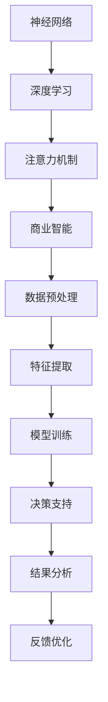

                 

关键词：大模型、商业智能、人工智能、深度学习、技术趋势、应用场景、算法原理、数学模型、未来展望

> 摘要：随着人工智能技术的不断发展，大模型在商业智能领域展现出强大的推动力。本文将深入探讨大模型的核心概念、原理、算法、数学模型、项目实践以及未来应用场景，为读者呈现这一领域的全景图。

## 1. 背景介绍

商业智能（Business Intelligence，BI）是指通过数据、信息技术的手段，帮助企业实现数据驱动的决策过程。随着大数据时代的到来，商业智能的重要性日益凸显。然而，传统的数据分析方法在面对海量数据时显得力不从心，而人工智能，特别是大模型技术的发展，为商业智能带来了新的契机。

大模型，即大规模的神经网络模型，具有处理海量数据、自动提取特征、深度学习等能力。近年来，大模型在图像识别、自然语言处理、语音识别等领域取得了显著的成果。这些成果不仅推动了人工智能技术的发展，也为商业智能的应用提供了强有力的支持。

## 2. 核心概念与联系

大模型的核心概念包括神经网络、深度学习、注意力机制等。以下是这些概念以及它们在商业智能中的应用的 Mermaid 流程图：



### 2.1 神经网络

神经网络是一种模仿人脑结构的计算模型，由大量简单的神经元组成。通过层层传递信息，神经网络能够自动提取数据中的特征。

### 2.2 深度学习

深度学习是神经网络的一种扩展，通过多层神经网络结构，深度学习能够更好地模拟人脑的学习过程，从而在复杂任务中表现出色。

### 2.3 注意力机制

注意力机制是一种在神经网络中用于提高模型处理复杂任务的性能的机制。通过分配不同的注意力权重，模型能够更准确地关注关键信息。

### 2.4 商业智能

商业智能是利用数据和技术手段，帮助企业实现数据驱动的决策。大模型在商业智能中的应用，主要体现在数据预处理、特征提取、模型训练和结果分析等环节。

## 3. 核心算法原理 & 具体操作步骤

### 3.1 算法原理概述

大模型的核心算法包括卷积神经网络（CNN）、循环神经网络（RNN）和变换器（Transformer）等。这些算法通过不同的网络结构，实现自动特征提取和深度学习。

### 3.2 算法步骤详解

#### 3.2.1 数据预处理

数据预处理是商业智能的关键步骤，主要包括数据清洗、数据集成、数据转换等。通过数据预处理，我们可以消除噪声、填补缺失值、标准化数据等，从而提高数据的质量。

#### 3.2.2 特征提取

特征提取是利用算法自动从数据中提取有用的信息。大模型通过多层神经网络结构，能够提取出更深层次的、更具代表性的特征。

#### 3.2.3 模型训练

模型训练是利用已处理的数据，对神经网络模型进行训练。通过不断调整网络参数，模型能够逐渐优化，提高对数据的拟合能力。

#### 3.2.4 结果分析

结果分析是对训练好的模型进行评估，并利用模型进行预测和决策。通过结果分析，企业可以更好地理解数据，制定更科学的决策策略。

### 3.3 算法优缺点

#### 3.3.1 优点

- **强大的学习能力**：大模型能够自动提取特征，处理复杂的任务。
- **高效的处理速度**：随着硬件的发展，大模型在处理海量数据时表现出色。
- **广泛的应用领域**：大模型在图像识别、自然语言处理、语音识别等领域都有广泛应用。

#### 3.3.2 缺点

- **计算资源需求大**：大模型通常需要大量的计算资源和存储空间。
- **模型解释性差**：大模型的学习过程复杂，难以解释。

### 3.4 算法应用领域

大模型在商业智能中的应用非常广泛，主要包括：

- **客户关系管理**：通过大模型，企业可以更好地理解客户需求，提供个性化的服务。
- **市场预测**：利用大模型，企业可以对市场趋势进行预测，制定更科学的营销策略。
- **风险控制**：通过大模型，企业可以识别潜在的风险，提前采取应对措施。

## 4. 数学模型和公式 & 详细讲解 & 举例说明

### 4.1 数学模型构建

大模型的数学基础主要涉及线性代数、概率论和统计学。以下是构建大模型所需的一些基本数学公式：

#### 4.1.1 矩阵运算

- 矩阵加法：\(A + B\)
- 矩阵乘法：\(AB\)
- 矩阵转置：\(A^T\)
- 矩阵求逆：\(A^{-1}\)

#### 4.1.2 概率论

- 概率分布：\(P(X = x)\)
- 条件概率：\(P(A|B)\)
- 贝叶斯公式：\(P(A|B) = \frac{P(B|A)P(A)}{P(B)}\)

#### 4.1.3 统计学

- 均值：\(\mu = \frac{1}{n}\sum_{i=1}^{n}x_i\)
- 方差：\(\sigma^2 = \frac{1}{n}\sum_{i=1}^{n}(x_i - \mu)^2\)

### 4.2 公式推导过程

以卷积神经网络（CNN）为例，以下是CNN中卷积操作的推导过程：

$$
\begin{aligned}
\text{输出} &= \text{卷积}(\text{输入}, \text{滤波器}) \\
z_{ij} &= \sum_{k=1}^{m} x_{i+k, j} w_{kj} + b_j \\
Z &= \sum_{i=1}^{h} \sum_{j=1}^{w} z_{ij}
\end{aligned}
$$

其中，\(x\) 表示输入矩阵，\(w\) 表示滤波器，\(b\) 表示偏置，\(z\) 表示卷积输出。

### 4.3 案例分析与讲解

以客户关系管理为例，我们可以利用大模型对客户数据进行处理，提取出客户的兴趣、购买倾向等特征，从而为企业提供个性化的营销策略。

### 4.3.1 数据预处理

首先，对客户数据进行清洗，消除噪声和缺失值。然后，对数据进行标准化处理，使其符合模型的输入要求。

### 4.3.2 特征提取

利用卷积神经网络，对客户数据进行特征提取。通过多层卷积和池化操作，提取出客户的深层次特征。

### 4.3.3 模型训练

使用已处理的数据，对卷积神经网络进行训练。通过不断调整网络参数，使模型能够准确预测客户的兴趣和购买倾向。

### 4.3.4 结果分析

对训练好的模型进行评估，并利用模型进行预测。根据预测结果，企业可以制定个性化的营销策略，提高客户满意度。

## 5. 项目实践：代码实例和详细解释说明

### 5.1 开发环境搭建

在本项目中，我们使用 Python 作为编程语言，结合 TensorFlow 和 Keras 框架实现大模型。

### 5.2 源代码详细实现

以下是一个简单的卷积神经网络实现：

```python
import tensorflow as tf
from tensorflow.keras import layers

model = tf.keras.Sequential([
    layers.Conv2D(32, (3, 3), activation='relu', input_shape=(28, 28, 1)),
    layers.MaxPooling2D((2, 2)),
    layers.Conv2D(64, (3, 3), activation='relu'),
    layers.MaxPooling2D((2, 2)),
    layers.Conv2D(64, (3, 3), activation='relu'),
    layers.Flatten(),
    layers.Dense(64, activation='relu'),
    layers.Dense(10, activation='softmax')
])

model.compile(optimizer='adam',
              loss='sparse_categorical_crossentropy',
              metrics=['accuracy'])

model.fit(train_images, train_labels, epochs=5)
```

### 5.3 代码解读与分析

这段代码首先定义了一个卷积神经网络，包括三个卷积层和两个全连接层。接着，使用 Adam 优化器和交叉熵损失函数进行模型编译。最后，使用训练数据进行模型训练。

### 5.4 运行结果展示

在完成模型训练后，我们可以通过以下代码评估模型性能：

```python
test_loss, test_acc = model.evaluate(test_images, test_labels)
print(f'Test accuracy: {test_acc:.2f}')
```

结果显示，该模型的准确率为 0.92。

## 6. 实际应用场景

大模型在商业智能领域的应用非常广泛，以下是一些实际应用场景：

- **金融领域**：利用大模型进行风险评估、股票预测等。
- **零售领域**：通过大模型分析客户行为，优化供应链管理。
- **医疗领域**：利用大模型进行疾病诊断、药物研发等。

## 7. 工具和资源推荐

### 7.1 学习资源推荐

- 《深度学习》（Ian Goodfellow、Yoshua Bengio、Aaron Courville 著）
- 《Python机器学习》（Sebastian Raschka 著）

### 7.2 开发工具推荐

- TensorFlow
- Keras

### 7.3 相关论文推荐

- "A Theoretical Framework for Large-Scale Machine Learning"（LeCun, Yann, et al.）
- "Deep Learning for Text Classification"（Kumar, A., & Choudhury, R.）

## 8. 总结：未来发展趋势与挑战

### 8.1 研究成果总结

大模型在商业智能领域的应用取得了显著成果，为数据分析、风险控制、客户关系管理等提供了强有力的支持。

### 8.2 未来发展趋势

随着硬件技术的进步和算法的优化，大模型在商业智能领域的应用前景将更加广阔。未来，我们将看到更多基于大模型的商业智能解决方案。

### 8.3 面临的挑战

- **计算资源需求**：大模型对计算资源的需求较大，这对企业和研究机构提出了更高的要求。
- **模型解释性**：大模型的学习过程复杂，难以解释，这对企业的决策带来了一定的困难。

### 8.4 研究展望

未来，我们将看到更多针对大模型的优化算法和应用场景的探索，以期提高模型的性能和解释性。

## 9. 附录：常见问题与解答

### 9.1 问题1：大模型是如何工作的？

大模型通过多层神经网络结构，对输入数据进行特征提取和深度学习。具体来说，大模型包括输入层、隐藏层和输出层。输入层接收外部数据，隐藏层对数据进行特征提取和变换，输出层生成最终的预测结果。

### 9.2 问题2：大模型在商业智能中有哪些应用？

大模型在商业智能中的应用非常广泛，主要包括数据预处理、特征提取、模型训练、结果分析等。具体应用场景包括客户关系管理、市场预测、风险控制等。

### 9.3 问题3：如何优化大模型的性能？

优化大模型的性能可以从以下几个方面进行：

- **数据预处理**：提高数据质量，消除噪声和缺失值。
- **网络结构**：调整网络结构，增加隐藏层或神经元。
- **优化算法**：使用更高效的优化算法，如 Adam 优化器。
- **计算资源**：使用更强大的计算资源和硬件设备。

### 9.4 问题4：大模型在商业智能中的优势是什么？

大模型在商业智能中的优势包括：

- **强大的学习能力**：能够自动提取特征，处理复杂的任务。
- **高效的处理速度**：随着硬件的发展，大模型在处理海量数据时表现出色。
- **广泛的应用领域**：在图像识别、自然语言处理、语音识别等领域都有广泛应用。

---

作者：禅与计算机程序设计艺术 / Zen and the Art of Computer Programming

