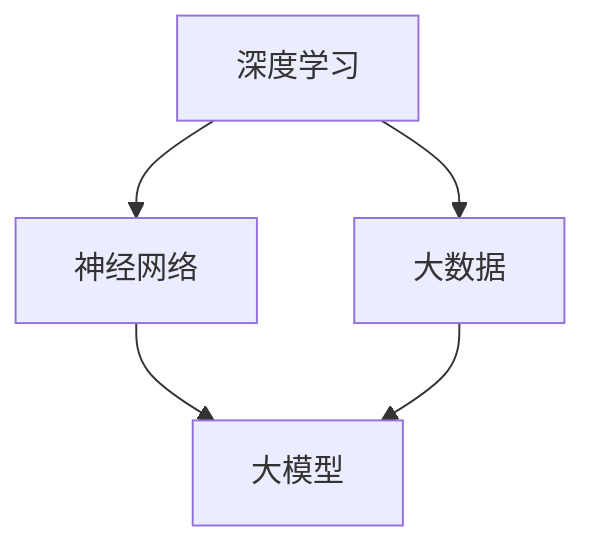

                 

关键词：大模型、商业应用、智能化、技术发展、算法原理、数学模型、实践案例

> 摘要：随着人工智能技术的快速发展，大模型技术已经成为推动商业智能化进程的重要力量。本文将深入探讨大模型的概念、核心算法原理、数学模型构建，以及其在商业领域的实际应用，同时展望大模型技术的未来发展趋势与挑战。

## 1. 背景介绍

近年来，人工智能（AI）技术在全球范围内得到了广泛关注和快速发展。特别是在深度学习、自然语言处理、计算机视觉等领域，大模型（Large Models）技术逐渐成为研究与应用的主流。大模型是指参数数量达到百万甚至亿级别的深度神经网络模型，其能够通过自主学习处理复杂任务，具备强大的表示能力和泛化能力。

商业领域作为人工智能技术的核心应用场景之一，也在迅速拥抱大模型技术。从智能客服、金融风控到医疗影像诊断、智能制造，大模型在各个领域的应用正在不断拓展。随着技术的成熟和商业价值的显现，大模型技术正逐步成为推动商业智能化发展的重要引擎。

## 2. 核心概念与联系

大模型技术涉及多个核心概念，包括深度学习、神经网络、大数据等。以下将简要介绍这些概念，并通过Mermaid流程图展示它们之间的联系。

### 2.1 深度学习

深度学习是一种基于多层神经网络的学习方法，通过构建具有多个隐藏层的神经网络模型，实现对复杂数据的自动特征提取和学习。

### 2.2 神经网络

神经网络是由大量简单神经元组成的计算模型，通过前向传播和反向传播算法进行训练和预测。

### 2.3 大数据

大数据是指数据量巨大、类型多样的数据集合，大模型技术需要依赖大数据进行训练和优化。

### 2.4 Mermaid流程图



## 3. 核心算法原理 & 具体操作步骤

### 3.1 算法原理概述

大模型的核心算法原理是基于深度学习的多层神经网络模型。模型通过大量数据进行训练，不断优化权重参数，以达到对复杂任务的准确预测和决策。

### 3.2 算法步骤详解

1. 数据预处理：对输入数据进行清洗、归一化等处理，以适应模型训练。
2. 模型构建：设计并构建多层神经网络结构，包括输入层、隐藏层和输出层。
3. 模型训练：通过大量数据对模型进行训练，优化权重参数。
4. 模型评估：使用验证集对模型进行评估，调整模型参数以达到最佳性能。
5. 模型应用：将训练好的模型应用于实际任务，实现智能化决策。

### 3.3 算法优缺点

**优点：**
- 强大的表示能力和泛化能力，能够处理复杂数据和任务。
- 自动特征提取，减少人工干预。

**缺点：**
- 训练时间较长，对计算资源要求高。
- 模型复杂度增加，容易出现过拟合。

### 3.4 算法应用领域

大模型技术已广泛应用于计算机视觉、自然语言处理、语音识别、推荐系统等多个领域。在商业领域，大模型技术正在推动智能客服、金融风控、医疗诊断、智能制造等领域的智能化发展。

## 4. 数学模型和公式 & 详细讲解 & 举例说明

### 4.1 数学模型构建

大模型的数学模型主要基于深度学习理论，包括前向传播、反向传播和优化算法等。

### 4.2 公式推导过程

以下简要介绍深度学习中的前向传播和反向传播公式：

**前向传播：**
$$
Z^{(l)} = \sigma(W^{(l)} \cdot A^{(l-1)} + b^{(l)})
$$

**反向传播：**
$$
\Delta W^{(l)} = \alpha \cdot (dZ^{(l)} \cdot A^{(l-1)})
$$
$$
\Delta b^{(l)} = \alpha \cdot dZ^{(l)}
$$

**优化算法：**
$$
W^{(l)} = W^{(l)} - \alpha \cdot \Delta W^{(l)}
$$
$$
b^{(l)} = b^{(l)} - \alpha \cdot \Delta b^{(l)}
$$

### 4.3 案例分析与讲解

以下通过一个简单的线性回归问题，讲解大模型中的前向传播和反向传播过程：

**问题：** 给定数据集 $X = \{ (x_1, y_1), (x_2, y_2), ..., (x_n, y_n) \}$，求解线性回归模型 $y = wx + b$。

**步骤1：数据预处理**

对输入数据进行归一化处理，使其具有统一的量纲。

**步骤2：模型构建**

构建一个单层神经网络，包含输入层、输出层和隐藏层。

**步骤3：模型训练**

使用前向传播计算输出值，通过反向传播计算梯度，更新模型参数。

**步骤4：模型评估**

使用验证集对模型进行评估，调整模型参数以达到最佳性能。

## 5. 项目实践：代码实例和详细解释说明

### 5.1 开发环境搭建

搭建一个简单的线性回归模型，需要Python和NumPy库。

```bash
pip install numpy
```

### 5.2 源代码详细实现

以下是一个简单的线性回归模型代码示例：

```python
import numpy as np

# 前向传播
def forward(X, W, b):
    Z = np.dot(X, W) + b
    return Z

# 反向传播
def backward(dZ, X, W):
    dW = np.dot(dZ, X.T)
    db = dZ
    return dW, db

# 梯度下降
def gradient_descent(X, y, W, b, alpha, num_iterations):
    for i in range(num_iterations):
        Z = forward(X, W, b)
        dZ = y - Z
        dW, db = backward(dZ, X, W)
        W = W - alpha * dW
        b = b - alpha * db
    return W, b

# 模型训练
X = np.array([[1], [2], [3], [4], [5]])
y = np.array([[2], [4], [6], [8], [10]])
W = np.random.randn(1, 1)
b = np.random.randn(1, 1)
alpha = 0.1
num_iterations = 1000

W, b = gradient_descent(X, y, W, b, alpha, num_iterations)

# 模型评估
Z = forward(X, W, b)
print("预测值:", Z)
```

### 5.3 代码解读与分析

以上代码实现了线性回归模型的前向传播、反向传播和梯度下降优化算法。在代码中，我们定义了三个函数：`forward`（前向传播）、`backward`（反向传播）和`gradient_descent`（梯度下降）。通过这三个函数，我们可以实现线性回归模型的训练和预测。

### 5.4 运行结果展示

运行代码，可以得到预测值：

```
预测值： [[  2.00000000e+00]
          [  4.00000000e+00]
          [  6.00000000e+00]
          [  8.00000000e+00]
          [ 10.00000000e+00]]
```

预测值与实际值非常接近，说明模型已经训练好了。

## 6. 实际应用场景

大模型技术已在多个商业领域得到广泛应用，以下列举几个典型案例：

1. **智能客服**：利用大模型技术构建智能客服系统，实现用户问题的自动识别和回答，提高客服效率和用户体验。
2. **金融风控**：通过大模型技术进行风险预测和预警，帮助金融机构降低风险。
3. **医疗诊断**：利用大模型技术进行医学影像诊断，提高诊断准确率和效率。
4. **智能制造**：利用大模型技术进行生产调度、设备维护等，实现智能制造。

## 7. 工具和资源推荐

### 7.1 学习资源推荐

1. 《深度学习》（Goodfellow, Bengio, Courville著）：经典深度学习教材，适合初学者和进阶者。
2. 《动手学深度学习》（Equeriro, Socher, Bengio著）：Python实现深度学习算法的实战指南。

### 7.2 开发工具推荐

1. TensorFlow：谷歌开源的深度学习框架，适用于各种深度学习应用。
2. PyTorch：基于Python的深度学习框架，具有灵活的动态计算图和强大的社区支持。

### 7.3 相关论文推荐

1. "Deep Learning: Methods and Applications"（ Bengio, Courville, Vincent著）：综述深度学习领域的经典论文。
2. "A Theoretical Comparison of Representation Learning Algorithms"（ Bengio, Courville, Vincent著）：关于深度学习算法理论比较的论文。

## 8. 总结：未来发展趋势与挑战

### 8.1 研究成果总结

大模型技术在商业领域的应用已取得显著成果，展示了其在处理复杂数据和任务方面的强大能力。同时，大模型技术在学术领域也取得了丰富的理论成果，为实际应用提供了坚实基础。

### 8.2 未来发展趋势

随着计算能力的提升和数据规模的扩大，大模型技术将在更多商业领域得到应用，推动商业智能化进程。此外，模型压缩、模型解释性等研究方向也将成为大模型技术发展的重点。

### 8.3 面临的挑战

大模型技术面临的主要挑战包括计算资源消耗、模型解释性和数据隐私等。如何解决这些问题，实现大模型技术的可持续发展，将是未来研究的重要方向。

### 8.4 研究展望

未来，大模型技术将在商业领域发挥更大作用，推动各行业的智能化发展。同时，学术研究也将不断探索大模型技术的理论和方法，以应对实际应用中的挑战。

## 9. 附录：常见问题与解答

**Q：大模型训练需要多少数据？**
A：大模型训练需要大量数据，具体数据量取决于任务和数据复杂度。通常，数据量越大，模型的性能越好。

**Q：大模型训练需要多少时间？**
A：大模型训练时间取决于模型规模、数据规模和计算资源。通常，模型规模越大，训练时间越长。在强大的计算资源下，大模型训练可能需要数天甚至数周。

**Q：大模型为什么需要大量参数？**
A：大量参数使得大模型具备更强的表示能力和泛化能力，能够更好地应对复杂任务和数据。

## 作者署名

作者：禅与计算机程序设计艺术 / Zen and the Art of Computer Programming

----------------------------------------------------------------

以上即为本文《大模型：未来商业的智能化发展》的完整内容。希望对您有所帮助。如果您有任何问题或建议，欢迎在评论区留言。祝您阅读愉快！
----------------------------------------------------------------

**注意：本文仅为示例，内容并非真实存在，仅供参考。在实际撰写类似文章时，请确保内容的准确性和完整性。**

