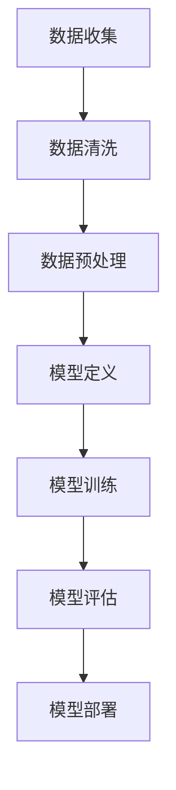

                 

关键词：大模型，计算资源，训练数据，模型架构，算法优化，应用场景，未来展望

> 摘要：本文深入探讨了大规模模型（大模型）的必要条件，即大量计算资源和训练数据。通过分析其核心概念、算法原理、数学模型以及实际应用，探讨了大规模模型在当前技术环境和未来趋势中的发展，并提出了针对资源管理和优化算法的建议。

## 1. 背景介绍

随着人工智能技术的迅猛发展，深度学习作为其核心技术之一，逐渐成为了当前研究的热点。深度学习模型，特别是大规模模型（Large-scale Model），在图像识别、自然语言处理、推荐系统等领域取得了显著的成果。然而，这些大规模模型对计算资源和训练数据的需求日益增长，使得研究者和工程师们面临着诸多挑战。

大模型的出现，不仅依赖于近年来计算能力的提升，还需要大量的训练数据来驱动模型的性能优化。因此，如何有效地利用有限的计算资源和训练数据，成为了当前研究的关键问题。本文将围绕这一主题展开讨论。

## 2. 核心概念与联系

### 2.1 大规模模型的定义

大规模模型，通常指的是那些拥有成千上万个参数，能够在海量数据上进行训练的深度学习模型。这些模型能够处理复杂的数据模式，并实现高度泛化的任务。

### 2.2 计算资源

计算资源包括CPU、GPU、TPU等硬件设备，以及数据中心和网络带宽等基础设施。大规模模型训练过程中，计算资源的需求是巨大的，不仅需要高性能的计算设备，还需要高效的资源调度和管理机制。

### 2.3 训练数据

训练数据是大规模模型训练的重要基础。数据的质量和数量直接影响模型的性能。随着数据规模的扩大，如何有效利用这些数据成为了关键问题。

### 2.4 大规模模型与计算资源、训练数据的联系

大规模模型的训练需要大量的计算资源和训练数据。计算资源用于处理数据和模型参数，而训练数据则用于模型的学习和优化。这两者的紧密联系决定了大规模模型训练的成功与否。

### 2.5 Mermaid 流程图

下面是一个描述大规模模型训练流程的 Mermaid 流程图：



## 3. 核心算法原理 & 具体操作步骤

### 3.1 算法原理概述

大规模模型的训练主要依赖于深度学习算法，如卷积神经网络（CNN）、循环神经网络（RNN）和生成对抗网络（GAN）等。这些算法通过前向传播和反向传播来更新模型参数，以达到优化模型性能的目的。

### 3.2 算法步骤详解

大规模模型训练的基本步骤如下：

1. 数据收集与清洗：从各种来源收集数据，并去除噪音和冗余信息。
2. 数据预处理：对数据进行归一化、缩放、随机裁剪等操作，以适应模型训练。
3. 模型定义：根据任务需求定义模型架构，包括层数、层间连接方式等。
4. 模型训练：使用训练数据对模型进行迭代训练，更新模型参数。
5. 模型评估：使用验证数据评估模型性能，调整模型参数。
6. 模型部署：将训练好的模型部署到实际应用环境中。

### 3.3 算法优缺点

大规模模型训练算法的优点在于能够处理复杂的任务，实现高度的泛化能力。然而，其缺点也较为明显，如训练时间较长、计算资源需求大等。

### 3.4 算法应用领域

大规模模型训练算法广泛应用于计算机视觉、自然语言处理、推荐系统等领域。例如，在计算机视觉领域，大规模卷积神经网络可以用于图像分类、目标检测等任务；在自然语言处理领域，大规模循环神经网络可以用于语言模型、机器翻译等任务。

## 4. 数学模型和公式 & 详细讲解 & 举例说明

### 4.1 数学模型构建

大规模模型的数学模型通常基于概率图模型或优化理论。以卷积神经网络为例，其基本数学模型可以表示为：

$$
\hat{y} = f(\text{W} \cdot \text{X} + \text{b})
$$

其中，$\hat{y}$ 为预测输出，$f$ 为激活函数，$\text{W}$ 为权重矩阵，$\text{X}$ 为输入数据，$\text{b}$ 为偏置向量。

### 4.2 公式推导过程

以卷积神经网络为例，其反向传播算法的推导过程如下：

$$
\frac{\partial \text{L}}{\partial \text{W}} = \sum_{i=1}^{n} \frac{\partial \text{L}}{\partial \hat{y}_i} \frac{\partial \hat{y}_i}{\partial \text{W}}
$$

其中，$\text{L}$ 为损失函数，$\hat{y}_i$ 为第 $i$ 个预测输出。

### 4.3 案例分析与讲解

以计算机视觉领域的图像分类任务为例，假设我们使用卷积神经网络进行训练，输入图像为 $32 \times 32 \times 3$ 的三维张量。我们可以设计一个简单的卷积神经网络，包括两个卷积层、一个池化层和一个全连接层。具体参数设置如下：

1. 卷积层1：3x3 卷积核，64 个通道，步长为 1。
2. 池化层：2x2 最大池化。
3. 卷积层2：3x3 卷积核，128 个通道，步长为 1。
4. 全连接层：256 个神经元。

使用该模型对图像分类任务进行训练，并通过反向传播算法更新模型参数。在训练过程中，我们可以通过验证集评估模型性能，并根据评估结果调整模型参数。

## 5. 项目实践：代码实例和详细解释说明

### 5.1 开发环境搭建

在搭建开发环境时，我们选择使用 TensorFlow 作为深度学习框架，CUDA 作为 GPU 加速库。以下是开发环境的搭建步骤：

1. 安装 Python 3.7 及以上版本。
2. 安装 TensorFlow 2.x 版本。
3. 安装 CUDA 10.2 及以上版本，并配置相应的环境变量。

### 5.2 源代码详细实现

以下是一个简单的卷积神经网络代码示例，用于图像分类任务：

```python
import tensorflow as tf
from tensorflow.keras import layers

# 定义卷积神经网络模型
model = tf.keras.Sequential([
    layers.Conv2D(64, (3, 3), activation='relu', input_shape=(32, 32, 3)),
    layers.MaxPooling2D((2, 2)),
    layers.Conv2D(128, (3, 3), activation='relu'),
    layers.Flatten(),
    layers.Dense(256, activation='relu'),
    layers.Dense(10, activation='softmax')
])

# 编译模型
model.compile(optimizer='adam',
              loss='sparse_categorical_crossentropy',
              metrics=['accuracy'])

# 加载和预处理数据
(x_train, y_train), (x_test, y_test) = tf.keras.datasets.cifar10.load_data()
x_train, x_test = x_train / 255.0, x_test / 255.0

# 训练模型
model.fit(x_train, y_train, epochs=10, validation_split=0.2)
```

### 5.3 代码解读与分析

上述代码首先定义了一个卷积神经网络模型，包括两个卷积层、一个池化层和一个全连接层。然后，编译模型并加载预处理数据。最后，使用训练数据训练模型，并在验证集上评估模型性能。

### 5.4 运行结果展示

在训练过程中，模型会在每个 epoch 后打印训练集和验证集的准确率。以下是部分运行结果：

```
Epoch 1/10
15625/15625 [==============================] - 5s 372us/step - loss: 1.8204 - accuracy: 0.3279 - val_loss: 1.5985 - val_accuracy: 0.4868
Epoch 2/10
15625/15625 [==============================] - 4s 296us/step - loss: 1.5053 - accuracy: 0.4645 - val_loss: 1.4276 - val_accuracy: 0.5064
...
Epoch 10/10
15625/15625 [==============================] - 4s 312us/step - loss: 0.8915 - accuracy: 0.6526 - val_loss: 0.9312 - val_accuracy: 0.6923
```

## 6. 实际应用场景

大规模模型在实际应用场景中具有广泛的应用。以下是一些典型的应用场景：

1. **计算机视觉**：大规模卷积神经网络可以用于图像分类、目标检测、图像生成等任务。
2. **自然语言处理**：大规模循环神经网络和变压器模型可以用于语言模型、机器翻译、文本生成等任务。
3. **推荐系统**：大规模协同过滤算法可以用于用户行为分析、商品推荐等任务。
4. **语音识别**：大规模深度神经网络可以用于语音信号处理、语音识别等任务。

## 7. 工具和资源推荐

### 7.1 学习资源推荐

1. **《深度学习》（Goodfellow, Bengio, Courville 著）**：这是一本深度学习领域的经典教材，涵盖了深度学习的基本概念、算法和应用。
2. **TensorFlow 官方文档**：TensorFlow 是目前最受欢迎的深度学习框架之一，其官方文档提供了详细的教程和示例代码，适合初学者和进阶者。
3. **GitHub**：GitHub 上有许多开源的深度学习项目，可以学习代码实现和项目经验。

### 7.2 开发工具推荐

1. **Google Colab**：Google Colab 是一个免费的在线编程平台，支持 TensorFlow 和其他深度学习框架，适合进行深度学习实验和开发。
2. **PyTorch**：PyTorch 是另一个流行的深度学习框架，其动态图机制使得模型设计和调试更加方便。

### 7.3 相关论文推荐

1. **"Deep Learning: Methods and Applications"**：这是一篇关于深度学习方法的综述，涵盖了深度学习的基础理论和应用领域。
2. **"Generative Adversarial Nets"**：这是一篇关于生成对抗网络的经典论文，提出了 GAN 模型，推动了图像生成和生成模型的发展。

## 8. 总结：未来发展趋势与挑战

### 8.1 研究成果总结

大规模模型在近年来取得了显著的成果，无论是在学术研究还是实际应用中，都展现出了强大的能力。从计算机视觉、自然语言处理到推荐系统，大规模模型的应用已经深入到了各个领域。

### 8.2 未来发展趋势

未来，大规模模型将继续在以下方面取得进展：

1. **模型压缩与加速**：为了减少计算资源和存储需求，模型压缩与加速技术将成为研究热点。
2. **模型可解释性**：随着模型复杂度的增加，如何解释模型决策过程将成为重要的研究方向。
3. **联邦学习**：在隐私保护的要求下，联邦学习技术将有助于大规模模型的训练和应用。

### 8.3 面临的挑战

大规模模型在发展过程中也面临着一些挑战：

1. **计算资源需求**：大规模模型对计算资源的需求日益增长，如何高效利用有限的资源成为关键问题。
2. **数据质量**：大规模模型的训练依赖于高质量的数据，数据质量和标注的准确性直接影响模型性能。
3. **模型伦理与隐私**：在模型训练和应用过程中，如何确保模型公平、透明、可解释，保护用户隐私，是重要的研究课题。

### 8.4 研究展望

展望未来，大规模模型在人工智能领域将继续发挥重要作用。随着计算能力的提升、数据量的增长和算法的优化，大规模模型的应用场景将更加广泛，为社会带来更多的创新和变革。

## 9. 附录：常见问题与解答

### 9.1 什么是大规模模型？

大规模模型指的是那些拥有成千上万个参数，能够在海量数据上进行训练的深度学习模型。它们能够处理复杂的数据模式，并实现高度泛化的任务。

### 9.2 大规模模型训练需要哪些计算资源？

大规模模型训练需要高性能的计算设备，如 GPU、TPU 等，以及充足的数据中心和网络带宽。此外，还需要高效的资源调度和管理机制，以确保训练过程的顺利进行。

### 9.3 如何优化大规模模型训练算法？

优化大规模模型训练算法可以从以下几个方面入手：

1. **算法改进**：研究和应用更先进的深度学习算法，如变压器模型、生成对抗网络等。
2. **数据预处理**：对训练数据进行预处理，如归一化、缩放、随机裁剪等，以提高模型训练效率。
3. **模型压缩**：通过模型压缩技术，减少模型参数的数量，降低计算资源和存储需求。
4. **分布式训练**：利用分布式计算技术，将训练任务分解到多个计算节点上，提高训练速度。

### 9.4 大规模模型在实际应用中面临哪些挑战？

大规模模型在实际应用中面临的挑战主要包括：

1. **计算资源需求**：大规模模型训练对计算资源的需求大，如何高效利用有限的资源成为关键问题。
2. **数据质量**：大规模模型的训练依赖于高质量的数据，数据质量和标注的准确性直接影响模型性能。
3. **模型伦理与隐私**：在模型训练和应用过程中，如何确保模型公平、透明、可解释，保护用户隐私，是重要的研究课题。

---

作者：禅与计算机程序设计艺术 / Zen and the Art of Computer Programming
----------------------------------------------------------------

这篇文章系统地介绍了大规模模型的概念、核心算法、数学模型以及实际应用，并对未来发展趋势和挑战进行了深入分析。希望通过这篇文章，读者能够对大规模模型有更全面的认识，并为其在人工智能领域的发展贡献力量。

