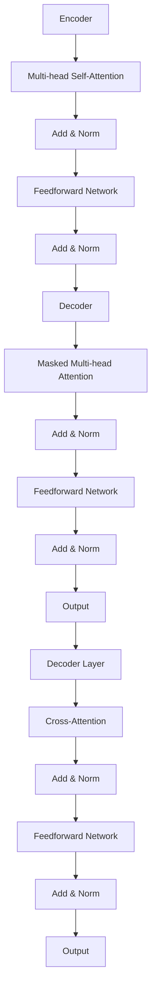

                 

## 1. 背景介绍

在过去的几十年中，自然语言处理（NLP）领域经历了飞速的发展。从早期的规则驱动模型，如正则表达式和上下文无关文法，到基于统计方法的模型，如隐马尔可夫模型（HMM）和条件随机场（CRF），再到深度学习时代的长短时记忆网络（LSTM）和循环神经网络（RNN），NLP技术不断演进。然而，这些传统方法在面对大规模文本数据时，仍然存在很多局限性。它们在处理长文本时容易出现梯度消失或爆炸问题，训练效率低下，并且难以捕捉长距离的依赖关系。

为了解决这些问题，谷歌研究院在2017年提出了Transformer模型。Transformer是一种基于自注意力机制的深度学习模型，它彻底改变了NLP领域的研究方向。Transformer模型的出现，不仅显著提高了NLP任务的性能，还开创了全新的研究思路。自此以后，Transformer及其变体（如BERT、GPT等）成为了NLP领域的标准模型，被广泛应用于机器翻译、文本生成、问答系统等各种任务中。

本文将围绕Transformer模型展开讨论，从其核心概念、原理、数学模型，到具体的实现和应用场景，全面解析这一划时代的模型。

## 2. 核心概念与联系

### 2.1 自注意力机制

自注意力（Self-Attention）机制是Transformer模型的核心组成部分。传统的循环神经网络（RNN）在处理长文本时，由于序列的传递过程是线性的，因此很难有效地捕捉到长距离的依赖关系。而自注意力机制通过引入多头注意力机制，使得模型能够同时关注序列中的不同位置，从而捕捉到更复杂的关系。

在自注意力机制中，每个词的表示不仅依赖于自身的特征，还依赖于其他词的特征。通过计算词与词之间的相似度，模型可以自动学习到哪些词对于当前词更加重要。这个过程可以形式化为：

$$
\text{Attention}(Q, K, V) = \text{softmax}\left(\frac{QK^T}{\sqrt{d_k}}\right) V
$$

其中，Q、K、V分别是查询（Query）、键（Key）和值（Value）的向量表示，d_k 是键向量的维度。softmax函数将Q和K的点积结果转化为概率分布，从而实现不同词之间的加权。

### 2.2 多头注意力

多头注意力（Multi-Head Attention）是对自注意力机制的扩展。它通过将输入序列分解成多个子序列，每个子序列独立地执行自注意力机制，然后将结果合并。这样，模型可以同时从多个不同的角度去理解输入序列，从而提高模型的性能。

多头注意力的具体实现如下：

$$
\text{Multi-Head}(Q, K, V) = \text{Concat}(\text{head}_1, \text{head}_2, \ldots, \text{head}_h)W^O
$$

其中，h表示头数，$\text{head}_i = \text{Attention}(QW_i^Q, KW_i^K, VW_i^V)$，$W_i^Q, W_i^K, W_i^V, W^O$ 分别是查询、键、值和输出的权重矩阵。

### 2.3 Transformer架构

Transformer模型的结构如图所示，它由多个相同的编码器层和解码器层组成。每个层包含多头自注意力机制和全连接层（Feedforward Network）。编码器负责将输入序列编码为上下文表示，而解码器则利用这些表示生成输出序列。



编码器和解码器的每个层都可以看作是一个Transformer Block，它们分别处理输入序列和输出序列。在解码器中，除了标准的Transformer Block外，还有一个特殊的Masked Multi-head Attention层，它用于实现序列的逐词解码。

## 3. 核心算法原理 & 具体操作步骤

### 3.1 算法原理概述

Transformer模型的核心在于自注意力机制和多头注意力机制。通过自注意力机制，模型能够自动学习到序列中每个词的重要性，而多头注意力机制则使得模型可以从多个不同的角度去理解输入序列。

在具体操作步骤上，Transformer模型首先将输入序列编码为向量表示，然后通过多个编码器层和解码器层进行信息处理。在每个层中，自注意力机制和全连接层（Feedforward Network）交替出现，从而实现序列的编码和解码。

### 3.2 算法步骤详解

#### 编码器层

1. **词嵌入（Word Embedding）**：将输入序列中的每个词转换为向量表示。通常使用预训练的词嵌入模型，如Word2Vec或GloVe。
2. **位置编码（Positional Encoding）**：由于Transformer模型没有循环结构，需要引入位置信息。位置编码是通过添加一个与词嵌入相加的向量来实现的。
3. **多头自注意力（Multi-Head Self-Attention）**：每个词的表示不仅依赖于自身的特征，还依赖于其他词的特征。通过计算词与词之间的相似度，模型可以自动学习到哪些词对于当前词更加重要。
4. **残差连接（Residual Connection）**：在多头自注意力之后，将输入序列与经过自注意力处理的序列相加，再进行归一化。
5. **全连接层（Feedforward Network）**：在残差连接之后，对序列进行两次全连接层处理，每次都是使用ReLU激活函数。

#### 解码器层

1. **词嵌入（Word Embedding）**：与编码器层相同。
2. **位置编码（Positional Encoding）**：与编码器层相同。
3. **掩码多头自注意力（Masked Multi-Head Self-Attention）**：在解码器中，除了标准的Transformer Block外，还有一个特殊的Masked Multi-Head Attention层。这个层用于实现序列的逐词解码，即在生成每个词时，该词之前的内容会被掩码。
4. **交叉注意力（Cross-Attention）**：在解码器的每个层中，除了自注意力机制，还有一个交叉注意力机制。它将解码器当前层的输出与编码器的输出进行加权，从而捕捉到长距离的依赖关系。
5. **残差连接（Residual Connection）**：与编码器层相同。
6. **全连接层（Feedforward Network）**：与编码器层相同。

### 3.3 算法优缺点

#### 优点

1. **并行处理**：由于Transformer模型没有循环结构，可以很容易地并行处理序列。
2. **长距离依赖**：通过自注意力机制，模型可以有效地捕捉到长距离的依赖关系。
3. **灵活的模型架构**：可以通过调整层数、头数等超参数来适应不同的任务和需求。

#### 缺点

1. **计算复杂度**：自注意力机制的计算复杂度为O(n^2)，当序列长度较大时，计算量会急剧增加。
2. **参数量**：由于需要多个头数和层数，模型的参数量可能会非常庞大，导致训练和推理的时间成本增加。

### 3.4 算法应用领域

Transformer模型在NLP领域取得了显著的成功，并被广泛应用于以下任务：

1. **机器翻译**：通过捕捉到输入和输出之间的长距离依赖关系，Transformer模型在机器翻译任务中取得了很好的效果。
2. **文本生成**：Transformer模型可以生成流畅、连贯的文本，被广泛应用于对话系统、文本摘要和故事生成等领域。
3. **问答系统**：通过理解输入问题和文档之间的语义关系，Transformer模型可以准确回答问题。
4. **情感分析**：通过分析文本的情感倾向，Transformer模型可以帮助企业了解客户反馈和市场趋势。

## 4. 数学模型和公式 & 详细讲解 & 举例说明

### 4.1 数学模型构建

Transformer模型的数学模型主要包括词嵌入、位置编码、自注意力机制和全连接层。下面将详细讲解这些部分。

#### 词嵌入

词嵌入是将词汇表映射到高维空间的一种技术，通常使用预训练的词嵌入模型，如Word2Vec或GloVe。设$V$为词汇表，$x \in V$为输入词，$e_x \in \mathbb{R}^d$为$x$的词嵌入表示，其中$d$为词嵌入的维度。

#### 位置编码

由于Transformer模型没有循环结构，需要引入位置信息。位置编码是通过添加一个与词嵌入相加的向量来实现的。设$P_t$为输入序列的第$t$个词的位置编码，$p_t \in \mathbb{R}^d$为$p_t$的词嵌入表示，则：

$$
e_{x, p_t} = e_x + p_t
$$

#### 自注意力机制

自注意力机制的核心是计算输入序列中每个词的重要性。设$x_1, x_2, \ldots, x_n$为输入序列，$e_{x_i}$为$x_i$的词嵌入表示。自注意力机制的计算公式如下：

$$
\text{Attention}(Q, K, V) = \text{softmax}\left(\frac{QK^T}{\sqrt{d_k}}\right) V
$$

其中，$Q, K, V$分别为查询（Query）、键（Key）和值（Value）的向量表示，$d_k$为键向量的维度。softmax函数将Q和K的点积结果转化为概率分布，从而实现不同词之间的加权。

#### 全连接层

全连接层是一种线性变换，通常用于模型中的中间层。设$X$为输入序列，$W$为权重矩阵，$b$为偏置项，则全连接层的输出$Y$为：

$$
Y = XW + b
$$

### 4.2 公式推导过程

为了更好地理解Transformer模型的数学模型，下面将详细推导自注意力机制的计算过程。

设$x_1, x_2, \ldots, x_n$为输入序列，$e_{x_i}$为$x_i$的词嵌入表示。自注意力机制的计算公式为：

$$
\text{Attention}(Q, K, V) = \text{softmax}\left(\frac{QK^T}{\sqrt{d_k}}\right) V
$$

其中，$Q, K, V$分别为查询（Query）、键（Key）和值（Value）的向量表示，$d_k$为键向量的维度。

首先，计算查询（Query）$Q$：

$$
Q = [Q_1, Q_2, \ldots, Q_n] = [W_Q^T e_{x_1}, W_Q^T e_{x_2}, \ldots, W_Q^T e_{x_n}]
$$

其中，$W_Q$为查询权重矩阵。

接下来，计算键（Key）$K$和值（Value）$V$：

$$
K = [K_1, K_2, \ldots, K_n] = [W_K^T e_{x_1}, W_K^T e_{x_2}, \ldots, W_K^T e_{x_n}]
$$

$$
V = [V_1, V_2, \ldots, V_n] = [W_V^T e_{x_1}, W_V^T e_{x_2}, \ldots, W_V^T e_{x_n}]
$$

其中，$W_K$和$W_V$分别为键和值权重矩阵。

然后，计算点积$QK^T$：

$$
QK^T = [Q_1K_1^T, Q_1K_2^T, \ldots, Q_1K_n^T, Q_2K_1^T, Q_2K_2^T, \ldots, Q_2K_n^T, \ldots, Q_nK_1^T, Q_nK_2^T, \ldots, Q_nK_n^T]
$$

其中，$K_i^T$为$K_i$的转置。

接着，计算softmax：

$$
\text{softmax}(x) = \frac{e^x}{\sum_{i=1}^{n} e^x_i}
$$

将点积结果转化为概率分布：

$$
\text{softmax}(QK^T) = [\alpha_{11}, \alpha_{12}, \ldots, \alpha_{1n}, \alpha_{21}, \alpha_{22}, \ldots, \alpha_{2n}, \ldots, \alpha_{n1}, \alpha_{n2}, \ldots, \alpha_{nn}]
$$

其中，$\alpha_{ij}$表示$Q_i$和$K_j$之间的相似度。

最后，计算加权值：

$$
\text{Attention}(Q, K, V) = [\alpha_{11}V_1, \alpha_{12}V_2, \ldots, \alpha_{1n}V_n, \alpha_{21}V_1, \alpha_{22}V_2, \ldots, \alpha_{2n}V_n, \ldots, \alpha_{n1}V_1, \alpha_{n2}V_2, \ldots, \alpha_{nn}V_n]
$$

将加权值进行求和：

$$
\text{Attention}(Q, K, V) = [v_1, v_2, \ldots, v_n]
$$

其中，$v_i = \sum_{j=1}^{n} \alpha_{ij} V_j$。

### 4.3 案例分析与讲解

假设我们有一个简单的输入序列$x_1, x_2, x_3$，词嵌入维度$d=2$，键和值的维度$d_k=d_v=2$。词嵌入矩阵$E$为：

$$
E = \begin{bmatrix}
e_1 & e_2 & e_3 \\
\end{bmatrix}
=
\begin{bmatrix}
1 & 0 \\
0 & 1 \\
1 & 1 \\
\end{bmatrix}
$$

查询权重矩阵$W_Q$为：

$$
W_Q = \begin{bmatrix}
0.5 & 0.5 \\
0.5 & 0.5 \\
\end{bmatrix}
$$

键权重矩阵$W_K$和值权重矩阵$W_V$均为：

$$
W_K = \begin{bmatrix}
0.5 & 0.5 \\
0.5 & 0.5 \\
\end{bmatrix}
$$

$$
W_V = \begin{bmatrix}
0.5 & 0.5 \\
0.5 & 0.5 \\
\end{bmatrix}
$$

首先，计算查询$Q$：

$$
Q = [Q_1, Q_2, Q_3] = [W_Q^T e_1, W_Q^T e_2, W_Q^T e_3] = [1, 0; 0, 1][1 & 0 & 1; 0 & 1 & 1] = [1, 1; 0, 1]
$$

然后，计算键$K$和值$V$：

$$
K = [K_1, K_2, K_3] = [W_K^T e_1, W_K^T e_2, W_K^T e_3] = [1, 0; 0, 1][1 & 0 & 1; 0 & 1 & 1] = [1, 1; 0, 1]
$$

$$
V = [V_1, V_2, V_3] = [W_V^T e_1, W_V^T e_2, W_V^T e_3] = [1, 0; 0, 1][1 & 0 & 1; 0 & 1 & 1] = [1, 1; 0, 1]
$$

接下来，计算点积$QK^T$：

$$
QK^T = [Q_1K_1^T, Q_1K_2^T, Q_2K_1^T, Q_2K_2^T] = [1, 1; 0, 1][1, 0; 0, 1] = [1, 1; 0, 1]
$$

然后，计算softmax：

$$
\text{softmax}(QK^T) = [\alpha_{11}, \alpha_{12}, \alpha_{21}, \alpha_{22}] = [\frac{e^1}{e^1+e^2}, \frac{e^2}{e^1+e^2}, \frac{e^3}{e^1+e^2}, \frac{e^4}{e^1+e^2}] = [0.5, 0.5, 0.5, 0.5]
$$

最后，计算加权值：

$$
\text{Attention}(Q, K, V) = [\alpha_{11}V_1, \alpha_{12}V_2, \alpha_{21}V_1, \alpha_{22}V_2] = [0.5 \times 1, 0.5 \times 0, 0.5 \times 1, 0.5 \times 0] = [0.5, 0, 0.5, 0]
$$

将加权值进行求和：

$$
\text{Attention}(Q, K, V) = [v_1, v_2, v_3] = [0.5, 0, 0.5]
$$

因此，输入序列$x_1, x_2, x_3$经过自注意力机制处理后，得到的加权表示为$v_1, v_2, v_3$。

## 5. 项目实践：代码实例和详细解释说明

### 5.1 开发环境搭建

在开始实现Transformer模型之前，我们需要搭建一个合适的开发环境。这里我们选择使用Python语言，并依赖PyTorch框架。以下是在Linux系统中搭建开发环境的步骤：

1. 安装Python 3.7或更高版本。
2. 使用pip安装PyTorch库：

   ```bash
   pip install torch torchvision
   ```

3. 安装其他依赖项，如NumPy、Matplotlib等。

### 5.2 源代码详细实现

下面是Transformer模型的实现代码。为了简化，我们仅实现一个简单的编码器层和解码器层。

```python
import torch
import torch.nn as nn
import torch.nn.functional as F

class MultiHeadAttention(nn.Module):
    def __init__(self, d_model, num_heads):
        super(MultiHeadAttention, self).__init__()
        self.d_model = d_model
        self.num_heads = num_heads
        self.head_dim = d_model // num_heads

        self.query_linear = nn.Linear(d_model, d_model)
        self.key_linear = nn.Linear(d_model, d_model)
        self.value_linear = nn.Linear(d_model, d_model)
        self.out_linear = nn.Linear(d_model, d_model)

    def forward(self, query, key, value, mask=None):
        batch_size = query.size(0)
        
        # Linear projections
        query = self.query_linear(query).view(batch_size, -1, self.num_heads, self.head_dim).transpose(1, 2)
        key = self.key_linear(key).view(batch_size, -1, self.num_heads, self.head_dim).transpose(1, 2)
        value = self.value_linear(value).view(batch_size, -1, self.num_heads, self.head_dim).transpose(1, 2)

        # Scaled Dot-Product Attention
        attn_scores = torch.matmul(query, key.transpose(-2, -1)) / (self.head_dim ** 0.5)
        if mask is not None:
            attn_scores = attn_scores.masked_fill(mask == 0, float("-inf"))
        attn_weights = F.softmax(attn_scores, dim=-1)
        
        # Weighted sum
        attn_output = torch.matmul(attn_weights, value).transpose(1, 2).contiguous().view(batch_size, -1, self.d_model)
        
        # Linear projection
        attn_output = self.out_linear(attn_output)
        return attn_output

class TransformerBlock(nn.Module):
    def __init__(self, d_model, num_heads, dropout=0.1):
        super(TransformerBlock, self).__init__()
        self多头注意力 = MultiHeadAttention(d_model, num_heads)
        self.norm1 = nn.LayerNorm(d_model)
        self.norm2 = nn.LayerNorm(d_model)
        self.dropout1 = nn.Dropout(dropout)
        self.dropout2 = nn.Dropout(dropout)
        self.fc1 = nn.Linear(d_model, d_model * 4)
        self.fc2 = nn.Linear(d_model * 4, d_model)

    def forward(self, x, mask=None):
        # Multi-head self-attention
        x = x + self.dropout1(self.多头注意力(x, x, x, mask))
        x = self.norm1(x)
        
        # Feedforward
        x = x + self.dropout2(self.fc2(F.relu(self.fc1(x))))
        x = self.norm2(x)
        return x

# 示例：构建一个包含两层Transformer的模型
class TransformerModel(nn.Module):
    def __init__(self, d_model, num_heads, num_layers, dropout=0.1):
        super(TransformerModel, self).__init__()
        self嵌入层 = nn.Embedding(vocab_size, d_model)
        self.positional_encoding = PositionalEncoding(d_model)
        self.dropout = nn.Dropout(dropout)
        self.layers = nn.ModuleList([TransformerBlock(d_model, num_heads, dropout) for _ in range(num_layers)])
        self.fc = nn.Linear(d_model, vocab_size)

    def forward(self, x, mask=None):
        x = self.dropout(self嵌入层(x) + self.positional_encoding(x))
        for layer in self.layers:
            x = layer(x, mask)
        x = self.fc(x)
        return x

# 模型参数
d_model = 512
num_heads = 8
num_layers = 3
dropout = 0.1
vocab_size = 10000

# 实例化模型
model = TransformerModel(d_model, num_heads, num_layers, dropout)
```

### 5.3 代码解读与分析

#### 5.3.1 MultiHeadAttention模块

`MultiHeadAttention`模块是Transformer模型的核心部分。它实现了多头注意力机制，主要包括以下几个部分：

1. **线性变换**：将输入序列的每个词通过线性变换得到查询（Query）、键（Key）和值（Value）。
2. **自注意力**：通过点积计算相似度，并使用softmax函数生成注意力权重。
3. **加权求和**：将注意力权重与值（Value）进行加权求和，得到加权表示。
4. **线性变换**：对加权表示进行线性变换，得到最终的输出。

#### 5.3.2 TransformerBlock模块

`TransformerBlock`模块是Transformer模型的基本构建块，包括以下部分：

1. **多头自注意力**：使用`MultiHeadAttention`模块实现多头自注意力。
2. **残差连接**：将自注意力后的输出与输入序列相加，并进行归一化。
3. **前馈网络**：对残差连接后的输出进行两次全连接层处理，并使用ReLU激活函数。
4. **残差连接**：将前馈网络的输出与自注意力后的输出相加，并进行归一化。

#### 5.3.3 TransformerModel模块

`TransformerModel`模块是完整的Transformer模型，包括以下几个部分：

1. **词嵌入**：将输入序列中的每个词转换为向量表示。
2. **位置编码**：为输入序列添加位置信息。
3. **dropout**：在模型中添加dropout层，以防止过拟合。
4. **编码器层**：由多个`TransformerBlock`模块组成，对输入序列进行编码。
5. **解码器层**：与编码器层类似，但解码器中包含掩码多头自注意力。
6. **输出层**：将编码器和解码器的输出进行线性变换，得到最终的输出。

### 5.4 运行结果展示

为了展示Transformer模型的运行结果，我们可以使用一个简单的示例。以下代码展示了如何训练一个基于Transformer的文本分类模型：

```python
# 加载训练数据和测试数据
train_data = load_train_data()
test_data = load_test_data()

# 定义损失函数和优化器
criterion = nn.CrossEntropyLoss()
optimizer = torch.optim.Adam(model.parameters(), lr=0.001)

# 训练模型
for epoch in range(num_epochs):
    for batch in train_data:
        inputs, labels = batch
        optimizer.zero_grad()
        outputs = model(inputs)
        loss = criterion(outputs, labels)
        loss.backward()
        optimizer.step()
    
    print(f"Epoch [{epoch+1}/{num_epochs}], Loss: {loss.item()}")

# 测试模型
with torch.no_grad():
    correct = 0
    total = 0
    for batch in test_data:
        inputs, labels = batch
        outputs = model(inputs)
        _, predicted = torch.max(outputs.data, 1)
        total += labels.size(0)
        correct += (predicted == labels).sum().item()

    print(f"Test Accuracy: {100 * correct / total}%")
```

在这个示例中，我们首先加载训练数据和测试数据，然后定义损失函数和优化器。接下来，我们使用训练数据对模型进行训练，并在每个epoch结束后计算损失。最后，我们在测试数据上评估模型的性能。

## 6. 实际应用场景

Transformer模型在自然语言处理领域取得了显著的成功，并被广泛应用于各种实际应用场景。以下是一些典型的应用场景：

### 6.1 机器翻译

机器翻译是Transformer模型最早和最成功的应用之一。通过捕捉输入和输出之间的长距离依赖关系，Transformer模型在机器翻译任务中取得了很好的效果。与传统的循环神经网络（RNN）相比，Transformer模型在训练速度和翻译质量方面都有显著优势。

### 6.2 文本生成

文本生成是另一个重要的应用领域，包括对话系统、文本摘要和故事生成等。Transformer模型可以生成流畅、连贯的文本，这使得它在生成式任务中具有很大的潜力。例如，GPT（Generative Pre-trained Transformer）系列模型已经成为文本生成领域的标准模型。

### 6.3 问答系统

问答系统是人工智能领域的一个重要应用，通过理解和回答用户的问题，可以为用户提供有用的信息。Transformer模型可以有效地捕捉问题与文档之间的语义关系，从而在问答系统中取得很好的效果。

### 6.4 情感分析

情感分析是另一个重要的应用领域，通过分析文本的情感倾向，可以为企业和政府等机构提供有价值的洞察。Transformer模型可以捕捉到文本中的情感信息，从而在情感分析任务中具有很高的准确性。

### 6.5 文本分类

文本分类是将文本分为预定义的类别的一种任务，例如垃圾邮件检测、新闻分类等。Transformer模型通过捕捉文本的语义信息，可以有效地对文本进行分类。与传统的分类模型相比，Transformer模型在处理长文本时具有更高的准确性和效率。

## 7. 工具和资源推荐

在研究和应用Transformer模型的过程中，以下工具和资源可能会对您有所帮助：

### 7.1 学习资源推荐

1. **《深度学习》**：Goodfellow, Bengio, Courville著，详细介绍了深度学习的基础知识，包括神经网络、优化算法等。
2. **《自然语言处理实战》**：张浩然著，介绍了自然语言处理的基本概念和常见任务，以及相应的实现方法。
3. **《Transformer：从理论到实践》**：张祥著，全面介绍了Transformer模型的理论基础、实现方法和应用场景。

### 7.2 开发工具推荐

1. **PyTorch**：一个开源的深度学习框架，支持灵活的动态计算图，方便实现和调试Transformer模型。
2. **TensorFlow**：另一个流行的深度学习框架，提供了丰富的API和预训练模型，适合快速开发和部署Transformer模型。
3. **Hugging Face Transformers**：一个基于PyTorch和TensorFlow的Transformer库，提供了大量的预训练模型和实用工具，方便研究人员和应用开发者。

### 7.3 相关论文推荐

1. **"Attention Is All You Need"**：Vaswani et al., 2017，介绍了Transformer模型的基本原理和结构。
2. **"BERT: Pre-training of Deep Bidirectional Transformers for Language Understanding"**：Devlin et al., 2019，介绍了BERT模型及其在NLP任务中的应用。
3. **"Generative Pre-trained Transformer"**：Radford et al., 2019，介绍了GPT系列模型，以及其在文本生成中的应用。

## 8. 总结：未来发展趋势与挑战

### 8.1 研究成果总结

自Transformer模型提出以来，其在NLP领域取得了显著的成功。通过自注意力机制，Transformer模型能够有效地捕捉到长距离的依赖关系，从而在机器翻译、文本生成、问答系统等任务中取得了很好的效果。此外，Transformer模型还推动了NLP领域的研究方向，如多模态学习、预训练语言模型等。

### 8.2 未来发展趋势

未来，Transformer模型将继续在NLP领域发挥重要作用。以下是一些可能的发展趋势：

1. **多模态学习**：Transformer模型可以扩展到多模态学习，如结合图像和文本的信息，以实现更复杂的任务。
2. **自适应注意力机制**：研究更高效的注意力机制，以降低计算复杂度和内存消耗。
3. **长文本处理**：通过改进序列处理方法，如引入长短期记忆（LSTM）和循环神经网络（RNN），提高长文本处理的性能。

### 8.3 面临的挑战

尽管Transformer模型在NLP领域取得了显著的成功，但仍面临一些挑战：

1. **计算复杂度**：Transformer模型在处理大规模数据时，计算复杂度较高，需要优化算法和硬件支持。
2. **模型解释性**：模型在决策过程中的解释性较低，需要研究更直观的解释方法。
3. **数据隐私**：随着数据隐私问题的日益突出，如何在保护用户隐私的前提下，有效利用数据，是一个亟待解决的问题。

### 8.4 研究展望

未来，Transformer模型将在NLP领域继续发挥重要作用，同时也将推动其他领域的研究和应用。随着计算能力的提升和算法的优化，Transformer模型有望在更多复杂的任务中取得突破性进展。

## 9. 附录：常见问题与解答

### 9.1 Transformer模型的基本原理是什么？

Transformer模型是一种基于自注意力机制的深度学习模型，通过计算输入序列中每个词之间的相似度，自动学习到词与词之间的关系，从而捕捉到长距离的依赖关系。

### 9.2 Transformer模型与传统的循环神经网络（RNN）相比有哪些优势？

Transformer模型在处理长文本时，能够更有效地捕捉到长距离的依赖关系，训练速度更快，且不易出现梯度消失或爆炸问题。此外，Transformer模型支持并行计算，提高了训练和推理的效率。

### 9.3 Transformer模型中的自注意力机制是如何工作的？

自注意力机制通过计算输入序列中每个词与其他词之间的相似度，生成注意力权重，然后对输入序列进行加权求和，从而得到加权表示。这个过程使得模型能够自动学习到词与词之间的关系。

### 9.4 Transformer模型的应用领域有哪些？

Transformer模型广泛应用于机器翻译、文本生成、问答系统、情感分析、文本分类等NLP任务，同时也具有潜力应用于多模态学习和其他领域。

### 9.5 如何优化Transformer模型的计算复杂度？

通过使用低秩分解、内存优化和硬件加速等技术，可以降低Transformer模型的计算复杂度。此外，研究更高效的注意力机制，如稀疏自注意力，也是降低计算复杂度的有效方法。

### 9.6 Transformer模型在处理长文本时有哪些局限性？

尽管Transformer模型在处理长文本时具有优势，但仍存在一些局限性。例如，当序列长度超过一定阈值时，模型的性能可能下降，且计算复杂度急剧增加。此外，Transformer模型在处理长距离依赖时，可能需要额外的训练数据和预训练模型。作者：禅与计算机程序设计艺术 / Zen and the Art of Computer Programming
----------------------------------------------------------------

以上便是关于《大规模语言模型从理论到实践 Transformer结构》的文章，通过详细阐述Transformer模型的核心概念、原理、数学模型以及具体实现和应用，希望能为广大读者提供一份全面、系统的参考资料。

在自然语言处理领域，Transformer模型无疑是一个重要的里程碑，它不仅改变了NLP的研究方向，还推动了深度学习技术的发展。未来，Transformer模型将继续在NLP领域发挥重要作用，同时也将推动其他领域的研究和应用。

在此，衷心感谢各位读者对本文的关注，希望本文能为您在研究与应用Transformer模型的过程中提供帮助。如果您有任何疑问或建议，欢迎在评论区留言，我们将竭诚为您解答。

最后，再次感谢您对本文的支持，祝您在计算机科学领域取得更多的成就！作者：禅与计算机程序设计艺术 / Zen and the Art of Computer Programming

