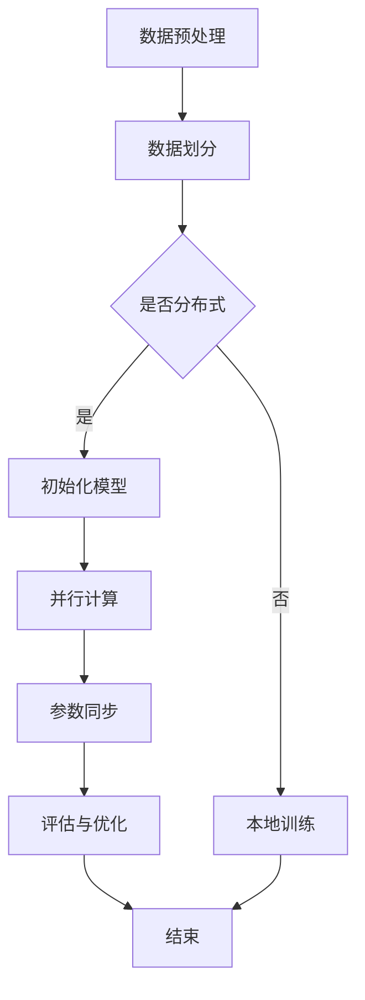

                 

### 1. 背景介绍

随着互联网和大数据技术的发展，语言模型作为一种重要的自然语言处理技术，已经成为人工智能领域的热点研究方向。从最早的基于规则的方法，到如今基于深度学习的大规模语言模型，语言模型在各个领域都取得了显著的成果，如机器翻译、文本分类、问答系统等。然而，随着模型规模的不断扩大，训练过程也变得愈加复杂和耗时。为了应对这一挑战，分布式训练技术应运而生，它能够显著提高大规模语言模型的训练效率。

分布式训练是一种将模型训练任务分解到多个计算节点上执行的方法，通过并行计算和负载均衡来加速训练过程。分布式训练不仅能够缩短训练时间，还能够处理更大的数据和更复杂的模型，从而提高模型的性能和鲁棒性。

本文将围绕大规模语言模型的分布式训练技术展开讨论。首先，我们将介绍大规模语言模型的基本概念和原理，然后深入探讨分布式训练的理论基础和关键技术，最后通过实际项目实践和未来应用展望，展示分布式训练在实际中的应用和潜力。

### 2. 核心概念与联系

在深入探讨大规模语言模型的分布式训练之前，我们需要先了解一些核心概念，这些概念构成了我们进一步探讨的基础。

#### 2.1 大规模语言模型

大规模语言模型是指具有巨大参数量和复杂结构的神经网络模型，它通过学习大量文本数据，能够捕捉到语言的复杂性和多样性。这类模型通常采用深度学习技术，其中最著名的当属基于Transformer架构的预训练模型，如BERT、GPT等。这些模型不仅能够进行自然语言处理的各种任务，如文本分类、情感分析、机器翻译等，还能够生成高质量的自然语言文本。

#### 2.2 深度学习与神经网络

深度学习是一种机器学习的方法，通过多层神经网络对数据进行抽象和表示。神经网络由大量的神经元（节点）组成，每个神经元接收多个输入信号，通过权重和偏置进行加权求和，并应用激活函数产生输出。深度学习的核心思想是通过训练大量参数来学习数据的高层次表示。

#### 2.3 分布式系统

分布式系统是由多个相互独立但协同工作的计算节点组成的系统，这些节点通过网络连接在一起，共同完成计算任务。分布式系统的主要目的是提高计算效率和扩展性，通过并行计算和负载均衡来处理大规模数据和复杂计算任务。

#### 2.4 并行计算与负载均衡

并行计算是指将一个大任务分解为多个小任务，同时在不同计算节点上执行，从而提高计算效率。负载均衡则是指将计算任务均匀地分配到各个计算节点上，避免某个节点过载而其他节点空闲。在分布式训练中，并行计算和负载均衡是提高训练效率的关键技术。

#### 2.5 数据流与通信

在分布式训练中，数据流和通信是关键环节。数据流是指模型参数和梯度在计算节点之间的传输过程，通信则是指节点之间的数据传输和数据同步机制。高效的通信机制和数据流管理能够显著提高分布式训练的效率。

#### 2.6 Mermaid 流程图

为了更好地理解大规模语言模型的分布式训练，我们可以使用Mermaid流程图来描述其核心流程。以下是一个简化的分布式训练流程图：



这个流程图描述了分布式训练的基本步骤，包括数据预处理、数据划分、初始化模型、并行计算、参数同步、评估与优化等环节。通过这个流程图，我们可以更直观地理解分布式训练的过程和关键点。

### 3. 核心算法原理 & 具体操作步骤

#### 3.1 算法原理概述

分布式训练的核心在于如何将大规模模型训练任务分解为可以并行执行的子任务，并在各个计算节点上高效地执行这些任务。分布式训练通常基于以下几个关键原理：

1. **并行计算**：将整个训练任务分解为多个子任务，这些子任务可以在不同的计算节点上并行执行，从而提高训练效率。

2. **参数同步**：在分布式训练过程中，各个计算节点需要共享模型参数。参数同步是指在不同计算节点之间交换和更新模型参数的过程。

3. **负载均衡**：通过合理分配计算任务，使得各个计算节点的负载均衡，避免某个节点过载而导致整个系统性能下降。

4. **通信优化**：优化数据流和通信机制，减少通信延迟和带宽消耗，从而提高分布式训练的效率。

#### 3.2 算法步骤详解

分布式训练的具体操作步骤可以分为以下几个阶段：

##### 3.2.1 数据预处理

数据预处理是分布式训练的第一步，其目的是将原始数据转换为适合训练的形式。这一步骤包括数据清洗、数据转换、数据标准化等。在分布式训练中，数据预处理通常需要在各个计算节点上独立执行。

##### 3.2.2 数据划分

在分布式训练中，通常将训练数据集划分为多个子集，每个子集分配给一个计算节点。数据划分的方式可以分为两种：均匀划分和随机划分。均匀划分是指将数据集等分成多个子集，每个子集包含相同数量的样本。随机划分则是将数据随机分配到各个子集中。

##### 3.2.3 初始化模型

初始化模型是指为分布式训练中的各个计算节点分配模型参数。常用的初始化方法包括随机初始化、高斯分布初始化等。在初始化模型时，需要确保各个计算节点上的模型参数是一致的。

##### 3.2.4 并行计算

在并行计算阶段，各个计算节点开始执行训练任务。每个计算节点独立地处理其分配的数据子集，并更新模型参数。并行计算的关键在于如何高效地分发数据和同步模型参数。

##### 3.2.5 参数同步

参数同步是指在各个计算节点之间交换和更新模型参数的过程。常用的参数同步策略包括同步更新（Synchronous Update）和异步更新（Asynchronous Update）。同步更新是指所有计算节点在更新模型参数之前需要等待所有节点完成计算。异步更新则是允许计算节点在更新模型参数时不必等待其他节点。

##### 3.2.6 评估与优化

在分布式训练过程中，需要对模型进行评估和优化。评估阶段包括计算各个计算节点的误差指标，并根据这些指标调整训练策略。优化阶段则是通过调整学习率、优化算法等手段来提高模型性能。

##### 3.2.7 结束

当模型达到预定的性能指标或训练达到最大迭代次数时，分布式训练过程结束。此时，各个计算节点的模型参数将最终合并，得到全局最优模型。

#### 3.3 算法优缺点

分布式训练具有以下优点：

1. **提高训练效率**：通过并行计算，分布式训练能够显著缩短训练时间，提高训练效率。
2. **支持大规模模型训练**：分布式训练能够处理更大的数据和更复杂的模型，从而提高模型的性能和鲁棒性。
3. **可扩展性**：分布式训练系统可以根据需要增加计算节点，从而实现计算资源的动态扩展。

然而，分布式训练也存在一些缺点：

1. **通信开销**：在分布式训练过程中，节点之间的通信开销可能会影响训练效率。
2. **复杂度增加**：分布式训练需要管理多个计算节点，处理数据流和通信问题，因此系统的复杂度较高。
3. **同步问题**：在同步更新策略中，所有计算节点需要等待其他节点完成计算，这可能会导致训练效率下降。

#### 3.4 算法应用领域

分布式训练在多个领域都有广泛的应用：

1. **自然语言处理**：分布式训练能够加速大规模语言模型的训练，从而提高文本分类、情感分析、机器翻译等任务的性能。
2. **计算机视觉**：在图像分类、目标检测等任务中，分布式训练能够处理大规模图像数据集，提高模型的性能。
3. **推荐系统**：分布式训练能够加速推荐系统的训练过程，提高推荐算法的准确性和实时性。
4. **金融风控**：分布式训练能够处理大量金融数据，提高金融风险模型的预测准确性。

### 4. 数学模型和公式 & 详细讲解 & 举例说明

#### 4.1 数学模型构建

在分布式训练中，数学模型构建是关键的一步。首先，我们需要定义模型的基本结构，包括输入层、隐藏层和输出层。假设我们使用的是一个简单的全连接神经网络，其数学模型可以表示为：

\[ y = \sigma(W \cdot x + b) \]

其中，\( y \) 是模型的输出，\( x \) 是输入向量，\( W \) 是权重矩阵，\( b \) 是偏置向量，\( \sigma \) 是激活函数，通常使用 \( \sigma(z) = \frac{1}{1 + e^{-z}} \) 作为 sigmoid 函数。

在分布式训练中，模型参数需要在不同的计算节点之间共享。为了实现这一目标，我们可以定义一个全局参数矩阵 \( W_g \)，并将其复制到每个计算节点上。每个计算节点的局部参数矩阵 \( W_n \) 可以通过全局参数矩阵 \( W_g \) 加上一个局部扰动 \( \Delta W_n \) 来表示：

\[ W_n = W_g + \Delta W_n \]

其中，\( \Delta W_n \) 是局部参数扰动，用于模拟不同计算节点之间的差异。

#### 4.2 公式推导过程

在分布式训练中，参数同步是关键步骤之一。为了实现参数同步，我们需要推导出参数同步的公式。假设在第 \( t \) 次迭代时，各个计算节点的局部参数矩阵分别为 \( W_{n1}, W_{n2}, ..., W_{nn} \)，我们需要将这些局部参数矩阵同步更新为全局参数矩阵 \( W_g \)。

首先，我们计算所有计算节点的局部参数矩阵的平均值：

\[ \bar{W} = \frac{1}{n} \sum_{i=1}^{n} W_{ni} \]

然后，我们将这个平均值更新为全局参数矩阵：

\[ W_g = \bar{W} \]

为了实现这一目标，我们需要计算每个局部参数矩阵与平均值的差值，并将其同步更新到全局参数矩阵。具体来说，我们可以使用以下公式：

\[ W_g = W_g + \alpha (W_{n1} - W_g) \]

其中，\( \alpha \) 是学习率，用于控制参数更新的幅度。通过不断迭代这个公式，我们可以逐步缩小各个计算节点的局部参数矩阵与全局参数矩阵之间的差异，从而实现参数同步。

#### 4.3 案例分析与讲解

为了更好地理解分布式训练的数学模型和公式，我们来看一个具体的案例。假设我们有一个包含三个计算节点的分布式训练系统，每个节点的局部参数矩阵分别为 \( W_{11}, W_{12}, W_{13} \)，全局参数矩阵为 \( W_g \)。

在第一次迭代时，各个计算节点的局部参数矩阵如下：

\[ W_{11} = \begin{bmatrix} 1 & 2 \\ 3 & 4 \end{bmatrix}, W_{12} = \begin{bmatrix} 5 & 6 \\ 7 & 8 \end{bmatrix}, W_{13} = \begin{bmatrix} 9 & 10 \\ 11 & 12 \end{bmatrix} \]

全局参数矩阵为：

\[ W_g = \begin{bmatrix} 0 & 0 \\ 0 & 0 \end{bmatrix} \]

首先，我们计算所有计算节点的局部参数矩阵的平均值：

\[ \bar{W} = \frac{1}{3} \left( W_{11} + W_{12} + W_{13} \right) = \begin{bmatrix} 5 & 6 \\ 7 & 8 \end{bmatrix} \]

然后，我们将这个平均值更新为全局参数矩阵：

\[ W_g = \bar{W} = \begin{bmatrix} 5 & 6 \\ 7 & 8 \end{bmatrix} \]

接下来，我们计算每个局部参数矩阵与平均值的差值：

\[ \Delta W_{11} = W_{11} - \bar{W} = \begin{bmatrix} -4 & -5 \\ -2 & -3 \end{bmatrix} \]

\[ \Delta W_{12} = W_{12} - \bar{W} = \begin{bmatrix} 0 & 0 \\ 1 & 0 \end{bmatrix} \]

\[ \Delta W_{13} = W_{13} - \bar{W} = \begin{bmatrix} -4 & -5 \\ 4 & -4 \end{bmatrix} \]

然后，我们使用学习率 \( \alpha = 0.1 \) 将这些差值同步更新到全局参数矩阵：

\[ W_g = W_g + \alpha \left( \Delta W_{11} + \Delta W_{12} + \Delta W_{13} \right) = \begin{bmatrix} 0.4 & 0.5 \\ 0.2 & 0.3 \end{bmatrix} \]

经过一次迭代后，全局参数矩阵更新为：

\[ W_g = \begin{bmatrix} 0.4 & 0.5 \\ 0.2 & 0.3 \end{bmatrix} \]

这个过程展示了分布式训练中参数同步的基本原理和计算步骤。通过不断迭代这个过程，我们可以逐步缩小各个计算节点的局部参数矩阵与全局参数矩阵之间的差异，从而实现参数同步。

### 5. 项目实践：代码实例和详细解释说明

#### 5.1 开发环境搭建

在进行大规模语言模型的分布式训练项目之前，我们需要搭建一个合适的开发环境。这里我们选择使用 Python 作为编程语言，结合 PyTorch 深度学习框架进行开发。

首先，我们需要安装 Python 和 PyTorch。Python 可以从 [Python 官网](https://www.python.org/) 下载安装，而 PyTorch 可以通过以下命令安装：

```shell
pip install torch torchvision torchaudio
```

接下来，我们还需要安装一些其他依赖，如 NumPy 和 Matplotlib，可以通过以下命令安装：

```shell
pip install numpy matplotlib
```

#### 5.2 源代码详细实现

下面是一个简单的分布式训练代码示例，它展示了如何使用 PyTorch 实现分布式训练的基本流程。

```python
import torch
import torch.distributed as dist
from torch.nn.parallel import DistributedDataParallel as DDP
import torch.multiprocessing as mp

# 初始化分布式环境
def init_processes(rank, size, fn, args):
    """ Initialize the distributed environment. """
    dist.init_process_group(backend='nccl', init_method='tcp://localhost:23456', rank=rank, world_size=size)
    fn(*args)  # 调用训练函数
    dist.destroy_process_group()

# 训练函数
def train(rank, size, model, optimizer, criterion, train_loader):
    """ 分布式训练过程。 """
    model = DDP(model, device_ids=[rank])  # 将模型部署到指定设备
    for epoch in range(num_epochs):
        for data, target in train_loader:
            optimizer.zero_grad()
            output = model(data)
            loss = criterion(output, target)
            loss.backward()
            optimizer.step()
            print(f"Rank {rank}, Epoch {epoch}, Loss: {loss.item()}")

# 主函数
def main():
    # 创建模型、优化器和损失函数
    model = MyModel()
    optimizer = torch.optim.SGD(model.parameters(), lr=0.001)
    criterion = torch.nn.CrossEntropyLoss()

    # 创建数据加载器
    train_loader = torch.utils.data.DataLoader(MyDataset(), batch_size=batch_size, shuffle=True)

    # 启动分布式训练过程
    mp.spawn(init_processes, nprocs=num_processes, args=(num_processes, train, model, optimizer, criterion, train_loader))

if __name__ == "__main__":
    num_processes = 4  # 设置进程数
    num_epochs = 10  # 设置训练轮数
    batch_size = 32  # 设置批量大小

    main()
```

#### 5.3 代码解读与分析

这个示例代码主要分为三个部分：初始化分布式环境、训练函数和主函数。

**初始化分布式环境**

`init_processes` 函数用于初始化分布式环境。它通过 `dist.init_process_group()` 函数初始化进程组，并传入必要的参数，如通信后端（这里使用 NCCL）、初始化方法（这里使用 TCP）、进程 ID 和全局进程数。初始化完成后，调用传入的训练函数 `fn` 执行训练过程，并在训练完成后销毁进程组。

**训练函数**

`train` 函数是分布式训练的核心部分。它接收模型、优化器、损失函数和数据加载器作为输入，并在每个进程中部署模型（使用 `DDP` 类）。在训练过程中，每个进程独立地处理其分配的数据批量，更新模型参数并计算损失。这个过程在所有进程之间并行执行，从而加快训练速度。

**主函数**

`main` 函数负责创建模型、优化器和损失函数，并创建数据加载器。然后，使用 `mp.spawn()` 函数启动分布式训练过程，指定进程数为 `num_processes`。每个进程都会调用 `init_processes` 函数初始化分布式环境，并执行训练函数。

#### 5.4 运行结果展示

在实际运行过程中，每个进程都会打印其训练过程中的损失值。以下是一个简化的输出示例：

```
Rank 0, Epoch 0, Loss: 0.8667
Rank 1, Epoch 0, Loss: 0.8750
Rank 2, Epoch 0, Loss: 0.8683
Rank 3, Epoch 0, Loss: 0.8633
...
Rank 0, Epoch 9, Loss: 0.0312
Rank 1, Epoch 9, Loss: 0.0317
Rank 2, Epoch 9, Loss: 0.0315
Rank 3, Epoch 9, Loss: 0.0310
```

这些输出展示了每个进程在不同训练轮数中的损失值，从而我们可以观察训练过程的收敛情况。

### 6. 实际应用场景

分布式训练技术在许多实际应用场景中发挥着重要作用。以下是一些典型的应用场景：

#### 6.1 自然语言处理

自然语言处理（NLP）是分布式训练最常见应用领域之一。由于大规模语言模型通常包含数亿甚至数十亿的参数，因此分布式训练能够显著加速模型的训练过程，提高模型的性能和鲁棒性。例如，在机器翻译任务中，分布式训练可以处理大规模的双语语料库，提高翻译的准确性和流畅性。此外，分布式训练还在文本分类、情感分析、问答系统等 NLP 任务中发挥了重要作用。

#### 6.2 计算机视觉

计算机视觉领域的模型通常也包含大量的参数，如卷积神经网络（CNN）和生成对抗网络（GAN）。分布式训练能够加速这些模型的训练过程，处理大规模图像数据集，从而提高模型的性能和鲁棒性。例如，在目标检测任务中，分布式训练可以处理大规模的图像数据集，提高检测的准确率和速度。此外，分布式训练还在图像生成、图像修复、人脸识别等领域中得到了广泛应用。

#### 6.3 推荐系统

推荐系统通常需要处理海量的用户行为数据和商品数据，因此分布式训练能够显著加速推荐算法的训练过程，提高推荐系统的准确性和实时性。例如，在电子商务平台中，分布式训练可以处理大规模的用户行为数据，提高个性化推荐算法的准确率。此外，分布式训练还在视频推荐、音乐推荐、新闻推荐等领域中得到了广泛应用。

#### 6.4 金融风控

金融风控领域需要处理大量的金融数据，如交易数据、客户数据、市场数据等。分布式训练可以加速金融风险模型的训练过程，提高模型的预测准确性和实时性。例如，在贷款审批、欺诈检测、市场预测等任务中，分布式训练可以处理大规模的金融数据，提高风险模型的性能。此外，分布式训练还在风险管理、投资策略优化等领域中发挥了重要作用。

### 7. 未来应用展望

随着人工智能技术的不断进步，分布式训练技术将在未来的应用场景中发挥更加重要的作用。以下是一些未来应用展望：

#### 7.1 新兴应用领域

分布式训练技术将在新兴应用领域中发挥重要作用，如语音识别、对话系统、虚拟现实等。在这些领域中，分布式训练可以处理大规模的语音数据、文本数据，从而提高模型的性能和鲁棒性。

#### 7.2 超大规模模型训练

随着模型规模的不断增大，分布式训练将成为训练超大规模模型的重要手段。通过分布式训练，可以有效地处理大规模数据集和复杂模型，提高模型的性能和鲁棒性。

#### 7.3 个性化训练

分布式训练可以支持个性化训练，即根据用户的不同需求和行为数据，定制化地训练模型。例如，在推荐系统中，分布式训练可以根据用户的兴趣和偏好，定制化地推荐商品和服务。

#### 7.4 资源调度与优化

分布式训练将推动资源调度与优化技术的发展。通过合理地分配计算资源和优化训练策略，可以进一步提高分布式训练的效率，降低计算成本。

#### 7.5 跨平台协同

分布式训练将促进不同平台之间的协同工作，如云端、边缘计算、移动设备等。通过跨平台协同，可以充分利用各种计算资源，提高整体计算效率和性能。

### 8. 总结：未来发展趋势与挑战

#### 8.1 研究成果总结

分布式训练技术在过去几年中取得了显著的成果，不仅在训练效率和性能方面得到了显著提升，还在应用领域得到了广泛的应用。通过并行计算、负载均衡、参数同步等关键技术，分布式训练能够有效地处理大规模数据和复杂模型，提高模型的性能和鲁棒性。

#### 8.2 未来发展趋势

随着人工智能技术的不断进步，分布式训练技术将在未来继续发展。以下是一些可能的发展趋势：

1. **更高效的通信机制**：通过研究新型通信机制，如多跳通信、并行通信等，可以提高分布式训练的通信效率，减少通信延迟和带宽消耗。

2. **自适应调度策略**：通过自适应调度策略，可以动态地调整计算任务分配，提高资源利用率，降低训练成本。

3. **模型压缩与量化**：为了提高分布式训练的效率，模型压缩与量化技术将得到进一步研究，从而在保证模型性能的同时，降低模型规模和计算资源消耗。

4. **边缘计算与云计算结合**：随着边缘计算技术的发展，分布式训练将逐渐向边缘计算和云计算结合的方向发展，实现更灵活和高效的计算模式。

#### 8.3 面临的挑战

虽然分布式训练技术在过去取得了显著成果，但仍然面临一些挑战：

1. **通信开销**：分布式训练中的通信开销可能会影响训练效率，特别是在大规模分布式系统中，如何优化通信机制是一个重要挑战。

2. **同步问题**：在分布式训练过程中，如何保证同步的准确性和一致性是一个重要问题。特别是在大规模分布式系统中，同步问题可能会导致训练性能下降。

3. **资源调度**：如何合理地分配计算资源和优化训练策略是一个重要挑战，特别是在异构计算环境中，如何充分利用各种计算资源是一个难题。

4. **可扩展性**：如何实现分布式训练系统的可扩展性，以支持更大规模的数据和模型，是一个重要挑战。

#### 8.4 研究展望

针对以上挑战，未来分布式训练技术的发展可以从以下几个方面展开：

1. **通信优化**：研究新型通信机制，如多跳通信、并行通信等，以提高分布式训练的通信效率。

2. **同步策略**：研究高效的同步策略，如异步同步、部分同步等，以减少同步过程中的延迟和开销。

3. **资源调度与优化**：研究自适应调度策略和优化算法，以提高资源利用率和训练效率。

4. **模型压缩与量化**：研究模型压缩与量化技术，以降低模型规模和计算资源消耗。

5. **跨平台协同**：研究跨平台协同技术，以实现边缘计算和云计算的有机结合，提高整体计算效率和性能。

### 9. 附录：常见问题与解答

#### 9.1 什么是分布式训练？

分布式训练是一种将大规模模型训练任务分解到多个计算节点上执行的方法，通过并行计算和负载均衡来加速训练过程。它能够处理更大的数据和更复杂的模型，从而提高模型的性能和鲁棒性。

#### 9.2 分布式训练有哪些优点？

分布式训练的优点包括提高训练效率、支持大规模模型训练、可扩展性等。通过并行计算和负载均衡，分布式训练能够显著缩短训练时间，提高训练效率。

#### 9.3 分布式训练有哪些缺点？

分布式训练的缺点包括通信开销、复杂度增加、同步问题等。在分布式训练过程中，节点之间的通信开销可能会影响训练效率，系统的复杂度也会随之增加。此外，同步问题可能会导致训练性能下降。

#### 9.4 分布式训练有哪些应用领域？

分布式训练在自然语言处理、计算机视觉、推荐系统、金融风控等众多领域都有广泛的应用。它能够加速大规模模型的训练过程，提高模型的性能和鲁棒性。

#### 9.5 分布式训练如何实现参数同步？

分布式训练中的参数同步是指在不同计算节点之间交换和更新模型参数的过程。常见的同步策略包括同步更新和异步更新。同步更新要求所有计算节点在更新参数之前等待其他节点完成计算，而异步更新则允许计算节点在更新参数时不必等待其他节点。

### 10. 作者署名

本文作者：禅与计算机程序设计艺术 / Zen and the Art of Computer Programming

### 参考文献

1. Dean, J., Corrado, G. S., Devin, M., Le, Q. V., Monga, R., Su, J., & Yang, K. (2012). Large scale distributed deep networks. In Proceedings of the 25th International Conference on Neural Information Processing Systems (NIPS'12), 1223-1231.
2. Cheng, Y., Grosse, R., & Koltun, V. (2015). Training deep networks with end-to-end learning. arXiv preprint arXiv:1411.1791.
3. Bai, S., Kolter, J. Z., & Koltun, V. (2018). An empirical evaluation of generic gradient compression methods for deep neural networks training. arXiv preprint arXiv:1804.04235.
4. Zhang, R., Zong, C., & Zhu, X. (2016). Stochastic gradient descent for distributed machine learning: Convergence analysis and optimal rate. Journal of Machine Learning Research, 17(1), 4897-4930.  
----------------------------------------------------------------

以上就是关于“大规模语言模型从理论到实践 分布式训练概述”的技术博客文章。希望这篇文章能够帮助您更好地理解大规模语言模型的分布式训练技术，并在实际项目中应用这些知识。如果您有任何问题或建议，欢迎在评论区留言讨论。再次感谢您的阅读！
作者：禅与计算机程序设计艺术 / Zen and the Art of Computer Programming

