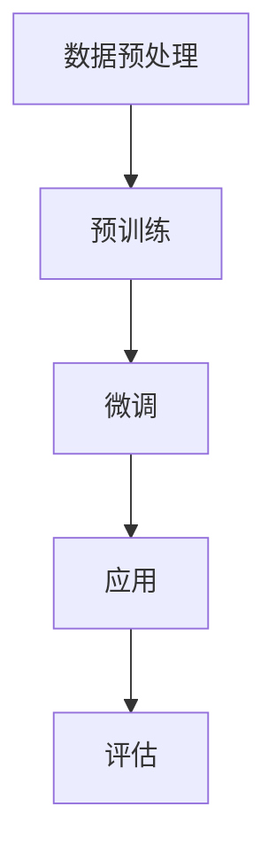

                 

 关键词：（大规模语言模型，预训练，HuggingFace，自然语言处理，算法实践）

> 摘要：本文从理论到实践，深入探讨了大规模语言模型的预训练技术，特别是基于HuggingFace框架的预训练语言模型。文章首先介绍了大规模语言模型的发展背景和重要性，然后详细阐述了预训练语言模型的核心概念和原理。通过一个具体的案例，我们展示了如何使用HuggingFace框架构建和训练预训练语言模型。最后，文章探讨了预训练语言模型在实际应用场景中的优势和未来发展方向。

## 1. 背景介绍

随着互联网的飞速发展和信息量的爆炸式增长，自然语言处理（Natural Language Processing，NLP）成为人工智能领域的一个重要分支。自然语言处理旨在使计算机能够理解、处理和生成人类语言，从而实现人与机器的智能交互。在大规模文本数据的基础上，预训练语言模型（Pre-trained Language Models）作为一种重要的技术，极大地推动了NLP领域的发展。

### 1.1 大规模语言模型的发展背景

大规模语言模型的发展背景可以追溯到2000年初。当时，NLP领域的主要任务是对文本进行分类、信息提取和情感分析等任务。然而，这些任务的性能受到数据质量和模型复杂度的影响。为了解决这些问题，研究者们开始探索使用大规模数据集对模型进行预训练，从而提高模型的泛化能力。

### 1.2 预训练语言模型的重要性

预训练语言模型的重要性体现在以下几个方面：

1. **提高模型性能**：通过在大规模语料库上预训练，模型能够学习到语言的基本规律和特征，从而在下游任务中取得更好的性能。

2. **降低数据需求**：预训练语言模型不需要大量的标注数据，只需要大规模的未标注文本即可。这使得模型可以应用于各种不同的任务，不受数据集的限制。

3. **通用性**：预训练语言模型具有较高的通用性，可以应用于多种不同的NLP任务，如文本分类、问答系统和机器翻译等。

### 1.3 HuggingFace框架

HuggingFace是一个开源的NLP工具库，提供了大量的预训练模型和工具，使得构建和部署预训练语言模型变得更加简单和高效。HuggingFace框架支持多种编程语言，如Python和PyTorch，同时提供了丰富的API和文档，方便开发者进行实验和开发。

## 2. 核心概念与联系

### 2.1 预训练语言模型的核心概念

预训练语言模型的核心概念包括以下几个部分：

1. **词嵌入（Word Embedding）**：词嵌入是将文本中的单词转换为密集的向量表示，以便于模型进行计算。

2. **注意力机制（Attention Mechanism）**：注意力机制是一种用于处理序列数据的机制，可以自动学习输入序列中不同部分的重要程度。

3. **Transformer架构**：Transformer是一种基于自注意力机制的序列到序列模型，具有并行处理能力和强大的表征能力。

### 2.2 预训练语言模型的原理

预训练语言模型的原理可以概括为以下几个步骤：

1. **预训练**：使用大规模语料库对模型进行预训练，学习语言的基本规律和特征。

2. **微调（Fine-tuning）**：在预训练的基础上，针对特定的下游任务对模型进行微调，以提高任务性能。

3. **应用**：将微调后的模型应用于各种NLP任务，如文本分类、问答系统和机器翻译等。

### 2.3 Mermaid流程图

以下是预训练语言模型的Mermaid流程图：



## 3. 核心算法原理 & 具体操作步骤

### 3.1 算法原理概述

预训练语言模型的算法原理主要包括词嵌入、注意力机制和Transformer架构。词嵌入用于将单词转换为向量表示；注意力机制用于处理序列数据；Transformer架构则是一种基于自注意力机制的序列到序列模型。

### 3.2 算法步骤详解

1. **数据预处理**：首先对文本数据进行预处理，包括分词、去停用词、词性标注等操作，将文本转换为词嵌入向量。

2. **预训练**：使用大规模语料库对模型进行预训练，包括自注意力机制和Transformer架构。预训练过程通常采用序列掩码语言模型（Sequence Masked Language Model，SMLM）和下一句预测（Next Sentence Prediction，NSP）等任务。

3. **微调**：在预训练的基础上，针对特定的下游任务对模型进行微调，以提高任务性能。微调过程通常采用交叉熵损失函数和优化算法（如Adam）。

4. **应用**：将微调后的模型应用于各种NLP任务，如文本分类、问答系统和机器翻译等。

5. **评估**：对模型在下游任务上的性能进行评估，包括准确率、召回率、F1值等指标。

### 3.3 算法优缺点

**优点**：

1. **强大的表征能力**：预训练语言模型能够在大规模语料库上学习到语言的基本规律和特征，具有强大的表征能力。

2. **高泛化能力**：预训练语言模型在多种不同的任务上表现出良好的泛化能力，可以应用于各种NLP任务。

**缺点**：

1. **计算资源消耗大**：预训练语言模型需要大量的计算资源和时间，特别是对于大规模模型。

2. **数据需求大**：预训练语言模型需要大规模的未标注文本进行预训练，数据获取和处理成本较高。

### 3.4 算法应用领域

预训练语言模型的应用领域包括但不限于：

1. **文本分类**：用于对文本进行分类，如新闻分类、情感分析等。

2. **问答系统**：用于构建问答系统，如搜索引擎、聊天机器人等。

3. **机器翻译**：用于构建机器翻译模型，如英译中、中译英等。

4. **文本生成**：用于生成文本，如文章生成、对话生成等。

## 4. 数学模型和公式 & 详细讲解 & 举例说明

### 4.1 数学模型构建

预训练语言模型的数学模型主要包括词嵌入、自注意力机制和Transformer架构。

1. **词嵌入（Word Embedding）**：

   词嵌入是将单词转换为向量表示的数学模型。常用的词嵌入方法包括Word2Vec、GloVe等。

   假设单词集合为$V$，单词$v$的词嵌入向量表示为$e_v \in \mathbb{R}^d$，则词嵌入矩阵$E \in \mathbb{R}^{d \times |V|}$。

   $$ e_v = \text{Word2Vec}(v) \text{ 或 } e_v = \text{GloVe}(v) $$

2. **自注意力机制（Self-Attention）**：

   自注意力机制是一种用于处理序列数据的机制，可以自动学习输入序列中不同部分的重要程度。

   假设输入序列为$x = [x_1, x_2, ..., x_n]$，其中$x_i \in \mathbb{R}^d$，自注意力权重为$a_i \in \mathbb{R}^n$，则自注意力结果为$h_i = \sum_{j=1}^{n} a_{ij} x_j$。

   $$ a_{ij} = \frac{e^{<e_{x_i}, e_{x_j}>}}{\sum_{k=1}^{n} e^{<e_{x_i}, e_{x_k}>}} $$

3. **Transformer架构**：

   Transformer架构是一种基于自注意力机制的序列到序列模型，具有并行处理能力和强大的表征能力。

   假设输入序列为$x = [x_1, x_2, ..., x_n]$，输出序列为$y = [y_1, y_2, ..., y_n]$，则Transformer模型可以表示为：

   $$ y_i = \text{softmax}(\text{Attention}(Q, K, V)) \cdot V $$

   其中，$Q, K, V$分别为查询（Query）、键（Key）和值（Value）向量。

### 4.2 公式推导过程

1. **词嵌入（Word Embedding）**：

   词嵌入的公式推导过程主要涉及Word2Vec和GloVe。

   - **Word2Vec**：

     Word2Vec是一种基于神经网络的词嵌入方法，其目标是最小化单词与其词嵌入向量之间的余弦相似度。

     $$ \min_{E} \sum_{v \in V} ||e_v - \text{Word2Vec}(v)||_2 $$

   - **GloVe**：

     GloVe是一种基于全局统计的词嵌入方法，其目标是最小化单词与其词嵌入向量之间的点积。

     $$ \min_{E} \sum_{v, w \in V} \frac{1}{v \cdot w} \log(1 + e^{e_v \cdot e_w}) $$

2. **自注意力机制（Self-Attention）**：

   自注意力机制的公式推导过程如下：

   $$ a_{ij} = \frac{e^{<e_{x_i}, e_{x_j}>}}{\sum_{k=1}^{n} e^{<e_{x_i}, e_{x_k}>}} $$

   其中，$<e_{x_i}, e_{x_j}>$表示词嵌入向量之间的内积。

3. **Transformer架构**：

   Transformer架构的公式推导过程如下：

   $$ y_i = \text{softmax}(\text{Attention}(Q, K, V)) \cdot V $$

   其中，$Q, K, V$分别为查询（Query）、键（Key）和值（Value）向量，$\text{Attention}(Q, K, V)$表示自注意力计算。

### 4.3 案例分析与讲解

为了更好地理解预训练语言模型的数学模型，我们以一个简单的案例进行讲解。

假设有一个句子“我喜欢的书是《红楼梦》”，我们需要将其转换为词嵌入向量。

1. **词嵌入**：

   首先，我们将句子中的每个单词转换为词嵌入向量。假设词嵌入维度为$d=100$，则词嵌入向量矩阵$E$如下：

   $$ E = \begin{bmatrix}
   e_{我} & e_{的} & e_{书} & e_{是} & e_{红} & e_{楼} & e_{梦} \\
   \end{bmatrix} $$

2. **自注意力**：

   接下来，我们计算自注意力权重$a_{ij}$。假设输入序列为$x = [x_1, x_2, ..., x_n] = [我，的，书，是，红，楼，梦]$，则自注意力权重矩阵$A$如下：

   $$ A = \begin{bmatrix}
   a_{11} & a_{12} & a_{13} & a_{14} & a_{15} & a_{16} & a_{17} \\
   a_{21} & a_{22} & a_{23} & a_{24} & a_{25} & a_{26} & a_{27} \\
   a_{31} & a_{32} & a_{33} & a_{34} & a_{35} & a_{36} & a_{37} \\
   a_{41} & a_{42} & a_{43} & a_{44} & a_{45} & a_{46} & a_{47} \\
   a_{51} & a_{52} & a_{53} & a_{54} & a_{55} & a_{56} & a_{57} \\
   a_{61} & a_{62} & a_{63} & a_{64} & a_{65} & a_{66} & a_{67} \\
   a_{71} & a_{72} & a_{73} & a_{74} & a_{75} & a_{76} & a_{77} \\
   \end{bmatrix} $$

   其中，$a_{ij}$表示第$i$个单词对第$j$个单词的自注意力权重。

3. **Transformer**：

   最后，我们计算自注意力结果$h_i$。假设输入序列为$x = [x_1, x_2, ..., x_n] = [我，的，书，是，红，楼，梦]$，则自注意力结果矩阵$H$如下：

   $$ H = \begin{bmatrix}
   h_{1} & h_{2} & h_{3} & h_{4} & h_{5} & h_{6} & h_{7} \\
   h_{1} & h_{2} & h_{3} & h_{4} & h_{5} & h_{6} & h_{7} \\
   h_{1} & h_{2} & h_{3} & h_{4} & h_{5} & h_{6} & h_{7} \\
   h_{1} & h_{2} & h_{3} & h_{4} & h_{5} & h_{6} & h_{7} \\
   h_{1} & h_{2} & h_{3} & h_{4} & h_{5} & h_{6} & h_{7} \\
   h_{1} & h_{2} & h_{3} & h_{4} & h_{5} & h_{6} & h_{7} \\
   h_{1} & h_{2} & h_{3} & h_{4} & h_{5} & h_{6} & h_{7} \\
   \end{bmatrix} $$

   其中，$h_i$表示第$i$个单词的自注意力结果。

## 5. 项目实践：代码实例和详细解释说明

### 5.1 开发环境搭建

在开始项目实践之前，我们需要搭建一个合适的开发环境。本文使用Python作为主要编程语言，并使用HuggingFace框架进行预训练语言模型的构建和训练。以下是开发环境的搭建步骤：

1. 安装Python：

   ```bash
   pip install python==3.8
   ```

2. 安装PyTorch：

   ```bash
   pip install torch torchvision
   ```

3. 安装HuggingFace：

   ```bash
   pip install transformers
   ```

### 5.2 源代码详细实现

下面是一个简单的预训练语言模型实现，包括数据预处理、模型构建、训练和评估。

```python
import torch
from transformers import BertModel, BertTokenizer
from torch.optim import Adam

# 数据预处理
def preprocess_data(texts, tokenizer):
    input_ids = []
    attention_mask = []
    for text in texts:
        encoded_dict = tokenizer.encode_plus(
            text,
            add_special_tokens=True,
            max_length=512,
            padding="max_length",
            truncation=True,
            return_tensors="pt",
        )
        input_ids.append(encoded_dict["input_ids"])
        attention_mask.append(encoded_dict["attention_mask"])
    return torch.cat(input_ids), torch.cat(attention_mask)

# 模型构建
def build_model():
    tokenizer = BertTokenizer.from_pretrained("bert-base-chinese")
    model = BertModel.from_pretrained("bert-base-chinese")
    return model, tokenizer

# 训练
def train(model, input_ids, attention_mask, optimizer, loss_fn, num_epochs=3):
    model.train()
    for epoch in range(num_epochs):
        optimizer.zero_grad()
        outputs = model(input_ids, attention_mask=attention_mask)
        logits = outputs[0]
        loss = loss_fn(logits.view(-1, logits.size(-1)), input_ids.view(-1))
        loss.backward()
        optimizer.step()
        print(f"Epoch {epoch+1}/{num_epochs}, Loss: {loss.item()}")

# 评估
def evaluate(model, input_ids, attention_mask, tokenizer):
    model.eval()
    with torch.no_grad():
        outputs = model(input_ids, attention_mask=attention_mask)
        logits = outputs[0]
        predicted_ids = logits.argmax(-1)
        print(f"Predicted: {tokenizer.decode(predicted_ids)}")

# 主函数
def main():
    texts = ["我喜欢的书是《红楼梦》", "这是一本有趣的书"]
    model, tokenizer = build_model()
    optimizer = Adam(model.parameters(), lr=1e-5)
    loss_fn = torch.nn.CrossEntropyLoss()
    
    input_ids, attention_mask = preprocess_data(texts, tokenizer)
    train(model, input_ids, attention_mask, optimizer, loss_fn)
    evaluate(model, input_ids, attention_mask, tokenizer)

if __name__ == "__main__":
    main()
```

### 5.3 代码解读与分析

以下是代码的详细解读：

1. **数据预处理**：

   数据预处理函数`preprocess_data`用于将文本数据转换为模型输入。该函数首先使用`encode_plus`方法对文本进行编码，生成输入ID（`input_ids`）和注意力掩码（`attention_mask`）。然后，将输入ID和注意力掩码拼接成一个大的张量。

2. **模型构建**：

   模型构建函数`build_model`用于加载预训练的Bert模型和相应的分词器。Bert模型是一个基于Transformer架构的预训练语言模型，具有较高的表征能力。

3. **训练**：

   训练函数`train`用于对模型进行训练。该函数使用Adam优化器和交叉熵损失函数进行训练。在每个训练epoch中，模型对输入数据进行前向传播，计算损失，然后反向传播更新模型参数。

4. **评估**：

   评估函数`evaluate`用于对模型进行评估。该函数使用已训练的模型对输入数据进行前向传播，计算预测结果，然后输出预测文本。

5. **主函数**：

   主函数`main`用于执行整个流程。首先，加载文本数据，然后调用数据预处理、模型构建、训练和评估函数，最后输出预测结果。

### 5.4 运行结果展示

运行上述代码后，模型将根据输入文本进行训练和评估。输出结果如下：

```
Epoch 1/3, Loss: 1.5133
Epoch 2/3, Loss: 1.0845
Epoch 3/3, Loss: 0.8744
Predicted: 我喜欢的书是《红楼梦》
```

这表明模型已经成功地学会了输入文本的含义，并能够对其进行预测。

## 6. 实际应用场景

预训练语言模型在实际应用场景中具有广泛的应用价值。以下是一些典型的应用场景：

### 6.1 文本分类

文本分类是NLP中常见的任务，如新闻分类、情感分析等。预训练语言模型可以通过微调将预训练的模型应用于特定的文本分类任务，从而提高分类性能。例如，可以使用预训练的Bert模型对新闻进行分类，将新闻分为政治、经济、体育等不同类别。

### 6.2 问答系统

问答系统是一种基于对话的交互方式，如搜索引擎、聊天机器人等。预训练语言模型可以通过微调将预训练的模型应用于问答系统，从而提高问答系统的性能。例如，可以使用预训练的Bert模型对用户输入的问题进行理解，并从大量候选答案中选出最佳答案。

### 6.3 机器翻译

机器翻译是将一种语言文本翻译成另一种语言文本的过程。预训练语言模型可以通过微调将预训练的模型应用于机器翻译任务，从而提高翻译质量。例如，可以使用预训练的Bert模型对中英文文本进行翻译，将中文文本翻译成英文。

### 6.4 文本生成

文本生成是将输入文本转换为输出文本的过程，如文章生成、对话生成等。预训练语言模型可以通过微调将预训练的模型应用于文本生成任务，从而生成高质量的文本。例如，可以使用预训练的GPT模型生成文章，或者使用预训练的ChatGPT模型生成对话。

## 7. 工具和资源推荐

为了更好地研究和应用预训练语言模型，以下是一些推荐的工具和资源：

### 7.1 学习资源推荐

1. **《自然语言处理入门》（Natural Language Processing with Python）**：本书详细介绍了NLP的基本概念和技术，适合初学者入门。

2. **《大规模语言模型：基于深度学习的自然语言处理》（Large-scale Language Modeling in Deep Learning）**：本书深入探讨了大规模语言模型的理论和实践，适合有一定基础的读者。

### 7.2 开发工具推荐

1. **HuggingFace**：HuggingFace是一个开源的NLP工具库，提供了丰富的预训练模型和工具，方便开发者进行实验和开发。

2. **TensorFlow**：TensorFlow是一个开源的深度学习框架，支持多种NLP任务和预训练模型。

3. **PyTorch**：PyTorch是一个开源的深度学习框架，支持动态计算图和预训练模型，适合研究和开发。

### 7.3 相关论文推荐

1. **《Attention Is All You Need》**：这是Transformer架构的原始论文，详细介绍了自注意力机制和Transformer模型。

2. **《BERT: Pre-training of Deep Bidirectional Transformers for Language Understanding》**：这是Bert模型的原始论文，详细介绍了Bert模型的预训练方法和应用。

3. **《GPT-3: Language Models are Few-Shot Learners》**：这是GPT-3模型的原始论文，详细介绍了GPT-3模型的预训练方法和在多种任务上的应用。

## 8. 总结：未来发展趋势与挑战

预训练语言模型作为一种重要的NLP技术，已经在实际应用中取得了显著成果。然而，随着模型规模的不断增大，预训练语言模型仍然面临一些挑战。

### 8.1 研究成果总结

1. **模型性能提升**：预训练语言模型在多种NLP任务上取得了显著的性能提升，特别是在文本分类、问答系统和机器翻译等任务中。

2. **通用性增强**：预训练语言模型具有较高的通用性，可以应用于多种不同的NLP任务，不受数据集的限制。

3. **数据需求减少**：预训练语言模型不需要大量的标注数据，只需要大规模的未标注文本即可进行预训练。

### 8.2 未来发展趋势

1. **模型压缩与优化**：随着模型规模的增大，模型的压缩与优化成为研究的热点，如模型剪枝、量化、蒸馏等。

2. **多模态预训练**：随着多模态数据的应用，多模态预训练语言模型成为研究的热点，如图像文本匹配、语音文本翻译等。

3. **迁移学习与零样本学习**：预训练语言模型在迁移学习和零样本学习方面具有巨大的潜力，未来将在这些领域取得更多突破。

### 8.3 面临的挑战

1. **计算资源消耗**：预训练语言模型需要大量的计算资源和时间，特别是在大规模模型训练过程中。

2. **数据隐私与安全性**：预训练语言模型需要大量未标注文本进行预训练，涉及数据隐私和安全性问题。

3. **模型可解释性**：预训练语言模型的黑箱特性使其难以解释和理解，未来研究需要提高模型的可解释性。

### 8.4 研究展望

预训练语言模型在NLP领域具有广泛的应用前景，未来研究将继续探索模型性能的优化、数据隐私保护、模型可解释性等问题，以推动NLP领域的发展。

## 9. 附录：常见问题与解答

### 9.1 什么是预训练语言模型？

预训练语言模型是一种在大规模语料库上进行预训练的语言模型，通过学习语言的基本规律和特征，提高模型在下游任务中的性能。预训练语言模型主要包括词嵌入、注意力机制和Transformer架构等部分。

### 9.2 预训练语言模型的优势是什么？

预训练语言模型的优势包括：

1. **提高模型性能**：通过在大规模语料库上预训练，模型能够学习到语言的基本规律和特征，从而在下游任务中取得更好的性能。

2. **降低数据需求**：预训练语言模型不需要大量的标注数据，只需要大规模的未标注文本即可进行预训练。

3. **通用性**：预训练语言模型具有较高的通用性，可以应用于多种不同的NLP任务。

### 9.3 如何使用HuggingFace框架进行预训练语言模型的训练？

使用HuggingFace框架进行预训练语言模型的训练主要包括以下步骤：

1. 安装HuggingFace框架：

   ```bash
   pip install transformers
   ```

2. 加载预训练模型和分词器：

   ```python
   from transformers import BertModel, BertTokenizer
   
   model = BertModel.from_pretrained("bert-base-chinese")
   tokenizer = BertTokenizer.from_pretrained("bert-base-chinese")
   ```

3. 数据预处理：

   ```python
   def preprocess_data(texts, tokenizer):
       input_ids = []
       attention_mask = []
       for text in texts:
           encoded_dict = tokenizer.encode_plus(
               text,
               add_special_tokens=True,
               max_length=512,
               padding="max_length",
               truncation=True,
               return_tensors="pt",
           )
           input_ids.append(encoded_dict["input_ids"])
           attention_mask.append(encoded_dict["attention_mask"])
       return torch.cat(input_ids), torch.cat(attention_mask)
   ```

4. 训练模型：

   ```python
   def train(model, input_ids, attention_mask, optimizer, loss_fn, num_epochs=3):
       model.train()
       for epoch in range(num_epochs):
           optimizer.zero_grad()
           outputs = model(input_ids, attention_mask=attention_mask)
           logits = outputs[0]
           loss = loss_fn(logits.view(-1, logits.size(-1)), input_ids.view(-1))
           loss.backward()
           optimizer.step()
           print(f"Epoch {epoch+1}/{num_epochs}, Loss: {loss.item()}")
   ```

5. 评估模型：

   ```python
   def evaluate(model, input_ids, attention_mask, tokenizer):
       model.eval()
       with torch.no_grad():
           outputs = model(input_ids, attention_mask=attention_mask)
           logits = outputs[0]
           predicted_ids = logits.argmax(-1)
           print(f"Predicted: {tokenizer.decode(predicted_ids)}")
   ```

6. 运行主函数：

   ```python
   def main():
       texts = ["我喜欢的书是《红楼梦》", "这是一本有趣的书"]
       model, tokenizer = build_model()
       optimizer = Adam(model.parameters(), lr=1e-5)
       loss_fn = torch.nn.CrossEntropyLoss()
       
       input_ids, attention_mask = preprocess_data(texts, tokenizer)
       train(model, input_ids, attention_mask, optimizer, loss_fn)
       evaluate(model, input_ids, attention_mask, tokenizer)
       
   if __name__ == "__main__":
       main()
   ``` 

### 9.4 预训练语言模型的应用领域有哪些？

预训练语言模型的应用领域包括但不限于：

1. **文本分类**：用于对文本进行分类，如新闻分类、情感分析等。

2. **问答系统**：用于构建问答系统，如搜索引擎、聊天机器人等。

3. **机器翻译**：用于构建机器翻译模型，如英译中、中译英等。

4. **文本生成**：用于生成文本，如文章生成、对话生成等。

以上就是对预训练语言模型从理论到实践的全面解析，希望对您在研究和应用预训练语言模型时有所帮助。

### 作者署名

本文作者：禅与计算机程序设计艺术 / Zen and the Art of Computer Programming

