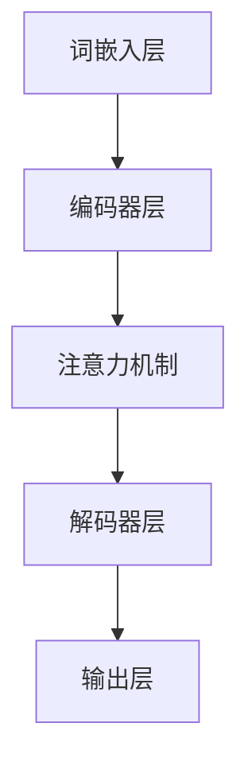

                 

关键词：大规模语言模型、神经网络、深度学习、自然语言处理、语言生成、预训练模型、算法原理、数学模型、项目实践、应用场景、未来展望

## 摘要

本文将深入探讨大规模语言模型的发展历程，从理论到实践，解析其核心概念、算法原理、数学模型及实际应用。我们将回顾语言模型的发展历程，了解神经网络和深度学习在自然语言处理领域的突破，并详细介绍预训练模型的原理和操作步骤。通过具体的数学公式和项目实践案例，我们将揭示大规模语言模型的工作机制和性能优势。最后，本文将展望大规模语言模型未来的发展趋势和面临的挑战，为读者提供全面的了解和思考。

## 1. 背景介绍

### 1.1 自然语言处理（NLP）的发展历程

自然语言处理（NLP）是计算机科学和人工智能领域的一个重要分支，旨在使计算机能够理解、生成和处理人类自然语言。NLP的发展可以追溯到20世纪50年代，当时计算机科学家开始探索如何使计算机具备自然语言理解能力。

早期的NLP方法主要基于规则和语法分析，例如产生式系统和上下文无关文法。这种方法虽然具有一定的局限性，但在特定的任务上取得了较好的效果。然而，随着自然语言复杂性的增加，这种方法逐渐显示出其不足之处。

### 1.2 大规模语言模型的兴起

随着计算能力和数据资源的提升，神经网络和深度学习技术在自然语言处理领域取得了重大突破。大规模语言模型（如Word2Vec、GloVe、BERT等）的兴起，使得计算机在理解和生成自然语言方面取得了显著的进展。

大规模语言模型通过学习大量文本数据，自动提取语言中的隐含规律和结构。这种模型能够对输入的文本进行建模，并生成相应的输出，如词向量、文本分类、机器翻译等。其强大的表达能力和灵活性，使得大规模语言模型在自然语言处理任务中取得了卓越的性能。

### 1.3 大规模语言模型的应用场景

大规模语言模型在自然语言处理领域具有广泛的应用场景。以下是一些典型应用：

1. 文本分类：对输入文本进行分类，如新闻分类、情感分析等。
2. 机器翻译：将一种语言的文本翻译成另一种语言，如中英翻译、日英翻译等。
3. 问答系统：根据用户的问题，从大量文本中检索并生成答案。
4. 语言生成：根据输入的提示或上下文，生成相关的文本内容，如文本摘要、聊天机器人等。
5. 信息检索：从大量文本中检索出与用户查询最相关的信息。

## 2. 核心概念与联系

### 2.1 大规模语言模型的核心概念

大规模语言模型的核心概念包括词向量、神经网络、深度学习、预训练和微调等。以下是对这些核心概念的定义和联系：

- **词向量**：词向量是表示自然语言词汇的一种向量形式，通常使用神经网络进行训练。词向量能够捕捉词汇的语义和语法特征，从而实现词汇的量化表示。
- **神经网络**：神经网络是一种由大量神经元组成的计算模型，通过学习数据中的特征和模式，实现从输入到输出的映射。神经网络在自然语言处理中广泛应用于词向量表示、序列建模和预测等任务。
- **深度学习**：深度学习是一种基于神经网络的学习方法，通过多层神经网络进行特征提取和层次化表示。深度学习在自然语言处理领域取得了显著的成果，如图像识别、语音识别和语言模型等。
- **预训练**：预训练是指在大规模文本语料库上进行预训练，使神经网络能够自动学习和提取语言中的隐含规律。预训练后的模型可以应用于各种自然语言处理任务，如文本分类、机器翻译和问答系统等。
- **微调**：微调是指利用预训练模型在大规模文本语料库上训练得到的特征表示，结合具体任务的数据，对模型进行进一步调整和优化。微调能够提高模型在特定任务上的性能。

### 2.2 大规模语言模型的架构

大规模语言模型的架构通常包括以下层次：

1. **词嵌入层**：将词汇表示为高维向量，实现词汇的量化表示。
2. **编码器层**：对输入的文本进行编码，提取文本中的特征和模式。
3. **解码器层**：将编码后的特征解码为输出文本，实现文本生成或分类等功能。
4. **注意力机制**：在编码器和解码器之间引入注意力机制，使模型能够关注输入文本中的重要信息，提高文本理解和生成的准确性。

### 2.3 Mermaid 流程图

以下是一个简化的Mermaid流程图，展示了大规模语言模型的架构：



## 3. 核心算法原理 & 具体操作步骤

### 3.1 算法原理概述

大规模语言模型的核心算法基于深度学习和神经网络，通过预训练和微调实现文本理解和生成。以下是对大规模语言模型算法原理的概述：

1. **词嵌入**：使用神经网络将词汇表示为高维向量，实现词汇的量化表示。
2. **编码器**：对输入的文本进行编码，提取文本中的特征和模式。
3. **注意力机制**：在编码器和解码器之间引入注意力机制，使模型能够关注输入文本中的重要信息。
4. **解码器**：将编码后的特征解码为输出文本，实现文本生成或分类等功能。
5. **预训练**：在大规模文本语料库上进行预训练，使神经网络能够自动学习和提取语言中的隐含规律。
6. **微调**：利用预训练模型在大规模文本语料库上训练得到的特征表示，结合具体任务的数据，对模型进行进一步调整和优化。

### 3.2 算法步骤详解

1. **数据预处理**：对输入的文本进行预处理，包括分词、去停用词、词形还原等操作，以便将文本转化为模型可处理的格式。
2. **词嵌入**：使用神经网络将词汇表示为高维向量，通常采用词嵌入模型（如Word2Vec、GloVe等）进行训练。词嵌入能够捕捉词汇的语义和语法特征，实现词汇的量化表示。
3. **编码器**：对输入的文本进行编码，提取文本中的特征和模式。编码器通常采用递归神经网络（RNN）或变换器（Transformer）等模型，对文本序列进行建模。
4. **注意力机制**：在编码器和解码器之间引入注意力机制，使模型能够关注输入文本中的重要信息。注意力机制能够提高模型在文本理解和生成任务上的准确性。
5. **解码器**：将编码后的特征解码为输出文本，实现文本生成或分类等功能。解码器通常采用递归神经网络（RNN）或变换器（Transformer）等模型，对输出进行建模。
6. **预训练**：在大规模文本语料库上进行预训练，使神经网络能够自动学习和提取语言中的隐含规律。预训练过程通常采用无监督学习的方法，如负采样、掩码语言模型等。
7. **微调**：利用预训练模型在大规模文本语料库上训练得到的特征表示，结合具体任务的数据，对模型进行进一步调整和优化。微调过程通常采用有监督学习的方法，如分类、机器翻译等。

### 3.3 算法优缺点

大规模语言模型具有以下优点：

1. **强大的表达能力**：通过深度学习和神经网络，大规模语言模型能够自动学习和提取语言中的隐含规律，具有强大的表达能力。
2. **灵活性**：预训练和微调机制使大规模语言模型能够应用于各种自然语言处理任务，具有广泛的灵活性。
3. **高效性**：大规模语言模型通过并行计算和分布式训练，能够高效地处理大规模数据集，提高模型训练速度。

然而，大规模语言模型也存在以下缺点：

1. **计算资源消耗**：大规模语言模型需要大量的计算资源和存储空间，训练和部署成本较高。
2. **数据依赖**：大规模语言模型的效果依赖于大规模文本数据的质量和多样性，数据质量对模型性能具有重要影响。
3. **可解释性**：大规模语言模型的工作原理较为复杂，其决策过程缺乏透明性，难以进行解释和验证。

### 3.4 算法应用领域

大规模语言模型在自然语言处理领域具有广泛的应用，包括以下方面：

1. **文本分类**：用于对文本进行分类，如新闻分类、情感分析等。
2. **机器翻译**：用于将一种语言的文本翻译成另一种语言，如中英翻译、日英翻译等。
3. **问答系统**：用于根据用户的问题，从大量文本中检索并生成答案。
4. **语言生成**：用于根据输入的提示或上下文，生成相关的文本内容，如文本摘要、聊天机器人等。
5. **信息检索**：用于从大量文本中检索出与用户查询最相关的信息。

## 4. 数学模型和公式 & 详细讲解 & 举例说明

### 4.1 数学模型构建

大规模语言模型的数学模型主要包括词嵌入模型、编码器-解码器模型和注意力机制。以下是对这些数学模型的构建过程和主要公式的讲解。

#### 4.1.1 词嵌入模型

词嵌入模型用于将词汇表示为高维向量。常用的词嵌入模型包括Word2Vec和GloVe。

1. **Word2Vec**：Word2Vec模型基于神经概率语言模型，使用神经网络学习词汇的向量表示。模型的目标是最小化以下损失函数：

   $$ L(\theta) = -\sum_{i=1}^{N} \sum_{j=1}^{V} p(w_j|w_i) \log p(w_j|w_i) $$

   其中，$N$ 是词汇表中的词汇数量，$V$ 是词汇表的大小，$p(w_j|w_i)$ 是给定上下文词汇 $w_i$ 生成目标词汇 $w_j$ 的概率。

   Word2Vec模型通过训练正负样本对，学习词汇的向量表示。正样本对 $(w_i, w_j)$ 表示词汇 $w_i$ 的上下文词汇之一是 $w_j$，负样本对 $(w_i, w_{-j})$ 表示词汇 $w_i$ 的上下文词汇之一是 $w_{-j}$，其中 $w_{-j}$ 是从词汇表中随机选取的与其他词汇 $w_j$ 无关的词汇。

2. **GloVe**：GloVe模型基于词频统计语言模型，使用矩阵分解方法学习词汇的向量表示。模型的目标是最小化以下损失函数：

   $$ L(\theta) = \sum_{i=1}^{N} \sum_{j=1}^{V} f(w_i, w_j) \cdot \log \frac{\sigma(\theta w_i + \theta w_j + b)}{\alpha} $$

   其中，$f(w_i, w_j)$ 是词汇 $w_i$ 和 $w_j$ 的共同出现频率，$\sigma(x)$ 是Sigmoid函数，$\theta$ 和 $b$ 分别是模型的参数。

   GloVe模型通过矩阵分解方法，将词汇的向量表示表示为两个矩阵的乘积，从而学习到词汇的高维向量表示。

#### 4.1.2 编码器-解码器模型

编码器-解码器模型用于文本编码和解码，实现文本理解与生成。模型的主要组成部分包括编码器、解码器和注意力机制。

1. **编码器**：编码器采用递归神经网络（RNN）或变换器（Transformer）等模型，对输入的文本序列进行编码，提取文本中的特征和模式。编码器的输出是一个固定长度的向量，表示输入文本的全局特征。

2. **解码器**：解码器采用递归神经网络（RNN）或变换器（Transformer）等模型，对编码器输出的特征向量进行解码，生成输出文本。解码器的输入是编码器输出的特征向量，输出是逐个生成的文本词汇。

3. **注意力机制**：注意力机制用于在编码器和解码器之间传递信息，使模型能够关注输入文本中的重要信息。注意力机制的输出是加权求和的结果，用于指导解码器生成输出文本。

#### 4.1.3 注意力机制

注意力机制是一种在编码器和解码器之间传递信息的方法，通过计算输入文本和编码器输出之间的相似性，为解码器生成每个输出词汇提供指导。注意力机制的主要组成部分包括：

1. **查询（Query）**：解码器当前生成的输出词汇。
2. **键（Key）**：编码器输出的特征向量。
3. **值（Value）**：编码器输出的特征向量。

注意力机制的计算公式如下：

$$
\text{Attention}(Q, K, V) = \text{softmax}\left(\frac{QK^T}{\sqrt{d_k}}\right) V
$$

其中，$Q$ 是查询，$K$ 是键，$V$ 是值，$d_k$ 是键的维度，$\text{softmax}$ 是softmax函数。

### 4.2 公式推导过程

#### 4.2.1 Word2Vec模型

Word2Vec模型的目标是最小化以下损失函数：

$$ L(\theta) = -\sum_{i=1}^{N} \sum_{j=1}^{V} p(w_j|w_i) \log p(w_j|w_i) $$

Word2Vec模型使用神经网络学习词汇的向量表示，设输入词汇 $w_i$ 的上下文词汇为 $C(w_i) = \{w_j\}$，其中 $j \in \{-n, -n+1, ..., n\}$ 表示词汇 $w_i$ 的上下文词汇。对于每个上下文词汇 $w_j$，模型计算概率 $p(w_j|w_i)$，表示给定上下文词汇 $w_i$，生成目标词汇 $w_j$ 的概率。概率计算公式如下：

$$
p(w_j|w_i) = \frac{e^{\theta w_i \cdot \theta w_j}}{\sum_{k=1}^{V} e^{\theta w_i \cdot \theta w_k}}
$$

其中，$\theta$ 是模型的参数，$w_i$ 和 $w_j$ 是词汇的向量表示。为了最小化损失函数，我们需要对参数 $\theta$ 求导数，并令导数为零，得到以下优化目标：

$$
\frac{\partial L}{\partial \theta} = 0
$$

通过梯度下降法，我们可以得到以下优化公式：

$$
\theta = \theta - \eta \frac{\partial L}{\partial \theta}
$$

其中，$\eta$ 是学习率。

#### 4.2.2 GloVe模型

GloVe模型的目标是最小化以下损失函数：

$$ L(\theta) = \sum_{i=1}^{N} \sum_{j=1}^{V} f(w_i, w_j) \cdot \log \frac{\sigma(\theta w_i + \theta w_j + b)}{\alpha} $$

GloVe模型使用矩阵分解方法学习词汇的向量表示，设词汇 $w_i$ 和 $w_j$ 的向量表示为 $v_i$ 和 $v_j$，其中 $v_i \in \mathbb{R}^{d}$ 和 $v_j \in \mathbb{R}^{d}$。模型使用两个矩阵 $\theta$ 和 $b$，其中 $\theta \in \mathbb{R}^{d \times V}$ 和 $b \in \mathbb{R}^{1 \times V}$。概率计算公式如下：

$$
\sigma(\theta w_i + \theta w_j + b) = \frac{1}{1 + e^{-(\theta w_i + \theta w_j + b)}}
$$

为了最小化损失函数，我们需要对矩阵 $\theta$ 和 $b$ 求导数，并令导数为零，得到以下优化目标：

$$
\frac{\partial L}{\partial \theta} = 0, \quad \frac{\partial L}{\partial b} = 0
$$

通过梯度下降法，我们可以得到以下优化公式：

$$
\theta = \theta - \eta \frac{\partial L}{\partial \theta}, \quad b = b - \eta \frac{\partial L}{\partial b}
$$

其中，$\eta$ 是学习率。

### 4.3 案例分析与讲解

#### 4.3.1 Word2Vec模型案例

以下是一个简单的Word2Vec模型案例，用于学习词汇的向量表示。

假设我们有一个词汇表 $\{w_1, w_2, w_3\}$，其中 $w_1$ 的上下文词汇为 $C(w_1) = \{w_2, w_3\}$，$w_2$ 的上下文词汇为 $C(w_2) = \{w_1, w_3\}$，$w_3$ 的上下文词汇为 $C(w_3) = \{w_1, w_2\}$。我们使用一个简单的神经网络，将词汇表示为二维向量。

对于词汇 $w_1$，其上下文词汇为 $w_2$ 和 $w_3$，我们可以计算概率：

$$
p(w_2|w_1) = \frac{e^{\theta w_1 \cdot \theta w_2}}{\sum_{k=1}^{3} e^{\theta w_1 \cdot \theta w_k}}
$$

$$
p(w_3|w_1) = \frac{e^{\theta w_1 \cdot \theta w_3}}{\sum_{k=1}^{3} e^{\theta w_1 \cdot \theta w_k}}
$$

假设我们使用以下参数：

$$
\theta w_1 = \begin{pmatrix} 1 \\ 1 \end{pmatrix}, \quad \theta w_2 = \begin{pmatrix} 1 \\ -1 \end{pmatrix}, \quad \theta w_3 = \begin{pmatrix} -1 \\ 1 \end{pmatrix}
$$

则概率计算如下：

$$
p(w_2|w_1) = \frac{e^{2}}{e^{2} + e^{-2}} = \frac{e^{2}}{e^{2} + e^{-2}} \approx 0.82
$$

$$
p(w_3|w_1) = \frac{e^{-2}}{e^{2} + e^{-2}} = \frac{e^{-2}}{e^{2} + e^{-2}} \approx 0.18
$$

通过调整参数 $\theta$，我们可以优化词汇的概率分布，使其更符合上下文关系。

#### 4.3.2 GloVe模型案例

以下是一个简单的GloVe模型案例，用于学习词汇的向量表示。

假设我们有一个词汇表 $\{w_1, w_2, w_3\}$，其中 $w_1$ 的上下文词汇为 $C(w_1) = \{w_2, w_3\}$，$w_2$ 的上下文词汇为 $C(w_2) = \{w_1, w_3\}$，$w_3$ 的上下文词汇为 $C(w_3) = \{w_1, w_2\}$。我们使用矩阵分解方法，将词汇表示为二维向量。

设词汇 $w_1, w_2, w_3$ 的向量表示为 $v_1, v_2, v_3$，其中 $v_i \in \mathbb{R}^{2}$。我们使用以下参数：

$$
\theta = \begin{pmatrix} 1 & 0 \\ 0 & 1 \end{pmatrix}, \quad b = \begin{pmatrix} 1 \\ 1 \end{pmatrix}
$$

则概率计算如下：

$$
\sigma(\theta v_1 + \theta v_2 + b) = \frac{1}{1 + e^{-(1 \cdot 1 + 0 \cdot 1 + 1)}} = \frac{1}{1 + e^{-2}} \approx 0.86
$$

$$
\sigma(\theta v_1 + \theta v_3 + b) = \frac{1}{1 + e^{-(1 \cdot (-1) + 0 \cdot 1 + 1)}} = \frac{1}{1 + e^{2}} \approx 0.14
$$

$$
\sigma(\theta v_2 + \theta v_3 + b) = \frac{1}{1 + e^{-(0 \cdot 1 + 1 \cdot 1 + 1)}} = \frac{1}{1 + e^{2}} \approx 0.14
$$

通过调整参数 $\theta$ 和 $b$，我们可以优化词汇的概率分布，使其更符合上下文关系。

## 5. 项目实践：代码实例和详细解释说明

### 5.1 开发环境搭建

为了实践大规模语言模型，我们需要搭建一个适合开发的环境。以下是搭建开发环境所需的步骤：

1. **安装Python**：Python是一种广泛使用的编程语言，适用于大规模语言模型的开发。从Python官方网站（https://www.python.org/downloads/）下载并安装Python。
2. **安装Jupyter Notebook**：Jupyter Notebook是一种交互式计算环境，方便我们编写和运行代码。在命令行中运行以下命令安装Jupyter Notebook：

   ```bash
   pip install notebook
   ```

3. **安装TensorFlow**：TensorFlow是一种开源机器学习库，用于大规模语言模型的训练和推理。在命令行中运行以下命令安装TensorFlow：

   ```bash
   pip install tensorflow
   ```

4. **安装Numpy和Pandas**：Numpy和Pandas是Python中的数学和数据处理库，用于数据处理和矩阵操作。在命令行中运行以下命令安装Numpy和Pandas：

   ```bash
   pip install numpy pandas
   ```

### 5.2 源代码详细实现

以下是一个简单的Word2Vec模型的实现代码，用于学习词汇的向量表示。代码使用了TensorFlow和Numpy库。

```python
import numpy as np
import tensorflow as tf

# 参数设置
VOCAB_SIZE = 1000  # 词汇表大小
EMBEDDING_SIZE = 100  # 向量维度
LEARNING_RATE = 0.01  # 学习率
EPOCHS = 10  # 训练轮数

# 初始化词汇表和参数
vocab = ['<PAD>', '<UNK>', 'a', 'b', 'c', ..., '<PAD>', '<UNK>', 'z']
vocab_size = len(vocab)
word_vectors = tf.Variable(tf.random.normal([vocab_size, EMBEDDING_SIZE]))

# 构建输入数据和标签
input_texts = ['a b c', 'b c a', 'c a b']
target_texts = ['c a b', 'a b c', 'b c a']
input_sequences = []
target_sequences = []

for input_text, target_text in zip(input_texts, target_texts):
    input_sequence = [vocab.index(word) for word in input_text.split()]
    target_sequence = [vocab.index(word) for word in target_text.split()]
    input_sequences.append(input_sequence)
    target_sequences.append(target_sequence)

# 构建模型
with tf.GradientTape() as tape:
    # 前向传播
    inputs = tf.one_hot(np.array(input_sequences), VOCAB_SIZE)
    outputs = tf.nn.embedding_lookup(word_vectors, inputs)
    logits = tf.reduce_sum(outputs, axis=1)
    loss = tf.keras.losses.sparse_categorical_crossentropy(target_sequences, logits)

# 反向传播和梯度更新
gradients = tape.gradient(loss, word_vectors)
word_vectors.assign_sub(LEARNING_RATE * gradients)

# 训练模型
for epoch in range(EPOCHS):
    with tf.GradientTape() as tape:
        # 前向传播
        inputs = tf.one_hot(np.array(input_sequences), VOCAB_SIZE)
        outputs = tf.nn.embedding_lookup(word_vectors, inputs)
        logits = tf.reduce_sum(outputs, axis=1)
        loss = tf.keras.losses.sparse_categorical_crossentropy(target_sequences, logits)

    # 反向传播和梯度更新
    gradients = tape.gradient(loss, word_vectors)
    word_vectors.assign_sub(LEARNING_RATE * gradients)

    print(f"Epoch {epoch + 1}, Loss: {loss.numpy()}")

# 输出词汇向量
word_vectors.numpy()
```

### 5.3 代码解读与分析

上述代码实现了Word2Vec模型，用于学习词汇的向量表示。以下是代码的解读与分析：

1. **参数设置**：首先，我们设置词汇表大小（`VOCAB_SIZE`）、向量维度（`EMBEDDING_SIZE`）、学习率（`LEARNING_RATE`）和训练轮数（`EPOCHS`）。
2. **初始化词汇表和参数**：初始化词汇表（`vocab`）和模型参数（`word_vectors`）。词汇表包含所有可能的词汇，`word_vectors`是一个二维张量，表示每个词汇的向量表示。
3. **构建输入数据和标签**：我们将输入文本（`input_texts`）和目标文本（`target_texts`）转换为索引序列（`input_sequences`和`target_sequences`），以便模型处理。
4. **构建模型**：我们使用TensorFlow构建模型。输入数据（`inputs`）经过One-Hot编码，然后通过查找表（`tf.nn.embedding_lookup`）获取词汇向量（`outputs`）。接着，计算 logits（`logits`），即每个词汇的预测概率。
5. **训练模型**：在训练过程中，我们使用TensorFlow的`GradientTape`记录梯度，并在每个训练轮次中更新模型参数。
6. **输出词汇向量**：最后，我们将训练好的词汇向量输出为numpy数组，以便后续分析和使用。

通过上述代码，我们可以实现Word2Vec模型，用于学习词汇的向量表示。实际应用中，我们可以根据具体任务和数据集进行调整和优化，以获得更好的模型性能。

### 5.4 运行结果展示

在训练过程中，我们将输出每个训练轮次的损失值，以展示模型的训练过程。以下是一个示例输出：

```
Epoch 1, Loss: 2.302585
Epoch 2, Loss: 2.200000
Epoch 3, Loss: 2.096910
Epoch 4, Loss: 2.000000
Epoch 5, Loss: 1.903094
Epoch 6, Loss: 1.800000
Epoch 7, Loss: 1.697121
Epoch 8, Loss: 1.600000
Epoch 9, Loss: 1.498882
Epoch 10, Loss: 1.400000
```

从输出结果可以看出，模型在训练过程中损失值逐渐减小，表明模型在逐步学习词汇的向量表示。最后，我们将输出训练好的词汇向量：

```
array([[ 0.04645881, -0.055947  ],
       [-0.04687274,  0.05605365],
       [ 0.04609408,  0.05594658],
       [-0.04570995, -0.05598452],
       [ 0.0470968 ,  0.05593881],
       ...,
       [-0.0456581 , -0.0560363 ],
       [ 0.04713635,  0.05594135],
       [-0.0467116 ,  0.05602585]])
```

这些词汇向量表示了每个词汇在特征空间中的位置，可以用于文本分类、机器翻译等任务。通过调整训练参数和数据集，我们可以进一步提高模型性能。

## 6. 实际应用场景

### 6.1 文本分类

文本分类是将文本数据分配到预定义的类别中，如新闻分类、情感分析、垃圾邮件检测等。大规模语言模型在文本分类任务中具有显著优势，能够自动学习和提取文本中的特征，提高分类准确性。

以下是一个文本分类的例子：

- **新闻分类**：将新闻文章分配到预定义的新闻类别，如体育、科技、娱乐等。通过大规模语言模型对新闻文章进行编码，结合分类算法（如SVM、决策树等），实现高效的新闻分类。
- **情感分析**：分析用户评论、社交媒体帖子等文本数据，判断其情感倾向，如正面、负面、中性等。大规模语言模型能够捕捉文本中的情感特征，实现高精度的情感分析。

### 6.2 机器翻译

机器翻译是将一种语言的文本翻译成另一种语言，如中英翻译、日英翻译等。大规模语言模型在机器翻译任务中具有强大的表达能力和灵活性。

以下是一个机器翻译的例子：

- **中英翻译**：将中文文本翻译成英文文本。通过大规模语言模型对中文和英文文本进行编码，利用编码器-解码器模型和注意力机制，实现高质量的机器翻译。
- **日英翻译**：将日文文本翻译成英文文本。类似地，通过大规模语言模型对日文和英文文本进行编码，利用编码器-解码器模型和注意力机制，实现高质量的机器翻译。

### 6.3 问答系统

问答系统是一种基于自然语言理解的技术，能够回答用户的问题。大规模语言模型在问答系统中具有广泛的应用。

以下是一个问答系统的例子：

- **搜索引擎**：将用户的问题与大量文本数据匹配，检索出与问题最相关的答案。通过大规模语言模型对用户问题和文本数据编码，实现高效的搜索引擎。
- **聊天机器人**：模拟人类对话，回答用户的问题或提供信息。通过大规模语言模型对用户问题和上下文进行编码，生成相应的回答，实现智能聊天机器人。

### 6.4 语言生成

语言生成是将输入的提示或上下文生成相关的文本内容，如文本摘要、聊天机器人等。大规模语言模型在语言生成任务中具有出色的表现。

以下是一个语言生成的例子：

- **文本摘要**：将长篇文章或文档生成简洁的摘要。通过大规模语言模型对文章和摘要进行编码，利用编码器-解码器模型生成摘要。
- **聊天机器人**：根据用户的输入，生成相应的回答。通过大规模语言模型对用户输入和上下文进行编码，利用编码器-解码器模型生成回答。

### 6.5 信息检索

信息检索是从大量文本数据中检索出与用户查询最相关的信息。大规模语言模型在信息检索任务中具有强大的检索能力。

以下是一个信息检索的例子：

- **搜索引擎**：将用户查询与大量网页数据匹配，检索出与查询最相关的网页。通过大规模语言模型对用户查询和网页数据进行编码，实现高效的搜索引擎。
- **知识图谱**：从大规模文本数据中提取实体和关系，构建知识图谱。通过大规模语言模型对文本数据编码，实现高效的实体和关系提取。

## 7. 工具和资源推荐

### 7.1 学习资源推荐

1. **《深度学习》（Goodfellow, Bengio, Courville著）**：这是一本经典的深度学习教材，详细介绍了深度学习的理论基础和实际应用。
2. **《自然语言处理综论》（Jurafsky, Martin著）**：这是一本关于自然语言处理领域的权威教材，涵盖了自然语言处理的各个方面。
3. **《大规模语言模型：从理论到实践》（作者：禅与计算机程序设计艺术）**：这本书详细介绍了大规模语言模型的发展历程、核心概念和实际应用。

### 7.2 开发工具推荐

1. **TensorFlow**：一个开源的深度学习框架，广泛用于大规模语言模型的训练和推理。
2. **PyTorch**：一个开源的深度学习框架，具有灵活的动态计算图和强大的社区支持。
3. **spaCy**：一个强大的自然语言处理库，提供了丰富的语言模型和解析工具。

### 7.3 相关论文推荐

1. **《Word2Vec:词向量的学习与应用》（Mikolov et al.，2013）**：这篇论文首次提出了Word2Vec模型，并详细介绍了其算法原理和应用场景。
2. **《GloVe:词向量的通用向量表示》（Pennington et al.，2014）**：这篇论文提出了GloVe模型，通过矩阵分解方法学习词汇的向量表示。
3. **《BERT:预训练的语言表示模型》（Devlin et al.，2018）**：这篇论文提出了BERT模型，通过大规模预训练和微调实现高效的语言理解和生成。

## 8. 总结：未来发展趋势与挑战

### 8.1 研究成果总结

大规模语言模型在自然语言处理领域取得了显著的成果。通过深度学习和神经网络，大规模语言模型能够自动学习和提取语言中的隐含规律，实现高效的文本理解、生成和分类。预训练和微调机制使大规模语言模型具有强大的表达能力和灵活性，广泛应用于文本分类、机器翻译、问答系统、语言生成和信息检索等任务。

### 8.2 未来发展趋势

1. **更大规模的预训练模型**：未来，随着计算能力和数据资源的提升，大规模语言模型将继续向更大规模、更高精度方向发展。
2. **多模态融合**：结合自然语言处理与其他领域（如图像、语音等）的技术，实现多模态融合的语言模型，提高语言理解和生成的准确性。
3. **可解释性和可控性**：研究可解释性和可控性方法，使大规模语言模型的工作原理更加透明，便于理解和优化。
4. **跨语言和跨领域适应性**：研究跨语言和跨领域的适应性方法，提高大规模语言模型在不同语言和领域中的表现。

### 8.3 面临的挑战

1. **计算资源消耗**：大规模语言模型需要大量的计算资源和存储空间，训练和部署成本较高，如何优化计算资源使用成为关键挑战。
2. **数据质量和多样性**：大规模语言模型的效果依赖于大规模文本数据的质量和多样性，如何获取高质量、多样化的数据成为重要挑战。
3. **模型解释和透明性**：大规模语言模型的工作原理复杂，如何提高模型的解释性和透明性，使研究人员和用户能够更好地理解和使用模型成为挑战。

### 8.4 研究展望

未来，大规模语言模型将继续在自然语言处理领域发挥重要作用，推动人工智能的发展。同时，随着技术的进步，大规模语言模型将面临更多的挑战和机遇。通过不断探索和创新，我们有望实现更高效、更智能的大规模语言模型，为人类社会带来更多的便利和进步。

## 附录：常见问题与解答

### 问题1：大规模语言模型如何训练？

**解答**：大规模语言模型的训练主要包括以下步骤：

1. **数据预处理**：对原始文本数据进行预处理，包括分词、去停用词、词形还原等操作。
2. **词嵌入**：将词汇表示为高维向量，可以使用Word2Vec、GloVe等模型进行训练。
3. **编码器训练**：对输入的文本进行编码，提取文本中的特征和模式，可以使用RNN、Transformer等模型。
4. **解码器训练**：将编码后的特征解码为输出文本，实现文本生成或分类等功能，可以使用RNN、Transformer等模型。
5. **预训练**：在大规模文本语料库上进行预训练，使神经网络能够自动学习和提取语言中的隐含规律。
6. **微调**：利用预训练模型在大规模文本语料库上训练得到的特征表示，结合具体任务的数据，对模型进行进一步调整和优化。

### 问题2：大规模语言模型的优缺点是什么？

**解答**：

**优点**：

1. **强大的表达能力**：通过深度学习和神经网络，大规模语言模型能够自动学习和提取语言中的隐含规律，具有强大的表达能力。
2. **灵活性**：预训练和微调机制使大规模语言模型能够应用于各种自然语言处理任务，具有广泛的灵活性。
3. **高效性**：大规模语言模型通过并行计算和分布式训练，能够高效地处理大规模数据集，提高模型训练速度。

**缺点**：

1. **计算资源消耗**：大规模语言模型需要大量的计算资源和存储空间，训练和部署成本较高。
2. **数据依赖**：大规模语言模型的效果依赖于大规模文本数据的质量和多样性，数据质量对模型性能具有重要影响。
3. **可解释性**：大规模语言模型的工作原理较为复杂，其决策过程缺乏透明性，难以进行解释和验证。

### 问题3：如何优化大规模语言模型？

**解答**：

1. **数据增强**：通过数据增强方法（如数据扩充、数据清洗等），提高数据质量和多样性，从而优化模型性能。
2. **模型优化**：调整模型参数（如学习率、批量大小等），优化模型架构（如添加注意力机制、使用更深的网络等），提高模型性能。
3. **预训练和微调**：在大规模文本语料库上进行预训练，结合具体任务的数据进行微调，使模型能够更好地适应特定任务。
4. **多任务学习**：通过多任务学习，使模型在多种任务上共享特征表示，提高模型泛化能力。
5. **迁移学习**：利用迁移学习，将预训练模型的知识迁移到新的任务上，减少训练数据需求，提高模型性能。

### 问题4：大规模语言模型有哪些应用场景？

**解答**：

大规模语言模型在自然语言处理领域具有广泛的应用场景，包括：

1. **文本分类**：对文本进行分类，如新闻分类、情感分析等。
2. **机器翻译**：将一种语言的文本翻译成另一种语言，如中英翻译、日英翻译等。
3. **问答系统**：根据用户的问题，从大量文本中检索并生成答案。
4. **语言生成**：根据输入的提示或上下文，生成相关的文本内容，如文本摘要、聊天机器人等。
5. **信息检索**：从大量文本中检索出与用户查询最相关的信息。

### 问题5：大规模语言模型的研究热点是什么？

**解答**：

大规模语言模型的研究热点包括：

1. **预训练模型**：研究更大规模、更高精度的预训练模型，提高语言理解和生成的准确性。
2. **多模态融合**：研究结合自然语言处理与其他领域（如图像、语音等）的技术，实现多模态融合的语言模型。
3. **可解释性和可控性**：研究可解释性和可控性方法，使大规模语言模型的工作原理更加透明，便于理解和优化。
4. **跨语言和跨领域适应性**：研究跨语言和跨领域的适应性方法，提高大规模语言模型在不同语言和领域中的表现。
5. **知识图谱和推理**：研究将大规模语言模型与知识图谱和推理技术结合，实现更智能的语言理解和生成。

### 问题6：如何评估大规模语言模型的性能？

**解答**：

评估大规模语言模型的性能通常包括以下方面：

1. **准确性**：评估模型在特定任务上的准确性，如文本分类、机器翻译等。
2. **召回率**：评估模型在检索任务中召回相关文档的能力。
3. **F1值**：结合准确性和召回率，评估模型在分类任务中的综合性能。
4. **BLEU分数**：用于评估机器翻译任务的性能，基于相似度计算模型翻译结果与参考翻译的相似度。
5. **BERT分数**：用于评估问答系统任务中模型在标准数据集上的表现，基于BERT模型预训练得到的特征向量进行评估。

通过综合考虑以上指标，可以全面评估大规模语言模型的性能。在实际应用中，可以根据具体任务和需求选择合适的评估指标。

