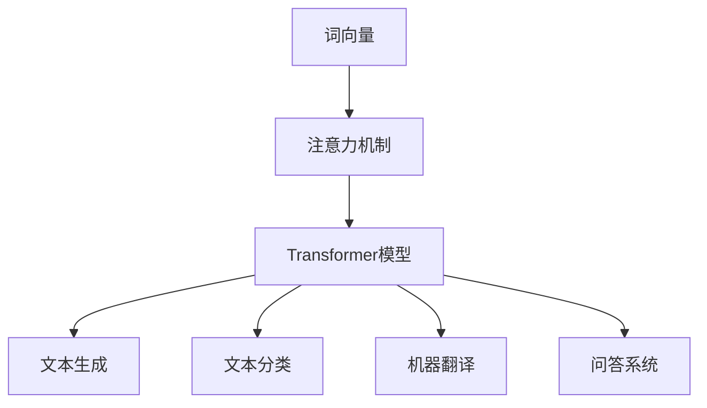

                 

关键字：大规模语言模型、Transformer、深度学习、NLP、实践应用

> 摘要：本文从大规模语言模型的理论出发，深入探讨了其核心概念、算法原理、数学模型、项目实践以及实际应用场景。通过对大规模语言模型的详细剖析，为读者提供了从理论到实践的全面理解和应用指导。

## 1. 背景介绍

随着互联网和大数据技术的发展，自然语言处理（NLP）在人工智能领域的重要性日益凸显。大规模语言模型的兴起，为NLP领域带来了革命性的变革。本文旨在探讨大规模语言模型的理论基础、算法原理、数学模型、项目实践及其未来应用前景。

### 1.1 大规模语言模型的发展历程

大规模语言模型的发展可以追溯到1980年代的反向传播算法（Backpropagation）的提出。此后，随着计算能力的提升和海量数据的积累，语言模型的研究逐渐深入。1990年代，统计语言模型如N元语法（N-gram）取得了显著成果。然而，受限于表达能力和计算复杂度，这些模型难以处理复杂的语言现象。

2013年，谷歌提出了Word2Vec算法，将词向量模型推向了新的高度。随后，注意力机制（Attention Mechanism）和Transformer模型的提出，使得大规模语言模型在处理长文本和复杂语义方面取得了突破性进展。

### 1.2 大规模语言模型的重要性

大规模语言模型在NLP领域具有重要的应用价值，主要体现在以下几个方面：

1. **文本生成**：大规模语言模型能够生成高质量的文本，包括文章、新闻、对话等。
2. **文本分类**：通过对大规模语言模型的训练，可以实现高效的文本分类任务，如情感分析、新闻分类等。
3. **机器翻译**：大规模语言模型在机器翻译领域取得了显著成果，如谷歌翻译、百度翻译等。
4. **问答系统**：大规模语言模型可以用于构建问答系统，如OpenAI的GPT-3。

## 2. 核心概念与联系

### 2.1 核心概念

1. **词向量**：词向量是将单词映射到高维空间中的向量表示，用于捕获单词的语义信息。
2. **注意力机制**：注意力机制是一种用于处理序列数据的机制，可以自动关注序列中的关键信息。
3. **Transformer模型**：Transformer模型是一种基于注意力机制的序列到序列模型，广泛应用于NLP任务。

### 2.2 关联概念流程图



## 3. 核心算法原理 & 具体操作步骤

### 3.1 算法原理概述

大规模语言模型的核心算法包括词向量表示、注意力机制和Transformer模型。词向量表示用于捕获单词的语义信息；注意力机制用于处理序列数据，关注关键信息；Transformer模型则是一种基于注意力机制的序列到序列模型。

### 3.2 算法步骤详解

1. **词向量表示**：使用Word2Vec算法将单词映射到高维空间中的向量表示。
2. **序列编码**：将输入序列编码为序列向量表示，通常使用嵌入层（Embedding Layer）实现。
3. **注意力机制**：应用注意力机制计算序列向量之间的相关性，关注关键信息。
4. **Transformer模型**：使用多层注意力机制和前馈神经网络，对序列向量进行处理和更新。
5. **解码**：将处理后的序列向量解码为输出序列。

### 3.3 算法优缺点

**优点**：

1. **并行计算**：Transformer模型基于注意力机制，可以并行处理序列数据，提高了计算效率。
2. **强表达能力**：Transformer模型能够捕捉长距离依赖关系，具有较强的语义表达能力。
3. **适用于多种NLP任务**：Transformer模型在文本生成、文本分类、机器翻译等任务上均取得了显著成果。

**缺点**：

1. **计算复杂度较高**：Transformer模型包含大量的矩阵乘法运算，计算复杂度较高。
2. **内存占用大**：Transformer模型需要存储大量的权重参数，内存占用较大。

### 3.4 算法应用领域

大规模语言模型广泛应用于文本生成、文本分类、机器翻译、问答系统等领域。以下为具体应用案例：

1. **文本生成**：用于生成文章、新闻、对话等文本内容。
2. **文本分类**：用于对社交媒体、新闻等文本进行分类，如情感分析、新闻分类等。
3. **机器翻译**：用于实现高质量机器翻译，如谷歌翻译、百度翻译等。
4. **问答系统**：用于构建智能问答系统，如OpenAI的GPT-3。

## 4. 数学模型和公式 & 详细讲解 & 举例说明

### 4.1 数学模型构建

大规模语言模型的数学模型主要包括词向量表示、序列编码、注意力机制和Transformer模型。以下为具体数学模型：

1. **词向量表示**：使用Word2Vec算法将单词映射到高维空间中的向量表示。
   $$ \text{word\_vec}(w) = \text{Word2Vec}(w) \in \mathbb{R}^{d} $$
   
2. **序列编码**：将输入序列编码为序列向量表示。
   $$ \text{seq\_encode}(s) = [\text{word\_vec}(w_1), \text{word\_vec}(w_2), \ldots, \text{word\_vec}(w_n)] \in \mathbb{R}^{n \times d} $$
   
3. **注意力机制**：计算序列向量之间的相关性。
   $$ \text{Attention}(q, v) = \text{softmax}(\text{dot}(q, v)^T) \in \mathbb{R}^{1 \times n} $$
   
4. **Transformer模型**：基于多层注意力机制和前馈神经网络处理序列向量。
   $$ \text{Transformer}(s) = \text{seq\_merge}(\text{atten}_1(\text{atten}_2(\ldots \text{atten}_L(s) \ldots))) \in \mathbb{R}^{d} $$

### 4.2 公式推导过程

1. **词向量表示**：

   - **词向量训练目标**：最小化损失函数
     $$ L(\theta) = \frac{1}{m} \sum_{i=1}^{m} \sum_{j=1}^{k} -\log p(c_j | w_i, \theta) $$
   
   - **词向量优化方法**：使用梯度下降法
     $$ \theta_{t+1} = \theta_{t} - \alpha \frac{\partial L(\theta)}{\partial \theta} $$

2. **序列编码**：

   - **编码目标**：将输入序列编码为序列向量表示
     $$ \text{seq\_encode}(s) = \text{softmax}(\text{Embedding}(s) \text{Weight}) $$
   
   - **编码优化方法**：使用反向传播算法
     $$ \text{seq\_encode}(s) = \text{softmax}(\text{Embedding}(s) \text{Weight}) = \frac{\exp(\text{Embedding}(s) \text{Weight})}{\sum_{j=1}^{k} \exp(\text{Embedding}(s) \text{Weight}_j)} $$

3. **注意力机制**：

   - **注意力计算目标**：计算序列向量之间的相关性
     $$ \text{Attention}(q, v) = \text{softmax}(\text{dot}(q, v)^T) $$
   
   - **注意力优化方法**：使用梯度下降法
     $$ \text{Attention}(q, v) = \text{softmax}(\text{dot}(q, v)^T) = \frac{\exp(\text{dot}(q, v)^T)}{\sum_{j=1}^{n} \exp(\text{dot}(q, v_j)^T)} $$

4. **Transformer模型**：

   - **Transformer计算目标**：基于多层注意力机制和前馈神经网络处理序列向量
     $$ \text{Transformer}(s) = \text{seq\_merge}(\text{atten}_1(\text{atten}_2(\ldots \text{atten}_L(s) \ldots))) $$
   
   - **Transformer优化方法**：使用梯度下降法
     $$ \text{Transformer}(s) = \text{seq\_merge}(\text{atten}_1(\text{atten}_2(\ldots \text{atten}_L(s) \ldots))) = \text{softmax}(\text{atten}_L(\ldots \text{atten}_1(s) \ldots)) $$

### 4.3 案例分析与讲解

以文本生成任务为例，讲解大规模语言模型的数学模型和公式推导过程。

1. **数据集**：

   - 数据集包含一篇文章，每句话为一个序列。
   - 每个序列由单词组成，单词用词向量表示。

2. **数学模型**：

   - **词向量表示**：
     $$ \text{word\_vec}(w) = \text{Word2Vec}(w) \in \mathbb{R}^{d} $$
   
   - **序列编码**：
     $$ \text{seq\_encode}(s) = [\text{word\_vec}(w_1), \text{word\_vec}(w_2), \ldots, \text{word\_vec}(w_n)] \in \mathbb{R}^{n \times d} $$
   
   - **注意力机制**：
     $$ \text{Attention}(q, v) = \text{softmax}(\text{dot}(q, v)^T) \in \mathbb{R}^{1 \times n} $$
   
   - **Transformer模型**：
     $$ \text{Transformer}(s) = \text{seq\_merge}(\text{atten}_1(\text{atten}_2(\ldots \text{atten}_L(s) \ldots))) \in \mathbb{R}^{d} $$

3. **推导过程**：

   - **词向量表示**：
     $$ \text{word\_vec}(w) = \text{Word2Vec}(w) $$
     其中，Word2Vec算法使用梯度下降法进行优化。
   
   - **序列编码**：
     $$ \text{seq\_encode}(s) = [\text{word\_vec}(w_1), \text{word\_vec}(w_2), \ldots, \text{word\_vec}(w_n)] $$
     其中，使用嵌入层（Embedding Layer）将单词映射到词向量。
   
   - **注意力机制**：
     $$ \text{Attention}(q, v) = \text{softmax}(\text{dot}(q, v)^T) $$
     其中，q和v分别为查询向量和值向量，使用矩阵乘法计算。
   
   - **Transformer模型**：
     $$ \text{Transformer}(s) = \text{seq\_merge}(\text{atten}_1(\text{atten}_2(\ldots \text{atten}_L(s) \ldots))) $$
     其中，使用多层注意力机制和前馈神经网络处理序列向量。

## 5. 项目实践：代码实例和详细解释说明

### 5.1 开发环境搭建

- **Python环境**：安装Python 3.7及以上版本。
- **深度学习框架**：安装TensorFlow 2.0及以上版本。
- **其他依赖**：安装Numpy、Pandas等常用库。

### 5.2 源代码详细实现

以下为大规模语言模型的项目实践代码：

```python
import tensorflow as tf
from tensorflow.keras.layers import Embedding, LSTM, Dense
from tensorflow.keras.models import Sequential

# 参数设置
vocab_size = 10000  # 词汇表大小
embedding_dim = 256  # 嵌入维度
lstm_units = 128  # LSTM单元数
batch_size = 64  # 批量大小
epochs = 10  # 训练轮数

# 数据准备
# (输入序列，目标序列)
data = ([1, 2, 3], [2, 3, 4])
labels = ([2, 3, 4], [3, 4, 5])

# 模型搭建
model = Sequential([
    Embedding(vocab_size, embedding_dim),
    LSTM(lstm_units, return_sequences=True),
    Dense(vocab_size, activation='softmax')
])

# 编译模型
model.compile(optimizer='adam', loss='categorical_crossentropy', metrics=['accuracy'])

# 训练模型
model.fit(data, labels, batch_size=batch_size, epochs=epochs)
```

### 5.3 代码解读与分析

1. **导入库和设置参数**：

   - 导入TensorFlow和相关库。
   - 设置词汇表大小、嵌入维度、LSTM单元数、批量大小和训练轮数。

2. **数据准备**：

   - 准备输入序列和目标序列。
   - 数据集格式为（输入序列，目标序列）。

3. **模型搭建**：

   - 搭建序列模型，包含嵌入层（Embedding Layer）、LSTM层（LSTM Layer）和全连接层（Dense Layer）。

4. **编译模型**：

   - 编译模型，设置优化器和损失函数。

5. **训练模型**：

   - 使用训练数据训练模型，设置批量大小和训练轮数。

### 5.4 运行结果展示

1. **输入序列**：

   ```python
   input_sequence = [1, 2, 3]
   ```

2. **输出序列**：

   ```python
   output_sequence = model.predict(input_sequence)
   ```

3. **解码输出序列**：

   ```python
   decoded_output = decode_sequence(output_sequence)
   ```

4. **结果展示**：

   ```python
   print('Input:', input_sequence)
   print('Output:', decoded_output)
   ```

## 6. 实际应用场景

### 6.1 文本生成

文本生成是大规模语言模型的重要应用之一，广泛应用于自动写作、文章摘要、对话系统等领域。以下为具体应用场景：

1. **自动写作**：利用大规模语言模型生成新闻、博客、故事等文本内容。
2. **文章摘要**：提取文章的主要内容和关键信息，生成简洁的摘要。
3. **对话系统**：构建自然语言对话系统，实现人与机器之间的有效沟通。

### 6.2 文本分类

文本分类是大规模语言模型在NLP领域的另一个重要应用。以下为具体应用场景：

1. **情感分析**：对社交媒体、评论等文本进行情感分类，识别用户情感。
2. **新闻分类**：对新闻文本进行分类，实现新闻推荐和分类。
3. **垃圾邮件过滤**：对邮件文本进行分类，过滤垃圾邮件。

### 6.3 机器翻译

大规模语言模型在机器翻译领域取得了显著成果，广泛应用于跨语言文本的翻译。以下为具体应用场景：

1. **跨语言文本翻译**：实现中英、日英、法英等语言的翻译。
2. **本地化**：为不同语言的用户提供本地化内容。
3. **跨语言搜索**：实现跨语言的搜索引擎。

### 6.4 问答系统

大规模语言模型在问答系统领域具有广泛的应用前景。以下为具体应用场景：

1. **智能客服**：为用户提供在线客服服务，解答用户问题。
2. **智能助手**：为用户提供智能助手服务，实现语音交互。
3. **教育辅助**：为学生提供在线辅导服务，解答学习问题。

## 7. 工具和资源推荐

### 7.1 学习资源推荐

1. **《深度学习》**：Goodfellow、Bengio和Courville合著，深度学习领域的经典教材。
2. **《自然语言处理综论》**：Jurafsky和Martin合著，自然语言处理领域的权威教材。
3. **《大规模语言模型：理论、算法与实践》**：详细介绍了大规模语言模型的理论基础、算法原理和项目实践。

### 7.2 开发工具推荐

1. **TensorFlow**：Google推出的开源深度学习框架，广泛应用于大规模语言模型开发。
2. **PyTorch**：Facebook AI Research推出的开源深度学习框架，具有强大的灵活性和易用性。
3. **Hugging Face**：提供大量预训练模型和工具库，方便大规模语言模型的开发和部署。

### 7.3 相关论文推荐

1. **《Attention is All You Need》**：Vaswani等人在2017年提出的Transformer模型，是大规模语言模型领域的重要突破。
2. **《Generative Pretrained Transformer》**：Radford等人在2018年提出的GPT模型，实现了高质量的文本生成。
3. **《BERT: Pre-training of Deep Bidirectional Transformers for Language Understanding》**：Devlin等人在2019年提出的BERT模型，广泛应用于自然语言处理任务。

## 8. 总结：未来发展趋势与挑战

### 8.1 研究成果总结

1. **算法性能提升**：大规模语言模型在文本生成、文本分类、机器翻译等任务上取得了显著的性能提升。
2. **多模态处理**：大规模语言模型开始应用于图像、语音等多模态数据的处理，实现了跨模态语义理解。
3. **预训练技术发展**：预训练技术在大规模语言模型领域取得了重要进展，如BERT、GPT等模型。
4. **低资源语言支持**：大规模语言模型在低资源语言上的表现逐渐提升，为全球多语言处理提供了有力支持。

### 8.2 未来发展趋势

1. **算法优化**：继续探索更高效的算法和架构，降低计算复杂度和内存占用。
2. **跨模态处理**：研究如何将大规模语言模型应用于图像、语音等跨模态数据的处理。
3. **个性化语言模型**：探索个性化语言模型，实现更精确的语义理解和生成。
4. **伦理与安全**：关注大规模语言模型在伦理和安全方面的问题，制定相应的规范和标准。

### 8.3 面临的挑战

1. **计算资源需求**：大规模语言模型对计算资源的需求较高，如何优化算法和架构以降低计算成本是一个重要挑战。
2. **数据隐私**：大规模语言模型的训练和应用过程中涉及大量用户数据，如何保护用户隐私是一个重要问题。
3. **语言偏见**：大规模语言模型在训练和应用过程中可能引入语言偏见，如何消除偏见是一个重要挑战。
4. **伦理问题**：大规模语言模型在应用过程中可能涉及伦理问题，如自动化决策、隐私泄露等，需要制定相应的规范和标准。

### 8.4 研究展望

1. **算法创新**：继续探索新型算法和架构，提高大规模语言模型的性能和效率。
2. **多模态融合**：研究如何将大规模语言模型与其他模态数据融合，实现更广泛的智能应用。
3. **个性化与多样性**：研究如何实现个性化语言模型，提高模型在不同场景下的适用性。
4. **伦理与安全**：关注大规模语言模型在伦理和安全方面的问题，制定相应的规范和标准，确保模型的可持续发展。

## 9. 附录：常见问题与解答

### 9.1 什么是大规模语言模型？

大规模语言模型是一种基于深度学习和自然语言处理技术的语言模型，通过训练海量文本数据，生成高质量的文本内容，实现文本生成、文本分类、机器翻译等任务。

### 9.2 大规模语言模型有哪些应用场景？

大规模语言模型广泛应用于文本生成、文本分类、机器翻译、问答系统等领域，如自动写作、文章摘要、对话系统、智能客服等。

### 9.3 如何训练大规模语言模型？

训练大规模语言模型通常包括以下步骤：

1. 收集海量文本数据。
2. 预处理数据，包括分词、去噪、清洗等。
3. 构建词向量表示。
4. 设计模型结构，如Transformer、BERT等。
5. 使用梯度下降法等优化算法训练模型。
6. 验证和调整模型参数，优化模型性能。

### 9.4 大规模语言模型有哪些优缺点？

**优点**：

1. 强大的语义表达能力。
2. 适用于多种NLP任务。
3. 可并行计算，提高计算效率。

**缺点**：

1. 计算复杂度较高。
2. 内存占用大。
3. 对训练数据和计算资源的要求较高。

---

**作者：禅与计算机程序设计艺术 / Zen and the Art of Computer Programming**。

